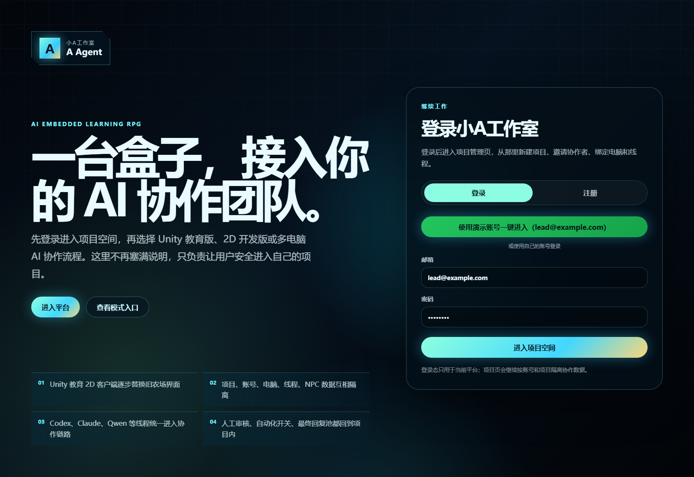
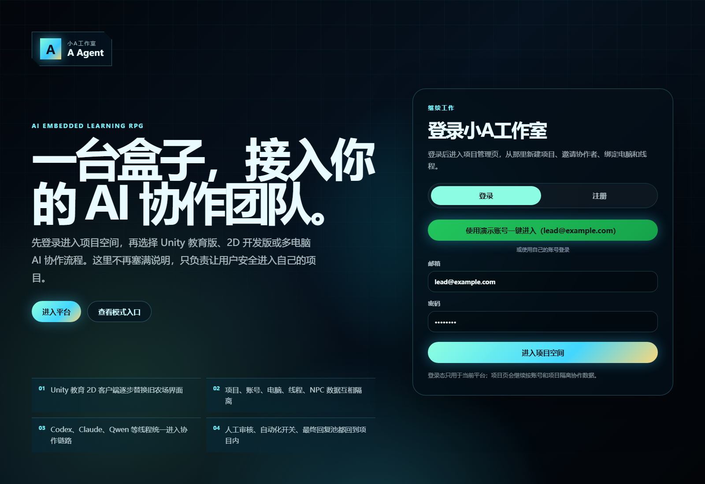
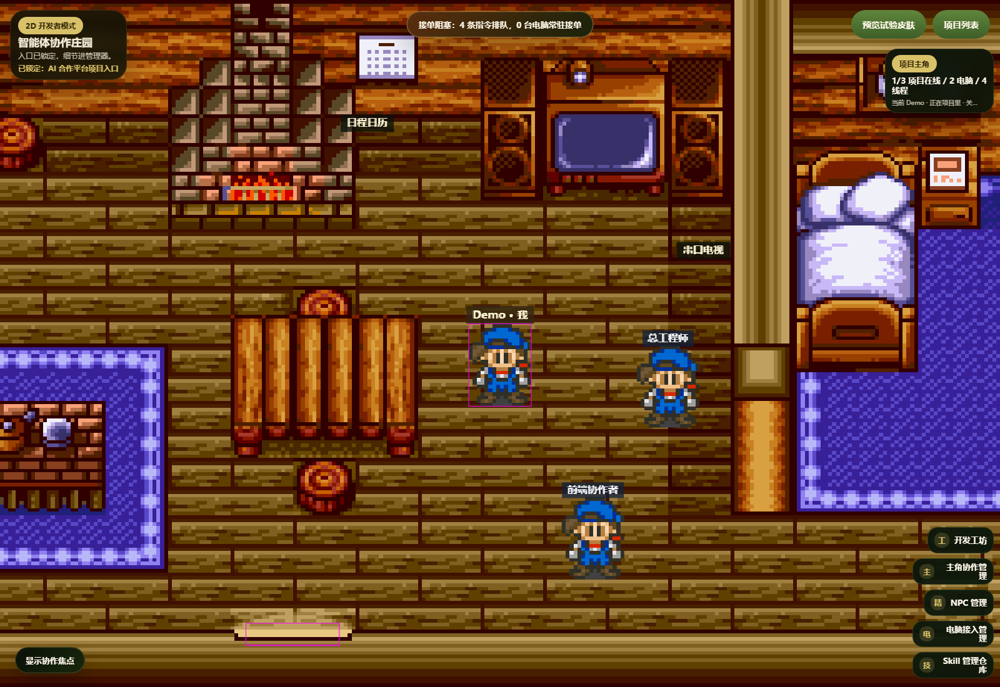
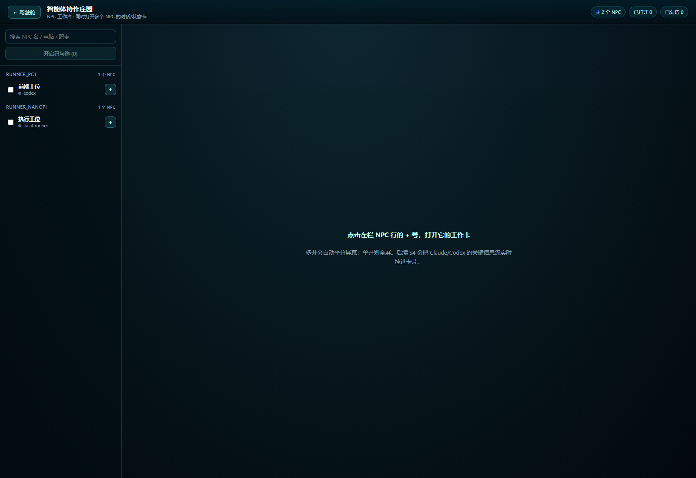
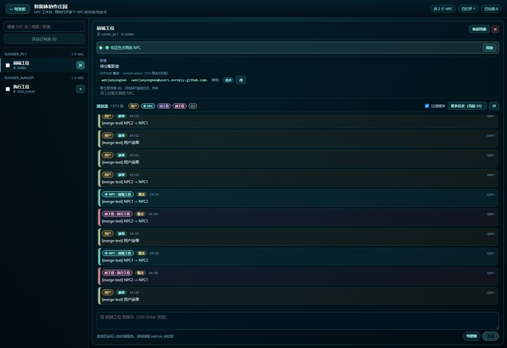
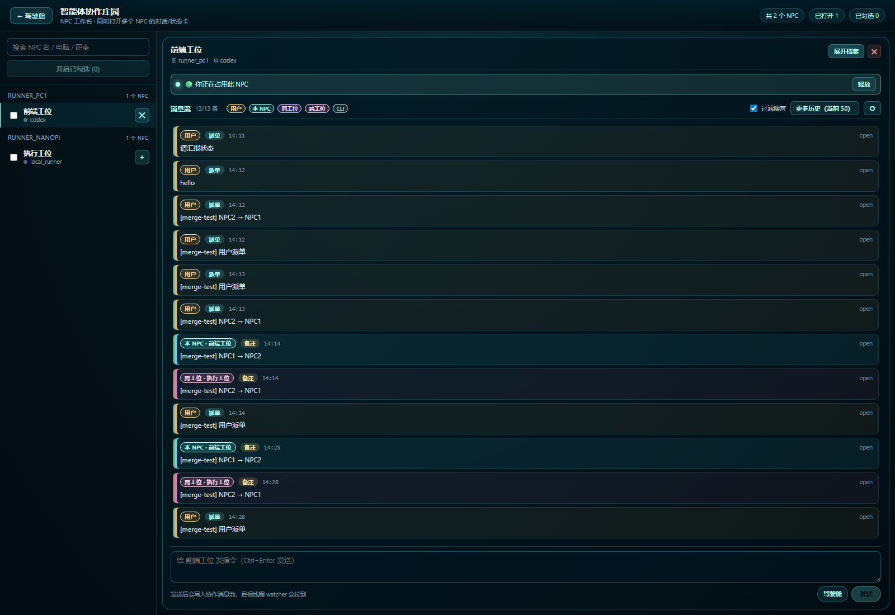

# AI 协作平台 · 第一版使用说明（带截图）

> 面向"我是新用户，怎么 1-3 步开干"的实战手册。所有截图都来自 `docs/screenshots/v1/`，是平台真实运行画面。

---

## 0 · 起服务（每次开机一次）

### 一台电脑（单机版，最简）

```powershell
# 1) 起后端 API（保留这个窗口）
cd D:\ai合作产品\apps\api
python -m uvicorn app.main:app --host 127.0.0.1 --port 8010

# 2) 另开一个窗口起前端
cd D:\ai合作产品\apps\web
npm run dev
# 默认 http://127.0.0.1:3000
```

**坑点**（已在 `feedback_windows_chinese_env.md` 记录）：
- 改完后端代码必须先 `cmd /c "taskkill /F /IM python.exe"` 再重启
- 中文路径 `D:\ai合作产品` 跑不动 eslint，跑 typecheck 没问题
- 不要用 PowerShell 的 `Stop-Process -Id`，会被中文路径误解析

### 多台电脑（局域网协作）

详见 `infra/README.md` 的 LAN 模式章节，要点：
- 一台机器跑 API，所有机器跑各自的 watcher / runner
- watcher 用 SSH 连本机 git，每个 NPC 配独立 git author
- 设置 `CORS_ALLOWED_ORIGINS` 包含每台前端机器的 origin

---

## 1 · 登录

打开浏览器 → `http://127.0.0.1:3000/login`



**默认账号**（seed 出来的）：
| 账号 | 角色 | 密码 |
|---|---|---|
| `lead@example.com` | 项目负责人 / Demo | `demo-pass` |
| `chief@local` | 总工程师（双人冒烟用） | `demo-pass` |

**注意**：legacy login 不真的校验密码（`feedback_legacy_auth_password`），但密码字段最少 4 字符，留 demo-pass 就行。

---

## 2 · 选项目 / 看项目列表

登录后会落到项目列表页：`/projects`



主项目是 `proj_ai_collab`（= 平台自己的 GitHub 仓库）。这个项目既是"被开发"对象，也是平台跑通能力的真实证据。

---

## 3 · 项目驾驶舱（三层下钻）

点项目名进入：`/projects/proj_ai_collab`



**驾驶舱看什么**：
- 顶部工具条：scorecard 合格性 grade chip / "NPC 工作台 →" 按钮 / "📣 全员广播"按钮
- 中部：工位分组卡（按 computer_node 切片）
- 下部：跨工位 Handoff 面板、需求触发链、协作消息池入口

**最常用 3 个动作**：
1. **派全员广播**：点 📣 → 写内容 → preview（看 token 估算 + blocker） → commit
2. **进 NPC 工作台**：点 "NPC 工作台 →" 进入瓷砖式同时管理多 NPC
3. **看 scorecard**：grade chip 显示项目健康度（A-F），点开看详细自检结果

---

## 4 · NPC 工作台 ← **核心日常面板**

`/projects/proj_ai_collab/workbench`

### 4.1 空状态



**左栏**：
- 搜索：按 NPC 名 / 电脑 / 职责
- 工位分组：每个 computer_node 一组，"未绑定电脑"单独一组
- 每行 NPC：勾选框（批量开） + NPC 名 + provider + + 号（开瓷砖）

**右侧空时**：提示"点左栏 + 号打开 NPC 工作卡"

### 4.2 双开 NPC（核心场景）

点两个 NPC 行的 + 号：



每个瓷砖从上到下：

| 区域 | 看什么 |
|---|---|
| **顶栏 header** | NPC 名 / 🖥 电脑 / ⚙ provider / 模型 / 自动化 pill |
| **占用 bar** ✨新 | 🟢/🟡/⚪ 占用状态 + 当前持有人 + 占用/抢占/释放按钮 |
| **档案区**（可收起）| 职责 / Skill / 知识库 / GitHub 身份 / **同工位伙伴**（互发派单入口） |
| **消息流工具条** | 条数 / 6 轨色带图例 / 过滤噪声 / 加载更多历史 / 刷新 |
| **消息流** | 6 角色彩色色带 + role chip + 派单/回执/错误 chip + 翻译时间 |
| **派单输入框** | 身份选择（用户 / 代某 NPC 同工位互发）+ 内容 + Ctrl+Enter |

### 4.3 收起档案，让消息流更显眼

每个瓷砖右上角点"收起档案"：



档案折叠后，消息流占满中部，6 轨彩色一目了然。

---

## 5 · 占用锁怎么用（多人协作必读）

### 5.1 三种状态

| 状态 | 显示 | 含义 |
|---|---|---|
| 🟢 你正在占用 | 青底 + "释放"按钮 | 是你打开的，30s 心跳自动续 |
| 🟡 别人占用中 | 黄底 + "申请抢占"按钮 + 输入框置灰 | 别人在用，不能直接发 |
| ⚪ 空闲 | 灰底 + "占用"按钮 | 没人用，可以拿 |

### 5.2 自动占用 / 释放（不需要手点）

- **打开瓷砖** → 自动 soft-claim（force=false，没人占就拿，有人占就显示黄）
- **30s 一次心跳** → `POST /occupy` 续 `heartbeat_at`，acquired_at 不变
- **关瓷砖** → 自动 release（best-effort）
- **90s 不续约** → 后端视为过期，下一个查询自动空

### 5.3 抢占场景

A 在用 NPC1，B 也想用：
1. B 打开 NPC1 瓷砖 → 显示 🟡 "Demo 正在占用"，输入框置灰
2. B 点"申请抢占" → 后端记 `preempted_user=A`，B 拿到锁
3. A 那边下一次心跳/查询会发现自己已经被踢，badge 变成"被人占用"

> 第一版 UI 不会主动通知 A "你被踢了"，A 看下一次刷新发现 badge 变了。下一版会加 toast。

---

## 6 · 派单怎么走（4 种通道）

### 6.1 用户 → NPC（最常用）

瓷砖底部 textarea → 直接写指令 → Ctrl+Enter / 点"发送"
- 写入 `CollaborationMessage`：sender_type=human, recipient_type=thread_workstation
- 这个 NPC 所在机器的 watcher 会拉到，把指令打到本机 Claude CLI 终端

### 6.2 同工位 NPC 互发（NPC1 代发给 NPC2）

档案里"同工位伙伴"区，点对方名字旁边的 "代他派" 按钮 → 输入框身份切到 "代 X 同工位互发" → 写内容发送
- sender_type=agent, sender_id=对方 seat.id
- 默认免审（同工位同心智）

### 6.3 跨工位转手（Handoff）

驾驶舱"跨工位 Handoff"区，点"新建 Handoff"
- 强制经过审核（除非项目级 review_policy 设了 skip）
- 数据走 `Handoff` 表，payload 扁平化（`project_handoff_payload_schema`）

### 6.4 全员/工位广播

驾驶舱顶部 "📣 全员广播" → 写内容 → preview（看每个 NPC 的审核策略 / token 估算 / blocker） → commit

---

## 7 · 三级审核策略（怎么开）

### 7.1 项目级
- 后端 PATCH `/api/projects/<id>/review-policy` payload `{ "default": "always|never|cross_workstation_only" }`
- 第一版前端 UI 还没挂，要 curl 或在工位/NPC 级别覆盖

### 7.2 工位级
- 工位分组卡 header → "工位档案" → review_policy 下拉

### 7.3 NPC 级
- NpcTile 档案"GitHub 身份"行 → 点"改" → 审核策略下拉：
  - `inherit` 跟工位/项目
  - `force` 强审（必经）
  - `skip` 免审（直接落地）

### 7.4 优先级铁证

```
前端工位 (workstation=skip) → requires_review=false, source=workstation
执行工位 (NPC force)        → requires_review=true,  source=npc
```
同一项目同一次广播，两个 seat 因覆盖层级不同，结果不同 → 优先级真生效。

---

## 8 · 触发式需求链怎么用

新建 Requirement 时填三个字段：
- `target_seat_id`：必填，下拉选哪个 NPC
- `trigger`：
  - `manual` 手动触发
  - `on_task_status:done` 某 task 完成时
  - `on_message_status:completed` 某消息走完时
  - `on_requirement:<id>:done` 前置 requirement 完成时
- `dependency_requirement_id`（可选）

后端 `dispatch_requirement` 状态变化时自动调 `_auto_dispatch_follow_up_requirement`。

第一版前端入口在驾驶舱"需求"区。

---

## 9 · 看 CLI 端协作（黑盒变白盒）

每台跑 watcher 的电脑，开一个终端跑：
```powershell
.\scripts\start-thread-watcher.ps1 -Seat <seat-id>
```

会看到：
```
[20:15:32] inbound: 用户派单 → 请把 typecheck 跑一下
[20:15:35] CLI 输出: > tsc --noEmit ...
[20:15:42] outbound: 回执 ok=2 error=0
```

CLI 终端 = 平台的"黑匣子录音"，每条消息流都打到这。详见 `feedback_cli_visibility.md`。

---

## 10 · 自验证（5 个脚本，全绿才算合格）

```powershell
# R1-R3 全链路（16 项）
python scripts/validate-r1-r3-fullchain.py

# 占用锁后端（7 步双用户）
python scripts/validate-npc-occupancy.py

# 占用锁前端生命周期（4 步）
python scripts/validate-npc-occupancy-frontend.py

# 6 轨对话框（人/本NPC/同工位/跨工位/CLI/系统）
python scripts/validate-npc-dialog-merge.py

# 截图（运行后看 artifacts/platform-screenshots-v1/）
node scripts/validate-screenshots-v1.mjs
```

预期输出：每个脚本最后一行都带 `ALL XX CHECKS PASSED ✓` 或 `PASS=N FAIL=0`。

**第一版可用平台 = 5 个脚本全绿 + 截图能拍出来**。

---

## 11 · 出问题怎么办

| 症状 | 解 |
|---|---|
| API 401 | 检查 `Authorization: Bearer <token>`；浏览器里登过没（cookie 名 `ai_collab_session`）|
| 跨域被 CORS 拦 | 启 API 时设 `CORS_ALLOWED_ORIGINS=http://127.0.0.1:3000,http://127.0.0.1:3100` |
| 改完代码 API 没反应 | `cmd /c "taskkill /F /IM python.exe"` 全杀，再重启 |
| SQLite 锁了 | 同上，删 `ai_collab.db` 前必须杀干净 python（`feedback_sqlite_lock`）|
| 中文路径 alembic 报 GBK | `feedback_alembic_windows`：alembic.ini 里别带中文 |
| eslint 跑不动 | 已知问题（中文路径），暂时跳过 ESLint，用 typecheck 兜底 |

---

## 12 · 下一步用户能干啥

1. **拿这个仓库本身做练习**：`proj_ai_collab` 就是平台代码库，给它派"加一个 / 修一个"的需求，看自己派给自己跑能不能行
2. **接局域网第二台机器**：按 `infra/README.md` 局域网模式起 watcher
3. **把你自己的项目加进来**：新建一个 project 绑你自己的 GitHub repo，建工位、建 NPC、起 watcher
4. **试试占用锁的双用户场景**：开两个浏览器（一个开隐身窗口）分别用 lead 和 chief 登录，同时打开同一个 NPC 瓷砖，看抢占效果

---

## 附 · 截图清单

| 文件 | 用途 |
|---|---|
| `docs/screenshots/v1/01-login.png` | 登录页 |
| `02-projects-list.png` | 项目列表 |
| `03-cockpit.png` | 项目驾驶舱 |
| `04-workbench-empty.png` | NPC 工作台空状态 |
| `05-workbench-2-tiles-with-occupancy.png` | 双开瓷砖（含占用锁 badge） |
| `06-workbench-stream-focus.png` | 收起档案后的消息流主视图 |

> 重新生成截图：`node scripts/validate-screenshots-v1.mjs`（要求 API + web 都已起，参见 §0）。脚本会先写入 `artifacts/platform-screenshots-v1/`（gitignore），如要更新文档，复制到 `docs/screenshots/v1/`。
