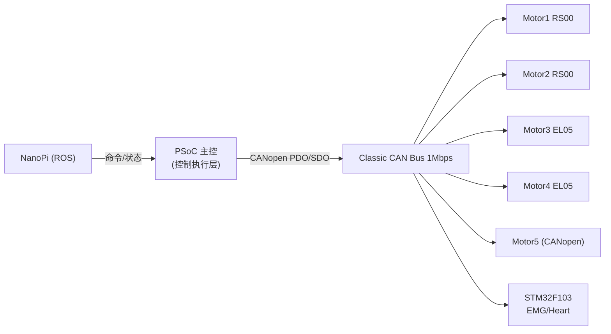

# CANopen + ROS 系统集成方案（5电机 + PSoC + STM32F103 + NanoPi）

## 1. 结论与目标

本系统统一采用以下主方案：

- 5 个电机全部使用 **CANopen**。
- **Infineon PSoC** 作为电机控制执行节点，接收 NanoPi ROS 指令并下发到电机。
- **STM32F103** 作为传感器节点（肌电/心率），提供两种接入方式：
  - 方案 A（快速）：私有帧 + 硬件过滤
  - 方案 B（推荐长期）：CANopenNode（TPDO 上报）

目标是先稳定跑通控制链路，再逐步标准化传感器链路。

---

## 2. 总线与物理层约束

全网必须满足：

1. 同一条总线全部为 **Classic CAN**（不要发送 CAN FD 帧）
2. 波特率统一（建议 `1Mbps`）
3. 终端电阻两端各 `120Ω`
4. 节点 ID 唯一，CANopen COB-ID 不冲突

备注：PSoC 的 CANFD 控制器可工作在 Classic CAN 模式，需关闭 FD/BRS。

---

## 3. 系统架构

推荐职责划分：

- NanoPi：上层策略/人机交互/ROS 网络接口
- PSoC：实时控制调度、状态聚合、故障处理
- 电机：执行控制并反馈状态
- STM32：采集并上报肌电/心率

---

## 4. 节点与 ID 规划建议

建议 Node-ID：

- Motor1: 0x01
- Motor2: 0x02
- Motor3: 0x03
- Motor4: 0x04
- Motor5: 0x05
- STM32 Sensor: 0x21
- PSoC（如作为 CANopen Master 可无 Node-ID；如作为从站可用 0x11）

建议规则：

- 电机 PDO 使用标准 CANopen COB-ID
- 私有帧（若使用）避免占用 CANopen 功能区；推荐扩展帧专段
- 所有节点 Heartbeat 周期统一（如 100ms）

---

## 5. PSoC 执行层设计

PSoC 需要实现三类任务：

1. `ros_command_task`
- 接收 NanoPi 指令（位置/速度/力矩目标）
- 做限幅、斜坡、互锁状态机检查

2. `canopen_motor_task`
- 按控制周期下发 RPDO/SDO
- 接收 TPDO，更新每个电机状态

3. `safety_task`
- 心跳超时、总线离线、过流/过温处理
- 一键停机与故障复位流程

建议控制周期：

- 主控制环：1~2ms
- 状态上报：10~20ms
- 心跳监测：100ms

---

## 6. STM32F103 传感器节点方案

## 6.1 方案 A（快速落地）

特征：

- 不上 CANopen 协议栈
- 使用私有 CAN 帧上报 EMG/Heart
- 配置 bxCAN 硬件 Filter，仅接收与本节点相关控制帧

适用：

- 快速联调
- 先验证采集链路与总线负载

注意：

- PSoC 需要做私有帧解析与时间戳管理
- ROS 侧需自定义消息映射

## 6.2 方案 B（推荐长期）

特征：

- 上 `CANopenNode`
- 通过 TPDO 周期上报 EMG/Heart
- 可通过 SDO 修改采样率/滤波参数

建议映射示例：

- TPDO1: EMG（ch1/ch2/rms）
- TPDO2: Heart（bpm/hrv/quality）

优点：

- 与 5 电机协议统一
- ROS 侧标准化程度高
- 后期维护成本低

---

## 7. ROS 接入建议（NanoPi）

建议路径：

1. 底层驱动：SocketCAN（`can0`）
2. 协议层：`ros2_canopen`（ROS2）或 `ros_canopen`（ROS1）
3. 话题层：
- `/joint_commands` -> PSoC 控制输入
- `/joint_states` <- PSoC 汇总状态
- `/rehab/emg` <- STM32 传感器
- `/rehab/heart` <- STM32 传感器

如果 NanoPi 不直接做 CANopen Master，也可让 PSoC 做主站，NanoPi 与 PSoC 走串口/以太网 ROS bridge。

---

## 8. 带宽预算建议

在 1Mbps 下，建议长期平均负载控制在 `<= 60%`。

估算项：

- 5 电机状态 TPDO（10ms）
- 5 电机控制 RPDO（2~5ms）
- STM32 传感器上报（10~20ms）
- Heartbeat + NMT + 偶发 SDO

若负载超限优先优化：

1. 降低非关键上报频率
2. 缩减 PDO 载荷
3. 只在状态变化时上报部分信息

---

## 9. 分阶段实施计划

阶段 1：总线打通

- 全节点统一 Classic CAN + 1Mbps
- 确认每个电机 CANopen 模式可通信

阶段 2：电机闭环

- PSoC 下发 5 电机控制目标
- 回读状态并做基础安全策略

阶段 3：传感器接入

- 先上 STM32 方案 A（私有帧）验证数据链路
- 再迁移到方案 B（CANopenNode）

阶段 4：ROS 联调

- NanoPi 下发轨迹/模式指令
- 采集 joint_states + EMG + Heart 并做上层融合

---

## 10. 风险与规避

风险 1：协议混用导致维护复杂

- 规避：电机统一 CANopen；STM32 过渡期私有帧，最终也上 CANopen

风险 2：总线拥塞导致控制抖动

- 规避：限流上报、分级频率、控制帧优先级规划

风险 3：F103 处理不过来

- 规避：硬件过滤 + 中断最小化 + DMA/环形缓冲（如可用）

---

## 11. 最终建议

你当前决策非常合理：

- 5 个电机全 CANopen
- PSoC 做执行层
- STM32 先私有上报、后 CANopen 标准化

这是“可快速落地 + 长期可维护”的最优折中方案。
