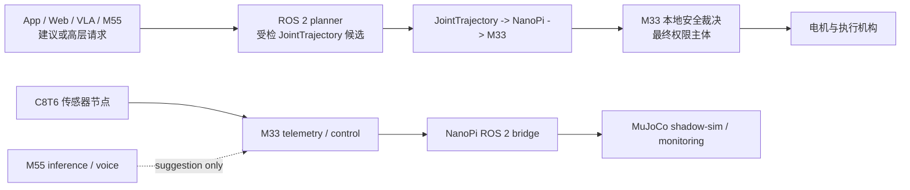

# PSOC E84 智能康复机械臂

## 项目简介

本仓库是面向智能康复机械臂研究原型的统一工程：PSoC Edge E84 的 Cortex-M33 负责实时控制与最终安全裁决，Cortex-M55 承载语音、联网与边缘模型建议，STM32F103C8T6（下文简称 C8T6）采集传感器；NanoPi 运行 ROS 2 bridge，ROS 2 与 MuJoCo 提供规划、设备接入和仿真；Android/Capacitor App、Web 与 API 提供交互和非实时数据工作流；VLA 只生成高层任务请求或离线候选。

仓库把原先分散的固件、ROS、平台和 AI 历史迁入一棵可审计的目录树。它是研发基线，不是已完成的六自由度临床产品。

## 系统架构



正式运动路径必须保持 `JointTrajectory -> NanoPi -> M33`。NanoPi 负责 ROS/CAN 桥接和前置门控，M33 才是架构上的最终安全裁决者。App、Web、VLA、M55 和上层 planner 只能提交建议、请求或候选轨迹，不能直接授予运动权限，也不能旁路 M33。

## 安全边界

- 真实 target 必须同时通过 NanoPi gate 与 M33 本地检查；ROS target 发送默认关闭，平台 HTTP 成功、模型高置信度、UI 状态或 MuJoCo 正常均不等于运动许可。
- M55 的模型结果和 VLA 输出仅为 suggestion/request；Android/Capacitor 与 Web/API 不直接发送 CAN、电流、扭矩或原始 setpoint，也不能释放急停。
- 当前存在已知缺口 `SET_TARGET_PREARM_RECHECK_GAP`：accepted `SET_TARGET` 路径尚未证明会在每条 target 应用前重新执行完整 pre-arm/current-mode gate。关闭并验证该缺口前，不得宣称 M33 已完整落实临床最终裁决。
- BLE 当前 profile 对 `move:*`、`mode:*` 与 `stop` 保持只读拒绝；急停必须最终落到可证明的本地 M33/硬件链路。

完整约束、默认 flags、失败行为和证据位置见[安全边界文档](docs/protocols/safety-boundary.md)。

## 当前已验证

以下“已验证”是截至本 README 提交前已有的迁移、源码契约与自动化证据，不等价于新的实机验收：

- 六组来源历史已按精确 source SHA 导入，来源提交保持为 integration merge 的第二父提交；provenance 测试可复核 ancestry、路径与来源映射。
- M33 与 C8T6 已在 2026-07-13 从新前缀完成源码构建；M55 编译后在链接阶段因缺失 `ifx_deepcraft_wake_*` 实现而失败。三者均未烧录或进行实机闭环，详细环境与警告见[迁移验证记录](docs/validation/migration-validation.md)。
- ROS 2 正式路径边界测试已验证 mainline 不启用 demo trajectory、VLA 不直连 CAN、target TX 默认关闭，以及 M33 仍是最终裁决点；本机缺少 ROS 2 Jazzy 与 `colcon`，因此 ROS build/test 结果为 `not-run`，不是通过声明。
- 平台 Web 构建已通过；康复 API 的 `test_rehab_arm_app_backend.py`、`test_rehab_arm_app_live_emg.py`、`test_rehab_arm_sync.py` 与 `test_rehab_arm_vla_closed_loop_status.py` 四文件测试为 **55 passed**；完整 `platform/api/tests` 因缺失 `runner.logs` 在 collection 阶段失败，不作为门禁。Android/Capacitor Web 资源同步已通过；因缺少 Java、ADB 与 Android SDK 环境，APK 构建为 `not-run`。
- VLA 边界与 schema 测试为 **14 passed**，其结果只允许 high-level request/dry-run candidate。
- `tools/test` 仓库布局、历史来源、协议索引和路径守卫已通过；根 README 的内容与相对链接也由同一测试集持续检查。

## 尚未完成

- 完整六自由度（6DOF）实机控制与反馈闭环，以及相应 MuJoCo/ROS/电机映射一致性验证。
- 关节标定、机械/软件限位、患者个体活动范围（ROM）和临床参数的闭环定义与验证。
- 修复并验证完整的 per-target pre-arm/current-mode recheck，即关闭 `SET_TARGET_PREARM_RECHECK_GAP`。
- 真实 EMG 模型、数据集治理、产品级训练/评估与实机意图识别验证；当前模型路径不可视作产品模型。
- C8T6 在真实 CAN 总线上的长期采集、错误恢复、语义一致性和整机联调。
- VLA 真实控制明确禁止；如需进入正式链路，必须先形成受检候选并经过 NanoPi 与 M33，不得新增直控路径。
- M55 默认构建的 Deepcraft backend/source-graph 链接缺口、ROS 2 Jazzy/colcon 环境验证及 Android APK 构建仍未完成；Task 11 的实际 `pass` / `fail` / `not-run` 矩阵见[迁移验证记录](docs/validation/migration-validation.md)。

## 目录结构

```text
firmware/   M33、M55 与 C8T6 固件
ros/        NanoPi ROS 2 bridge、描述、bringup 与 MuJoCo 仿真
apps/       Android/Capacitor 移动端封装
platform/   Web、API、shared、runner 与部署配置
ai/         VLA 原型、schema 与离线测试
docs/       架构、协议、迁移来源、设计与计划
tools/      仓库验证、构建辅助与隔离的 bench-debug 工具
```

入口链接：[firmware](firmware)、[ros](ros)、[apps](apps)、[platform](platform)、[ai](ai)、[docs](docs)、[tools](tools)。

## 核心子系统

| 子系统 | 目录 | 角色 |
| --- | --- | --- |
| M33 | [firmware/m33](firmware/m33) | RT-Thread 实时控制、CAN/BLE、状态发布与最终安全裁决 |
| M55 | [firmware/m55](firmware/m55) | 联网、语音与边缘推理；输出只作为建议 |
| C8T6 | [firmware/c8t6](firmware/c8t6) | STM32 传感器节点与 CAN 数据采集；见[组件 README](firmware/c8t6/README.md) |
| ROS 2 / NanoPi / MuJoCo | [ros/rehab_arm_ws](ros/rehab_arm_ws) | 正式 bridge、前置 gate、描述、bringup、仿真与 shadow；见[工作区 README](ros/rehab_arm_ws/README.md) |
| Android/Capacitor | [apps/mobile](apps/mobile) | 移动 PWA 封装与 Android 工程；见[移动端 README](apps/mobile/README.md) |
| Web/API/Runner | [platform](platform) | 用户界面、非实时业务 API、共享包和受控 runner |
| VLA | [ai/vla](ai/vla) | 高层任务解析、grounding、schema 和离线评估；见[VLA README](ai/vla/README.md) |

## 快速开始与构建入口

下列命令均从仓库根目录执行；括号中的状态来自 2026-07-13 的 Task 11 环境，工具路径、警告与未运行条件见[迁移验证记录](docs/validation/migration-validation.md)。

**M33（pass；未烧录/未实机验证）**

```powershell
scons -C firmware/m33 -j4
```

**M55（fail；`ifx_deepcraft_wake_*` 链接缺失）**

```powershell
scons -C firmware/m55 -j4
```

**C8T6（pass；未烧录/未实机验证）**

```powershell
cmake --preset Debug -S firmware/c8t6
cmake --build firmware/c8t6/build/Debug
```

**ROS 2 Jazzy / Linux（not-run；本机无 Jazzy/colcon）**

```bash
source /opt/ros/jazzy/setup.bash
colcon build --base-paths ros/rehab_arm_ws/src --symlink-install
colcon test --base-paths ros/rehab_arm_ws/src
colcon test-result --verbose
```

**Platform Web（pass）**

```powershell
npm --prefix platform ci
npm --prefix platform run build:web
```

**Platform API（康复四文件 pass：55 passed；完整测试集 fail：`runner.logs` collection 缺失）**

```powershell
python -m pip install -r platform/api/requirements.txt
python -m pytest platform/api/tests/test_rehab_arm_app_backend.py platform/api/tests/test_rehab_arm_app_live_emg.py platform/api/tests/test_rehab_arm_sync.py platform/api/tests/test_rehab_arm_vla_closed_loop_status.py -q
python -m uvicorn app.main:app --app-dir platform/api
```

**Android/Capacitor（sync pass；APK not-run：缺少 Java/ADB/Android SDK）**

```powershell
npm --prefix apps/mobile ci
npm --prefix apps/mobile run sync:web
npm --prefix apps/mobile run build:debug
```

**VLA（pass：14 passed）**

```powershell
python -m pytest ai/vla/tests -q
```

## 协议与文档

- [系统总览](docs/architecture/system-overview.md)
- [App/API 协议](docs/protocols/app-api.md)
- [CAN 协议](docs/protocols/can-protocol.md)
- [M33-M55 IPC 协议](docs/protocols/m33-m55-ipc.md)
- [安全边界](docs/protocols/safety-boundary.md)
- [迁移来源说明](docs/migration/source-map.md)与[机器可读 source map](docs/migration/source-map.json)
- [迁移设计](docs/superpowers/specs/2026-07-13-monorepo-migration-design.md)与[实施计划](docs/superpowers/plans/2026-07-13-monorepo-migration.md)
- 组件入口：[C8T6](firmware/c8t6/README.md)、[ROS 2](ros/rehab_arm_ws/README.md)、[Android](apps/mobile/README.md)、[VLA](ai/vla/README.md)、[Runner](platform/runner/README.md)、[Shared](platform/shared/README.md)、[Deploy](platform/deploy/README.md)

## 开发分类

- `mainline`：未来可能接触真实设备的正式路径；受检 JointTrajectory 经 NanoPi bridge 到 M33，且 M33 仍做最终裁决。
- `shadow-sim`：用真实或录制 telemetry 驱动 MuJoCo/ROS 镜像观察，不向设备发送 target，也不授予运动权限。
- `dry-run`：执行解析和全部前置检查，但 `enable_target_tx=false`，只记录本来会发送的帧。
- `bench-debug`：显式隔离的台架调试，可使用直接 CAN 或开发固件；不能作为 mainline 或临床就绪证据。
- `offline-demo`：不连接真实 bridge 的演示、合成数据或旧五关节流程，只验证 UI/topic/算法接口。
- `side-channel`：telemetry、日志、模型建议、Web/API 或 BLE 只读信息通道；提供上下文但不产生运动许可。

## 测试与验证

仓库级守卫：

```powershell
python -m pytest tools/test -v
```

按子系统复核：

```powershell
python -m pytest ai/vla/tests -v
python -m pytest platform/api/tests/test_rehab_arm_app_backend.py platform/api/tests/test_rehab_arm_app_live_emg.py platform/api/tests/test_rehab_arm_sync.py platform/api/tests/test_rehab_arm_vla_closed_loop_status.py -q
npm --prefix platform run build:web
npm --prefix apps/mobile run sync:web
```

这些命令分别证明其测试或构建契约，不自动证明固件可烧录、ROS 可 colcon 构建、APK 可安装、CAN 实车可用或医疗安全合格。逐工程的实际 `pass` / `fail` / `not-run` 环境记录见[迁移验证记录](docs/validation/migration-validation.md)。

## Git 历史与迁移来源

迁移没有把各组件压成快照。每个 integration merge 的第二父提交都是精确来源 SHA：M33 `24bae363c50a221dbbaf61c041dfa501a9e539b4`、M55 `7298c28e81b43fdb5b37e84408cfc62895eaea85`、C8T6 `28b79a09dd4813fb31cc776f402183a75ed0e153`、ROS `69450f7165e608f99fc4b574beffa5ac50d2331f`、平台/App `f6c2c026ce6acda074608aa3e3ada880d62c62d3`、VLA `517df8f37105f659f2fe3561b46540ced830c731`。

来源历史中的旧根路径与当前前缀并不相同：M33/M55/C8T6 原来位于各自仓库根，现在位于 `firmware/*`；`rehab_arm_ros2_ws` 迁到 `ros/rehab_arm_ws`；平台的 `apps/*`、`packages/shared`、`infra` 分别迁到 `apps/mobile` 与 `platform/*`；`vla_system` 迁到 `ai/vla`。因此普通 path-limited log 不会自动跨 integration merge 推断重命名，应从 merge 的第二父提交和旧路径继续查询。精确 merge SHA、旧/新路径和排除项见[来源映射](docs/migration/source-map.md)及其 [JSON](docs/migration/source-map.json)。

## 许可证与使用范围

本项目是研究与工程验证原型，不是经过认证的医疗器械，不得据此直接用于临床治疗、无人监督患者训练或安全关键部署。

仓库汇集多个来源及其第三方依赖，不声明一个虚假的仓库级单一许可证。使用、分发或修改任一组件前，必须核对该组件来源、随附 LICENSE/EULA、第三方依赖和模型/数据许可，并遵守适用的医疗器械、隐私、网络安全和开源合规要求。
