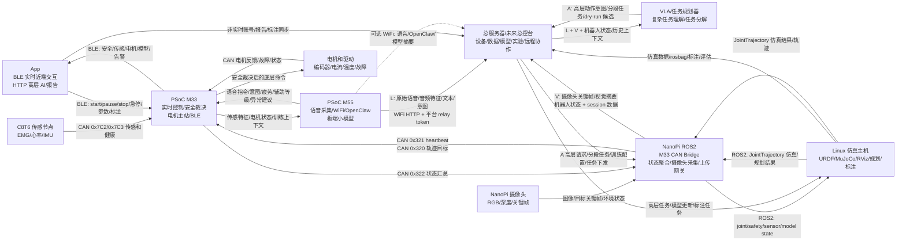

# 康复外骨骼机械臂系统架构

本文档是当前仓库的主 README，也是后续开发的架构基准。后续开发以本文档和 `docs/REHAB_ARM_SYSTEM_ARCHITECTURE.md` 为准。

详细审查稿见：

```text
docs/CURRENT_PROJECT_BRIEFING.md
docs/REHAB_ARM_SYSTEM_ARCHITECTURE.md
```

常用文档：

```text
docs/USER_MANUAL.md
docs/PROJECT_PROGRESS.md
docs/TROUBLESHOOTING_AND_LESSONS.md
docs/PSOC_CAN_PROTOCOL_V1.md
docs/PATIENT_DEVICE_PROFILE_PROTOCOL_V1.md
docs/M33_0X320_LOGGER_GUIDE.md
docs/M33_SAFETY_INPUT_MAPPING.md
```

## 当前讲解入口

今晚讲解项目时，优先使用 [`docs/CURRENT_PROJECT_BRIEFING.md`](docs/CURRENT_PROJECT_BRIEFING.md)。它是当前最新的干净总览，已经把旧 demo、旧草案和过时状态与当前主线分开。


当前能准确表述为：

- `M33/M55/CAN/NanoPi ROS2/无线 MuJoCo shadow` 的基础链路已分层打通。
- M33 数据进入 M55 小模型、再经 M33 `0x323` 到 NanoPi `/rehab_arm/model_state` 的闭环已通过 `req_snap` 验证。
- MuJoCo 6DOF hardware shadow 已能跟随 NanoPi 上来的真实/占位 joint 状态。
- 7号 EL05 仍是外部调试电机，不是正式机械臂关节。
- 完整 6DOF 真机控制、真实 4 路 EMG 模型和 VLA 真机闭环仍在后续阶段。

GitHub 分支导览：

| 分支 | 用途 |
|---|---|
| `feature/rehab-arm-ros2-architecture` | ROS2、NanoPi、MuJoCo、文档主线 |
| `M33` | M33 固件、安全/电机控制、M55 输入桥 |
| `M55` | M55 WiFi/语音/小模型工程 |
| `C8T6` | 传感采集板 |
| `APP` | Android App、BLE 和界面 |

## 0. 最高优先级：人身安全

这是一套要穿在人身上的康复外骨骼机械臂系统，安全优先级高于演示效果、控制精度、AI 能力和开发速度。任何阶段只要安全状态不明确，就默认不允许真实运动。

不可违背的原则：

- **默认不动**：上电、重启、通信中断、程序异常、传感异常、轨迹异常时，系统默认进入 `limited`、`fault` 或 `emergency_stop`，不得继续驱动电机。
- **M33 最终裁决**：NanoPi、工作站、App、VLA、OpenClaw、总服务器和 M55 都只能提出请求或建议；是否允许运动、如何限幅、何时停机，最终由 M33 安全状态机决定。
- **急停和软件限幅独立有效**：硬件急停、M33 代码配置的限位/限速/扭矩电流限制和通信超时必须能在 M33 本地独立触发安全状态，不能依赖 Linux、ROS、网络、App 或云端在线。电源 OK 当前不作为本阶段输入。
- **仿真先行**：任何新轨迹、新算法、新模型或新协议字段，必须先在仿真或离线环境验证，再进入不接人的台架测试，最后才允许进入穿戴测试。
- **人在设备内时禁止调试直控**：`nanopi_can_master.py` 的 CANSimple/private 直控能力只用于离线 bring-up 和诊断，不允许作为穿戴场景的控制路径。
- **开发台架不等于穿戴许可**：M33 可以临时打开 `CONTROL_DEVELOPMENT_BENCH_MOTION_ENABLE=1U` 做小幅空载台架运动；正式穿戴前必须回到完整安全验收。
- **异常即停，不带病运行**：没有 M33 heartbeat/status、`/rehab_arm/safety_state` 不是 `ok`、电池/供电不稳定、CAN 错误持续增长、关节映射未确认时，不得发布真实运动轨迹。

## 1. 总体目标

我们要做的是一套可持续扩展的康复外骨骼机械臂系统，而不是单次电机测试程序。

核心目标：

- Linux 工作站负责 URDF/MuJoCo 仿真、RViz、运动规划、数据采集、标注和后续 VLA。
- NanoPi 负责 ROS2 主控、PSoC/M33 桥接、状态汇总，以及 NanoPi/OpenClaw 高层 AI 服务。
- 英飞凌 PSoC Edge E84 是正式真机控制核心。
- M33 负责实时控制、安全状态机、限位、急停和电机控制。
- M55 负责 EMG/IMU 等信号的小模型推理，例如意图预测、疲劳检测、辅助等级建议。
- C8T6 负责轻量传感采集，例如 EMG、心率、IMU。
- App 通过 BLE 连接英飞凌做近端训练交互和状态显示。
- App 通过 HTTP 连接 NanoPi/OpenClaw 做高层 AI、报告和远程服务。
- 总服务器当前是开发工具服务器，后续扩展为总控台，管理设备、数据、模型、实验和远程协作。

## 1.1 当前职责分工基准

| 模块 | 负责什么 | 不负责什么 |
|---|---|---|
| M33 | CAN 总线原始传感/电机状态汇总、M55 结果接收、时间戳和安全状态绑定、限位/限速/限流/急停、最终运动裁决、电机控制 | 不做 VLA，不把安全权交给服务器/NanoPi/M55 |
| M55 | 4 路 EMG/IMU 等小模型推理、意图/疲劳/共收缩/异常建议、语音采集、唤醒/本地 ASR、可用平台 relay token 通过 WiFi HTTP 把原始语音送服务器形成 VLA 的 `L / Language` | 不直接控制电机，不保存厂商 API key，不用 CAN 跑云端聊天，不放宽 M33 限位，不直接成为运动许可 |
| NanoPi | ROS2 主控、M33 CAN bridge、摄像头采集并送服务器形成 VLA 的 `V / Vision`、M55/M33 结果编号语义解析、状态上传服务器、接收服务器/VLA 的 `A / Action` 高层任务并转成可审核轨迹候选 | 不绕过 M33 直控电机，不把 `bench_armed` 当正式穿戴许可 |
| Linux 仿真主机 | MuJoCo/RViz/运动规划、无线 ROS2 接 NanoPi、仿真验证、轨迹候选生成、rosbag/JSONL 数据和标注 | 不做真机实时安全闭环，不直接发 CAN |
| 服务器/总控台 | 将 M55 语音转成 `L`、NanoPi 摄像头转成 `V`，再融合 joint/电机/profile/M55 model state 生成 `A` 高层动作意图、VLA 建议和数据/模型管理 | 不做高频实时控制，不直接发 CAN，不绕过 M33 |

注意：因为机械结构包含齿轮、同步轮、减速器、连杆或推杆，`motor_id` 不等于机器人/人体 `joint`。服务器、VLA、仿真和 App 优先使用经过传动比、方向、零点、限位和回差说明换算后的输出端 joint 状态；原始电机轴数据只作为诊断字段保留。

## 2. 系统分层

```text
总控台与研发平台层:
  总服务器 / 多设备管理 / 数据资产 / 模型管理 / 实验追踪 / 远程协作

高层任务层:
  VLA / OpenClaw / App 高层 AI 请求

规划与仿真层:
  Linux 工作站 ROS2 / URDF / MuJoCo / RViz / rosbag / 数据标注

机器人主控与桥接层:
  NanoPi ROS2 / PSoC CAN Bridge / 状态汇总 / OpenClaw HTTP 服务

实时控制与安全层:
  Infineon M33 / 安全状态机 / 限位 / 急停 / 电机控制

边缘 AI 与信号处理层:
  Infineon M55 / EMG 意图预测 / 疲劳检测 / 辅助等级建议

传感与执行层:
  C8T6 传感节点 / 电机驱动 / 编码器 / 限位开关 / 急停硬件
```

## 3. 核心数据流

数据流图片：[`docs/assets/system_data_flow.png`](docs/assets/system_data_flow.png)



核心修正：

- 电机反馈和 C8T6 传感数据先进入 M33，M33 再分发给 M55、NanoPi 和 App。
- M33 通过 CAN 汇总原始传感和电机状态，把传感窗口、训练上下文和必要状态送到 M55；M55 小模型结果以编号/结果码/置信度回到 M33，再由 M33 经 CAN 发给 NanoPi。
- NanoPi 按 schema/model version 把 M55 结果编号解析成语义，上传服务器并发布 ROS topic。
- 平台、App、NanoPi、M33 和 M55 共用患者/设备运行配置协议，见 [`docs/PATIENT_DEVICE_PROFILE_PROTOCOL_V1.md`](docs/PATIENT_DEVICE_PROFILE_PROTOCOL_V1.md)。同一设备同一时刻只能有一个 active profile；患者 ROM、限速、辅助等级、训练模式、M55 模型阈值和数据标注配置都必须记录版本。
- NanoPi 负责采集摄像头数据，上传关键帧、目标检测结果、输出端 joint 状态、电机诊断、温度/速度/故障、限位/profile 摘要、M55 小模型语义结果和 session 数据到总服务器。
- M55/英飞凌负责语音采集和板端小模型；为了降低 VLA 的 `L / Language` 延迟，M55 可以持有平台签发的短期 relay token，通过 WiFi HTTP 把原始语音、音频特征或本地 transcript 直连模型中转站，不能持有厂商 API key。云端日常聊天和 VLA-L 不走 CAN；`0x323` 只保留给本地模型事件/状态摘要。
- NanoPi 负责把摄像头关键帧、视觉摘要和机器人状态送到服务器形成 `V / Vision` 和机器人上下文。
- 服务器先把唤醒后语音分类为 `daily_chat`、`vla_command` 或 `none`。`daily_chat` 只返回文字/TTS；只有 `vla_command` 作为 VLA 的 L 部分继续融合 `V + robot context`。
- 服务器/VLA 融合 `L + V + robot context` 后产生 `A / Action`：高层动作意图、分段任务或 dry-run 候选。`A` 仍不是真实运动许可，必须进入仿真/profile/安全检查/M33 裁决流程。
- NanoPi 获得 M33 汇总的电机、传感、安全和模型状态后，同步给仿真主机，用于数字孪生、数据采集和轨迹规划。
- VLA 固定走服务器链路，输入来自 M55 语音文本、NanoPi 摄像头、输出端 joint 状态、电机温度/速度/故障、M55 小模型结果、active profile 限位、历史数据和标注。
- VLA/服务器只能下发高层任务、分段目标或可验证的轨迹候选，不能直接发 CAN 或底层电机命令；NanoPi/仿真主机生成轨迹后仍由 M33 安全裁决。

## 4. 当前真实 CAN ID 和协议

本节只记录当前现场调试工具和新架构正在使用的 ID。

### 4.1 正式 NanoPi -> M33 桥接协议

正式真机运动链路中，NanoPi 不直接正式控制电机，只给 M33 发轨迹/目标，由 M33 做安全审核和电机控制。

| CAN ID | 方向 | 协议/用途 |
|---|---|---|
| `0x320` | NanoPi -> M33 | 关节目标/轨迹片段命令 |
| `0x321` | NanoPi -> M33 | NanoPi heartbeat |
| `0x322` | M33 -> NanoPi | M33 状态回复 |

### 4.2 当前已知电机节点

| ID | CAN 帧类型 | 协议 | 当前说明 | 机械关节绑定 |
|---|---|---|---|---|
| `motor_id=1` | 待确认 | 4015 小电机 | 后加腕部小电机，协议/反馈帧/减速比待补 | 腕部两轴之一，`wanbu_zongxiang_joint` 或 `wanbu_hengxiang_joint` 待确认 |
| `motor_id=2` | 待确认 | 4015 小电机 | 后加腕部小电机，协议/反馈帧/减速比待补 | 腕部两轴之一，`wanbu_zongxiang_joint` 或 `wanbu_hengxiang_joint` 待确认 |
| `node_id=3` | 标准帧 11-bit | CANSimple/ODrive 类协议 | 3 号伺泰威；电机轮:输出轴轮为 `1:2`，输出约为电机角 `0.5`，方向/零点待标定 | `jian_hengxiang_joint` 肩横向 |
| `motor_id=4` | 扩展帧 29-bit | 灵足 RobStride 私有扩展帧 MIT 协议 | RS00，官方减速比 `10:1`，经若干齿轮联动，最终齿轮比待补 | `jian_zongxiang_joint` 肩纵向 |
| `motor_id=5` | 扩展帧 29-bit | 灵足 RobStride 私有扩展帧 MIT 协议 | RS00，官方减速比 `10:1`，最终输出比例/方向待标定 | `zhou_zongxiang_joint` 肘纵向 |
| `motor_id=6` | 扩展帧 29-bit | 灵足 EduLite/EL05 私有扩展帧 MIT 协议 | EL05，官方减速比 `9:1`，最终输出比例/方向待标定 | `jian_xuanzhuan_joint` 肩/上臂旋转 |
| `motor_id=7` | 扩展帧 29-bit | 灵足 EduLite/EL05 私有扩展帧 MIT 协议 | 外部调试电机，当前没有装在机械臂上 | 不属于当前机械臂，不进入 MuJoCo/VLA 正式映射 |

当前机械臂 6 关节与电机草案见 [`docs/JOINT_MOTOR_MAPPING_DRAFT.md`](docs/JOINT_MOTOR_MAPPING_DRAFT.md)。后续必须现场补齐：

```text
wanbu_zongxiang_joint      -> motor_id 1 or 2 ?
wanbu_hengxiang_joint      -> motor_id 1 or 2 ?
jian_zongxiang_joint       -> motor_id 4 final gear ratio ?
all mapped joints          -> direction, zero offset, hard limits, soft limits, backlash
```

### 4.3 CANSimple/ODrive 类协议

`node_id=3` 使用 CANSimple/ODrive 类标准帧协议。

标准帧 ID 计算：

```text
std_id = (node_id << 5) | cmd_id
```

例如：

```text
node_id = 3
heartbeat cmd_id = 0x01
std_id = (3 << 5) | 0x01 = 0x61
```

所以总线上看到标准帧 `0x061`，就是 3 号节点 heartbeat。

当前调试命令：

```bash
~/nanopi_can_master.py cansimple closed-loop --iface can0 --node 3 --wait 1
~/nanopi_can_master.py cansimple vel --iface can0 --node 3 --vel 0.05 --torque 0.0 --wait 1
~/nanopi_can_master.py cansimple idle --iface can0 --node 3 --wait 1
```

### 4.4 私有扩展帧 MIT 电机协议

`motor_id=4/5/6/7` 当前使用私有扩展帧协议。

扩展帧 ID 计算：

```text
ext_id = (comm_type << 24) | (data2 << 8) | motor_id
```

主机 ID：

```text
MASTER_ID = 0xFD
```

常用 `comm_type`：

| comm_type | 名称 | 用途 |
|---:|---|---|
| `0x00` | Get_ID | 探测电机 ID |
| `0x01` | MIT 控制 | 位置/速度/kp/kd/torque 混合控制 |
| `0x03` | Enable | 使能 |
| `0x04` | Stop | 停止，可清故障 |
| `0x06` | Set Zero | 设零 |
| `0x11` | Param Read | 读参数 |
| `0x12` | Param Write | 写参数 |
| `0x18` | Active Report | 主动上报 |

MIT 控制范围：

| 字段 | 范围 | 单位 |
|---|---:|---|
| `pos` | `-12.57 ~ 12.57` | rad |
| `vel` | `-33.0 ~ 33.0` | rad/s |
| `kp` | `0.0 ~ 500.0` | - |
| `kd` | `0.0 ~ 5.0` | - |
| `torque` | `-14.0 ~ 14.0` | Nm |

当前调试命令：

```bash
~/nanopi_can_master.py probe --iface can0 --start 4 --end 7 --wait 0.5
~/nanopi_can_master.py private enable --iface can0 --motor 4
~/nanopi_can_master.py private speed --iface can0 --motor 4 --vel 0.05 --kd 1.0 --wait 0.5
~/nanopi_can_master.py private stop --iface can0 --motor 4 --clear-fault
```

安全边界：

- `private` 和 `cansimple` 是调试直控协议，不进入正式 ROS bringup。
- 正式运动必须走 `JointTrajectory -> NanoPi -> M33 -> 电机`。
- 未确认机械零点、方向、传动比和限位前，不允许把 `motor_id=1/2/4/5/6` 或 `node_id=3` 写死为正式可执行关节。
- `motor_id=7` 当前没有装在机械臂上，只能作为外部调试电机记录，不能进入机械臂 VLA/MuJoCo/正式控制映射。

### 4.5 C8T6 传感协议

| CAN ID | 方向 | 用途 |
|---|---|---|
| `0x7C2` | C8T6 -> M33 | EMG/心率/IMU 传感数据，目标 100Hz |
| `0x7C3` | C8T6 -> M33 | C8T6 健康状态，目标 1Hz |

## 5. 统一 ROS2 接口

| Topic | Type | 发布者 | 订阅者 | 说明 |
|---|---|---|---|---|
| `/arm_controller/joint_trajectory` | `trajectory_msgs/msg/JointTrajectory` | 工作站规划器/VLA 转换器 | 仿真节点/NanoPi PSoC Bridge | 统一轨迹输入 |
| `/joint_states` | `sensor_msgs/msg/JointState` | 仿真节点/NanoPi 状态聚合 | RViz/规划器/数据采集 | 统一关节状态 |
| `/rehab_arm/safety_state` | `std_msgs/msg/String` JSON | 仿真节点/NanoPi/M33 Bridge | App/数据采集/规划器 | 安全状态 |
| `/rehab_arm/sensor_state` | `std_msgs/msg/String` JSON | 仿真节点/NanoPi/M33 Bridge | 数据采集/VLA/OpenClaw | 传感器和模型状态 |
| `/vla/task_goal` | `std_msgs/msg/String` JSON | VLA/OpenClaw | 任务规划器 | 高层任务目标 |
| `/openclaw/app_request` | `std_msgs/msg/String` JSON | OpenClaw HTTP Bridge | OpenClaw/VLA/数据服务 | App 高层 AI 请求 |
| `/openclaw/app_response` | `std_msgs/msg/String` JSON | OpenClaw/VLA/数据服务 | OpenClaw HTTP Bridge | 高层 AI 回复 |
| `/server/device_state` | `std_msgs/msg/String` JSON | NanoPi/工作站 | 总服务器同步工具 | 设备状态摘要 |
| `/server/session_event` | `std_msgs/msg/String` JSON | App/OpenClaw/数据工具 | 总服务器同步工具 | 训练和实验事件 |
| `/server/model_event` | `std_msgs/msg/String` JSON | 工作站/VLA/M55 工具链 | 总服务器同步工具 | 模型版本和评估事件 |

第一阶段为了快，可以先用 `std_msgs/String` JSON 表达 safety、sensor、task。等字段稳定后，再升级成自定义 ROS msg。

## 6. App、OpenClaw 和总服务器边界

App 有两条链路：

```text
实时近端链路: App <-> BLE <-> 英飞凌 M33/M55
高层 AI 链路: App <-> HTTP <-> NanoPi/OpenClaw
```

边界：

- App 的实时控制不走 NanoPi HTTP。
- App 的 BLE 命令进入 M33 后必须经过安全状态机。
- HTTP/OpenClaw 只做高层 AI、报告、训练建议和远程服务。
- 总服务器只做开发工具、设备管理、数据资产、模型管理和远程协作。
- 总服务器不做实时电机控制，不直接发 CAN，不绕过 M33。

总服务器规划来源：

```text
https://github.com/wenjunyong666/ai-
branch: ai
```

## 7. ROS2 工作区

新 ROS2 主工作区位于：

```text
rehab_arm_ros2_ws/
```

当前规划包：

```text
rehab_arm_description   URDF 和 joint limit
rehab_arm_sim_mujoco    MuJoCo/fallback 仿真节点
rehab_arm_control       轨迹生成和 VLA task placeholder
rehab_arm_psoc_bridge   NanoPi ROS trajectory <-> M33 CAN bridge
rehab_arm_bringup       仿真和真机 launch
```

## 8. 分阶段实现

按“一次只实现一个能测试的小目标”推进：

1. 架构文档审查。
2. `rehab_arm_description`：RViz 能加载简化 URDF。
3. `rehab_arm_sim_mujoco`：能发布 `/joint_states`。
4. `rehab_arm_control`：能发布 demo `JointTrajectory`。
5. `rehab_arm_psoc_bridge`：NanoPi 能发 `0x321` heartbeat，能把轨迹拆成 `0x320`。
6. M33 协议与安全状态机：解析 `0x320/0x321`，回传 `0x322`。
7. App BLE：开始/暂停/停止训练，显示状态，写入标注。
8. OpenClaw HTTP：高层 AI、报告、训练建议，不直接控电机。
9. 数据采集与标注：rosbag2 + metadata。
10. 总服务器/总控台：设备、数据、模型、实验记录同步。

## 9. 当前关键边界

- App 近端实时链路是 BLE 到英飞凌，不是 HTTP 到 NanoPi。
- HTTP 到 NanoPi/OpenClaw 只做高层 AI、报告和远程服务。
- 总服务器/总控台只做开发工具、设备管理、数据资产、模型管理和远程协作。
- NanoPi 正式路径不直接控制电机，只发 M33 协议帧。
- M33 是正式电机控制主站和最终安全责任方。
- M55 只输出预测和建议，不直接控制电机。
- VLA 只输出任务目标或规划请求，不直接发 CAN。
- C8T6 只采集传感器，不做运动规划，不控制电机。
- 仿真和真机必须围绕同一套 ROS topic 对齐。
