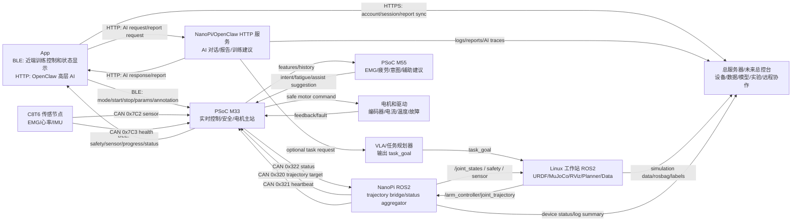

# 康复外骨骼机械臂系统架构

本文档是当前仓库的主 README，也是后续开发的架构基准。后续开发以本文档和 `docs/REHAB_ARM_SYSTEM_ARCHITECTURE.md` 为准。

详细审查稿见：

```text
docs/REHAB_ARM_SYSTEM_ARCHITECTURE.md
```

常用文档：

```text
docs/USER_MANUAL.md
docs/PROJECT_PROGRESS.md
docs/TROUBLESHOOTING_AND_LESSONS.md
```

## 1. 总体目标

我们要做的是一套可持续扩展的康复外骨骼机械臂系统，而不是单次电机测试程序。

核心目标：

- Linux 工作站负责 URDF/MuJoCo 仿真、RViz、运动规划、数据采集、标注和后续 VLA。
- NanoPi 负责 ROS2 主控、PSoC/M33 桥接、状态汇总，以及 NanoPi/OpenClaw 高层 AI 服务。
- 英飞凌 PSoC Edge E84 是正式真机控制核心。
- M33 负责实时控制、安全状态机、限位、急停和电机控制。
- M55 负责 EMG/IMU 等信号的小模型推理，例如意图预测、疲劳检测、辅助等级建议。
- C8T6 负责轻量传感采集，例如 EMG、心率、IMU。
- App 通过 BLE 连接英飞凌做近端训练交互和状态显示。
- App 通过 HTTP 连接 NanoPi/OpenClaw 做高层 AI、报告和远程服务。
- 总服务器当前是开发工具服务器，后续扩展为总控台，管理设备、数据、模型、实验和远程协作。

## 2. 系统分层

```text
总控台与研发平台层:
  总服务器 / 多设备管理 / 数据资产 / 模型管理 / 实验追踪 / 远程协作

高层任务层:
  VLA / OpenClaw / App 高层 AI 请求

规划与仿真层:
  Linux 工作站 ROS2 / URDF / MuJoCo / RViz / rosbag / 数据标注

机器人主控与桥接层:
  NanoPi ROS2 / PSoC CAN Bridge / 状态汇总 / OpenClaw HTTP 服务

实时控制与安全层:
  Infineon M33 / 安全状态机 / 限位 / 急停 / 电机控制

边缘 AI 与信号处理层:
  Infineon M55 / EMG 意图预测 / 疲劳检测 / 辅助等级建议

传感与执行层:
  C8T6 传感节点 / 电机驱动 / 编码器 / 限位开关 / 急停硬件
```

## 3. 核心数据流



## 4. 当前真实 CAN ID 和协议

本节只记录当前现场调试工具和新架构正在使用的 ID。

### 4.1 正式 NanoPi -> M33 桥接协议

正式真机运动链路中，NanoPi 不直接正式控制电机，只给 M33 发轨迹/目标，由 M33 做安全审核和电机控制。

| CAN ID | 方向 | 协议/用途 |
|---|---|---|
| `0x320` | NanoPi -> M33 | 关节目标/轨迹片段命令 |
| `0x321` | NanoPi -> M33 | NanoPi heartbeat |
| `0x322` | M33 -> NanoPi | M33 状态回复 |

### 4.2 当前已知电机节点

| ID | CAN 帧类型 | 协议 | 当前说明 | 机械关节绑定 |
|---|---|---|---|---|
| `node_id=3` | 标准帧 11-bit | CANSimple/ODrive 类协议 | 3 号 CANSimple 电机节点；heartbeat 标准帧是 `0x061` | 待现场确认 |
| `motor_id=4` | 扩展帧 29-bit | 私有扩展帧 MIT 电机协议 | 支持 probe、enable、stop、MIT 控制、读写参数 | 待现场确认 |
| `motor_id=5` | 扩展帧 29-bit | 私有扩展帧 MIT 电机协议 | 支持 probe、enable、stop、MIT 控制、读写参数 | 待现场确认 |
| `motor_id=6` | 扩展帧 29-bit | 私有扩展帧 MIT 电机协议 | 支持 probe、enable、stop、MIT 控制、读写参数 | 待现场确认 |
| `motor_id=7` | 扩展帧 29-bit | 私有扩展帧 MIT 电机协议 | 支持 probe、enable、stop、MIT 控制、读写参数 | 待现场确认 |

当前只能确认总线上存在这些协议 ID；还不能把它们直接写死成某个正式关节。后续必须现场确认：

```text
shoulder_lift_joint        -> motor/node ?
elbow_lift_joint           -> motor/node ?
shoulder_abduction_joint   -> motor/node ?
upper_arm_rotation_joint   -> motor/node ?
forearm_rotation_joint     -> motor/node ?
```

### 4.3 CANSimple/ODrive 类协议

`node_id=3` 使用 CANSimple/ODrive 类标准帧协议。

标准帧 ID 计算：

```text
std_id = (node_id << 5) | cmd_id
```

例如：

```text
node_id = 3
heartbeat cmd_id = 0x01
std_id = (3 << 5) | 0x01 = 0x61
```

所以总线上看到标准帧 `0x061`，就是 3 号节点 heartbeat。

当前调试命令：

```bash
~/nanopi_can_master.py cansimple closed-loop --iface can0 --node 3 --wait 1
~/nanopi_can_master.py cansimple vel --iface can0 --node 3 --vel 0.05 --torque 0.0 --wait 1
~/nanopi_can_master.py cansimple idle --iface can0 --node 3 --wait 1
```

### 4.4 私有扩展帧 MIT 电机协议

`motor_id=4/5/6/7` 当前使用私有扩展帧协议。

扩展帧 ID 计算：

```text
ext_id = (comm_type << 24) | (data2 << 8) | motor_id
```

主机 ID：

```text
MASTER_ID = 0xFD
```

常用 `comm_type`：

| comm_type | 名称 | 用途 |
|---:|---|---|
| `0x00` | Get_ID | 探测电机 ID |
| `0x01` | MIT 控制 | 位置/速度/kp/kd/torque 混合控制 |
| `0x03` | Enable | 使能 |
| `0x04` | Stop | 停止，可清故障 |
| `0x06` | Set Zero | 设零 |
| `0x11` | Param Read | 读参数 |
| `0x12` | Param Write | 写参数 |
| `0x18` | Active Report | 主动上报 |

MIT 控制范围：

| 字段 | 范围 | 单位 |
|---|---:|---|
| `pos` | `-12.57 ~ 12.57` | rad |
| `vel` | `-33.0 ~ 33.0` | rad/s |
| `kp` | `0.0 ~ 500.0` | - |
| `kd` | `0.0 ~ 5.0` | - |
| `torque` | `-14.0 ~ 14.0` | Nm |

当前调试命令：

```bash
~/nanopi_can_master.py probe --iface can0 --start 4 --end 7 --wait 0.5
~/nanopi_can_master.py private enable --iface can0 --motor 4
~/nanopi_can_master.py private speed --iface can0 --motor 4 --vel 0.05 --kd 1.0 --wait 0.5
~/nanopi_can_master.py private stop --iface can0 --motor 4 --clear-fault
```

安全边界：

- `private` 和 `cansimple` 是调试直控协议，不进入正式 ROS bringup。
- 正式运动必须走 `JointTrajectory -> NanoPi -> M33 -> 电机`。
- 未确认机械零点和关节绑定前，不允许把 `motor_id=4/5/6/7` 或 `node_id=3` 写死为正式关节。

### 4.5 C8T6 传感协议

| CAN ID | 方向 | 用途 |
|---|---|---|
| `0x7C2` | C8T6 -> M33 | EMG/心率/IMU 传感数据，目标 100Hz |
| `0x7C3` | C8T6 -> M33 | C8T6 健康状态，目标 1Hz |

## 5. 统一 ROS2 接口

| Topic | Type | 发布者 | 订阅者 | 说明 |
|---|---|---|---|---|
| `/arm_controller/joint_trajectory` | `trajectory_msgs/msg/JointTrajectory` | 工作站规划器/VLA 转换器 | 仿真节点/NanoPi PSoC Bridge | 统一轨迹输入 |
| `/joint_states` | `sensor_msgs/msg/JointState` | 仿真节点/NanoPi 状态聚合 | RViz/规划器/数据采集 | 统一关节状态 |
| `/rehab_arm/safety_state` | `std_msgs/msg/String` JSON | 仿真节点/NanoPi/M33 Bridge | App/数据采集/规划器 | 安全状态 |
| `/rehab_arm/sensor_state` | `std_msgs/msg/String` JSON | 仿真节点/NanoPi/M33 Bridge | 数据采集/VLA/OpenClaw | 传感器和模型状态 |
| `/vla/task_goal` | `std_msgs/msg/String` JSON | VLA/OpenClaw | 任务规划器 | 高层任务目标 |
| `/openclaw/app_request` | `std_msgs/msg/String` JSON | OpenClaw HTTP Bridge | OpenClaw/VLA/数据服务 | App 高层 AI 请求 |
| `/openclaw/app_response` | `std_msgs/msg/String` JSON | OpenClaw/VLA/数据服务 | OpenClaw HTTP Bridge | 高层 AI 回复 |
| `/server/device_state` | `std_msgs/msg/String` JSON | NanoPi/工作站 | 总服务器同步工具 | 设备状态摘要 |
| `/server/session_event` | `std_msgs/msg/String` JSON | App/OpenClaw/数据工具 | 总服务器同步工具 | 训练和实验事件 |
| `/server/model_event` | `std_msgs/msg/String` JSON | 工作站/VLA/M55 工具链 | 总服务器同步工具 | 模型版本和评估事件 |

第一阶段为了快，可以先用 `std_msgs/String` JSON 表达 safety、sensor、task。等字段稳定后，再升级成自定义 ROS msg。

## 6. App、OpenClaw 和总服务器边界

App 有两条链路：

```text
实时近端链路: App <-> BLE <-> 英飞凌 M33/M55
高层 AI 链路: App <-> HTTP <-> NanoPi/OpenClaw
```

边界：

- App 的实时控制不走 NanoPi HTTP。
- App 的 BLE 命令进入 M33 后必须经过安全状态机。
- HTTP/OpenClaw 只做高层 AI、报告、训练建议和远程服务。
- 总服务器只做开发工具、设备管理、数据资产、模型管理和远程协作。
- 总服务器不做实时电机控制，不直接发 CAN，不绕过 M33。

总服务器规划来源：

```text
https://github.com/wenjunyong666/ai-
branch: ai
```

## 7. ROS2 工作区

新 ROS2 主工作区位于：

```text
rehab_arm_ros2_ws/
```

当前规划包：

```text
rehab_arm_description   URDF 和 joint limit
rehab_arm_sim_mujoco    MuJoCo/fallback 仿真节点
rehab_arm_control       轨迹生成和 VLA task placeholder
rehab_arm_psoc_bridge   NanoPi ROS trajectory <-> M33 CAN bridge
rehab_arm_bringup       仿真和真机 launch
```

## 8. 分阶段实现

按“一次只实现一个能测试的小目标”推进：

1. 架构文档审查。
2. `rehab_arm_description`：RViz 能加载简化 URDF。
3. `rehab_arm_sim_mujoco`：能发布 `/joint_states`。
4. `rehab_arm_control`：能发布 demo `JointTrajectory`。
5. `rehab_arm_psoc_bridge`：NanoPi 能发 `0x321` heartbeat，能把轨迹拆成 `0x320`。
6. M33 协议与安全状态机：解析 `0x320/0x321`，回传 `0x322`。
7. App BLE：开始/暂停/停止训练，显示状态，写入标注。
8. OpenClaw HTTP：高层 AI、报告、训练建议，不直接控电机。
9. 数据采集与标注：rosbag2 + metadata。
10. 总服务器/总控台：设备、数据、模型、实验记录同步。

## 9. 当前关键边界

- App 近端实时链路是 BLE 到英飞凌，不是 HTTP 到 NanoPi。
- HTTP 到 NanoPi/OpenClaw 只做高层 AI、报告和远程服务。
- 总服务器/总控台只做开发工具、设备管理、数据资产、模型管理和远程协作。
- NanoPi 正式路径不直接控制电机，只发 M33 协议帧。
- M33 是正式电机控制主站和最终安全责任方。
- M55 只输出预测和建议，不直接控制电机。
- VLA 只输出任务目标或规划请求，不直接发 CAN。
- C8T6 只采集传感器，不做运动规划，不控制电机。
- 仿真和真机必须围绕同一套 ROS topic 对齐。
