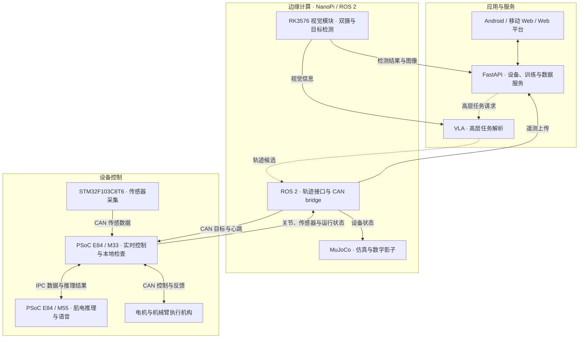

# PSOC E84 智能康复机械臂

基于 **Infineon PSoC Edge E84** 的上肢康复机械臂研究项目，将嵌入式运动控制、肌电意图识别、语音交互、视觉感知和训练管理整合在同一套系统中。

项目围绕“感知用户运动状态、辅助训练、记录训练过程”展开：传感器节点采集肌电等数据，E84 双核分别承担实时控制与边缘 AI，NanoPi 连接机械臂、ROS 2 和视觉模块，移动端与 Web 提供设备状态、训练计划和记录查看入口。本仓库包含这些子系统的固件、应用、算法与开发工具。

[主要功能](#主要功能) · [系统架构](#系统架构) · [目录结构](#目录结构) · [开发与构建入口](#开发与构建入口) · [项目文档](#项目文档)

## 主要功能

| 功能 | 项目中的实现 |
| --- | --- |
| **机械臂运动控制** | M33 运行 RT-Thread，通过 CAN 对接不同电机协议，处理关节目标、位置与速度反馈、标定、限位及运行状态。ROS 2 侧以统一轨迹接口接入控制链路。 |
| **康复训练模式** | 控制层包含主动跟随、助力、抗阻、弯举及固定动作等策略，并提供动作录制与回放接口，用于探索不同训练方式。 |
| **肌电采集与意图识别** | STM32 传感器节点采集并上报肌电数据；M55 运行 TensorFlow Lite Micro 量化模型，识别静止、小臂弯举和大臂前抬三类意图，为助力策略提供输入。 |
| **语音交互** | M55 集成音频处理、唤醒、联网语音服务和康复模式意图解析，通过核间通信向 M33 提交交互请求。 |
| **视觉感知** | NanoPi RK3576 侧提供双摄采集、目标与机械臂末端检测、目标关联和双目深度估计，支持 RKNN 推理及视觉结果上传。 |
| **仿真与状态可视化** | ROS 2 提供机器人描述、设备桥接和启动配置；MuJoCo 用于运动仿真，也可接收设备状态展示机械臂的数字影子。 |
| **训练管理与数据查看** | Android / 移动 Web 和 Web 平台提供账户、设备绑定、训练计划、训练记录及遥测可视化，FastAPI 后端负责业务与数据接口。 |
| **视觉语言任务探索** | VLA（视觉—语言—动作）原型结合任务描述与视觉信息进行任务解析、目标关联和离线评估，输出高层请求或待检查的轨迹候选。 |

这些模块共同构成研发原型；各模块的构建、部署和实机验证状态见[系统总览](docs/architecture/system-overview.md)及[验证记录](docs/validation/migration-validation.md)。

## 系统架构

系统分为设备控制、边缘计算、应用服务三层。PSoC Edge E84 是设备侧核心：**Cortex-M33 负责实时控制，Cortex-M55 负责语音与边缘推理**，两核通过 IPC 交换传感器数据和模型结果。


```mermaid
flowchart TB
    subgraph app_layer["应用与服务"]
        UI["Android / 移动 Web / Web 平台"]
        API["FastAPI · 设备、训练与数据服务"]
        VLA["VLA · 高层任务解析"]
        UI <--> API
    end

    subgraph edge_layer["边缘计算 · NanoPi / ROS 2"]
        VISION["RK3576 视觉模块 · 双摄与目标检测"]
        ROS["ROS 2 · 轨迹接口与 CAN bridge"]
        SIM["MuJoCo · 仿真与数字影子"]
    end

    subgraph device_layer["设备控制"]
        SENSOR["STM32F103C8T6 · 传感器采集"]
        M33["PSoC E84 / M33 · 实时控制与本地检查"]
        M55["PSoC E84 / M55 · 肌电推理与语音"]
        MOTOR["电机与机械臂执行机构"]
        SENSOR -->|CAN 传感数据| M33
        M33 <-->|IPC 数据与推理结果| M55
        M33 <-->|CAN 控制与反馈| MOTOR
    end

    API -.->|高层任务请求| VLA
    VISION -->|视觉信息| VLA
    VISION -->|检测结果与图像| API
    VLA -.->|轨迹候选| ROS
    ROS -->|CAN 目标与心跳| M33
    M33 -->|关节、传感器与运行状态| ROS
    ROS -->|设备状态| SIM
    ROS -->|遥测上传| API
```

图中实线表示控制或数据通道，虚线表示高层请求与候选关系。运动链路采用 `JointTrajectory -> NanoPi -> M33`：ROS 2 使用标准关节轨迹消息，NanoPi 进行轨迹检查与 CAN 转换，M33 在设备侧检查并执行电机目标。传感器和电机反馈沿上行通道送往仿真与应用平台。

M55、VLA 和应用层提供交互请求或模型建议；运动权限由设备控制链路处理。ROS 目标发送默认关闭，完整六自由度实机闭环和逐目标安全复核仍需完善，具体约束见[安全边界](docs/protocols/safety-boundary.md)。

## 目录结构

仓库按子系统组织，每个目录对应明确的运行位置和开发职责：

```text
PSOC_E84_robot/
├── firmware/                    # 嵌入式固件
│   ├── m33/                     # E84 实时控制、CAN/BLE 与传感器管理
│   ├── m55/                     # E84 语音、联网、肌电模型推理与 IPC
│   └── c8t6/                    # STM32F103C8T6 传感器节点
├── ros/rehab_arm_ws/             # ROS 2 工作区
│   └── src/
│       ├── rehab_arm_description/ # 机器人模型与关节配置
│       ├── rehab_arm_psoc_bridge/ # NanoPi ROS 2 ↔ M33 CAN 桥接
│       ├── rehab_arm_sim_mujoco/  # MuJoCo 仿真与状态映射
│       ├── rehab_arm_bringup/     # 系统启动与运行配置
│       └── rehab_arm_control/    # 控制包预留入口
├── apps/mobile/                 # Capacitor 移动端封装与 Android 工程
├── platform/
│   ├── web/                     # Next.js Web 平台及移动 Web 页面
│   ├── api/                     # FastAPI 后端与康复业务接口
│   ├── shared/                  # 共享类型与公共代码
│   ├── runner/                  # 平台任务执行服务
│   └── deploy/                  # 部署配置
├── ai/vla/                      # 视觉语言任务解析、数据结构与离线评估
├── tools/                       # 数据采集、模型量化、演示与验证工具
│   └── nanopi/vision/           # RK3576 双摄、目标检测与深度估计
└── docs/                        # 系统架构、通信协议、使用与开发文档
```

### 从哪里开始读代码

| 关注方向 | 推荐入口 |
| --- | --- |
| 电机如何接收目标、返回状态 | [M33 控制层](firmware/m33/applications/control) |
| 传感器如何采集与上报 | [C8T6 采集应用](firmware/c8t6/app) |
| 肌电数据如何进入模型 | [M55 肌电推理桥接](firmware/m55/applications/emg_intent_bridge.cpp)与[模型运行时](firmware/m55/applications/intent_tflm_runtime.cpp) |
| 语音与双核如何协作 | [M55 应用代码](firmware/m55/applications)与[IPC 协议](docs/protocols/m33-m55-ipc.md) |
| ROS 2 如何连接机械臂 | [ROS 2 工作区](ros/rehab_arm_ws/README.md)与[CAN bridge](ros/rehab_arm_ws/src/rehab_arm_psoc_bridge) |
| 相机检测与深度估计 | [NanoPi 视觉模块](tools/nanopi/vision/README.md) |
| App 页面与训练业务 | [移动 Web 页面](platform/web/public/rehab-arm-mobile)、[Android 工程说明](apps/mobile/README.md)与[康复 API](platform/api/app/modules/rehab_arm) |
| 高层任务与 AI 扩展 | [VLA 原型](ai/vla/README.md) |

## 开发与构建入口

各子系统使用独立工具链，可按开发方向选择。以下命令均在仓库根目录执行，需先安装对应环境并完成工程配置。

| 子系统 | 开发环境 | 构建入口 |
| --- | --- | --- |
| M33 / M55 | RT-Thread Studio、ARM GCC、SCons；M55 另需配置语音模型后端依赖 | `scons -C firmware/m33 -j4` / `scons -C firmware/m55 -j4` |
| C8T6 | ARM GCC、CMake、Ninja | `cmake --preset Debug -S firmware/c8t6`，随后 `cmake --build firmware/c8t6/build/Debug` |
| ROS 2 | Linux、ROS 2 Jazzy、colcon；仿真另需 MuJoCo | 加载 ROS 环境后执行 `colcon build --base-paths ros/rehab_arm_ws/src --symlink-install` |
| Web | Node.js、npm | `npm --prefix platform ci`，随后 `npm --prefix platform run build:web` |
| API | Python 及项目依赖 | `python -m pip install -r platform/api/requirements.txt` |
| Android | Node.js、Android Studio / SDK、兼容的 JDK | `npm --prefix apps/mobile ci`，随后 `npm --prefix apps/mobile run sync:web` 和 `npm --prefix apps/mobile run build:debug` |

本地开发 Web 和 API 时，可在两个终端分别启动：

```bash
# Web 开发服务（先安装上表中的依赖）
npm --prefix platform run dev:web
```

```bash
# API 开发服务
python -m uvicorn app.main:app --app-dir platform/api
```

服务配置可查阅 [App/API 协议](docs/protocols/app-api.md)和[部署说明](platform/deploy/README.md)。构建环境、依赖问题及已有验证结果集中记录在[构建与验证记录](docs/validation/migration-validation.md)中。

## 项目文档

| 文档 | 内容 |
| --- | --- |
| [系统总览](docs/architecture/system-overview.md) | 模块职责、控制与数据流、实现入口 |
| [CAN 协议](docs/protocols/can-protocol.md) | 电机目标、反馈、传感器与设备状态通信 |
| [M33–M55 IPC](docs/protocols/m33-m55-ipc.md) | 双核消息、传感器输入与模型结果交换 |
| [App/API 协议](docs/protocols/app-api.md) | 应用层业务、遥测与设备数据接口 |
| [肌电模型说明](docs/validation/emg_intent_model_training_result_20260718.md) | 三类动作意图、数据处理、模型配置与量化结果 |
| [安全边界](docs/protocols/safety-boundary.md) | 设备执行权限与控制约束 |
| [演示指南](docs/demo/competition-live-demo-plan-20260721.md) | 整机演示流程与操作说明 |
| [构建与验证记录](docs/validation/migration-validation.md) | 各子系统的构建条件与验证结果 |
| [代码来源](docs/migration/source-map.md) | 组件来源、目录映射与历史追溯 |

## 使用与许可

本项目用于康复机器人研究与工程验证，目前为研发原型。各组件及第三方依赖的许可请查阅对应目录中的 LICENSE / EULA 和[代码来源说明](docs/migration/source-map.md)。
