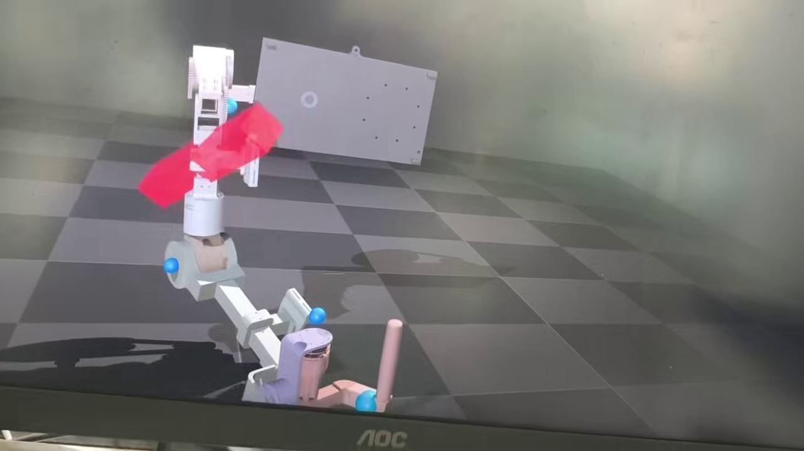

# 当前项目讲解稿

更新时间：2026-06-04

本文是今晚讲解项目时优先使用的干净版本。旧 demo、早期草案和历史电机调试记录只能作为参考；当前实现、讲解和后续 AI 协作以本文、[README.md](../README.md) 和 [REHAB_ARM_SYSTEM_ARCHITECTURE.md](REHAB_ARM_SYSTEM_ARCHITECTURE.md) 为准。

## 0. GitHub 仓库导览

本项目在同一个 GitHub 仓库里按分支承载不同子系统，不是只看本地当前目录：

| GitHub 分支 | 当前用途 | 最新证据 |
|---|---|---|
| `feature/rehab-arm-ros2-architecture` | ROS2、NanoPi、MuJoCo、文档和架构主线 | `5ef548b9 Lock GitHub briefing and model foundation contracts` |
| `M33` | 英飞凌 M33 固件、安全/电机/M55 输入桥 | `c4d27310 Add M33 model input bridge to M55` |
| `M55` | 英飞凌 M55 WiFi/语音/小模型工程 | `ea841fab Add M55 model input and result bridge` |
| `C8T6` | STM32F103C8T6 传感采集板 | `bbcd67bb 更改`，包含 CAN transport、app service、传感侧工程更新 |
| `APP` | Android App、BLE、传感数据显示和 3D 手臂界面 | `ff676465 完成传感器数据重构和3D手臂模型实现` |
| `PCB`、`ai`、`ROS_VLA_WebSocket` 等 | PCB、服务器/平台、早期 ROS/VLA 方向 | 作为历史或旁线参考，当前真机主线仍以本文为准 |

今晚讲解建议按这个顺序打开 GitHub：先看本文件和 README，再看 `feature` 分支的 ROS/MuJoCo/文档，再切到 `M33` 和 `M55` 看双核桥接代码，最后补充 C8T6 和 APP 分支。

## 1. 一句话介绍

本项目是一套医疗康复外骨骼机械臂系统：用 M33 做实时安全和电机控制，用 M55 做 EMG/语音等小模型推理，用 NanoPi 做 ROS2/CAN/摄像头/服务器网关，用 Linux 主机做 MuJoCo 仿真和规划验证，用服务器/VLA 做高层任务理解和数据/模型管理。

核心原则：

```text
AI 只能给建议和候选目标，真实运动必须经过 M33 安全裁决。
```

## 1.1 视频帧和模型文件

下面这张图是从用户提供的视频 `c22727ba986a4acdaecf08ba6e6e2065.mp4` 中截取的真实画面帧，不是生成图：



GitHub 中当前和模型/仿真直接相关的文件：

| 类型 | 路径 | 说明 |
|---|---|---|
| URDF | `rehab_arm_ros2_ws/src/rehab_arm_description/urdf/rehab_arm.urdf` | ROS2 描述包里的基础 URDF |
| 6DOF MJCF | `rehab_arm_ros2_ws/src/rehab_arm_sim_mujoco/models/medical_arm_6dof.xml` | 当前 MuJoCo 6 关节简化模型，使用 capsule、joint limit 和 position actuator |
| 6DOF schema | `rehab_arm_ros2_ws/src/rehab_arm_description/config/medical_arm_6dof_schema.yaml` | 关节名、限位、电机映射、7号外部电机 shadow 边界 |
| 单机 shadow launch | `rehab_arm_ros2_ws/src/rehab_arm_sim_mujoco/launch/medical_arm_6dof_shadow.launch.py` | 只跑 MuJoCo 6DOF shadow |
| 硬件 shadow launch | `rehab_arm_ros2_ws/src/rehab_arm_sim_mujoco/launch/medical_arm_6dof_hardware_shadow.launch.py` | NanoPi `/joint_states` 经无线 ROS2 驱动 MuJoCo shadow |

注意：当前 GitHub 里提交的是模型文件和这张视频截帧；真正的 MuJoCo viewer 渲染截图后续应从 Linux 仿真主机补到 `docs/assets/`，不要用手绘图替代。

## 2. 当前主线架构

```text
电机反馈 / C8T6 传感 / 安全输入
  -> M33 汇总、限位、限速、急停和最终安全裁决
  -> NanoPi ROS2/CAN bridge、状态聚合、摄像头和服务器上传
  -> Linux 仿真主机 MuJoCo hardware shadow / dry-run / 规划验证
  -> 服务器/VLA 融合语音、视觉、关节状态、传感和历史数据
  -> 高层任务或轨迹候选
  -> NanoPi
  -> M33 最终审核
  -> 电机
```

正式运动入口只有一条：

```text
JointTrajectory -> NanoPi -> M33 -> 电机
```

禁止路径：

- 服务器/VLA 直接发 CAN。
- App HTTP 直接控制电机。
- M55 小模型直接控制电机。
- Linux 仿真主机绕过 NanoPi/M33 控制电机。
- `nanopi_can_master.py` 调试直控进入正式穿戴流程。

## 3. 五个核心设备职责

| 设备 | 当前职责 | 当前状态 |
|---|---|---|
| M33 | CAN 主站、M33/M55 IPC 主入口、BLE 近端入口、安全状态机、限位/限速/限流、最终电机控制、`0x322/0x323/0x330~0x334` 上报 | 已烧录并启动；可见 M33 heartbeat、状态帧和 M55 结果帧 |
| M55 | EMG/语音/音频小模型、语音转文字方向、模型结果编号输出；通过现有 `m33_m55_comm` 和共享内存与 M33 通讯 | 已烧录并启动；`req_snap` 已验证 M33 数据进入 M55 后再回到 NanoPi |
| NanoPi | SocketCAN、ROS2 bridge、M33 状态解析、`/rehab_arm/model_state`、摄像头和服务器上传网关、接收 VLA 高层任务 | 已能读取 M33/M55 CAN 状态并发布 ROS topic；产品只读 service 方向已建立 |
| Linux 仿真主机 | MuJoCo 6DOF、hardware shadow、无线 ROS2、dry-run、标定和数据采集 | 已通过无线 ROS2 收到 NanoPi `/joint_states`，并发布 `/sim/medical_arm/joint_states` |
| 服务器/VLA | 融合语音、摄像头、joint 状态、电机诊断、M55 小模型语义、profile/限位和历史数据，输出高层任务/候选轨迹 | 本仓库只定义边界和接口；正式实时安全不依赖服务器 |

## 4. M33 和 M55 模型链路

M33 到 M55 输入链路已经不是想法，而是当前主线的一部分：

```text
M33 -> MSG_TYPE_SENSOR_SNAPSHOT / MSG_TYPE_SENSOR_STREAM -> M55
M55 -> MSG_TYPE_AI_INFERENCE_RESP -> M33
M33 -> CAN 0x323 -> NanoPi -> /rehab_arm/model_state
```

已验证的台架闭环：

```text
M55 shell: req_snap
M55 请求 M33 发布测试传感快照
M33 发 MSG_TYPE_SENSOR_SNAPSHOT 给 M55
M55 当前规则模型输出结果
M33 把结果发成 CAN 0x323
NanoPi 发布 /rehab_arm/model_state JSON
```

新增的真实 TFLM 管线验证：

```text
M55 shell: req_m7
M55 请求 M33 读取 7 号外部 EL05 台架电机反馈
M33 发 source=MODEL_INPUT_SRC_MOTOR_FEEDBACK 的 MSG_TYPE_SENSOR_SNAPSHOT
M55 用 motor7_model_runner 把位置/速度/力矩/温度编码成 PCM16
M55 调用现有 TFLite Micro wake-word slot 真实推理
结果仍经 M33 -> CAN 0x323 -> NanoPi -> /rehab_arm/model_state
```

已看到的关键结果：

```text
CAN: can0 323#B50A01012A831400
ROS JSON: result_code=1, confidence=0.42, detected=true
control_boundary=model_suggestion_only_not_motion_permission
```

`req_snap` 证明的是基础链路，不代表真实 EMG 模型已经训练完成。`req_m7` 证明的是 M33 电机数据可以进入 M55 并触发真实 TFLM runtime，但当前权重仍是 wake-word 示例模型，不是 7 号电机语义模型。后续 4 路肌电正式接入时，要把窗口特征、质量标志、关节上下文送到 M55，再替换 `model_input_bridge`/`motor7_model_runner` 内部推理实现。

## 5. MuJoCo 和真机 shadow 当前进度

当前 MuJoCo 侧已经有 6 个 medical arm joint：

```text
jian_hengxiang_joint
jian_zongxiang_joint
jian_xuanzhuan_joint
zhou_zongxiang_joint
wanbu_zongxiang_joint
wanbu_hengxiang_joint
```

当前实测打通的是：

```text
7号外部 EL05 电机 -> M33 0x334 -> NanoPi /joint_states
-> 无线 ROS2 -> Linux 仿真主机
-> MuJoCo 6DOF shadow 的 jian_xuanzhuan_joint
```

重要边界：

- 7号 EL05 不在机械臂上，只能作为 bench-debug 和 shadow-sim 临时源。
- 当前不是完整 6DOF 真机控制完成。
- 其他真实关节还需要逐个补电机反馈、方向、零点、传动比、软/硬限位和患者 ROM。

GitHub 里的 MuJoCo 模型当前是工程起步版：几何、阻尼、质量、惯量和接触参数偏保守，主要用于 shadow、dry-run 和接口验证。后续要按真实 CAD、传动、末端负载和穿戴边界慢慢补物理参数。

## 6. 当前电机和关节映射

| 关节 | 当前电机 | 说明 |
|---|---|---|
| `jian_hengxiang_joint` | `node_id=3` 伺泰威/CANSimple | 同步轮电机端:输出轴端 `1:2`，输出角约为电机角 `0.5`，方向/零点待标定 |
| `jian_zongxiang_joint` | `motor_id=4` RS00 | 多级齿轮联动，最终齿轮比待补 |
| `jian_xuanzhuan_joint` | `motor_id=6` EL05 | 当前用外部 7号 EL05 做 shadow 临时代替验证，正式仍应回到 6号 |
| `zhou_zongxiang_joint` | `motor_id=5` RS00 | 方向/零点/输出比例待标定 |
| `wanbu_zongxiang_joint` | `motor_id=1/2` 4015 小电机之一 | 腕部新增电机，协议和对应关系待补 |
| `wanbu_hengxiang_joint` | `motor_id=1/2` 4015 小电机之一 | 腕部新增电机，协议和对应关系待补 |

注意：RS00/EL05 当前 formal path 的关节目标按输出端 joint rad 处理，不再额外乘官方内部减速比。只有伺泰威 3号和外部齿轮/同步轮结构需要按实际传动重新标定。

## 7. 当前能讲“已经完成”的内容

- ROS2 主工作区、NanoPi bridge、MuJoCo 6DOF shadow 基础框架已建立。
- NanoPi 和仿真主机通过 `ROS_DOMAIN_ID=42` 的无线 ROS2 可以互通。
- M33/M55 双核固件已能构建、烧录、启动。
- M33 状态帧 `0x322`、槽位帧 `0x330~0x334`、M55 结果帧 `0x323` 已在 NanoPi CAN 上验证。
- `/rehab_arm/model_state` 已能发布 M55 编号结果 JSON，并明确是建议，不是运动许可。
- M33 数据进入 M55 小模型的输入链路已通过 `req_snap` 验证。
- 产品自启动方向已经建立：NanoPi 默认只读 bridge，仿真主机 shadow 是研发自启。
- 文档已把 mainline、shadow-sim、dry-run、bench-debug、offline-demo、side-channel 分开，避免 demo 混入正式路径。

## 8. 当前不能夸大的内容

- 不能说完整 6DOF 真机医疗机械臂已经闭环控制完成。
- 不能说真实 4 路 EMG 小模型已经训练完成。
- 不能说 VLA 已经能安全控制真机。
- 不能说 7号外部电机就是正式 6号机械臂关节。
- 不能说无线 ROS2 可以承担急停或高频安全闭环。
- 不能把 M55 confidence、语音文本、App start 或 VLA 输出当运动许可。

## 9. 下一步最小任务

建议后续按这个顺序补，不要同时改很多层：

1. 逐个真实关节接入 M33 反馈，从只读 fresh 状态开始。
2. 标定每个关节的方向、零点、传动比、软/硬限位和患者 ROM。
3. 把 1/2 号腕部 4015 电机协议和对应关节补进文档和代码。
4. 把 C8T6 的 4 路 EMG 数据接入 M33，再按窗口特征送 M55。
5. 在 M55 上替换规则阈值模型为正式 int8 TFLite Micro 小模型。
6. NanoPi 上传摄像头关键帧、joint 状态、M55 语义和 profile 到服务器。
7. VLA 先只输出高层任务或 dry-run 轨迹候选，经过 MuJoCo 验证后再进入 M33 安全审核。

## 10. 后续 AI 必须遵守

每次开始任务先判断属于哪一类：

```text
mainline / shadow-sim / dry-run / bench-debug / offline-demo / side-channel
```

规则：

- 真实运动只能走 `mainline`，最终必须到 M33。
- MuJoCo 和无线 ROS shadow 属于 `shadow-sim`。
- 生成轨迹但不发 `0x320` 属于 `dry-run`。
- 7号外部电机和 `nanopi_can_master.py` 属于 `bench-debug`。
- 历史 demo 和合成数据属于 `offline-demo`。
- M55、BLE、服务器同步属于 `side-channel`，只能提供建议、状态或标注。

如果旧文档与本文冲突，以本文为准，并更新旧文档，不要复制新路线。
