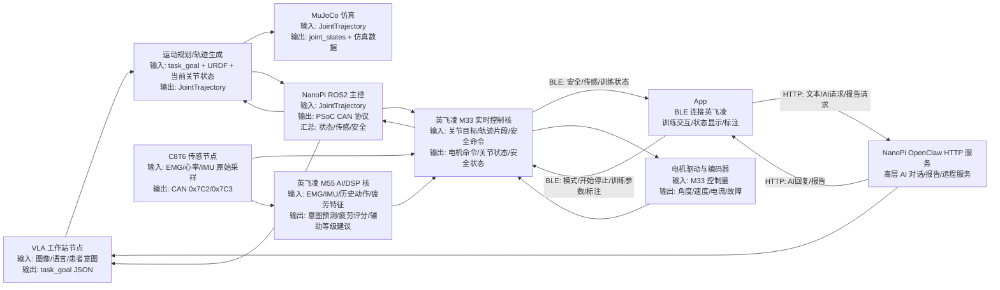

# 康复外骨骼机械臂 ROS2 仿真与真机框架教程

这份文档先解决一个问题：我们不是只做一个能让电机转的测试程序，而是要搭一个后续能持续扩展的机器人开发框架。

最重要的前提：这个机械臂最终要穿在人身上，安全不是后面再补的功能，而是整个 ROS2、仿真、NanoPi、PSoC、App、VLA 架构的第一约束。

开发时要始终遵守：

1. 新算法先仿真，再空载台架，最后才考虑人体穿戴测试。
2. NanoPi、工作站、App、VLA、OpenClaw 和 M55 都不能直接决定电机动作，只能给 M33 请求或建议。
3. M33 必须在本地检查限位、限速、急停、供电、通信超时、传感器状态和电机故障。
4. 安全状态不是 `ok` 时，不要发布真实 `JointTrajectory`。
5. 人在设备内时，不允许用调试脚本直发电机 CAN 帧。

最终目标是：

1. 在另一台 Linux 工作站上做 URDF/MuJoCo 仿真、运动规划、数据采集和标注。
2. 同一套 ROS2 轨迹接口以后可以切换到 NanoPi 真机链路。
3. NanoPi 不做正式底层电机控制，只做 ROS2 主控、通信桥接和状态汇总。
4. 英飞凌芯片负责实时控制、安全、限位、急停和部分小模型推理。
5. VLA 只做高层任务规划，比如“辅助拿杯子”，不直接发 CAN 帧控制电机。
6. App 通过蓝牙 BLE 连接英飞凌做近端控制、状态显示和训练交互；HTTP 链路只用于连接 NanoPi/OpenClaw 的高层 AI 服务。

## 1. 先理解 ROS2 在这里做什么

ROS2 可以理解成机器人系统里的“消息总线 + 工程组织方式”。

它帮我们把复杂系统拆成很多节点：

- 仿真节点：模拟机械臂运动，发布 `/joint_states`。
- 控制节点：发布 `/arm_controller/joint_trajectory`。
- 桥接节点：把 ROS 轨迹转换成给 PSoC 的 CAN 协议。
- 传感节点：汇总 EMG、心率、IMU、疲劳度等数据。
- VLA 节点：接收高层任务，生成任务目标或调用规划器。
- OpenClaw HTTP Bridge 节点：把 App 的高层 AI/文本请求转发到 NanoPi/OpenClaw，不走实时电机控制。

节点之间不直接调用彼此函数，而是通过 topic 传消息。这样仿真和真机可以共用同一个上层接口。

最重要的统一接口是：

```text
/arm_controller/joint_trajectory  工作站或控制节点发布的关节轨迹
/joint_states                     仿真或真机发布的关节状态
/rehab_arm/safety_state           安全状态
/rehab_arm/sensor_state           传感器和模型状态
/vla/task_goal                    VLA 高层任务目标
/openclaw/app_request             App 发给 NanoPi/OpenClaw 的高层请求
/openclaw/app_response            NanoPi/OpenClaw 返回给 App 的高层响应
```

## 2. 总体数据流



## 3. 各部分职责和输入输出

### Linux 工作站

工作站是研发和仿真的主环境。

输入：

- URDF/Xacro 机械臂模型。
- MuJoCo XML 或由 URDF 转换得到的仿真模型。
- 当前 `/joint_states`。
- VLA 的 `/vla/task_goal`。
- 数据集和标注文件。

输出：

- `/arm_controller/joint_trajectory`：标准关节轨迹。
- 训练动作、康复动作、拿取动作等任务序列。
- rosbag 数据包、标注结果、仿真评估结果。

工作站不直接碰 CAN，不直接给电机发私有控制帧。

### App

App 是用户、治疗师和开发者的近端交互入口。这里要分清两条链路：

```text
实时/近端链路: App -> BLE -> 英飞凌 M33/M55
高层 AI 链路: App -> HTTP -> NanoPi/OpenClaw
```

App 通过 BLE 连接英飞凌，用于训练操作和状态显示。

BLE 输入到英飞凌：

- 训练模式：被动训练、主动助力、评估、AI 助力。
- 操作命令：开始、暂停、停止、急停请求。
- 训练参数：动作类型、目标次数、辅助等级、速度档位、患者 ID。
- 标注信息：疼痛、疲劳、动作成功/失败、异常事件。

BLE 从英飞凌输出到 App：

- 当前模式、安全状态、错误码。
- EMG、心率、IMU、疲劳度、意图预测。
- 关节角度、速度、电流、温度的摘要状态。
- 训练进度、次数、评分、告警。

App 通过 HTTP 连接 NanoPi/OpenClaw，用于高层 AI 服务。

HTTP 输入到 NanoPi/OpenClaw：

- 自然语言请求，例如“生成今天的康复报告”。
- 高层任务请求，例如“帮我设计一组肘关节训练”。
- 历史数据查询和报告请求。

HTTP 从 NanoPi/OpenClaw 输出到 App：

- AI 文字回复。
- 康复训练建议。
- 数据分析结果。
- 报告摘要。

关键原则：

- App 的实时控制不走 NanoPi HTTP。
- App 的 BLE 命令进入英飞凌后，必须经过 M33 安全状态机。
- App 的 HTTP/OpenClaw 链路不能直接控制电机。
- App 可以发急停请求，但硬件急停和最终安全执行必须在 M33。

### NanoPi

NanoPi 是真机 ROS2 主控和桥接器。

输入：

- 工作站发来的 `/arm_controller/joint_trajectory`。
- PSoC 回传的关节状态、安全状态、错误码。
- PSoC 汇总或透传的传感器状态。

输出：

- CAN `0x320`：发给 PSoC 的关节目标或轨迹片段。
- CAN `0x321`：NanoPi heartbeat。
- ROS `/joint_states`。
- ROS `/rehab_arm/safety_state`。
- ROS `/rehab_arm/sensor_state`。

正式链路里，NanoPi 不直接控制电机。现在已有的 `nanopi_can_control` 只能作为调试工具保留。

### 英飞凌 M33

M33 建议作为实时控制和安全主核。

输入：

- NanoPi 的 CAN `0x320`：目标关节、目标角度、目标速度、轨迹片段序号。
- NanoPi 的 CAN `0x321`：heartbeat。
- C8T6 的 CAN `0x7C2`：EMG、心率、IMU 等传感数据。
- C8T6 的 CAN `0x7C3`：传感节点健康状态。
- M55 的意图预测、疲劳度、辅助等级建议。
- 电机编码器、电流、温度、故障反馈。
- 急停、限位开关等硬件安全输入。

输出：

- 电机底层控制命令：位置、速度、电流或力矩，具体由电机驱动协议决定。
- CAN `0x322`：PSoC 状态回复。
- 当前模式：idle、assist、training、fault、emergency_stop。
- 当前关节角度、速度、估计力矩。
- 限位、过流、过温、掉线、heartbeat timeout 等错误码。

关键原则：

- M33 是正式电机控制主站。
- M33 必须能在 NanoPi 掉线时自己进入安全状态。
- M33 必须能拒绝或限幅超限目标。

### 英飞凌 M55

M55 建议作为轻量 AI/DSP 推理核。如果当前芯片实际没有 M55，就先把这个角色理解为“后续 AI 协处理模块”。

输入：

- EMG 滤波后特征。
- IMU 姿态和角速度。
- 关节角度、速度、电流、疲劳历史。
- 患者当前训练阶段和动作标签。

输出：

- 意图预测：例如抬臂、屈肘、外展、停止。
- 疲劳评分：例如 0.0 到 1.0。
- 未来短时动作预测：例如未来 200ms 的关节趋势。
- 辅助等级建议：例如 assist_level 0 到 5。

关键原则：

- M55 不直接驱动电机。
- M55 的输出必须交给 M33 安全状态机审核。
- M55 预测错了，M33 也必须保证不会越限或危险运动。

### C8T6 传感节点

C8T6 是轻量传感采集节点。

输入：

- EMG 模拟信号。
- 心率传感器。
- IMU。
- 其他低速传感器。

输出：

- CAN `0x7C2`：传感数据，目标 100Hz。
- CAN `0x7C3`：健康状态，目标 1Hz。

C8T6 不做复杂规划，不控制电机。

## 4. 工作站仿真环境一步步搭建

下面假设另一台电脑安装 Ubuntu 24.04 + ROS2 Jazzy。后续如果你用 Ubuntu 22.04，那 ROS2 版本一般换成 Humble，命令里的 `jazzy` 要对应修改。

### Step 1: 安装 ROS2 基础环境

```bash
sudo apt update
sudo apt install -y locales software-properties-common curl gnupg lsb-release
sudo locale-gen en_US en_US.UTF-8
sudo update-locale LC_ALL=en_US.UTF-8 LANG=en_US.UTF-8
export LANG=en_US.UTF-8
```

安装 ROS2 Jazzy 后，先检查：

```bash
source /opt/ros/jazzy/setup.bash
ros2 --version
```

建议把 ROS 环境加入 shell：

```bash
echo "source /opt/ros/jazzy/setup.bash" >> ~/.bashrc
source ~/.bashrc
```

### Step 2: 安装开发工具

```bash
sudo apt install -y python3-colcon-common-extensions python3-rosdep python3-vcstool git
sudo apt install -y ros-jazzy-robot-state-publisher ros-jazzy-joint-state-publisher-gui
sudo apt install -y ros-jazzy-rviz2 ros-jazzy-xacro ros-jazzy-trajectory-msgs ros-jazzy-sensor-msgs
```

初始化 rosdep：

```bash
sudo rosdep init
rosdep update
```

如果 `sudo rosdep init` 提示已经初始化过，就跳过。

### Step 3: 拉取仓库和新分支

```bash
mkdir -p ~/rehab_ws_src
cd ~/rehab_ws_src
git clone https://github.com/ChillAmnesiac/Medical-Rehabilitation-Manipulator.git
cd Medical-Rehabilitation-Manipulator
git checkout feature/rehab-arm-ros2-architecture
```

ROS2 工作区在：

```bash
cd ~/rehab_ws_src/Medical-Rehabilitation-Manipulator/rehab_arm_ros2_ws
```

### Step 4: 安装依赖并编译第一个包

先只编译描述包，不急着跑仿真：

```bash
cd ~/rehab_ws_src/Medical-Rehabilitation-Manipulator/rehab_arm_ros2_ws
rosdep install --from-paths src --ignore-src -r -y
colcon build --symlink-install --packages-select rehab_arm_description
source install/setup.bash
```

验证 URDF 文件存在：

```bash
ros2 pkg prefix rehab_arm_description
```

### Step 5: 先让 RViz 能看到模型

目标：确认 URDF 能加载，关节名字正确，坐标方向没有明显错误。

```bash
source /opt/ros/jazzy/setup.bash
cd ~/rehab_ws_src/Medical-Rehabilitation-Manipulator/rehab_arm_ros2_ws
source install/setup.bash
ros2 launch rehab_arm_description description.launch.py
```

另开一个终端：

```bash
rviz2
```

RViz 里一般添加：

- RobotModel
- TF
- JointState

这一关通过后，我们才继续 MuJoCo。

### Step 6: 编译并运行仿真节点

```bash
cd ~/rehab_ws_src/Medical-Rehabilitation-Manipulator/rehab_arm_ros2_ws
source /opt/ros/jazzy/setup.bash
colcon build --symlink-install --packages-select rehab_arm_sim_mujoco
source install/setup.bash
ros2 run rehab_arm_sim_mujoco mujoco_sim_node.py
```

另开终端检查状态：

```bash
source /opt/ros/jazzy/setup.bash
cd ~/rehab_ws_src/Medical-Rehabilitation-Manipulator/rehab_arm_ros2_ws
source install/setup.bash
ros2 topic echo --once /joint_states
ros2 topic hz /joint_states
```

目标：

- `/joint_states` 能看到 5 个关节。
- 频率稳定，第一阶段目标 50Hz 以上。

### Step 7: 发布一条测试轨迹

```bash
cd ~/rehab_ws_src/Medical-Rehabilitation-Manipulator/rehab_arm_ros2_ws
source /opt/ros/jazzy/setup.bash
source install/setup.bash
colcon build --symlink-install --packages-select rehab_arm_control
source install/setup.bash
ros2 run rehab_arm_control demo_trajectory_node
```

观察 `/joint_states`：

```bash
ros2 topic echo /joint_states
```

目标：

- 关节位置不是一直 0。
- 关节按轨迹平滑变化。

### Step 8: 安装 MuJoCo Python

第一阶段代码即使没有 MuJoCo 也会用 fallback 简化动力学跑起来。等 URDF 和数据流稳定后，再装 MuJoCo。

```bash
python3 -m pip install --user mujoco
python3 - <<'PY'
import mujoco
print(mujoco.__version__)
PY
```

如果这一步报 OpenGL 或显卡问题，先不要卡死在这里。先保持 fallback 仿真跑通，后续再补可视化和真实 MuJoCo model。

## 5. URDF 模型后续怎么接入

你的机械臂模型准备好以后，优先放到：

```text
rehab_arm_ros2_ws/src/rehab_arm_description/urdf/
```

推荐流程：

1. 先用一个简单 URDF 表达 5 个主要关节。
2. 在 RViz 中检查 link 和 joint 的方向。
3. 给每个 joint 写清楚 limit：最小角度、最大角度、最大速度、最大 effort。
4. 再导入 CAD mesh，让外观看起来像真实机械臂。
5. 最后再转换或手写 MuJoCo XML。

不要一开始就追求完整漂亮模型。机器人开发里，关节坐标、limit、控制接口比外观 mesh 更重要。

## 6. 数据采集和标注框架

后续数据建议统一用 rosbag2 采集。

需要采集的 topic：

```text
/joint_states
/arm_controller/joint_trajectory
/rehab_arm/safety_state
/rehab_arm/sensor_state
/vla/task_goal
```

采集命令：

```bash
ros2 bag record \
  /joint_states \
  /arm_controller/joint_trajectory \
  /rehab_arm/safety_state \
  /rehab_arm/sensor_state \
  /vla/task_goal
```

建议每段数据都带一个标注 JSON，例如：

```json
{
  "session_id": "2026-05-24-patient-test-001",
  "mode": "simulation",
  "task": "elbow_flexion_training",
  "patient_state": "normal",
  "assist_level": 2,
  "operator": "lab",
  "notes": "first clean 5-joint trajectory test"
}
```

后续可以做一个 `rehab_arm_data_tools` 包，专门负责：

- 开始/停止 rosbag。
- 写入 session metadata。
- 给动作片段打标签。
- 导出 CSV 或训练数据集。

这个包不急着写，等仿真和真机 topic 稳定后再写。

## 7. 真机切换原则

仿真和真机的上层接口必须一致：

```text
控制输入: /arm_controller/joint_trajectory
状态输出: /joint_states
安全输出: /rehab_arm/safety_state
传感输出: /rehab_arm/sensor_state
```

区别只在下面这一层：

```text
仿真: JointTrajectory -> MuJoCo/fallback sim -> JointState
真机: JointTrajectory -> NanoPi -> PSoC M33 -> 电机 -> JointState
```

这样等模型好了以后，运动算法不用重写，只需要切换 launch：

```bash
# 仿真
ros2 launch rehab_arm_bringup sim.launch.py

# 真机
ros2 launch rehab_arm_bringup real_nanopi.launch.py
```

## 8. 我们接下来按什么顺序慢慢补

严格按“一次只做一个可测试目标”：

1. `rehab_arm_description`
   - 目标：URDF 在 RViz 能显示。
   - 测试：`description.launch.py` 能启动，关节名正确。

2. `rehab_arm_sim_mujoco`
   - 目标：能发布 `/joint_states`。
   - 测试：`ros2 topic hz /joint_states` 稳定。

3. `rehab_arm_control`
   - 目标：发布 demo `JointTrajectory`。
   - 测试：仿真关节会平滑动。

4. `rehab_arm_psoc_bridge`
   - 目标：NanoPi 能发送 `0x321` heartbeat，能准备好接收轨迹。
   - 测试：不接电机时先看 CAN 日志。

5. PSoC M33 协议
   - 目标：定义 `0x320/0x322` 的字段。
   - 测试：PSoC 能打印收到的目标，不驱动电机。

6. 真机闭环
   - 目标：单关节低速运动。
   - 测试：限位、急停、heartbeat timeout 都有效。

7. 数据采集
   - 目标：rosbag + metadata。
   - 测试：能回放一次完整仿真或真机动作。

8. VLA 接入
   - 目标：VLA 只输出任务目标。
   - 测试：`/vla/task_goal` 能被转换成标准 `JointTrajectory`。

## 9. 当前最重要的边界

- NanoPi 可以发 CAN，但正式路径不能直接发电机私有控制帧。
- M33 是最终安全责任方。
- M55 的预测只能作为建议，不能绕过 M33 安全状态机。
- VLA 不能直接输出电机力矩、速度或 CAN 帧。
- 所有可替换模块都围绕 ROS 标准 topic 对齐。
