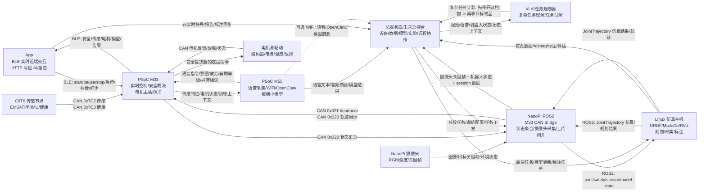

# 康复外骨骼机械臂系统架构审查稿

本文档是当前项目的总体架构基准。先用于审查和对齐，不急着一次性实现所有代码。

## 0. 安全第一原则

本项目面向康复外骨骼机械臂，最终设备会穿戴在人身上。系统架构必须把人身安全放在所有功能之前：宁可拒绝运动、降级运行或停机，也不能在安全状态不明确时继续输出力、速度或位置命令。

全局安全原则：

- 默认安全态是“不动”。上电、重启、通信中断、传感异常、轨迹异常、程序异常时，必须进入 `limited`、`fault` 或 `emergency_stop`。
- M33 是最终安全责任核心。NanoPi、Linux 工作站、App、VLA、OpenClaw、总服务器和 M55 都不能绕过 M33 直接控制电机。
- 所有外部输入都视为“不可信请求”，包括 ROS `JointTrajectory`、App BLE 命令、VLA 任务目标、M55 模型输出和服务器配置；M33 必须检查限位、限速、力矩/电流、急停、通信时效和当前模式后再决定是否执行。电源 OK 当前不作为本阶段输入，未来如加入必须先更新安全合同。
- 急停、软件限位/限速/限流、heartbeat timeout、传感器掉线和电机故障必须能在 M33 本地闭环内触发，不依赖 Linux、ROS、网络、App 或云端。
- M33 pre-arm 的安全输入合同见 [M33_SAFETY_INPUT_MAPPING.md](M33_SAFETY_INPUT_MAPPING.md)。正式穿戴模式下，急停和代码配置型限位/限速/扭矩电流限制必须同时满足 `confirmed=1` 和 `safe_now=1`，否则不得进入正式 `armed/active`。
- 开发台架固件必须使用 `control_mode=bench_armed` 区分于正式 `armed/active`；App、平台、VLA 和 NanoPi 默认不得把 `bench_armed` 当成人体穿戴运动许可。
- M33 formal clinical motion 开关默认关闭。只有显式启用 clinical build，并且 pre-arm 对 heartbeat、急停、限位、限速、扭矩/电流限制和必需电机反馈均判定 ready，才允许上报正式 `armed/active`；否则应回报 `prearm_not_ready` 或受限状态。
- 人在设备内时，不允许使用 NanoPi 直发 CANSimple/private 电机帧做运动控制；调试直控只能用于离线台架和明确隔离的诊断场景。
- VLA、M55 和 OpenClaw 只能输出任务目标、预测或辅助建议，不能输出底层电机命令，也不能覆盖 M33 的安全决策。
- 每个新功能进入真机前必须经过“仿真 -> 空载/不接人台架 -> 低能量受限动作 -> 人体穿戴测试”的分级验证。

## 1. 总目标

我们要搭建的是一套可持续扩展的康复外骨骼机械臂系统，而不是单次电机测试程序。

核心目标：

- Linux 工作站负责仿真、URDF/MuJoCo 模型、运动规划、数据采集、数据标注和后续 VLA。
- NanoPi 负责 ROS2 主控、PSoC 桥接、状态汇总，以及 NanoPi/OpenClaw 高层 AI 服务。
- 总服务器当前作为开发工具服务器，后续扩展为总控台，承载多设备管理、远程协作、数据资产、模型管理和实验追踪。
- 英飞凌 PSoC Edge E84 是正式真机控制核心，其中 M33 做实时控制和安全，M55 做轻量 AI/DSP 推理。
- C8T6 作为轻量传感节点，采集 EMG、心率、IMU 等数据。
- App 通过 BLE 连接英飞凌做近端训练交互和状态显示；App 通过 HTTP 连接 NanoPi/OpenClaw 做高层 AI 对话、报告和远程服务。
- VLA 只做高层任务规划，不直接发 CAN，不直接输出电机力矩、电流或速度。

## 2. 系统分层

```text
高层任务层:
  VLA / OpenClaw / App 高层 AI 请求

总控台与研发平台层:
  AI 合作平台/总服务器 / 多设备管理 / 数据资产 / 模型管理 / 远程协作 / 实验追踪

规划与仿真层:
  Linux 工作站 ROS2 / URDF / MuJoCo / RViz / rosbag / 数据标注

机器人主控与桥接层:
  NanoPi ROS2 / PSoC CAN Bridge / 状态汇总 / OpenClaw HTTP 服务

实时控制与安全层:
  Infineon M33 / 安全状态机 / 限位 / 急停 / 电机控制

边缘 AI 与信号处理层:
  Infineon M55 / EMG 意图预测 / 疲劳检测 / 辅助等级建议

传感与执行层:
  C8T6 传感节点 / 电机驱动 / 编码器 / 限位开关 / 急停硬件
```

## 2.0 当前职责分工基准

| 模块 | 输入 | 输出 | 职责边界 |
|---|---|---|---|
| M33 | CAN 原始电机反馈、C8T6 传感帧、M55 编号结果、NanoPi heartbeat/轨迹请求、App BLE 请求、安全输入 | M55 输入窗口、M33 安全状态、电机/输出端关节状态、M55 结果汇总、最终电机命令 | 最终安全责任核心；负责限位、限速、限流、急停、通信超时、故障和电机控制；不运行 VLA，不把运动许可交给外部 |
| M55 | M33 提供的传感窗口、电机/关节上下文、训练模式、语音/音频 | 小模型编号结果、置信度、意图/疲劳/共收缩/异常建议、语音转文字、音频摘要 | 只输出预测和建议；不直接控制电机，不放宽限位，不成为运动许可 |
| NanoPi | M33 CAN 汇总状态、M55 编号结果、摄像头、服务器/VLA 高层任务、仿真主机 ROS2 轨迹候选 | ROS topic、服务器上传、M55 编号语义解析、M33 `0x320/0x321` 请求 | ROS2 主控和上传网关；可转发经审核的轨迹候选，但不能绕过 M33 或直控电机 |
| Linux 仿真主机 | NanoPi 无线 ROS2 topic、URDF/MuJoCo、profile/限位、服务器/VLA 任务 | MuJoCo/RViz 结果、轨迹候选、rosbag/JSONL、标注和评估 | 研发、仿真、规划、数据工具；无线 ROS2 可用于状态同步和 dry-run，不承担高频真机安全闭环 |
| 服务器/总控台 | M55 语音文本、NanoPi 摄像头、输出端 joint 状态、电机诊断、M55 小模型语义、profile/限位、历史数据 | VLA 任务、分段目标、轨迹候选、数据/模型/实验管理 | 汇聚上下文和运行 VLA；不做实时电机控制，不直接发 CAN，不绕过 M33 |

机械臂包含齿轮、同步轮、减速器、连杆或推杆，所以必须区分 `motor_id`、电机轴角和机器人/人体 `joint`。上层系统默认使用输出端 joint 状态；原始电机数据只作为诊断和标定依据。任何 `motor -> joint` 换算都必须记录传动比、方向、零点、限位、回差/死区和标定版本。

## 2.0.1 整机架构地基合同

后续代码、文档、AI 协作和测试都必须沿着本节主线推进，不要另造一套控制架构。

### 唯一主线

```text
传感/电机反馈 -> M33 安全汇总 -> NanoPi ROS2/上传网关
-> Linux 仿真主机 hardware shadow / 服务器 VLA
-> 候选任务或候选轨迹 -> NanoPi
-> M33 最终安全裁决 -> 电机
```

这条主线里，真实运动命令只有一个正式入口：

```text
JointTrajectory -> NanoPi -> M33 -> 电机
```

任何新模块只能接在这条主线上，不能新增“服务器直控电机”“App HTTP 直控电机”“M55 直控电机”“仿真主机绕过 NanoPi/M33 控制电机”等旁路。

### 旁线不是控制闭环

| 旁线 | 正确用途 | 禁止事项 |
|---|---|---|
| M55 小模型 | EMG/语音/疲劳/共收缩/异常的编号结果、置信度和建议 | 不直接输出电机命令，不改变 M33 限位，不单独授权运动 |
| M33 BLE 到 App | 近端状态显示、训练 start/pause/stop 请求、急停请求、标注和 profile 确认 | App 不直接发 CAN，不绕过 M33，不把 HTTP 高层任务当实时控制 |
| NanoPi 到服务器 | 摄像头、M33 状态、输出端 joint、电机诊断、M55 语义、session 数据上传；接收服务器/VLA 高层任务 | NanoPi 不让服务器直接写 `0x320`，不把 VLA 输出当已授权轨迹 |
| Linux 仿真主机无线 ROS | MuJoCo hardware shadow、dry-run、规划候选、rosbag/标注 | 不承担高频真机安全闭环，不因无线 ROS 可达就发真实运动 |
| 7号 EL05 外部电机 | bench-debug 和 MuJoCo shadow 临时代替 6号观察链路 | 不进入正式 6DOF 关节映射、患者 profile 或 VLA 真机决策 |

### 五个设备的固定职责

| 设备/层 | 固定职责 | 当前落地状态 |
|---|---|---|
| M33 | CAN 主站、安全状态机、输出端状态汇总、最终电机控制、BLE 近端状态/请求入口 | 已对上 legacy `0x330~0x334` 和 7号 shadow；完整 6DOF formal 协议待补 |
| M55 | 板端小模型和语音/EMG 信号处理，输出编号结果给 M33，再由 NanoPi/服务器解析语义 | GitHub `M55` 分支/WiFi 工程为准；M33/M55 通讯复用 MTB-IPC queue + `.ipc_stream_shared`，见 `M33_M55_IPC_BLE_FOUNDATION.md` |
| NanoPi | ROS2 bridge、SocketCAN、摄像头采集、服务器上传、VLA 任务接收、候选轨迹转发 | 只读 product service 已自启，`enable_target_tx=false` |
| Linux 仿真主机 | URDF/MJCF/MuJoCo、hardware shadow、规划 dry-run、数据标注和可视化 | MuJoCo 6DOF hardware shadow service 已自启 |
| 服务器/总控台 | VLA、数据资产、模型版本、实验记录、多设备管理和远程协作 | 本仓库只维护接口边界；服务器实现在平台仓库 |

### 后续 AI 必须遵守

每次新增功能或文档时，先声明属于：

```text
mainline / shadow-sim / dry-run / bench-debug / offline-demo / side-channel
```

分类规则：

- 能影响真实电机的，只能走 `mainline`，最终必须到 M33 安全裁决。
- 只看 MuJoCo 或无线 ROS shadow 的，属于 `shadow-sim`。
- 生成候选轨迹但不发 `0x320` 的，属于 `dry-run`。
- 用 7号外部电机或 `nanopi_can_master.py` 的，属于 `bench-debug`。
- 历史 demo、合成数据、fallback 仿真属于 `offline-demo`。
- M55 语音/EMG、App BLE、服务器同步属于 `side-channel`，它们只能提供状态、意图、标注或建议，不能成为独立运动链路。
- M33/M55 不能新造跨核通讯，必须复用现有 `m33_m55_comm`、Infineon MTB-IPC queue 和 `.ipc_stream_shared`；M55 小模型部署按 `M55_MODEL_DEPLOYMENT_GUIDE.md`，M33 BLE 到 App 字段按 `M33_M55_IPC_BLE_FOUNDATION.md`。

后续 AI 如果发现旧文档、旧 demo 或旧启动脚本与本节冲突，必须以本节为准，更新旧内容，而不是复制一条新路线。

## 2.1 正规机器人开发路线对齐

本项目按开源机器人常见路线推进：先统一机器人模型、标准 ROS 接口和可复现实验数据，再接硬件桥接和人体安全测试。

参考的公开路线：

- ROS2 标准录制/回放：`rosbag2` 用于按 topic 记录和回放实验数据。项目内 JSONL 是为了平台、标注和训练方便，不替代正式 rosbag；后续应支持 JSONL -> ROS topic/rosbag 转换。参考：[ROS2 rosbag2 tutorials](https://docs.ros.org/en/rolling/Tutorials/Advanced/Recording-A-Bag-From-Your-Own-Node-Py.html)。
- 标准轨迹控制：真机和仿真都应围绕 `trajectory_msgs/JointTrajectory` 和 `joint_trajectory_controller`，而不是让上层直接发电机私有帧。参考：[ros2_control joint_trajectory_controller](https://control.ros.org/master/doc/ros2_controllers/joint_trajectory_controller/doc/userdoc.html)。
- 运动规划与限位：MoveIt/主流规划器会围绕 URDF/SRDF、joint limits、速度和加速度约束做规划与时间参数化；本项目的患者 ROM/限速只能收紧这些限制，不能绕过 M33。参考：[MoveIt time parameterization](https://moveit.picknik.ai/main/doc/examples/time_parameterization/time_parameterization_tutorial.html)。
- 硬件抽象：正式路线应把硬件差异收敛到 NanoPi bridge/M33 control layer 内部，上层保持统一 `/joint_states`、`/arm_controller/joint_trajectory` 和安全状态接口。参考：[ros2_control hardware components](https://control.ros.org/master/doc/ros2_control/hardware_interface/doc/hardware_components_userdoc.html)。

因此当前开发顺序固定为：

1. URDF/MuJoCo 模型和标准 joint 名称。
2. `/joint_states`、`/rehab_arm/motor_state`、`/rehab_arm/safety_state` 数据采集。
3. JSONL/rosbag 可复现记录、质量门、离线 replay plan。
4. 仿真回放和轨迹验证。
5. NanoPi -> M33 -> 电机的正式安全链路。
6. 平台/App 只做 profile、训练计划、数据、标注和人工确认入口。

## 3. 总体数据流

数据流图片：[`assets/system_data_flow.png`](assets/system_data_flow.png)



第一版推荐主链路：

```text
电机/C8T6 -> M33 -> NanoPi -> Linux 仿真主机/总服务器
NanoPi 摄像头 -> NanoPi -> 总服务器 -> VLA -> 总服务器 -> NanoPi
英飞凌语音采集/M55 小模型 -> M33/总服务器
Linux 仿真主机/服务器任务 -> NanoPi -> M33 -> 电机
M33 -> BLE -> App
```

关键修正：

- 电机状态和 C8T6 传感数据先进入 M33，M33 是实时安全边界和数据可信入口。
- M33 通过 CAN 总线汇总原始传感和电机状态，把传感窗口、训练上下文和必要状态送到 M55；M55 运行小模型后只用编号/结果码/置信度返回预测或建议，回到 M33 绑定时间戳和安全状态。
- M55 小模型结果需要由 M33 汇总后通过 CAN 发给 NanoPi；NanoPi 负责把模型结果编号按版本表解析成语义，再上传服务器并发布 ROS topic。编号语义必须带 schema/model version，避免固件和服务器解释不一致。
- App 通过 BLE 获得近端全量状态，包括传感、电机、安全和小模型结果；App 的 HTTP 链路只面向 NanoPi/OpenClaw 高层服务。
- NanoPi 负责采集摄像头数据，上传关键帧、目标检测结果、机器人状态和 session 数据到总服务器；NanoPi 也负责上传 M33 汇总后的当前位置、速度、温度、故障、电机状态、传感摘要、M55 小模型语义结果和 active profile 限位摘要。
- 因为机械结构包含齿轮、同步轮、减速器、连杆或推杆，`motor_id` 不等于人体/机器人 `joint`。服务器、仿真和 VLA 应优先使用经过传动比、方向、零点、限位、回差说明换算后的输出端 joint 状态；原始电机轴数据只能作为诊断字段保留。
- M55/英飞凌负责语音采集、小模型和语音转文字；语音文本、音频摘要、唤醒事件、模型版本和诊断信息可以上传服务器。语音命令只能作为任务意图来源，不能单独成为真机运动许可。
- VLA 固定走服务器链路，输入来自 M55 语音文本、NanoPi 摄像头、输出端 joint 状态、电机温度/速度/故障、M55 小模型结果、active profile 限位、历史数据和标注；输出复杂任务计划或运动请求，例如“辅助肘关节缓慢屈曲到 35 度范围内”。
- VLA/服务器只能下发高层任务、分段目标或可验证的轨迹候选，不能直接发 CAN 或底层电机命令；NanoPi/仿真主机生成轨迹后仍必须由 M33 检查限位、限速、力矩/电流、急停、通信时效和电机反馈后再执行。
- 当前厂家电机协议基准见：[MOTOR_PROTOCOLS.md](MOTOR_PROTOCOLS.md)。已确认 `node_id=3` 为伺泰威 CANSimple，`motor_id=4/5/6/7` 为灵足 RobStride 私有扩展帧；真实型号、机械关节绑定和最终安全限值仍需现场确认后写入 M33。

## 4. 各模块职责

### 4.1 Linux 工作站

定位：研发、仿真、规划、数据工具的主环境。

输入：

- URDF/Xacro 机械臂模型。
- MuJoCo XML 或由 URDF 转换出来的仿真模型。
- `/joint_states` 当前关节状态。
- `/vla/task_goal` 高层任务目标。
- rosbag 历史数据和标注数据。

输出：

- `/arm_controller/joint_trajectory` 标准关节轨迹。
- 仿真环境中的 `/joint_states`。
- RViz 可视化结果。
- rosbag 数据包、标注文件、训练数据集。

边界：

- 工作站不直接控制电机。
- 工作站不直接发送电机私有 CAN 帧。
- 仿真和真机都必须复用同一个 ROS 轨迹接口。

### 4.2 AI 合作平台/总服务器/未来总控台

定位：这是 AI 合作平台侧系统，不在本康复机械臂仓库里继续展开服务器实现。本仓库只维护数据接口草案、NanoPi 上传客户端和本地假服务器验证工具。

代码来源规划：

- 本地工程：`D:\ai合作产品`
- 远端仓库：`https://github.com/wenjunyong666/ai-`
- 服务器功能归入你之前提到的 AI 合作平台。
- 当前康复机械臂仓库不直接实现总控台后端，只保持接口边界清晰。

当前阶段职责：

- 接收或索引 NanoPi/工作站上传的数据资产，前提是接口由 AI 合作平台侧确认。
- 承载多设备协作、任务记录、实验追踪和远程研发工作流。
- 不参与实时控制，不作为安全链路依赖。

后续总控台职责：

- 多设备管理：NanoPi、工作站、PSoC 设备、App 客户端在线状态。
- 用户和权限：开发者、治疗师、患者、管理员角色。
- 数据资产：rosbag、标注、训练 session、康复报告、模型版本。
- 实验追踪：仿真参数、URDF/MuJoCo 版本、控制算法版本、测试结果。
- 模型管理：VLA、EMG 意图模型、疲劳检测模型、辅助策略模型。
- 远程协作：任务分发、问题追踪、远程日志查看、设备健康概览。

输入：

- 工作站上传的仿真结果、rosbag、标注和模型评估结果。
- NanoPi 上传的设备状态、运行日志、OpenClaw 交互摘要。
- App 上传的账号/session 同步、康复报告查看请求、非实时标注同步。
- OpenClaw/VLA 上传的高层 AI 轨迹、任务记录、报告生成结果。

输出：

- 给 App 的账号、历史报告、训练计划、非实时配置。
- 给工作站的数据集、模型版本、实验配置。
- 给 NanoPi 的非实时设备配置、远程调试请求、日志采集任务。
- 给 OpenClaw/VLA 的历史数据、报告上下文、任务上下文。

边界：

- 总服务器不做实时电机控制。
- 总服务器不直接发 CAN。
- 总服务器不绕过 M33 安全状态机。
- 总服务器下发的任务或配置必须进入 ROS/OpenClaw/VLA 或 App/BLE 的正常链路。
- 总服务器掉线时，真机本地控制和安全必须仍能工作。
- 康复机械臂仓库里的 `sync_test_server.py` 只是本地开发验证工具，不是正式总服务器实现。
- 已初步打通 AI 合作平台云端 `/api/rehab-arm/v1` 非实时数据上传接口；该接口只接收数据资产，不参与实时控制。

### 4.3 NanoPi

定位：真机 ROS2 主控、PSoC 桥接、状态汇总、OpenClaw HTTP 服务承载设备。

ROS 输入：

- `/arm_controller/joint_trajectory`。
- `/vla/task_goal`，如果 OpenClaw/VLA 在 NanoPi 或同网机器上运行。
- 总服务器下发的复杂任务计划、分段任务或训练配置。

CAN 输入：

- PSoC `0x322` 状态回复。
- PSoC 汇总后的关节状态、安全状态、错误码、传感摘要。

HTTP 输入：

- App 发给 NanoPi/OpenClaw 的高层 AI 请求。
- 报告生成、历史数据查询、训练建议请求。

视觉输入：

- NanoPi 本地摄像头 RGB/深度/关键帧。
- 可选本地目标检测、目标跟踪和场景状态摘要。

输出：

- CAN `0x320`：NanoPi 到 M33 的关节目标或轨迹片段。
- CAN `0x321`：NanoPi heartbeat。
- ROS `/joint_states`。
- ROS `/rehab_arm/safety_state`。
- ROS `/rehab_arm/sensor_state`。
- 上传到总服务器的摄像头关键帧、目标/遮挡物状态、机器人状态、session 数据和日志。
- HTTP/OpenClaw 对 App 的 AI 回复、报告、建议。

边界：

- NanoPi 正式路径不直接控制电机。
- `nanopi_can_control` 只能保留为 debug tool，用于 can0 bring-up、心跳观察、单电机安全调试。
- NanoPi HTTP/OpenClaw 不承担实时闭环控制。
- NanoPi 可以接收服务器/VLA 的复杂任务计划，但必须先转成可验证的分段任务或 ROS 轨迹，再交给 M33 安全审核。

### 4.4 App

定位：用户、治疗师和开发者的近端交互入口。

App 有两条链路，必须分清：

```text
实时近端链路: App <-> BLE <-> 英飞凌 M33/M55
高层 AI 链路: App <-> HTTP <-> NanoPi/OpenClaw
```

BLE 输入到英飞凌：

- 模式：passive、active、training、ai_assist、evaluation。
- 操作：start、pause、stop、emergency_stop_request。
- 训练参数：动作类型、目标次数、目标角度范围、速度档位、辅助等级、患者 ID。
- 标注：疼痛、疲劳、异常、动作成功/失败、治疗师备注。

BLE 从英飞凌输出到 App：

- 当前模式、安全状态、错误码。
- 训练进度、次数、评分、告警。
- EMG、心率、IMU、疲劳度、意图预测。
- 关节角度、速度、电流、温度的摘要状态。

HTTP 输入到 NanoPi/OpenClaw：

- 自然语言请求。
- 康复报告生成请求。
- 历史数据查询。
- 高层训练建议请求。

HTTP 从 NanoPi/OpenClaw 输出到 App：

- AI 文本回复。
- 康复报告。
- 训练建议。
- 数据分析结果。

边界：

- App 的实时控制不走 NanoPi HTTP。
- App 的 HTTP/OpenClaw 请求不能直接变成电机控制。
- App 通过 BLE 发出的动作请求也必须由 M33 安全状态机审核。

双监控 / 双控制预留：

- App BLE 是近端训练交互链路，优先用于开始、暂停、停止、急停请求、模式切换和疼痛/疲劳反馈。
- 平台/服务器是远端管理链路，优先用于多设备状态、profile 版本、数据质量、训练计划、参数草案、标注和高层任务。
- 两边都可以提出 stop/pause 类安全请求；M33 必须按更保守状态处理。
- 两边都不能直接写电机目标、CAN 帧、力矩、电流或绕过 NanoPi/M33 的正式链路。
- 如果 App 和平台同时修改患者参数，服务器必须生成 draft/review，不自动覆盖 active profile。
- 平台掉线时，App BLE 和 M33 本地安全仍能工作；App 断开时，平台只能看到状态和发起远程请求，不能替代现场急停。

### 4.5 英飞凌 M33

定位：实时控制主核、安全责任核心、电机控制主站。

输入：

- NanoPi CAN `0x320`：关节目标、目标速度、轨迹片段序号、控制模式。
- NanoPi CAN `0x321`：heartbeat。
- App BLE：模式切换、开始、暂停、停止、急停请求、训练参数。
- C8T6 CAN `0x7C2`：EMG、心率、IMU 等传感数据。
- C8T6 CAN `0x7C3`：传感节点健康状态。
- M55 推理结果：意图预测、疲劳评分、辅助等级建议、异常检测。
- 电机反馈：编码器、速度、电流、温度、故障。
- 硬件安全输入：急停、限位开关、电源状态。

输出：

- 电机底层控制命令：位置、速度、电流或力矩，具体取决于电机驱动协议。
- NanoPi CAN `0x322`：M33 状态回复。
- App BLE 状态流：安全状态、训练进度、传感摘要、告警。
- 给 M55 的传感特征、原始/预处理传感窗口、电机状态、历史动作、训练上下文。
- 给 NanoPi 的汇总状态：关节角、速度、电流/力矩摘要、故障、安全状态、传感摘要、M55 模型结果摘要。

必须实现的安全逻辑：

- 关节角度限位。
- 速度/力矩/电流限制。
- 急停状态机。
- NanoPi heartbeat 超时保护。
- C8T6 传感节点掉线检测。
- 电机故障检测。
- M55 建议审核与限幅。

边界：

- M33 是最终电机控制和安全责任方。
- 无论命令来自 NanoPi、App 还是 M55，最后都必须经过 M33 安全状态机。
- M33 必须能在 NanoPi、App 或 M55 掉线时独立进入安全状态。
- M33 对外发布的数据可以是汇总或限速后的状态流，但底层电机控制权限不能外放给 App、NanoPi、M55、VLA 或服务器。

### 4.6 英飞凌 M55

定位：边缘 AI/DSP 推理核。

当前 GitHub 对应关系和通讯地基见 [M33_M55_IPC_BLE_FOUNDATION.md](M33_M55_IPC_BLE_FOUNDATION.md)。M55 小模型部署教程见 [M55_MODEL_DEPLOYMENT_GUIDE.md](M55_MODEL_DEPLOYMENT_GUIDE.md)。M55 主线是 GitHub `M55` 分支对应的 WiFi 工程，不要把无 Git 证据的临时目录或旧 demo 当正式工程。

输入：

- M33 提供的 EMG/IMU/关节状态特征。
- C8T6 原始或预处理后的传感数据，具体由固件架构决定。
- 板端麦克风或英飞凌侧音频输入。
- 历史动作窗口，例如最近 200ms 到 2s 的动作和传感序列。
- 当前训练模式、患者状态、辅助等级。
- 可选：NanoPi/OpenClaw 的高层推理请求。

输出：

- 运动意图预测：抬肩、屈肘、外展、旋转、停止等。
- 疲劳评分：例如 `0.0~1.0`。
- 短时未来动作趋势。
- 辅助等级建议：例如 `assist_level 0~5`。
- 异常检测结果：EMG 异常、动作不协调、疑似疲劳过高。
- 可选 WiFi/语音/OpenClaw 摘要：语音识别文本、唤醒事件、音频摘要、OpenClaw 高层服务摘要、模型版本和诊断信息。

边界：

- M55 不直接控制电机。
- M55 不直接绕过 M33 输出底层控制量。
- M55 的输出是建议或预测，必须交给 M33 审核。
- M55 到服务器的 WiFi 链路可承载语音文本、音频摘要和模型摘要；第一版全量机器人状态记录仍以 NanoPi 为主。

### 4.7 C8T6 传感节点

定位：低成本、轻量传感采集节点。

输入：

- EMG 模拟信号。
- 心率/血氧传感器。
- IMU。
- 其他低速传感器。

输出：

- CAN `0x7C2`：传感数据帧，目标 100Hz。
- CAN `0x7C3`：健康状态帧，目标 1Hz。

边界：

- C8T6 不做运动规划。
- C8T6 不直接控制电机。
- C8T6 掉线后，M33 必须能降级或进入安全策略。

## 5. 统一 ROS2 接口

正式运动链路使用 ROS 标准接口：

| Topic | Type | 发布者 | 订阅者 | 说明 |
|---|---|---|---|---|
| `/arm_controller/joint_trajectory` | `trajectory_msgs/msg/JointTrajectory` | 工作站规划器/VLA 转换器 | 仿真节点/NanoPi PSoC Bridge | 统一轨迹输入 |
| `/joint_states` | `sensor_msgs/msg/JointState` | 仿真节点/NanoPi 状态聚合 | RViz/规划器/数据采集 | 统一关节状态 |
| `/rehab_arm/safety_state` | `std_msgs/msg/String` JSON | 仿真节点/NanoPi/M33 Bridge | App Bridge/数据采集/规划器 | 安全状态 |
| `/rehab_arm/sensor_state` | `std_msgs/msg/String` JSON | 仿真节点/NanoPi/M33 Bridge | 数据采集/VLA/OpenClaw | 传感器和模型状态 |
| `/vla/task_goal` | `std_msgs/msg/String` JSON | VLA/OpenClaw | 任务规划器 | 高层任务目标 |
| `/openclaw/app_request` | `std_msgs/msg/String` JSON | OpenClaw HTTP Bridge | OpenClaw/VLA/数据服务 | App 高层 AI 请求 |
| `/openclaw/app_response` | `std_msgs/msg/String` JSON | OpenClaw/VLA/数据服务 | OpenClaw HTTP Bridge | 高层 AI 回复 |
| `/server/device_state` | `std_msgs/msg/String` JSON | NanoPi/工作站 | 总服务器同步工具 | 设备状态摘要 |
| `/server/session_event` | `std_msgs/msg/String` JSON | App/OpenClaw/数据工具 | 总服务器同步工具 | 训练和实验事件 |
| `/server/model_event` | `std_msgs/msg/String` JSON | 工作站/VLA/M55 工具链 | 总服务器同步工具 | 模型版本和评估事件 |

第一阶段为了快，可以先用 `std_msgs/String` JSON 表达 safety、sensor、task。等字段稳定后，再升级成自定义 ROS msg。

### 5.1 主线和 demo/debug 边界

当前仓库历史上有较多 demo、smoke、bench 和 fallback 工具。后续 AI 和开发者必须先判断入口属于哪一类，再决定是否能接真机。

主线入口定义：

| 类别 | 当前入口 | 可进入正式路径的条件 |
|---|---|---|
| 真机状态上行 | `rehab_arm_psoc_bridge/psoc_can_bridge_node.py` 读取 M33 `0x322/0x330~0x337/0x7C2/0x7C3` | 只读状态可以接入；运动目标必须继续受 M33 审核 |
| 正式轨迹入口 | `/arm_controller/joint_trajectory` | 必须来自已审核 planner/adapter；joint schema、limit、速度、profile 和 M33 状态全部通过 |
| 6 关节 medical arm schema | `rehab_arm_description/config/medical_arm_6dof_schema.yaml` | 仅作为当前 6 关节映射草案；未完成 M33 6 关节协议前不能直连旧 5 关节 bridge |
| 仿真主机 shadow | `/sim/medical_arm/*` | 用于 6 关节 MuJoCo、可视化、规划和 dry-run；不得污染真实 `/joint_states` |

demo/debug 入口定义：

| 类别 | 当前入口 | 边界 |
|---|---|---|
| 旧 ROS 轨迹 demo | `rehab_arm_control/demo_trajectory_node.py` | 只用于 5 关节 topic smoke test；不是 6 关节 medical arm planner |
| VLA placeholder | `rehab_arm_control/vla_task_planner_node.py` | 当前仍生成 demo 轨迹；只能证明 topic 合同，不代表 VLA 已可控真机 |
| 仿真采集 demo 开关 | `sim_data_collection.launch.py enable_demo_trajectory:=true` | 只允许仿真/离线数据采集使用 |
| synthetic/smoke telemetry | `m33_motor_status_smoke.py` 等 | 只用于离线解析、recorder 和质量门，不是 fresh motor feedback |
| NanoPi 直发电机工具 | `nanopi_can_master.py`、`private/cansimple/m33 target` 类命令 | 只允许隔离台架/现场诊断；不得进入正式 bringup 或人体穿戴流程 |
| MuJoCo fallback backend | `fallback-first-order` | 只证明 ROS 节点能跑，不证明真实 MuJoCo 动力学或机械模型正确 |

强制规则：

- 任何包含 `demo`、`smoke`、`synthetic`、`bench`、`fallback` 的入口，默认不属于主线。
- demo 可以用于演示 topic、生成离线样本、回归测试和文档说明；不能用于证明真机安全可运动。
- 主线真机验证只允许从只读状态开始，再进入 `enable_target_tx=false` dry-run，最后才按单独安全审查进入真实 `0x320`。
- 后续 AI 修改代码前必须先说明目标属于主线、shadow 仿真、dry-run、bench-debug 还是离线 demo；分类不清时默认按 demo/只读处理。

## 6. CAN 接口

当前需要把“正式真机链路”和“现场调试链路”分开：

- 正式链路：NanoPi 只发 `0x320/0x321` 给 M33，由 M33 做安全审核和电机控制。
- 调试链路：`nanopi_can_master.py` 可以直接发电机协议帧，用于 can0 bring-up、单电机确认和故障诊断。

现场调试脚本默认：

```text
CAN 接口: can0
当前现场调试波特率: 1000000
```

### 6.1 NanoPi 到 M33

| CAN ID | 方向 | 用途 |
|---|---|---|
| `0x320` | NanoPi -> M33 | 关节目标/轨迹片段 |
| `0x321` | NanoPi -> M33 | NanoPi heartbeat |
| `0x322` | M33 -> NanoPi | M33 状态回复 |

第一版 `0x320` 建议包含：

- joint_id 或 joint_mask。
- target_position。
- target_velocity。
- sequence_id。
- command_mode。

第一版 `0x322` 建议包含：

- current_mode。
- safety_state。
- error_code。
- joint_state_summary。
- last_sequence_id。

### 6.2 C8T6 到 M33

| CAN ID | 方向 | 用途 |
|---|---|---|
| `0x7C2` | C8T6 -> M33 | EMG/心率/IMU 传感数据 |
| `0x7C3` | C8T6 -> M33 | C8T6 健康状态 |

目标频率：

- `0x7C2`：100Hz。
- `0x7C3`：1Hz。

### 6.3 当前已知电机 ID 与协议

下面这张表只记录当前仓库和现场调试工具已经明确出现的电机/节点 ID。

| ID | CAN 帧类型 | 协议 | 当前说明 | 机械关节绑定状态 |
|---|---|---|---|---|
| `motor_id=1` | 待确认 | 4015 小电机 | 后加腕部小电机，协议/反馈帧/减速比待补 | 腕部两轴之一，待确认对应 `wanbu_zongxiang_joint` 还是 `wanbu_hengxiang_joint` |
| `motor_id=2` | 待确认 | 4015 小电机 | 后加腕部小电机，协议/反馈帧/减速比待补 | 腕部两轴之一，待确认对应 `wanbu_zongxiang_joint` 还是 `wanbu_hengxiang_joint` |
| `node_id=3` | 标准帧 11-bit | CANSimple/ODrive 类协议 | 3 号 CANSimple 电机节点；电机轮:输出轴轮为 `1:2` | 已确认关联 `jian_hengxiang_joint`，方向/零点/安全限位待标定 |
| `motor_id=4` | 扩展帧 29-bit | 私有扩展帧 MIT 电机协议 | RS00，若干齿轮联动，最终齿轮比待补 | 已确认关联 `jian_zongxiang_joint`，齿轮比/方向/零点待标定 |
| `motor_id=5` | 扩展帧 29-bit | 私有扩展帧 MIT 电机协议 | RS00，最终输出比例/方向待标定 | 已确认关联 `zhou_zongxiang_joint` |
| `motor_id=6` | 扩展帧 29-bit | 私有扩展帧 MIT 电机协议 | EL05，最终输出比例/方向待标定 | 已确认关联 `jian_xuanzhuan_joint` |
| `motor_id=7` | 扩展帧 29-bit | 私有扩展帧 MIT 电机协议 | 外部调试电机，当前没有装在机械臂上 | 不属于当前机械臂，不进入正式映射 |

`medical_arm.zip` 当前可视化后的 6 个 URDF 关节草案：

| URDF joint | 中文含义 | 当前电机绑定 |
|---|---|---|
| `jian_hengxiang_joint` | 肩横向 | `node_id=3`，`1:2` 传动 |
| `jian_zongxiang_joint` | 肩纵向 | `motor_id=4`，齿轮比待补 |
| `jian_xuanzhuan_joint` | 肩/上臂旋转 | `motor_id=6` |
| `zhou_zongxiang_joint` | 肘纵向 | `motor_id=5` |
| `wanbu_zongxiang_joint` | 腕部纵向 | `motor_id=1/2` 之一，待确认 |
| `wanbu_hengxiang_joint` | 腕部横向 | `motor_id=1/2` 之一，待确认 |

完整草案见 [JOINT_MOTOR_MAPPING_DRAFT.md](JOINT_MOTOR_MAPPING_DRAFT.md)。后续做真机前必须补齐：

```text
wanbu_zongxiang_joint      -> motor_id 1 or 2 ?
wanbu_hengxiang_joint      -> motor_id 1 or 2 ?
jian_zongxiang_joint       -> final gear ratio ?
all mapped joints          -> direction, zero offset, hard limits, soft limits, backlash
```

### 6.4 CANSimple/ODrive 类协议

`node_id=3` 使用 CANSimple/ODrive 类标准帧协议。

标准帧 ID 计算方式：

```text
std_id = (node_id << 5) | cmd_id
```

例子：

```text
node_id = 3
heartbeat cmd_id = 0x01
std_id = (3 << 5) | 0x01 = 0x61
```

所以总线上看到标准帧 `0x061`，就是 3 号节点 heartbeat。

当前调试工具支持的 CANSimple 命令：

| 功能 | cmd_id | 说明 |
|---|---:|---|
| heartbeat | `0x01` | 节点心跳/状态 |
| set axis state | `0x07` | 进入 idle 或 closed-loop |
| set controller mode | `0x0B` | 设置位置/速度/力矩模式 |
| set input pos | `0x0C` | 位置输入 |
| set input vel | `0x0D` | 速度输入 |
| set input torque | `0x0E` | 力矩输入 |
| set limits | `0x0F` | 限制参数 |
| clear errors | `0x18` | 清错误 |

典型调试命令：

```bash
~/nanopi_can_master.py cansimple closed-loop --iface can0 --node 3 --wait 1
~/nanopi_can_master.py cansimple vel --iface can0 --node 3 --vel 0.05 --torque 0.0 --wait 1
~/nanopi_can_master.py cansimple idle --iface can0 --node 3 --wait 1
```

### 6.5 私有扩展帧 MIT 电机协议

`motor_id=4/5/6/7` 当前使用私有扩展帧协议。

扩展帧 ID 计算方式：

```text
ext_id = (comm_type << 24) | (data2 << 8) | motor_id
```

主机 ID：

```text
MASTER_ID = 0xFD
```

常用 `comm_type`：

| comm_type | 名称 | 用途 |
|---:|---|---|
| `0x00` | Get_ID | 探测电机 ID |
| `0x01` | MIT 控制 | 位置/速度/kp/kd/torque 混合控制 |
| `0x03` | Enable | 使能 |
| `0x04` | Stop | 停止，可清故障 |
| `0x06` | Set Zero | 设零 |
| `0x11` | Param Read | 读参数 |
| `0x12` | Param Write | 写参数 |
| `0x18` | Active Report | 主动上报 |

MIT 控制范围来自当前调试脚本：

| 字段 | 范围 | 单位 |
|---|---:|---|
| `pos` | `-12.57 ~ 12.57` | rad |
| `vel` | `-33.0 ~ 33.0` | rad/s |
| `kp` | `0.0 ~ 500.0` | - |
| `kd` | `0.0 ~ 5.0` | - |
| `torque` | `-14.0 ~ 14.0` | Nm |

典型调试命令：

```bash
~/nanopi_can_master.py probe --iface can0 --start 4 --end 7 --wait 0.5
~/nanopi_can_master.py private enable --iface can0 --motor 4
~/nanopi_can_master.py private speed --iface can0 --motor 4 --vel 0.05 --kd 1.0 --wait 0.5
~/nanopi_can_master.py private stop --iface can0 --motor 4 --clear-fault
```

安全边界：

- `private` 和 `cansimple` 是调试直控协议，不进入正式 ROS bringup。
- 正式运动必须走 `JointTrajectory -> NanoPi -> M33 -> 电机`。
- 未确认机械零点、方向、传动比和限位前，不允许把 `motor_id=1/2/4/5/6` 或 `node_id=3` 直接写死成正式可执行关节控制。
- `motor_id=7` 当前没有装在机械臂上，只能作为外部调试电机记录，不能进入机械臂 VLA/MuJoCo/正式控制映射。

## 7. BLE 接口

BLE 是 App 与英飞凌的近端实时交互链路。

建议第一版继续使用 Nordic UART Service 风格，先用 JSON 或短文本命令快速验证，字段稳定后再压缩成二进制。

App -> M33 示例：

```json
{"cmd":"set_mode","mode":"training"}
{"cmd":"start_session","patient_id":"p001","task":"elbow_flexion","assist_level":2}
{"cmd":"pause"}
{"cmd":"stop"}
{"cmd":"emergency_stop_request"}
{"cmd":"annotate","label":"fatigue","score":0.7}
```

M33 -> App 示例：

```json
{
  "mode": "training",
  "safety": "ok",
  "progress": 0.35,
  "shoulder": 0.42,
  "elbow": 0.81,
  "heart_rate": 76,
  "fatigue": 0.21,
  "intent": "elbow_flexion"
}
```

BLE 不承载 NanoPi 的 ROS trajectory。它负责近端训练控制、状态显示、标注和急停请求。

## 8. HTTP/OpenClaw 接口

HTTP 是 App 与 NanoPi/OpenClaw 的高层 AI 服务链路。

适合 HTTP 的内容：

- 自然语言对话。
- 康复报告生成。
- 训练建议。
- 历史数据查询。
- 远程服务和日志上传。

不适合 HTTP 的内容：

- 实时电机闭环控制。
- 高频传感器流。
- 低延迟急停闭环。
- 电机力矩、速度、电流等底层命令。

HTTP/OpenClaw 在新架构里只接受高层请求，例如“开始一组屈肘训练计划”或“生成康复报告”。它不允许直接下发电机角度，也不能绕过 M33 安全状态机。

## 9. 总服务器/总控台接口

总服务器当前是开发工具服务器，后续升级为总控台。它和 NanoPi/OpenClaw HTTP 不一样：

- NanoPi/OpenClaw 更靠近单台设备和本地 AI 服务。
- 总服务器面向多设备、多用户、多 session、多模型版本和长期数据资产。

第一版建议接口先保持非实时：

```text
App -> 总服务器:
  账号登录、历史报告、训练记录同步、非实时标注同步

NanoPi -> 总服务器:
  设备在线状态、日志摘要、OpenClaw 交互摘要、运行版本
  M33 汇总后的电机状态、传感状态、安全状态、M55 模型结果
  摄像头关键帧、目标检测/遮挡物状态、场景摘要
  session 元数据、数据文件索引、断网缓存后的补传记录

Linux 工作站 -> 总服务器:
  仿真结果、rosbag 索引、标注文件、模型评估结果

M55 -> 总服务器, 可选:
  语音文本、音频摘要、OpenClaw/模型摘要、模型版本、诊断信息
  不作为第一版全量机器人状态上传主链路

VLA -> 总服务器:
  复杂任务计划、任务分解、阶段目标、需要人工确认的风险提示
  例如: 先移开遮挡物 -> 再接近目标物 -> 再执行抓取/辅助动作

总服务器 -> 工作站/NanoPi/App:
  非实时配置、数据集索引、模型版本、远程调试任务、报告查询结果
  分段任务、训练配置、复杂任务阶段目标
```

第一版上传策略：

- 主上传网关选 NanoPi。NanoPi 同时靠近 CAN、ROS2、仿真主机和本地日志，适合做缓存、压缩、补传和 session 对齐。
- NanoPi 数据同步 API 草案见：[SERVER_SYNC_API_DRAFT.md](SERVER_SYNC_API_DRAFT.md)。
- 摄像头链路由 NanoPi 采集。第一版优先上传低频关键帧、压缩图和目标/遮挡物摘要，不建议把高码率视频放进控制必经链路。
- 高频数据先本地落盘，再按 session 上传索引和文件，避免把服务器接口做成实时闭环依赖。
- M55 如果通过 WiFi 直连服务器，上传语音文本、音频摘要、低频模型摘要、OpenClaw 服务状态或诊断信息。
- VLA 固定通过服务器接入，适合做复杂任务理解和任务分解；服务器下发到 NanoPi 的必须是高层任务或短分段目标，最终真机运动仍由 M33 审核。

不允许总服务器直接做的事情：

- 不直接发电机控制命令。
- 不直接发 CAN。
- 不绕过 NanoPi ROS2、App BLE 或 M33 安全状态机。
- 不作为急停或实时闭环控制依赖。

未来总控台可以管理：

- 设备：NanoPi、工作站、PSoC、App 在线状态。
- 数据：rosbag、标注、训练 session、报告。
- 模型：VLA 模型、EMG 模型、疲劳模型、辅助策略模型。
- 实验：仿真参数、算法版本、测试结果、失败记录。
- 协作：任务、审查、远程日志、问题追踪。

## 10. 仿真与真机切换

上层接口保持一致：

```text
控制输入: /arm_controller/joint_trajectory
状态输出: /joint_states
安全输出: /rehab_arm/safety_state
传感输出: /rehab_arm/sensor_state
```

仿真路径：

```text
VLA/OpenClaw/Planner
  -> /arm_controller/joint_trajectory
  -> MuJoCo simulation
  -> /joint_states + /rehab_arm/safety_state + /rehab_arm/sensor_state
```

真机路径：

```text
VLA/OpenClaw/Planner
  -> /arm_controller/joint_trajectory
  -> NanoPi PSoC Bridge
  -> CAN 0x320/0x321
  -> M33 safety/control
  -> motors
  -> CAN 0x322
  -> NanoPi status aggregator
  -> /joint_states + /rehab_arm/safety_state + /rehab_arm/sensor_state
```

## 11. URDF 和 MuJoCo 模型接入

模型文件放在：

```text
rehab_arm_ros2_ws/src/rehab_arm_description/urdf/
```

推荐流程：

1. 先做简化 URDF，只包含主要 link、joint、limit。
2. 在 RViz 检查关节方向、坐标系和 limit。
3. 再加入 CAD mesh。
4. 再转换或手写 MuJoCo XML。
5. 最后把 MuJoCo joint name 与 ROS joint name 对齐。

第一阶段关节：

- `shoulder_lift_joint`
- `elbow_lift_joint`
- `shoulder_abduction_joint`
- `upper_arm_rotation_joint`
- `forearm_rotation_joint`

## 12. 数据采集与标注

采集建议使用 rosbag2。

第一阶段采集 topic：

```text
/joint_states
/arm_controller/joint_trajectory
/rehab_arm/safety_state
/rehab_arm/sensor_state
/vla/task_goal
/openclaw/app_request
/openclaw/app_response
/server/device_state
/server/session_event
/server/model_event
```

标注来源：

- App BLE 标注：疼痛、疲劳、成功/失败、异常事件。
- 工作站标注工具：动作片段、任务阶段、仿真条件。
- OpenClaw/VLA 自动标签：任务目标、场景描述、训练建议。
- 总服务器标注和资产管理：session 归档、数据集版本、报告索引、模型评估记录。

建议每个 session 附带 metadata：

```json
{
  "session_id": "2026-05-24-p001-001",
  "mode": "simulation",
  "patient_id": "p001",
  "task": "elbow_flexion_training",
  "assist_level": 2,
  "data_source": ["rosbag2", "app_ble_annotation"],
  "operator": "therapist",
  "notes": "first clean multi-joint trajectory"
}
```

## 13. 分阶段实现计划

我们按“一次只实现一个能测试的小目标”推进。

### Phase 1: 架构与文档

目标：

- 明确系统分层。
- 明确 App/BLE/HTTP 边界。
- 明确 M33/M55 输入输出。
- 明确仿真和真机统一接口。

验收：

- 本文档审查通过。

### Phase 2: URDF/RViz

目标：

- 建立 `rehab_arm_description`。
- RViz 能加载简化机械臂模型。

验收：

- 5 个关节能显示。
- joint name 与规划/仿真一致。

### Phase 3: MuJoCo/Fallback 仿真

目标：

- 建立 `rehab_arm_sim_mujoco`。
- 订阅 `JointTrajectory`，发布 `/joint_states`。

验收：

- `/joint_states` 频率 50Hz 以上。
- 发布 demo 轨迹后，关节状态平滑变化。

### Phase 4: 轨迹生成

目标：

- 建立 `rehab_arm_control`。
- 支持 demo 轨迹和 VLA task placeholder。

验收：

- `/vla/task_goal` 或 demo node 能生成标准 `JointTrajectory`。

### Phase 5: NanoPi PSoC Bridge

目标：

- 建立 `rehab_arm_psoc_bridge`。
- NanoPi 能发 `0x321` heartbeat。
- NanoPi 能把 `JointTrajectory` 拆成 `0x320`。

验收：

- 不接电机时，M33/CAN 日志能看到 heartbeat 和轨迹目标。

### Phase 6: M33 协议与安全状态机

目标：

- M33 能解析 `0x320/0x321`。
- M33 能回传 `0x322`。
- M33 实现限位、限速、急停、掉线保护。

验收：

- 超限目标被拒绝或限幅。
- NanoPi 掉线后 M33 进入安全状态。

### Phase 7: App BLE

目标：

- App 通过 BLE 连接 M33。
- App 能开始/暂停/停止训练。
- App 能显示状态并写入标注。

验收：

- BLE 控制不依赖 NanoPi HTTP。
- M33 能通过 BLE 回传训练状态和安全状态。

### Phase 8: OpenClaw HTTP

目标：

- App 能通过 HTTP 连接 NanoPi/OpenClaw。
- OpenClaw 能生成报告、训练建议、高层任务请求。

验收：

- HTTP 不直接控制电机。
- OpenClaw 输出如需运动，必须转成 `/vla/task_goal` 或规划请求。

### Phase 9: 数据采集和标注

目标：

- rosbag2 采集标准 topic。
- App 标注与 rosbag session 对齐。

验收：

- 一次仿真或真机训练可以完整记录、回放和查看标注。

### Phase 10: 总服务器/总控台接入

目标：

- 将 `wenjunyong666/ai-` 的 `ai` 分支作为总服务器方向纳入工程。
- 定义 App、NanoPi、工作站、OpenClaw 到总服务器的非实时 API。
- 支持设备状态、session、数据集、模型版本和实验记录同步。

验收：

- 总服务器能看到至少一台 NanoPi 或工作站的设备摘要。
- 一次仿真 session 的 rosbag/metadata 能被登记到总服务器。
- 总服务器不能直接触发电机底层控制。

## 14. 当前关键边界

- App 近端实时链路是 BLE 到英飞凌，不是 HTTP 到 NanoPi。
- HTTP 到 NanoPi/OpenClaw 只做高层 AI、报告和远程服务。
- 总服务器/总控台只做开发工具、设备管理、数据资产、模型管理和远程协作，不做实时电机控制。
- NanoPi 正式路径不直接控制电机，只发 M33 协议帧。
- M33 是正式电机控制主站和最终安全责任方。
- M55 只输出预测和建议，不直接控制电机。
- VLA 只输出任务目标或规划请求，不直接发 CAN。
- C8T6 只采集传感器，不做运动规划，不控制电机。
- 仿真和真机必须围绕同一套 ROS topic 对齐。
