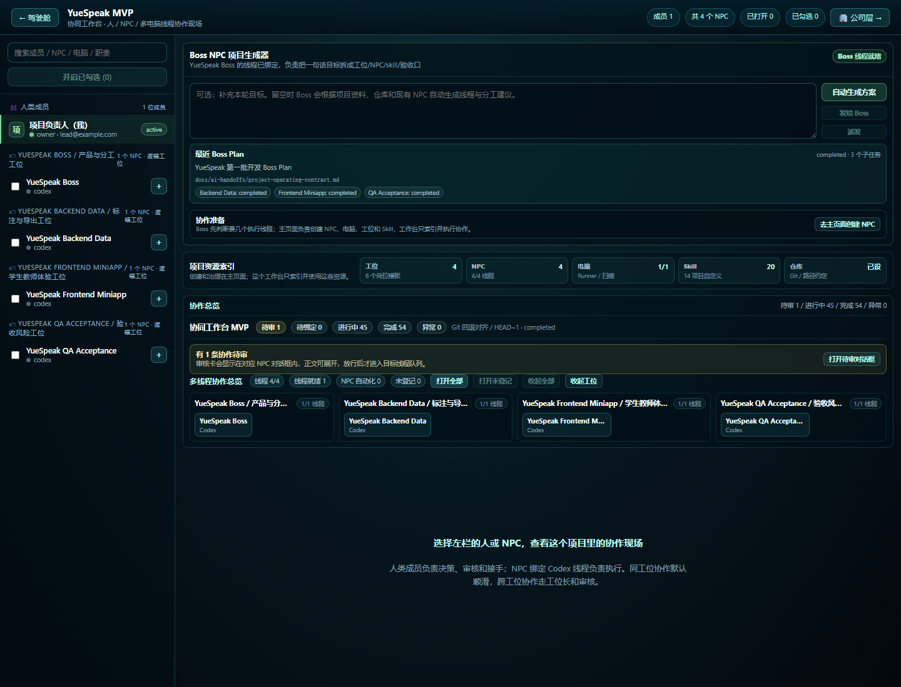
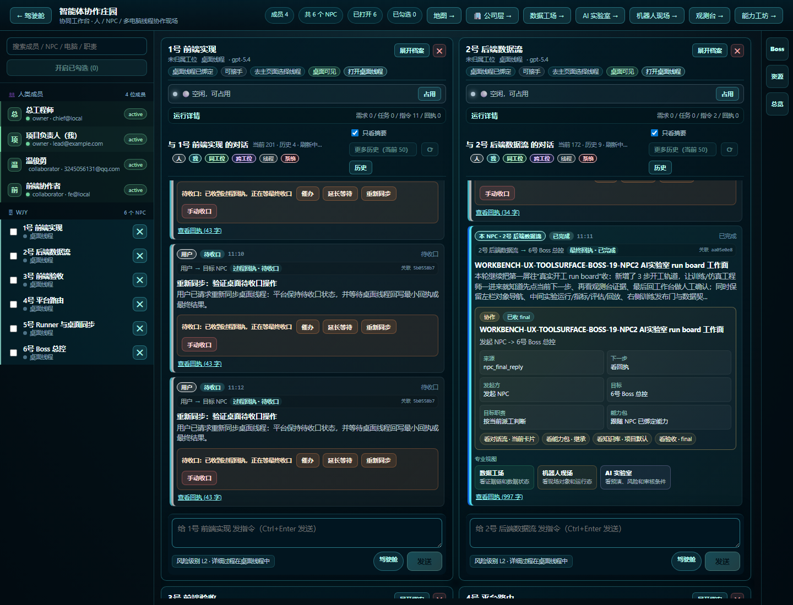
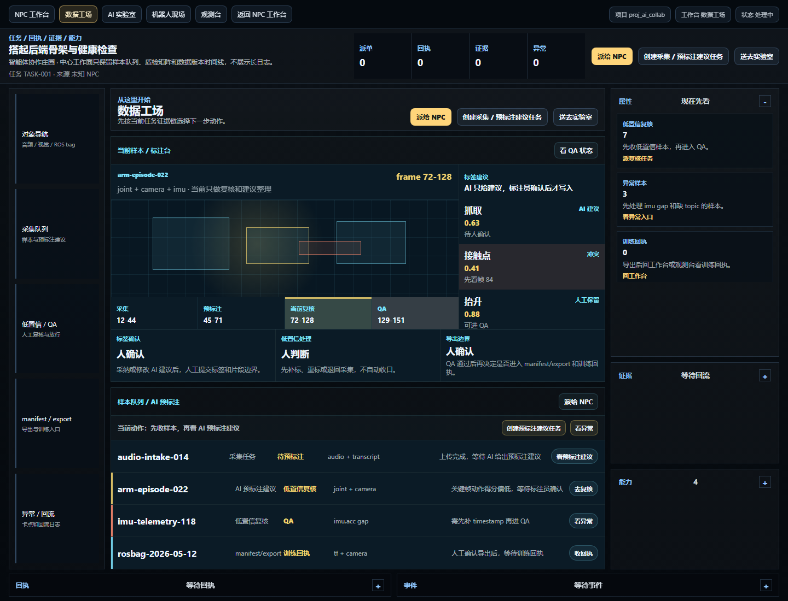
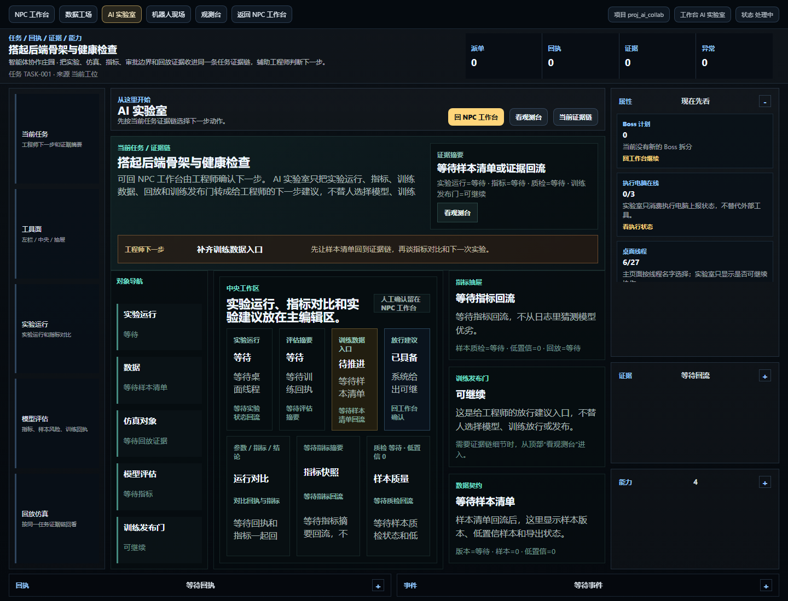
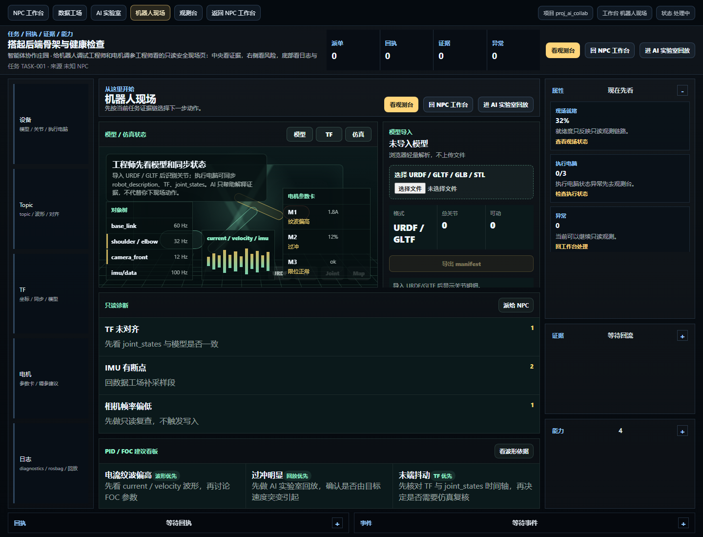
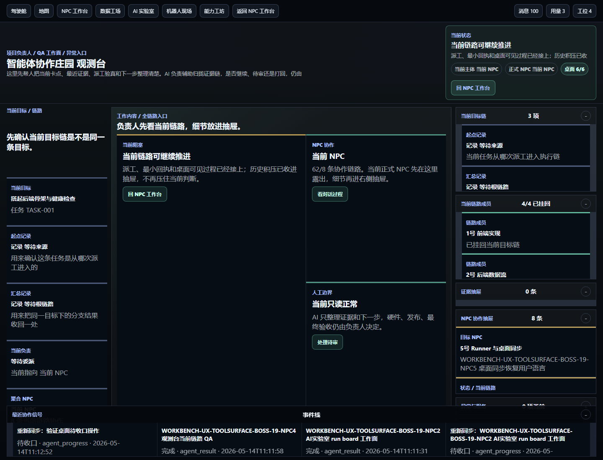

# AI 协作平台用户手册

版本：2026-05-14  
适用：项目负责人、协作者、执行电脑维护者、NPC 线程维护者

平台的核心结构是：项目 -> 工位 -> NPC -> 线程。  
主页面负责创建和治理资源，NPC 工作台负责执行协作。Codex / Claude Code 等桌面线程仍是完整处理过程所在，平台只显示用户指令、NPC 消息、审核、最小回执、最终结果和索引信息。

## 1. 平台是什么

AI 协作平台是一套“把多个 AI 线程组织成项目团队”的工作系统。它不是另一个聊天机器人，也不是要替代 Codex、Claude Code、Qwen 或本地执行电脑；它更像一个项目办公室，负责把人、电脑、AI 线程、知识库、能力包、审核和回执组织在一起。

用户只需要说清楚目标，例如“做一个英语口语训练产品”或“开发一套机械臂控制系统”。Boss NPC 先把目标拆成真实可执行的项目方案，再建议需要哪些工位、NPC、能力包、知识库和线程。用户创建或绑定好线程后，平台负责派单、审核、追踪回执和沉淀知识。

平台里的四层结构：

| 层级 | 类比 | 作用 |
|---|---|---|
| 项目 | 公司 / 产品线 | 隔离成员、仓库、任务、知识库和协作消息 |
| 工位 | 部门 / 专业组 | 组织同类能力，例如后端、前端、硬件、ROS、QA |
| NPC | 员工 / 专家角色 | 按职责接单、协作、回执、沉淀知识 |
| 线程 | Codex / Claude Code 对话框 | 真正执行和展示完整处理过程 |

## 2. 平台优势

这个平台最适合解决“一个人或小团队要同时管理很多 AI、很多电脑、很多技术栈”的问题。

主要优势：

| 优势 | 说明 |
|---|---|
| 多 AI 不乱 | 每个 NPC 绑定一个真实线程，用户能知道谁在做什么、谁回了什么 |
| 多电脑可协作 | 每台执行电脑上报自己的能力和线程，适合 Windows、Linux、GPU、机器人电脑一起工作 |
| 不浪费 token | 平台只显示精简消息，完整过程留在 Codex / Claude Code 桌面线程里 |
| 工位知识库复用 | 同工位 NPC 共享工位知识库，NPC 自己还有长期记忆 |
| GitHub 相对路径 | 知识库和任务范围使用仓库相对路径，不被某台电脑的本地路径绑死 |
| 审核有边界 | 跨工位、硬件、机器人、Git 回退、删除、发布等高风险动作强制人审 |
| 可以从一句话启动项目 | Boss NPC 会把提示词转成工位、NPC、能力包、验收口和派单计划 |
| 适合长期项目 | 回执、知识库、Git 版本、截图手册和审计记录都留在项目里 |
| 多工作台工具面 | 数据工场、AI 实验室、机器人现场、观测台都围绕同一条任务证据链工作 |
| 机器人开发模板 | 数据采集、标注、训练、仿真、ROS 只读诊断、电机调参建议都能进入同一平台 |

平台最重要的设计原则是：AI 处理过程仍在专业工具里发生，平台只做调度、可视化、审核和沉淀。这样用户既能保留 Codex / Claude Code 的强能力，又不会被多个窗口、多个线程和多台执行电脑的状态淹没。

## 2.1 一句话宣传版

AI 协作平台把 Boss、专业 NPC、执行电脑、知识库和审核规则组织成一套“AI 项目公司”。用户负责目标、判断和放行；AI 负责拆解、建议、跑只读验证、整理证据和回执。

当前可对外宣传的关键能力：

| 能力 | 用户价值 |
|---|---|
| NPC 对话工作台 | 像看项目群一样看 Boss、工程师、QA 和执行电脑的协作过程 |
| Boss 自动拆分 | 用户给目标，Boss 拆成工位、NPC、能力包、验收方式和派单 |
| NPC 自主互派 | NPC 可以主动找同工位或其他工位做 QA、复验和补充实现 |
| 专业工作台 | 数据工场、AI 实验室、机器人现场、观测台都围绕同一条任务证据链工作 |
| 人工边界 | 标注确认、QA 放行、模型选择、训练发布、真实硬件动作都由人决定 |
| 可审计回执 | 派单、最小回执、最终结果、证据和待收口动作都能追踪 |

## 3. 典型使用场景

### 3.1 单人软件项目

适合独立软件产品、内部工具、教育应用这类项目：一个人管理产品、后端、前端、测试、文档。

推荐工位：

| 工位 | NPC |
|---|---|
| Boss / 产品与分工 | Boss NPC、需求 NPC |
| 后端数据 | API NPC、数据库 NPC |
| 前端体验 | 小程序 NPC、Web UI NPC |
| QA 验收 | 测试 NPC、截图验收 NPC |

用户给 Boss 一句话目标，Boss 拆成任务后派给各 NPC。每个 NPC 在自己的桌面线程里处理，平台只显示最小回执和最终结果。

### 3.2 多人协作项目

适合小团队一起开发一个产品。项目负责人创建项目并邀请成员，成员接受邀请后进入同一个项目空间。

平台负责：

- 隔离不同项目的数据。
- 显示谁是项目 owner、谁是协作者。
- 把人工审核集中到项目里。
- 让不同成员看到同一套 NPC、工位、执行电脑和知识库状态。

### 3.3 机器人和机械臂开发

适合 App、硬件、Linux、ROS、VLA、仿真、测试分布在不同电脑上的复杂项目。

推荐工位：

| 工位 | 典型电脑 | 风险策略 |
|---|---|---|
| App / 前端 | Windows 或 Mac 开发机 | 普通代码改动可自动，发布需人审 |
| Linux / ROS | 机器人 Linux 电脑 | 节点启动、设备访问需人审 |
| 硬件 / 固件 | 硬件调试电脑 | 上电、电机、固件写入强制人审 |
| VLA / 训练 | GPU 电脑 | 数据、训练成本、模型产物需审计 |
| QA / 安全 | 任意验收电脑 | 负责最终验收和风险确认 |

这类项目的关键是多电脑：每台执行电脑只暴露自己的能力和线程，不要求别的电脑知道它的本地路径。共享知识放在 GitHub 仓库相对路径里。

### 3.4 硬件调试和实验记录

适合串口、波形、PID 调试、真机测试。平台可以让 AI 先做仿真和检查清单，再由人工确认是否允许上电、写固件或执行危险动作。

建议规则：

- 仿真和只读分析可以自动。
- 真机动作必须人工确认。
- 每次调试要留下回执、截图或实验记录。
- 失败原因要进入知识库，避免下次重复踩坑。

### 3.5 长期知识库沉淀

适合需要跨天、跨周持续推进的项目。NPC 的记忆不应该只存在聊天窗口里，而要沉淀成：

- 项目运行契约。
- 工位知识库。
- NPC 长期记忆。
- 需求 ledger。
- 验收截图和报告。
- Git 回退和版本审计。

这样几天后回来，用户不用重新解释全部上下文，Boss NPC 可以直接从项目知识库继续组织协作。

## 4. 登录或注册


打开 `http://127.0.0.1:3000/login`。

登录区有两个入口：

| 按钮 | 作用 |
|---|---|
| 登录 | 使用已有账号进入项目空间 |
| 注册 | 创建新账号后进入项目空间 |
| 进入项目空间 | 提交邮箱和密码 |

本机验证账号：

```text
邮箱：lead@example.com
密码：password
```

注册新用户时只需要显示名、邮箱、密码。新用户登录后会进入项目列表；如果别人邀请了你，邀请会出现在“收到”页签。

## 5. 项目列表、邀请和新建项目


项目列表是登录后的入口页。

| 区域/按钮 | 作用 |
|---|---|
| 当前账号 | 查看当前登录用户 |
| 项目 | 展示你已经加入的项目 |
| 邀请 | 给别人发送项目邀请 |
| 收到 | 接受别人发来的邀请 |
| 新建 | 创建一个新项目空间 |
| 进入项目主页面 | 进入该项目的资源治理页 |
| 邀请成员 | 进入邀请表单，添加协作者邮箱 |

接受邀请后，协作者会成为该项目成员；之后他只能看到自己有权限的项目，不会串到其他项目消息。

## 6. 项目主页面


项目主页面是资源治理入口，不是 NPC 执行面。软件项目、机器人项目、未来硬件仿真和 PID 调试工作台都应复用这里的资源。

顶部常用按钮：

| 按钮 | 作用 |
|---|---|
| 项目列表 | 回到所有项目 |
| NPC 工作台 | 进入多 NPC 对话瓷砖执行面 |
| 公司层 | 只看各工位长 NPC 的跨工位协作 |
| 全员广播 | 给项目成员/NPC 广播信息 |
| 仓库地址 | 进入 Git/GitHub 设置 |
| 显示场景 / 隐藏 | 展开或收起主页面场景和面板 |

右侧固定功能栏：

| 按钮 | 作用 |
|---|---|
| 开发工坊 | 管理逻辑工位、项目知识库和调度入口 |
| 主角管理 | 管理人类成员、账号主角、名下电脑与线程 |
| NPC 管理 | 创建 NPC、绑定 Codex/Claude 线程、装配能力包 |
| 电脑接入 | 注册执行电脑、生成配对令牌、扫描本机线程 |
| 能力工坊 | 创建能力包、从 GitHub 导入能力包 |
| 日程 DDL | 管理每日安排、截止时间和审核提醒 |
| 串口电视 | USB/串口扫描和硬件调试入口 |
| AI 调试 | token、跑飞保护、回执质量检查 |
| AI 仿真 | 机器人/软件任务预演 |
| 协作消息 | 审计派单、最小回执、最终回复池 |
| 线程调试 | 真实线程、心跳、队列状态 |
| Git 回退 | 版本点、只读预检、人工确认 |

主页面的“逻辑工位链路”必须先干净：NPC 要归属到工位，每个工位要有工位长。同工位 NPC 才能互相认识；跨工位请求必须走目标工位长。

## 7. 电脑接入和执行电脑


进入主页面右侧“电脑接入”。

| 卡片/按钮 | 作用 |
|---|---|
| 新建电脑 | 登记一台本地或远程电脑 |
| 生成配对令牌 | 让该执行电脑绑定到项目 |
| 本机/其他电脑接入命令 | 展示复制到目标电脑执行的接入命令 |
| 扫描线程 | 扫描该电脑上的 Codex / Claude Code 线程 |
| 绑定执行电脑 | 把已在线电脑绑定到项目 |
| 解绑执行电脑 | 解除当前电脑的项目绑定 |

多电脑原则：

- 每台电脑只上报自己的能力、线程和执行状态。
- 平台不要保存别的电脑本地绝对路径。
- 知识库、能力包和任务范围使用 GitHub 仓库相对路径。
- Claude 可以扫描和展示；执行能力按当前项目绑定的桌面线程和执行电脑逐步开放。

## 8. 能力工坊和 GitHub 导入


进入主页面右侧“能力工坊”，再打开“GitHub 导入”。

| 字段/按钮 | 作用 |
|---|---|
| GitHub 仓库 | 填能力包仓库或 agent 仓库地址 |
| 分支 | 指定导入分支 |
| 路径 | 指定仓库内相对路径 |
| 导入到能力工坊 | 读取 GitHub 内容并转成项目能力包 |

能力包用来约束 NPC 会什么、该看哪些知识库、输出什么回执。Boss NPC 会根据项目目标建议需要哪些能力包，但用户不应该手写长提示词给每个 NPC；平台应生成上岗包。

## 9. NPC 工作台


`/projects/<project_id>/workbench` 是执行面。布局规则保持：

- 左侧固定索引：人类成员、工位、NPC。
- 中间是 NPC 对话瓷砖；最多两列，第三个 NPC 自动换到下一行。
- 右侧固定工具栏；新功能放这里开浮窗，不挤占对话主区域。
- 审核消息直接出现在对应 NPC 对话时间线，消息后面带审核按钮。



打开多个 NPC 后，中间区域会按瓷砖自动排列。用户可以同时看 Boss、后端、前端、QA 等不同 NPC 的对话框；每个 NPC 仍保留自己的输入框、线程状态、最小回执和审核消息。窗口不会覆盖左侧索引和右侧工具栏。

每个 NPC 对话框里的颜色和标签含义：

| 位置 | 颜色/标签 | 含义 | 用户该怎么理解 |
|---|---|---|---|
| 消息左边色条 / 角色标签 | 人 / 灰色 | 用户从平台发给 NPC 的消息 | 这是人的指令或人工补充 |
| 消息左边色条 / 角色标签 | 我 / 青色 | 当前 NPC 自己发出的消息 | 这是这个 NPC 的回执、说明或最终结果 |
| 消息左边色条 / 角色标签 | 同工位 / 绿色 | 同一个工位里的其他 NPC 消息 | 同部门协作，通常可直接进入队列 |
| 消息左边色条 / 角色标签 | 跨工位 / 紫色 | 其他工位 NPC 或工位长转来的消息 | 跨部门协作，默认需要人工审核 |
| 消息左边色条 / 角色标签 | 线程 / 灰蓝色 | 桌面线程或执行电脑的同步消息 | 代表真实线程/本机执行器的状态回传 |
| 消息左边色条 / 角色标签 | 系统 / 红色 | 平台系统消息、错误、审核提示 | 需要注意，可能是异常、风险或平台动作 |

消息状态标签：

| 标签 | 含义 | 典型状态 |
|---|---|---|
| 派单 | 已写入协作消息池，等待目标线程处理 | 等待处理 |
| 已接单 | 目标线程或执行电脑已经接住这条派单 | 已接住 |
| 处理中 | 绑定线程正在推进，平台只等精简回执 | 处理中 |
| 需人审 | 这条消息必须人工通过后才能进入目标线程 | 等待审核 |
| 已完成 | 目标线程已经返回最终结果 | 已完成 |
| 异常 | 线程、执行电脑或平台同步报告失败 | 异常 |

审核相关标签：

| 标签 | 含义 |
|---|---|
| 待确认 | 当前消息正在等人工审核 |
| 跨工位 | 消息来自其他工位，必须走工位长和审核规则 |
| 硬件强审 | 命中了硬件、机器人、上电、固件、电机等风险词，强制人审 |
| 此关系免审中 | 用户已经允许这两个 NPC 下次协作不再审核 |
| 覆盖免审 | 虽然关系免审，但本次命中高风险规则，所以仍然强制审核 |

同一个对话框里最重要的是看三件事：谁发的、现在是什么状态、是否需要人工审核。看清这三件事后，再决定是等回执、点通过、点拒绝，还是去桌面版 Codex / Claude Code 看完整处理过程。

常用按钮：

| 按钮 | 作用 |
|---|---|
| + | 打开某个 NPC 对话瓷砖 |
| 打开全部 | 同时打开所有 NPC |
| 收起全部 | 关闭所有 NPC 瓷砖 |
| 自动生成方案 | 让 Boss NPC 生成工位、NPC、能力包、验收方案 |
| 发给 Boss | 把当前目标发给 Boss NPC |
| 派发 | 把 Boss Plan 子任务派给对应 NPC |
| 去主页面创建 NPC | 返回主页面 NPC 管理入口 |

NPC 自动化规则：

- 自动化关闭：用户在 NPC 对话框发一句话，只触发一次单次派单，不创建持续自动化。
- 自动化开启：才允许创建或使用持续心跳自动化。
- 平台只显示最小回执和最终结果，完整处理过程在绑定的 Codex / Claude Code 桌面线程里。

### 9.1 对话框就是过程时间线



新版 NPC 工作台继续保留“对话框是主体验”的结构。不同类型的信息都进入同一个对话流，用颜色、标签、结构化卡片和抽屉区分：

| 信息类型 | 在对话框里怎么看 | 用户该做什么 |
|---|---|---|
| 用户目标 | 人类消息 + 派单卡 | 确认目标和边界是否写清楚 |
| Boss 派工 | Boss/NPC 协作卡 | 看 Boss 把任务拆给了谁 |
| NPC 互派 | 同工位或跨工位消息 | 看上下游协作是否接上 |
| 桌面线程状态 | 线程/系统消息 | 等待最小回执或最终回执 |
| 待审 | 消息内审核按钮 | 人工通过、拒绝或补充要求 |
| 待收口 | 催办、延长等待、重新同步、手动收口 | 处理桌面最终回执未挂回的情况 |
| 长回执 | “查看回执 / 展开”抽屉 | 需要细看时展开，不让长文本淹没主线 |

线程绑定不在这里填写。普通用户只需要回主页面/NPC 管理，从平台扫描到的线程名字里选择，不需要知道线程 ID。

## 10. 同级专业工作台

NPC 工作台负责协作对话；数据工场、AI 实验室、机器人现场和观测台是同级专业工作台。它们不替代对话框，而是沿着同一条任务证据链展示“可操作的工作面”。

统一布局原则：

| 区域 | 作用 |
|---|---|
| 左栏 | 对象、队列、模式、设备、实验、链路 |
| 中间 | 当前真正要处理的样本、实验、波形、模型、异常或证据 |
| 右栏 | 属性、证据、风险门、动作抽屉 |
| 下方 | 日志、回执、事件抽屉，默认收起，需要时展开 |

这些工作台已经通过浏览器验收：没有水平溢出，没有文本墙风险，没有外链墙，也没有把内部字段暴露给普通用户。

### 10.1 数据工场：采集、标注、复核、导出



数据工场面向数据采集者和标注员。它把 Label Studio / FiftyOne 这类开源工具的好思路转成平台内部能力，而不是给用户一堆外链：

| 平台能力 | 用户看到什么 | 人工边界 |
|---|---|---|
| 采集任务 | 当前采集对象、元数据、缺失项 | 人决定是否补采或退回 |
| 样本队列 | 当前样本、片段、模态、状态 | 人选择下一批处理对象 |
| AI 预标注建议 | 建议标签、置信度、冲突点 | AI 只建议，人确认标签 |
| 低置信复核 | 低置信帧、异常片段、QA 卡点 | 人决定补标、重标或放行 |
| manifest/export | 导出版本、schema、训练入口 | 人确认导出 |
| 训练回执 | 训练是否收到了数据、是否有异常 | 人决定是否继续训练 |

适合宣传的说法：平台能把“采集 -> 样本队列 -> AI 预标注 -> 低置信复核 -> QA -> 导出 -> 训练回执”连成一条可审计的数据生产线。

### 10.2 AI 实验室：实验运行、评估、回放、发布门



AI 实验室面向训练/仿真工程师。它借鉴 MLflow、ClearML、FiftyOne Eval 和仿真回放的工作方式，但在平台里表现为同一任务证据链上的实验工作面：

| 平台能力 | 用户看到什么 | 人工边界 |
|---|---|---|
| 实验运行 | 当前运行状态、回执、下一步建议 | 人决定是否继续跑 |
| 指标对比 | 关键指标、质量摘要、异常入口 | 人判断模型是否更好 |
| 仿真/回放 | 回放证据、异常片段、复盘入口 | 人决定是否进入下一次实验 |
| 模型评估 | 样本风险、低置信样本、评估摘要 | 人选择模型 |
| 训练数据入口 | 对应数据工场的 manifest | 人确认数据版本 |
| 训练发布门 | 发布建议、待审、待收口 | 人放行训练和发布 |

适合宣传的说法：平台不是把模型训练变成黑盒，而是让每次训练、评估、回放和发布门都有证据、有回执、有人工边界。

### 10.3 机器人现场：ROS 只读、仿真优先、电机调试建议



机器人现场面向机器人开发者、电机调试工程师和现场 QA。它吸收 Foxglove、Webviz、PlotJuggler、rosbag2、MoveIt、Gazebo、Webots、SimpleFOC、ODrive、moteus 的常用模式，转成平台内部的只读工作面和强审动作卡：

| 平台能力 | 用户看到什么 | 人工边界 |
|---|---|---|
| Topic / diagnostics | topic 频率、诊断状态、日志入口 | 只读可自动 |
| TF / URDF / 模型 | 坐标关系、模型导入、关节状态 | 只读可自动 |
| rosbag / db3 | 回放文件、时间段、主题覆盖 | 只读可自动 |
| 波形面板 | 电流、速度、位置、IMU、力矩 | AI 解释波形，人判断 |
| 电机参数卡 | PID / FOC 建议、风险说明 | AI 只建议，不写参数 |
| 强审动作卡 | 上电、运动、写参数、firmware、ROS 写操作 | 必须人工审核 |

适合宣传的说法：平台让机器人项目从“数据、训练、仿真、现场、调参、验收”进入同一个 AI 协作闭环；AI 辅助工程师，但不替工程师触碰真实硬件。

### 10.4 观测台：当前链路、异常、待收口和审计



观测台面向项目负责人和 QA。它负责把用户目标、Boss 派工、NPC 互派、最小回执、最终回执、证据、异常和待收口动作放到一条链里。

| 平台能力 | 用户看到什么 | 用户该做什么 |
|---|---|---|
| 当前目标链 | 当前目标、起点记录、汇总记录、当前负责 | 确认是不是同一条目标 |
| NPC 协作 | 谁派给谁、是否已 final、是否待收口 | 找到卡住的 NPC |
| 待审 | 当前需要人工确认的消息 | 通过、拒绝或补充要求 |
| 待收口 | 重新同步、催办、延长等待、手动收口 | 处理桌面最终回执滞后 |
| 历史积压 | 旧待审、旧待收口、旧强审 | 放进抽屉，不压住当前判断 |
| 服务健康 | Web/API 对齐、执行电脑在线、线程可见 | 排查平台运行状态 |

适合宣传的说法：观测台不是日志墙，而是“AI 项目公司”的项目经理视图，让人看得见目标链、证据链和下一步。

## 11. NPC 到 NPC 协作和审核

同工位 NPC 默认可以顺滑互相请求帮助。跨工位必须走目标工位长，并默认进入人工审核。

审核规则：

| 场景 | 默认处理 |
|---|---|
| 同工位普通协作 | 可直接 queued |
| 跨工位协作 | pending_review，等人审核 |
| 硬件、机器人、ROS、VLA、上电、固件、电机 | 强制人工审核 |
| destructive Git、删除、reset、生产发布 | 强制人工审核 |
| 用户选择“下次不再审核” | 只对该 NPC 关系免审，可随时关闭 |

审核按钮应该跟在待审消息后面。用户只需要在对话框里看上下文，然后点通过或拒绝。

## 12. 桌面线程投递和回执

NPC 绑定桌面线程后，平台派单会进入该线程。当前已验证：

- 自动化关闭时，一句话派单不会创建自动化。
- 平台能把派单送进桌面线程。
- 平台能把桌面线程的最终回执同步回 NPC 对话框。
- 如果桌面窗口被用户误点、焦点丢失或短暂不可见，平台会优先自动重试并保留过程记录。

如果桌面线程没有立刻回最终答案，平台会显示“待收口”或“等待最终回执”，而不是假装完成。用户可以在对话框或观测台里点“催办、延长等待、重新同步、手动收口”。

## 13. Git 回退闭环


进入主页面右侧“Git 回退”，再打开“申请回退”。

| 区域/按钮 | 作用 |
|---|---|
| 可回退版本索引 | 选择 develop、main、HEAD~1 或最近协作动态引用 |
| 执行电脑状态 | 显示只读预检是否已下发、是否待回执 |
| 当前目标的 NPC 对齐 | 显示当前回退目标的 Boss/NPC 回执 |
| 历史对齐记录 | 折叠旧回退请求，避免干扰当前判断 |
| 目标版本 | 输入要预演的 ref |
| 人工确认备注 | 写明为什么要回退 |
| 登记回退请求 | 只登记、预检、通知 NPC，不直接 reset |
| 去工作台 | 回到 NPC 工作台查看对话和最终回执 |

安全规则：

- 登记回退不会执行 destructive 命令。
- 执行电脑只做只读预检。
- Boss / 工位长要回执“已对齐 / 阻塞 / 需人工”。
- 真正 reset / revert / delete 必须人工确认。

## 14. 机器人和多电脑项目怎么用

机器人项目通常分成 App、硬件、Linux、ROS、VLA、仿真、测试验收等工位。

推荐结构：

| 工位 | 典型 NPC | 执行电脑 |
|---|---|---|
| Boss / 系统集成 | Boss NPC、架构 NPC | 任意可看全仓库的电脑 |
| App / 前端 | App NPC、UI QA NPC | 前端开发电脑 |
| Linux / ROS | ROS NPC、驱动 NPC | Linux 机器人电脑 |
| 硬件 / 固件 | 固件 NPC、上电检查 NPC | 硬件调试电脑 |
| VLA / 算法 | 训练 NPC、评估 NPC | GPU 电脑 |
| QA / 风险 | 验收 NPC、安全 NPC | 可访问测试环境的电脑 |

所有工位共享 GitHub 相对知识库路径；每台电脑自己的本地路径只留在本机执行环境里。

## 15. 宣传版路线图

下面这些能力可以作为产品宣传方向写进材料里。部分能力已经可用，部分会继续按工作台和 NPC 派工逐步开放。

| 能力 | 当前状态 | 宣传说法 |
|---|---|---|
| 多 NPC 对话工作台 | 已验证 | 像管理一个 AI 项目小公司一样管理 Boss、工程师、QA 和执行电脑 |
| Boss 自动拆分与派工 | 已验证 | 用户给目标，Boss 拆成工位、NPC、验收和回执 |
| NPC 自主互派 | 已验证 | NPC 可以向同工位或其他工位请求 QA、复验和补充实现 |
| 桌面线程自动投递/重试 | 已验证 | 用户不需要理解线程细节，平台会把任务送到绑定桌面线程并追最终回执 |
| 数据采集/标注 AI 化 | 工作台已成型，继续增强 | AI 预标注、低置信复核、QA、manifest/export、训练回执进入一条链 |
| AI 实验室训练闭环 | 工作台已成型，继续增强 | 实验运行、指标、回放、模型评估、发布门可审计 |
| 机器人现场 HMI | 工作台已成型，继续增强 | ROS 只读、波形、模型、rosbag、电机参数建议、强审动作卡同屏 |
| 电机调试 AI 辅助 | 规划中 / 局部展示 | AI 给 PID/FOC 建议和实验计划，人决定是否写参数或上电 |
| 仿真优先工作流 | 规划中 / 局部展示 | 真实动作前先走回放、仿真和风险门 |
| 多电脑执行网络 | 已有基础，继续增强 | Windows、Linux、GPU、机器人电脑各自上报能力，平台统一调度 |
| 能力包 / 知识库装配 | 已有基础，继续增强 | 把开源经验、项目知识和岗位规范装进 NPC 上岗包 |
| 全链路审计 | 已验证 | 从用户目标到 Boss/NPC/桌面线程/证据/最终回执都可追踪 |

## 16. 当前已验证状态

- 登录页无登录态可打开，不再被 bootstrap 身份误跳转。
- 项目列表、邀请入口、进入项目主页面可见。
- 主页面统一治理执行电脑、NPC、线程绑定、能力包、知识库、工位。
- NPC 工作台保持对话瓷砖为主。
- 桌面线程单次派单和最终回执同步已打通。
- Git 回退显示当前目标 Boss 回执，历史记录折叠，执行电脑预检未回执会诚实展示。
- 数据工场、AI 实验室、机器人现场和观测台已通过浏览器截图验收：无水平溢出、无文本墙风险、无外链墙、无内部字段泄漏。
- 机器人和 ROS 相关页面只做只读诊断和仿真/审批入口，真实上电、部署、运动、firmware、ROS 写操作仍强制人工审核。

## 17. 常见问题

Q：为什么平台里看不到完整推理过程？  
A：平台不是替代 Codex / Claude Code。完整过程在绑定线程里，平台只显示精简回执和最终结果。

Q：为什么回退请求显示执行电脑待回执？  
A：说明对应执行电脑没有完成只读预检。先回“电脑接入”确认电脑在线，再让它继续处理队列。

Q：为什么跨工位消息要审核？  
A：跨工位会影响别的部门上下文，硬件/机器人/Git 风险更高，默认需要人工放行。

Q：为什么不能写本地绝对知识库路径？  
A：多电脑路径不同。知识库必须用 GitHub 仓库相对路径，本地路径只属于各自电脑。

Q：用户创建线程后还要写提示词吗？  
A：不应该。用户只负责创建/授权线程，Boss NPC 和平台负责生成分工、上岗包、能力包和知识库约定。
