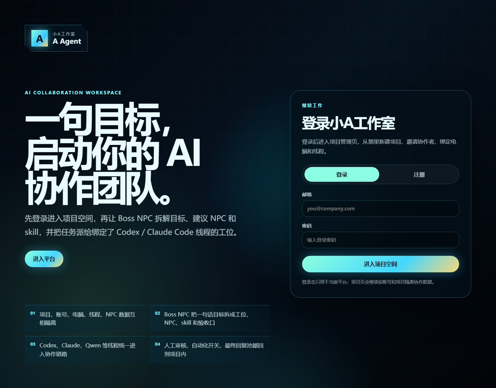
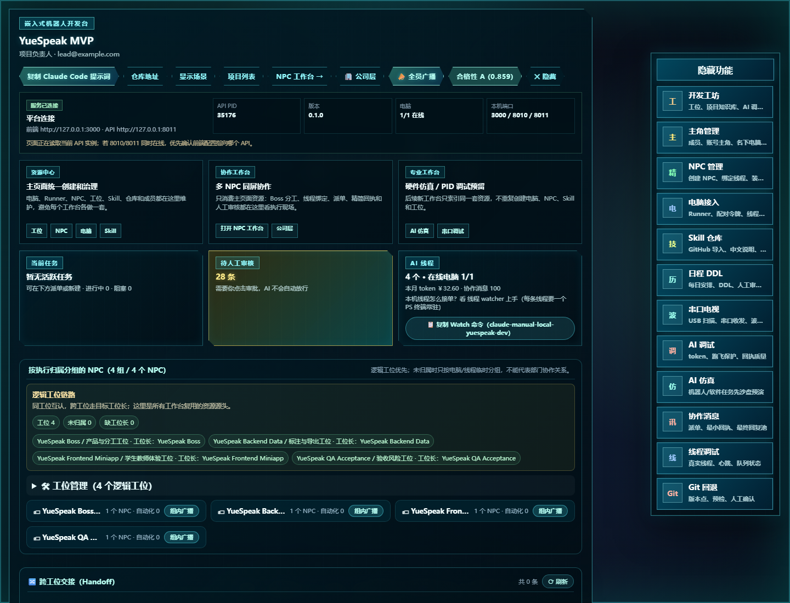
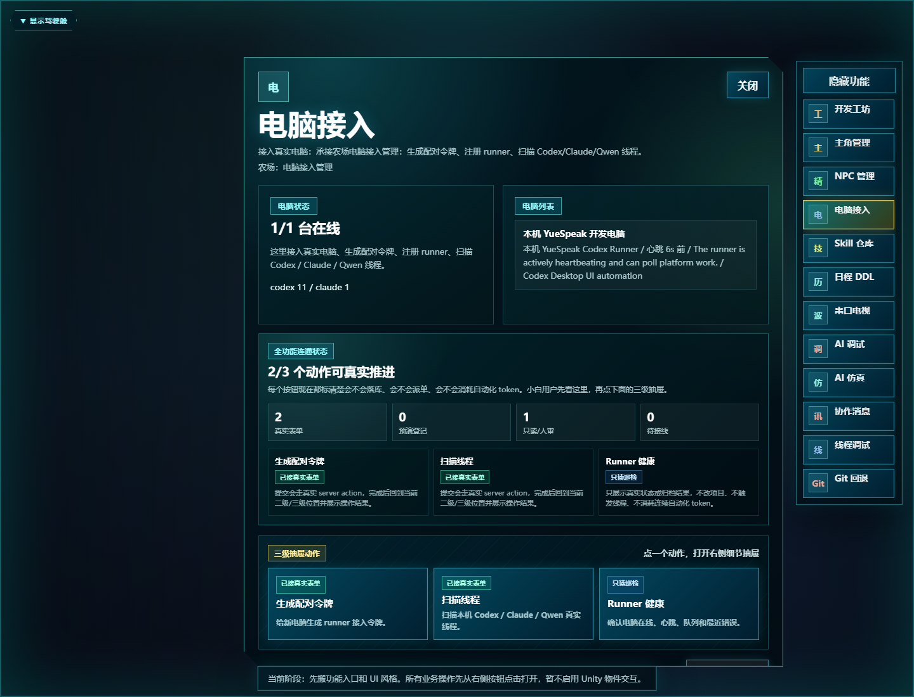
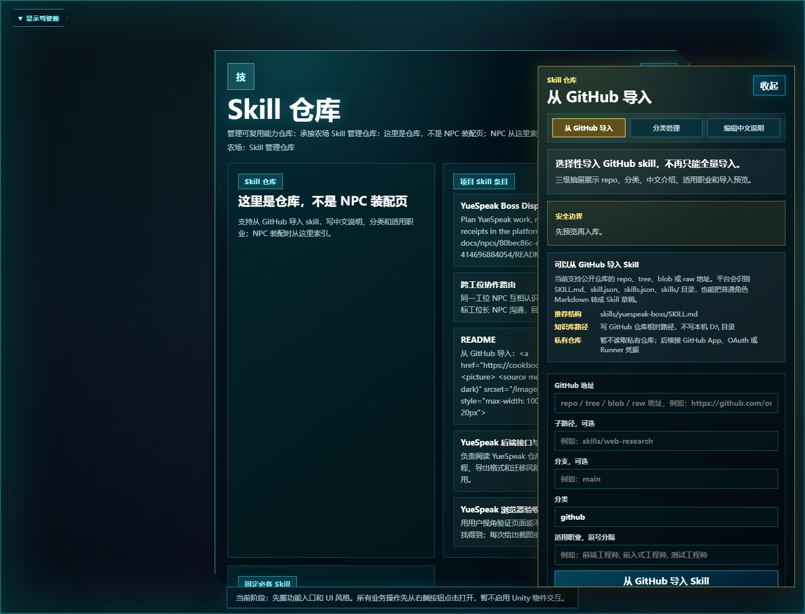
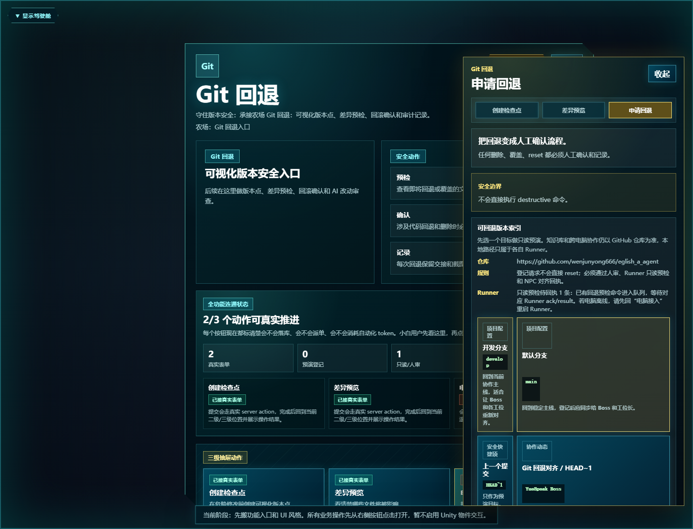

# AI 协作平台用户手册

版本：2026-05-11  
适用：项目负责人、协作者、Runner 电脑维护者、NPC 线程维护者

平台的核心结构是：项目 -> 工位 -> NPC -> 线程。  
主页面负责创建和治理资源，NPC 工作台负责执行协作。Codex / Claude Code 仍是完整处理过程所在，平台只显示用户指令、NPC 消息、审核、最小回执、最终结果和索引信息。

## 1. 登录或注册



打开 `http://127.0.0.1:3000/login`。

登录区有两个入口：

| 按钮 | 作用 |
|---|---|
| 登录 | 使用已有账号进入项目空间 |
| 注册 | 创建新账号后进入项目空间 |
| 进入项目空间 | 提交邮箱和密码 |

本机验证账号：

```text
邮箱：lead@example.com
密码：password
```

注册新用户时只需要显示名、邮箱、密码。新用户登录后会进入项目列表；如果别人邀请了你，邀请会出现在“收到”页签。

## 2. 项目列表、邀请和新建项目


项目列表是登录后的入口页。

| 区域/按钮 | 作用 |
|---|---|
| 当前账号 | 查看当前登录用户 |
| 项目 | 展示你已经加入的项目 |
| 邀请 | 给别人发送项目邀请 |
| 收到 | 接受别人发来的邀请 |
| 新建 | 创建一个新项目空间 |
| 进入项目主页面 | 进入该项目的资源治理页 |
| 邀请成员 | 进入邀请表单，添加协作者邮箱 |

接受邀请后，协作者会成为该项目成员；之后他只能看到自己有权限的项目，不会串到其他项目消息。

## 3. 项目主页面



`/projects/<project_id>/2d-upgrade` 是资源治理主页面，不是 NPC 执行面。机器人项目、YueSpeak 项目、未来硬件仿真和 PID 调试工作台都应复用这里的资源。

顶部常用按钮：

| 按钮 | 作用 |
|---|---|
| 项目列表 | 回到所有项目 |
| NPC 工作台 | 进入多 NPC 对话瓷砖执行面 |
| 公司层 | 只看各工位长 NPC 的跨工位协作 |
| 全员广播 | 给项目成员/NPC 广播信息 |
| 仓库地址 | 进入 Git/GitHub 设置 |
| 显示场景 / 隐藏 | 展开或收起主页面场景和面板 |

右侧固定功能栏：

| 按钮 | 作用 |
|---|---|
| 开发工坊 | 管理逻辑工位、项目知识库和调度入口 |
| 主角管理 | 管理人类成员、账号主角、名下电脑与线程 |
| NPC 管理 | 创建 NPC、绑定 Codex/Claude 线程、装配 Skill |
| 电脑接入 | 注册 Runner、生成配对令牌、扫描本机线程 |
| Skill 仓库 | 创建 Skill、从 GitHub 导入 Skill |
| 日程 DDL | 管理每日安排、截止时间和审核提醒 |
| 串口电视 | USB/串口扫描和硬件调试入口 |
| AI 调试 | token、跑飞保护、回执质量检查 |
| AI 仿真 | 机器人/软件任务预演 |
| 协作消息 | 审计派单、最小回执、最终回复池 |
| 线程调试 | 真实线程、心跳、队列状态 |
| Git 回退 | 版本点、只读预检、人工确认 |

主页面的“逻辑工位链路”必须先干净：NPC 要归属到工位，每个工位要有工位长。同工位 NPC 才能互相认识；跨工位请求必须走目标工位长。

## 4. 电脑接入和 Runner



进入主页面右侧“电脑接入”。

| 卡片/按钮 | 作用 |
|---|---|
| 新建电脑 | 登记一台本地或远程电脑 |
| 生成配对令牌 | 让该电脑 Runner 绑定到项目 |
| 本机/其他电脑接入命令 | 展示复制到目标电脑执行的 Runner 命令 |
| 扫描线程 | 扫描该电脑上的 Codex / Claude Code 线程 |
| 绑定 Runner | 把已在线 Runner 绑定到项目电脑 |
| 解绑 Runner | 解除当前电脑的 Runner 绑定 |

多电脑原则：

- 每台电脑由自己的 Runner 上报本机能力、线程和执行目录。
- 平台不要保存别的电脑本地绝对路径。
- 知识库、Skill 和任务范围使用 GitHub 仓库相对路径。
- Claude 可以扫描和展示；当前 YueSpeak 验证只使用 Codex 执行。

## 5. Skill 仓库和 GitHub 导入



进入主页面右侧“Skill 仓库”，再打开“GitHub 导入”。

| 字段/按钮 | 作用 |
|---|---|
| GitHub 仓库 | 填 Skill 仓库或 agent 仓库地址 |
| 分支 | 指定导入分支 |
| 路径 | 指定仓库内相对路径 |
| 导入到 Skill 仓库 | 读取 GitHub 内容并转成项目 Skill |

Skill 用来约束 NPC 会什么、该看哪些知识库、输出什么回执。Boss NPC 会根据项目目标建议需要哪些 Skill，但用户不应该手写长提示词给每个 NPC；平台应生成上岗包。

## 6. NPC 工作台


`/projects/<project_id>/workbench` 是执行面。布局规则保持：

- 左侧固定索引：人类成员、工位、NPC。
- 中间是 NPC 对话瓷砖；最多两列，第三个 NPC 自动换到下一行。
- 右侧固定工具栏；新功能放这里开浮窗，不挤占对话主区域。
- 审核消息直接出现在对应 NPC 对话时间线，消息后面带审核按钮。

常用按钮：

| 按钮 | 作用 |
|---|---|
| + | 打开某个 NPC 对话瓷砖 |
| 打开全部 | 同时打开所有 NPC |
| 收起全部 | 关闭所有 NPC 瓷砖 |
| 自动生成方案 | 让 Boss NPC 生成工位、NPC、Skill、验收方案 |
| 发给 Boss | 把当前目标发给 Boss NPC |
| 派发 | 把 Boss Plan 子任务派给对应 NPC |
| 去主页面创建 NPC | 返回主页面 NPC 管理入口 |

NPC 自动化规则：

- 自动化关闭：用户在 NPC 对话框发一句话，只触发一次单次派单，不创建持续自动化。
- 自动化开启：才允许创建或使用持续心跳自动化。
- 平台只显示最小回执和最终结果，完整处理过程在绑定的 Codex / Claude Code 桌面线程里。

## 7. NPC 到 NPC 协作和审核

同工位 NPC 默认可以顺滑互相请求帮助。跨工位必须走目标工位长，并默认进入人工审核。

审核规则：

| 场景 | 默认处理 |
|---|---|
| 同工位普通协作 | 可直接 queued |
| 跨工位协作 | pending_review，等人审核 |
| 硬件、机器人、ROS、VLA、上电、固件、电机 | 强制人工审核 |
| destructive Git、删除、reset、生产发布 | 强制人工审核 |
| 用户选择“下次不再审核” | 只对该 NPC 关系免审，可随时关闭 |

审核按钮应该跟在待审消息后面。用户只需要在对话框里看上下文，然后点通过或拒绝。

## 8. Codex Desktop 投递和回执

NPC 绑定 Codex Desktop 线程后，平台派单会进入该线程。当前已验证：

- YueSpeak Boss 绑定到 Codex Desktop 线程“制定语音训练采集方案”。
- 自动化关闭时，一句话派单不会创建自动化。
- 平台能把派单送进 Codex Desktop。
- 平台能从 session JSONL 同步最终回执回 NPC 对话框。

如果桌面线程没有立刻回最终答案，平台会显示等待 Desktop 回执，而不是假装完成。之后 adapter 的补偿同步会按 message_id 找回 acked / in_progress 的单条消息。

## 9. Git 回退闭环



进入主页面右侧“Git 回退”，再打开“申请回退”。

| 区域/按钮 | 作用 |
|---|---|
| 可回退版本索引 | 选择 develop、main、HEAD~1 或最近协作动态引用 |
| Runner 状态 | 显示只读预检是否已下发、是否待回执 |
| 当前目标的 NPC 对齐 | 显示当前回退目标的 Boss/NPC 回执 |
| 历史对齐记录 | 折叠旧回退请求，避免干扰当前判断 |
| 目标版本 | 输入要预演的 ref |
| 人工确认备注 | 写明为什么要回退 |
| 登记回退请求 | 只登记、预检、通知 NPC，不直接 reset |
| 去工作台 | 回到 NPC 工作台查看对话和最终回执 |

安全规则：

- 登记回退不会执行 destructive 命令。
- Runner 只做只读预检。
- Boss / 工位长要回执“已对齐 / 阻塞 / 需人工”。
- 真正 reset / revert / delete 必须人工确认。

## 10. 机器人和多电脑项目怎么用

机器人项目通常分成 App、硬件、Linux、ROS、VLA、仿真、测试验收等工位。

推荐结构：

| 工位 | 典型 NPC | 电脑/Runner |
|---|---|---|
| Boss / 系统集成 | Boss NPC、架构 NPC | 任意可看全仓库的电脑 |
| App / 前端 | App NPC、UI QA NPC | 前端开发电脑 |
| Linux / ROS | ROS NPC、驱动 NPC | Linux 机器人电脑 |
| 硬件 / 固件 | 固件 NPC、上电检查 NPC | 硬件调试电脑 |
| VLA / 算法 | 训练 NPC、评估 NPC | GPU 电脑 |
| QA / 风险 | 验收 NPC、安全 NPC | 可访问测试环境的电脑 |

所有工位共享 GitHub 相对知识库路径；每台电脑自己的本地路径由本机 Runner 决定。

## 11. 当前已验证状态

- 登录页无登录态可打开，不再被 bootstrap 身份误跳转。
- 项目列表、邀请入口、进入项目主页面可见。
- 主页面统一治理 Runner、NPC、线程绑定、Skill、知识库、工位。
- YueSpeak 4 个 NPC 已归属到 4 个逻辑工位，未归属为 0。
- Workbench 保持 NPC 对话瓷砖为主。
- Codex Desktop 单次派单和最终回执同步已打通。
- Git 回退显示当前目标 Boss 回执，历史记录折叠，Runner 预检 pending 会诚实展示。

## 12. 常见问题

Q：为什么平台里看不到完整推理过程？  
A：平台不是替代 Codex / Claude Code。完整过程在绑定线程里，平台只显示精简回执和最终结果。

Q：为什么回退请求显示 Runner 待回执？  
A：说明对应 Runner 没有完成只读预检。先回“电脑接入”确认 Runner 在线，再让 Runner 拉取队列。

Q：为什么跨工位消息要审核？  
A：跨工位会影响别的部门上下文，硬件/机器人/Git 风险更高，默认需要人工放行。

Q：为什么不能写本地绝对知识库路径？  
A：多电脑路径不同。知识库必须用 GitHub 仓库相对路径，本地路径只属于各自 Runner。

Q：用户创建线程后还要写提示词吗？  
A：不应该。用户只负责创建/授权线程，Boss NPC 和平台负责生成分工、上岗包、Skill 和知识库约定。
