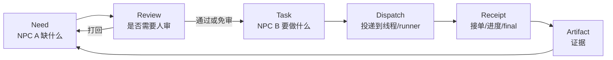
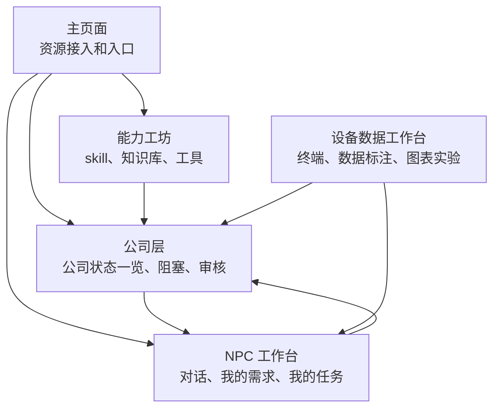

# AI 协作平台 Agent 操作系统架构合同

本文是平台后续开发的产品与工程架构合同。目标不是堆页面，而是做一个简洁、强大、可审计的项目级 AI 公司操作系统：人类决策，NPC 作为长期员工工作，电脑负责执行，所有结果都有证据链。

平台必须适配所有项目，不只服务机械臂。软件开发、嵌入式、机器人、数据采集、模型训练、仿真、QA、部署、文档都使用同一套核心对象。

所有长期协作事实以 GitHub 仓库为准。本地多电脑目录天然无法统一，只能作为某台电脑/runner 当前执行任务的工作副本。NPC、用户、runner、设备数据工作台和能力工坊之间共享的代码、文档、skill、知识库、交接、数据集索引、证据说明和 Git 记录，必须落到 GitHub 仓库相对路径、提交、分支、PR 或平台消息证据链里。UI 可以显示“当前电脑本地工作副本状态”，但不能把本地路径当作跨电脑协作依据。

## 1. 平台总结构

平台有五个一级界面：

| 界面 | 负责什么 | 简洁原则 |
| --- | --- | --- |
| 主页面 | 配置项目资源 | 保留开发工坊、主角、NPC、电脑、DDL、线程调试；能力和 Git 只给摘要入口 |
| 公司层 | 看整个公司的运行情况 | 部门态势图、员工状态、任务/需求流、阻塞和电脑健康 |
| NPC 工作台 | 和 NPC 员工一起工作 | 每个 NPC 仍是独立框，框内切换：对话 / 我的需求 / 我的任务 |
| 设备数据工作台 | 管设备调试、采集、标注、图表和实验 | 机器人现场入口，调试窗口内切换：终端 / 数据标注 / 图表实验 |
| 能力工坊 | 管能力与治理资产 | Git 治理/回退、能力包仓库、NPC 知识库、工位知识库、GitHub 导入、工具、权限 |

只有 NPC 工作台是对话优先。其他工作台都应该像 IDE 或上位机：左侧对象索引，中间真实工作区，右侧动作/属性/证据，底部紧凑日志。

旧的“数据工厂”和“AI 实验室”不再作为独立主工作台推进；它们保留为兼容入口时，只能跳到设备数据工作台里当前调试窗口的 `数据标注` tab 或 `图表实验` tab，不能复制一套独立页面流程。

旧的“驾驶舱”和“观测台”不再作为独立主工作台推进。决策、阻塞、审核和验收摘要并入公司层的公司运行状态一览图；完整证据链以抽屉/弹层/对象详情形式从 NPC 工作台、设备数据工作台和公司层打开，不再做单独观测台页面。

## 2. 核心对象定义

所有界面共享这些对象。不要为每个页面单独造一套概念。

| 对象 | 含义 | 归属 |
| --- | --- | --- |
| 项目 Project | 一个项目公司的边界 | 人类成员 |
| 成员 Member | 人类协作者 | 项目 |
| 工位 Workstation | 逻辑部门，不是电脑 | 项目 |
| NPC 坐席 NPC Seat | 长期存在的员工行 | 工位 |
| 电脑 Computer Node | 真实电脑、云服务器、开发板、工控机 | 项目 |
| Runner | 能执行或同步任务的进程 | 电脑 |
| 线程绑定 Thread Binding | 平台扫描到的 Codex/Claude/runner 线程，由用户按名字选择 | NPC 坐席 |
| 需求 Need | 某个 NPC 缺什么、需要别人帮什么 | 发起需求的 NPC |
| 任务 Task | 某个 NPC 或人要完成什么 | 承接方 |
| 派发 Dispatch | 一次具体投递/执行尝试 | 平台 |
| 消息 Message | 给用户看的对话/事件 | 项目、NPC、任务 |
| 审核 Review | 人类放行门 | 人类 |
| 回执 Receipt | 接单、进度、最终结果 | 执行方 |
| 证据 Artifact | 文件、数据集、模型、日志、截图、报告 | 产出流程 |
| 能力 Skill | 能力包 | 项目或全局 |
| 知识 Knowledge | 项目、工位、NPC 的参考资料 | 项目/工位/NPC |

跨电脑协作边界：

- GitHub 仓库相对路径、提交、分支、PR 和平台消息证据链是协作事实源。
- 本地路径只属于某台 Computer Node 的当前工作副本，只能用于本机执行、预检和调试提示。
- 任何 NPC 交接、知识库、Skill、数据集索引、实验记录、Git 预检或回退建议，都必须能回到 GitHub 相对路径或平台证据对象；不能只写 `D:\...`、`/home/...`、runner 本地缓存或某台电脑的临时文件。
- 前端不要让用户以为“多电脑本地目录会自动统一”。涉及本地目录时，只能说“当前电脑工作副本”。

最重要的语义：

- 需求属于“缺东西的一方”。例如 NPC A 需要别人帮忙，这条需求在 NPC A 的“我的需求”里。
- 任务属于“要干活的一方”。例如 NPC B 接了 NPC A 的需求，这条任务在 NPC B 的“我的任务”里。
- 派发不是任务，只是一次投递尝试。
- 消息不是队列，只是用户看的对话和事件。

### 2.1 NPC 员工表字段

`ProjectThreadWorkstation` 是项目内的 NPC 员工表。每个 NPC 至少要能描述这些信息：

| 字段 | 含义 |
| --- | --- |
| `name` | NPC 名称 |
| `responsibility` | 主要职责 |
| `responsibility_boundary` | 职责边界，明确不该越界做什么 |
| `accepted_task_types` | 可接任务类型 |
| `rejected_task_types` | 不可接任务类型 |
| `workstation_id` | 默认逻辑工位 |
| `support_workstation_ids` | 可支援工位 |
| `skill_loadout` | 已绑定 skill |
| `knowledge_paths` | 已绑定知识库 |
| `trusted_peer_ids` | 可信协作对象 |
| `review_policy` | 强审/免审/继承 |
| `current_load` | 当前负载 |
| `quality_score` | 历史质量，可后续补 |
| `runner_state` | 执行电脑/线程状态 |
| `thread_binding` | 扫描到并由用户选择的线程 |

这些字段不要求一次性全部建成数据库列；过渡期可以放在 `extra_data`，但前端、路由器和验收脚本必须按这个语义使用。

### 2.2 NPC 基础 Skill 和上岗包

员工表不能只存在于公司层页面。每个 NPC 开工时必须拿到一份由平台生成的基础 skill / 上岗包，让 NPC 真正知道自己在公司里的位置、能找谁、谁会找自己、什么情况必须创建 Need。

每创建或更新一个 NPC，平台必须同步更新这个 NPC 的基础 skill 上下文。它不是用户手写的普通提示词，而是项目员工表、协作规则和队列状态的结构化投喂。

能力工坊和上岗包不能冲突。平台必须按下面的单向关系实现：

```text
能力工坊 / 公司层配置
  -> 生成 NPC 上岗包快照
  -> NPC 工作台和 runner 执行时读取这份快照
  -> NPC 产生 Need、Task、Git 管理请求或知识沉淀建议
  -> 回到能力工坊/公司层由用户或审核后的 NPC 更新配置源
```

也就是说：

- 能力工坊是配置源，负责 skill、知识库、Git 管理策略和版本。
- 公司层是组织绑定源，负责哪个工位/NPC 使用哪些能力和知识。
- NPC 上岗包是只读运行时快照，不能成为第二套配置中心。
- NPC 上岗包生成时必须合并能力工坊的真实配置源：坐席 Skill 分配、项目 Skill 库、项目/工位/NPC 知识库索引和坐席运行元数据。不能只读取历史 `extra_data.skill_loadout`，否则能力工坊绑定和 NPC 实际开工会漂移。
- 只有 `active` 的坐席 Skill 分配进入运行中的 `skill_loadout` 和下一轮上岗包；NPC 自造 Skill 草稿、待测试 Skill、停用 Skill 只在能力工坊可见，不能悄悄改变 NPC 当前能力。
- NPC 工作台可以显示“当前上岗包来自哪些 skill/知识库”，也可以发起“请求更新能力/知识”的 Need，但不直接覆盖能力工坊配置。
- 重新生成上岗包必须可见：显示配置来源、生成时间、变更摘要和是否影响正在执行的 Task。
- 旧上岗包在任务执行中保持稳定；新配置只影响下一轮派单或用户明确刷新后的 NPC。
- 每个 NPC 第一次上岗时必须拿到默认沉淀路径：`docs/npc-knowledge/<npc-slug>/` 用于可复用知识，`skills/npc-authored/<npc-slug>/` 用于自造 Skill，`docs/npc-requests/<npc-slug>/needs/` 用于自己提出的需求证据，`docs/npc-requests/<npc-slug>/tasks/` 用于自己承接任务的回执/验收材料。NPC 工作时应先把知识、Skill、Need、Task 证据写到这些 GitHub 仓库相对路径；平台数据库队列负责当前 Need/Task 的分配、排序、状态和已完成清理，GitHub 负责长期证据源。平台消息只能作为来源证据或兜底，不是知识库/Skill/需求/任务的唯一事实。
- 平台必须允许用户在能力工坊编辑、删除、改归属这些 NPC 写入的知识和 Skill；删除/编辑的是平台索引和后续上岗包配置，GitHub 文件变化仍通过 Git 提交/PR 形成证据链。
- 平台必须允许用户在 NPC 工作台删除或归档已完成的 Need/Task 队列项；删除的是数据库工作队列/索引状态，GitHub 里的需求文件、任务回执和证据仍通过提交历史保留。
- 能力工坊的“索引 NPC 沉淀”动作必须一次性读取上述四类默认路径：知识 Markdown 登记进现有 `project_knowledge_documents`，`SKILL.md` 登记进现有 `project_skills` 和坐席 skill 分配，Need 文件登记进现有 `Requirement`/结构化 Need 队列，Task 回执文件登记进现有 `Task` 队列或任务事件。这个动作只能做索引和当前队列同步，不能创建第二套 Need/Task 系统；索引必须按仓库相对路径幂等，重复点击不能重复制造队列项。

基础 skill 至少包含：

| 内容 | 用途 |
| --- | --- |
| 当前 NPC 身份 | 让 NPC 知道自己是谁、属于哪个工位、职责边界是什么 |
| 项目员工表 | 让 NPC 知道所有 NPC 的名称、工位、职责、可接任务类型、不可接任务类型 |
| 能力和知识库 | 让 NPC 知道自己和别人装配了哪些 skill、知识库和权限 |
| 默认沉淀路径 | 让 NPC 知道新增知识写到哪里、可复用 Skill 写到哪里 |
| 默认 Need/Task 路径 | 让 NPC 知道自己提出的需求和承接任务回执写到哪里 |
| 协作关系 | 让 NPC 知道同工位伙伴、跨工位工位长、可信对象、强审对象 |
| 运行状态 | 让 NPC 知道目标 NPC 是否有绑定线程、电脑、runner、是否可投递 |
| 我的需求 | 当前 NPC 自己提出、等待别人满足的 Need |
| 我的任务 | 当前 NPC 要承接和完成的 Task |
| Need 创建规范 | 让 NPC 只能用结构化 `create_need` 写需求，不靠关键词猜派单 |
| 安全边界 | 明确硬件、部署、固件、ROS 写、模型发布、Git 回退等必须强审 |

NPC 必须通过这个基础 skill 认识其他 NPC，而不是在对话里临时猜“谁可能能帮忙”。基础 skill 的语义是：

```text
我是谁
  -> 我能做什么 / 不能做什么
  -> 谁能帮我补齐缺口
  -> 谁可能向我提需求
  -> 我怎样创建结构化 Need
  -> 我怎样查看别人给我的 Task
```

这也意味着 `request_help(role)` 这种关键词匹配只能作为兼容旧工具，不能作为新架构主路径。新路径必须是：

```text
NPC 读基础 skill
  -> 明确自己缺什么
  -> 调用 create_need()
  -> NeedRouter 基于员工表、skill、知识库、状态和审核策略路由
  -> 目标 NPC 的 Task 队列出现任务
```

## 3. 后端架构

### 3.1 现有模型复用

后端已有这些基础，不要推倒重来：

| 现有模型 | 新架构里的含义 |
| --- | --- |
| `ProjectWorkstation` | 逻辑工位/部门 |
| `ProjectThreadWorkstation` | NPC 员工坐席 |
| `ProjectComputerNode` | 电脑或云服务器 |
| `Requirement` | Need，NPC 的需求/缺口 |
| `Task` | 承接方要做的任务 |
| `TaskDispatch` | 一次派发/执行尝试 |
| `CollaborationMessage` | 对话和事件流 |

先统一语义和行为，再逐步补字段。不要为了改名重造表。

### 3.2 Need 模型合同

使用现有 `Requirement` 表作为 Need 表。

必须具备的字段，可以先放在列里，也可以过渡期放在 `extra_data`：

| 字段 | 含义 |
| --- | --- |
| `id` | 需求 ID |
| `project_id` | 项目 |
| `from_agent` | 发起需求的 NPC 坐席 ID |
| `target_seat_id` | 推荐承接 NPC，可为空 |
| `title` | 需求标题 |
| `context_summary` | 为什么需要别人帮 |
| `expected_output` | 什么结果算满足 |
| `required_capability` | 需要的能力 |
| `module` | 所属模块 |
| `priority` | P0/P1/P2/P3 |
| `priority_rank` | 用户拖动排序后的数字 |
| `risk_level` | low/medium/high/critical |
| `status` | 需求状态 |
| `review_required` | 是否需要人审 |
| `task_id` | 路由后生成的任务 |
| `dependency_requirement_id` | 依赖的其他需求 |
| `created_by_type` | human/npc/system |
| `created_by_id` | 创建者 |

Need 状态：

```text
draft 草稿
ready_to_route 待路由
needs_human_review 待人审
routed 已路由成任务
in_progress 对方处理中
satisfied 已满足
rejected 被拒绝
blocked 阻塞
cancelled 取消
archived 归档
```

### 3.3 Task 模型合同

使用现有 `Task` 表作为任务队列。

必须具备的字段：

| 字段 | 含义 |
| --- | --- |
| `id` | 任务 ID |
| `project_id` | 项目 |
| `source_need_id` | 来自哪条 Need，可为空 |
| `source_message_id` | 来自哪条消息，可为空 |
| `title` | 任务标题 |
| `description` | 任务输入和说明 |
| `assignee_seat_id` | 承接 NPC 坐席 ID |
| `assignee_user_id` | 承接人类，可为空 |
| `module` | 所属模块 |
| `priority` | P0/P1/P2/P3 |
| `priority_rank` | 用户拖动排序后的数字 |
| `risk_level` | low/medium/high/critical |
| `status` | 任务状态 |
| `acceptance_criteria` | 验收标准 |
| `required_artifacts` | 需要产出的证据 |
| `due_at` | 截止时间，可为空 |

Task 状态：

```text
draft 草稿
ready 可派发
queued 已排队
running 执行中
waiting_user 等用户补充
waiting_npc 等其他 NPC
reviewing 待验收/待审核
blocked 阻塞
done 完成
rejected 打回
cancelled 取消
archived 归档
```

### 3.4 Dispatch 模型合同

使用现有 `TaskDispatch` 表表示一次投递或执行尝试。

必须具备的字段：

| 字段 | 含义 |
| --- | --- |
| `task_id` | 所属任务 |
| `project_id` | 项目 |
| `workstation_id` | 目标 NPC 坐席或执行目标 |
| `computer_node_id` | 使用哪台电脑 |
| `runner_id` | 使用哪个 runner |
| `ai_provider_id` | 使用哪个 AI provider/线程类型 |
| `status` | 投递状态 |
| `dispatched_by_user_id` | 手动派发的人 |
| `dispatch_source` | user/npc/system |
| `attempt` | 第几次尝试 |
| `notes` | 给用户看的说明 |

Dispatch 状态：

```text
created 已创建
queued 等待投递
delivered 已送达
acked 已接单
running 执行中
waiting_closeout 等收口
completed 完成
failed 失败
cancelled 取消
```

### 3.5 NeedRouter 服务

新增一个明确的服务边界：`NeedRouter`。

它负责：

1. 接收 NPC 或用户创建的结构化 Need。
2. 从 NPC 员工表里推荐承接 NPC。
3. 判断是否需要人类审核。
4. 审核通过或可自动路由时，创建一个或多个 Task。
5. 串起 Need -> Task -> Dispatch -> Message -> Receipt -> Artifact。

路由依据：

- NPC 职责
- 所属工位
- skill
- 知识库
- 在线/可用状态
- 当前任务量
- 信任/审核规则
- 风险级别
- 用户手动指定

禁止只靠关键词自动派单。关键词只能辅助推荐，前提是 NPC 已经创建了结构化 Need。

路由算法顺序必须固定：

1. 硬性安全规则：硬件、部署、真实运动、固件、ROS 写、Git 回退等先判强审或禁止。
2. 必需能力匹配：`required_capability` 必须命中 NPC 职责、skill 或知识库。
3. 工位和信任策略：同工位优先，跨工位默认找目标工位长或进入审核。
4. runner 和线程可用性：目标 NPC 必须有可用绑定线程，否则不能假装已 queued。
5. 当前负载：负载低者优先。
6. 用户偏好：用户指定的默认承接 NPC、信任关系、强审关系优先。
7. 历史质量：后续按完成率、失败率、平均响应时间加权。

`NeedRouter` 输出必须包含：

| 字段 | 含义 |
| --- | --- |
| `recommended_assignee_id` | 推荐承接 NPC |
| `alternatives` | 候选 NPC 列表 |
| `requires_review` | 是否需要人审 |
| `review_reason` | 为什么要审或为什么免审 |
| `route_risk` | 路由风险 |
| `will_create_tasks` | 预计创建的任务 |
| `blocked_reason` | 无法路由时的原因 |

### 3.5.1 NPC 创建 Need 的最小格式

NPC 不能只在对话里说“我可能需要某某帮忙”。它必须调用结构化能力创建 Need。

最小 schema：

```json
{
  "title": "需要完成什么",
  "why_needed": "为什么当前 NPC 需要别人帮",
  "required_capability": "需要的能力",
  "expected_output": "对方交付什么才算满足",
  "input_context": "给承接方的必要上下文",
  "risk_level": "low | medium | high | critical",
  "priority": "P0 | P1 | P2 | P3",
  "suggested_assignee": "可选，推荐 NPC 坐席 ID",
  "acceptance_criteria": ["验收点 1", "验收点 2"],
  "blocking_current_task": true
}
```

没有 `expected_output` 和 `acceptance_criteria` 的 Need 只能保存为草稿，不能自动路由。

### 3.6 审核策略

必须人审：

- NPC 创建跨工位 Need。
- 风险级别是 high 或 critical。
- 涉及硬件、部署、固件、模型发布、Git 回退、真实运动、ROS 写/service/action。
- 承接 NPC 不确定。
- 项目、工位或 NPC 策略要求强审。

不需要人审：

- 用户手动把任务派给某个 NPC。
- 同工位、低风险、已信任的 Need。
- 用户明确设置过这对 NPC 免审。
- 用户在设备数据工作台当前调试窗口里主动发起的安全只读/采集类操作，例如扫描真实接口、开始采集、停止采集、用户终端输入。它们可以直接进入目标电脑队列；通用 runner 命令、NPC/AI 代操作、写参数、真实运动、固件、部署、ROS 写/service/action 仍必须按风险策略进入审核。

用户永远不应该审核自己的普通消息。

审核结果闭环：

| 用户动作 | 后端结果 | 前端表现 |
| --- | --- | --- |
| 通过 | Need 从 `needs_human_review` 变 `routed`，创建目标 Task 和 Dispatch | 发起 NPC 的“我的需求”变为已派出，目标 NPC 的“我的任务”出现任务 |
| 打回 | Need 变 `rejected` 或 `blocked`，原因回写给发起 NPC | 发起 NPC 在对话和“我的需求”看到打回原因 |
| 修改承接人 | 重新 route-preview，再创建 Task | 审核卡显示新的承接人和风险 |
| 修改优先级/风险 | 更新 Need 后重新计算审核策略 | 队列排序和审核文案同步变化 |

### 3.7 Runner 和线程状态

任务投递流程必须是：

```text
Task
  -> assignee NPC
  -> thread binding
  -> runner
  -> computer node
```

如果任一环不可用，不能假装派发成功。

Codex 有两种投递通道，不能混用：

- `codex_desktop_ui`：默认可见通道。用户要求“桌面版能实时看到”时必须优先使用，完整过程在绑定电脑的 Codex Desktop 线程里发生，平台只同步最小回执、最终结果和阻塞原因。
- `codex_app_server`：显式后台通道。它可以用于 Linux/VS Code 插件/无界面或用户明确允许的后台执行，但仍必须由绑定的真实电脑 runner 执行。云端 API 服务器默认不能代替目标电脑启动 app-server，否则会把 Windows/Linux 派单抢到错误机器上；只有运维显式设置 `AI_COLLAB_ENABLE_SERVER_CODEX_APP_SERVER_AUTOSTART=1` 时，API 服务器才允许本机自启动。

线程绑定唯一性：

- 真实线程不是 NPC。扫描出来的 Codex/Claude/插件/CLI 线程只是执行资源，正式 NPC 坐席才是员工。
- 同一项目内，一个真实执行线程同一时刻只能绑定给一个正式 NPC 坐席。扫描线程条目可以存在于资源索引里，但不能被多个正式 NPC 同时当作自己的线程；否则派单回执会串到错误员工瓷砖。
- 如果用户要换人使用同一线程，必须先从旧 NPC 解绑或换到新的真实线程，再给新 NPC 绑定。历史别名只能用于显示和兼容旧记录，不能作为默认派单目标。

因此：用户手动派给某个 NPC 后，原始 NPC 指令要留在该 NPC 的 workstation inbox，等待绑定电脑 runner 拉取并执行；电脑级 runner command 只能作为接单/设备/外层通知，不能替代 NPC 线程执行结果。

NPC 工作台回执显示口径：

- 瓷砖里的“回执”既包括结构化 `Receipt`，也包括同一 NPC 对话流里的 `agent_result`、`runner_result`、`requirement_final_reply`、`desktop_minimal_receipt` 等最终/过程结果消息。
- 同一派单已经有最终回执时，默认摘要视图应折叠旧的派单命令和中间失败/接单噪声，优先让用户看到最新成功/阻塞结果；完整历史仍可通过“历史”展开。

统一 runner/线程状态：

| 状态 | 含义 | 派单行为 |
| --- | --- | --- |
| `online` | 在线且可投递 | 可以派发 |
| `recently_seen` | 最近在线但当前心跳不稳 | 可排队，提示可能延迟 |
| `queued` | 用户或平台已把命令放入目标电脑队列，等待 runner ack | 显示已排队，不显示已执行 |
| `stale` | 心跳过期 | 进入等待电脑恢复 |
| `offline` | 离线 | 不投递，允许重试/换电脑/换线程 |
| `unknown` | 未确认 | 不误导用户，提示先检查接入 |
| `occupied` | 被其他用户/线程占用 | 允许申请接手或改派 |

前端统一文案：

- 可投递
- 最近在线，可能延迟
- 等待电脑恢复
- 离线，需重连
- 状态未知，先检查接入
- 他人操作中

### 3.8 数据库硬字段建议

为避免用户手动派单和 NPC Need 派生任务混淆，后续迁移建议补这些字段：

| 表 | 字段 | 含义 |
| --- | --- | --- |
| `tasks` | `task_source` | `user_manual | npc_need | system` |
| `tasks` | `source_need_id` | 来源 Need |
| `tasks` | `assignee_seat_id` | 承接 NPC |
| `requirements` | `required_capability` | 需要能力 |
| `requirements` | `priority_rank` | 拖动排序 |
| `tasks` | `priority_rank` | 拖动排序 |
| `task_dispatches` | `dispatch_source` | `user | npc | system` |
| `task_dispatches` | `attempt` | 投递次数 |

在字段落库前，可以用 `extra_data` 兼容，但 API 和前端必须使用同一语义。

## 4. 前端架构

### 4.1 全局布局合同

所有非 NPC 对话界面尽量保持一致：

```text
左侧：对象索引 / 资源 / NPC 引用
中间：真实工作区
右侧：动作 / 属性 / 证据 / 审核
底部：紧凑日志 / 回执 / 事件
```

不要做长页面。高级信息进抽屉。默认界面应该让用户马上知道下一步能干什么。

P1 的含义是重构，不是修修补补。除 NPC 工作台以外的工作台都要按同一套视觉语言和同一套 IDE / 上位机结构重建：

- 视觉风格要和 NPC 工作台一致：角色色彩、状态芯片、紧凑边框、结构化卡片、清晰 hover / active / pressed 反馈。
- 页面结构必须是 IDE 或调试上位机：左侧对象索引，中间一个当前工具工作区，右侧功能按钮和抽屉，底部紧凑日志。
- 设备数据工作台的右侧功能按钮只打开当前调试窗口的动作/参数/证据抽屉；标注和图表实验必须留在同一个调试窗口 tab 内，不能再拆成独立 run board 或标注台页面。
- 中间工作区不能堆所有功能；同一时刻只展示一个主要工具面。
- 顶部只放当前工具的小参数、小开关、模式、过滤器、debug 控制。
- 底部日志栏统一颜色和状态文案，不占据过多高度，也不能小到看不见。
- 旧页面里的重复功能、历史残留、长文本墙、堆叠入口要删除或收起到正确工作台。
- 能用 React Bits 风格的点击反馈、切换反馈、按钮动效、抽屉动效增强操作感，但不能做成装饰性 landing page 或花哨大特效。

P1 重构范围包括：主页面、公司层、设备数据工作台、能力工坊。NPC 工作台不属于这次推倒重构范围，只按已批准的 Need/Task tab 和去重规则做受控调整。

### 4.2 删除的旧独立页

驾驶舱和观测台不再作为独立页面推进：

- 驾驶舱的“待审核、阻塞、离线影响、可验收 final、下一步”并入公司层顶部和右侧决策抽屉。
- 观测台的“完整链路、证据、失败原因、历史”改为对象详情抽屉：在公司层、NPC 工作台、设备数据工作台里点证据/回执/链路即可打开。
- 不再让用户为了处理一个状态在驾驶舱、观测台、NPC 工作台之间来回跳。

### 4.3 主页面

用途：项目资源配置入口。

默认只突出三个主行动：

1. 进入公司层看全局状态
2. 进入 NPC 工作台
3. 接入/检查电脑

管理区保留：

- 开发工坊
- 主角管理
- NPC 管理
- 电脑接入
- 能力包仓库
- 日程/DDL
- 线程调试

主页面不再作为“协作消息池、Git 回退、NPC 知识库、工位知识库、NPC 能力装配”的正门：

- 协作消息只在 NPC 工作台、公司层决策带和对象证据抽屉里作为对话/事件摘要出现，不在主页面右侧常驻一套消息管理面板。
- Git 仓库配置、Git 回退预演、Git 回退登记、GitHub 账号/凭据说明统一进入能力工坊。
- 能力包仓库留在主页面，但职责只限于：直观看到仓库里有哪些 skill、创建项目 skill、从 GitHub/外部包导入 skill、查看 skill 详情。它不负责把 skill 装到某个 NPC 或工位。
- 能力工坊的 Skill 配置 tab 可以从能力包仓库索引和选择 skill，然后绑定到工位或 NPC。
- NPC 知识库、工位知识库的导入、编辑、版本和审查统一进入能力工坊；公司层和 NPC 工作台只显示绑定状态、摘要和“去能力工坊管理”的入口。
- 主页面 NPC 管理不能再暴露“打开对话框、属性/知识库、装配 Skill”这些完整工作入口。对话进入 NPC 工作台；知识库、Skill 装配、Git 管理进入能力工坊；主页面只保留创建、绑定、启停和状态摘要。

专业功能进入对应工作台，不继续堆在主页面。设备调试、采集、标注、图表实验统一进入设备数据工作台。

主页面 NPC 管理只负责：

- 创建/删除 NPC
- 绑定/解绑扫描到的线程
- 选择电脑和 provider
- 基础启停和接入检查
- 显示当前 skill/知识库/上岗包状态摘要

不要在主页面做完整组织设计；完整组织关系交给公司层。

### 4.4 公司层

用途：公司运行状态一览图，让用户一眼看出整个项目公司的运转情况。

公司层不是普通 CRUD 表单，也不是做不出来的小游戏。它应该是“有一点游戏感的运营态势图”：用部门区域、员工席位、流动状态线和紧凑指标，让用户快速判断公司是否健康、谁在工作、谁卡住、哪个部门缺资源、哪台电脑影响执行。

布局：

```text
左侧：部门/工位导航和筛选
中间：公司状态一览图
右侧：选中部门、NPC、电脑或阻塞项的详情/动作/证据抽屉
底部：最近运行事件和回执
```

公司状态一览图应该包含：

- 部门区域：每个工位/部门是一块清晰区域，显示部门名称、负责人、在线员工数、任务数、需求数、阻塞数、连接电脑数。
- 员工席位：每个 NPC 是一个小席位节点，显示头像/缩写、在线/离线/等待电脑、当前负载、我的需求数、我的任务数、最后回执时间。
- 状态流：Need、Task、Review、Dispatch 用细线或小徽标从发起部门流向承接部门，让用户看到工作是否在流动。
- 健康灯：部门和员工有统一颜色状态：健康、忙碌、等待电脑、待审核、阻塞、离线。
- 决策带：页面顶部或右侧显示今天最该处理的 3-7 件事：待审核、阻塞、离线影响、可验收回执、失败派发。
- 电脑健康：真实电脑/开发板以小型设备节点挂在相关部门或 NPC 旁边，显示可接单、等待恢复、离线、他人操作中。
- 证据抽屉：点击任何任务、需求、回执、采集片段或错误，只在当前页打开证据/链路抽屉，不跳独立观测台。
- 轻量编辑：用户可以在当前页调整部门、负责人、职责、信任策略、skill 绑定，但复杂长文本进入抽屉，不把中间态势图挤成表单。

视觉方向：

- 不做完整小游戏、不做可走动角色、不做大地图任务动画。
- 采用“公司运营沙盘”：深色上位机底色，部门像区域/岛，NPC 像工位席位，状态线像信号流。
- 信息密度要高，但每个节点尺寸稳定，文字不挤压，不横向溢出。
- 交互动效只用于 hover、选中、状态变更、流动线轻微脉冲；不能变成装饰性大特效。

核心操作：

- 创建/编辑工位
- 设置工位长
- 分配 NPC 到工位
- 编辑 NPC 职责
- 绑定 skill/知识库
- 设置信任和审核策略
- 查看全局负载、阻塞、审核、电脑健康和最近回执
- 在详情抽屉中打开 NPC 工作台、设备数据工作台或证据链

公司层负责公司运行总览和组织治理，不负责线程接入细节。它的默认视图必须是状态一览图，组织编辑只是右侧抽屉或次级模式。

公司层和主页面边界：

| 能力 | 放在哪里 |
| --- | --- |
| 创建/删除 NPC | 主页面 NPC 管理 |
| 绑定扫描线程 | 主页面 NPC 管理 |
| 分配工位和职责 | 公司层 |
| 设置工位长 | 公司层 |
| 设置协作信任/强审 | 公司层 |
| 查看组织负载 | 公司层 |

能力工坊和公司层边界：

| 能力 | 放在哪里 |
| --- | --- |
| Git 仓库配置、GitHub 账号/凭据说明 | 能力工坊 |
| Git 回退预演、回退登记、回退审计 | 能力工坊 |
| 导入 skill/知识库 | 能力工坊 |
| 测试 skill 可用性 | 能力工坊 |
| 管 skill 版本和兼容性 | 能力工坊 |
| 管 NPC 知识库、工位知识库版本 | 能力工坊 |
| 把 skill/知识库分配给 NPC/工位 | 公司层，入口可跳到能力工坊详情 |

### 4.5 NPC 工作台

硬规则：保留多个独立 NPC 框。

每个 NPC 框：

```text
顶部：NPC 名称、工位、在线/绑定状态、需求数、任务数
Tab：对话 / 我的需求 / 我的任务
中间：当前 tab 内容
右侧抽屉：身份、skill、知识库、线程、证据
底部：输入框和手动派单操作
```

多 NPC 并排时空间很紧。每个 tile 默认不要常驻塞满“同工位 NPC + 跨工位工位长”。推荐做法：

- 顶部或底部放一个轻量按钮：“派给其他 NPC”。
- 点击后打开小型选择器。
- 选择器里分组显示：同工位 NPC、跨工位工位长。
- 只有用户明确选择目标时才手动派单。

对话 tab：

- 用户消息
- NPC 回复
- 最小回执
- final 回执
- 结构化审核卡
- 证据入口

我的需求 tab：

- 这个 NPC 创建的 Need
- 可拖动优先级
- 路由/审核/满足状态
- 推荐承接 NPC
- 结果回执

我的任务 tab：

- 分配给这个 NPC 的 Task
- 可拖动优先级
- 启动/重试/阻塞/收口
- 证据和 final

用户手动派单：

- 用户在当前 NPC 输入框发消息，就是派给当前 NPC。
- 用户点击另一个 NPC 的派单按钮，就是用户手动派给那个 NPC。
- 这不算 NPC 互派。
- 不需要用户审核自己。

NPC 互相协作：

- NPC 必须创建结构化 Need。
- 平台把 Need 路由成 Task。
- 只有策略要求时才弹审核。

对话去重规则：

- 同一个 `message/task/dispatch/review` 只能有一个主展示位置。
- Dialog 只显示沟通、回执、审核入口和必要状态。
- Need 详情只在“我的需求”展示。
- Task 详情只在“我的任务”展示。
- 对象证据抽屉展示完整链路，不在 NPC 对话里重复展开。
- 摘要卡默认收起，不能和普通消息重复表达同一件事。

### 4.6 数据标注 Tab

用途：设备调试瓷砖里的“数据标注”tab，而不是独立另起一套数据工厂页面。

设备数据工作台合并旧的数据工厂、AI 实验室和机器人现场。它的主对象不是抽象数据源，而是某个调试窗口在某段时间采到的“采集片段”：串口、CAN、USB、SPI-CAN、ROS 只读、波形等接口，在同一时间段采到的任意变量、状态量、日志、事件、传感器、总线、电机或业务时序数据。终端 tab 负责启动/停止采集和产生片段；数据标注 tab 负责从这个调试窗口采到的片段里选择变量、预标注、人工确认、导出可训练数据集。数据标注不能限死为电机、PID 或机器人专用场景，也不能强塞平台默认标签语义；标签体系由用户按当前数据目标自主填写，NPC 只能基于用户写明的标签规则和目标做预标注建议。

新建调试窗口、采集通道、标注规则和图表实验的默认示例必须使用通用时序/状态/事件字段，不能把某个机器人、电机、PID 或 FOC 场景写成默认模板。真实采集片段里出现的变量名只代表该次数据来源，不代表平台能力边界。

设备数据的“实时”边界必须按控制面/数据面拆开：

- 平台云端不是硬实时数据总线。runner 在 Windows/Linux/开发板本机按设备允许的频率采集，云端只接收状态、低频预览、分片索引、Artifact manifest 和异常摘要。
- UI 可以做到用户感觉实时：runner watch 周期刷新真实设备资源池；左侧调试窗口索引只显示用户创建过的窗口，终端 tab 显示当前采集状态、最近样本预览、丢包/错误计数和最后同步时间；高频原始数据不通过 WebSocket 长时间灌进云端数据库。
- 采集片段一旦停止，runner 必须优先写入当前 GitHub 仓库约定目录，例如 `data/device-captures/<project>/<computer>/<interface>/<capture-id>/`，生成 `manifest.json`、低频 `preview.jsonl`、原始数据文件和校验摘要，然后提交/推送或创建 PR。
- 云服务器只保存小型 manifest、预览、消息回执和指向 GitHub 相对路径/commit/PR 的证据。原始数据推送成功后，runner 删除本机临时原始文件；推送失败时只保留带 TTL 的待重试缓存，并在同一设备瓷砖提示“等待同步到仓库”。
- 大文件默认走 Git LFS 或 Release/对象存储指针；普通 Git 只放 manifest、标注、图表配置、摘要和小样本预览，避免仓库和云服务器被原始波形撑爆。
- 数据删除语义：用户在平台删除某个采集片段，默认删除平台索引和 runner 待重试缓存；已进入 GitHub 的数据通过 Git 提交/PR 删除或归档，保留审计历史。

一个 runner 可以同时支撑这些能力，但实现上必须是本机主管进程，而不是一个阻塞循环亲自做所有重活：

- 心跳/掉线恢复是最高优先级，任何采集、Git 推送、NPC 执行都不能阻塞心跳。
- 平台命令队列、设备接口扫描、设备采集、GitHub 数据同步、NPC/CLI 投递分别是独立通道；每个通道有自己的超时、重试、并发上限和状态回执。
- 设备扫描是轻任务，可以按 30-120 秒周期运行；设备采集是长任务，必须用 capture session 管理，写本地分片文件并定期回报摘要。
- GitHub 上传是后台数据同步任务；上传成功后清理本地临时原始文件，上传失败则进入待重试缓存并显示容量/过期时间。
- 如果一台开发板算力太弱，只保留心跳、设备扫描和采集，NPC/CLI 执行可以绑定到另一台电脑；线程不是 NPC，电脑也不是 NPC，平台只把任务定向到正确电脑和坐席。
- runner 必须暴露每个通道的状态：在线、扫描时间、采集中、上传中、待重试、缓存占用、最近错误。设备数据工作台只显示用户可理解的状态，不暴露内部字段名。

布局：

```text
左侧：用户创建的调试窗口索引
中间：设备调试瓷砖，当前 tab = 数据标注
右侧：变量选择、标注 schema、NPC 预标注、导出设置和证据
底部：入库日志、标注过程、QA 事件
```

数据标注 tab：

- tab 顶部有本窗口采集片段下拉索引，只列出该调试窗口或同一设备相关窗口真实采到的数据。
- 用户可以选择一个或多个采集片段，例如“16:20:00-16:22:00，电机 1-6 + IMU + 电流 + 温度 + CAN 帧”。
- 每个片段展示时间范围、来源电脑、接口、采样率、通道列表、缺失/异常点、原始证据和已标注状态。
- 用户可以自由选择一个、两个或多个数据类型/变量/通道组成标注视图，例如状态字段 + 传感器值 + 日志事件，CAN 帧 + 温度 + 末端力，或电机电流 + 编码器速度 + IMU。
- 标注不固定成单一表单；必须支持区间标注、点标注、事件标注、分类标签、连续值标签、异常标签和备注。
- NPC 可以先负责预标注，预标注过程必须可见：显示它选择了哪些区间、为什么打这个标签、置信度是多少、哪些地方要求用户确认。
- 用户可以逐条接受、修改、删除 NPC 预标注，也可以手动新增标签。
- tab 下方必须有“导出标注数据”动作。用户可选择导出格式，例如 CSV、JSONL、Parquet、NumPy/NPZ、COCO/YOLO 风格标注、或项目自定义 manifest。
- 导出动作应把可训练数据集下载到当前操作平台的电脑，同时也落成 Artifact 供同一瓷砖的图表实验 tab 复用。

核心功能：

- 从终端 tab 接收采集片段
- 对齐同一时间段多接口、多传感器、多电机数据
- 自由选择变量/通道组合
- NPC 可见过程预标注
- 人类确认标注和 QA
- 导出可训练数据集并选择格式
- 把标注争议、缺数据、异常样本创建成 Need
- 数据缺失或模糊时，向相关 NPC 创建 Need

数据标注 tab 不要做：

- 模型发布
- NPC 长对话
- Git 回退
- 硬件写操作
- 直接绕过终端 tab 控制接口采集；采集入口在同一个设备瓷砖的终端 tab

### 4.7 图表实验 Tab

用途：设备调试瓷砖里的“图表实验”tab，用于把采集数据转成图表、做通用时序/状态/事件分析、训练/评估，并在需要时辅助 PID/FOC 等具体设备调试。

图表实验 tab 和数据标注 tab 使用同一个调试窗口采到的片段。区别是：数据标注 tab 负责标注和导出训练集；图表实验 tab 负责变量关系、波形判断、目标值/阈值/状态线对比、通用分析建议、训练/评估和模型候选。PID/FOC 只是可选分析类型，不是默认边界。

布局：

```text
左侧：用户创建的调试窗口索引
中间：设备调试瓷砖，当前 tab = 图表实验
右侧：横纵轴变量、目标值、滤波/窗口、NPC 建议、训练配置和证据
底部：图表事件、训练/评估日志和指标回执
```

核心功能：

- 从本设备瓷砖的采集片段或已导出数据集生成图表
- 自由选择横轴和纵轴变量，例如时间、电机角度、电流、温度、IMU、力矩、CAN 字段、标注标签
- 支持多曲线、多变量叠加、片段对比、异常点高亮和标注覆盖层
- 用户可以设置水平目标值、上下限、状态线、参考区间、期望阶跃、稳态误差、超调量、振荡阈值等分析参考线
- 对 PID 调试，图表要能比较目标值、实际值、误差、控制输出、超调、稳定时间和振荡。
- 对 FOC 调试，图表要能比较电流环/速度环/位置环、相电流、母线电压、转矩估计、温度和异常点。
- NPC 可以读取用户选定的图表和目标值，给出分析建议或调试建议，但不能自动写参数到真实硬件；写参数仍回到终端 tab 走用户操作或审核。
- 图表视图应支持保存为实验快照，和标注数据、原始片段一起进入证据链。
- 选择数据集或采集片段组合
- 配置 run
- 对比指标
- 检查失败样本
- 失败样本一键回流数据标注 tab 补标或回到终端 tab 复采
- 给每个分析/实验瓷砖绑定协助 NPC，由 NPC 帮助解释趋势、建议特征、生成实验方案和总结指标
- 创建发布候选
- 请求人类审核
- 永不自动发布到生产或硬件

图表实验 tab 不要做：

- 数据标注主流程
- 机器人真实运动控制
- NPC 长对话
- Git 治理
- 绕过数据标注 tab 直接把未确认标注当成正式训练集

### 4.8 设备数据工作台

用途：三合一设备数据工作台：调试终端、数据标注、图表实验都在同一个调试窗口瓷砖里完成。

机器人现场的基本目标是：真实设备只需要首次在目标电脑或 Linux 开发板上接入常驻接单进程，之后用户可以在任意一台电脑登录平台，通过云端页面管理这台目标电脑/开发板上的真实接口。用户不应该为了操作 Linux 开发板调试台而再次登录开发板网页；开发板负责执行、扫描和回执，浏览器只负责远程配置、下发和验收。

布局：

```text
左侧：用户创建的调试窗口列表
中间：已打开的调试窗口瓷砖，每个瓷砖内有 终端 / 数据标注 / 图表实验 三个 tab
右侧：窗口动作、参数、NPC 辅助、证据和审核抽屉
底部：设备日志/事件
```

调试窗口模型：

- 左侧只显示用户已经创建好的调试窗口，不直接把扫描到的所有真实设备铺满左栏。
- runner 扫描到的真实接口只作为“创建/设置调试窗口”时的绑定资源池；用户创建窗口时自己命名，选择串口/CAN/USB/SPI-CAN/ROS 等类型，从真实设备下拉里绑定接口，再填写参数。
- 已创建调试窗口必须保存到项目级 `collaboration_config.robotics_debug_windows`，不是浏览器本地缓存。刷新页面、换电脑登录同一项目、或云端部署后，左侧仍能恢复这些窗口配置；扫描资源池仍来自真实电脑节点的设备扫描结果，二者不能混成一套列表。窗口设置面板里修改窗口名、协助 NPC、波特率、采样频率、采集通道时，也必须写回同一个项目配置。
- 用户可以点击左侧窗口的 `+` 打开多个窗口，窗口像 NPC 工作台的 NPC 瓷砖一样常驻在中间工作区。
- 创建窗口时必须选择窗口名称、工具类型、目标电脑/真实接口、关键参数和可选协助 NPC，不能让用户跳转到空白页填内部 ID。
- 每个窗口必须保存工具类型和参数，所有参数都必须有明确标签：串口波特率下拉、校验、停止位；CAN 通道、bitrate、filter；USB 设备和权限状态；SPI-CAN 芯片/总线/中断脚；ROS 只读 endpoint/topic 过滤。
- 终端内容是调试窗口的主工作区，必须占据瓷砖的大部分空间。采集频率、波特率、通道、NPC 代操作待审等控件只能作为紧凑工具条或设置面板，不能挤占终端主体。
- 用户自己在窗口终端输入的命令可以直接进入目标电脑队列，不需要审核。
- NPC/AI 代用户操作同一个窗口时，必须先生成待审核请求；审核通过后才允许下发。
- 协助 NPC 可以给调试建议、解释回执、生成只读检查方案，也可以在用户授权后代操作；高风险写入仍走强审。
- 目标电脑离线时，窗口保留配置和排队状态，显示“等待电脑恢复/离线，需重连”，不假装执行成功。
- 用户界面只说“电脑、接单窗口、真实接口、调试窗口”，不暴露 adapter、bridge、session JSONL、local path、source_thread、canonical、requested id、raw UUID 等内部词。真实设备名含有这些英文词时也要做展示层清洗。

调试窗口 tab 对应关系：

- `终端` 对应 NPC 工作台的“对话”：用户手动调试、NPC 建议、命令回执、开始采集、停止采集、采集频率、采集通道和窗口参数都在这里。
- `数据标注` 对应 NPC 工作台的“我的需求”：索引本窗口采集到的数据片段，选择变量/通道，NPC 预标注，用户确认，导出可训练数据集。
- `图表实验` 对应 NPC 工作台的“我的任务”：选择横纵坐标变量，把真实数据转为图表，设置目标值、阈值、状态线或参考区间，NPC 给出通用分析、调试建议或实验建议。
- 标注数据导出必须形成平台证据并提供当前浏览器下载入口；CSV/JSONL 可以直接下载，Parquet/NPZ 在 runner/GitHub 数据通道未补齐前先下载清单。高频原始数据仍以 GitHub 仓库相对路径为长期事实源，平台只保留 manifest、摘要和预览点。

终端 tab 必须提供：

- 开始采集、停止采集。
- 采集频率、采集时长、采集通道、数据窗口大小、保存策略。
- 当前采集状态、丢包/缺失提示、写入 Artifact 状态。
- 用户手动命令输入和 NPC 代操作待审输入分离。
- 采集完成后自动在同瓷砖的数据标注 tab 出现片段索引。

当前落地状态：

- 设备数据工作台已经在同一个调试瓷砖内提供 `终端 / 数据标注 / 图表实验` 三个 tab。
- 前端方向已调整为“先创建调试窗口，再绑定真实扫描设备”：扫描设备不再直接铺到左栏，左栏只显示已创建窗口；创建区提供窗口名、窗口类型、真实设备下拉、波特率下拉、采样频率、采集通道和协助 NPC。已创建窗口已从浏览器缓存迁到项目级 `collaboration_config.robotics_debug_windows`，用户点击创建后会立即打开瓷砖，并在平台配置落库后支持刷新恢复；窗口设置里的协助 NPC 和参数也已回写项目配置，避免刷新丢失。
- 终端 tab 的开始/停止采集会登记平台消息，并把只读采集请求排队到所选执行电脑；停止采集会生成 `artifacts/robotics-captures/<project>/<interface>/<capture>.json` manifest，作为采集片段 Artifact 索引。
- runner 已支持结构化 `robotics.capture.start` / `robotics.capture.stop` 命令。当前可验证版本支持串口和 Linux SocketCAN 只读后台采集会话：`start` 在目标电脑启动后台采样并立刻回执，不阻塞心跳和收件轮询；`stop` 停止同一会话，在 `RUNNER_WORKDIR/device-captures/<project>/<computer>/<interface>/<capture>/` 写 `manifest.json` 和 `preview.jsonl`，并把样本数、字节数、预览文件和错误原因作为结构化 `runner_result` 回执返回平台。若 runner 重启或找不到后台会话，`stop` 保留短窗口只读兜底；硬件权限关闭、未安装 pyserial、Linux 未安装 can-utils/candump、非支持接口或无数据时必须明确失败/空样本，不能伪造数据。
- 设备数据工作台的调试窗口 ID 是前端对象 ID，用于区分“哪台电脑上的哪个扫描资源”和匹配当前瓷砖消息；runner 执行命令必须另外携带真实扫描接口 ID，例如 `serial:COM30`、`serial:ttyUSB0`、`can:can0`。前端不能把带电脑前缀的窗口 ID 直接下发给采集器，否则 Windows/Linux 目标机无法解析真实端口。用户界面仍只展示“电脑 / 真实接口 / 窗口名”，不暴露内部字段名。
- 采集停止时 runner 会从低频预览中生成 `preview_summary` 和轻量 `preview_points`：前者提取 `key=value`、`@sample` 和结构化数值字段的 count/min/max/mean/first/last，后者抽样最多 160 个数值点给图表实验 tab 立即画波形。完整高频曲线和训练数据仍以 GitHub 数据路径里的 `preview.jsonl`/raw 文件为准，平台消息只带小样本预览，避免云服务器被原始波形撑爆。
- 同一个 `capture_id` 会先收到 start 回执、后收到 stop 回执。前端合并片段证据时必须优先保留 stop/有样本/有 `preview_points` 的 runner 结果，不能让 start 回执覆盖完整采集结果；否则终端会显示已采到样本，但数据标注/图表实验拿不到真实变量和波形。
- runner 完成回执的 `note` 必须是用户可读短摘要，不能把完整 manifest / preview JSON 直接塞进 note。完整结构化结果放在 `metadata.runner_result`，API、前端和证据抽屉从这里读取样本数、摘要、预览点和 Git 同步状态。
- 串口采集必须按换行拆分 AICSV/文本样本。一次串口 read 读到多行时，runner 要写成多个 preview 样本，避免把两行 `@sample` 混成一条记录并产生虚假的 `sample.3/4/5` 字段。Windows 本机已用 com0com COM30/COM31 虚拟串口验证：20 条 `@sample` 可生成 20 个样本、`sample.0/1/2` 三条波形 series，并写入临时 Git 设备数据工作副本。
- runner 已支持可选设备数据仓库同步：目标电脑配置 `RUNNER_DEVICE_DATA_REPO` 后，`stop` 会把小型 `manifest.json`、`preview.jsonl` 和 `checksum-summary.json` 写入该电脑自己的 Git 工作副本 `data/device-captures/<project>/<computer>/<interface>/<capture-id>/` 并提交；`RUNNER_DEVICE_DATA_GIT_PUSH=true` 时才尝试推送。写入仓库并提交/确认无变化后，runner 必须删除 `RUNNER_WORKDIR` 下该次采集的临时缓存，避免本机或云服务器堆积原始数据；未配置仓库、仓库不可用或推送失败时，回执必须显示“等待配置仓库同步/等待重试推送”，并保留本机待重试缓存，不能假装已经进入 GitHub。
- Windows/Linux 接入脚本必须把设备数据仓库作为一等配置传给采集器：Windows 使用 `-DeviceDataRepo` / `-DeviceDataGitPush`，Linux 使用 `--device-data-repo` / `--device-data-git-push`。watch 模式收到 `robotics.capture.start/stop` 时必须真实执行采集脚本并把 `runner_result` 回传平台，不能只做收到确认。
- 采集为空时也可以把 manifest/checksum 登记到设备数据仓库，用于证明“这次没读到样本”和错误原因；但空的 `preview.jsonl` 不能进入 Git 暂存，也不能在回执里显示成可用预览路径。平台必须区分“采集失败但有证据”和“采到了可训练数据”。
- API 的 runner complete 回执已支持 `metadata/extra_data`，设备数据工作台会把同一 `capture_id` 的 `runner_result` 合并到采集片段列表和图表证据里显示，用户不需要翻 Markdown 回执才能知道是否真的采到样本。
- 数据标注和图表实验 tab 已按同一调试窗口的 `robotics_capture_segment` 消息读取片段、通道和 manifest 路径。
- 数据标注 tab 已有同瓷砖闭环动作：选择一个或多个采集片段、选择变量/通道、创建 `robotics_annotation_request` NPC 预标注请求、用户填写确认备注、按 CSV/JSONL/Parquet 清单/NPZ 清单/项目清单导出 `robotics_dataset_export` 证据。变量选择会合并用户配置通道和 runner 回执里的真实数值字段/波形字段；CSV/JSONL 轻量导出会把 `preview_summary` 的 count/min/max/mean/first/last 展开成可下载训练行。当前轻量导出先落 `artifacts/robotics-derived/...`；高频原始数据和重型二进制文件仍由 runner/GitHub 数据通道补齐，不能伪造 Parquet/NPZ 二进制。
- 用户已可在数据标注 tab 手动输入多行人工标签，格式为“片段,变量,开始,结束,标签,备注”。导出时这些标签会进入 CSV/JSONL/manifest 行和 `manual_labels` 字段，作为用户确认标签；后续再补逐条可视化编辑和 NPC 预标注 diff。
- 标注数据导出会回查同一调试窗口、同一 `capture_id` 的 runner 回执，把样本数、字节数、数值摘要和仓库同步状态写入导出 manifest，避免训练/图表实验只拿到空索引。
- 图表实验 tab 已有同瓷砖闭环动作：选择采集片段、横轴、多个纵轴、目标值或参考线、通用时序/总线/PID/FOC 等分析类型，保存 `robotics_chart_snapshot` 图表实验配置，并创建 `robotics_tuning_request` NPC 分析建议请求。NPC 只能给建议或生成待审核操作；不能直接写入真实硬件。
- 图表快照和 NPC 分析建议请求会回查同一 `capture_id` 的 runner 数值摘要和轻量预览点，把真实样本概览和小样本波形随 Artifact 一起给 NPC；没有摘要/预览点时必须提示谨慎判断，不能假装有波形。
- 下一步补 USB/SPI-CAN/ROS 只读采集器、大型原始数据 Git LFS/Release/对象存储指针和成功同步后的本地 TTL 清理、NPC 预标注结果回填，以及用户确认标签的可编辑表格。

窗口工具类型：

- CAN 调试
- 串口调试
- USB 调试
- SPI 转 CAN
- ROS 只读桥
- 波形
- 电机参数
- 设备状态

规则：

- 只读检查可以直接做。
- 数据采集可以按配置执行。
- 写参数、真实运动、固件、ROS 写/service/action、真实硬件动作必须强审。
- 不另起一套设备平台；复用 `ProjectComputerNode`、接口扫描结果、任务投递、回执、审核和 NPC 坐席。
- 首次接入和权限安装属于主页面/电脑接入；日常调试属于机器人现场。

设备数据工作台不要做：

- 模型发布
- 长文本任务讨论
- 绕过审核的真实硬件写操作

### 4.9 能力工坊

用途：能力、知识库和 Git 治理的统一配置工作台。它不能做成一组跳转按钮，也不能复制主页面旧表单。结构必须像 NPC 工作台：左栏索引资源，中间打开多个瓷砖，每个瓷砖内切 tab 处理。

布局：

```text
左侧：工位树 + 工位下的 NPC + 项目级能力/知识/Git 摘要
中间：打开的工位瓷砖和 NPC 瓷砖，可多开，可像 NPC 工作台一样排列
右侧：所选瓷砖的配置动作、预检、证据、审核和变更摘要
底部：导入、测试、上岗包生成、Git 预检和审核日志
```

左栏索引规则：

- 先显示所有工位，每个工位下展开对应 NPC。
- 项目级能力、项目级知识库和 Git 仓库配置作为“项目资源”分组，不和 NPC 混成一条长列表。
- 点击工位打开“工位能力瓷砖”；点击 NPC 打开“NPC 能力瓷砖”；点击项目资源打开“项目治理瓷砖”。
- `+` 号只是在当前页打开瓷砖或资源选择器，不跳去新页面填空。

每个瓷砖必须有三个 tab：

| Tab | 负责什么 | 不能做什么 |
| --- | --- | --- |
| Skill 配置 | 已绑定 skill、可继承 skill、推荐 skill、测试结果、版本兼容 | 不直接改 NPC 对话框结构 |
| 知识库配置 | 项目/工位/NPC 知识库、摘要、版本、导入、审核和刷新上岗包 | 不让用户到处填内部路径或 raw id |
| Git 管理 | 仓库配置摘要、该 NPC 提交/请求过的 Git 预检、回退请求、影响范围、审核和证据 | 不绕过人审执行回退，不在主页面重复一套 Git 表单 |

Git 管理必须是 NPC 视角和工位视角可过滤的：

- 选中某个 NPC 时，只显示该 NPC 发起、承接、审核或受影响的 Git 同步/预检/回退记录。
- 选中某个工位时，显示该工位所有 NPC 相关 Git 记录。
- 项目资源瓷砖显示全项目 Git 状态，但用户仍可按 NPC、工位、任务、风险级别过滤。
- 回退是高风险动作，只能登记请求、生成预演、收集 NPC 对齐回执和等待人审；不能因为 NPC 建议就直接执行。

核心功能：

- 导入/创建/测试 skill。
- 绑定 skill 到 NPC/工位，并显示继承关系。
- 导入/编辑/审查项目、工位、NPC 知识库。
- NPC 工作时沉淀出来的可复用 Skill 和知识默认进入项目 Skill/知识库仓库，不需要人审；用户可以在能力工坊编辑、删除、改归属、再分配。
- 从 GitHub 导入知识/能力。
- 统一管理 Git 仓库配置、GitHub 账号/凭据说明、预检、回退请求和审计。
- 查看能力和知识库被哪些 NPC 使用。
- 重新生成 NPC 上岗包快照，并显示变更摘要。

当前落地约束：

- 能力工坊所有配置源必须指向 GitHub 仓库相对路径、提交、分支、PR 或平台证据对象；本地目录只显示为当前电脑工作副本状态，不能作为跨 NPC/跨电脑共享配置。
- Skill 仓库继续使用现有项目能力库和 `knowledge` 模块，不新建第二套 Skill 表。
- NPC 自己沉淀 Skill/知识时，写入同一套 `project_skills` / `project_knowledge_documents`，标记作者 NPC、来源任务/消息和草稿状态；这类“沉淀入库”不是高风险执行动作，默认不走审核。
- 草稿状态的 NPC 自造 Skill 可以被索引、编辑、删除和测试，但默认不得写入该 NPC 的运行 `skill_loadout`；只有用户在能力工坊明确启用/绑定为 `active` 后，才同步到 NPC 上岗包。
- NPC 自己写入默认 Need/Task 路径的文件，必须由能力工坊索引到现有 `Requirement` / `Task`，并带上来源 NPC、仓库相对路径、风险、优先级、期望产出和验收点。GitHub 文件是长期证据；数据库队列是当前工作池。完成后的队列项允许归档，不能删除 GitHub 证据。
- 用户手动新增、编辑、删除 Skill/知识库也走同一套仓库；能力工坊必须显示这些条目的作者、来源和被哪些 NPC 使用。
- 能力工坊打开某个 NPC 瓷砖时，`Skill 配置` tab 第一屏必须先展示“该 NPC 当前拥有/上岗包会携带的 Skill”，而不是先展示全项目 Skill 池。每个 Skill 必须标明来源：NPC 自己沉淀、用户手动创建、用户本地导入后同步、GitHub 路径导入或平台基础能力；同时显示 GitHub 仓库相对路径和可打开的 GitHub 链接。添加 Skill 的动作可以放在同 tab 下方或抽屉里，支持用户创建、登记本地 Skill、从 GitHub repo/blob/raw 路径导入并添加到当前 NPC。
- 能力工坊的 `知识库配置` tab 同样必须标明来源：NPC 自己沉淀、用户创建、GitHub 导入或工位继承；每条知识库都要显示 GitHub 仓库相对路径和可打开的 GitHub 链接。上岗包只读取这些配置源并把路径和来源说明清楚，不能把 Skill/知识库藏成一组无来源标签。
- NPC 绑定必须先按真实 NPC 坐席行写入现有坐席 Skill 分配记录，`active` 状态再同步刷新该 NPC 的 `skill_loadout` 配置源和上岗包快照摘要；坐席配置名、NPC 名称只做兼容查找和显示，线程、runner、电脑不能作为绑定主键。
- 用户删除或停用项目 Skill 时，平台必须同步清理项目能力包摘要、坐席 Skill 分配和 NPC 配置源里的残留 `skill_loadout` / `additional_skill_ids`，并让后续上岗包快照不再读取该 Skill；后端删除接口是最终防线，不能只依赖某个前端页面从能力包仓库列表移除。
- 如果绑定、导入、刷新上岗包或 Git 治理动作被权限/审核策略拦住，能力工坊必须生成可见的待确认请求，进入公司层决策带；不能只把后端错误丢给用户。
- NPC 工作台只读取并展示这份配置结果，不在对话框里提供完整装配表单。
- 工位继承能力和 NPC 自加能力必须分开展示；工位瓷砖不能误把 Skill 直接装到某个 NPC。
- 上岗包快照只影响后续派单或用户明确刷新后的执行上下文；正在执行的任务保持旧快照。
- Git 记录必须按 NPC 归档：NPC 发起、承接、提交、预检、回退建议或被影响的 Git 事件，优先落到该 NPC 的对话框底部和能力工坊对应 NPC 瓷砖里；项目级 Git 视图只能做汇总筛选，不能替代每个 NPC 自己的记录。

与 NPC 工作台的关系：

- NPC 工作台仍保持对话/我的需求/我的任务结构，不承载能力和知识库的完整编辑。
- NPC 工作台里的 skill、知识库、Git 提示只能是状态摘要和“在能力工坊打开该 NPC 瓷砖”。
- 能力工坊里的配置更新不会立刻改写正在执行的 NPC 任务上下文；必须生成新的上岗包快照，并按下一轮任务生效。
- NPC 提出的“我需要某 skill/知识库/Git 对齐”的 Need 会进入能力工坊对应瓷砖的待处理区，而不是在 NPC 对话里临时改配置。

所有专业工作台发起跨 NPC 协作时，统一使用一个动作：“请求协作”。这个动作打开同一套 Need 创建面板。设备数据工作台的终端、数据标注、图表实验三个 tab 共享这一套协作入口，不能各自做一套不同的需求/任务 UI。

## 5. 数据流架构

### 5.1 用户手动派单

```text
用户在 NPC 框里写任务
  -> 创建给目标 NPC 的 CollaborationMessage
  -> 创建或关联 Task
  -> 创建 Dispatch
  -> runner/线程收到任务
  -> 回执返回
  -> Task 状态更新
  -> 公司层决策带和对象证据抽屉更新
```

因为是用户直接选择目标，所以不需要审核。

### 5.2 NPC Need 转 Task

```text
NPC A 正在执行任务
  -> NPC A 调 create_need()
  -> Need 出现在 NPC A / 我的需求
  -> NeedRouter 推荐 NPC B
  -> ReviewPolicy 判断自动路由还是人审
  -> 通过后 Task 出现在 NPC B / 我的任务
  -> Dispatch 把任务送到 NPC B 线程
  -> NPC B 返回结果
  -> NPC A 的 Need 变成已满足
  -> NPC A 继续原任务
```

对象关系图：



### 5.3 拖动优先级

```text
用户拖动 Need 或 Task
  -> 前端提交排序后的 ID 列表
  -> 后端写 priority_rank + updated_by
  -> 队列顺序变化
  -> runner 拉取顺序跟随任务优先级
  -> 公司层决策带更新最重要阻塞和下一步
```

拖动范围：

- NPC 框内拖动“我的需求”：只影响这个 NPC 发出的 Need 队列。
- NPC 框内拖动“我的任务”：只影响这个 NPC 承接的 Task 队列。
- 公司层的全局排序：才影响跨 NPC 的全局优先级。
- 多人同时拖动：以后提交者为准，记录 `updated_by`、`updated_at`，必要时显示“排序已被某人更新”。

### 5.4 证据链

```text
任何执行产出回执或证据
  -> 证据绑定到 task/dispatch/message
  -> 消息里显示证据入口
  -> 专业工作台可以打开对应视图
  -> 对象证据抽屉可以追踪完整链路
```

## 6. API 合同

新增或规范这些接口。可以先由现有 collaboration/requirements/tasks 路由承接，前端使用清晰命名。

```text
GET    /api/projects/{project_id}/company
GET    /api/projects/{project_id}/npc-seats
PATCH  /api/projects/{project_id}/npc-seats/{seat_id}

GET    /api/projects/{project_id}/needs?seat_id=&role=requester|assignee
POST   /api/projects/{project_id}/needs
PATCH  /api/projects/{project_id}/needs/{need_id}
POST   /api/projects/{project_id}/needs/{need_id}/route-preview
POST   /api/projects/{project_id}/needs/{need_id}/route
POST   /api/projects/{project_id}/needs/reorder

GET    /api/projects/{project_id}/tasks?assignee_seat_id=
POST   /api/projects/{project_id}/tasks
PATCH  /api/projects/{project_id}/tasks/{task_id}
POST   /api/projects/{project_id}/tasks/reorder

POST   /api/projects/{project_id}/tasks/{task_id}/dispatch
GET    /api/projects/{project_id}/chains/{object_id}

GET    /api/projects/{project_id}/reviews
POST   /api/projects/{project_id}/reviews/{review_id}/approve
POST   /api/projects/{project_id}/reviews/{review_id}/reject
```

## 7. 简化规则

违反这些规则的 UI 要删掉或收起来：

1. 同一条消息不能同时显示成普通消息和事件卡。
2. 普通用户界面不显示原始 ID、本地路径、线程文件、内部传输词。
3. 一个页面不要把所有子系统全展示出来。
4. 禁止只靠关键词自动派单。
5. 用户手动派单不需要审核自己。
6. 专业工作台不要堆无关历史功能。
7. 危险动作不能藏起来，必须有明确审核卡。
8. 在线状态不能误导用户，必须准确显示 unknown/offline/recently seen/online。
9. 审核入口统一：日常入口在公司层决策带，相关上下文入口在 NPC 对话卡或设备数据瓷砖，完整历史在对象证据抽屉。
10. 专业工作台统一用“请求协作”创建 Need。
11. 设备数据工作台必须像 NPC 工作台一样：左栏索引资源，中间打开瓷砖，瓷砖内切 tab；创建或选择调试窗口、采集片段、NPC 辅助、标注、图表都在当前页完成，不能跳转到另一个页面填空。

## 7.1 用户一日工作流

用户每天最常见路径应该是：

```text
打开项目
  -> 看公司层运行状态一览图
  -> 处理待审核/阻塞/离线
  -> 进入 NPC 工作台查看关键 NPC
  -> 调整某个 NPC 的 My Needs / My Tasks 优先级
  -> 打开设备数据工作台处理设备、采集、标注、图表实验
  -> 在对象证据抽屉看证据链并验收 final
```

如果这个路径需要用户在多个页面里找同一个状态，说明架构没有收干净。

## 8. 开发顺序

P0：

1. NPC 工作台加 `对话 / 我的需求 / 我的任务`。
2. 用户手动派单创建用户发起的目标 NPC 任务。
3. NPC 可以创建结构化 Need。
4. NeedRouter 按策略生成 Task。
5. Need 和 Task 支持拖动优先级。
6. 移除重复消息展示和用户自审。

P1：

1. 公司层公司运行状态一览图：部门区域、员工席位、状态流、决策带。
2. 公司层从真实 Need/Task/Review/Runner 状态生成阻塞、审核、负载和离线摘要。
3. 对象证据抽屉：Need -> Task -> Dispatch -> Receipt -> Artifact 链路。
4. runner 在线/离线状态准确化。

P2：

1. 设备数据工作台三合一瓷砖：终端 / 数据标注 / 图表实验。
2. 调试窗口内采集：开始/停止、频率、通道、片段 Artifact。
3. 数据标注 tab：NPC 预标注、用户确认、导出训练集格式。
4. 图表实验 tab：横纵轴变量、目标值/阈值/状态线、通用波形判断和 NPC 分析建议；PID/FOC 是可选类型。
5. 能力工坊 GitHub 导入和 NPC 绑定收口。

## 9. 验收清单

实现后必须满足：

- 用户可以手动派任务给任意 NPC，不会被要求审核自己。
- NPC 可以创建 Need，不靠关键词猜。
- Need 可以路由成另一个 NPC 的 Task。
- 用户可以拖动 Need 和 Task 的优先级。
- 跨工位/高风险 Need 会生成审核卡。
- 同工位可信低风险 Need 可以自动路由。
- 每个 NPC 框依旧互相独立。
- 对话、我的需求、我的任务展示的是不同对象。
- 公司层能一眼看出部门、NPC、任务/需求、电脑健康和阻塞状态。
- 对象证据抽屉能追踪完整链路。
- 机器人写操作不能绕过强审。

## 10. 工作台之间的关系

这些工作台不是孤立页面，而是同一批对象的不同视图。用户看到的是不同入口，后端流动的是同一条对象链：

```text
Project
  -> Member / NPC Seat / Workstation / Computer / Runner / Skill
  -> Need / Task / Dispatch / Message / Receipt / Artifact
  -> Company Overview / NPC Workbench / Device Data Workbench / Evidence Drawer
```

每个工作台只能负责自己最擅长的一段，不能复制别的工作台的主功能。

### 10.1 全局流转图



### 10.2 页面关系表

| 从哪里 | 到哪里 | 什么时候跳转 | 传什么对象 |
| --- | --- | --- | --- |
| 主页面 | 电脑接入 | 新电脑、云服务器、Windows/Linux runner 接入 | `project_id` |
| 主页面 | NPC 管理 | 创建 NPC、绑定扫描线程、选择电脑/provider | `project_id`, `seat_id` |
| 主页面 | NPC 工作台 | 手动派单、查看 NPC 工作状态 | `project_id`, `seat_ids` |
| 主页面 | 公司层 | 看全局运行状态、处理阻塞和审核 | `project_id` |
| 公司层 | NPC 工作台 | 查看某个员工实际执行状态 | `seat_id` |
| 公司层 | 能力工坊 | 给员工补 skill/知识库 | `seat_id`, `skill_id` |
| 能力工坊 | 公司层 | 把能力分配给工位或 NPC | `skill_id`, `workstation_id`, `seat_id` |
| NPC 工作台 | 设备数据工作台 | NPC 产出设备检查、采集、标注、图表或实验请求 | `need_id`, `task_id`, `artifact_id`, `tab` |
| 设备数据工作台 | NPC 工作台 | 数据缺口、标注争议、分析建议、硬件风险、写操作需要人/NPC处理 | `need_id`, `review_id`, `artifact_id`, `tab` |
| 任意工作台 | 对象证据抽屉 | 需要看完整证据链、失败原因、历史积压 | `object_type`, `object_id` |
| 公司层 | 相关工作台 | 用户处理阻塞后回到上下文 | `need_id`, `task_id`, `review_id` |

### 10.3 跨工作台对象规则

1. `Need` 是跨工作台协作的入口。专业工作台发现需要别人做事时，只能创建 Need，不能直接伪造 NPC 消息。
2. `Task` 是承接方的工作项。它出现在承接 NPC 的“我的任务”、公司层决策带、对象证据抽屉里。
3. `Dispatch` 只表示一次投递尝试。它不应该在用户主界面被当作任务展示。
4. `Message` 只负责沟通和回执。它不应该承载完整的需求池、任务池和证据链。
5. `Artifact` 是所有工作台的证据货币。设备数据工作台的采集片段、标注数据、图表快照、实验 run、波形/日志和 NPC final 都要能落成 Artifact。
6. `Review` 是人类决策门。公司层决策带显示“今天该审什么”，对象证据抽屉显示“这个审核为什么发生过”。

### 10.4 典型闭环

数据闭环：

```text
机器人现场按时间段采集电机/传感器/总线/波形数据
  -> 形成采集片段 Artifact，包含时间范围、来源电脑、接口、变量和原始证据
  -> 同一个调试窗口的数据标注 tab 出现片段索引，用户选择多个变量/通道做 AI 辅助标注
  -> 人类确认标注和 QA，导出可训练数据集
  -> 同一个调试窗口的图表实验 tab 读取采集片段或导出数据集
  -> 用户自由选择横纵坐标变量、目标值和阈值，跑图表分析/训练/评估
  -> 图表实验 tab 产出指标、失败样本、分析建议和模型候选
  -> 失败样本回到数据标注 tab 补标，或回到终端 tab 复采同类时间段
  -> 对象证据抽屉保留完整证据链
```

NPC 协作闭环：

```text
NPC A 执行任务时缺少能力/输入
  -> NPC A 创建 Need
  -> NeedRouter 推荐 NPC B
  -> 需要时进入公司层决策带审核
  -> NPC B 的“我的任务”出现 Task
  -> runner 投递到绑定线程
  -> NPC B 回执和证据返回
  -> NPC A 的 Need 变 satisfied
  -> 原 Task 继续推进
```

硬件安全闭环：

```text
机器人现场发现要写参数/运动/固件/ROS 写动作
  -> 创建 high/critical Need 或 Review
  -> 公司层决策带强审
  -> 审核通过后才生成可执行 Task/Dispatch
  -> runner 执行前再次确认目标电脑和设备状态
  -> 回执、日志、波形进入对象证据抽屉
```

能力补齐闭环：

```text
某 NPC 多次创建同类 Need
  -> 公司层发现职责或能力缺口
  -> 能力工坊导入/测试 skill 或知识库
  -> 公司层绑定给 NPC/工位
  -> 后续 NeedRouter 提高该 NPC 匹配分
```

### 10.5 导航和状态统一

所有工作台顶部必须显示同一类上下文：

```text
项目 / 当前工作台 / 当前对象 / 当前 NPC 或负责工位 / 状态 / 证据入口
```

所有工作台底部日志必须使用同一类状态颜色：

| 类型 | 含义 | 用户语言 |
| --- | --- | --- |
| info | 普通进度 | 已记录、已同步、已生成 |
| success | 成功闭环 | 已完成、已入库、已通过 |
| warning | 可恢复问题 | 等待电脑恢复、需要补充、可能延迟 |
| danger | 阻塞或风险 | 派发失败、强审阻塞、设备风险 |
| review | 需要人类决定 | 待审核、待验收、待放行 |

同一个状态在不同页面不能换说法。例如 runner 掉线统一叫“等待电脑恢复”或“离线，需重连”，不要一处叫断联、一处叫异常、一处叫未绑定。

### 10.6 什么必须删或收起

如果一个功能已经归属到明确工作台，其他页面只能放入口，不能复制主流程：

| 功能 | 主归属 | 其他页面只允许 |
| --- | --- | --- |
| 电脑接入和线程绑定 | 主页面/NPC 管理 | 显示状态、跳转检查 |
| 组织职责和信任策略 | 公司层 | 显示当前负责 NPC |
| skill/知识库导入 | 能力工坊 | 显示已绑定能力 |
| Need/Task 队列 | NPC 工作台 | 显示摘要和跳转 |
| 日常审核 | 公司层决策带 | 相关上下文入口 |
| 完整链路证据 | 对象证据抽屉 | 证据摘要和当前页打开 |
| 设备采集/标注/QA | 设备数据工作台的数据标注 tab | 创建 Need 或引用数据集；旧数据工场入口只跳到该 tab |
| 图表实验和模型发布门 | 设备数据工作台的图表实验 tab | 引用指标和候选；旧 AI 实验室入口只跳到该 tab |
| CAN/串口/USB/SPI-CAN/ROS 只读 | 设备数据工作台的终端 tab | 引用诊断结果 |

## 11. 现有代码落地改造清单

这一节是从当前代码扫描得出的改造地图。后续实现按这里拆，不要靠感觉乱改。

### 11.1 后端模型和服务

| 当前文件 | 当前问题 | 应该怎么改 |
| --- | --- | --- |
| `apps/api/app/db/models/requirement.py` | `Requirement` 已接近 Need，但字段还偏“需求单/消息派单”，缺少能力、风险、排序、创建者语义 | 保留表，补 `required_capability`, `priority_rank`, `risk_level`, `review_required`, `created_by_type`, `created_by_id`；过渡期可放 `extra_data` |
| `apps/api/app/modules/requirements/schemas.py` | `RequirementCreate` 有 `target_seat_id/trigger_kind`，但没有完整 Need schema | 新增面向前端/MCP 的 `NeedCreate` 语义字段，兼容写入现有 Requirement |
| `apps/api/app/modules/requirements/service.py` | 已有 route/dispatch/reply/final，逻辑偏“需求派单”和 follow-up | 抽出 `NeedRouter` 服务；`route_requirement` 只做 Need -> Task，不直接混成普通消息 |
| `apps/api/app/db/models/task.py` | `Task` 只有 `assignee_agent_id`，不适合 NPC Seat 队列 | 补 `assignee_seat_id`, `assignee_user_id`, `task_source`, `source_need_id`, `source_message_id`, `priority_rank`, `risk_level`, `required_artifacts` |
| `apps/api/app/modules/tasks/schemas.py` | `TaskCreate` 面向普通任务，`TaskDispatchCreate` 只收 `workstation_id/status/notes` | 新增 `task_source/source_need_id/assignee_seat_id`；dispatch 允许显式 computer/runner/provider 和 attempt |
| `apps/api/app/modules/tasks/service.py` | `dispatch_task` 已能找 workstation/computer/runner，但状态和用户语义还不统一 | 在派发前统一检查 seat -> thread binding -> runner -> computer；失败返回用户语言，不创建误导性成功 |
| `apps/api/app/db/models/task_dispatch.py` | Dispatch 缺 `dispatch_source/attempt` | 补字段，区分用户手动、NPC Need、系统重试 |
| `apps/api/app/modules/seats/service.py` | 队列语义容易混：inbox/todo 不是新架构的“我的需求/我的任务” | 重新定义：我的需求 = `Requirement.from_agent == seat`；我的任务 = `Task.assignee_seat_id == seat`；迁移前旧 `assignee_agent_id` 只能兼容真实 Agent ID、NPC 坐席主键和坐席配置名，不能兼容线程、runner 或电脑 |
| `apps/api/app/modules/collaboration/service.py` | 消息、review、runner command、peer dispatch 都在一个大服务里，容易重复展示 | 保留现有能力，但新增对象级 dedupe 标记；普通用户消息不能生成 review 卡；NPC Need 才触发 review |
| `apps/api/app/modules/runners/service.py` | 已有 runner/workspace/thread 同步，但状态还需统一给前端 | 输出 `online/recently_seen/stale/offline/unknown/occupied` 和明确 `can_dispatch`、`blocked_reason` |
| `apps/api/app/modules/workstations/router.py` | 工位 CRUD 已有 | 公司层按该接口做组织，不让专业工作台自己维护工位副本 |
| `apps/api/app/modules/knowledge/*` | skill/知识库已有底座 | 能力工坊负责导入测试；公司层只负责绑定 |

### 11.2 后端 API 收口

短期不要大迁移 URL，可以在现有路由外包一层语义清晰的接口：

| 新语义 | 可复用现有路由 | 注意 |
| --- | --- | --- |
| 创建 Need | `/api/requirements` | payload 必须结构化，不接受只有一句话的自动路由 |
| Need 路由预览 | `/api/requirements/{id}/route` 或新增 preview | preview 不产生 Task，只返回推荐和审核原因 |
| Need 路由成 Task | `/api/requirements/{id}/dispatch` 或新 route endpoint | 只在审核通过或免审时执行 |
| 我的需求 | seats queue + requirements list | 按发起 NPC 查 |
| 我的任务 | tasks list | 按承接 NPC 查 |
| 任务派发 | `/api/tasks/{id}/dispatch` | 派发前必须检查 runner 状态 |
| 完整链路 | receipts/messages/tasks/requirements/artifacts 组合 | 后续可补 `/chains/{object_id}` 聚合，前端以对象证据抽屉呈现 |

### 11.3 前端页面改造

| 当前文件 | 当前问题 | 应该怎么改 |
| --- | --- | --- |
| `apps/web/app/projects/[id]/page.tsx` | 主页面仍承担太多入口和状态 | 默认突出：公司层、NPC 工作台、接入/检查电脑；其他管理折叠 |
| `apps/web/app/projects/[id]/company/page.tsx` | 复用 `WorkbenchClient pageMode="company"`，容易把 NPC 工作台复杂度带进公司层，也不够像公司状态总览 | 拆成独立 `CompanyOverviewClient`：公司运营沙盘、部门区域、员工席位、任务/需求状态流、电脑健康、决策带、对象证据抽屉 |
| `apps/web/app/projects/[id]/cockpit/page.tsx` | 旧驾驶舱入口残留，容易重新长出独立决策页 | 收成兼容入口，直接跳到公司层并打开决策带；不得复制待审/阻塞主流程 |
| `apps/web/app/projects/[id]/workbench/workbench-client.tsx` | NPC 工作台包含大量专业工作台跳转和模板痕迹 | 保留多 NPC tile、线程调试入口；专业功能只留“请求协作/打开对应工作台” |
| `apps/web/app/projects/[id]/workbench/_components/npc-tile.tsx` | 容易重复展示消息/卡片/待审；用户发消息可能被当作待审 | 保留结构；加 tab：对话/我的需求/我的任务；严格 dedupe；用户手动消息不触发自审 |
| `apps/web/app/projects/[id]/_components/requirement-dispatcher.tsx` | 名称和交互是“触发式派单”，容易把 Need/Task/Dispatch 混起来 | 重命名为 `CollaborationRequestPanel` 或 `NeedComposer`，文案统一“请求协作”；输出结构化 Need |
| `apps/web/app/projects/[id]/_components/professional-evidence-shell.tsx` | 已是专业工作台共用壳，但仍偏证据和跳转，缺“对象索引/工具工作区/动作栏/日志”的统一合同 | 演进为 `ProfessionalWorkbenchShell`：左对象、中工具、右动作、底日志；嵌入统一“请求协作” |
| `apps/web/app/projects/[id]/robotics/page.tsx` | 机器人现场已经有左栏真实接口索引和调试窗口瓷砖，但还缺同瓷砖 tab 化采集/标注/图表实验 | 演进为设备数据工作台：左栏索引真实接口，点击 `+` 在本页打开瓷砖；瓷砖内保留 `终端 / 数据标注 / 图表实验`；资源选择、NPC 绑定、采集、标注、图表都在当前瓷砖完成 |
| `apps/web/app/projects/[id]/datasets/page.tsx` | 旧数据工场入口残留，容易重新长出独立页面 | 收成兼容入口，直接跳到设备数据工作台选中窗口的 `数据标注` tab；不得复制标注主流程 |
| `apps/web/app/projects/[id]/ai-lab/page.tsx` | 旧 AI 实验室入口残留，容易重新长出独立 run board | 收成兼容入口，直接跳到设备数据工作台选中窗口的 `图表实验` tab；不得复制图表/训练主流程 |
| `apps/web/app/projects/[id]/observability/page.tsx` | 旧观测台入口残留，容易重新长出独立链路页 | 收成兼容入口，直接打开对象证据抽屉或公司层证据视图；不得复制完整工作台 |
| `apps/web/app/projects/[id]/skill-forge/page.tsx` | 能力包和 NPC 派单入口混在一起 | 专注 skill/知识库导入测试；绑定动作跳公司层 |

### 11.4 Runner、接入电脑和跨平台兼容

| 当前文件 | 当前问题 | 应该怎么改 |
| --- | --- | --- |
| `scripts/connect-ai-collab-runner.sh` | Linux 接入脚本存在 | 必须在云端页面复制出的命令里默认使用公网 API；检测 `python3/node/git/curl`；失败给用户可读错误 |
| `scripts/connect-ai-collab-runner.ps1` | Windows 接入脚本存在 | PowerShell 命令不能依赖 Bash 写法；路径含中文/空格要兼容 |
| `scripts/platform-workstation-adapter.py` | 给 NPC 的执行提示里仍暴露过多运行细节；还提示 `request_help(role)` | 用户界面隐藏内部词；NPC 提示可以保留必要执行字段但要降噪；自主协作改为 create_need |
| `scripts/seat-mcp-server/server.py` | `request_help(role)` 是关键词匹配，`dispatch_to_peer` 可绕过结构化 Need | 保留 `list_peers`；新增 `create_need`, `route_need_preview`, `check_my_needs`, `check_my_tasks`；旧工具标记 deprecated |
| `scripts/validate-ui-frontdoor-onboarding-cdp.py` | 已有用户视角接入验证 | 扩展验证 Windows/Linux 命令文案、复制命令、runner 心跳、线程扫描、绑定 NPC、派发任务 |
| `scripts/validate-runner-watch-queue-http.py` | 已有 runner 队列健康验证 | 加断言：云端公网 URL、状态不误导、runner stale/offline 不显示可派发 |

P0 兼容性必须做到：

1. 云服务器 Web 页面生成的接入命令，不依赖开发者本机路径。
2. Windows 和 Linux 都能复制即运行。
3. runner 接入后能扫描本机线程，并把线程名回传平台。
4. 用户在 NPC 管理里按线程名绑定，不输入线程 ID。
5. 派任务时必须落到绑定电脑/runner/线程，不能被别的电脑抢。
6. runner 掉线后，任务进入“等待电脑恢复”，提供重连、重试、改派，不显示已成功执行。
7. runner watch 模式必须周期扫描 Windows/Linux 本机真实设备接口，并同步到 `ProjectComputerNode.extra_data.device_interface_scan`；设备数据工作台创建窗口时只能从这个真实扫描资源池绑定设备，不创建假接口，左栏只显示用户创建过的调试窗口。

### 11.5 MCP 工具迁移合同

旧工具保留一段时间，但前端和 NPC prompt 不再推荐：

| 工具 | 处理方式 |
| --- | --- |
| `list_peers()` | 保留，用于查看协作对象 |
| `request_help(role, ask, expected)` | deprecated；内部改成创建 Need 草稿或 route-preview，不能直接按关键词派单 |
| `dispatch_to_peer(seat_id, title, body)` | 限制为用户已批准 Task 或明确同工位低风险；否则创建 Need 等审核 |
| `read_my_inbox()` | 兼容保留，但新语义拆成我的需求/我的任务 |
| `mark_done(message_id, body)` | 兼容保留，但回执要绑定 Task/Dispatch |

新增工具：

```text
create_need(title, why_needed, required_capability, expected_output, input_context, risk_level, priority, acceptance_criteria, suggested_assignee?)
route_need_preview(need_id)
submit_need_for_review(need_id)
check_my_needs(status?, limit?)
check_my_tasks(status?, limit?)
ack_task(task_id, note?)
complete_task(task_id, result, artifacts?)
```

### 11.6 重复消息和自审修复点

当前用户反馈“发一条消息多出很多重复消息”“用户发消息还要自己审核”，修复要按对象来源处理：

| 场景 | 正确结果 |
| --- | --- |
| 用户在 NPC tile 输入框发消息 | 只显示一条用户消息；可创建用户手动 Task；不生成 review |
| 用户手动派给另一个 NPC | 目标 NPC 我的任务出现；对话里只显示派单摘要；不需要自审 |
| NPC 回复中普通提到另一个 NPC | 不自动派单，不弹审核 |
| NPC 明确调用 `create_need` | 发起 NPC 我的需求出现 Need |
| NeedRouter 判断需要人审 | 才在公司层决策带/NPC 相关卡显示审核 |
| runner ack/progress/final | 对话里只显示最小回执；完整链路在对象证据抽屉 |

实现位置：

- `npc-tile.tsx`：前端 dedupe 和 tab 展示。
- `collaboration/service.py`：普通消息、review message、receipt message 的 metadata/source object 必须清楚。
- `requirements/service.py`：只有 Need 审核才创建 review 卡。
- `tasks/service.py`：用户手动 Task 的 `task_source=user_manual`。

### 11.7 验证脚本要补什么

| 验证 | 必须覆盖 |
| --- | --- |
| 云端对齐 | `check_web_api_alignment.py` 使用公网 web/api |
| 接入电脑 | 页面复制命令 -> Linux/Windows runner 注册 -> 心跳 |
| 线程扫描 | runner 扫描线程 -> 平台显示线程名 -> 用户绑定 NPC |
| 用户手动派单 | 用户给 1 号 NPC 发任务 -> 不自审 -> dispatch 到绑定线程 |
| NPC Need | NPC 创建 Need -> route-preview -> 自动/待审 -> 目标 NPC Task |
| 多电脑防抢 | 两台电脑在线时，任务只投给绑定 runner |
| runner 掉线 | stale/offline 状态准确，任务不假成功 |
| 工作台跳转 | 公司层/NPC/设备数据/能力之间只传对象 ID 或 tab，不复制功能；旧驾驶舱/观测台入口只做兼容跳转 |
| NPC 结构合同 | 多 NPC tile、输入框、对话框、待审控件、长文本抽屉仍存在 |

### 11.8 分阶段实施建议

P0 先修“能派任务”：

1. 固定 runner 状态模型和派发前检查。
2. 固定用户手动派单：`task_source=user_manual`，不触发自审。
3. 固定 NPC Need 创建：结构化 Need，不靠关键词。
4. 固定多电脑绑定：Task -> assignee seat -> bound runner。
5. 补云端用户视角验证脚本。

P1 做工作台重构：

1. 除 NPC 工作台外，所有一级工作台按 NPC 工作台视觉语言重新设计，不沿用旧长页面和历史残留。
2. 所有非 NPC 工作台统一 IDE / 上位机布局：左侧对象索引，中间当前工具，右侧功能按钮和属性/动作/证据抽屉，底部紧凑日志。
3. 设备数据工作台统一承接旧数据工厂、AI 实验室、机器人现场；不得各自做一套互不相干的 UI。
4. 设备数据工作台参考 NPC 工作台结构：左栏索引资源，中间打开多个窗口瓷砖，瓷砖内切 `终端 / 数据标注 / 图表实验`，右侧只做当前瓷砖动作/参数/证据抽屉。
5. 使用 React Bits 风格的按钮按压、切换、抽屉、状态 chip 微交互；只采用能提高操作反馈和清晰度的素材。
6. `RequirementDispatcher` 改成统一“请求协作”/`NeedComposer`，所有专业工作台发现缺口时只能创建结构化 Need。
7. 公司层从 `WorkbenchClient` 拆出来，成为公司运营沙盘：部门区域、员工席位、状态流、决策带、电脑健康和对象证据抽屉。
8. 旧驾驶舱和观测台入口收成兼容跳转，不保留独立主流程。
9. NPC 工作台只做受控调整：保留多 NPC tile、对话框、输入框、角色色彩、结构化卡片、待审控件、长文本抽屉；新增或完善对话 / 我的需求 / 我的任务 tab、去重和自审修复。

P2 做专业能力：

1. 设备数据工作台终端/数据标注/图表实验三 tab 闭环。
2. 采集片段 Artifact、NPC 预标注、训练集导出、图表快照、PID/FOC 建议闭环。
3. CAN/串口/USB/SPI-CAN/ROS 只读能力都在设备数据工作台终端 tab。
4. 能力工坊 GitHub/skill/知识库导入测试。

### 11.9 不要现在做的事

这些事会扩大风险，等 P0/P1 稳定后再做：

- 不要重命名数据库表。
- 不要删除旧 Requirement/Task 接口。
- 不要推倒 NPC 工作台结构。
- 不要把专业工作台全部塞回主页面。
- 不要保留独立的数据工厂/AI 实验室主流程；旧入口只能跳到设备数据工作台对应 tab。
- 不要把机器人现场做成机械臂专用；CAN/串口/USB/ROS 只读要是通用工具。
- 不要让 NPC 或 AI 自动确认标注、QA 放行、模型发布、真实硬件动作或最终验收。
