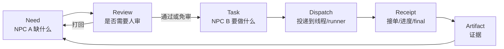
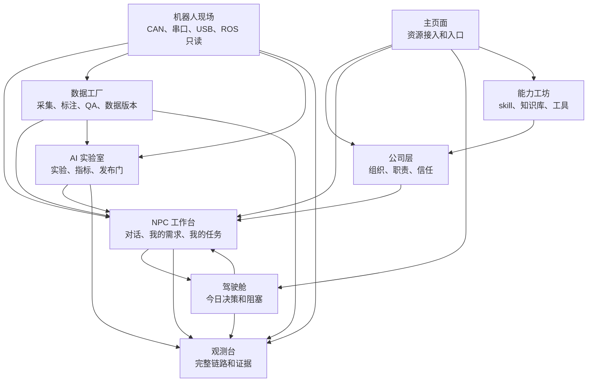

# AI 协作平台 Agent 操作系统架构合同

本文是平台后续开发的产品与工程架构合同。目标不是堆页面，而是做一个简洁、强大、可审计的项目级 AI 公司操作系统：人类决策，NPC 作为长期员工工作，电脑负责执行，所有结果都有证据链。

平台必须适配所有项目，不只服务机械臂。软件开发、嵌入式、机器人、数据采集、模型训练、仿真、QA、部署、文档都使用同一套核心对象。

## 1. 平台总结构

平台有九个一级界面：

| 界面 | 负责什么 | 简洁原则 |
| --- | --- | --- |
| 驾驶舱 | 今天要看什么、批什么、处理什么 | 只放决策、阻塞、下一步，不做复杂编辑 |
| 主页面 | 配置项目资源 | 保留开发工坊、主角、NPC、电脑、能力包、Git、DDL、线程调试 |
| 公司层 | 管项目组织结构 | 工位、NPC 员工表、工位长、信任和审核策略 |
| NPC 工作台 | 和 NPC 员工一起工作 | 每个 NPC 仍是独立框，框内切换：对话 / 我的需求 / 我的任务 |
| 数据工厂 | 管数据生命周期 | 数据源、采集、标注、QA、数据集版本 |
| AI 实验室 | 管实验和模型 | run board、指标、对比、发布门 |
| 机器人现场 | 管设备检查和调试 | CAN、串口、USB、ROS 只读、波形、设备状态 |
| 观测台 | 证明发生了什么 | 链路、日志、回执、证据、异常、验收 |
| 能力工坊 | 管 NPC 能力 | skill、知识库、GitHub 导入、工具、权限 |

只有 NPC 工作台是对话优先。其他工作台都应该像 IDE 或上位机：左侧对象索引，中间真实工作区，右侧动作/属性/证据，底部紧凑日志。

## 2. 核心对象定义

所有界面共享这些对象。不要为每个页面单独造一套概念。

| 对象 | 含义 | 归属 |
| --- | --- | --- |
| 项目 Project | 一个项目公司的边界 | 人类成员 |
| 成员 Member | 人类协作者 | 项目 |
| 工位 Workstation | 逻辑部门，不是电脑 | 项目 |
| NPC 坐席 NPC Seat | 长期存在的员工行 | 工位 |
| 电脑 Computer Node | 真实电脑、云服务器、开发板、工控机 | 项目 |
| Runner | 能执行或同步任务的进程 | 电脑 |
| 线程绑定 Thread Binding | 平台扫描到的 Codex/Claude/runner 线程，由用户按名字选择 | NPC 坐席 |
| 需求 Need | 某个 NPC 缺什么、需要别人帮什么 | 发起需求的 NPC |
| 任务 Task | 某个 NPC 或人要完成什么 | 承接方 |
| 派发 Dispatch | 一次具体投递/执行尝试 | 平台 |
| 消息 Message | 给用户看的对话/事件 | 项目、NPC、任务 |
| 审核 Review | 人类放行门 | 人类 |
| 回执 Receipt | 接单、进度、最终结果 | 执行方 |
| 证据 Artifact | 文件、数据集、模型、日志、截图、报告 | 产出流程 |
| 能力 Skill | 能力包 | 项目或全局 |
| 知识 Knowledge | 项目、工位、NPC 的参考资料 | 项目/工位/NPC |

最重要的语义：

- 需求属于“缺东西的一方”。例如 NPC A 需要别人帮忙，这条需求在 NPC A 的“我的需求”里。
- 任务属于“要干活的一方”。例如 NPC B 接了 NPC A 的需求，这条任务在 NPC B 的“我的任务”里。
- 派发不是任务，只是一次投递尝试。
- 消息不是队列，只是用户看的对话和事件。

### 2.1 NPC 员工表字段

`ProjectThreadWorkstation` 是项目内的 NPC 员工表。每个 NPC 至少要能描述这些信息：

| 字段 | 含义 |
| --- | --- |
| `name` | NPC 名称 |
| `responsibility` | 主要职责 |
| `responsibility_boundary` | 职责边界，明确不该越界做什么 |
| `accepted_task_types` | 可接任务类型 |
| `rejected_task_types` | 不可接任务类型 |
| `workstation_id` | 默认逻辑工位 |
| `support_workstation_ids` | 可支援工位 |
| `skill_loadout` | 已绑定 skill |
| `knowledge_paths` | 已绑定知识库 |
| `trusted_peer_ids` | 可信协作对象 |
| `review_policy` | 强审/免审/继承 |
| `current_load` | 当前负载 |
| `quality_score` | 历史质量，可后续补 |
| `runner_state` | 执行电脑/线程状态 |
| `thread_binding` | 扫描到并由用户选择的线程 |

这些字段不要求一次性全部建成数据库列；过渡期可以放在 `extra_data`，但前端、路由器和验收脚本必须按这个语义使用。

## 3. 后端架构

### 3.1 现有模型复用

后端已有这些基础，不要推倒重来：

| 现有模型 | 新架构里的含义 |
| --- | --- |
| `ProjectWorkstation` | 逻辑工位/部门 |
| `ProjectThreadWorkstation` | NPC 员工坐席 |
| `ProjectComputerNode` | 电脑或云服务器 |
| `Requirement` | Need，NPC 的需求/缺口 |
| `Task` | 承接方要做的任务 |
| `TaskDispatch` | 一次派发/执行尝试 |
| `CollaborationMessage` | 对话和事件流 |

先统一语义和行为，再逐步补字段。不要为了改名重造表。

### 3.2 Need 模型合同

使用现有 `Requirement` 表作为 Need 表。

必须具备的字段，可以先放在列里，也可以过渡期放在 `extra_data`：

| 字段 | 含义 |
| --- | --- |
| `id` | 需求 ID |
| `project_id` | 项目 |
| `from_agent` | 发起需求的 NPC 坐席 ID |
| `target_seat_id` | 推荐承接 NPC，可为空 |
| `title` | 需求标题 |
| `context_summary` | 为什么需要别人帮 |
| `expected_output` | 什么结果算满足 |
| `required_capability` | 需要的能力 |
| `module` | 所属模块 |
| `priority` | P0/P1/P2/P3 |
| `priority_rank` | 用户拖动排序后的数字 |
| `risk_level` | low/medium/high/critical |
| `status` | 需求状态 |
| `review_required` | 是否需要人审 |
| `task_id` | 路由后生成的任务 |
| `dependency_requirement_id` | 依赖的其他需求 |
| `created_by_type` | human/npc/system |
| `created_by_id` | 创建者 |

Need 状态：

```text
draft 草稿
ready_to_route 待路由
needs_human_review 待人审
routed 已路由成任务
in_progress 对方处理中
satisfied 已满足
rejected 被拒绝
blocked 阻塞
cancelled 取消
archived 归档
```

### 3.3 Task 模型合同

使用现有 `Task` 表作为任务队列。

必须具备的字段：

| 字段 | 含义 |
| --- | --- |
| `id` | 任务 ID |
| `project_id` | 项目 |
| `source_need_id` | 来自哪条 Need，可为空 |
| `source_message_id` | 来自哪条消息，可为空 |
| `title` | 任务标题 |
| `description` | 任务输入和说明 |
| `assignee_seat_id` | 承接 NPC 坐席 ID |
| `assignee_user_id` | 承接人类，可为空 |
| `module` | 所属模块 |
| `priority` | P0/P1/P2/P3 |
| `priority_rank` | 用户拖动排序后的数字 |
| `risk_level` | low/medium/high/critical |
| `status` | 任务状态 |
| `acceptance_criteria` | 验收标准 |
| `required_artifacts` | 需要产出的证据 |
| `due_at` | 截止时间，可为空 |

Task 状态：

```text
draft 草稿
ready 可派发
queued 已排队
running 执行中
waiting_user 等用户补充
waiting_npc 等其他 NPC
reviewing 待验收/待审核
blocked 阻塞
done 完成
rejected 打回
cancelled 取消
archived 归档
```

### 3.4 Dispatch 模型合同

使用现有 `TaskDispatch` 表表示一次投递或执行尝试。

必须具备的字段：

| 字段 | 含义 |
| --- | --- |
| `task_id` | 所属任务 |
| `project_id` | 项目 |
| `workstation_id` | 目标 NPC 坐席或执行目标 |
| `computer_node_id` | 使用哪台电脑 |
| `runner_id` | 使用哪个 runner |
| `ai_provider_id` | 使用哪个 AI provider/线程类型 |
| `status` | 投递状态 |
| `dispatched_by_user_id` | 手动派发的人 |
| `dispatch_source` | user/npc/system |
| `attempt` | 第几次尝试 |
| `notes` | 给用户看的说明 |

Dispatch 状态：

```text
created 已创建
queued 等待投递
delivered 已送达
acked 已接单
running 执行中
waiting_closeout 等收口
completed 完成
failed 失败
cancelled 取消
```

### 3.5 NeedRouter 服务

新增一个明确的服务边界：`NeedRouter`。

它负责：

1. 接收 NPC 或用户创建的结构化 Need。
2. 从 NPC 员工表里推荐承接 NPC。
3. 判断是否需要人类审核。
4. 审核通过或可自动路由时，创建一个或多个 Task。
5. 串起 Need -> Task -> Dispatch -> Message -> Receipt -> Artifact。

路由依据：

- NPC 职责
- 所属工位
- skill
- 知识库
- 在线/可用状态
- 当前任务量
- 信任/审核规则
- 风险级别
- 用户手动指定

禁止只靠关键词自动派单。关键词只能辅助推荐，前提是 NPC 已经创建了结构化 Need。

路由算法顺序必须固定：

1. 硬性安全规则：硬件、部署、真实运动、固件、ROS 写、Git 回退等先判强审或禁止。
2. 必需能力匹配：`required_capability` 必须命中 NPC 职责、skill 或知识库。
3. 工位和信任策略：同工位优先，跨工位默认找目标工位长或进入审核。
4. runner 和线程可用性：目标 NPC 必须有可用绑定线程，否则不能假装已 queued。
5. 当前负载：负载低者优先。
6. 用户偏好：用户指定的默认承接 NPC、信任关系、强审关系优先。
7. 历史质量：后续按完成率、失败率、平均响应时间加权。

`NeedRouter` 输出必须包含：

| 字段 | 含义 |
| --- | --- |
| `recommended_assignee_id` | 推荐承接 NPC |
| `alternatives` | 候选 NPC 列表 |
| `requires_review` | 是否需要人审 |
| `review_reason` | 为什么要审或为什么免审 |
| `route_risk` | 路由风险 |
| `will_create_tasks` | 预计创建的任务 |
| `blocked_reason` | 无法路由时的原因 |

### 3.5.1 NPC 创建 Need 的最小格式

NPC 不能只在对话里说“我可能需要某某帮忙”。它必须调用结构化能力创建 Need。

最小 schema：

```json
{
  "title": "需要完成什么",
  "why_needed": "为什么当前 NPC 需要别人帮",
  "required_capability": "需要的能力",
  "expected_output": "对方交付什么才算满足",
  "input_context": "给承接方的必要上下文",
  "risk_level": "low | medium | high | critical",
  "priority": "P0 | P1 | P2 | P3",
  "suggested_assignee": "可选，推荐 NPC 坐席 ID",
  "acceptance_criteria": ["验收点 1", "验收点 2"],
  "blocking_current_task": true
}
```

没有 `expected_output` 和 `acceptance_criteria` 的 Need 只能保存为草稿，不能自动路由。

### 3.6 审核策略

必须人审：

- NPC 创建跨工位 Need。
- 风险级别是 high 或 critical。
- 涉及硬件、部署、固件、模型发布、Git 回退、真实运动、ROS 写/service/action。
- 承接 NPC 不确定。
- 项目、工位或 NPC 策略要求强审。

不需要人审：

- 用户手动把任务派给某个 NPC。
- 同工位、低风险、已信任的 Need。
- 用户明确设置过这对 NPC 免审。

用户永远不应该审核自己的普通消息。

审核结果闭环：

| 用户动作 | 后端结果 | 前端表现 |
| --- | --- | --- |
| 通过 | Need 从 `needs_human_review` 变 `routed`，创建目标 Task 和 Dispatch | 发起 NPC 的“我的需求”变为已派出，目标 NPC 的“我的任务”出现任务 |
| 打回 | Need 变 `rejected` 或 `blocked`，原因回写给发起 NPC | 发起 NPC 在对话和“我的需求”看到打回原因 |
| 修改承接人 | 重新 route-preview，再创建 Task | 审核卡显示新的承接人和风险 |
| 修改优先级/风险 | 更新 Need 后重新计算审核策略 | 队列排序和审核文案同步变化 |

### 3.7 Runner 和线程状态

任务投递流程必须是：

```text
Task
  -> assignee NPC
  -> thread binding
  -> runner
  -> computer node
```

如果任一环不可用，不能假装派发成功。

统一 runner/线程状态：

| 状态 | 含义 | 派单行为 |
| --- | --- | --- |
| `online` | 在线且可投递 | 可以派发 |
| `recently_seen` | 最近在线但当前心跳不稳 | 可排队，提示可能延迟 |
| `stale` | 心跳过期 | 进入等待电脑恢复 |
| `offline` | 离线 | 不投递，允许重试/换电脑/换线程 |
| `unknown` | 未确认 | 不误导用户，提示先检查接入 |
| `occupied` | 被其他用户/线程占用 | 允许申请接手或改派 |

前端统一文案：

- 可投递
- 最近在线，可能延迟
- 等待电脑恢复
- 离线，需重连
- 状态未知，先检查接入
- 他人操作中

### 3.8 数据库硬字段建议

为避免用户手动派单和 NPC Need 派生任务混淆，后续迁移建议补这些字段：

| 表 | 字段 | 含义 |
| --- | --- | --- |
| `tasks` | `task_source` | `user_manual | npc_need | system` |
| `tasks` | `source_need_id` | 来源 Need |
| `tasks` | `assignee_seat_id` | 承接 NPC |
| `requirements` | `required_capability` | 需要能力 |
| `requirements` | `priority_rank` | 拖动排序 |
| `tasks` | `priority_rank` | 拖动排序 |
| `task_dispatches` | `dispatch_source` | `user | npc | system` |
| `task_dispatches` | `attempt` | 投递次数 |

在字段落库前，可以用 `extra_data` 兼容，但 API 和前端必须使用同一语义。

## 4. 前端架构

### 4.1 全局布局合同

所有非 NPC 对话界面尽量保持一致：

```text
左侧：对象索引 / 资源 / NPC 引用
中间：真实工作区
右侧：动作 / 属性 / 证据 / 审核
底部：紧凑日志 / 回执 / 事件
```

不要做长页面。高级信息进抽屉。默认界面应该让用户马上知道下一步能干什么。

### 4.2 驾驶舱

用途：项目决策台。

模块：

- 今日重点
- 等我处理
- 高风险审核
- 阻塞事项
- NPC 负载
- 电脑/runner 状态
- 最近 final 回执
- 下一步建议

允许操作：

- 通过/打回审核
- 打开 NPC
- 打开证据
- 重新同步/催办
- 跳到对应工作台

不允许：

- 把所有字段都塞进来编辑
- 直接展示原始日志
- 放长篇解释
- 展示完整历史链路

驾驶舱只处理“今天需要用户处理的事”：

- 待审核
- 待补充
- 高风险
- 阻塞
- 离线影响执行
- 可验收 final

驾驶舱里的审核可以直接处理；处理完成后，历史和证据进入观测台。

### 4.3 主页面

用途：项目资源配置入口。

默认只突出三个主行动：

1. 进入驾驶舱
2. 进入 NPC 工作台
3. 接入/检查电脑

管理区保留：

- 开发工坊
- 主角管理
- NPC 管理
- 电脑接入
- 能力包仓库
- Git 回退
- 日程/DDL
- 线程调试

专业功能进入专业工作台，不继续堆在主页面。

主页面 NPC 管理只负责：

- 创建/删除 NPC
- 绑定/解绑扫描到的线程
- 选择电脑和 provider
- 基础启停和接入检查

不要在主页面做完整组织设计；完整组织关系交给公司层。

### 4.4 公司层

用途：组织结构。

布局：

```text
左侧：工位列表
中间：NPC 员工表 / 组织图
右侧：选中工位或 NPC 的属性
底部：最近组织变更
```

核心操作：

- 创建/编辑工位
- 设置工位长
- 分配 NPC 到工位
- 编辑 NPC 职责
- 绑定 skill/知识库
- 设置信任和审核策略
- 查看负载

公司层负责组织关系，不负责线程接入细节。

公司层和主页面边界：

| 能力 | 放在哪里 |
| --- | --- |
| 创建/删除 NPC | 主页面 NPC 管理 |
| 绑定扫描线程 | 主页面 NPC 管理 |
| 分配工位和职责 | 公司层 |
| 设置工位长 | 公司层 |
| 设置协作信任/强审 | 公司层 |
| 查看组织负载 | 公司层 |

能力工坊和公司层边界：

| 能力 | 放在哪里 |
| --- | --- |
| 导入 skill/知识库 | 能力工坊 |
| 测试 skill 可用性 | 能力工坊 |
| 管 skill 版本和兼容性 | 能力工坊 |
| 把 skill 分配给 NPC/工位 | 公司层，入口可跳到能力工坊详情 |

### 4.5 NPC 工作台

硬规则：保留多个独立 NPC 框。

每个 NPC 框：

```text
顶部：NPC 名称、工位、在线/绑定状态、需求数、任务数
Tab：对话 / 我的需求 / 我的任务
中间：当前 tab 内容
右侧抽屉：身份、skill、知识库、线程、证据
底部：输入框和手动派单操作
```

多 NPC 并排时空间很紧。每个 tile 默认不要常驻塞满“同工位 NPC + 跨工位工位长”。推荐做法：

- 顶部或底部放一个轻量按钮：“派给其他 NPC”。
- 点击后打开小型选择器。
- 选择器里分组显示：同工位 NPC、跨工位工位长。
- 只有用户明确选择目标时才手动派单。

对话 tab：

- 用户消息
- NPC 回复
- 最小回执
- final 回执
- 结构化审核卡
- 证据入口

我的需求 tab：

- 这个 NPC 创建的 Need
- 可拖动优先级
- 路由/审核/满足状态
- 推荐承接 NPC
- 结果回执

我的任务 tab：

- 分配给这个 NPC 的 Task
- 可拖动优先级
- 启动/重试/阻塞/收口
- 证据和 final

用户手动派单：

- 用户在当前 NPC 输入框发消息，就是派给当前 NPC。
- 用户点击另一个 NPC 的派单按钮，就是用户手动派给那个 NPC。
- 这不算 NPC 互派。
- 不需要用户审核自己。

NPC 互相协作：

- NPC 必须创建结构化 Need。
- 平台把 Need 路由成 Task。
- 只有策略要求时才弹审核。

对话去重规则：

- 同一个 `message/task/dispatch/review` 只能有一个主展示位置。
- Dialog 只显示沟通、回执、审核入口和必要状态。
- Need 详情只在“我的需求”展示。
- Task 详情只在“我的任务”展示。
- 观测台展示完整链路，不在 NPC 对话里重复展开。
- 摘要卡默认收起，不能和普通消息重复表达同一件事。

### 4.6 数据工厂

用途：数据生命周期。

布局：

```text
左侧：数据集、数据源、采集任务
中间：样本 / 标注 / QA / 版本工作区
右侧：采集配置、标注 schema、证据、动作
底部：入库日志和数据回执
```

核心功能：

- 定义数据源
- 配置采样频率和窗口
- 启停采集，需要时走审核
- 标注样本
- QA 标注
- 创建数据集版本
- 导出 manifest
- 数据缺失或模糊时，向相关 NPC 创建 Need

数据工厂不要做：

- 模型发布
- NPC 长对话
- Git 回退
- 硬件写操作

### 4.7 AI 实验室

用途：实验和模型生命周期。

布局：

```text
左侧：实验、数据集、模型
中间：run board、指标对比、trace
右侧：运行配置、发布门、证据
底部：训练/评估日志
```

核心功能：

- 选择数据集
- 配置 run
- 对比指标
- 检查失败样本
- 创建发布候选
- 请求人类审核
- 永不自动发布到生产或硬件

AI 实验室不要做：

- 数据标注主流程
- 机器人真实运动控制
- NPC 长对话
- Git 治理

### 4.8 机器人现场

用途：安全设备/调试工作台。

布局：

```text
左侧：设备对象树
中间：选中的工具工作区
右侧：工具动作、属性、证据
底部：设备日志/事件
```

右侧工具选择：

- CAN 调试
- 串口调试
- USB 调试
- ROS 只读桥
- 波形
- 电机参数
- 设备状态

规则：

- 只读检查可以直接做。
- 数据采集可以按配置执行。
- 写参数、真实运动、固件、ROS 写/service/action、真实硬件动作必须强审。

机器人现场不要做：

- 数据标注
- 模型发布
- 长文本任务讨论
- 绕过审核的真实硬件写操作

### 4.9 观测台

用途：事实和验收。

布局：

```text
左侧：链路、过滤器、失败流程
中间：时间线 / 图 / 表
右侧：选中事件的证据和动作
底部：必要时显示紧凑原始日志
```

核心功能：

- 追踪 Need -> Task -> Dispatch -> Message -> Receipt -> Artifact
- 显示卡住的派发
- 显示 runner 健康
- 重试/催办/重新同步
- 导出验收报告
- 跑验收脚本

观测台只查完整事实链和历史证据，不作为日常审核入口。日常审核入口在驾驶舱和相关 NPC 对话卡；观测台负责复盘、定位、验收、导出。

### 4.10 能力工坊

用途：能力管理。

布局：

```text
左侧：skill、知识包、GitHub 导入
中间：能力详情和兼容性
右侧：绑定 NPC/工位、测试、证据
底部：安装/导入日志
```

核心功能：

- 导入 skill
- 绑定 skill 到 NPC/工位
- 从 GitHub 导入知识/能力
- 测试 skill 可用性
- 查看能力被哪些 NPC 使用

所有专业工作台发起跨 NPC 协作时，统一使用一个动作：“请求协作”。这个动作打开同一套 Need 创建面板，不允许数据工厂、AI Lab、机器人现场各自做一套不同的需求/任务 UI。

## 5. 数据流架构

### 5.1 用户手动派单

```text
用户在 NPC 框里写任务
  -> 创建给目标 NPC 的 CollaborationMessage
  -> 创建或关联 Task
  -> 创建 Dispatch
  -> runner/线程收到任务
  -> 回执返回
  -> Task 状态更新
  -> 驾驶舱和观测台更新
```

因为是用户直接选择目标，所以不需要审核。

### 5.2 NPC Need 转 Task

```text
NPC A 正在执行任务
  -> NPC A 调 create_need()
  -> Need 出现在 NPC A / 我的需求
  -> NeedRouter 推荐 NPC B
  -> ReviewPolicy 判断自动路由还是人审
  -> 通过后 Task 出现在 NPC B / 我的任务
  -> Dispatch 把任务送到 NPC B 线程
  -> NPC B 返回结果
  -> NPC A 的 Need 变成已满足
  -> NPC A 继续原任务
```

对象关系图：



### 5.3 拖动优先级

```text
用户拖动 Need 或 Task
  -> 前端提交排序后的 ID 列表
  -> 后端写 priority_rank + updated_by
  -> 队列顺序变化
  -> runner 拉取顺序跟随任务优先级
  -> 驾驶舱更新最重要阻塞和下一步
```

拖动范围：

- NPC 框内拖动“我的需求”：只影响这个 NPC 发出的 Need 队列。
- NPC 框内拖动“我的任务”：只影响这个 NPC 承接的 Task 队列。
- 驾驶舱或公司层的全局排序：才影响跨 NPC 的全局优先级。
- 多人同时拖动：以后提交者为准，记录 `updated_by`、`updated_at`，必要时显示“排序已被某人更新”。

### 5.4 证据链

```text
任何执行产出回执或证据
  -> 证据绑定到 task/dispatch/message
  -> 消息里显示证据入口
  -> 专业工作台可以打开对应视图
  -> 观测台可以追踪完整链路
```

## 6. API 合同

新增或规范这些接口。可以先由现有 collaboration/requirements/tasks 路由承接，前端使用清晰命名。

```text
GET    /api/projects/{project_id}/company
GET    /api/projects/{project_id}/npc-seats
PATCH  /api/projects/{project_id}/npc-seats/{seat_id}

GET    /api/projects/{project_id}/needs?seat_id=&role=requester|assignee
POST   /api/projects/{project_id}/needs
PATCH  /api/projects/{project_id}/needs/{need_id}
POST   /api/projects/{project_id}/needs/{need_id}/route-preview
POST   /api/projects/{project_id}/needs/{need_id}/route
POST   /api/projects/{project_id}/needs/reorder

GET    /api/projects/{project_id}/tasks?assignee_seat_id=
POST   /api/projects/{project_id}/tasks
PATCH  /api/projects/{project_id}/tasks/{task_id}
POST   /api/projects/{project_id}/tasks/reorder

POST   /api/projects/{project_id}/tasks/{task_id}/dispatch
GET    /api/projects/{project_id}/chains/{object_id}

GET    /api/projects/{project_id}/reviews
POST   /api/projects/{project_id}/reviews/{review_id}/approve
POST   /api/projects/{project_id}/reviews/{review_id}/reject
```

## 7. 简化规则

违反这些规则的 UI 要删掉或收起来：

1. 同一条消息不能同时显示成普通消息和事件卡。
2. 普通用户界面不显示原始 ID、本地路径、线程文件、内部传输词。
3. 一个页面不要把所有子系统全展示出来。
4. 禁止只靠关键词自动派单。
5. 用户手动派单不需要审核自己。
6. 专业工作台不要堆无关历史功能。
7. 危险动作不能藏起来，必须有明确审核卡。
8. 在线状态不能误导用户，必须准确显示 unknown/offline/recently seen/online。
9. 审核入口统一：日常入口在驾驶舱，相关上下文入口在 NPC 对话卡，完整历史在观测台。
10. 专业工作台统一用“请求协作”创建 Need。

## 7.1 用户一日工作流

用户每天最常见路径应该是：

```text
打开项目
  -> 看驾驶舱
  -> 处理待审核/阻塞/离线
  -> 进入 NPC 工作台查看关键 NPC
  -> 调整某个 NPC 的 My Needs / My Tasks 优先级
  -> 打开专业工作台处理数据/模型/设备问题
  -> 在观测台看证据链并验收 final
```

如果这个路径需要用户在多个页面里找同一个状态，说明架构没有收干净。

## 8. 开发顺序

P0：

1. NPC 工作台加 `对话 / 我的需求 / 我的任务`。
2. 用户手动派单创建用户发起的目标 NPC 任务。
3. NPC 可以创建结构化 Need。
4. NeedRouter 按策略生成 Task。
5. Need 和 Task 支持拖动优先级。
6. 移除重复消息展示和用户自审。

P1：

1. 公司层员工表和工位图。
2. 驾驶舱从真实 Need/Task/Review 状态生成决策队列。
3. 观测台链路视图：Need -> Task -> Dispatch -> Receipt。
4. runner 在线/离线状态准确化。

P2：

1. 数据工厂数据源/采集/标注/QA。
2. AI 实验室 run board 和发布门。
3. 机器人现场 CAN/串口/USB/ROS 只读工作台。
4. 能力工坊 GitHub 导入和 NPC 绑定收口。

## 9. 验收清单

实现后必须满足：

- 用户可以手动派任务给任意 NPC，不会被要求审核自己。
- NPC 可以创建 Need，不靠关键词猜。
- Need 可以路由成另一个 NPC 的 Task。
- 用户可以拖动 Need 和 Task 的优先级。
- 跨工位/高风险 Need 会生成审核卡。
- 同工位可信低风险 Need 可以自动路由。
- 每个 NPC 框依旧互相独立。
- 对话、我的需求、我的任务展示的是不同对象。
- 驾驶舱只显示决策和阻塞。
- 观测台能追踪完整链路。
- 机器人写操作不能绕过强审。

## 10. 工作台之间的关系

这些工作台不是孤立页面，而是同一批对象的不同视图。用户看到的是不同入口，后端流动的是同一条对象链：

```text
Project
  -> Member / NPC Seat / Workstation / Computer / Runner / Skill
  -> Need / Task / Dispatch / Message / Receipt / Artifact
  -> Cockpit / NPC Workbench / Professional Workbench / Observability
```

每个工作台只能负责自己最擅长的一段，不能复制别的工作台的主功能。

### 10.1 全局流转图



### 10.2 页面关系表

| 从哪里 | 到哪里 | 什么时候跳转 | 传什么对象 |
| --- | --- | --- | --- |
| 主页面 | 电脑接入 | 新电脑、云服务器、Windows/Linux runner 接入 | `project_id` |
| 主页面 | NPC 管理 | 创建 NPC、绑定扫描线程、选择电脑/provider | `project_id`, `seat_id` |
| 主页面 | 驾驶舱 | 每天默认进入 | `project_id` |
| 主页面 | NPC 工作台 | 手动派单、查看 NPC 工作状态 | `project_id`, `seat_ids` |
| 公司层 | NPC 工作台 | 查看某个员工实际执行状态 | `seat_id` |
| 公司层 | 能力工坊 | 给员工补 skill/知识库 | `seat_id`, `skill_id` |
| 能力工坊 | 公司层 | 把能力分配给工位或 NPC | `skill_id`, `workstation_id`, `seat_id` |
| NPC 工作台 | 数据工厂 | NPC 产出数据问题、样本、标注请求 | `need_id`, `task_id`, `artifact_id` |
| NPC 工作台 | AI 实验室 | NPC 产出实验、模型、评估请求 | `need_id`, `task_id`, `artifact_id` |
| NPC 工作台 | 机器人现场 | NPC 产出设备检查或只读调试请求 | `need_id`, `task_id`, `artifact_id` |
| 数据工厂 | NPC 工作台 | 数据缺口、标注争议、QA 失败需要人/NPC处理 | `need_id` |
| AI 实验室 | NPC 工作台 | 实验失败、指标异常、发布候选需要审核 | `need_id`, `review_id` |
| 机器人现场 | NPC 工作台 | 硬件风险、写操作、运动动作需要强审 | `need_id`, `review_id` |
| 任意工作台 | 观测台 | 需要看完整证据链、失败原因、历史积压 | `object_type`, `object_id` |
| 驾驶舱 | 相关工作台 | 用户处理阻塞后回到上下文 | `need_id`, `task_id`, `review_id` |

### 10.3 跨工作台对象规则

1. `Need` 是跨工作台协作的入口。专业工作台发现需要别人做事时，只能创建 Need，不能直接伪造 NPC 消息。
2. `Task` 是承接方的工作项。它出现在承接 NPC 的“我的任务”、驾驶舱待处理、观测台链路里。
3. `Dispatch` 只表示一次投递尝试。它不应该在用户主界面被当作任务展示。
4. `Message` 只负责沟通和回执。它不应该承载完整的需求池、任务池和证据链。
5. `Artifact` 是所有工作台的证据货币。数据工厂的数据版本、AI 实验室的 run、机器人现场的波形/日志、NPC final 都要能落成 Artifact。
6. `Review` 是人类决策门。驾驶舱显示“今天该审什么”，观测台显示“这个审核为什么发生过”。

### 10.4 典型闭环

数据闭环：

```text
机器人现场读取电机/传感器数据
  -> 数据工厂按采样频率入库
  -> 数据工厂标注/QA
  -> AI 实验室用数据集跑实验
  -> AI 实验室产出指标和失败样本
  -> 失败样本回到数据工厂补标或回到机器人现场复采
  -> 观测台保留完整证据链
```

NPC 协作闭环：

```text
NPC A 执行任务时缺少能力/输入
  -> NPC A 创建 Need
  -> NeedRouter 推荐 NPC B
  -> 需要时进入驾驶舱审核
  -> NPC B 的“我的任务”出现 Task
  -> runner 投递到绑定线程
  -> NPC B 回执和证据返回
  -> NPC A 的 Need 变 satisfied
  -> 原 Task 继续推进
```

硬件安全闭环：

```text
机器人现场发现要写参数/运动/固件/ROS 写动作
  -> 创建 high/critical Need 或 Review
  -> 驾驶舱强审
  -> 审核通过后才生成可执行 Task/Dispatch
  -> runner 执行前再次确认目标电脑和设备状态
  -> 回执、日志、波形进入观测台
```

能力补齐闭环：

```text
某 NPC 多次创建同类 Need
  -> 公司层发现职责或能力缺口
  -> 能力工坊导入/测试 skill 或知识库
  -> 公司层绑定给 NPC/工位
  -> 后续 NeedRouter 提高该 NPC 匹配分
```

### 10.5 导航和状态统一

所有工作台顶部必须显示同一类上下文：

```text
项目 / 当前工作台 / 当前对象 / 当前 NPC 或负责工位 / 状态 / 证据入口
```

所有工作台底部日志必须使用同一类状态颜色：

| 类型 | 含义 | 用户语言 |
| --- | --- | --- |
| info | 普通进度 | 已记录、已同步、已生成 |
| success | 成功闭环 | 已完成、已入库、已通过 |
| warning | 可恢复问题 | 等待电脑恢复、需要补充、可能延迟 |
| danger | 阻塞或风险 | 派发失败、强审阻塞、设备风险 |
| review | 需要人类决定 | 待审核、待验收、待放行 |

同一个状态在不同页面不能换说法。例如 runner 掉线统一叫“等待电脑恢复”或“离线，需重连”，不要一处叫断联、一处叫异常、一处叫未绑定。

### 10.6 什么必须删或收起

如果一个功能已经归属到明确工作台，其他页面只能放入口，不能复制主流程：

| 功能 | 主归属 | 其他页面只允许 |
| --- | --- | --- |
| 电脑接入和线程绑定 | 主页面/NPC 管理 | 显示状态、跳转检查 |
| 组织职责和信任策略 | 公司层 | 显示当前负责 NPC |
| skill/知识库导入 | 能力工坊 | 显示已绑定能力 |
| Need/Task 队列 | NPC 工作台 | 显示摘要和跳转 |
| 日常审核 | 驾驶舱 | 相关上下文入口 |
| 完整链路证据 | 观测台 | 证据摘要和跳转 |
| 数据采集/标注/QA | 数据工厂 | 创建 Need 或引用数据集 |
| 实验和模型发布门 | AI 实验室 | 引用指标和候选 |
| CAN/串口/USB/ROS 只读 | 机器人现场 | 引用诊断结果 |

## 11. 现有代码落地改造清单

这一节是从当前代码扫描得出的改造地图。后续实现按这里拆，不要靠感觉乱改。

### 11.1 后端模型和服务

| 当前文件 | 当前问题 | 应该怎么改 |
| --- | --- | --- |
| `apps/api/app/db/models/requirement.py` | `Requirement` 已接近 Need，但字段还偏“需求单/消息派单”，缺少能力、风险、排序、创建者语义 | 保留表，补 `required_capability`, `priority_rank`, `risk_level`, `review_required`, `created_by_type`, `created_by_id`；过渡期可放 `extra_data` |
| `apps/api/app/modules/requirements/schemas.py` | `RequirementCreate` 有 `target_seat_id/trigger_kind`，但没有完整 Need schema | 新增面向前端/MCP 的 `NeedCreate` 语义字段，兼容写入现有 Requirement |
| `apps/api/app/modules/requirements/service.py` | 已有 route/dispatch/reply/final，逻辑偏“需求派单”和 follow-up | 抽出 `NeedRouter` 服务；`route_requirement` 只做 Need -> Task，不直接混成普通消息 |
| `apps/api/app/db/models/task.py` | `Task` 只有 `assignee_agent_id`，不适合 NPC Seat 队列 | 补 `assignee_seat_id`, `assignee_user_id`, `task_source`, `source_need_id`, `source_message_id`, `priority_rank`, `risk_level`, `required_artifacts` |
| `apps/api/app/modules/tasks/schemas.py` | `TaskCreate` 面向普通任务，`TaskDispatchCreate` 只收 `workstation_id/status/notes` | 新增 `task_source/source_need_id/assignee_seat_id`；dispatch 允许显式 computer/runner/provider 和 attempt |
| `apps/api/app/modules/tasks/service.py` | `dispatch_task` 已能找 workstation/computer/runner，但状态和用户语义还不统一 | 在派发前统一检查 seat -> thread binding -> runner -> computer；失败返回用户语言，不创建误导性成功 |
| `apps/api/app/db/models/task_dispatch.py` | Dispatch 缺 `dispatch_source/attempt` | 补字段，区分用户手动、NPC Need、系统重试 |
| `apps/api/app/modules/seats/service.py` | 队列语义容易混：inbox/todo 不是新架构的“我的需求/我的任务” | 重新定义：我的需求 = `Requirement.from_agent == seat`；我的任务 = `Task.assignee_seat_id == seat`；旧 `assignee_agent_id` 只兼容 |
| `apps/api/app/modules/collaboration/service.py` | 消息、review、runner command、peer dispatch 都在一个大服务里，容易重复展示 | 保留现有能力，但新增对象级 dedupe 标记；普通用户消息不能生成 review 卡；NPC Need 才触发 review |
| `apps/api/app/modules/runners/service.py` | 已有 runner/workspace/thread 同步，但状态还需统一给前端 | 输出 `online/recently_seen/stale/offline/unknown/occupied` 和明确 `can_dispatch`、`blocked_reason` |
| `apps/api/app/modules/workstations/router.py` | 工位 CRUD 已有 | 公司层按该接口做组织，不让专业工作台自己维护工位副本 |
| `apps/api/app/modules/knowledge/*` | skill/知识库已有底座 | 能力工坊负责导入测试；公司层只负责绑定 |

### 11.2 后端 API 收口

短期不要大迁移 URL，可以在现有路由外包一层语义清晰的接口：

| 新语义 | 可复用现有路由 | 注意 |
| --- | --- | --- |
| 创建 Need | `/api/requirements` | payload 必须结构化，不接受只有一句话的自动路由 |
| Need 路由预览 | `/api/requirements/{id}/route` 或新增 preview | preview 不产生 Task，只返回推荐和审核原因 |
| Need 路由成 Task | `/api/requirements/{id}/dispatch` 或新 route endpoint | 只在审核通过或免审时执行 |
| 我的需求 | seats queue + requirements list | 按发起 NPC 查 |
| 我的任务 | tasks list | 按承接 NPC 查 |
| 任务派发 | `/api/tasks/{id}/dispatch` | 派发前必须检查 runner 状态 |
| 完整链路 | observability/receipts/messages/tasks/requirements 组合 | 后续可补 `/chains/{object_id}` 聚合 |

### 11.3 前端页面改造

| 当前文件 | 当前问题 | 应该怎么改 |
| --- | --- | --- |
| `apps/web/app/projects/[id]/page.tsx` | 主页面仍承担太多入口和状态 | 默认突出：驾驶舱、NPC 工作台、接入/检查电脑；其他管理折叠 |
| `apps/web/app/projects/[id]/cockpit/page.tsx` | 驾驶舱还像“多工作台导航页” | 改成今日决策台：待审、阻塞、离线影响、可验收 final、下一步 |
| `apps/web/app/projects/[id]/company/page.tsx` | 复用 `WorkbenchClient pageMode="company"`，容易把 NPC 工作台复杂度带进公司层 | 拆成独立 `CompanyOrgClient`：工位树、员工表、职责/信任/能力绑定 |
| `apps/web/app/projects/[id]/workbench/workbench-client.tsx` | NPC 工作台包含大量专业工作台跳转和模板痕迹 | 保留多 NPC tile、线程调试入口；专业功能只留“请求协作/打开对应工作台” |
| `apps/web/app/projects/[id]/workbench/_components/npc-tile.tsx` | 容易重复展示消息/卡片/待审；用户发消息可能被当作待审 | 保留结构；加 tab：对话/我的需求/我的任务；严格 dedupe；用户手动消息不触发自审 |
| `apps/web/app/projects/[id]/_components/requirement-dispatcher.tsx` | 名称和交互是“触发式派单”，容易把 Need/Task/Dispatch 混起来 | 重命名为 `CollaborationRequestPanel` 或 `NeedComposer`，文案统一“请求协作”；输出结构化 Need |
| `apps/web/app/projects/[id]/_components/professional-evidence-shell.tsx` | 已是专业工作台共用壳，但仍偏证据和跳转，缺“对象索引/工具工作区/动作栏/日志”的统一合同 | 演进为 `ProfessionalWorkbenchShell`：左对象、中工具、右动作、底日志；嵌入统一“请求协作” |
| `apps/web/app/projects/[id]/datasets/page.tsx` | 数据采集、标注、QA、版本需要和任务/证据链打通 | 使用统一壳；数据问题创建 Need；产物进 Artifact |
| `apps/web/app/projects/[id]/ai-lab/page.tsx` | 实验、指标、发布门和工作台跳转混杂 | 使用统一壳；发布门强审；失败样本回流数据工厂 |
| `apps/web/app/projects/[id]/robotics/page.tsx` | 机器人现场信息多，容易变成长页面 | 使用统一壳；右侧工具选择 CAN/串口/USB/ROS 只读；危险动作只创建审核 |
| `apps/web/app/projects/[id]/observability/page.tsx` | 容易承担日常操作 | 只做链路、证据、历史、失败定位；日常审核回驾驶舱 |
| `apps/web/app/projects/[id]/skill-forge/page.tsx` | 能力包和 NPC 派单入口混在一起 | 专注 skill/知识库导入测试；绑定动作跳公司层 |

### 11.4 Runner、接入电脑和跨平台兼容

| 当前文件 | 当前问题 | 应该怎么改 |
| --- | --- | --- |
| `scripts/connect-ai-collab-runner.sh` | Linux 接入脚本存在 | 必须在云端页面复制出的命令里默认使用公网 API；检测 `python3/node/git/curl`；失败给用户可读错误 |
| `scripts/connect-ai-collab-runner.ps1` | Windows 接入脚本存在 | PowerShell 命令不能依赖 Bash 写法；路径含中文/空格要兼容 |
| `scripts/platform-workstation-adapter.py` | 给 NPC 的执行提示里仍暴露过多运行细节；还提示 `request_help(role)` | 用户界面隐藏内部词；NPC 提示可以保留必要执行字段但要降噪；自主协作改为 create_need |
| `scripts/seat-mcp-server/server.py` | `request_help(role)` 是关键词匹配，`dispatch_to_peer` 可绕过结构化 Need | 保留 `list_peers`；新增 `create_need`, `route_need_preview`, `check_my_needs`, `check_my_tasks`；旧工具标记 deprecated |
| `scripts/validate-ui-frontdoor-onboarding-cdp.py` | 已有用户视角接入验证 | 扩展验证 Windows/Linux 命令文案、复制命令、runner 心跳、线程扫描、绑定 NPC、派发任务 |
| `scripts/validate-runner-watch-queue-http.py` | 已有 runner 队列健康验证 | 加断言：云端公网 URL、状态不误导、runner stale/offline 不显示可派发 |

P0 兼容性必须做到：

1. 云服务器 Web 页面生成的接入命令，不依赖开发者本机路径。
2. Windows 和 Linux 都能复制即运行。
3. runner 接入后能扫描本机线程，并把线程名回传平台。
4. 用户在 NPC 管理里按线程名绑定，不输入线程 ID。
5. 派任务时必须落到绑定电脑/runner/线程，不能被别的电脑抢。
6. runner 掉线后，任务进入“等待电脑恢复”，提供重连、重试、改派，不显示已成功执行。

### 11.5 MCP 工具迁移合同

旧工具保留一段时间，但前端和 NPC prompt 不再推荐：

| 工具 | 处理方式 |
| --- | --- |
| `list_peers()` | 保留，用于查看协作对象 |
| `request_help(role, ask, expected)` | deprecated；内部改成创建 Need 草稿或 route-preview，不能直接按关键词派单 |
| `dispatch_to_peer(seat_id, title, body)` | 限制为用户已批准 Task 或明确同工位低风险；否则创建 Need 等审核 |
| `read_my_inbox()` | 兼容保留，但新语义拆成我的需求/我的任务 |
| `mark_done(message_id, body)` | 兼容保留，但回执要绑定 Task/Dispatch |

新增工具：

```text
create_need(title, why_needed, required_capability, expected_output, input_context, risk_level, priority, acceptance_criteria, suggested_assignee?)
route_need_preview(need_id)
submit_need_for_review(need_id)
check_my_needs(status?, limit?)
check_my_tasks(status?, limit?)
ack_task(task_id, note?)
complete_task(task_id, result, artifacts?)
```

### 11.6 重复消息和自审修复点

当前用户反馈“发一条消息多出很多重复消息”“用户发消息还要自己审核”，修复要按对象来源处理：

| 场景 | 正确结果 |
| --- | --- |
| 用户在 NPC tile 输入框发消息 | 只显示一条用户消息；可创建用户手动 Task；不生成 review |
| 用户手动派给另一个 NPC | 目标 NPC 我的任务出现；对话里只显示派单摘要；不需要自审 |
| NPC 回复中普通提到另一个 NPC | 不自动派单，不弹审核 |
| NPC 明确调用 `create_need` | 发起 NPC 我的需求出现 Need |
| NeedRouter 判断需要人审 | 才在驾驶舱/NPC 相关卡显示审核 |
| runner ack/progress/final | 对话里只显示最小回执；完整链路在观测台 |

实现位置：

- `npc-tile.tsx`：前端 dedupe 和 tab 展示。
- `collaboration/service.py`：普通消息、review message、receipt message 的 metadata/source object 必须清楚。
- `requirements/service.py`：只有 Need 审核才创建 review 卡。
- `tasks/service.py`：用户手动 Task 的 `task_source=user_manual`。

### 11.7 验证脚本要补什么

| 验证 | 必须覆盖 |
| --- | --- |
| 云端对齐 | `check_web_api_alignment.py` 使用公网 web/api |
| 接入电脑 | 页面复制命令 -> Linux/Windows runner 注册 -> 心跳 |
| 线程扫描 | runner 扫描线程 -> 平台显示线程名 -> 用户绑定 NPC |
| 用户手动派单 | 用户给 1 号 NPC 发任务 -> 不自审 -> dispatch 到绑定线程 |
| NPC Need | NPC 创建 Need -> route-preview -> 自动/待审 -> 目标 NPC Task |
| 多电脑防抢 | 两台电脑在线时，任务只投给绑定 runner |
| runner 掉线 | stale/offline 状态准确，任务不假成功 |
| 工作台跳转 | 数据/AI/机器人/能力/观测之间只传对象 ID，不复制功能 |
| NPC 结构合同 | 多 NPC tile、输入框、对话框、待审控件、长文本抽屉仍存在 |

### 11.8 分阶段实施建议

P0 先修“能派任务”：

1. 固定 runner 状态模型和派发前检查。
2. 固定用户手动派单：`task_source=user_manual`，不触发自审。
3. 固定 NPC Need 创建：结构化 Need，不靠关键词。
4. 固定多电脑绑定：Task -> assignee seat -> bound runner。
5. 补云端用户视角验证脚本。

P1 再收 UI：

1. NPC tile 增加对话/我的需求/我的任务。
2. `RequirementDispatcher` 改成统一“请求协作”。
3. 专业工作台统一 `ProfessionalWorkbenchShell`。
4. 驾驶舱只保留今日决策。
5. 公司层从 `WorkbenchClient` 拆出来。

P2 做专业能力：

1. 数据工厂采集/标注/QA/版本闭环。
2. AI 实验室 run board/指标/发布门。
3. 机器人现场 CAN/串口/USB/ROS 只读。
4. 能力工坊 GitHub/skill/知识库导入测试。

### 11.9 不要现在做的事

这些事会扩大风险，等 P0/P1 稳定后再做：

- 不要重命名数据库表。
- 不要删除旧 Requirement/Task 接口。
- 不要推倒 NPC 工作台结构。
- 不要把专业工作台全部塞回主页面。
- 不要把机器人现场做成机械臂专用；CAN/串口/USB/ROS 只读要是通用工具。
- 不要让 NPC 或 AI 自动确认标注、QA 放行、模型发布、真实硬件动作或最终验收。
