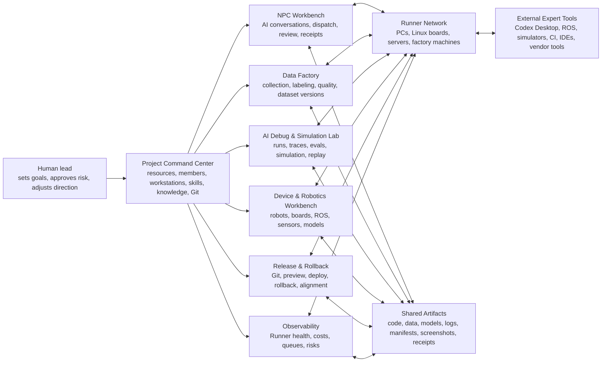
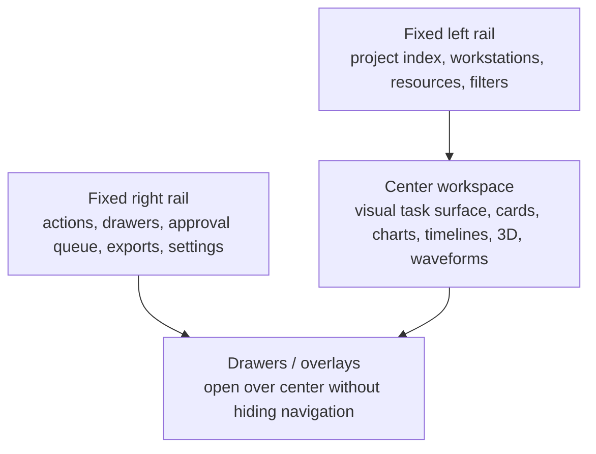
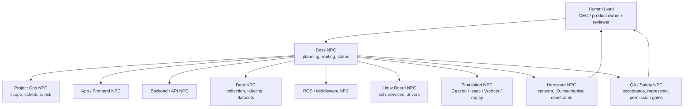
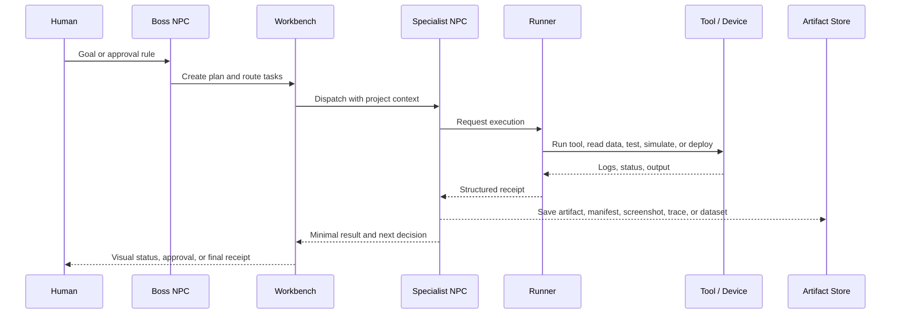
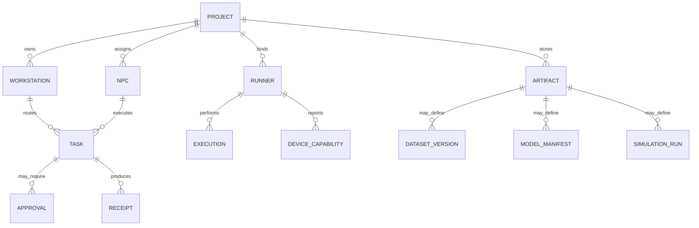

# AI Collaboration Platform Work Structure

This document defines the platform-level structure for an AI/NPC-driven collaboration system. Robotics is an important target scenario, but the structure must support any serious project: app development, robotics, embedded Linux, data collection, model training, simulation, QA, deployment, operations, and rollback.

The platform should not replace specialist tools such as Codex Desktop, Claude Code, ROS, Gazebo, Isaac Sim, Webots, Foxglove, PlotJuggler, Label Studio, MLflow, GitHub, CI, SSH, or robot vendor tools. Its job is to connect them through project context, NPC delegation, Runner execution, approval gates, visible process records, and final receipts.

## Product Position

The platform is an AI project company console.

Humans do not manually operate every tool. Humans define goals, approve risky actions, adjust direction, and inspect results. NPCs do most of the execution through bound desktop AI threads, Runners, project knowledge, Git, data pipelines, simulations, and device bridges.

The product must be valuable instead of decorative:

- Every page should answer "what can the project do next?"
- Every action should belong to a project, workstation, NPC, Runner, artifact, approval, or receipt.
- Every AI action should be traceable enough that a human can stop it, correct it, or audit it.
- Every workbench should share the same resource index instead of becoming an isolated dashboard.
- Every specialized capability should be optional and configurable per project.

## Whole Platform Map



## Workbench Contract

All workbenches should feel related. The NPC workbench is the reference structure, but each page can adapt its center area to the domain.



Required UI behavior:

- No horizontal scrolling as the primary navigation pattern.
- Central content should use visual panels: timelines, flow graphs, waveforms, 3D previews, status matrices, run tables, dataset grids, and approval cards.
- Text explains only what the user needs for action. Avoid text piles.
- Clickable controls must look clickable and be tested from the frontend.
- Every panel should have a clear project object behind it: task, NPC, Runner, device, dataset, experiment, deployment, file, or approval.
- New functions belong in the right rail as buttons that open drawers, unless they are the center page's main object.

## Local Development Runbook

Before using the platform to develop the platform, verify that the browser, Web process, and API process are talking to the same live backend. Do this before blaming a UI button or an NPC flow.

Required checks:

- Direct API health must work: `http://127.0.0.1:<api-port>/api/health`.
- Web BFF health must work: `http://127.0.0.1:<web-port>/api/proxy/health`.
- The `pid`, `port`, and `base_url` returned by Web BFF health must match the intended API instance.
- After backend route edits, restart the API process that the Web BFF actually points to. A passing test against a fresh temp API does not mean the long-running 8011 process has loaded the route.
- If `/api/proxy/*` returns 500 while direct API returns 200, fix or restart the Web process/BFF before continuing frontend validation.
- If direct API returns 200 but Web proxy returns route-level 404, the Web process is probably connected to an older API process or a different port.
- Do not keep multiple temp ports alive after validation. Close temp Web/API processes so users do not chase the wrong URL.

Use the alignment probe whenever there is any doubt:

```powershell
python scripts/check_web_api_alignment.py --web-base http://127.0.0.1:3001 --api-base http://127.0.0.1:8011 --project-id proj_ai_collab
```

The probe checks direct API health, Web BFF health, and a route-shape probe for artifact preview. It is intentionally small and should run before frontend click validation on newly added API-backed UI.

## Connected Workbenches

### 1. Project Command Center

Purpose: governance and resource indexing.

Core objects:

- projects, members, invitations, roles
- workstations and NPC responsibilities
- Runners and computers
- skills and project knowledge
- Git repositories and branches
- external tool bindings

Human value:

- see the project company structure at a glance
- invite collaborators
- bind computers and AI tools
- decide which NPC or workstation owns work

AI value:

- NPCs read the same indexed resources
- dispatch can route by workstation responsibility
- cross-workstation work can go through station leads and approval

### 2. NPC Workbench

Purpose: AI execution surface.

This is one of the most important workbenches, but it is not the only main interface. Project Command Center, Data Factory, AI Debug & Simulation Lab, Device & Robotics, Release & Rollback, and Observability remain first-class workbenches. The NPC Workbench should act as the shared execution timeline where key actions from those workbenches can appear as concise structured conversation cards.

Core objects:

- NPC tiles
- bound Codex/Claude desktop threads
- one-shot dispatches
- optional automation mode
- pending reviews
- minimal receipts and final results
- Boss plans

Human value:

- issue simple natural-language tasks
- watch assignment, approval, and final receipt without reading every token
- open the real desktop thread for full details

AI value:

- NPCs preserve role, skill, knowledge, and project context
- NPCs can request approvals, send handoffs, and create structured receipts
- Boss NPC can coordinate work without replacing the human lead

### 3. Data Factory

Purpose: collect, label, clean, version, and export training or evaluation data.

Applies to:

- voice data
- sensor streams
- camera frames
- logs
- app usage traces
- robot telemetry
- user feedback
- labeling queues
- synthetic simulation traces

Visual panels:

- collection pipeline graph
- labeling queue board
- quality score matrix
- dataset version timeline
- sample preview grid
- export manifest panel

AI value:

- NPCs can find weak data regions
- NPCs can create labeling instructions
- NPCs can request human review for ambiguous samples
- NPCs can produce dataset cards and export manifests

Human control:

- approve collection scope
- inspect sensitive samples
- approve exports
- freeze dataset versions

### 4. AI Debug & Simulation Lab

Purpose: evaluate behavior before real deployment.

Applies to:

- app flows
- agent behavior
- model prompts
- robotic simulation
- test replays
- safety scenarios
- regression traces

Visual panels:

- run timeline
- trace graph
- scenario matrix
- metric cards
- video or screenshot replay
- failure cluster chart

AI value:

- NPCs generate test scenarios
- NPCs compare runs and explain regressions
- NPCs propose fixes and dispatch implementation work

Human control:

- approve benchmark definitions
- inspect high-risk failures
- choose release criteria

### 5. Device & Robotics Workbench

Purpose: connect AI project development to physical or simulated machines.

This page is important for robotics, factories, embedded boards, IoT, and hardware testing. It should be configurable so non-robotics projects can hide it.

Core objects:

- robot or device registry
- Linux control boards
- local or remote Runner bindings
- ROS nodes, topics, services, actions
- sensor channels
- model files such as URDF, SDF, GLTF, GLB, STL
- safety permissions
- simulation endpoints

Visual panels:

- device topology graph
- 3D model viewer
- joint and link inspector
- ROS topic matrix
- waveform lanes
- sensor health strips
- command approval timeline

AI value:

- NPCs inspect ROS/topic state
- NPCs can request read-only telemetry snapshots
- NPCs can generate diagnostics
- NPCs can propose code changes for Linux boards through Runner
- NPCs can prepare simulation scenarios before real hardware actions

Human control:

- approve deploys to boards
- approve service restarts
- approve hardware IO
- approve any motion command

### 6. Release & Rollback

Purpose: ship safely and recover quickly.

Core objects:

- Git commits and branches
- build artifacts
- deployment targets
- rollback previews
- NPC alignment receipts
- release approvals

Visual panels:

- release train
- diff summary
- target matrix
- rollback preview
- readiness checklist

AI value:

- NPCs can summarize risk
- NPCs can align code, docs, tests, data, and deployment state
- NPCs can generate rollback plans

Human control:

- approve release
- approve rollback
- decide final target

### 7. Observability

Purpose: make AI and infrastructure behavior visible.

Core objects:

- Runner health
- dispatch queue
- desktop thread delivery state
- receipts
- failed actions
- cost and usage
- stale tasks

Visual panels:

- queue flow
- Runner heartbeat matrix
- failure heatmap
- tool availability map
- project isolation checks

Human value:

- see whether the platform is healthy
- find stuck tasks
- know which computer or NPC is responsible

## Robotics Company Reference Architecture

The platform can model a robotics company, but the same pattern should map to other project types.



Important rule: NPC roles are not fixed to robotics. A project can replace `ROS NPC` with `Payments NPC`, `Mobile NPC`, `Content NPC`, or `Clinical QA NPC`. The platform should let the project define its own company map.

## Runner And Computer Strategy

The Runner is the bridge between platform intent and real execution. A project may have many Runners.

Runner types:

- desktop Runner: developer PC, can see local repos and desktop AI tools
- server Runner: CI, training machine, GPU host, staging server
- Linux board Runner: robot controller, embedded Linux board, industrial PC
- jump-host Runner: local computer that reaches a board through SSH
- observation Runner: read-only telemetry and log collector

The platform should support two safe ways to work with Linux control boards:

1. Native board Runner:
   - install a small Runner on the Linux board
   - Runner reports OS, architecture, services, repo paths, ROS environment, device permissions
   - NPCs dispatch tasks to that board only within allowed permission levels

2. Jump-host Runner:
   - a bound desktop/server Runner connects to the board through user-configured SSH
   - the platform stores only capability metadata and references, not raw credentials
   - the Runner performs commands locally according to its own secure config

The API should consume Runner-reported capabilities. It should not mutate local Codex, Claude, SSH, ROS, or board configuration behind the user's back.

## AI-First Workflow



Human involvement should be concentrated at decision points:

- project goal
- role and permission setup
- risky approval
- ambiguous data review
- release decision
- incident intervention

AI/NPC work should be visible through:

- task graph
- timeline
- receipt list
- current execution state
- Runner logs
- artifact previews
- approvals
- rollback points

## Permission Model

The platform should make risk visible before execution.

| Level | Name | Examples | Human Approval |
| --- | --- | --- | --- |
| L0 | Observe | read logs, list files, read ROS topics, inspect metrics | no |
| L1 | Diagnose | run tests, collect telemetry snapshots, parse models | optional |
| L2 | Change Code | edit repo, create branch, run build | project rule |
| L3 | Deploy / Restart | deploy service, restart process, install package | required |
| L4 | Hardware IO | write serial/CAN/I2C, flash firmware, change driver config | required |
| L5 | Motion / Physical Action | move arm, start robot, actuator command | strong approval, simulation preferred first |

Every action above L2 should include:

- target machine or device
- exact command or tool action
- expected result
- rollback path
- responsible NPC
- approving human
- final receipt

## Shared Object Model

Workbenches should stay connected through shared objects.



Minimum shared objects:

- project
- member
- workstation
- NPC
- Runner
- capability
- task
- approval
- receipt
- artifact
- dataset version
- simulation run
- device or external system
- Git reference

## Page Planning

### Project Command Center

Best center view: company map plus resource health.

Cards should be action cards, not descriptions:

- unbound computers
- NPCs without responsibilities
- pending invitations
- stale tasks
- missing project knowledge
- risky approvals

### NPC Workbench

Keep current direction:

- NPC conversation tiles are primary
- left fixed index
- right fixed tool rail
- no extra pages inside conversation tiles
- full process available in desktop thread, platform shows command, review, receipt, and indexes

### Data Factory

Center view should show:

- collection lanes
- labeling queues
- quality gates
- dataset version timeline
- preview samples

Right rail actions:

- create collection plan
- import data source
- generate labeling guide
- ask NPC to audit data
- export dataset version

### AI Debug & Simulation Lab

Center view should show:

- scenario matrix
- active run timeline
- traces and screenshots
- metrics
- failure clusters

Right rail actions:

- create scenario
- replay run
- compare runs
- ask NPC to diagnose
- promote passing run to release candidate

### Device & Robotics Workbench

Center view should show:

- device topology
- model viewer
- topic/sensor matrix
- waveform lanes
- safety approval timeline

Right rail actions:

- register device
- connect ROS bridge
- import model
- collect telemetry
- dispatch diagnostic NPC
- request deploy approval

### Release & Rollback

Center view should show:

- target matrix
- commit timeline
- deployment state
- rollback preview
- NPC alignment receipts

Right rail actions:

- prepare release
- ask NPC for risk review
- run acceptance
- request approval
- rollback

## Frontend Design Rules

Use visual density, not text density.

- Prefer icons, chips, charts, timelines, matrices, and previews.
- Each page should have one central operational surface.
- Use compact labels and status colors consistently.
- Avoid repeated "overview" panels unless each controls a different object.
- Avoid source-link style integration cards.
- External tools should appear as capabilities, data routes, or execution targets.
- Buttons should describe actions: `Connect`, `Inspect`, `Dispatch NPC`, `Export`, `Approve`, `Rollback`.
- Page copy should be short enough that a user can understand the screen in under 10 seconds.

## Color And Status Semantics

These should stay consistent across workbenches:

- Green: ready, passed, synced, safe to continue
- Blue: active, running, connected, informational
- Yellow: needs review, warning, waiting for human
- Red: blocked, failed, unsafe, requires intervention
- Gray: idle, unavailable, archived, unconfigured
- Purple: AI/NPC-generated suggestion or plan

## MVP Roadmap

1. Stabilize shared shell:
   - left project index
   - center work surface
   - right action rail
   - shared status colors

2. Formalize shared objects:
   - task, approval, receipt, artifact, Runner capability
   - make every workbench read/write these objects

3. Make NPC dispatch the core action:
   - every workbench can ask a relevant NPC to act
   - every dispatch has target, permission level, artifact, and receipt

4. Add Runner capability registry:
   - desktop, server, Linux board, jump host, observation Runner
   - project-scoped isolation

5. Add Data Factory:
   - imports, labeling queues, quality, dataset versions
   - connect to AI and robotics data without hardcoding YueSpeak

6. Add AI Debug & Simulation Lab:
   - run records, traces, comparison, failure diagnosis
   - support app, model, and robotics projects

7. Add Device & Robotics Workbench:
   - read-only ROS bridge first
   - model import and joint inspection
   - sensor waveform capture
   - strict approval gates for hardware actions

8. Add Release & Rollback:
   - Git indexing, preview, approval, deploy, rollback receipts

9. Add company-map customization:
   - project chooses departments, NPC roles, pages, permissions
   - robotics company is one template, not the only model

## Acceptance Criteria

The platform is ready to be broadly useful when:

- A new project can choose a template and immediately see its connected workbenches.
- A human can assign a goal once and watch NPCs route work across workbenches.
- The user can tell which NPC, Runner, device, artifact, and approval belongs to every action.
- A Linux board can be represented as a first-class target without storing raw credentials in the API.
- Read-only device and telemetry collection works before any risky write or motion action exists.
- All risky actions have explicit approval and final receipts.
- Workbench pages are visual, concise, and tested from the frontend.
- The platform can support robotics without becoming robotics-only.

## Boss Collaboration Resolution For Robotics Projects

This section records the Boss-level architecture conclusion for how the platform should support robotics work while remaining general enough for any project type.

### Final Position

The platform is a coordination and governance layer. It should not replace ROS, Gazebo, Foxglove, Codex, IDEs, board vendor tools, SSH, or visualization tools. It should make them usable inside one project operating model through NPC delegation, Runner execution, approval gates, and structured receipts.

### Work Split For NPC 1, 2, And 5

- NPC 1 owns the workbench UX contract. The user should move naturally between NPC execution, simulation evidence, device state, telemetry, and approvals without feeling that they entered separate products.
- NPC 2 owns the shared backend objects and event flow. Robotics features must reuse project-scoped task, execution, approval, receipt, artifact, and capability objects instead of introducing a robotics-only control plane.
- NPC 5 owns Runner, desktop bridge, Linux control board execution, and ROS-facing integration boundaries. Runner should expose machine capability and execution results without leaking board-specific operational details into the core product model.

### Linux Control Board Runner Model

Linux control boards should be supported as first-class Runner targets in one of two safe forms:

1. Native board Runner installed on the board for local execution and telemetry collection.
2. Jump-host Runner on a developer or server machine that reaches the board through project-configured SSH.

In both modes, the platform should store capability metadata, project bindings, approval requirements, and receipts. It should not store raw credentials or silently mutate board configuration.

### ROS, Sensors, 3D, And Waveforms

ROS and sensor integrations should enter the platform through summaries, evidence, and artifacts:

- node health, topic health, frequency, and alert summaries
- telemetry snapshot tasks and replay tasks
- bag, log, image, trace, and model artifacts
- 3D model previews for URDF, SDF, GLTF, GLB, or STL assets
- waveform lanes for selected sensor channels and derived signals

The platform should present these as project evidence and operational surfaces. It should not attempt to become the primary ROS graph explorer, waveform engine, or 3D simulation engine.

### Human Approval And Drift Prevention

Humans should approve direction and risk, not click through every normal step. The platform should enforce this split:

- AI/NPCs plan, dispatch, analyze, diagnose, edit code, simulate, and prepare evidence.
- Humans approve deploy, restart, firmware, hardware IO, and motion-related actions.
- Boss NPCs keep specialist NPCs aligned to project scope so robotics work does not distort the platform into a robotics-only product.

### General-Project Guardrail

Every robotics-specific feature must map back to a general project abstraction:

- board or robot -> Runner target
- ROS node or tool -> capability or execution source
- telemetry or topic snapshot -> artifact or receipt evidence
- deploy or hardware action -> approval-gated execution
- simulation replay -> lab run or artifact-backed scenario

If a feature cannot be described with these shared abstractions, it likely belongs in an adapter or specialist tool integration rather than the platform core.

## Verified Platform Self-Development Flow

This section records a real platform self-development run on 2026-05-12 in project `proj_ai_collab`.

The user acted like a normal project lead: one natural-language request was sent to the Boss NPC. The Boss NPC then generated structured peer dispatches for NPC 1, NPC 2, and NPC 5. The platform converted the Boss reply into real collaboration messages, applied review gates, showed the pending approvals in each target NPC tile, and then launched each target NPC after approval.

### What Worked

- A normal user instruction to Boss can become real NPC-to-NPC dispatches.
- If `seat-mcp` tools are unavailable in the execution environment, `platform-peer-dispatches` now acts as a machine-readable fallback instead of making the user manually route work.
- Cross-risk robot/ROS wording correctly triggered review before execution.
- The user can approve from the NPC workbench timeline with a short command such as `通过`.
- After approval, the workbench can launch the target NPC's bound thread without requiring a second manual button click.
- Final receipts from NPC 1, 2, and 5 returned to the workbench and stayed scoped to `proj_ai_collab`.

### Product Rule From This Run

NPC autonomy should feel like this:

1. Human gives direction to Boss in plain language.
2. Boss routes to specialist NPCs.
3. Platform shows approvals only when risk or policy requires it.
4. Approved work starts automatically.
5. Specialist NPCs return short receipts and artifact pointers.
6. Boss or the human can synthesize the result.

The user should not need to understand message ids, JSON blocks, MCP tools, or adapter logs. Those are platform internals.

### Current Self-Development Guardrail

The current development target is the AI collaboration platform itself in project `proj_ai_collab`.

YueSpeak is a historical validation project, not the current development target. Boss NPC and specialist NPCs must not dispatch work to modify YueSpeak unless the human explicitly opens a YueSpeak task again.

Before Boss dispatches any new platform-development task, it must present a short review card with:

- task boundary
- target files or isolated module
- forbidden areas
- expected validation
- risk level

Forbidden areas unless the human explicitly approves a bug fix:

- NPC Workbench frontend structure
- left rail / right rail / tile layout
- dispatch -> review -> receipt loop
- Codex Desktop one-shot dispatch chain
- YueSpeak completed work

Allowed work:

- new platform features in isolated modules
- backend tests for isolated APIs
- read-only reuse of existing stable capabilities
- documentation of platform architecture and handoff rules
- frontend validation that does not alter the accepted NPC Workbench structure

Boss must reject or re-route any NPC plan that drifts into YueSpeak, rewrites stable workbench structure, piles up text-heavy pages, or builds decorative features without project value.

### Frontend Continuity Rule

Do not make robotics, data, or simulation pages compete with the NPC workbench. Each page should be a different view over the same project objects:

- NPC Workbench: command, dispatch, review, receipts, and concise structured cards.
- Data Factory: datasets, samples, labels, quality, versions, export manifests.
- AI Lab: scenarios, simulations, traces, metrics, failure clusters.
- Robotics / Device Workbench: devices, Linux boards, Runner targets, ROS/topic summaries, waveforms, 3D model previews.
- Observability: queues, Runner health, costs, stuck tasks, risk events.

Important events from specialized pages should flow back to NPC conversation tiles as structured cards. Full logs, long traces, ROS bags, model files, screenshots, and long NPC reasoning should be artifact-backed evidence, not text piles in the main timeline.

### Shared Backend Object Rule

Robotics must not introduce a separate control plane. It should map to the platform's existing shared objects:

- `Task`: what needs to happen.
- `Dispatch`: which NPC, Runner, board, or desktop thread should act.
- `ExecutionState`: queued, acked, in progress, completed, failed.
- `Approval`: human gate for deploy, restart, firmware, hardware IO, motion, credential, or destructive actions.
- `CollaborationMessage`: the project-scoped event envelope.
- `Receipt`: minimal result, progress, rejection, or final summary.
- `Artifact`: evidence and large data such as logs, bags, traces, screenshots, manifests, models, and reports.
- `Capability`: what a Runner, board, desktop, simulator, or tool bridge can safely do.

For frontend and API shape, `metadata.payload_json` should be the standard place for compact machine-readable cards. The user-facing body should stay short.

### Runner And Linux Board Rule

Linux control boards should be treated as Runner targets, not as hidden side channels.

Supported modes:

- Native board Runner: installed on the board for local command execution and telemetry collection.
- Jump-host Runner: installed on a desktop/server and reaches the board through project-configured SSH, ROS bridge, or vendor tooling.
- Observation-only Runner: collects logs, topics, health, screenshots, or traces without write access.

Capability examples:

- `ros.topic.read`
- `ros.node.inspect`
- `ros.bag.record`
- `sensor.waveform.capture`
- `model.urdf.inspect`
- `sim.gazebo.run`
- `deploy.systemd.restart`
- `firmware.flash`

Read-only inspection can be low risk. Any hardware write, deployment restart, firmware flash, live motion, or actuator command must require human approval.

### Visual Product Rule

The platform should prefer operational visuals over prose:

- waveforms for sensor channels
- 3D previews for URDF, SDF, GLB, GLTF, STL, and robot scene assets
- topology maps for devices, boards, Runners, ROS nodes, and services
- status matrices for capabilities and risk gates
- timelines for dispatch, approval, execution, and receipt
- compact cards for NPC handoffs and final results

Visual panels are not decoration. Each one must connect to a project object, an NPC action, a Runner capability, an artifact, or an approval decision.

### Current Gaps Found During This Run

- Long NPC final receipts can exceed the platform note budget. The adapter now truncates the visible note and points to local artifacts, but the product still needs a first-class artifact viewer in the workbench.
- Review approval and execution startup are now closer to one flow, but the UI should continue to reduce visible duplicate launch controls for users who just approved a task.
- Some older queued architecture tasks remain visible. The workbench should eventually make stale queue handling clearer without hiding audit history.
