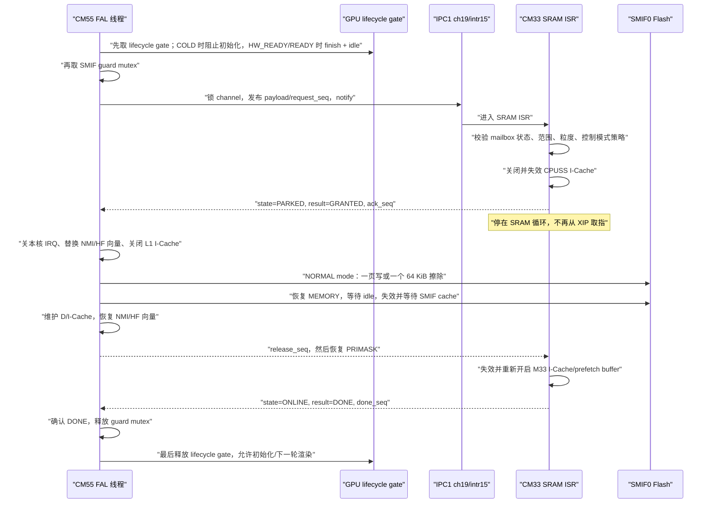

# PSE84 双核 SMIF0/XIP 根因修复实施与验证记录

> 日期：2026-07-14，实机终验更新：2026-07-15
> 适用工程：`Edgi_Talk_M33_Blink_LED`、`secureCore`、`Edgi_Talk_M55_Blink_LED`
> 芯片：PSE846GPS2DBZC4A，CM33 Secure/Non-secure + CM55
> 文档性质：根因分析、最终实现、构建证据、实机验收清单、答辩手册

## 0. 当前结论与证据等级

最终定位到两个相互叠加的固件缺陷。第一，旧 M55 FAL 从 `0x60E00000` 起占 2 MiB，独占末端为 `0x61000000`；生成的 M55 Non-secure SMIF MPC 区域却在 `0x60FC0000` 独占结束，越界首地址正是故障现场的 `BFAR=0x60FC0000`，同时 `CFSR=0x00008200`（`PRECISERR|BFARVALID`）。这构成了地址、权限配置和硬件现场三者闭合的确定性根因。第二，同一片 SMIF0 外部 Flash 同时承担双核 XIP 与 M55 program/erase 命令事务，而旧代码没有建立芯片级命令窗口排他；它解释了暂停 M33 后 M55 从 SMIF FIFO 等待继续、以及 M33 在不同取指时序下出现 `UNDEFINSTR` 的现象。`rt_thread_mdelay()`、`rt_schedule()` 和 `sensor_update_latest()` 是受害位置，不是根因。

永久关闭 M33 I-Cache 只改变取指流量和故障时序，不能改变 MPC 权限边界，也不能建立跨核排他，因此凌晨 3 点的“暂时不崩”只能算规避实验，不能算根治。

当前根治方案由以下机制组成；第 14 节记录了本板已完成的实机项目和仍需量产验证的边界：

1. Secure Reset Handler 有界失效并重新开启 M33 CPUSS I-Cache；
2. `BFHFNMINS=0` 所路由到 Secure 的 NMI/BusFault/HardFault 等最小处理链迁入内部 SRAM；
3. M33 与 M55 通过 IPC1 对 SMIF0 command mode 建立跨核所有权协议；
4. M33 在发布 `GRANTED` 前关闭并排空 CPUSS I-Cache，M55 在切换 NORMAL mode 前关闭本核 L1 I-Cache；
5. 命令窗口内，M33 常规路径停在 SRAM ISR，M55 命令闭包位于 ITCM/DTCM；NMI/HardFault 走内部 RAM fatal path；
6. M55 普通读取改为 memory-mapped 读取，不再用 `Cy_SMIF_MemRead()` 引入命令 FIFO 事务；
7. 写入按 256 B 页拆分，擦除严格按 64 KiB 物理扇区；
8. 恢复 MEMORY mode 后，有界等待 SMIF idle 和 cache invalidate 完成，再维护 CM55 D/I-Cache 与 M33 I-Cache；
9. 文件系统挂载调度与 LCD 初始化解耦，失败不自动格式化；这不代表两者使用的全部硬件资源彼此独立；
10. `safe_to_block` 仅作为控制模式阻塞策略：非 PASSIVE 模式拒绝长擦除；它不是“机器人已物理静止”的传感器证明；
11. VG-Lite 硬件初始化、LVGL UI 初始化、每轮 `lv_timer_handler()` 和 FAL 写擦共用一把 GPU lifecycle gate，禁止 GPU 初始化或新渲染跨越 SMIF 命令窗口；
12. guard/SMIF/cache/协议临界路径的等待都有上限，Flash/mode/cache 状态失去可信恢复条件时复位，不返回 XIP；普通 VG-Lite 渲染仍保留 vendor 的无限等待语义，不在这一断言内。
13. 把 2 MiB FAL 重定位为 `0x60DC0000..0x60FBFFFF`，其末端严格等于 MPC 上界 `0x60FC0000`；分区表与资源地址同步重排。数据迁移只复制了 BT、文件系统和 Wi-Fi 配置，首次烧录时小智新分区为空；第 11.3、14.5 节记录了后续 token 恢复，不能把“分区地址已迁移”写成“全部用户数据已迁移”。

当前实现还有两个必须明确的边界：任何可能对 SMIF0 映射窗口发起访问的非 CPU 总线主设备，都必须有自己的静默与完成证明；当前闭环覆盖的是受 lifecycle gate 管理的 LVGL/VG-Lite 路径，不自动覆盖绕过该 gate 的直接 GPU 调用、未来 DMA/NPU 或其他 master。FAL 写擦 API 只允许在中断开启的 RT-Thread 线程上下文调用。第 5.4 节记录了本固件的非 CPU master 审计与未来约束。

证据等级必须区分：

| 结论 | 当前证据 | 状态 |
|---|---|---|
| 原问题与共享 SMIF0 活动强相关 | M55 卡在 `Cy_SMIF_PopRxFifo()` 时暂停 M33，M55 随即继续并完成 LCD/LVGL 初始化；停核同时改变 M33 的取指、中断和其他总线活动 | 已有实机 A/B 强证据，硅内部微观机理仍属推断 |
| Secure 启动/cache 与 Secure fault 闭包已迁入 RAM | 源码、最终 ELF/map、反汇编与签名 HEX | 已静态与构建验证 |
| 旧 FAL 越过 M55 Non-secure MPC 上界 | 旧范围末端 `0x61000000`、MPC 独占末端 `0x60FC0000`、硬件 `BFAR=0x60FC0000` 且 `CFSR=0x00008200` | **根因已闭合** |
| guard 的地址、粒度、发布顺序、cache 静默和异常闭包 | 22 项源码结构回归、linker ASSERT、ELF/map/反汇编；真机完成拒绝、授权、写入、读回和清除事务 | 已静态、构建和单板动态验证 |
| mailbox 对 M55 为 Non-cacheable | MPU region 2 `0x261C0000..0x261FFFFF`、MAIR 属性 4、启动调用链、ELF 反汇编和跨核 mailbox 运行结果 | 已验证当前固件运行可见性；寄存器位级取证仍可补充 |
| 新镜像双核运行、LCD 正常、无 HardFault | 实际烧录/verify；真实断电启动；10 次系统复位；两核 tick、M33 runtime 与 LCD flush 持续增长；两核 Fault 为 0 | **本板目标场景通过**；不外推为多板、温压或量产终身稳定 |
| 写擦除在真实 Flash 上可工作 | 运动模式下 erase 被拒绝；PASSIVE 下 4 次 64 KiB erase、token page write/read/clear 均完成，guard grant/complete 匹配且 timeout 为 0 | **本板功能通过**；事务中断电原子性/恢复未验证 |
| 小智 token 已恢复并持久化 | 旧记录结构校验、claims/有效期检查、PC 侧 WebSocket `101`、板端分片写入；软件重启后重新出现 `token_len=439`，联网后 `xz_ws=1/stage=70/srv_hello=1` | **本板恢复通过**；token 有到期时间，软件重启不替代额外物理断电验收 |

2026-07-15 已通过 KitProg3（序列号 `17040F11022F2400`，目标电压约 1.82 V）完成 M55、M33 和资源烧录/verify，并在真实断电重新插入后读取运行现场。本记录只把已完成的单板项目标为通过；50 次物理断电、多板、温压、满负载和事务中掉电仍不宣称完成。

---

## 1. 故障现象如何一步步变化

### 1.1 第一阶段：看起来像 `main()` 前 HardFault

最初现场：

```text
PC   = 0xeffffffe
CFSR = 0x00010000  // UNDEFINSTR
HFSR = 0x40000000  // FORCED
g_m33_boot_marker = 0
```

当时 `marker=0` 只能说明该 marker 尚未写入，不能单独证明故障一定发生在 `main()` 前。后续更细分段证明程序能进入 `main()`，进入时 fault 寄存器仍为 0，所以这个早期假设被撤销。

### 1.2 第二阶段：marker 逐段推进

关键 marker：

- `0x33010002`：进入 `m33_init_framework()`，越过最前面的 M55 IPC auto-init 开关；
- `0x33500009`：sensor、input、control、CAN、safety、HTTP、openclaw 初始化均已返回；
- `0x34100009`：主循环本轮已执行到 `rt_thread_mdelay(FRAME_PERIOD_MS)` 前。

这排除了“某个固定 board init 一执行就崩”的简单模型，但还不能说明最后一个 marker 对应的函数就是根因。

### 1.3 第三阶段：栈回溯指到调度器

非安全异常栈帧反查到（以下 PC 属于当时故障镜像，只是历史定位地址，不是当前重建镜像的符号地址）：

```text
stacked PC = 0x0837a030
SysTick_Handler
  -> rt_timer_check
  -> main thread sleep timeout
  -> rt_schedule
  -> rt_list_remove
```

这说明异常在一次 SysTick/唤醒/调度窗口暴露，但不等价于 RT-Thread ready list 必然被软件写坏。`UNDEFINSTR` 更符合“CPU 取到的指令字不再是该地址应有的指令”或异常返回现场已失真。

### 1.4 第四阶段：忙等把“崩点”移到 sensor

把 `rt_thread_mdelay()` 临时换成忙等后，崩点移动到：

```text
sensor_update_latest
applications/m33/sensor_manager.c:37
main.c:1094（当时版本）
```

单变量实验否定了“sleep 本身就是根因”。忙等改变了取指密度、总线流量和双核时序，所以最先踩到坏指令的受害函数也改变了。

### 1.5 第五阶段：RT-Thread fault dump 全零

在当时故障镜像中，`g_rt_hw_fault_dump` 位于 `0x240c1a50`，重新复现后结构全零；当前最终 M33 ELF 中该符号为 `0x240cb864`。历史地址只能用历史镜像解释。结构全零只能证明 Non-secure RT-Thread 的 C 级 HardFault handler 没完成现场保存；不能证明没有 HardFault，也不能仅凭这一点断言故障一定来自 Secure 域。

可能性包括：

- 异常发生在 Secure 状态，读取了错误的 SCB bank；
- 异常升级或二次 fault，尚未进入 C handler 就 lockup；
- 向量或异常返回现场已被错误取指影响；
- 调试器看到的是后续异常现场，不是第一现场。

因此后续分析把 Secure/Non-secure SCB、`EXC_RETURN`、stacked frame 和两个核心分开处理。

### 1.6 第六阶段：M55 黑屏给出决定性证据

LCD 不亮时，M55 卡在 SMIF 读 FIFO 路径。实机暂停 M33 后，M55 从 `Cy_SMIF_PopRxFifo()` 立即继续，并完成 LCD/LVGL 初始化。

这是整条证据链中最强的因果实验，但必须准确描述实验边界：

- 实验自变量是 M33 运行或暂停；停核同时改变该核心的取指、中断和其他总线活动，不是只改变 XIP 一个变量；
- M55 的命令模式事务随 M33 halt 立即解除；
- 结果强烈支持共享 SMIF0 竞争是主要阻塞模型，并排除了 LCD 面板自身故障作为首要解释；它不单独证明硅内部究竟是哪一级 FIFO、prefetch 或仲裁状态被破坏。

### 1.7 最终交付版再次黑屏：背光复用修复漏迁

SMIF 根治后的最终交付镜像又出现了一次“软件持续 flush、实体 LCD 不亮”。这次现场与 1.6 不同：M33/M55 Fault 均为 0，M55 tick、LVGL flush 持续增长，LCD/GFX/MIPI/VG-Lite 返回值也均为 0，因此 M55 没有 HardFault，显示控制器也在接收帧。

真正差异在背光脚 P20.6：

- 生成路由把 `CYBSP_DISP_BACKLIGHT_PWM` 配成 `P20_6_TCPWM0_LINE265`，即 HSIOM 选择值 10；
- 工程没有调用 `mtb_display_tl043wvv02_backlight_init()`，对应 TCPWM 没有 Init/Enable/Start；
- 因此 GPIO `OUT` bit6 即使为 1，也不能控制仍归 TCPWM 所有的物理引脚；
- 已知能亮的 M55 源工程自提交 `2bf03b5480a73ec5a6062f564508bd2f80595d82` 起，会在 MIPI 初始化成功后把 P20.6 切回 GPIO 并输出高电平；最终交付提交 `975d5505` 手工合并 `drv_lcd.c` 时漏掉了这段已解决修复。

坏镜像的无复位现场为 `HSIOM_PRT20.PORT_SEL1=0x000A0000`、`GPIO_PRT20.OUT=0x000000C0`、`CFG=0x66000880`。这说明 P20.6/P20.7 的输出锁存值和驱动模式看似正确，但 P20.6 实际仍由未启动的 PWM 控制。将 pin6 HSIOM 字段单独改为 0 后，寄存器立即变为 GPIO 路径；随后源码只恢复同一处 `Cy_GPIO_Pin_FastInit(..., 1U, HSIOM_SEL_GPIO)`，没有改动显示栈或时序。

这次回归也修正了验收方法：`mipi_status=0`、`frame_updates` 或 LVGL flush 增长只能证明软件提交链推进，不能证明面板背光已经输出。实体亮屏必须同时满足 P20.6 HSIOM=GPIO、OUT bit6=1，以及肉眼确认面板发光。

---

## 2. 为什么 `PC=0xeffffffe` 不能直接拿来反汇编

正常 Cortex-M 代码地址应满足 Thumb 状态约束；异常返回值通常是特定 `0xFFFFFFxx` 编码。`0xEFFFFFFE` 既不像正常代码地址，也不是可信的标准异常返回值。

它更可能是以下之一：

- 已损坏的 LR/PC；
- 读取了不对应当前安全域或栈的 frame；
- 二次 fault/lockup 之后的派生现场；
- 外部 Flash 错误取指后执行流失控的结果。

正确做法是同时保留：

1. Secure 与 Non-secure 两套 CFSR/HFSR/MMFAR/BFAR；
2. MSP、PSP、MSP_NS、PSP_NS；
3. `EXC_RETURN` 的安全域、栈选择和扩展帧位；
4. 原始异常栈的 R0-R3、R12、LR、PC、xPSR；
5. CM33 与 CM55 当前 PC/LR；
6. SMIF、CPUSS I-Cache 和共享 mailbox 状态。

栈回溯仍然有价值，但它回答的是“故障在哪里暴露”，不自动等于“谁制造了故障”。

---

## 3. XIP 与三类 cache 不能混为一谈

### 3.1 XIP

XIP（Execute In Place）是 CPU 直接从外部 Flash 映射窗口取指执行，不先把整段程序复制到 SRAM。优点是节省片上 SRAM，代价是外部 Flash/SMIF 可用性会直接影响取指。

本项目至少涉及：

- M33 外部 Flash 代码映射，例如旧故障镜像回溯中的历史地址 `0x0837a030`；
- M55 的 `0x60000000` SMIF 映射窗口；
- 旧 FAL 数据分区 `0x60E00000..0x60FFFFFF`，对应 Flash offset `0x00E00000..0x00FFFFFF`；其中 `0x60FC0000..0x60FFFFFF` 已越过 Non-secure MPC 上界。

### 3.2 三类不同 cache

| 层次 | 所属 | 本修复中的动作 |
|---|---|---|
| CPUSS `ICACHE0` | M33 指令取指 | Secure 启动时 disable → invalidate/buffer invalidate → enable；每次命令事务结束后再次失效 |
| SMIF fast/slow cache | SMIF memory-mapped/XIP 路径 | M55 恢复 MEMORY mode 后执行 `Cy_SMIF_CacheInvalidate(..., CY_SMIF_CACHE_BOTH)` |
| CM55 SCB D-Cache | CM55 数据读取 | 写擦除后对对应 XIP 地址执行 `SCB_InvalidateDCache_by_Addr()` |

“关闭缓存”不是根治：永久关闭 M33 I-Cache 会让每次取指都更频繁访问 SMIF0，既降低性能，也放大与 M55 命令模式的竞争窗口。

---

## 4. 根因模型

最终根因应拆成两个层次，不能再混写成一个推测：

1. **确定性的保护越界**：旧 FAL `0x60E00000 + 0x00200000` 到 `0x61000000` 才结束，而生成的 M55 Non-secure SMIF MPC 配置为 `0x60580000 + 0x00A40000`，恰在 `0x60FC0000` 结束。M55 第一次访问 `0x60FC0000` 时产生精确总线错误；`BFAR` 与数学边界完全一致。
2. **独立存在的跨核命令窗口竞争**：即使地址没有越界，program/erase 仍会把 SMIF0 从 memory-mapped/XIP 工作方式切入 command mode。旧实现只锁 M55 本核，不能阻止 M33 同时 XIP，因而仍需跨核 guard。

第二层需要以下两个条件共同出现：

1. M33/M55 的代码或数据经 SMIF0 memory/XIP 路径访问；
2. M55 同时把 SMIF0 切到 NORMAL/command mode 执行 program/erase/read command。

旧 FAL 只在 M55 本核局部保护命令操作，无法阻止 M33 继续 XIP。命令模式期间如果另一个核心仍从同一控制器取指，会破坏软件所依赖的基本不变量：“当前正在执行的下一条指令始终可读且内容正确”。

这能统一解释两个看似不同的问题：

- M55 可能卡在 FIFO/ready 轮询，LCD 初始化因此未完成；
- M33 可能取得错误指令字，最终表现为 `UNDEFINSTR`，受害位置随时序落在 scheduler、sensor 或其他代码。

关于跨核竞争在芯片内部究竟破坏 FIFO 状态机、prefetch/cache line 还是总线仲裁，目前没有硅级 trace，本文不冒充已经证明微观机理。这个限制不影响 MPC 越界根因的确定性，也不影响“program/erase 必须跨核排他”这一系统不变量。

---

## 5. 当前实现协议与待验证前提

### 5.1 固定资源

| 资源 | 值 |
|---|---|
| 共享 slot | `0x261FFF00`，256 B，NOLOAD，32 B 对齐 |
| mailbox 有效载荷 | 128 B，四个 32 B cache line |
| IPC instance/channel | IPC1 channel 19，local channel 3 |
| IPC interrupt | interrupt 15，local interrupt 7，CM33 NVIC IRQ 53 |
| Flash offset 范围 | `0x00DC0000..0x00FBFFFF`，独占末端 `0x00FC0000` |
| M55 数据映射 | `0x60DC0000..0x60FBFFFF`，独占末端 `0x60FC0000` |
| program page | 最大 256 B，禁止跨页 |
| erase sector | 恰好 64 KiB，地址必须 64 KiB 对齐 |

M33 linker 真正保留该 slot，并通过 ASSERT 检查地址、大小和与其他共享段不重叠；M55 使用固定地址指针，不重复分配一份“看起来同名但地址可能不同”的对象。

M55 MPU region 2 覆盖 `0x261C0000..0x261FFFFF`，配置项 `.cacheable=4`；本工程 CMSIS 将 4 定义为 `ARM_MPU_ATTR_NON_CACHEABLE`。`cybsp_init -> init_cycfg_protection -> Cy_MPU_Init` 的启动链及最终 ELF 反汇编均确认该 MPU 配置会执行。M33 定义 `__DCACHE_PRESENT=0`。因此 mailbox 不依赖手工 D-Cache clean/invalidate；`volatile` 与全系统 `DMB/DSB` 用于发布顺序。烧录后仍需按第 14 节读回 MPU 寄存器。

IPC 资源审计必须分开表述：guard 的 global channel 19 / interrupt 15 不复用已有的 channel 17/18 或 interrupt 9..14，因此 guard 本身不撞号；但是既有 `m33_m55_comm` 仍有 queue channel 与 SRF reservation 重叠、两核复用 interrupt 13/14 的独立历史问题。该问题不属于本次 SMIF guard 改动，也不能把本文静态测试解释成“整个工程 IPC 表已无冲突”。

事务序号由 M55 单独分配和写入。M55 的本地 `next_seq` 递增时跳过 0，并与 mailbox 中当前的 `request_seq/ack_seq/done_seq` 三个可能残留的票据比较；最多检查四个非零候选即可找到不冲突值。`client_init()` 的本地状态建立由 RT-Thread scheduler critical section 串行，并保留真实 mailbox validate 错误；同 epoch 的迟到 `DONE/BUSY/INVALID` 都会被 reaper 消费并清除 active ticket，避免终态晚到导致客户端永久卡住。这个措施避免 M55 重启或超时后立即复用可见旧票据，但它不把“事务中 CM33 独立复位”或“活跃事务中 M55 单核重启”变成透明恢复场景；该边界见第 10.4 节。

### 5.2 cache line 单写者

| mailbox line | 字段 | 运行期写者 |
|---|---|---|
| line 0 | magic/version/size/epoch/state/safe_to_block/budget/flags | CM33 |
| line 1 | request_seq/release_seq/op/address/length | CM55；但 CM33 boot reset 在 `OFFLINE` 初始化阶段会清零整个 slot |
| line 2 | ack_seq/done_seq/result/error/counters | CM33 |
| line 3 | 预留诊断 | 当前无人写 |

这是防御性布局，不是硬件隔离：当前 M55 MPU 已把 mailbox 配为 Non-cacheable，所以不能把拆成四行夸大成“依靠 cache line 保证一致性”。拆行与 static assert 的实际价值，是固定 ABI/offset、明确**正常 ONLINE 运行期**的字段所有权、降低未来属性变化或维护误写时的影响面。CM33 启动时清零整个 slot 是显式例外，M55 必须用 epoch 变化识别它，不能假定 line 1 永远不会被启动代码重置。多字段快照本身并非原子事务；协议仍依赖运行期单写者、`epoch + request/ack/done_seq` 二次校验以及 `DMB/DSB` 发布顺序来拒绝不一致观察。

### 5.3 状态机



最重要的不变量：M55 收到 `GRANTED/PARKED` 以前绝不进入 SMIF command mode；CM33 的 ACK 必须晚于 CPUSS I-Cache 静默；M55 发布 `release_seq` 以前不恢复可能执行 XIP ISR 的中断；M33 完成 I-Cache 维护以前不退出 SRAM ISR；任何可能直接访问 SMIF0 XIP 的独立 master 必须在请求前静默并保持到 MEMORY mode 恢复。锁序固定为 `GPU lifecycle gate -> SMIF guard mutex -> IPC channel`，释放方向相反；LVGL 线程只取得 lifecycle gate，不反向取得 guard mutex，从结构上避免这两条路径形成 ABBA。

### 5.4 非 CPU master 审计与 GPU 闭环

PRIMASK 和 CM33 SRAM park 只能控制两个 CPU，不能自动停止独立总线主设备。GPU、显示扫描、DMA、NPU 是否构成风险，取决于它们在命令窗口是否会对 SMIF0 映射窗口发起访问，不能只按外设名称一概而论。当前固件逐项审计结果如下：

| master | 当前实际地址/状态 | 结论 |
|---|---|---|
| GFXSS/LCD framebuffer | `disp_buf2=0x26200000`，`disp_buf1=0x262C8000` | 片上 `gfx_mem`，不访问 SMIF0 |
| VG-Lite command/tess/graphics buffer | `0x26390000..0x264xxxxx` 的 `.cy_gpu_buf` | 片上 RAM |
| LVGL 字体 | 字形从 XIP const 表由 CPU展开到临时 draw buffer，GPU 使用后 `finish` | 当前没有 GPU 直读字体 XIP |
| LVGL variable image | 当前应用没有 `lv_image_set_src/LV_IMAGE_DECLARE` 路径 | 当前无 XIP image source；未来是高风险入口 |
| SDHC ADMA | bounce buffer 来自 `0x260...` heap | 不访问 SMIF0 |
| 通用 DMA、Ethos-U55/NPU | 当前生成 DMA channel disabled，NPU backend 未启用 | 当前无活动 master |

为了不只依赖“当前恰好没有 XIP 图片”，实现增加独立的 GPU lifecycle gate，而不是借用 LVGL general mutex：

- `INIT_PREV` 阶段先创建 gate；`drv_lcd_hw_init()` 在 `vg_lite_init_mem()/vg_lite_init()` 前后用 `hw_init_begin()/hw_init_end()` 把状态从 `COLD -> HW_INITING -> HW_READY/FAILED`；
- LVGL 线程在 `lv_init()` 和显示/UI 初始化前后用 `init_begin()/init_end()` 把状态从 `HW_READY -> UI_INITING -> READY/FAILED`；硬件与 UI 两段初始化都不能跨越 FAL 事务；
- 每轮 `lv_timer_handler()` 由 `render_begin()/render_end()` 包围，因此任何新 GPU 命令提交都必须持有同一 gate；
- FAL write/erase 先取得 lifecycle gate，再取得 SMIF guard mutex。若状态为 `COLD`，它全程持锁以阻止 GPU 在事务中开始硬件初始化；若为 `HW_READY/READY`，只在 guard 静默路径调用 `vg_lite_finish_timeout(5000)`，再查询 `VG_LITE_GPU_IDLE_STATE`；若为 `HW_INITING/UI_INITING/FAILED` 或 finish/idle 失败，则不申请 IPC、不进入 NORMAL mode；
- gate 一直保持到最后一个 page/sector 的 SMIF MEMORY mode、cache 维护和跨核 DONE 全部完成，之后先释放 guard mutex、再释放 lifecycle gate。

普通渲染的 `vg_lite_finish()`/`stall()` 保留 vendor 的 `VG_LITE_INFINITE` 语义，避免把历史 API 语义全局改成超时并让其他 `LV_VG_LITE_CHECK_ERROR` 路径进入断言。只有 FAL guard 静默路径调用新增的 `vg_lite_finish_timeout(5000)`：它临时设置 HAL timeout override，执行 finish 后立即清除 override；因此 5 s 上限只约束“切入 SMIF NORMAL mode 前证明 GPU 已静默”这一安全步骤。该路径的 timeout/flush/finish 错误会把 lifecycle 状态置为 `FAILED`，guard 不会继续进入 NORMAL mode。lifecycle gate 自身另有 500 ms 的 FAL 取得上限、120 s 的硬件/UI 初始化取得上限和 1 s 的渲染取得上限。

LCD display controller 可以继续扫描，因为 framebuffer 在片上 SOCMEM；这项结论只覆盖当前扫描地址。统一地址不变量仍然是：任何由独立 master 读取的 framebuffer、VG source、DMA/NPU buffer 都不得与 `[0x60000000, 0x61000000)` 相交；未来新增未压缩 XIP 图片或 XIP NPU 权重时，必须复制到 RAM 或扩展对应 master 的 quiesce/idle 协议。任何绕过 `render_begin()/render_end()` 直接提交 VG-Lite 命令的新增路径，也必须先纳入同一 lifecycle gate，不能假定现有钩子会自动拦截。

---

## 6. 内存顺序为什么这样写

仅使用 `volatile` 不能建立跨核发布协议。实现中的顺序是：

### 6.1 CM55 发布请求

```text
operation/address/length/release_seq=0
    -> DMB
request_seq
    -> DSB
IPC data + AcquireNotify
```

M33 先看到序号时，前面的 payload 必须已经对它可见。

### 6.2 CM33 发布授权/完成

```text
state/result/error/counter
    -> DMB
ack_seq 或 done_seq
    -> DSB
```

CM55 把匹配的序号当成提交标志，读到它以后才能消费结果字段。

### 6.3 CM55 释放 M33

命令叶子函数中的关键顺序是：

```text
恢复 SMIF MEMORY mode
有界等待 SMIF STATUS.BUSY 清零
发起 SMIF fast/slow cache invalidate，并有界等待 INV 位清零
失效 CM55 D-Cache，恢复 L1 I-Cache 和 NMI/HardFault 向量
    -> DMB
release_seq = request_seq
    -> DSB
恢复 PRIMASK
```

`release_seq` 必须在恢复 PRIMASK 之前写出。否则中断一恢复，M55 可能立刻跳到一个位于 XIP 的 ISR，而 M33 仍认为它没有完成命令，形成新的竞争窗口。最终 M55 ELF 已重新反汇编确认当前顺序：

```text
0x0001289e  dmb sy
0x000128a6  store release_seq
0x000128a8  dsb sy
0x000128ac  restore PRIMASK
```

---

## 7. 为什么关键路径必须在 SRAM/ITCM

### 7.1 M33

M33 的请求校验、等待 release、I-Cache 失效、fatal reset 和 IPC ISR 全部放进 `.cy_ramfunc`。下表是最近一次已核对 M33 map 的构建快照；这些数值用于定位，不是稳定 ABI，后续重建仍应复核：

| 符号 | 地址 |
|---|---|
| `smif0_guard_request_is_valid` | `0x040582b8` |
| `smif0_guard_wait_for_release` | `0x040582fc` |
| `smif0_guard_invalidate_icache` | `0x0405832c` |
| `smif0_guard_quiesce_icache` | `0x0405836c` |
| `smif0_guard_resume_icache` | `0x04058394` |
| `smif0_guard_fatal` | `0x040583b8` |
| `smif0_guard_irq_handler` | `0x040583fc` |
| `g_smif0_guard_mailbox` | `0x261fff00` |

ISR 内不调用 RT-Thread、日志、`memcpy` 或位于 XIP 的 PDL 函数。

### 7.2 M55

M55 的 command leaf、fatal reset，以及实际可达的 `Cy_SMIF_MemWrite()`、`Cy_SMIF_MemEraseSector()`、`Cy_SMIF_MemIsReady()` 和延时链均在 ITCM；context 和 256 B staging buffer 在 DTCM。

| 符号 | 地址 |
|---|---|
| `smif0_guard_command_fatal_reset` | `0x00012704` |
| `smif0_guard_wait_smif_idle` | `0x0001272c` |
| `smif0_guard_wait_cache_invalidate` | `0x00012754` |
| `smif0_guard_execute_command` | `0x00012780` |
| `Cy_SysLib_Rtos_DelayUs` | `0x00012954` |
| `Cy_SMIF_SetMode` | `0x00012964` |
| `Cy_SMIF_CacheInvalidate` | `0x00013034` |
| `Cy_SMIF_MemIsReady` | `0x00013294` |
| `Cy_SMIF_MemWrite` | `0x0001338c` |
| `Cy_SMIF_MemEraseSector` | `0x000135a8` |
| `__ns_vector_table_rw` | `0x00014000` |
| `smif_context` | `0x20000300` |
| `smif0MemConfigs` | `0x20000e14` |
| `g_smif0_page_buffer` | `0x20015818` |

生成的 `smif0MemConfigs`、device config、region config 和 program/erase command descriptor 当前位于 DTCM `0x20000e14..0x20001067`，256 B staging buffer 位于 `0x20015818`。不能只给顶层函数加 RAM attribute：只要它调用链中的任一函数、配置对象、常量或 buffer 仍在 XIP，命令模式期间就可能自锁。源码结构测试只检查声明与调用形态；上述地址及可达调用链已用交付 M55 ELF/map/nm/objdump 独立复核。

### 7.3 Secure fault 闭包

`partition_ARMCM33.h` 配置 `SCB_AIRCR_BFHFNMINS_VAL=0`，意味着 M33 的 NMI、BusFault、HardFault 仍路由到 Secure。只替换 Non-secure 向量无法保护命令窗口，也解释了为什么 `g_rt_hw_fault_dump` 可能保持全零：它只说明 Non-secure RT-Thread C handler 没有完成落盘。

本次把 Secure 向量表指向的最小异常入口和实际调用链放进 `.cy_ramfunc`。下表是最近一次已核对 Secure ELF 的构建快照；地址随链接结果变化，证明点是所有目标均落在内部 RAM 且调用链不回跳 XIP：

| 符号 | 地址 |
|---|---|
| `SysLib_FaultHandler` | `0x14002000` |
| `S_NMIException_Handler` | `0x14002016` |
| `S_HardFault_Handler` | `0x1400201e` |
| `S_MemManage_Handler` | `0x1400205a` |
| `S_BusFault_Handler` | `0x14002066` |
| `S_UsageFault_Handler` | `0x14002072` |
| `S_SecureFault_Handler` | `0x1400207e` |
| `S_InterruptHandler` | `0x140020ba` |
| `Cy_SysLib_FaultHandler` | `0x140025f8` |
| `Cy_SysLib_ProcessingFault` | `0x14002740` |
| `__s_vector_table_rw` | `0x34037000` |

反汇编确认上述闭包没有回跳外部 XIP。这里没有通过改 `BFHFNMINS` 把异常甩给 Non-secure，因为那会改变 TrustZone 安全模型。

---

## 8. 启动顺序与 `PRIMASK` 陷阱

`board.c` 早期只做以下工作：

- 初始化 mailbox 为 `OFFLINE`；
- 启用 DWT cycle counter；
- 安装并使能 SRAM-resident IPC ISR；
- 不在此时启动 M55。

M55 改由 `INIT_PREV_EXPORT(smif0_guard_start_cm55)` 启动。在这里 mailbox 先变为 `ONLINE`，再执行 `Cy_SysEnableCM55()`。

这样安排的原因是早期 board init 可能仍处于全局中断关闭状态。如果先启动 M55，M55 很快发起 FAL 请求，而 CM33 即使配置了 IPC IRQ，也可能因为 `PRIMASK=1` 永远不给 ACK，系统从启动阶段就死锁。

---

## 9. Secure 启动和烧录后 cache 验证

Secure Reset Handler 的最终顺序：

```text
清 ICACHE0.CTL.CA_EN
DSB + ISB
ICACHE0.CMD = INV | BUFF_INV
有界等待 CMD 清零
启用 ECC（器件支持时）
重新置 ICACHE0.CTL.CA_EN
DSB + ISB
```

启动源码在 M33 交付仓和实际 `secureCore` 中的规范化文本完全一致；两个工作树因 LF/CRLF 行尾不同，原始字节 SHA256 分别为：

```text
交付仓：4084B2E85D645A44A109D5BF41F1E78391E6B8FF03664ECE0D7363034A537AFD
secureCore：9FCDE515733A66B828B6035D4ABE90AE1A819B1B58630D489186962AD72B062C
```

`tools/flash_m33_verified.ps1` 在烧录前统一 CRLF/LF 后按 ordinal 比较两个源文件内容，真实代码不一致立即失败，但不会因 Git 行尾转换误报；脚本还允许通过 `-EdgeProtectToolsPath` 显式传入仓库按规则不跟踪的 vendor executable。本轮已用该参数实际完成组合 HEX 生成、raw verify 和 XIP alias verify。构建 Secure/Non-secure 的 `rtthread.elf` 后分别执行 post-build，避免生成 makefile 的递归 all/post-build 问题。

当前有效 Secure post-build 产物是 `F:\RT-ThreadStudio\workspace\secureCore\Debug\rtthread.hex`，SHA256 为 `583148C5A0D231373CC2E71E71289267D481C5548FBF22BBFE77FC8E2724AB6E`；M33 组合构建实际消费的副本是 `tools/edgeprotecttools/cm33_s_signed_fw/proj_cm33_s_signed.hex`。交付工作树副本会因 Git 行尾转换产生不同字节哈希，但 Intel HEX 记录逐行比较为 0 项差异；实际组合产物哈希见第 13.4 节。`secureCore/tools` 下的旧 HEX 不属于当前有效输入。每次都必须先核对当前 `secureCore` post-build 结果与该副本的逻辑记录，再生成 M33 最终组合 HEX；不能只拿 `secureCore/Debug/rtthread.elf` 的成功构建代替对这个具体输入文件的内容核对。

OpenOCD 脚本不只 program：它还做 raw flash verify、cache invalidate、XIP alias verify，并要求：

```text
ICACHE0.CTL @ 0x42223000: CA_EN == 1
ICACHE0.CMD @ 0x42223008: (CMD & 0x3) == 0
```

因此“文件写进去了”与“CPU 通过 cache/XIP 看到的是新镜像”被分别验证。

---

## 10. M55 FAL 修复

### 10.0 地址布局修复

旧布局的数学关系是：

```text
FAL old start       = 0x60E00000
FAL size            = 0x00200000
FAL old end(excl.)  = 0x61000000
M55 NS MPC end      = 0x60580000 + 0x00A40000 = 0x60FC0000
first illegal addr  = 0x60FC0000 == captured BFAR
```

当前 GCC 使用自定义 linker：`m55_nvm` 在 `0x60D80000` 结束，随后 256 KiB trailer 在 `0x60DC0000` 结束。因此 FAL 紧接 trailer，从 `0x60DC0000` 开始，占 2 MiB并在 `0x60FC0000` 独占结束，既不覆盖镜像/trailer，也不越过 MPC。对应分区依次为：firmware `0x60DC0000`、CLM `0x60E20000`、NVRAM `0x60E30000`、BT `0x60E40000`、文件系统 `0x60EC0000`、Wi-Fi 配置 `0x60F40000`、小智 `0x60F80000`，最后一个有效字节为 `0x60FBFFFF`。

### 10.1 read

read 对 `0x60DC0000..0x60FBFFFF` 映射窗口做范围检查、D-Cache 失效和 `memcpy`，不再调用 `Cy_SMIF_MemRead()`。普通内存映射读取无需把控制器切入 command mode。

### 10.2 write

- 先取得 GPU lifecycle gate，再取得一个 50 ms 有限等待的 SMIF guard RT mutex；
- 若 GPU 为 `HW_READY/READY`，调用 guard 专用、最长约 5 s 的 `vg_lite_finish_timeout(5000)` 并确认 GPU idle；若仍为 `COLD`，则持 gate 阻止硬件初始化跨越事务；处于任一初始化态或 `FAILED` 时拒绝写擦；
- 按页边界拆分，每次最多 256 B，禁止跨页；
- caller buffer 先复制到 DTCM staging buffer，避免 command leaf 解引用 XIP buffer；
- 每一页单独 acquire → command → release；
- lifecycle gate 和 guard mutex 覆盖整个多页 API，未收到 M33 ACK，绝不碰 SMIF mode。

### 10.3 erase

- 地址与长度必须都是 64 KiB 对齐；
- 每次只提交一个 64 KiB 物理扇区；
- control mode 非 `PASSIVE` 时 M33 返回 `BUSY`，不执行长耗时擦除；
- 短 page program 仍被允许，但同样受跨核 park 协议保护；
- 多扇区 erase 在一个 FAL API 内循环执行 N 个独立 guard 事务，但 lifecycle gate 从第一扇区前一直持有到最后一扇区后，所以 UI/GPU 渲染冻结时间近似为 N 倍“单扇区擦除 + 协议/cache 开销”。这不是后台无感操作，验收必须测量 N 扇区最坏冻结时长与 watchdog/交互预算。

生成的 S25FS128S 配置证明该 FAL 区位于 hybrid region 2：region 从 offset `0x00010000` 开始，擦除粒度 `0x10000`，最大配置擦除时间 725 ms；page size 为 `0x100`，最大配置 program time 为 2000 us。FAL offset `0x00DC0000` 完全位于这个 64 KiB region 内，约 3 s 的 M33 park budget 覆盖配置中的单扇区最坏时间并保留余量。

### 10.4 timeout 与失败策略

| 等待 | 上限 |
|---|---|
| FAL 取得 GPU lifecycle gate | 500 ms |
| VG-Lite 硬件/LVGL UI 初始化取得 lifecycle gate | 120 s |
| 每轮 LVGL 渲染取得 lifecycle gate | 1 s |
| FAL quiesce 专用 `vg_lite_finish_timeout()` | 5 s |
| RT mutex | 50 ms |
| IPC channel lock | 50 ms |
| M33 ACK | 500 ms |
| M33 DONE | 500 ms |
| M33 park | 约 3 s，DWT cycle budget，最大 `0x7fffffff` cycles |
| M33 I-Cache invalidate | 约 `SystemCoreClock/10` cycles |
| SMIF context | blocking API `timeout=1000000 us`，`memReadyPollDelay=100 us` |

ACK 超时时 CM55 先发布匹配 `release_seq`，这样迟到的 M33 ISR 也不会永久 park；该 ticket 在看到匹配 DONE 前不能被下一请求覆盖。

恢复 MEMORY mode 后先轮询 `SMIF_STATUS.BUSY`，再调用 `Cy_SMIF_CacheInvalidate()`，随后轮询 slow/fast `CA_CMD.INV` 位清零；两处都使用固定 budget。一旦 Flash readiness、mode 恢复或 cache 维护失败，继续返回 XIP 已经不安全，因此 ITCM fatal path 直接系统复位。这里的复位是 fail-safe，不是把未知状态伪装成普通 I/O 错误。

这些 API 依赖 RT mutex、tick、`rt_thread_mdelay()` 和可用中断，只支持正常 RT-Thread 线程上下文。禁止从 ISR 调用，也禁止调用者预先保持 `PRIMASK=1`。

当前协议只支持两核共同启动、共同失效或由上层协调复位。**不支持 CM55 已获 `GRANTED`、SMIF 正处于 NORMAL mode 时 CM33 独立复位**：CM33 重启后可能重新执行 XIP，而 M55 尚未恢复 MEMORY mode，`epoch` 只能识别旧票据，不能阻止这一物理冲突。若产品要求事务中单核复位，必须增加硬件/系统级 reset interlock（例如复位监督器先终止/复位双核，或在确认 SMIF MEMORY mode 前持续 hold CM33），本次实现尚未提供。

M55 单核重启也只有在 mailbox 处于空闲/已完成终态时才可重新建链。若它在 IPC lock 已取得、M33 已 park 或 SMIF 已进入 NORMAL mode 后复位，可能遗留硬件锁或孤儿事务；CM33 的 park timeout 会复位，M55 在 NORMAL mode 的失败路径也必须走 fail-safe reset。因此活跃事务中的 M55-only reset 被升级为整机复位边界，不宣称透明恢复。

当前代码也不能让 NOR program/erase 获得掉电原子性：复位或断电可能留下 WIP、部分页编程或文件系统记录损坏。本文此前把“下次启动依赖 Flash ready 恢复”写成了既成能力并不准确；当前尚未实现独立的上电后 `ready` 有界等待、超时处置与恢复状态记录，只保留了 mount 失败不自动 `mkfs` 的保护。显式 ready 恢复、LittleFS 恢复验证、上层记录校验和真实掉电故障注入仍是未完成项。

---

## 11. LittleFS、LCD 与 Wi-Fi 数据

### 11.1 文件系统挂载

原启动链把 FAL/LittleFS 工作与其他初始化串在一起，慢操作或死锁会让人误判为 LCD 故障。现在：

- `fal_init()` 后创建 `fal_mount` 线程；
- stack 4096 B、priority 16、tick 20；
- mount 调度不再阻塞 board/init 链，LCD/LVGL 初始化可以继续推进；这只解耦调度，不证明两者使用的所有资源彼此独立；
- LittleFS mount 失败只记录错误并保留 Flash，不再自动 `mkfs`。

“mount 失败就格式化”会在协议错误、掉电恢复、版本不匹配时把诊断现场和用户数据一起抹掉，不可作为默认恢复策略。

### 11.2 Wi-Fi 凭据

Wi-Fi FAL 擦除尺寸改为 64 KiB，与真实 NOR 擦除粒度一致。`wifi_config_forget()` 无论 FAL 分区擦除结果如何，都尝试删除旧 DFS fallback `/flash/rehab_wifi.cfg`；文件不存在（正负 `ENOENT`）视为已清除，其他删除错误返回失败，同时不覆盖已经发生的 FAL 错误。这里擦除的是当前扫描逻辑使用的首个 64 KiB 扇区，不能表述成“物理清除了 Flash 上全部历史凭据”。

### 11.3 小智 token 分区迁移与凭据恢复

旧 FAL 基址为 `0x60E00000`，所以旧 `xiaozhi_cfg(offset=0x1C0000,len=0x40000)` 位于 `0x60FC0000..0x60FFFFFF`；新 FAL 基址为 `0x60DC0000`，同一逻辑分区移动到 `0x60F80000..0x60FBFFFF`。迁移前总备份长度只有 `0x1C0000`，恰好在旧 token 分区首字节前结束；单独迁移的也只有 BT、LittleFS 和 Wi-Fi 三段。新 token 分区随后被验证为全 `0xFF`，所以启动状态 `xz_token=0/token_len=0` 是数据未迁移，不是 M55、Wi-Fi 或小智线程再次 HardFault。

恢复过程不在日志中打印凭据正文：

1. 用 OpenOCD SMIF loader 只读旧物理 offset `0xFC0000`、长度 `0x40000`，没有擦写旧区；
2. 按 780 B 记录检查 `magic=0x585A544B`、`version=1` 和前 776 B 的 FNV-1a，找到 1 条有效记录，token 长度为 439；
3. 只解码非敏感 claims，确认 `project_id=e201f41c-25a6-46e1-baf8-be6dcb83284c`、`device_id=nanopi-m5`、类型正确且尚未过期；
4. PC 侧用该记录做原始 WebSocket 握手，服务端返回 `HTTP/1.1 101 Switching Protocols`，因此不以长度猜测 token 是否有效；
5. 通过 `m55qa_xz_token_begin`、8 个掩码分片和 `m55qa_xz_token_commit` 写入新分区，8 个分片均首次接受，commit 的 `voice_ack cmd=1006 result=0`；
6. 写入后板端达到 `xz_token=1 token_len=439 xz_ws=1 xz_stage=70 xz_errno=0 srv_hello=1`；软件重启后先从新分区恢复 `token_len=439`，Wi-Fi 自动连接完成后再次回到同一 WebSocket 健康状态。

这条 token 的到期时间为北京时间 `2026-08-06 21:09:01`。`xz_token=1` 只证明本地存在非空记录；以后仍必须以 `xz_ws=1`、`xz_stage=70`、`xz_errno=0` 和 `srv_hello>=1` 判断云端认证成功。到期后应通过项目/设备 relay-token API 重新签发并使用掩码分片工具写入，不能把过期误判成 Flash 或 HardFault 回归。

---

## 12. 控制模式阻塞策略

`control_set_mode()` 在更新控制模式时同步更新 `safe_to_block`：

```text
CONTROL_MODE_PASSIVE -> safe_to_block = 1
其他模式             -> safe_to_block = 0
```

M33 只对 erase 使用这个门禁，因为 64 KiB erase 的停顿显著长于一页 program。非 PASSIVE 模式下请求会被明确拒绝并增加 `denied_count`，而不是让控制核在不可预测的时间内停在 SRAM。

`safe_to_block` 只是由控制模式维护的策略代理，不是速度传感器、执行器状态或“机器人已经物理静止”的独立安全证明。它也不代表 page program 对实时控制“零影响”；实机验收仍需测量最大 park 时间、控制周期抖动、通信超时和 watchdog 预算。当前实现保证的是互斥与有界失败，不替代系统安全与实时性测试。

---

## 13. 静态验证与构建记录

### 13.1 自动测试

执行：

```text
rtk python -m unittest tools.test_pse84_smif0_root_fix_static tools.test_m33_smif_cache_static -v
```

2026-07-15 最终重新执行结果：`tools.test_pse84_smif0_root_fix_static` 主套件 21 项，`tools.test_m33_smif_cache_static` 独立套件 1 项，合计 22/22 通过。除约束 FAL 起点、linker trailer、MPC 上界和 dormant M33 FAL 基址外，新增回归还锁定 7 项 FAL 分区中的 filesystem/wifi/xiaozhi 布局，并要求 M33 烧录脚本按规范化文本比较 Secure 源、接受显式 vendor 工具路径。其余覆盖协议文件一致、guard IPC 固定编号、mailbox 防御性布局与 M55 Non-cacheable MPU 配置源码、linker slot、M33 SRAM ISR 标注、Secure fault RAM 闭包标注、M55 RAM/ITCM 声明与调用形态、GPU lifecycle/finish/idle/锁序、release/PRIMASK 源码顺序、cache 启停与烧录脚本检查等。

这 22 项本质上都是**源码/配置结构测试**；它们不能单独证明链接器最终落址或运行时并发正确。ELF/map/nm/objdump、loadable section 边界、反汇编调用目标和真机写擦仍属于独立证据，必须与测试数量分开陈述。

M33/M55 最终文件集合在提交前还会重新执行 `git diff --check`；最终交付仓库的结果以提交记录为准。

### 13.2 协议一致性

M33/M55 两份 `smif0_guard_protocol.h` SHA256：

```text
DC0C8B1B5F163DCB04ABD7E4C0E222D2EA8091A40937F0727D5E55AD848CE5D0
```

### 13.3 源工作区构建产物

| 产物 | SHA256 |
|---|---|
| Secure `rtthread.elf` | `82F790D1C065AFBE773E42A46BD2AD9D851F9EC86F96EE0F42DB8A7DDA6C66C0` |
| Secure signed HEX（M33 实际输入：`tools/edgeprotecttools/cm33_s_signed_fw/proj_cm33_s_signed.hex`） | `583148C5A0D231373CC2E71E71289267D481C5548FBF22BBFE77FC8E2724AB6E` |
| M33 Non-secure ELF | `3D53B8A2E7FEB623E97E5685CB7C0DF22CB334C7AF7131BF6020262765DC15AD` |
| M33 map | `7EC4CD4F20F68E1B0F8EADDC36EB3D28020ACB80ECBCCF6795266FA69F8DB1BB` |
| M33 最终组合 HEX（SCons：`build/rtthread.hex`） | `F42F6241962BF0A6229EC887EBADB372AB437398161F65BE3B620E46AA5D1C0A` |
| M55 ELF | `8768C9C1AAF1DCFF4D1372BFF9C95421AFDDCAE4F5FDE3CAAC2B2C7ED91D4F37` |
| M55 map | `4EBE4CE4A203596573FDD7EF3829966D31F23FAC17071C58D8DB297057A34048` |
| M55 HEX | `BE659DF5C33AEAB764B877EAFA180125864FB337AFC5AC316C136D398357C7C5` |

M33 最终组合 HEX 在复制新签名 Secure HEX 后重新生成；这里明确记录 SCons 组合产物 `build/rtthread.hex`，不把根目录的 NS 中间 HEX 当成烧录镜像。源工作区 M55 完整 loadable image 的最高独占 LMA end 为 `0x6072937C`，到 `0x60DC0000` FAL 起点仍有 `0x00696C84`（6,909,060 B，约 6.59 MiB）间隔。该值遍历源工作区 ELF 的全部 loadable segment 得到，包含 `.cy_socmem_data` 的 LMA，不是只看 `__text_end`。

本表对应先完成根因验证的源工作区产物，保留用于追溯凌晨阶段与根治阶段的镜像来源。

### 13.4 交付仓最终构建与实烧产物

2026-07-15 在 `PSOC_E84_robot_delivery/main` 未提交工作区重新全量构建，随后直接烧录这些产物，而不是沿用源工作区 HEX：

| 交付产物 | SHA256 |
|---|---|
| M33 Non-secure ELF | `64A192C27DF243589D372A54A906E315F6418BF481E7B4D52393523919A92307` |
| M33 map | `923E08B732EA34BA7CC1F139E9EFDD25D2CDCA846562B307E790C2FA0885D129` |
| M33 Non-secure 中间 HEX（根目录） | `ADC622A3D497418212329FF2EEB2613426058993867A49711170AD6DD90E62F2` |
| M33 最终 Secure+Non-secure 组合 HEX（`build/rtthread.hex`） | `0F3BE9A3938FA96BC8794F4936F89393F7A61023CD3C64ABCBC468FA4C639377` |
| M33 XIP alias verify HEX | `B2AC058B6FE81A44DBE5266C75B94DEC38CF6E7CBF85265EA11089FF0997C827` |
| M55 ELF | `4A16E09E0430001272DFF7A6C10D09996F83C89AD3C01EABE828B9A88B1401B3` |
| M55 map | `EEAB2F8DDDD8F46548193121A04A822CBF2562481C94EB02F54AC1157A679779` |
| M55 HEX | `6DC2446F2710184EB747A45254097DC45386E79EE772141C58127E396A89CEDA` |

交付仓中签名 Secure HEX 的当前工作树字节哈希为 `67F21D9F0DEF9FE03FB671DA7695143258D53337C596C753DF5CACE44F05576B`；它与源工作区有效签名 HEX 的 Intel HEX 记录逐行比较为 0 项差异，字节哈希差异仅来自行尾编码。组合工具从交付仓该文件实际生成了上表的 `build/rtthread.hex`，烧录时使用的也是这一个组合文件。

恢复背光复用后的交付 M55 ELF 最高独占 LMA end 为 `0x6073E3EC`，到 FAL 起点 `0x60DC0000` 的间隔为 `0x00681C14`（6,822,932 B，约 6.51 MiB），仍远离资源和 FAL 分区。两个协议头的 SHA256 均为 `DC0C8B1B5F163DCB04ABD7E4C0E222D2EA8091A40937F0727D5E55AD848CE5D0`。

交付仓第一次完整构建 M55 时，所有对象均已编译，但最终链接报 `ifx_deepcraft_wake_*` 未定义。原因不是 SMIF 修复，而是仓库目录层级变化后 SConscript 找不到外部 Edge Impulse 根目录，同时 `xiaozhi_wake_engine.c` 又仅凭头文件存在自动选择了未参与链接的 DeepCraft adapter。最终只做两项构建闭包修正：SConscript 同时识别 Studio 与 monorepo 目录层级；DeepCraft 后端只接受构建系统显式宏选择。第二次全量构建和后续增量构建均通过。

M33 Non-secure 的 `scons -j8` 全量构建通过。交付仓按 `.gitignore` 不跟踪 `tools/edgeprotecttools/bin/edgeprotecttools.exe`，因此干净工作树不会自动生成 SCons 的 `secure_image` 伪目标。本次使用源工作区中同版本的 vendor executable，读取交付仓自己的 `boot_with_extended_boot_scons.json`、Non-secure HEX 与已审查签名 Secure HEX，生成并烧录上表组合产物。复现者必须从 Edge Protect Security Suite/Early Access Pack 恢复该 executable，或按 vendor README 从 `tools/edgeprotecttools/src` 安装工具；不能把“Non-secure 编译成功”误写成“签名组合步骤已由干净仓独立完成”。

---

## 14. 实机验收结果与当前缺口

### 14.1 实际烧录顺序与结果

1. 用带 `qspi_config.cfg` 搜索路径的 PSE84 OpenOCD 配置烧录并 verify M55 HEX；结果成功；
2. 用 `tools/flash_m33_verified.ps1 -SkipBuild` 烧录 M33 最终组合 HEX；raw verify 与 XIP alias verify 均成功；
3. 在新资源基址 `0x60DC0000` 烧录并 verify `whd_resources_all.bin`；
4. 备份旧 FAL 可访问区后，把 BT、文件系统和 Wi-Fi 配置按新分区地址迁移；小智 token 区擦除并验证首尾为 `0xFFFFFFFF`；
5. 启动 CM33，由 CM33 初始化 guard 后启动 CM55。

交付仓最终产物再次烧录的原始结果为：M55 写入 `1,806,336 B`、verify `1,804,572 B`；M33 Secure+Non-secure 组合 HEX 写入并 raw verify `888,832 B`，XIP alias verify `882,664 B`，随后成功停在 Non-secure reset handler 并继续运行。两次写入都发生在最终构建之后。

如果 OpenOCD 的脚本搜索路径没有包含 `flm/cypress/cat1d`，`cat1d.cm33.smif1_ns` bank 不会正确建立，不能把这种工具配置失败误判成固件失败。烧录/verify 已成功后，OpenOCD 退出阶段偶发的 `kitprog3: failed to acquire the device` 属于关闭 debug domain 后的尾部噪声，应以前面的 program/verify 结果为准。

### 14.2 每次启动必须读取

- CM33/CM55 PC、LR、xPSR、MSP/PSP；
- Secure/Non-secure CFSR、HFSR、MMFAR、BFAR；
- `ICACHE0.CTL @ 0x42223000` 与 `CMD @ 0x42223008`；
- CM55 `MPU_CTRL @ 0xE000ED94`；选择 `RNR=2` 后读取 `RBAR/RLAR/MAIR0`，期望覆盖 `0x261C0000..0x261FFFFF` 且 AttrIdx 2 对应 `0x44` Non-cacheable；
- mailbox `0x261FFF00` 的 32 个 word；
- `state/result/error_code/denied_count/timeout_count/grant_count/complete_count`；
- LCD/LVGL 心跳或帧计数器在两次采样间是否增长；
- 两核是否仍停在 XIP/SMIF 相关等待。

### 14.3 通过标准

- 冷启动/复位后 LCD 持续刷新，M33 主循环与 M55 UI 线程均推进；
- 两核 fault 状态为 0；
- `CA_EN=1`，invalidate CMD idle；
- CM55 MPU region 2 与构建配置一致，mailbox 读写在两核间可见；
- mailbox 常态 `ONLINE`，`error_code=0`，`timeout_count=0`；
- page program 后读回一致，erase 后目标 64 KiB 为 `0xFF`，相邻扇区不变；
- 非 PASSIVE control mode 下 erase 返回 busy，Flash 内容不变；
- LCD 持续刷新或 GPU rendering 压力下重复写擦，GPU lifecycle gate 必须阻止初始化/新提交跨越命令窗口，finish/idle 失败不得进入 NORMAL mode；
- 单扇区以及 N 扇区 erase 分别测量 UI/GPU 停顿；N 扇区冻结近似线性累加，必须落在产品交互与 watchdog 预算内；
- CM33 只在事务开始前或 DONE 后复位时，M55 能按新 epoch 丢弃旧 ticket；事务中 CM33 独立复位明确不在支持矩阵内，除非先增加 reset interlock；
- program/erase 中途复位或断电后，系统不执行自动格式化；在执行这项验收前，先补齐并验证当前缺失的上电 Flash ready 有界恢复与诊断记录；
- 重复启动无偶发黑屏或 `UNDEFINSTR`。
- P20.6 的 HSIOM 字段为 0、OUT bit6 为 1，并由现场肉眼确认背光和画面均可见；不能再用 flush 计数替代实体亮屏验收。

建议最低 10 次调试复位冒烟，发布前 50 次真实断电冷启动。调试器 reset 不能冒充物理断电。

### 14.4 已执行的硬件证据

2026-07-15 在同一块 PSE846GPS2DBZC4A B0 板上完成：

- 真实断电重新插入后，不执行 reset、不重新烧录，直接 attach 读取现场：M33 Secure/Non-secure `CFSR/HFSR=0`，M55 `CFSR/HFSR=0`；M55 的 `BFAR` 寄存器仍保留旧值 `0x60FC0000`，但 `BFARVALID=0`，因此只是历史残值，不是当前 fault；
- 第一次冷启动采样：M33 tick `0x00074FC0`、runtime `0x000012B7`，M55 tick `0x000754B0`、LCD flush `0x000003B0`；约 84 秒后分别变为 `0x00089786`、`0x000015FE`、`0x00089D4A`、`0x00000455`，两核与 LCD 同时持续推进且 Fault 仍为 0；
- 当前 PC 经 ELF 反查：M33 位于 `idle_thread_entry()`，M55 位于 `finsh_getchar()`，均是正常线程现场；
- 串口冷启动日志完整经过 Secure、PSRAM、HyperRAM、RT-Thread、sensor/input/control/CAN/safety/HTTP/openclaw，最后输出 `[m33] System ready. CAN control path active.`；
- 连续 10 次系统复位，每次等待约 8 秒后，M33 两套 fault 状态均为 0、tick/runtime 已推进、mailbox 重新进入 `ONLINE`；第 5 次和第 10 次后分别检查 M55，Fault 为 0、LCD 状态均为 0、flush 继续增长；
- 产品活动模式下，小智 erase 请求返回 `BUSY` 且 `denied_count` 增长，证明长擦除策略门有效；切到 PASSIVE 后，4 个 64 KiB erase 均 `DONE`；
- 临时 token `codex-smif0-guard-selftest` 完成 page write、read/存在性确认和 4 扇区 clear；最终 `grant_count==complete_count`、`timeout_count=0`，两核继续运行；
- 早先的连续观察窗口约 203 秒，M33/M55 tick 和 LCD flush 持续增长；本次真实冷启动在首次读取时已运行约 479 秒，随后再观察约 84 秒仍正常。
- 交付仓初次移植候选产物烧录后的第一次采样：M33 Secure/Non-secure 与 M55 `CFSR/HFSR` 全为 0，M33 tick/runtime 为 `0x0000B065/0x000001B0`，M55 tick/LCD flush 为 `0x0000B0DB/0x00000059`，LCD/VG-Lite/MIPI/GFX 状态全为 0；约 30 秒后的第二次采样分别增长到 `0x0001821E/0x000003C8` 与 `0x0001831B/0x000000C3`，Fault 仍全为 0；随后 3 次 reset 也通过。审计随后发现该候选漏迁 `fal_cfg.h`，所以这组证据只证明 HardFault/LCD 主链，不作为最终配置分区验收；
- 补齐最终 7 项分区表并重建、重烧 M55 后，第一次采样 M33 tick/runtime 为 `0x00008FFA/0x0000015D`，M55 tick/LCD flush 为 `0x0000905A/0x00000048`；约 30 秒后分别增长到 `0x0001766B/0x000003AA` 与 `0x00017760/0x000000BD`，三套 Fault 和 5 个 LCD/VG-Lite 状态始终为 0；
- 最终 M55 运行时 `partition_table_len=7`、表指针 `0x605B97FC`。GDB 从该 ELF 展开得到 filesystem=`offset 0x100000,len 0x80000`、wifi_cfg=`offset 0x180000,len 0x40000`、xiaozhi_cfg=`offset 0x1C0000,len 0x40000`，与 `0x60DC0000` FAL 基址相加后分别落到文档声明地址；
- 修正行尾比较和外部工具参数后的 `flash_m33_verified.ps1` 已实际执行，raw/XIP verify 成功；启动后 M33 tick/runtime=`0x000077BA/0x0000011E`，M55 tick/LCD flush=`0x0000780A/0x0000003C`，Fault 全 0、分区数仍为 7；
- 最终分区与最终烧录脚本版本随后完成 3 次 M33-only reset，每次约 8 秒后再无 reset attach 双核；三次 M33/M55 tick 分别推进到约 `0x3960/0x3987`、`0x39C8/0x39EF`、`0x39E7/0x3A0E`，LCD flush 为 `0x1D/0x1E/0x1E`，每次 M33 Secure/Non-secure 与 M55 `CFSR/HFSR` 都为 0。该 3 次是最终交付镜像回归，不替代前面的 1 次真实断电和 10 次源工作区镜像 reset 记录。
- 2026-07-15 恢复背光复用修复后，M55 全量构建退出码为 0；最终 ELF 反汇编在 `psoc_lcd_init()` 的 MIPI 成功分支确认调用 `Cy_GPIO_Pin_FastInit(P20.6, mode=6, out=1, HSIOM=0)`。实烧写入 `1,830,912 B`、verify `1,826,796 B`；无复位 attach 回读 `HSIOM_PRT20.PORT_SEL1=0`、`GPIO_PRT20.OUT=0xC0`、`CFG=0x66000880`，五个 LCD 状态值均为 0。5 秒内 M55 tick 从 `0x0000BC70` 增长到 `0x0000D005`、LVGL flush 从 `0x5D` 增长到 `0x67`，M33 Secure/Non-secure 与 M55 `CFSR/HFSR` 均为 0。

OpenOCD 同时管理双核并在 reset 时启用 CM55 pre-init，可能暂时把 CM55 停在 `PC=0x000003F0`；这是调试器 reset 流程的侵入，不是产品启动路径。验收时应让 CM33 正常启动 CM55，再以“attach without reset”读取双核；不能把调试器制造的 pre-init 停驻算作固件 HardFault。

### 14.5 小智 token 恢复后的实机证据

2026-07-15 在最终 M33/M55 镜像和当前新 FAL 布局上完成：

- 恢复前 `m55qa_status` 为 `xz_token=0 token_len=0 xz_ws=0`，同时 `wlan=1 ready=1 ip=192.168.3.32`、M55 voice service 与 LCD flush 持续推进，排除了 M55 停机和网络未启动；
- 恢复提交后首次状态为 `xz_token=1 token_len=439 xz_ws=1 xz_stage=70 xz_errno=0 srv_hello=1`，Wi-Fi、LCD 和双核运行未受 token 写入影响；
- 执行 `reboot` 后约 15 秒读取到 `xz_token=1 token_len=439`，当时 Wi-Fi 尚在扫描；再等待约 20 秒，Wi-Fi 自动恢复到 `wlan=1 ready=1`，WebSocket 再次达到 `xz_ws=1 xz_stage=70 xz_errno=0 srv_hello=1`；
- 该重启证明 token 已写入新分区而非仅存在 RAM。此次没有再次人工拔电，所以 token 的额外物理断电恢复仍按第 14.6 节边界处理。

### 14.6 仍未执行或不支持的项目

- 只完成 1 次可确认的物理断电重插和 10 次系统 reset；发布前建议补足 50 次真实断电冷启动，并在多块板上统计；
- 尚未执行温压、满 CPU/GPU/网络负载、数小时/数天 endurance，因此本文不宣称量产终身稳定；
- 上电后 Flash ready 的独立有界恢复/超时处置尚未实现，program/erase 中途掉电注入不能标记为通过；
- 事务中 CM33 独立复位没有硬件/系统 reset interlock，当前明确不支持；
- GPU lifecycle gate 只覆盖已审计的 LVGL/VG-Lite 路径，未来新增绕过 gate 的 DMA/NPU/直接 GPU master 必须重新审计。

---

## 15. 失败模式与可诊断性

| 现场 | 含义 | 处理 |
|---|---|---|
| mailbox `OFFLINE` | M33 guard 尚未就绪 | M55 FAL 返回 busy/error，不碰 SMIF |
| `BUSY` + denied_count 增长 | 运动状态拒绝 erase | 上层延后操作 |
| ACK timeout | M33 没有及时 park | 发布 late release，保留 ticket，禁止新请求覆盖 |
| park timeout | M55 获授权后未释放 | M33 记录 fatal/timeout 并复位 |
| cache timeout | M33 I-Cache invalidate 未完成 | M33 fatal reset |
| GPU lifecycle gate/finish/idle 失败 | 受管理的 LVGL/VG-Lite 路径无法证明无初始化或新提交、或 GPU 无法证明 idle | 不申请 IPC guard，不进入 NORMAL mode |
| SMIF command/cache failure | Flash 状态不可信 | M55 从 ITCM 复位，不返回 XIP |
| 非事务期 epoch 改变 | M33 曾重启，旧事务票据已失效 | M55 丢弃旧 active ticket 后重新建立状态 |
| 命令窗口中 CM33 独立复位 | CM33 可能在 SMIF NORMAL mode 中重新 XIP | **当前不支持**；必须由 reset interlock 阻止或协调双核复位 |
| 活跃事务中 CM55 独立复位 | 可能遗留 IPC lock、park 中的 M33 或 NORMAL mode | **不透明恢复**；park/command fatal path 将其升级为整机 fail-safe reset 边界 |
| 多扇区 erase | lifecycle gate 覆盖整个 N 扇区 API | UI/GPU 冻结约按 N 倍累加；不是故障，但必须纳入实时性预算 |
| program/erase 中断电 | 可能 WIP、部分页或文件系统记录损坏 | 不自动 mkfs；当前 ready 恢复尚未实现，补齐前只能保留失败并停止破坏性恢复 |

mailbox 计数器只提供当前运行期间的有限状态观测：M33 启动会重置它们，部分 M55 本地超时也不会全部写入 mailbox。它们能减少只靠最后一个日志或 marker 猜测，但不是持久 crash log，不能替代复位后 fault 记录。

---

## 16. 面试式追问与回答

### Q1：HardFault 不是可以直接回溯吗，为什么还插 marker？

可以回溯，但前提是异常 frame、栈、安全域和取指内容可信。本例最终 PC 异常、Non-secure dump 未落盘，而且故障可能来自 XIP 错误取指。marker 只适合低侵入地划分时段，不能代替异常现场；真正有效的是 stacked frame、双安全域 SCB、反汇编和跨核 A/B 实验组合。

### Q2：stacked PC 在 `rt_list_remove()`，为什么不修调度器链表？

因为把 sleep 改成忙等后，暴露点移动到 sensor。若是确定的 ready-list 指针破坏，单纯改变等待方式不应如此稳定地把异常变成另一个 XIP 函数的 `UNDEFINSTR`。调度器是第一次实验的受害位置，不是已证明的写坏者。

### Q3：暂停 M33 后 M55 恢复，能证明什么？

证明 M55 阻塞与 M33 的运行活动有直接因果关系。结合 M55 正卡在 SMIF FIFO、两核共用 SMIF0 XIP，结果强烈支持共享 SMIF0 竞争模型。停核同时改变 M33 的取指、中断和其他总线活动，因此它不单独证明硅内部哪一个 latch 出错；它足以支持把跨核排他作为首要修复方向。

### Q4：为什么不一直关闭 M33 I-Cache？

从机制上预计这会增加每条指令对外部 Flash 的依赖、降低性能并提高竞争概率；当前没有定量总线计数证明具体放大量。它只改变故障时序，不建立命令模式排他。根治必须恢复 cache 并在命令窗口让 M33 确实停在 SRAM。

### Q5：只给 M55 `Cy_SMIF_MemWrite()` 前后关中断不够吗？

不够。它只能阻止 M55 本核 ISR，阻止不了 M33 继续从同一个 SMIF0 取指。问题的边界是芯片级共享外设，不是单核临界区。

### Q6：为什么 M33 要在 ISR 里 busy-wait？

因为授权后必须立即停止所有 M33 XIP 执行，而且调度器、线程切换、日志都可能位于 XIP。SRAM ISR 是最小且可证明的 park 点；等待有 DWT 约 3 s 上限，超时复位，不是无限死循环。

### Q7：为什么 M55 命令函数还要关本核中断？

即使当前函数在 ITCM，任一中断 handler 仍可能在 XIP。命令窗口恢复 PRIMASK 前必须已经恢复 MEMORY mode、完成 cache 维护并发布 release。

### Q8：为什么 release 必须早于恢复 PRIMASK？

否则恢复中断的一瞬间可能跳进 XIP ISR，而 M33 仍 park、SMIF 事务尚未在协议上结束。这个顺序不是代码风格问题，而是安全不变量；最终 M55 ELF 已在 `0x0001289e..0x000128ac` 重新反汇编确认 `DMB -> store release_seq -> DSB -> restore PRIMASK`。

### Q9：为什么还要 `epoch`，序号不够吗？

CM33 重启后序号可能重复，M55 也可能残留一个晚到事务。epoch 把请求绑定到一次 M33 boot generation，防止把旧 DONE 当成新请求完成。

### Q10：为什么 mailbox 拆成四个 cache line？

ONLINE 运行期请求字段由 CM55 写，响应字段由 CM33 写；CM33 boot reset 清零整个 slot 是明确例外。当前区域是 Non-cacheable，所以拆行不是一致性的充分条件，也不是原子快照保证；它是防御性 ABI/所有权布局。static assert 固定 offset，协议文件哈希保证两边 ABI 一致，真正的提交与拒绝旧快照仍靠运行期单写者、epoch/序号复核和 `DMB/DSB`。

### Q11：为什么 read 不走 guard？

普通 memory-mapped read 不需要切换 SMIF command mode，硬件本来就为 XIP/映射读取服务。旧实现用 `Cy_SMIF_MemRead()` 引入了不必要的命令 FIFO 事务。写擦除必须切换 mode，所以仍需 guard。

### Q12：为什么 erase 必须 64 KiB，LittleFS 常见不是 4 KiB 吗？

软件块大小必须服从当前 Flash/config 实际支持的擦除命令。旧 4 KiB 逻辑与 64 KiB 物理能力不一致会造成擦除失败或越界影响；本 FAL 明确暴露 64 KiB，并让上层分区/凭据擦除同步适配。

### Q13：为什么 mount 失败不自动 mkfs？

mount 失败的原因可能是并发错误、断电、版本或暂时硬件异常。自动 mkfs 会销毁证据和用户数据。格式化应是明确的人工迁移/恢复动作，而不是启动副作用。

### Q14：`g_rt_hw_fault_dump=0` 是否证明是 Secure HardFault？

不能。它只证明 Non-secure RT handler 没有成功保存。必须结合安全域 SCB、EXC_RETURN 和两套栈判断；本文对这一点只做边界明确的推断。

### Q15：现在能否称为“已经根治并稳定”？

可以准确地说：“本次两个目标根因已经修复，当前这块板在已执行场景下稳定运行。”证据包括 22/22 源码结构测试、三核构建、ELF/map/反汇编、实际烧录/verify、真实断电冷启动、10 次系统复位、双核 Fault 为 0、LCD 心跳持续增长以及受保护的 erase/write/read/clear。不能把它扩大成“已经证明量产终身稳定”：50 次物理冷启动、多板、温压、长时满载和事务中掉电恢复仍未完成。

### Q16：`BFHFNMINS=0` 为什么会让 Non-secure fault dump 全零？

它让 M33 的 NMI、BusFault、HardFault 进入 Secure。Non-secure `g_rt_hw_fault_dump=0` 只说明 RT-Thread 的 NS C handler 没完成保存，不能说明没有 fault。本次没有改变安全路由，而是把 Secure 向量和处理闭包迁入内部 SRAM。

### Q17：`DSB/ISB` 能不能等价于“XIP linefill 已排空”？

不能无条件等价。DSB 约束显式内存访问完成，ISB 刷新处理器流水线；它们不能替代控制器 cache/prefetch 的专用关闭、invalidate 和完成轮询，也管不到独立 GPU/DMA master。因此 ACK 前显式关闭 M33 CA_EN 并等待 CMD 清零，M55 也关闭 L1 I-Cache。

### Q18：为什么 `Cy_SMIF_CacheInvalidate()` 返回成功还要轮询？

本版本 PDL 的成功返回只证明 INV 命令被接受，不能单凭函数名推断硬件已完成。实现先等待 SMIF idle，再轮询 slow/fast `CA_CMD.INV` 位清零；超时走 ITCM fatal reset。

### Q19：GPU/DMA 为什么能绕过双核 guard，当前怎么处理？

它们可能是独立 bus master，不受 CPU PRIMASK 或 CM33 SRAM park 控制；是否危险要看该 master 是否实际访问 SMIF0。当前 framebuffer、VG command/tess、SDIO DMA buffer 都在片上 RAM，DMA/NPU 路径未启用；VG-Lite 硬件初始化、LVGL UI 初始化、每轮 handler 和 FAL 写擦还共用 lifecycle gate，FAL 在 gate 内执行 guard 专用、最长约 5 s 的 `vg_lite_finish_timeout(5000)` 并确认 GPU idle。普通渲染的 `vg_lite_finish()` 仍保留 vendor 无限等待语义。未来任何 XIP image/DMA/NPU buffer 都必须复制到 RAM 或加入 master-specific quiesce；绕过 lifecycle gate 的直接 VG-Lite 调用不在当前保证范围。

### Q20：mailbox 为什么不需要每次手工 clean/invalidate？

M55 MPU region 2 把 `0x261C0000..0x261FFFFF` 配为 inner/outer Non-cacheable，mailbox `0x261FFF00` 位于其中；M33 没有 D-Cache。字段使用单写者 cache-line 布局，提交序号前后再用 `DMB/DSB SY` 建立发布顺序。真机跨核请求、ACK、DONE 和计数器结果证明当前通信可用；若要形成 MPU 位级审计附件，仍可补做寄存器读回。

### Q21：epoch 具体解决什么，超时后为什么不立即清 ticket？

epoch 把事务绑定到一次 CM33 boot generation，防止非事务期复位后把旧 ACK/DONE 当成当前事务。ACK/DONE 超时后保留 active ticket，是为了阻止下一请求覆盖一个可能迟到的 park；下一次请求先检查 epoch，若 CM33 已重启则丢弃旧 ticket，否则 reaper 会消费同 epoch、同序号的迟到 `DONE/BUSY/INVALID` 并清除 ticket。M55 分配新序号时还跳过 mailbox 中现存的 request/ack/done 三个值。但 epoch 和避旧序号都只是逻辑票据防重，无法让“SMIF 正在 NORMAL mode 时 CM33 独立复位”或活跃事务中的 M55 单核重启变安全；这些场景必须升级为系统级复位边界。

### Q22：掉电能保证一页写或一个扇区擦除原子吗？

不能。互斥只解决并发访问，不改变 NOR 的掉电语义。中途掉电可能留下 WIP、部分页和损坏的文件系统记录；启动不自动 mkfs 只避免二次破坏。当前还没有实现上电后 Flash ready 的独立有界等待、超时处置和恢复状态记录，因此不能宣称“掉电可恢复”；必须先补齐该机制，再做 LittleFS/记录校验和真实掉电注入验收。

### Q23：`safe_to_block=1` 是否证明机器人已经静止？

不能。它只是由 `CONTROL_MODE_PASSIVE` 维护的控制策略门，不是速度、执行器断能或物理静止证据。系统级安全结论还需要独立传感器状态、watchdog 和最大冻结时间分析。

### Q24：怎么证明 M55 镜像没有覆盖 FAL？

自定义链接脚本把 `m55_nvm` 限定到 `0x60580000..0x60D7FFFF`，随后 trailer 为 `0x60D80000..0x60DBFFFF`，FAL 从 `0x60DC0000` 开始。交付 ELF 的最高独占 loadable LMA end 是 `0x60738D1C`，与 FAL 起点相差 `0x006872E4`（6,845,156 B，约 6.53 MiB）。该结果遍历全部 loadable segment 得到，包含 `.cy_socmem_data` 的 LMA，未用 `__text_end` 代替镜像末端。测试还断言 FAL 起点必须等于 trailer 末端、FAL 末端不得大于 MPC 末端。

### Q25：静态测试 22/22 通过能证明并发协议正确吗？

不能。22 项是 21 项主套件加 1 项独立套件，主要是源码/配置结构检查；它们不能单独证明硬件并发。RAM/XIP 最终落址、loadable section 和关键反汇编必须在构建后独立核对；真实 SMIF 仲裁、cache outstanding、GPU 并发、写擦、复位与冷启动由第 14 节实机结果补证。

### Q26：为什么不用普通 LVGL 锁，lifecycle gate 解决了什么？

普通渲染锁若只在 LVGL 初始化完成后存在，无法覆盖 GPU 硬件初始化和 UI 初始化窗口；FAL 可能在初始化过程中切换 SMIF mode。独立 lifecycle gate 在 `INIT_PREV` 就建立，状态严格经过 `COLD -> HW_INITING -> HW_READY -> UI_INITING -> READY`，任一步失败进入 `FAILED`。VG-Lite 硬件初始化、LVGL UI 初始化、每轮 `lv_timer_handler()`、FAL 写擦四条路径都必须先持有它。固定锁序为 lifecycle gate → guard mutex → IPC channel，FAL 持 gate 到最后一个子事务 DONE，因而既阻止初始化跨窗，也阻止新 GPU 提交跨窗。代价是多页/多扇区操作期间 UI 停顿，其中 N 扇区 erase 近似累加 N 倍，必须由实机预算而不是文档假定可接受。

### Q27：为什么凌晨 3 点看起来已经好了，后来又复发？

当时关闭 cache 或改变 delay 后，故障时序发生变化，短时间内不再踩中同一个暴露点，但旧 FAL 仍然越过 `0x60FC0000`，跨核 command window 也仍无排他。换句话说，那次只改变“什么时候暴露”，没有改变“地址是否合法”和“谁能切换 SMIF mode”。把短时不崩误判为根治、随后又同时改多层且未逐步烧录验证，是调试流程错误。本轮以 `BFAR/MPC/FAL` 数学闭环和最终硬件回归替代了这种判断方式。

### Q28：当前读到 M55 `BFAR=0x60FC0000`，为什么还能说没有正在 Fault？

BFAR 是故障地址保存寄存器，不保证在 CFSR 清零后自动清空。是否有效由 `CFSR.BFARVALID` 决定。当前 `CFSR=0`、`HFSR=0`，所以 BFAR 中的 `0x60FC0000` 是历史残值；旧故障现场则是 `CFSR=0x00008200`，其中 BFARVALID 为 1，那时这个地址才构成有效证据。

---

## 17. 变更文件索引

### M33/Secure

- `libs/.../COMPONENT_SECURE_DEVICE/s_start_pse84.c`
- `board/smif0_guard_protocol.h`
- `board/smif0_guard.h`
- `board/smif0_guard.c`
- `board/board.c`
- `board/linker_scripts/link.ld`
- `applications/m33/control_manager.c`
- `tools/flash_m33_verified.ps1`
- `tools/openocd/pse84_m33_verified_flash.tcl`
- `tools/test_pse84_smif0_root_fix_static.py`
- `tools/test_m33_smif_cache_static.py`

### M55

- `libraries/Common/board/ports/fal/smif0_guard_protocol.h`
- `libraries/Common/board/ports/fal/smif0_guard_client.h`
- `libraries/Common/board/ports/fal/smif0_guard_client.c`
- `libraries/Common/board/ports/fal/fal_flash_port.c`
- `libraries/Common/board/ports/lvgl/lv_port_disp.c`
- `libraries/Common/board/ports/lvgl/lv_port_disp.h`
- `libraries/Common/board/ports/lvgl/lv_vg_lite_utils.c`
- `libraries/Common/board/ports/filesystem/mnt.c`
- `libraries/Common/board/SConscript`
- `libraries/HAL_Drivers/drv_lcd.c`
- `libraries/components/lvgl_9.2.0/env_support/rt-thread/lv_rt_thread_port.c`
- `libraries/components/mtb-device-support-pse8xxgp/pdl/drivers/third_party/COMPONENT_GFXSS/vsi/gcnano/vg_lite.c`
- `libraries/components/mtb-device-support-pse8xxgp/pdl/drivers/third_party/COMPONENT_GFXSS/vsi/gcnano/vg_lite.h`
- `libraries/components/mtb-device-support-pse8xxgp/pdl/drivers/third_party/COMPONENT_GFXSS/vsi/gcnano/vg_lite_hal.c`
- `libraries/components/mtb-device-support-pse8xxgp/pdl/drivers/third_party/COMPONENT_GFXSS/vsi/gcnano/vg_lite_hal.h`
- `applications/wifi_config_service.c`
- `tools/test_lcd_backlight_contract.py`

---

## 18. 最终判断

最初看到的 scheduler/sensor HardFault 与 1.6 中 M55 卡在 SMIF FIFO 的黑屏属于同一故障域：双核共享 SMIF0、外部 Flash XIP 与命令模式缺少跨核互斥。最终交付后的第二次实体黑屏则是独立的背光复用回归：已知良好版本中的 P20.6 后置 GPIO 切换在迁移时漏掉，不能把它误归因于 HardFault 或 SMIF 根治方案。

本次实现已经把“靠时序、靠关缓存、靠 marker 猜测”替换成了可验证的不变量：命令前必须让当前已审计的 CPU 与受 lifecycle gate 管理的 GPU 路径静默并获得跨核授权，命令期间两核常规与 fault 闭包位于片上 RAM，命令后按层维护 cache，guard/SMIF/cache/协议临界路径等待有上限，控制模式策略限制长擦除，文件系统失败不再自动破坏数据。普通 VG-Lite 渲染的 vendor 无限等待语义没有被全局改变。边界也必须同时保留：事务中 CM33 独立复位和活跃事务中的 M55 单核重启不支持透明恢复，上电 Flash ready 恢复尚未实现，多扇区 erase 会让 UI 冻结时间近似按扇区数累加。

M33/Secure/M55 重建、ELF/map/符号/反汇编、实际烧录/verify、Flash 数据迁移、真实断电冷启动、10 次系统 reset、双核 Fault/LCD 心跳和受 guard 保护的写擦回归均已完成。因此本轮可以判定：**目标根因已修复，当前样板在已执行场景下稳定运行**。该结论的边界是单板、有限时长和无事务中断电；50 次物理冷启动、多板、温压满载、长时 endurance 与掉电恢复仍属于发布/量产验证，不得被一句“稳定”掩盖。
