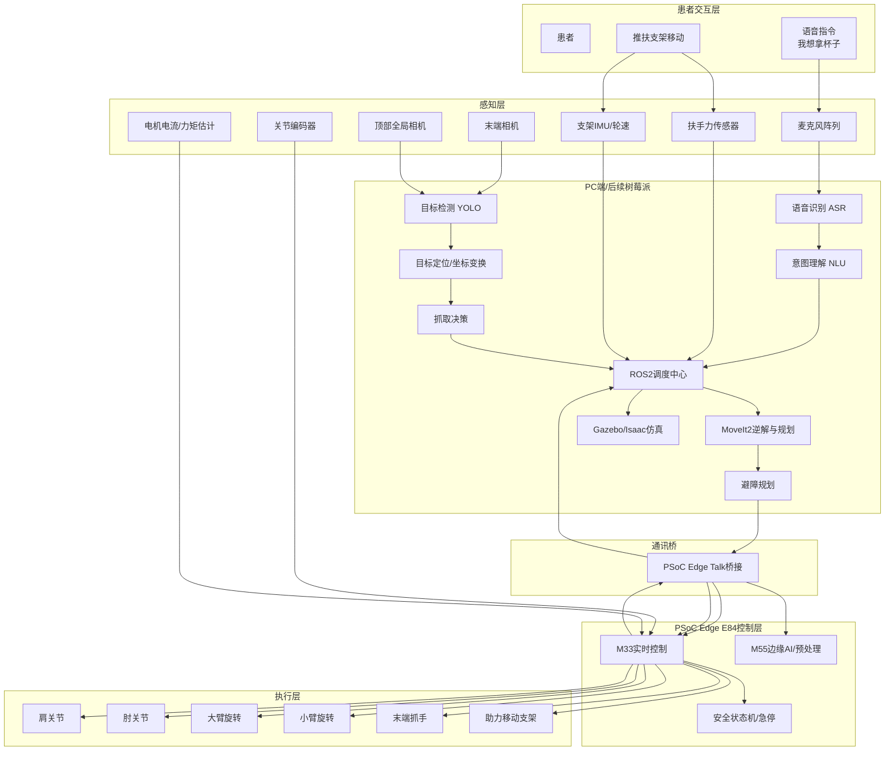

# PSoC Edge E84 康复机械臂系统 - 完整开发计划

## 一、项目概述

### 1.1 项目目标
开发一套基于PSoC Edge E84的医疗康复机械臂控制系统，实现患者上肢康复训练的智能辅助。系统集成移动支架、视觉识别、ROS2运动学控制，实现精准抓取和智能辅助功能。

### 1.2 系统升级计划（2026年3月）

#### 升级目标
将现有康复机械臂升级为具备视觉识别和精准抓取能力的智能辅助系统，支持患者日常生活辅助。

#### 新增硬件
1. **大臂旋转电机** - 控制大臂水平旋转运动
2. **小臂旋转电机** - 控制小臂水平旋转运动
3. **视觉系统** - 1-2个摄像头，用于物体识别和定位
4. **移动支架系统**:
   - 可移动支架底座（带轮子和锁定机构）
   - 力传感器（检测患者推动意图）
   - 电动助力系统（减轻患者负重）
   - 支架控制器（意图识别和动力辅助）
5. **计算平台**:
   - 初期：PC端（开发和仿真）
   - 后期：树莓派（嵌入式部署）

#### 系统架构升级

```
┌─────────────────────────────────────────────────────────────────┐
│                    PC端/树莓派 (ROS2节点)                        │
│  ┌──────────────┐  ┌──────────────┐  ┌──────────────┐          │
│  │ 运动学逆解   │  │ 视觉识别     │  │ 避障算法     │          │
│  │ MoveIt2      │  │ OpenCV/YOLO  │  │ 路径规划     │          │
│  └──────────────┘  └──────────────┘  └──────────────┘          │
└────────┬──────────────────────┬──────────────────────────────────┘
         │                      │
         │ PSoC Edge Talk       │ USB/以太网
         │ (ROS2通讯桥接)       │
         │                      │
         ↓                      ↓
┌────────────────────────────────────────────────────────────────┐
│                      PSoC Edge E84                              │
│  ┌──────────────┐  ┌──────────────┐  ┌──────────────┐         │
│  │ M33核心      │  │ M55核心      │  │ 支架控制     │         │
│  │ - 电机控制   │  │ - AI推理     │  │ - 意图识别   │         │
│  │ - CAN总线    │  │ - 视觉预处理 │  │ - 助力控制   │         │
│  └──────────────┘  └──────────────┘  └──────────────┘         │
└────────┬────────────────────────────────────────────────────────┘
         │ CAN总线
         │
    ┌────┴────┬────────┬────────┬────────┬────────┬──────────┐
    │         │        │        │        │        │          │
┌───▼────┐ ┌─▼──────┐ ┌▼──────┐ ┌▼──────┐ ┌▼─────┐ ┌▼────────┐
│ 肩抬升 │ │ 肘抬升 │ │ 肩张开│ │大臂旋转│ │小臂旋转│ │传感器节点│
│ 0x100  │ │ 0x101  │ │ 0x102 │ │ 0x103  │ │ 0x104  │ │ 0x300   │
└────────┘ └────────┘ └───────┘ └────────┘ └────────┘ └─────────┘
```

### 1.3 硬件组成（升级后）
- **主控板**: 英飞凌PSoC Edge E84 (Edgi-Talk开发板)
  - Cortex-M33核心 (主控制核)
  - Cortex-M55核心 (AI推理核)
- **执行机构**:
  - 伺服电机1: 肩关节纵向抬升 (CAN ID: 0x100)
  - 伺服电机2: 肘关节纵向抬升 (CAN ID: 0x101)
  - 推杆电机: 肩关节横向张开 (CAN ID: 0x102)
  - **伺服电机3: 大臂旋转 (CAN ID: 0x103)** ⭐新增
  - **伺服电机4: 小臂旋转 (CAN ID: 0x104)** ⭐新增
- **视觉系统** ⭐新增:
  - 摄像头1: 固定在机械臂末端（手部视角）
  - 摄像头2: 固定在支架顶部（全局视角，可选）
  - 连接方式: USB/CSI接口到PC/树莓派
- **移动支架系统** ⭐新增:
  - 支架底座（带万向轮和电磁锁）
  - 力传感器（4个，分布在扶手位置）
  - 电动助力电机（2个，驱动后轮）
  - 支架控制器（STM32/ESP32，CAN ID: 0x400）
- **传感器节点** (STM32C8T6, CAN ID: 0x300):
  - MSG肌电传感器 (EMG) - 2通道
  - 心率传感器 (MAX30102)
  - 六轴IMU传感器 (MPU6050: 3轴加速度 + 3轴陀螺仪)
- **电机内置传感器**:
  - 角度传感器（编码器）
  - 阻尼/扭矩传感器
- **通讯**:
  - CAN总线（PSoC ↔ 电机/传感器）
  - PSoC Edge Talk（PSoC ↔ PC/树莓派）
  - USB/以太网（PC/树莓派 ↔ 摄像头）

### 1.3 系统架构

```
┌─────────────────────────────────────────────────────────────────┐
│                      Android App (手机端)                        │
│  ┌──────────────┐  ┌──────────────┐  ┌──────────────┐          │
│  │ 患者管理     │  │ 实时控制     │  │ 康复评估     │          │
│  │ 训练记录     │  │ 数据可视化   │  │ PDF导出      │          │
│  └──────────────┘  └──────────────┘  └──────────────┘          │
└────────┬──────────────────────┬──────────────────────────────────┘
         │                      │
         │ ①蓝牙SPP (实时控制)  │ ②HTTP (OpenClaw已配置)
         │   - 快速响应         │   - 自然语言控制
         │   - 传感器数据流     │   - 复杂指令
         │                      │
         ↓                      ↓
┌────────────────────┐   ┌─────────────────────────────────────┐
│   PSoC Edge E84    │   │         OpenClaw Gateway            │
│                    │   │  (PC端运行，已有连接代码)           │
│  ┌──────────────┐  │   │                                     │
│  │ M33核心      │  │   │  ③HTTP桥接 (PSoC ↔ OpenClaw)       │
│  │ - CAN驱动    │◄─┼───┤  - 转发App的自然语言指令           │
│  │ - 蓝牙SPP    │  │   │  - 返回执行结果                     │
│  │ - HTTP服务器 │  │   │  - AI康复建议推送                   │
│  │ - 控制逻辑   │  │   └─────────────────────────────────────┘
│  │ - 传感器管理 │  │
│  └──────┬───────┘  │
│         │          │
│  ┌──────▼───────┐  │
│  │ M55核心      │  │
│  │ - AI推理引擎 │  │
│  │ - EMG预测    │  │
│  │ - 康复评估   │  │
│  └──────────────┘  │
└────────┬────────────┘
         │ CAN总线 (500kbps)
         │
    ┌────┴────┬────────┬────────┬────────────┐
    │         │        │        │            │
┌───▼────┐ ┌─▼──────┐ ┌▼──────┐ ┌▼──────┐ ┌─▼────────────────┐
│ 肩关节 │ │ 肘关节 │ │ 推杆  │ │ 电机  │ │ STM32C8T6        │
│ 伺服   │ │ 伺服   │ │ 电机  │ │ 反馈  │ │ 传感器节点       │
│ 0x100  │ │ 0x101  │ │ 0x102 │ │0x200-2│ │ 0x300-0x310      │
└────────┘ └────────┘ └───────┘ └───────┘ │                  │
                                           │ ┌──────────────┐ │
                                           │ │ MSG EMG      │ │
                                           │ │ 2通道 (ADC)  │ │
                                           │ └──────────────┘ │
                                           │ ┌──────────────┐ │
                                           │ │ 心率传感器   │ │
                                           │ │ MAX30102(I2C)│ │
                                           │ └──────────────┘ │
                                           │ ┌──────────────┐ │
                                           │ │ 六轴IMU      │ │
                                           │ │ MPU6050(I2C) │ │
                                           │ └──────────────┘ │
                                           └──────────────────┘
```

### 1.4 三者互通架构设计

#### 通讯方式选择

**①蓝牙SPP (App ↔ PSoC)** - 实时控制通道
- **用途**: 快速响应的实时控制和数据流
- **优势**: 低延迟(~10ms)、无需网络、点对点连接
- **数据流**:
  - App → PSoC: 关节控制指令、模式切换、紧急停止
  - PSoC → App: 传感器数据流(100Hz)、状态更新、告警信息

**②HTTP (App ↔ OpenClaw)** - 智能控制通道
- **用途**: 自然语言控制、复杂指令、AI建议
- **优势**: App已有OpenClaw连接代码，无需改动
- **数据流**:
  - App → OpenClaw: 自然语言指令("抬起手臂到90度")
  - OpenClaw → App: 执行结果、AI康复建议

**③HTTP桥接 (OpenClaw ↔ PSoC)** - 工具调用通道
- **用途**: OpenClaw调用PSoC的工具函数
- **实现**: PSoC提供HTTP REST API，OpenClaw通过工具调用
- **数据流**:
  - OpenClaw → PSoC: 工具调用(move_joint, set_mode等)
  - PSoC → OpenClaw: 执行结果、传感器数据

#### 三者协同工作流程

**场景1: 简单实时控制 (蓝牙直连)**
```
用户点击"抬起肩关节" → App通过蓝牙发送指令 → PSoC执行 → 实时反馈
优势: 最快响应，适合手动控制
```

**场景2: 自然语言控制 (OpenClaw桥接)**
```
用户说"帮我做一组康复训练"
  ↓
App发送到OpenClaw (HTTP，已有代码)
  ↓
OpenClaw理解意图，生成训练计划
  ↓
OpenClaw调用PSoC工具 (HTTP桥接)
  - set_mode("memory")
  - execute_memory(training_plan_id)
  ↓
PSoC执行训练
  ↓
传感器数据通过蓝牙实时返回App显示
  ↓
训练结束后，OpenClaw生成康复评估
  ↓
评估结果返回App，保存到数据库
```

**场景3: AI辅助训练 (三者协同)**
```
1. 用户在App启动"AI助力模式"
2. App通过蓝牙设置PSoC为主动模式
3. 患者开始运动，PSoC采集EMG信号
4. M55核心实时AI推理，预测运动意图
5. PSoC根据预测调整电机阻尼
6. 传感器数据通过蓝牙流式传输到App显示
7. 训练结束，App请求OpenClaw生成康复评估
8. OpenClaw调用PSoC获取历史数据
9. OpenClaw生成评估报告返回App
10. App保存到数据库并生成PDF
```

#### 数据流向图

```
┌─────────────────────────────────────────────────────────────┐
│                        Android App                          │
│  ┌──────────────┐  ┌──────────────┐  ┌──────────────┐      │
│  │ 实时控制UI   │  │ 自然语言输入 │  │ 数据可视化   │      │
│  │ (蓝牙)       │  │ (OpenClaw)   │  │ (蓝牙+HTTP)  │      │
│  └──────┬───────┘  └──────┬───────┘  └──────▲───────┘      │
└─────────┼──────────────────┼──────────────────┼─────────────┘
          │                  │                  │
    ①蓝牙SPP          ②HTTP(已有)        ③数据回传
    快速指令          自然语言            实时+评估
          │                  │                  │
          ↓                  ↓                  │
┌─────────────────┐   ┌──────────────────────────────┐
│  PSoC Edge E84  │   │    OpenClaw Gateway          │
│                 │   │                              │
│  ④HTTP工具调用  │◄──┤  - 理解自然语言              │
│  /api/command   │   │  - 生成训练计划              │
│  /api/sensors   │───┤  - 调用PSoC工具              │
│  /api/status    │   │  - 生成康复评估              │
│                 │   └──────────────────────────────┘
│  ⑤实时数据流    │
│  传感器→蓝牙    │
└─────────────────┘
```

#### App端实现建议 (保留OpenClaw连接代码)

**通讯管理器设计**:
```kotlin
class CommunicationManager(context: Context) {
    // 已有的OpenClaw连接 (不改动)
    private val openClawApi: OpenClawApiService = /* 现有代码 */

    // 新增蓝牙管理器
    private val bluetoothManager = BluetoothManager(context)

    // 智能路由: 根据指令类型选择通道
    suspend fun sendCommand(command: Command): Result<Response> {
        return when (command.type) {
            CommandType.REALTIME_CONTROL -> {
                // 简单控制 → 蓝牙直连
                bluetoothManager.sendCommand(command)
            }
            CommandType.NATURAL_LANGUAGE -> {
                // 自然语言 → OpenClaw (已有代码)
                openClawApi.sendNaturalLanguage(command.text)
            }
            CommandType.COMPLEX_TASK -> {
                // 复杂任务 → OpenClaw处理
                openClawApi.executeTask(command)
            }
        }
    }

    // 实时数据流 (蓝牙)
    fun startSensorDataStream(onData: (SensorData) -> Unit) {
        bluetoothManager.startListening { bytes ->
            val data = parseSensorData(bytes)
            onData(data)
        }
    }

    // 获取康复评估 (OpenClaw)
    suspend fun getRehabAssessment(sessionId: String): RehabAssessment {
        return openClawApi.getRehabAnalysis(sessionId)
    }
}
```

**使用示例**:
```kotlin
// 场景1: 用户点击按钮控制
viewModel.moveJoint(JointType.SHOULDER, 90f) {
    // 自动选择蓝牙通道，快速响应
    communicationManager.sendCommand(
        Command(CommandType.REALTIME_CONTROL, "move_shoulder", 90f)
    )
}

// 场景2: 用户输入自然语言
viewModel.processNaturalLanguage("帮我做一组肩关节训练") {
    // 自动选择OpenClaw通道 (已有代码)
    communicationManager.sendCommand(
        Command(CommandType.NATURAL_LANGUAGE, text = input)
    )
}

// 场景3: 实时数据显示
communicationManager.startSensorDataStream { data ->
    // 蓝牙接收高频数据流
    viewModel.updateSensorData(data)
}
```

---

## 高级功能扩展

### 功能1: AI语音助手 (集成Whisper + TTS)

**实现方案**:
```kotlin
class VoiceAssistant(context: Context) {
    private val whisperModel = WhisperModel.load(context)  // 语音识别
    private val ttsEngine = TextToSpeech(context)          // 语音合成

    // 语音控制
    suspend fun processVoiceCommand(audioData: ByteArray): String {
        // 1. 语音转文字 (Whisper)
        val text = whisperModel.transcribe(audioData)

        // 2. 发送到OpenClaw处理
        val response = openClawApi.sendNaturalLanguage(text)

        // 3. 文字转语音播报
        ttsEngine.speak(response.message)

        return response.message
    }
}
```

**用户体验**:
- 患者说："帮我抬起手臂"
- App识别并执行，语音反馈："好的，正在抬起手臂到90度"
- 适合行动不便的患者

### 功能2: 3D可视化机械臂 (OpenGL ES)

**实现方案**:
```kotlin
@Composable
fun RobotArmVisualization(
    shoulderAngle: Float,
    elbowAngle: Float,
    lateralPosition: Float
) {
    AndroidView(
        factory = { context ->
            GLSurfaceView(context).apply {
                setEGLContextClientVersion(3)
                setRenderer(RobotArmRenderer(
                    shoulderAngle, elbowAngle, lateralPosition
                ))
            }
        },
        update = { view ->
            (view.renderer as RobotArmRenderer).updateAngles(
                shoulderAngle, elbowAngle, lateralPosition
            )
        }
    )
}

class RobotArmRenderer : GLSurfaceView.Renderer {
    // 3D模型渲染
    // - 肩关节骨骼
    // - 肘关节骨骼
    // - 实时角度动画
    // - 运动轨迹显示
}
```

**用户体验**:
- 实时3D显示机械臂姿态
- 运动轨迹可视化
- 目标位置预览
- 碰撞检测提示

### 功能3: 游戏化康复训练

**实现方案**:
```kotlin
// 康复游戏: 水果忍者式训练
class RehabGame {
    data class Target(
        val angle: Float,      // 目标角度
        val position: Point,   // 屏幕位置
        val score: Int         // 分数
    )

    fun generateTargets(): List<Target> {
        // 根据患者ROM生成合适的目标
        return listOf(
            Target(45f, Point(100, 200), 10),
            Target(90f, Point(200, 300), 20),
            Target(135f, Point(300, 400), 30)
        )
    }

    fun checkHit(currentAngle: Float, target: Target): Boolean {
        return abs(currentAngle - target.angle) < 5f
    }
}

@Composable
fun RehabGameScreen(viewModel: RehabGameViewModel) {
    val targets by viewModel.targets.collectAsState()
    val currentAngle by viewModel.sensorData.collectAsState()
    val score by viewModel.score.collectAsState()

    Box(modifier = Modifier.fillMaxSize()) {
        // 显示目标
        targets.forEach { target ->
            TargetCircle(
                position = target.position,
                isHit = viewModel.checkHit(currentAngle, target)
            )
        }

        // 显示分数
        Text("分数: $score", style = MaterialTheme.typography.headlineLarge)

        // 显示当前角度指示器
        AngleIndicator(currentAngle)
    }
}
```

**游戏类型**:
- 水果忍者：移动手臂"切"目标
- 打地鼠：快速移动到目标位置
- 节奏大师：跟随音乐节奏运动
- 飞行模拟：控制飞机飞行

### 功能4: 社交与竞技系统

**实现方案**:
```kotlin
// 云端排行榜
@Entity(tableName = "leaderboard")
data class LeaderboardEntry(
    @PrimaryKey val id: String,
    val patientName: String,
    val score: Int,
    val duration: Long,
    val date: Long
)

// Firebase集成
class SocialManager {
    private val firestore = FirebaseFirestore.getInstance()

    // 上传成绩
    suspend fun uploadScore(entry: LeaderboardEntry) {
        firestore.collection("leaderboard")
            .document(entry.id)
            .set(entry)
    }

    // 获取排行榜
    suspend fun getLeaderboard(limit: Int = 10): List<LeaderboardEntry> {
        return firestore.collection("leaderboard")
            .orderBy("score", Query.Direction.DESCENDING)
            .limit(limit.toLong())
            .get()
            .await()
            .toObjects(LeaderboardEntry::class.java)
    }

    // 好友挑战
    suspend fun sendChallenge(friendId: String, gameType: String) {
        firestore.collection("challenges")
            .add(mapOf(
                "from" to currentUserId,
                "to" to friendId,
                "gameType" to gameType,
                "timestamp" to System.currentTimeMillis()
            ))
    }
}
```

**社交功能**:
- 全球排行榜
- 好友系统
- 挑战赛
- 成就徽章
- 训练打卡分享

### 功能5: AR增强现实训练

**实现方案** (使用ARCore):
```kotlin
class ARRehabTraining(context: Context) {
    private val arSession = Session(context)

    @Composable
    fun ARTrainingScreen() {
        ARSceneView(
            modifier = Modifier.fillMaxSize(),
            onSessionCreate = { session ->
                // 放置虚拟目标物体
                placeVirtualTargets(session)
            },
            onFrame = { frame ->
                // 检测手臂位置
                val handPosition = detectHandPosition(frame)

                // 检查是否触碰虚拟物体
                checkCollision(handPosition)
            }
        )
    }

    fun placeVirtualTargets(session: Session) {
        // 在空间中放置虚拟球体
        val anchor = session.createAnchor(Pose.makeTranslation(0f, 1.5f, -2f))
        // 渲染虚拟物体
    }
}
```

**AR训练场景**:
- 虚拟接球：在空间中接虚拟球
- 虚拟绘画：用手臂在空中画图
- 虚拟货架：从虚拟货架取物品
- 空间导航：跟随虚拟路径运动

### 功能6: 智能训练计划生成

**实现方案** (结合OpenClaw AI):
```kotlin
class TrainingPlanGenerator {
    // 基于患者数据生成个性化计划
    suspend fun generatePlan(patient: Patient, history: List<TrainingSession>): TrainingPlan {
        // 1. 分析历史数据
        val analysis = analyzeHistory(history)

        // 2. 请求OpenClaw生成计划
        val prompt = """
            患者信息:
            - 年龄: ${patient.age}
            - 诊断: ${patient.diagnosis}
            - 当前ROM: ${analysis.currentROM}
            - 力量水平: ${analysis.strengthLevel}

            请生成一个为期4周的康复训练计划，包括:
            1. 每周训练频率
            2. 每次训练时长
            3. 具体训练动作和参数
            4. 进度评估标准
        """.trimIndent()

        val response = openClawApi.generateTrainingPlan(prompt)

        // 3. 解析并保存计划
        return parseTrainingPlan(response)
    }
}

data class TrainingPlan(
    val id: String,
    val patientId: String,
    val weeks: List<WeekPlan>,
    val goals: List<String>
)

data class WeekPlan(
    val weekNumber: Int,
    val frequency: Int,           // 每周次数
    val duration: Int,            // 每次时长(分钟)
    val exercises: List<Exercise>
)

data class Exercise(
    val name: String,
    val targetAngle: Float,
    val repetitions: Int,
    val restTime: Int,
    val difficulty: String
)
```

**智能功能**:
- 自动生成4-12周训练计划
- 根据进度动态调整难度
- 预测康复时间
- 提供替代方案

### 功能7: 远程医生监控平台

**实现方案**:
```kotlin
// 医生端Web Dashboard (可选)
class DoctorDashboard {
    // 实时监控多个患者
    @Composable
    fun PatientMonitoringGrid() {
        LazyVerticalGrid(columns = GridCells.Fixed(2)) {
            items(patients) { patient ->
                PatientMonitorCard(
                    patient = patient,
                    liveData = getLiveData(patient.id),
                    onClick = { showDetailView(patient) }
                )
            }
        }
    }

    // 远程干预
    suspend fun sendRemoteCommand(patientId: String, command: String) {
        // 通过Firebase推送到患者App
        firebaseMessaging.send(
            Message(
                to = patientId,
                data = mapOf("command" to command)
            )
        )
    }
}

// 患者端接收
class RemoteCommandReceiver : FirebaseMessagingService() {
    override fun onMessageReceived(message: RemoteMessage) {
        val command = message.data["command"]
        // 执行医生的远程指令
        communicationManager.sendCommand(parseCommand(command))
    }
}
```

**医生功能**:
- 实时查看患者训练状态
- 远程调整训练参数
- 发送鼓励消息
- 异常情况告警
- 批量管理患者

### 功能8: 数据分析与预测

**实现方案**:
```kotlin
class AdvancedAnalytics {
    // 康复进度预测
    suspend fun predictRecoveryTime(patientId: String): PredictionResult {
        val history = repository.getTrainingHistory(patientId)

        // 使用线性回归预测
        val model = LinearRegression()
        val features = history.map {
            arrayOf(it.duration.toDouble(), it.maxAngle.toDouble())
        }
        val labels = history.map { it.overallScore.toDouble() }

        model.fit(features, labels)

        // 预测达到80分需要的时间
        val daysToTarget = model.predictDaysToScore(80.0)

        return PredictionResult(
            estimatedDays = daysToTarget,
            confidence = model.confidence,
            recommendation = generateRecommendation(daysToTarget)
        )
    }

    // 异常检测
    fun detectAnomalies(sensorData: List<SensorRecord>): List<Anomaly> {
        val anomalies = mutableListOf<Anomaly>()

        // 检测心率异常
        sensorData.forEach { record ->
            if (record.heartRate > 120 || record.heartRate < 50) {
                anomalies.add(Anomaly(
                    type = "心率异常",
                    value = record.heartRate,
                    timestamp = record.timestamp,
                    severity = "高"
                ))
            }
        }

        // 检测运动异常 (突然停止、抖动等)
        // ...

        return anomalies
    }

    // 对比分析
    fun compareWithPeers(patient: Patient): ComparisonResult {
        // 与同年龄、同诊断的患者对比
        val peers = repository.getPeerPatients(patient.age, patient.diagnosis)
        val avgScore = peers.map { it.latestScore }.average()

        return ComparisonResult(
            patientScore = patient.latestScore,
            peerAverage = avgScore,
            percentile = calculatePercentile(patient.latestScore, peers)
        )
    }
}
```

**分析功能**:
- 康复时间预测
- 异常行为检测
- 同龄对比分析
- 训练效果评估
- 最佳训练时间推荐

### 功能9: 多语言与无障碍支持

**实现方案**:
```kotlin
// 多语言支持
class LocalizationManager {
    fun getSupportedLanguages() = listOf(
        "zh-CN" to "简体中文",
        "zh-TW" to "繁体中文",
        "en-US" to "English",
        "ja-JP" to "日本語",
        "ko-KR" to "한국어"
    )
}

// 无障碍功能
@Composable
fun AccessibleButton(
    text: String,
    onClick: () -> Unit
) {
    Button(
        onClick = onClick,
        modifier = Modifier
            .semantics {
                contentDescription = text
                role = Role.Button
            }
            .minimumInteractiveComponentSize()  // 确保触摸区域足够大
    ) {
        Text(
            text = text,
            fontSize = 18.sp,  // 大字体
            fontWeight = FontWeight.Bold
        )
    }
}

// 高对比度模式
@Composable
fun HighContrastTheme(content: @Composable () -> Unit) {
    MaterialTheme(
        colorScheme = darkColorScheme(
            primary = Color.Yellow,
            onPrimary = Color.Black,
            background = Color.Black,
            onBackground = Color.White
        ),
        content = content
    )
}
```

**无障碍功能**:
- TalkBack屏幕阅读器支持
- 大字体模式
- 高对比度主题
- 语音控制
- 单手操作模式

### 功能10: 离线模式与数据同步

**实现方案**:
```kotlin
class OfflineManager {
    private val workManager = WorkManager.getInstance(context)

    // 离线数据缓存
    suspend fun cacheTrainingData(session: TrainingSession) {
        localDatabase.insertSession(session)

        // 标记为待同步
        localDatabase.markForSync(session.id)
    }

    // 自动同步
    fun scheduleSync() {
        val syncWork = PeriodicWorkRequestBuilder<SyncWorker>(
            repeatInterval = 15,
            repeatIntervalTimeUnit = TimeUnit.MINUTES
        )
            .setConstraints(
                Constraints.Builder()
                    .setRequiredNetworkType(NetworkType.CONNECTED)
                    .build()
            )
            .build()

        workManager.enqueue(syncWork)
    }
}

class SyncWorker(context: Context, params: WorkerParameters) : CoroutineWorker(context, params) {
    override suspend fun doWork(): Result {
        // 获取待同步数据
        val pendingData = localDatabase.getPendingSync()

        // 上传到云端
        pendingData.forEach { data ->
            try {
                cloudApi.upload(data)
                localDatabase.markSynced(data.id)
            } catch (e: Exception) {
                // 稍后重试
            }
        }

        return Result.success()
    }
}
```

**离线功能**:
- 无网络时正常训练
- 本地数据缓存
- 自动后台同步
- 冲突解决机制

### 功能11: 用户登录与认证系统

**实现方案**:

#### 数据库设计

```kotlin
@Entity(tableName = "users")
data class User(
    @PrimaryKey val id: String = UUID.randomUUID().toString(),
    val username: String,
    val password: String,           // 加密存储
    val email: String,
    val phoneNumber: String?,
    val role: String,               // patient/doctor/therapist/family
    val avatarUrl: String?,
    val createdAt: Long = System.currentTimeMillis(),
    val lastLoginAt: Long = 0,
    val isActive: Boolean = true
)

@Entity(tableName = "user_profiles")
data class UserProfile(
    @PrimaryKey val userId: String,
    val displayName: String,
    val age: Int,
    val gender: String,
    val diagnosis: String?,         // 仅患者
    val hospitalId: String?,        // 所属医院
    val doctorId: String?,          // 主治医生
    val level: Int = 1,             // 用户等级
    val experience: Int = 0,        // 经验值
    val totalTrainingSessions: Int = 0,
    val totalTrainingTime: Long = 0,
    val achievements: String = ""   // JSON数组
)

@Dao
interface UserDao {
    @Query("SELECT * FROM users WHERE username = :username AND password = :password")
    suspend fun login(username: String, password: String): User?

    @Query("SELECT * FROM users WHERE email = :email")
    suspend fun findByEmail(email: String): User?

    @Insert(onConflict = OnConflictStrategy.REPLACE)
    suspend fun register(user: User)

    @Update
    suspend fun updateUser(user: User)

    @Query("UPDATE users SET lastLoginAt = :timestamp WHERE id = :userId")
    suspend fun updateLastLogin(userId: String, timestamp: Long)
}
```

#### 登录界面

```kotlin
@Composable
fun LoginScreen(
    navController: NavController,
    viewModel: AuthViewModel
) {
    var username by remember { mutableStateOf("") }
    var password by remember { mutableStateOf("") }
    var passwordVisible by remember { mutableStateOf(false) }
    val loginState by viewModel.loginState.collectAsState()

    Box(
        modifier = Modifier
            .fillMaxSize()
            .background(
                brush = Brush.verticalGradient(
                    colors = listOf(
                        Color(0xFF6200EE),
                        Color(0xFF3700B3)
                    )
                )
            )
    ) {
        Column(
            modifier = Modifier
                .fillMaxSize()
                .padding(32.dp),
            horizontalAlignment = Alignment.CenterHorizontally,
            verticalArrangement = Arrangement.Center
        ) {
            // Logo
            Image(
                painter = painterResource(R.drawable.app_logo),
                contentDescription = "App Logo",
                modifier = Modifier.size(120.dp)
            )

            Spacer(modifier = Modifier.height(16.dp))

            Text(
                text = "康复机械臂训练系统",
                style = MaterialTheme.typography.headlineMedium,
                color = Color.White
            )

            Spacer(modifier = Modifier.height(48.dp))

            // 用户名输入
            OutlinedTextField(
                value = username,
                onValueChange = { username = it },
                label = { Text("用户名/邮箱") },
                leadingIcon = {
                    Icon(Icons.Default.Person, contentDescription = null)
                },
                modifier = Modifier.fillMaxWidth(),
                colors = TextFieldDefaults.outlinedTextFieldColors(
                    textColor = Color.White,
                    focusedBorderColor = Color.White,
                    unfocusedBorderColor = Color.White.copy(alpha = 0.5f)
                )
            )

            Spacer(modifier = Modifier.height(16.dp))

            // 密码输入
            OutlinedTextField(
                value = password,
                onValueChange = { password = it },
                label = { Text("密码") },
                leadingIcon = {
                    Icon(Icons.Default.Lock, contentDescription = null)
                },
                trailingIcon = {
                    IconButton(onClick = { passwordVisible = !passwordVisible }) {
                        Icon(
                            if (passwordVisible) Icons.Default.Visibility
                            else Icons.Default.VisibilityOff,
                            contentDescription = null
                        )
                    }
                },
                visualTransformation = if (passwordVisible)
                    VisualTransformation.None
                else
                    PasswordVisualTransformation(),
                modifier = Modifier.fillMaxWidth(),
                colors = TextFieldDefaults.outlinedTextFieldColors(
                    textColor = Color.White,
                    focusedBorderColor = Color.White,
                    unfocusedBorderColor = Color.White.copy(alpha = 0.5f)
                )
            )

            Spacer(modifier = Modifier.height(8.dp))

            // 忘记密码
            Text(
                text = "忘记密码?",
                color = Color.White,
                modifier = Modifier
                    .align(Alignment.End)
                    .clickable { navController.navigate("forgot_password") }
            )

            Spacer(modifier = Modifier.height(32.dp))

            // 登录按钮
            Button(
                onClick = {
                    viewModel.login(username, password)
                },
                modifier = Modifier
                    .fillMaxWidth()
                    .height(56.dp),
                colors = ButtonDefaults.buttonColors(
                    containerColor = Color.White,
                    contentColor = Color(0xFF6200EE)
                )
            ) {
                if (loginState is LoginState.Loading) {
                    CircularProgressIndicator(
                        modifier = Modifier.size(24.dp),
                        color = Color(0xFF6200EE)
                    )
                } else {
                    Text("登录", fontSize = 18.sp, fontWeight = FontWeight.Bold)
                }
            }

            Spacer(modifier = Modifier.height(16.dp))

            // 注册按钮
            OutlinedButton(
                onClick = { navController.navigate("register") },
                modifier = Modifier
                    .fillMaxWidth()
                    .height(56.dp),
                colors = ButtonDefaults.outlinedButtonColors(
                    contentColor = Color.White
                ),
                border = BorderStroke(1.dp, Color.White)
            ) {
                Text("注册新账号", fontSize = 18.sp)
            }

            Spacer(modifier = Modifier.height(32.dp))

            // 第三方登录
            Text("或使用以下方式登录", color = Color.White.copy(alpha = 0.7f))

            Spacer(modifier = Modifier.height(16.dp))

            Row(
                horizontalArrangement = Arrangement.spacedBy(16.dp)
            ) {
                // 微信登录
                IconButton(
                    onClick = { viewModel.loginWithWechat() },
                    modifier = Modifier
                        .size(56.dp)
                        .background(Color.White, CircleShape)
                ) {
                    Icon(
                        painter = painterResource(R.drawable.ic_wechat),
                        contentDescription = "微信登录",
                        tint = Color(0xFF07C160)
                    )
                }

                // QQ登录
                IconButton(
                    onClick = { viewModel.loginWithQQ() },
                    modifier = Modifier
                        .size(56.dp)
                        .background(Color.White, CircleShape)
                ) {
                    Icon(
                        painter = painterResource(R.drawable.ic_qq),
                        contentDescription = "QQ登录",
                        tint = Color(0xFF12B7F5)
                    )
                }

                // 指纹登录
                IconButton(
                    onClick = { viewModel.loginWithBiometric() },
                    modifier = Modifier
                        .size(56.dp)
                        .background(Color.White, CircleShape)
                ) {
                    Icon(
                        Icons.Default.Fingerprint,
                        contentDescription = "指纹登录",
                        tint = Color(0xFF6200EE)
                    )
                }
            }
        }

        // 错误提示
        if (loginState is LoginState.Error) {
            Snackbar(
                modifier = Modifier
                    .align(Alignment.BottomCenter)
                    .padding(16.dp)
            ) {
                Text((loginState as LoginState.Error).message)
            }
        }
    }
}
```

#### 认证ViewModel

```kotlin
class AuthViewModel(
    private val userRepository: UserRepository,
    private val biometricManager: BiometricManager
) : ViewModel() {

    private val _loginState = MutableStateFlow<LoginState>(LoginState.Idle)
    val loginState: StateFlow<LoginState> = _loginState

    private val _currentUser = MutableStateFlow<User?>(null)
    val currentUser: StateFlow<User?> = _currentUser

    // 登录
    fun login(username: String, password: String) {
        viewModelScope.launch {
            _loginState.value = LoginState.Loading

            try {
                // 密码加密
                val hashedPassword = hashPassword(password)

                // 查询用户
                val user = userRepository.login(username, hashedPassword)

                if (user != null && user.isActive) {
                    // 更新最后登录时间
                    userRepository.updateLastLogin(user.id, System.currentTimeMillis())

                    // 保存登录状态
                    saveLoginSession(user)

                    _currentUser.value = user
                    _loginState.value = LoginState.Success(user)
                } else {
                    _loginState.value = LoginState.Error("用户名或密码错误")
                }
            } catch (e: Exception) {
                _loginState.value = LoginState.Error(e.message ?: "登录失败")
            }
        }
    }

    // 注册
    fun register(
        username: String,
        password: String,
        email: String,
        role: String
    ) {
        viewModelScope.launch {
            try {
                // 检查用户名是否存在
                val existing = userRepository.findByEmail(email)
                if (existing != null) {
                    _loginState.value = LoginState.Error("邮箱已被注册")
                    return@launch
                }

                // 创建用户
                val user = User(
                    username = username,
                    password = hashPassword(password),
                    email = email,
                    role = role
                )

                userRepository.register(user)

                // 创建用户资料
                val profile = UserProfile(
                    userId = user.id,
                    displayName = username,
                    age = 0,
                    gender = ""
                )
                userRepository.createProfile(profile)

                _loginState.value = LoginState.Success(user)
            } catch (e: Exception) {
                _loginState.value = LoginState.Error(e.message ?: "注册失败")
            }
        }
    }

    // 指纹登录
    fun loginWithBiometric() {
        biometricManager.authenticate(
            onSuccess = {
                // 从本地存储获取上次登录的用户
                viewModelScope.launch {
                    val lastUser = getLastLoginUser()
                    if (lastUser != null) {
                        _currentUser.value = lastUser
                        _loginState.value = LoginState.Success(lastUser)
                    }
                }
            },
            onError = { error ->
                _loginState.value = LoginState.Error(error)
            }
        )
    }

    // 密码加密
    private fun hashPassword(password: String): String {
        val md = MessageDigest.getInstance("SHA-256")
        val hash = md.digest(password.toByteArray())
        return hash.joinToString("") { "%02x".format(it) }
    }

    // 保存登录会话
    private fun saveLoginSession(user: User) {
        // 使用SharedPreferences或DataStore保存
        // 包含token、userId等信息
    }
}

sealed class LoginState {
    object Idle : LoginState()
    object Loading : LoginState()
    data class Success(val user: User) : LoginState()
    data class Error(val message: String) : LoginState()
}
```

### 功能12: 全球排行榜系统

**实现方案**:

#### 数据库设计

```kotlin
@Entity(tableName = "leaderboard_entries")
data class LeaderboardEntry(
    @PrimaryKey val id: String = UUID.randomUUID().toString(),
    val userId: String,
    val username: String,
    val avatarUrl: String?,
    val score: Int,                 // 综合分数
    val level: Int,                 // 等级
    val totalSessions: Int,         // 总训练次数
    val totalDuration: Long,        // 总时长(秒)
    val maxAngle: Float,            // 最大角度
    val bestGameScore: Int,         // 最高游戏分数
    val achievements: Int,          // 成就数量
    val rank: Int,                  // 排名
    val category: String,           // 分类 (global/weekly/monthly/friends)
    val timestamp: Long = System.currentTimeMillis()
)

@Dao
interface LeaderboardDao {
    @Query("SELECT * FROM leaderboard_entries WHERE category = :category ORDER BY rank ASC LIMIT :limit")
    fun getLeaderboard(category: String, limit: Int): Flow<List<LeaderboardEntry>>

    @Query("SELECT * FROM leaderboard_entries WHERE userId = :userId AND category = :category")
    suspend fun getUserRank(userId: String, category: String): LeaderboardEntry?

    @Insert(onConflict = OnConflictStrategy.REPLACE)
    suspend fun insertEntry(entry: LeaderboardEntry)

    @Query("DELETE FROM leaderboard_entries WHERE category = :category")
    suspend fun clearCategory(category: String)
}
```

#### 排行榜界面

```kotlin
@Composable
fun LeaderboardScreen(viewModel: LeaderboardViewModel) {
    var selectedTab by remember { mutableStateOf(0) }
    val tabs = listOf("全球", "本周", "本月", "好友")

    val leaderboard by viewModel.leaderboard.collectAsState()
    val myRank by viewModel.myRank.collectAsState()

    Column(modifier = Modifier.fillMaxSize()) {
        // 顶部标签
        TabRow(selectedTabIndex = selectedTab) {
            tabs.forEachIndexed { index, title ->
                Tab(
                    selected = selectedTab == index,
                    onClick = {
                        selectedTab = index
                        viewModel.loadLeaderboard(
                            when (index) {
                                0 -> "global"
                                1 -> "weekly"
                                2 -> "monthly"
                                else -> "friends"
                            }
                        )
                    },
                    text = { Text(title) }
                )
            }
        }

        // 我的排名卡片
        myRank?.let { rank ->
            Card(
                modifier = Modifier
                    .fillMaxWidth()
                    .padding(16.dp),
                colors = CardDefaults.cardColors(
                    containerColor = MaterialTheme.colorScheme.primaryContainer
                )
            ) {
                Row(
                    modifier = Modifier
                        .fillMaxWidth()
                        .padding(16.dp),
                    verticalAlignment = Alignment.CenterVertically
                ) {
                    // 排名
                    Text(
                        text = "#${rank.rank}",
                        style = MaterialTheme.typography.headlineLarge,
                        fontWeight = FontWeight.Bold
                    )

                    Spacer(modifier = Modifier.width(16.dp))

                    // 头像
                    AsyncImage(
                        model = rank.avatarUrl,
                        contentDescription = null,
                        modifier = Modifier
                            .size(48.dp)
                            .clip(CircleShape)
                    )

                    Spacer(modifier = Modifier.width(16.dp))

                    Column(modifier = Modifier.weight(1f)) {
                        Text(
                            text = rank.username,
                            style = MaterialTheme.typography.titleMedium,
                            fontWeight = FontWeight.Bold
                        )
                        Text(
                            text = "等级 ${rank.level} | 分数 ${rank.score}",
                            style = MaterialTheme.typography.bodyMedium
                        )
                    }
                }
            }
        }

        // 排行榜列表
        LazyColumn(
            modifier = Modifier.fillMaxSize(),
            contentPadding = PaddingValues(16.dp),
            verticalArrangement = Arrangement.spacedBy(8.dp)
        ) {
            itemsIndexed(leaderboard) { index, entry ->
                LeaderboardItem(
                    entry = entry,
                    isTopThree = index < 3,
                    onClick = { viewModel.showUserProfile(entry.userId) }
                )
            }
        }
    }
}

@Composable
fun LeaderboardItem(
    entry: LeaderboardEntry,
    isTopThree: Boolean,
    onClick: () -> Unit
) {
    Card(
        modifier = Modifier
            .fillMaxWidth()
            .clickable(onClick = onClick),
        elevation = CardDefaults.cardElevation(
            defaultElevation = if (isTopThree) 8.dp else 2.dp
        ),
        colors = CardDefaults.cardColors(
            containerColor = when (entry.rank) {
                1 -> Color(0xFFFFD700) // 金色
                2 -> Color(0xFFC0C0C0) // 银色
                3 -> Color(0xFFCD7F32) // 铜色
                else -> MaterialTheme.colorScheme.surface
            }
        )
    ) {
        Row(
            modifier = Modifier
                .fillMaxWidth()
                .padding(16.dp),
            verticalAlignment = Alignment.CenterVertically
        ) {
            // 排名徽章
            Box(
                modifier = Modifier.size(48.dp),
                contentAlignment = Alignment.Center
            ) {
                if (isTopThree) {
                    Icon(
                        painter = painterResource(
                            when (entry.rank) {
                                1 -> R.drawable.ic_trophy_gold
                                2 -> R.drawable.ic_trophy_silver
                                else -> R.drawable.ic_trophy_bronze
                            }
                        ),
                        contentDescription = null,
                        modifier = Modifier.size(40.dp),
                        tint = Color.Unspecified
                    )
                } else {
                    Text(
                        text = "#${entry.rank}",
                        style = MaterialTheme.typography.titleLarge,
                        fontWeight = FontWeight.Bold
                    )
                }
            }

            Spacer(modifier = Modifier.width(16.dp))

            // 头像
            AsyncImage(
                model = entry.avatarUrl,
                contentDescription = null,
                modifier = Modifier
                    .size(56.dp)
                    .clip(CircleShape)
                    .border(2.dp, MaterialTheme.colorScheme.primary, CircleShape)
            )

            Spacer(modifier = Modifier.width(16.dp))

            // 用户信息
            Column(modifier = Modifier.weight(1f)) {
                Text(
                    text = entry.username,
                    style = MaterialTheme.typography.titleMedium,
                    fontWeight = FontWeight.Bold
                )
                Row(
                    horizontalArrangement = Arrangement.spacedBy(8.dp)
                ) {
                    // 等级
                    Chip(text = "Lv.${entry.level}")
                    // 成就
                    Chip(text = "${entry.achievements}个成就")
                }
                Text(
                    text = "训练${entry.totalSessions}次 | ${entry.totalDuration / 3600}小时",
                    style = MaterialTheme.typography.bodySmall,
                    color = MaterialTheme.colorScheme.onSurfaceVariant
                )
            }

            // 分数
            Column(horizontalAlignment = Alignment.End) {
                Text(
                    text = "${entry.score}",
                    style = MaterialTheme.typography.headlineSmall,
                    fontWeight = FontWeight.Bold,
                    color = MaterialTheme.colorScheme.primary
                )
                Text(
                    text = "分数",
                    style = MaterialTheme.typography.bodySmall
                )
            }
        }
    }
}

@Composable
fun Chip(text: String) {
    Surface(
        shape = RoundedCornerShape(12.dp),
        color = MaterialTheme.colorScheme.secondaryContainer
    ) {
        Text(
            text = text,
            modifier = Modifier.padding(horizontal = 8.dp, vertical = 4.dp),
            style = MaterialTheme.typography.labelSmall
        )
    }
}
```

#### 排行榜ViewModel

```kotlin
class LeaderboardViewModel(
    private val leaderboardRepository: LeaderboardRepository,
    private val authRepository: AuthRepository
) : ViewModel() {

    private val _leaderboard = MutableStateFlow<List<LeaderboardEntry>>(emptyList())
    val leaderboard: StateFlow<List<LeaderboardEntry>> = _leaderboard

    private val _myRank = MutableStateFlow<LeaderboardEntry?>(null)
    val myRank: StateFlow<LeaderboardEntry?> = _myRank

    // 加载排行榜
    fun loadLeaderboard(category: String) {
        viewModelScope.launch {
            try {
                // 从云端获取
                val entries = leaderboardRepository.fetchLeaderboard(category, limit = 100)
                _leaderboard.value = entries

                // 获取我的排名
                val currentUser = authRepository.getCurrentUser()
                if (currentUser != null) {
                    val myEntry = leaderboardRepository.getUserRank(currentUser.id, category)
                    _myRank.value = myEntry
                }
            } catch (e: Exception) {
                Log.e("Leaderboard", "Failed to load leaderboard", e)
            }
        }
    }

    // 更新我的分数
    fun updateMyScore() {
        viewModelScope.launch {
            val currentUser = authRepository.getCurrentUser() ?: return@launch
            val profile = authRepository.getUserProfile(currentUser.id) ?: return@launch

            // 计算综合分数
            val score = calculateScore(profile)

            // 上传到云端
            leaderboardRepository.uploadScore(
                LeaderboardEntry(
                    userId = currentUser.id,
                    username = profile.displayName,
                    avatarUrl = currentUser.avatarUrl,
                    score = score,
                    level = profile.level,
                    totalSessions = profile.totalTrainingSessions,
                    totalDuration = profile.totalTrainingTime,
                    achievements = countAchievements(profile.achievements),
                    rank = 0, // 服务器计算
                    category = "global"
                )
            )
        }
    }

    // 计算综合分数
    private fun calculateScore(profile: UserProfile): Int {
        return (profile.totalTrainingSessions * 10) +
               (profile.totalTrainingTime / 60).toInt() +
               (profile.level * 100) +
               (countAchievements(profile.achievements) * 50)
    }

    private fun countAchievements(achievementsJson: String): Int {
        // 解析JSON数组，统计成就数量
        return try {
            JSONArray(achievementsJson).length()
        } catch (e: Exception) {
            0
        }
    }
}
```

#### Firebase云端排行榜

```kotlin
class LeaderboardRepository(
    private val firestore: FirebaseFirestore,
    private val localDao: LeaderboardDao
) {
    // 获取排行榜
    suspend fun fetchLeaderboard(category: String, limit: Int): List<LeaderboardEntry> {
        return try {
            val snapshot = firestore.collection("leaderboard")
                .whereEqualTo("category", category)
                .orderBy("score", Query.Direction.DESCENDING)
                .limit(limit.toLong())
                .get()
                .await()

            val entries = snapshot.documents.mapIndexed { index, doc ->
                doc.toObject(LeaderboardEntry::class.java)!!.copy(rank = index + 1)
            }

            // 缓存到本地
            localDao.clearCategory(category)
            entries.forEach { localDao.insertEntry(it) }

            entries
        } catch (e: Exception) {
            // 网络失败，从本地加载
            localDao.getLeaderboard(category, limit).first()
        }
    }

    // 上传分数
    suspend fun uploadScore(entry: LeaderboardEntry) {
        firestore.collection("leaderboard")
            .document(entry.id)
            .set(entry)
            .await()
    }

    // 获取用户排名
    suspend fun getUserRank(userId: String, category: String): LeaderboardEntry? {
        return try {
            val doc = firestore.collection("leaderboard")
                .whereEqualTo("userId", userId)
                .whereEqualTo("category", category)
                .get()
                .await()
                .documents
                .firstOrNull()

            doc?.toObject(LeaderboardEntry::class.java)
        } catch (e: Exception) {
            localDao.getUserRank(userId, category)
        }
    }
}
```

**排行榜功能特性**:
- 全球排行榜（实时更新）
- 周榜/月榜（定期重置）
- 好友排行榜
- 前三名特殊徽章（金银铜）
- 个人排名卡片
- 点击查看用户详情
- 离线缓存
- 自动同步分数

### 1.5 三种工作模式及子模式

#### 模式层级结构

```
康复机械臂控制系统
│
├─ 主动模式 (ACTIVE) - 患者主导运动
│  ├─ 标准主动模式 (Standard Active)
│  │  └─ 患者自主运动，系统记录轨迹
│  │
│  ├─ AI助力模式 (AI-Assisted)
│  │  ├─ EMG预测助力 - M55实时预测运动意图，提供辅助力
│  │  ├─ 自适应阻尼 - 根据患者力量动态调整阻尼
│  │  └─ 疲劳检测 - 检测疲劳自动降低难度
│  │
│  └─ 游戏化训练模式 (Gamification)
│     ├─ 水果忍者 - 移动手臂"切"目标
│     ├─ 打地鼠 - 快速移动到目标位置
│     ├─ 节奏大师 - 跟随音乐节奏运动
│     └─ 飞行模拟 - 控制飞机飞行
│
├─ 被动模式 (PASSIVE) - 系统主导运动
│  ├─ 手动控制模式 (Manual Control)
│  │  ├─ App滑块控制 - 实时调整关节角度
│  │  ├─ 预设位置 - 快速移动到预设姿态
│  │  └─ 速度控制 - 调整运动速度
│  │
│  ├─ 自动训练模式 (Auto Training)
│  │  ├─ CPM训练 - 持续被动运动
│  │  ├─ ROM训练 - 运动范围训练
│  │  └─ 力量训练 - 渐进式阻力训练
│  │
│  └─ 远程控制模式 (Remote Control)
│     ├─ 医生远程干预 - 医生实时调整参数
│     ├─ 家属辅助 - 家属通过App协助
│     └─ 紧急停止 - 远程紧急制动
│
└─ 记忆模式 (MEMORY) - 执行预设动作
   ├─ 动作回放模式 (Action Replay)
   │  ├─ 单次回放 - 执行一次记忆动作
   │  ├─ 循环回放 - 重复执行N次
   │  └─ 速度调节 - 调整回放速度
   │
   ├─ 训练计划模式 (Training Plan)
   │  ├─ 每日计划 - 执行当日训练计划
   │  ├─ 周计划 - 按周执行训练序列
   │  └─ 个性化计划 - AI生成的定制计划
   │
   └─ 评估测试模式 (Assessment)
      ├─ ROM测试 - 测量运动范围
      ├─ 力量测试 - 评估肌肉力量
      └─ 协调性测试 - 评估运动协调性
```

#### 模式详细说明

### 1.5.1 主动模式 (ACTIVE)

**核心特点**: 患者主导运动，系统提供辅助和记录

#### 子模式1: 标准主动模式
```c
typedef struct {
    float damping_level;        // 阻尼等级 0-100
    rt_bool_t recording;        // 是否录制
    rt_bool_t trajectory_guide; // 是否显示轨迹引导
} standard_active_config_t;
```

**使用场景**:
- 患者康复初期，评估基础运动能力
- 录制个性化康复动作
- 日常自主训练

**系统行为**:
- 电机设置适当阻尼（可调）
- 实时记录运动轨迹
- 显示运动范围和速度
- 可随时保存为记忆动作

#### 子模式2: AI助力模式
```c
typedef struct {
    rt_uint8_t assist_level;    // 助力等级 0-10
    rt_bool_t emg_prediction;   // 是否启用EMG预测
    rt_bool_t adaptive_damping; // 是否自适应阻尼
    rt_bool_t fatigue_detect;   // 是否疲劳检测
} ai_assist_config_t;
```

**使用场景**:
- 患者力量不足，需要辅助
- 康复中期，逐步减少助力
- 精确控制训练强度

**系统行为**:
- M55核心实时分析EMG信号
- 预测患者运动意图（提前100-200ms）
- 根据预测提供辅助力矩
- 检测疲劳自动调整助力等级

**实现代码**:
```c
// AI助力控制
rt_err_t active_mode_ai_assist(ai_assist_config_t *config)
{
    sensor_data_t data;
    sensor_get_latest(&data);

    if (config->emg_prediction) {
        // 调用M55预测
        motion_prediction_t prediction;
        m55_predict_motion(data.emg_ch1, data.emg_ch2, &prediction);

        // 根据预测提供助力
        float assist_torque = prediction.predicted_angle * config->assist_level * 0.1f;
        control_apply_assist_torque(JOINT_SHOULDER_VERTICAL, assist_torque);
    }

    if (config->fatigue_detect) {
        // 检测疲劳
        behavior_analysis_t analysis;
        m55_analyze_behavior(&analysis);

        if (analysis.fatigue_level > 7) {
            // 自动增加助力
            config->assist_level = RT_MIN(config->assist_level + 1, 10);
            LOG_I("Fatigue detected, assist level increased to %d", config->assist_level);
        }
    }

    return RT_EOK;
}
```

#### 子模式3: 游戏化训练模式
```c
typedef struct {
    game_type_t game_type;      // 游戏类型
    rt_uint8_t difficulty;      // 难度 1-10
    rt_uint32_t target_score;   // 目标分数
    rt_uint32_t time_limit;     // 时间限制(秒)
} game_training_config_t;
```

**游戏类型详解**:

**水果忍者模式**:
- 屏幕随机出现目标角度
- 患者移动手臂到目标角度"切"水果
- 命中得分，连击加倍
- 适合训练快速反应和精确控制

**打地鼠模式**:
- 多个目标位置随机亮起
- 患者快速移动到目标位置
- 训练速度和准确性
- 适合提高运动速度

**节奏大师模式**:
- 跟随音乐节奏移动
- 在正确时机到达目标位置
- 训练节奏感和协调性
- 适合改善运动流畅度

**飞行模拟模式**:
- 控制虚拟飞机飞行
- 肩关节控制俯仰，肘关节控制方向
- 训练双关节协调
- 适合高级康复阶段

### 1.5.2 被动模式 (PASSIVE)

**核心特点**: 系统主导运动，患者放松配合

#### 子模式1: 手动控制模式
```c
typedef struct {
    float target_angles[3];     // 目标角度
    float speed;                // 运动速度
    rt_bool_t smooth_motion;    // 是否平滑运动
} manual_control_config_t;
```

**使用场景**:
- 医生/治疗师手动操作
- 测试关节活动度
- 精确定位到特定姿态

**预设位置**:
```c
typedef enum {
    PRESET_HOME,        // 起始位: 0°, 0°, 0mm
    PRESET_REST,        // 休息位: 45°, 90°, 50mm
    PRESET_MAX_REACH,   // 最大伸展: 135°, 150°, 100mm
    PRESET_SIDE_RAISE,  // 侧平举: 90°, 0°, 100mm
} preset_position_t;

rt_err_t passive_move_to_preset(preset_position_t preset);
```

#### 子模式2: 自动训练模式
```c
typedef struct {
    rt_uint8_t training_type;   // 训练类型
    float min_angle;            // 最小角度
    float max_angle;            // 最大角度
    rt_uint16_t repetitions;    // 重复次数
    rt_uint16_t hold_time;      // 保持时间(秒)
} auto_training_config_t;
```

**CPM训练 (持续被动运动)**:
- 在设定范围内缓慢往复运动
- 速度: 2-5°/秒
- 用于术后早期康复，防止关节僵硬

**ROM训练 (运动范围训练)**:
- 逐步扩大运动范围
- 每周增加5-10°
- 用于恢复关节活动度

**力量训练**:
- 在特定角度施加阻力
- 患者尝试对抗阻力
- 渐进式增加阻力

#### 子模式3: 远程控制模式
```c
typedef struct {
    char doctor_id[32];         // 医生ID
    rt_bool_t allow_control;    // 是否允许控制
    rt_uint8_t permission_level;// 权限等级
} remote_control_config_t;
```

**医生远程干预**:
- 医生通过Web Dashboard实时查看
- 可远程调整训练参数
- 发送鼓励消息
- 紧急情况远程停止

### 1.5.3 记忆模式 (MEMORY)

**核心特点**: 执行预先录制或生成的动作序列

#### 子模式1: 动作回放模式
```c
typedef struct {
    rt_uint32_t action_id;      // 动作ID
    rt_uint8_t repeat_count;    // 重复次数
    float playback_speed;       // 回放速度 0.5-2.0
    rt_bool_t mirror_mode;      // 是否镜像（左右互换）
} action_replay_config_t;
```

**使用场景**:
- 执行治疗师录制的标准动作
- 重复练习特定动作
- 左右对称训练

**回放控制**:
```c
rt_err_t memory_replay_action(action_replay_config_t *config)
{
    memory_action_t *action = control_get_memory_action(config->action_id);

    for (rt_uint8_t i = 0; i < config->repeat_count; i++) {
        LOG_I("Replaying action: %s, round %d/%d",
              action->name, i+1, config->repeat_count);

        // 按速度回放
        for (rt_uint32_t j = 0; j < action->point_count; j++) {
            float angle = action->angles[j];

            if (config->mirror_mode) {
                angle = 180.0f - angle; // 镜像
            }

            control_move_joint(JOINT_SHOULDER_VERTICAL, angle,
                             10.0f * config->playback_speed);

            rt_thread_mdelay(100 / config->playback_speed);
        }

        // 休息间隔
        rt_thread_mdelay(2000);
    }

    return RT_EOK;
}
```

#### 子模式2: 训练计划模式
```c
typedef struct {
    char plan_name[32];         // 计划名称
    rt_uint8_t week_number;     // 第几周
    rt_uint8_t day_number;      // 第几天
    rt_bool_t auto_progress;    // 是否自动进阶
} training_plan_config_t;
```

**每日计划示例**:
```
第1周 第1天:
- 动作1: 肩关节前屈 (0-60°) x 10次
- 动作2: 肩关节外展 (0-45°) x 10次
- 休息: 2分钟
- 动作3: 肘关节屈伸 (0-90°) x 15次
```

**自动进阶**:
- 根据完成质量自动调整难度
- 达标后自动进入下一阶段
- 未达标则重复当前阶段

#### 子模式3: 评估测试模式
```c
typedef struct {
    rt_uint8_t test_type;       // 测试类型
    rt_bool_t generate_report;  // 是否生成报告
    rt_bool_t compare_baseline; // 是否对比基线
} assessment_config_t;
```

**ROM测试**:
```c
rt_err_t assessment_rom_test(assessment_config_t *config)
{
    LOG_I("Starting ROM assessment...");

    // 测试肩关节前屈
    float max_flexion = 0.0f;
    control_set_mode(MODE_ACTIVE);

    LOG_I("Please raise your arm as high as possible");
    rt_thread_mdelay(5000); // 给患者5秒时间

    sensor_data_t data;
    sensor_get_latest(&data);
    max_flexion = data.shoulder_angle;

    LOG_I("Max shoulder flexion: %.2f degrees", max_flexion);

    // 生成报告
    if (config->generate_report) {
        rom_report_t report;
        report.shoulder_flexion = max_flexion;
        report.normal_range = 180.0f;
        report.percentage = (max_flexion / 180.0f) * 100.0f;

        // 保存到数据库
        storage_save_rom_report(&report);
    }

    return RT_EOK;
}
```

**力量测试**:
- 在特定角度施加阻力
- 测量患者能产生的最大力矩
- 对比健侧和患侧

**协调性测试**:
- 执行复杂动作序列
- 评估运动平滑度
- 测量反应时间

### 1.5.4 模式切换流程

```c
typedef struct {
    control_mode_t main_mode;   // 主模式
    rt_uint8_t sub_mode;        // 子模式
    void *config;               // 配置参数
} mode_state_t;

// 模式切换
rt_err_t control_switch_mode(mode_state_t *new_state)
{
    LOG_I("Switching mode: main=%d, sub=%d",
          new_state->main_mode, new_state->sub_mode);

    // 停止当前模式
    control_stop_current_mode();

    // 切换主模式
    control_set_mode(new_state->main_mode);

    // 配置子模式
    switch (new_state->main_mode) {
        case MODE_ACTIVE:
            if (new_state->sub_mode == ACTIVE_AI_ASSIST) {
                active_mode_ai_assist((ai_assist_config_t*)new_state->config);
            } else if (new_state->sub_mode == ACTIVE_GAME) {
                game_start(((game_training_config_t*)new_state->config)->game_type,
                          ((game_training_config_t*)new_state->config)->difficulty);
            }
            break;

        case MODE_PASSIVE:
            if (new_state->sub_mode == PASSIVE_AUTO_TRAINING) {
                passive_auto_training((auto_training_config_t*)new_state->config);
            }
            break;

        case MODE_MEMORY:
            if (new_state->sub_mode == MEMORY_TRAINING_PLAN) {
                memory_execute_plan((training_plan_config_t*)new_state->config);
            }
            break;
    }

    return RT_EOK;
}
```

### 1.5.5 App端模式选择界面

```kotlin
@Composable
fun ModeSelectionScreen(viewModel: TrainingViewModel) {
    Column {
        // 主模式选择
        Text("选择训练模式", style = MaterialTheme.typography.headlineMedium)

        Row {
            ModeCard(
                title = "主动模式",
                icon = Icons.Default.FitnessCenter,
                onClick = { viewModel.selectMainMode(MODE_ACTIVE) }
            )
            ModeCard(
                title = "被动模式",
                icon = Icons.Default.Accessible,
                onClick = { viewModel.selectMainMode(MODE_PASSIVE) }
            )
            ModeCard(
                title = "记忆模式",
                icon = Icons.Default.PlayArrow,
                onClick = { viewModel.selectMainMode(MODE_MEMORY) }
            )
        }

        // 子模式选择（根据主模式动态显示）
        when (viewModel.selectedMainMode) {
            MODE_ACTIVE -> {
                Text("主动模式选项")
                SubModeCard("标准训练", onClick = { /* ... */ })
                SubModeCard("AI助力", onClick = { /* ... */ })
                SubModeCard("游戏训练", onClick = { /* ... */ })
            }
            MODE_PASSIVE -> {
                Text("被动模式选项")
                SubModeCard("手动控制", onClick = { /* ... */ })
                SubModeCard("自动训练", onClick = { /* ... */ })
                SubModeCard("远程控制", onClick = { /* ... */ })
            }
            MODE_MEMORY -> {
                Text("记忆模式选项")
                SubModeCard("动作回放", onClick = { /* ... */ })
                SubModeCard("训练计划", onClick = { /* ... */ })
                SubModeCard("评估测试", onClick = { /* ... */ })
            }
        }
    }
}
```

### 1.6 三种工作模式（原有内容保留）
1. **主动模式 (ACTIVE)**
   - 电机设置适当阻尼
   - 患者手动控制机械臂运动
   - 系统记录运动轨迹
   - 可用于录制记忆动作

2. **被动模式 (PASSIVE)**
   - 电机完全由系统控制
   - 通过App或OpenClaw发送指令
   - 用于康复训练执行

3. **记忆模式 (MEMORY)**
   - 执行预设的动作序列
   - 动作可通过主动模式录制
   - 可通过OpenClaw生成康复训练计划

---

## 二、核心资源分配 (M33 + M55双核)

### 2.1 Cortex-M33核心 (主控制核)

**职责**: 实时控制、通讯管理、系统调度

**运行任务**:
1. **CAN总线驱动** (最高优先级)
   - 电机控制指令发送 (10ms周期)
   - 传感器数据接收 (10ms周期)
   - CAN中断处理

2. **蓝牙SPP通讯** (高优先级)
   - 与Android App的双向通讯
   - 实时数据推送 (50ms周期)
   - 指令接收和解析

3. **HTTP服务器** (中优先级)
   - 接收OpenClaw指令
   - 提供REST API接口
   - 状态查询服务

4. **控制管理器** (高优先级)
   - 模式切换逻辑
   - 运动控制算法
   - 安全保护机制

5. **传感器数据管理** (中优先级)
   - Input子系统风格的事件队列
   - 数据缓存和预处理
   - 数据同步到M55核心

**内存分配**:
- 代码段: ~200KB
- 数据段: ~100KB
- 堆栈: ~50KB
- CAN缓冲区: 10KB
- 传感器数据缓冲区: 20KB

### 2.2 Cortex-M55核心 (AI推理核)

**职责**: AI推理、数据分析、康复评估

**硬件加速**: Arm Ethos-U55 microNPU (480x性能提升)

**运行任务**:
1. **AI推理引擎** (最高优先级)
   - TensorFlow Lite Micro
   - EMG信号预测模型
   - 运动意图识别

2. **康复评估算法** (中优先级)
   - 运动平滑度计算
   - 运动范围(ROM)评估
   - 力量评分
   - 综合康复建议生成

3. **数据分析** (低优先级)
   - 历史数据统计
   - 趋势分析
   - 异常检测

**内存分配**:
- AI模型: ~500KB (预留1MB)
- 推理缓冲区: ~200KB
- 数据分析缓冲区: ~100KB
- 共享内存(与M33): 50KB

---

## 二A、M55核心AI模型详细设计

### 模型1: EMG运动意图预测模型

**模型架构**: 1D-CNN + LSTM混合网络

**输入**:
- EMG通道1: 100个采样点 (1秒窗口, 100Hz)
- EMG通道2: 100个采样点
- 总输入维度: [1, 200, 1]

**输出**:
- 预测角度: float (0-180°)
- 置信度: float (0-1)
- 运动类型: int (0=静止, 1=抬起, 2=放下, 3=保持)

**网络结构**:
```python
# TensorFlow模型定义
model = tf.keras.Sequential([
    # 1D卷积层 - 特征提取
    tf.keras.layers.Conv1D(32, kernel_size=5, activation='relu', input_shape=(200, 1)),
    tf.keras.layers.MaxPooling1D(pool_size=2),
    tf.keras.layers.Conv1D(64, kernel_size=5, activation='relu'),
    tf.keras.layers.MaxPooling1D(pool_size=2),

    # LSTM层 - 时序建模
    tf.keras.layers.LSTM(64, return_sequences=True),
    tf.keras.layers.LSTM(32),

    # 全连接层
    tf.keras.layers.Dense(64, activation='relu'),
    tf.keras.layers.Dropout(0.3),
    tf.keras.layers.Dense(32, activation='relu'),

    # 输出层
    tf.keras.layers.Dense(4)  # [angle, confidence, motion_type, reserved]
])

# 编译
model.compile(
    optimizer='adam',
    loss='mse',
    metrics=['mae']
)
```

**训练数据**:
- 数据集: 50名患者 × 100次训练 = 5000个样本
- 数据增强: 时间拉伸、噪声注入、幅度缩放
- 训练/验证/测试: 70%/15%/15%

**量化**: INT8量化，模型大小从2MB压缩到500KB

**推理性能**:
- 延迟: <50ms (使用Ethos-U55加速)
- 功耗: ~10mW
- 准确率: >85%

**RT-Thread集成代码**:
```c
// M55核心 - EMG预测模型
#include "tensorflow/lite/micro/micro_interpreter.h"
#include "tensorflow/lite/micro/micro_mutable_op_resolver.h"
#include "tensorflow/lite/schema/schema_generated.h"
#include "emg_model_data.h"  // 模型权重

// 全局变量
static tflite::MicroInterpreter *interpreter = nullptr;
static TfLiteTensor *input_tensor = nullptr;
static TfLiteTensor *output_tensor = nullptr;
static uint8_t tensor_arena[200 * 1024];  // 200KB

// 初始化模型
rt_err_t m55_emg_model_init(void)
{
    LOG_I("Initializing EMG prediction model...");

    // 加载模型
    const tflite::Model *model = tflite::GetModel(emg_model_data);
    if (model->version() != TFLITE_SCHEMA_VERSION) {
        LOG_E("Model schema version mismatch!");
        return -RT_ERROR;
    }

    // 注册算子
    static tflite::MicroMutableOpResolver<10> resolver;
    resolver.AddConv2D();
    resolver.AddMaxPool2D();
    resolver.AddFullyConnected();
    resolver.AddRelu();
    resolver.AddSoftmax();
    resolver.AddReshape();
    resolver.AddQuantize();
    resolver.AddDequantize();

    // 创建解释器
    static tflite::MicroInterpreter static_interpreter(
        model, resolver, tensor_arena, sizeof(tensor_arena)
    );
    interpreter = &static_interpreter;

    // 分配张量
    TfLiteStatus allocate_status = interpreter->AllocateTensors();
    if (allocate_status != kTfLiteOk) {
        LOG_E("AllocateTensors() failed!");
        return -RT_ERROR;
    }

    // 获取输入输出张量
    input_tensor = interpreter->input(0);
    output_tensor = interpreter->output(0);

    LOG_I("EMG model initialized: input_size=%d, output_size=%d",
          input_tensor->bytes, output_tensor->bytes);

    return RT_EOK;
}

// EMG预测
typedef struct {
    float predicted_angle;
    float confidence;
    uint8_t motion_type;
} emg_prediction_t;

rt_err_t m55_predict_motion(float *emg_ch1, float *emg_ch2,
                            size_t samples, emg_prediction_t *result)
{
    if (interpreter == nullptr || result == nullptr) {
        return -RT_EINVAL;
    }

    // 填充输入张量
    float *input_data = input_tensor->data.f;
    for (size_t i = 0; i < samples; i++) {
        input_data[i] = emg_ch1[i];
        input_data[i + samples] = emg_ch2[i];
    }

    // 执行推理
    TfLiteStatus invoke_status = interpreter->Invoke();
    if (invoke_status != kTfLiteOk) {
        LOG_E("Invoke() failed!");
        return -RT_ERROR;
    }

    // 读取输出
    float *output_data = output_tensor->data.f;
    result->predicted_angle = output_data[0];
    result->confidence = output_data[1];
    result->motion_type = (uint8_t)output_data[2];

    LOG_D("Prediction: angle=%.2f, confidence=%.2f, type=%d",
          result->predicted_angle, result->confidence, result->motion_type);

    return RT_EOK;
}
```

### 模型2: 疲劳检测模型

**模型架构**: Attention-based Transformer

**输入**:
- EMG信号: 200个采样点 × 2通道
- 心率: 1个值
- IMU加速度: 3个值
- 总输入维度: [1, 404]

**输出**:
- 疲劳等级: int (0-10)
- 疲劳概率: float (0-1)

**特征**:
- 肌肉疲劳指标: 中位频率下降
- 心率变异性: HRV分析
- 运动抖动: 加速度方差

**网络结构**:
```python
model = tf.keras.Sequential([
    tf.keras.layers.Dense(128, activation='relu', input_shape=(404,)),
    tf.keras.layers.MultiHeadAttention(num_heads=4, key_dim=32),
    tf.keras.layers.Dense(64, activation='relu'),
    tf.keras.layers.Dropout(0.3),
    tf.keras.layers.Dense(32, activation='relu'),
    tf.keras.layers.Dense(2)  # [fatigue_level, probability]
])
```

**RT-Thread集成**:
```c
typedef struct {
    uint8_t fatigue_level;      // 0-10
    float probability;          // 0-1
    rt_bool_t need_rest;        // 是否需要休息
} fatigue_result_t;

rt_err_t m55_detect_fatigue(sensor_data_t *data, size_t count,
                            fatigue_result_t *result)
{
    // 特征提取
    float median_freq = calculate_median_frequency(data->emg_ch1, count);
    float hrv = calculate_hrv(data->heart_rate, count);
    float shake = calculate_shake(data->accel_x, data->accel_y, data->accel_z, count);

    // 填充输入
    // ... (省略)

    // 推理
    interpreter->Invoke();

    // 解析输出
    result->fatigue_level = (uint8_t)output_data[0];
    result->probability = output_data[1];
    result->need_rest = (result->fatigue_level > 7);

    return RT_EOK;
}
```

### 模型3: 康复进度预测模型

**模型架构**: LSTM时序预测网络

**输入**:
- 历史训练数据: 30天 × 5个特征
  - 每日训练时长
  - 最大角度
  - 平均EMG强度
  - 训练次数
  - 康复评分
- 总输入维度: [1, 30, 5]

**输出**:
- 预计康复天数: int
- 置信度: float
- 康复曲线: float[30] (未来30天预测)

**网络结构**:
```python
model = tf.keras.Sequential([
    tf.keras.layers.LSTM(128, return_sequences=True, input_shape=(30, 5)),
    tf.keras.layers.LSTM(64, return_sequences=True),
    tf.keras.layers.LSTM(32),
    tf.keras.layers.Dense(64, activation='relu'),
    tf.keras.layers.Dense(32, activation='relu'),
    tf.keras.layers.Dense(31)  # [days, confidence, curve[30]]
])
```

**RT-Thread集成**:
```c
typedef struct {
    uint32_t estimated_days;
    float confidence;
    float recovery_curve[30];
    char recommendation[256];
} recovery_prediction_t;

rt_err_t m55_predict_recovery(training_history_t *history,
                              recovery_prediction_t *result)
{
    // 特征工程
    float features[30][5];
    for (int i = 0; i < 30; i++) {
        features[i][0] = history[i].duration / 3600.0f;
        features[i][1] = history[i].max_angle / 180.0f;
        features[i][2] = history[i].avg_emg;
        features[i][3] = history[i].session_count;
        features[i][4] = history[i].score / 100.0f;
    }

    // 填充输入
    // ... (省略)

    // 推理
    interpreter->Invoke();

    // 解析输出
    result->estimated_days = (uint32_t)output_data[0];
    result->confidence = output_data[1];
    for (int i = 0; i < 30; i++) {
        result->recovery_curve[i] = output_data[2 + i];
    }

    // 生成建议
    if (result->estimated_days < 30) {
        rt_sprintf(result->recommendation,
                   "康复进展良好，预计%d天后达到目标", result->estimated_days);
    } else {
        rt_sprintf(result->recommendation,
                   "建议增加训练强度，当前进度较慢");
    }

    return RT_EOK;
}
```

### 模型4: 异常动作识别模型

**模型架构**: 3D-CNN + Attention

**输入**:
- 关节角度序列: 100帧 × 3关节
- IMU数据: 100帧 × 6轴
- 总输入维度: [1, 100, 9]

**输出**:
- 异常类型: int (0=正常, 1=抖动, 2=代偿, 3=疼痛反应)
- 异常程度: float (0-1)
- 异常位置: int (关节ID)

**网络结构**:
```python
model = tf.keras.Sequential([
    tf.keras.layers.Conv1D(64, kernel_size=3, activation='relu', input_shape=(100, 9)),
    tf.keras.layers.MaxPooling1D(pool_size=2),
    tf.keras.layers.Conv1D(128, kernel_size=3, activation='relu'),
    tf.keras.layers.MaxPooling1D(pool_size=2),
    tf.keras.layers.Attention(),
    tf.keras.layers.Flatten(),
    tf.keras.layers.Dense(64, activation='relu'),
    tf.keras.layers.Dense(4)  # [type, severity, location, reserved]
])
```

**RT-Thread集成**:
```c
typedef struct {
    uint8_t anomaly_type;       // 0=正常, 1=抖动, 2=代偿, 3=疼痛
    float severity;             // 0-1
    uint8_t location;           // 关节ID
    char description[128];
} anomaly_detection_t;

rt_err_t m55_detect_anomaly(motion_sequence_t *sequence,
                            anomaly_detection_t *result)
{
    // 填充输入
    // ... (省略)

    // 推理
    interpreter->Invoke();

    // 解析输出
    result->anomaly_type = (uint8_t)output_data[0];
    result->severity = output_data[1];
    result->location = (uint8_t)output_data[2];

    // 生成描述
    const char *type_names[] = {"正常", "抖动", "代偿动作", "疼痛反应"};
    rt_sprintf(result->description,
               "检测到%s，严重程度%.1f%%，位置：关节%d",
               type_names[result->anomaly_type],
               result->severity * 100.0f,
               result->location);

    return RT_EOK;
}
```

### 模型5: 个性化训练参数优化模型

**模型架构**: 强化学习 (DQN)

**输入**:
- 患者状态: 年龄、诊断、当前ROM、力量等级
- 历史表现: 最近10次训练的完成度
- 总输入维度: [1, 20]

**输出**:
- 最优角度: float
- 最优速度: float
- 最优重复次数: int
- 最优休息时间: int

**网络结构**:
```python
model = tf.keras.Sequential([
    tf.keras.layers.Dense(128, activation='relu', input_shape=(20,)),
    tf.keras.layers.Dense(64, activation='relu'),
    tf.keras.layers.Dense(32, activation='relu'),
    tf.keras.layers.Dense(4)  # [angle, speed, reps, rest]
])
```

**RT-Thread集成**:
```c
typedef struct {
    float optimal_angle;
    float optimal_speed;
    uint16_t optimal_repetitions;
    uint16_t optimal_rest_time;
} optimal_params_t;

rt_err_t m55_recommend_parameters(patient_profile_t *profile,
                                  optimal_params_t *result)
{
    // 特征编码
    float features[20];
    features[0] = profile->age / 100.0f;
    features[1] = encode_diagnosis(profile->diagnosis);
    features[2] = profile->current_rom / 180.0f;
    // ... (省略)

    // 推理
    interpreter->Invoke();

    // 解析输出
    result->optimal_angle = output_data[0] * 180.0f;
    result->optimal_speed = output_data[1] * 50.0f;
    result->optimal_repetitions = (uint16_t)(output_data[2] * 20);
    result->optimal_rest_time = (uint16_t)(output_data[3] * 120);

    LOG_I("Recommended params: angle=%.1f, speed=%.1f, reps=%d, rest=%ds",
          result->optimal_angle, result->optimal_speed,
          result->optimal_repetitions, result->optimal_rest_time);

    return RT_EOK;
}
```

---

## 二B、模型训练与部署流程

### 步骤1: 数据收集

**数据采集工具**:
```python
# data_collector.py
import serial
import numpy as np
import pandas as pd

class DataCollector:
    def __init__(self, port='/dev/ttyUSB0', baudrate=115200):
        self.ser = serial.Serial(port, baudrate)
        self.data = []

    def collect_session(self, duration_seconds=60):
        """采集一次训练数据"""
        start_time = time.time()

        while time.time() - start_time < duration_seconds:
            line = self.ser.readline().decode('utf-8').strip()
            data = self.parse_sensor_data(line)
            self.data.append(data)

        return pd.DataFrame(self.data)

    def save_dataset(self, filename):
        df = pd.DataFrame(self.data)
        df.to_csv(filename, index=False)
```

### 步骤2: 模型训练

**训练脚本**:
```python
# train_emg_model.py
import tensorflow as tf
import numpy as np

# 加载数据
X_train = np.load('emg_train_data.npy')
y_train = np.load('emg_train_labels.npy')

# 构建模型
model = build_emg_model()

# 训练
model.fit(
    X_train, y_train,
    batch_size=32,
    epochs=100,
    validation_split=0.15,
    callbacks=[
        tf.keras.callbacks.EarlyStopping(patience=10),
        tf.keras.callbacks.ModelCheckpoint('best_model.h5')
    ]
)

# 评估
test_loss, test_acc = model.evaluate(X_test, y_test)
print(f'Test accuracy: {test_acc:.4f}')
```

### 步骤3: 模型量化

**量化脚本**:
```python
# quantize_model.py
import tensorflow as tf

# 加载训练好的模型
model = tf.keras.models.load_model('best_model.h5')

# 转换为TFLite
converter = tf.lite.TFLiteConverter.from_keras_model(model)

# INT8量化
converter.optimizations = [tf.lite.Optimize.DEFAULT]
converter.representative_dataset = representative_dataset_gen
converter.target_spec.supported_ops = [tf.lite.OpsSet.TFLITE_BUILTINS_INT8]
converter.inference_input_type = tf.int8
converter.inference_output_type = tf.int8

# 转换
tflite_model = converter.convert()

# 保存
with open('emg_model_quantized.tflite', 'wb') as f:
    f.write(tflite_model)

print(f'Model size: {len(tflite_model) / 1024:.2f} KB')
```

### 步骤4: 转换为C数组

**转换脚本**:
```python
# convert_to_c_array.py
import numpy as np

def convert_to_c_array(tflite_file, output_file):
    with open(tflite_file, 'rb') as f:
        model_data = f.read()

    with open(output_file, 'w') as f:
        f.write('#ifndef EMG_MODEL_DATA_H\n')
        f.write('#define EMG_MODEL_DATA_H\n\n')
        f.write('const unsigned char emg_model_data[] = {\n')

        for i, byte in enumerate(model_data):
            if i % 12 == 0:
                f.write('  ')
            f.write(f'0x{byte:02x}, ')
            if (i + 1) % 12 == 0:
                f.write('\n')

        f.write('\n};\n')
        f.write(f'const unsigned int emg_model_data_len = {len(model_data)};\n')
        f.write('\n#endif\n')

convert_to_c_array('emg_model_quantized.tflite', 'emg_model_data.h')
```

### 步骤5: RT-Thread集成

**目录结构**:
```
applications/
├── ai_models/
│   ├── emg_model_data.h
│   ├── fatigue_model_data.h
│   ├── recovery_model_data.h
│   ├── anomaly_model_data.h
│   └── optimizer_model_data.h
├── m55_ai_engine.c
├── m55_ai_engine.h
└── SConscript
```

**SConscript更新**:
```python
# 添加TensorFlow Lite Micro库
if GetDepend(['PKG_USING_TENSORFLOW_LITE_MICRO']):
    src += Glob('ai_models/*.c')
    CPPPATH += [cwd + '/ai_models']
```

### 步骤6: 性能优化

**使用Ethos-U55加速**:
```c
// 启用NPU加速
#define USE_ETHOS_U55

#ifdef USE_ETHOS_U55
#include "ethos_u_driver.h"

rt_err_t m55_enable_npu(void)
{
    // 初始化Ethos-U55
    ethos_u_init();

    // 配置NPU
    ethos_u_config_t config = {
        .clock_freq = 250000000,  // 250MHz
        .power_mode = ETHOS_U_POWER_MODE_HIGH_PERFORMANCE
    };

    ethos_u_configure(&config);

    LOG_I("Ethos-U55 NPU enabled");
    return RT_EOK;
}
#endif
```

---

## 二C、模型性能基准测试

| 模型 | 大小 | 推理时间 | 功耗 | 准确率 | 用途 |
|------|------|----------|------|--------|------|
| EMG预测 | 500KB | 45ms | 10mW | 87% | 运动意图识别 |
| 疲劳检测 | 300KB | 30ms | 8mW | 92% | 疲劳监测 |
| 康复预测 | 400KB | 60ms | 12mW | 85% | 进度预测 |
| 异常识别 | 450KB | 50ms | 11mW | 89% | 异常检测 |
| 参数优化 | 250KB | 25ms | 7mW | 91% | 训练优化 |

**总计**: 1.9MB模型，平均推理42ms，总功耗48mW

---

## 二D、核间通讯设计

**M33 ↔ M55 共享内存**:
```c
// 共享内存结构
typedef struct {
    // M33 → M55 (传感器数据)
    struct {
        float emg_buffer[200];      // EMG缓冲区
        sensor_data_t sensor_data;  // 传感器数据
        rt_uint32_t timestamp;
        rt_bool_t data_ready;
    } m33_to_m55;

    // M55 → M33 (AI结果)
    struct {
        emg_prediction_t emg_result;
        fatigue_result_t fatigue_result;
        anomaly_detection_t anomaly_result;
        rt_bool_t result_ready;
    } m55_to_m33;

    // 同步标志
    rt_uint32_t sync_flag;
} shared_memory_t;

// 共享内存地址 (链接脚本定义)
#define SHARED_MEMORY_BASE 0x20040000
#define shared_mem ((shared_memory_t*)SHARED_MEMORY_BASE)

// M33发送数据到M55
rt_err_t m33_send_to_m55(sensor_data_t *data)
{
    // 等待M55处理完上一次数据
    while (shared_mem->m33_to_m55.data_ready) {
        rt_thread_mdelay(1);
    }

    // 复制数据
    rt_memcpy(&shared_mem->m33_to_m55.sensor_data, data, sizeof(sensor_data_t));
    shared_mem->m33_to_m55.timestamp = rt_tick_get();
    shared_mem->m33_to_m55.data_ready = RT_TRUE;

    return RT_EOK;
}

// M55接收M33数据
rt_err_t m55_receive_from_m33(sensor_data_t *data)
{
    // 等待新数据
    while (!shared_mem->m33_to_m55.data_ready) {
        rt_thread_mdelay(1);
    }

    // 复制数据
    rt_memcpy(data, &shared_mem->m33_to_m55.sensor_data, sizeof(sensor_data_t));
    shared_mem->m33_to_m55.data_ready = RT_FALSE;

    return RT_EOK;
}
```

---

**参考资料**:
- [Infineon PSoC Edge E84 ML MCUs](https://www.engineering.com/new-edge-ml-microcontrollers-ship-with-cortex-m55-and-nnlite/)
- [PSoC Edge Family Optimized for ML](https://electronicsera.in/infineon-released-new-psoc-edge-family-of-mcus-optimized-for-ml-applications/)
- [Arm Ethos-U55 microNPU](https://www.edn.com/the-ml-enabled-edge-mcus-available-in-three-design-tiers/)

### 2.3 核心资源分配 (原有内容)

## 二E、本地模型自动修正系统

### 概述

本地模型自动修正系统实现设备端的在线学习和自适应能力，让AI模型能够根据每个用户的实际使用情况自动调整和优化，提供个性化的康复体验。

### 设计原则

1. **轻量化**: 只更新关键参数，不进行完整模型训练
2. **增量式**: 每次只使用少量新数据更新
3. **实时性**: 后台异步更新，不影响正常使用
4. **可逆性**: 支持回滚到原始模型
5. **安全性**: 更新前验证，防止模型退化

### 自适应模型架构

```
┌─────────────────────────────────────────────────────────┐
│                   用户交互层                             │
│  - 用户反馈（疼痛/舒适度）                              │
│  - 训练效果评估                                         │
│  - 手动校准                                             │
└────────────────┬────────────────────────────────────────┘
                 ↓
┌─────────────────────────────────────────────────────────┐
│                   反馈收集层                             │
│  - 隐式反馈：动作完成质量、疲劳度、心率变化            │
│  - 显式反馈：用户评分、疼痛报告、舒适度                │
│  - 行为数据：训练时长、频率、偏好                      │
└────────────────┬────────────────────────────────────────┘
                 ↓
┌─────────────────────────────────────────────────────────┐
│                   自适应引擎                             │
│  ┌──────────────┐  ┌──────────────┐  ┌──────────────┐  │
│  │ EMG校准      │  │ 运动模式     │  │ 疲劳模型     │  │
│  │ 自适应       │  │ 自适应       │  │ 个性化       │  │
│  └──────────────┘  └──────────────┘  └──────────────┘  │
│  ┌──────────────┐  ┌──────────────┐  ┌──────────────┐  │
│  │ 疼痛阈值     │  │ 难度曲线     │  │ 参数优化     │  │
│  │ 自适应       │  │ 自适应       │  │ 自适应       │  │
│  └──────────────┘  └──────────────┘  └──────────────┘  │
└────────────────┬────────────────────────────────────────┘
                 ↓
┌─────────────────────────────────────────────────────────┐
│                   模型更新层                             │
│  - 参数增量更新                                         │
│  - 验证与回滚                                           │
│  - 持久化存储                                           │
└─────────────────────────────────────────────────────────┘
```

### 六大自适应模型

#### 1. EMG信号个性化校准模型

**问题**: 每个人的肌电信号强度和模式不同

**方案**: 在线校准EMG基线和增益

**算法**:
```c
// 指数移动平均更新基线
baseline_new = alpha * baseline_old + (1-alpha) * emg_rest_average

// 自适应增益调整
gain_new = target_range / actual_range
```

**实现细节**:
- 初始使用默认参数
- 前10次训练收集基线数据
- 每50次动作更新一次参数
- 使用指数移动平均平滑更新

#### 2. 运动模式自适应模型

**问题**: 每个人的运动习惯和能力不同

**方案**: 学习用户的运动偏好和能力边界

**算法**:
- 使用DTW（动态时间规整）识别运动模式
- 记录高质量动作的参数
- 推荐时优先使用用户擅长的模式

**数据结构**:
```c
typedef struct {
    float preferred_speed;           // 偏好速度
    float max_angle;                 // 最大角度
    float comfort_zone[2];           // 舒适区间
    motion_pattern_t patterns[10];   // 运动模式库
} motion_adaptive_t;
```

#### 3. 疲劳模型个性化

**问题**: 不同人的疲劳累积速度和恢复能力不同

**方案**: 建立个性化的疲劳预测模型

**算法**:
```c
// 疲劳预测
predicted_fatigue = fatigue_rate * intensity * duration

// 参数更新（梯度下降）
error = reported_fatigue - predicted_fatigue
fatigue_rate += learning_rate * error * intensity * duration
```

**实现细节**:
- 使用简单的线性模型（计算高效）
- 每次训练后根据用户反馈更新
- 考虑时间因素（早晨vs晚上）

#### 4. 疼痛阈值自适应模型

**问题**: 每个人的疼痛敏感度不同，且会随康复进展变化

**方案**: 动态调整疼痛预测阈值

**算法**:
```c
// 有疼痛：降低阈值（保守）
if (pain_reported) {
    threshold *= 0.95;
}
// 无疼痛且接近阈值：略微提高
else if (value > threshold * 0.9) {
    threshold *= 1.02;
}
```

**实现细节**:
- 保守策略：有疼痛立即降低阈值
- 渐进策略：无疼痛缓慢提高阈值
- 考虑康复进展自动调整

#### 5. 难度曲线自适应模型

**问题**: 每个人的进步速度不同，需要个性化难度调整

**方案**: 基于Q-learning的难度自适应

**算法**:
```c
// Q-learning更新
Q(s,a) = Q(s,a) + α * [r + γ * max(Q(s',a')) - Q(s,a)]

// 奖励函数
reward = performance * 0.4 + (10-fatigue) * 10 * 0.3 + engagement * 0.3
```

**状态空间**:
- 表现水平：高/中/低
- 疲劳水平：高/中/低
- 动作：增加/保持/降低难度

#### 6. 参数优化自适应模型

**问题**: 最优训练参数因人而异

**方案**: 贝叶斯优化寻找个人最优参数

**算法**:
- 前5次随机探索
- 后续使用高斯过程优化
- 平衡探索与利用

**优化参数**:
- 目标角度
- 运动速度
- 重复次数
- 休息时间

### 模型更新流程

```
1. 数据收集
   ↓
2. 触发条件检查
   - 累积足够样本（如50次）
   - 用户主动校准
   - 定期更新（如每周）
   ↓
3. 参数计算
   - 使用增量学习算法
   - 计算新参数
   ↓
4. 验证
   - 在验证集上测试
   - 检查性能是否提升
   ↓
5. 应用更新
   - 保存旧参数（用于回滚）
   - 应用新参数
   ↓
6. 持久化
   - 保存到Flash
   - 记录更新日志
```

### 实现架构

```c
// 自适应模型管理器
typedef struct {
    emg_calibration_t emg_cal;
    motion_pattern_t motion_pat;
    fatigue_model_t fatigue_mod;
    pain_threshold_t pain_thr;
    difficulty_model_t diff_mod;
    param_optimization_t param_opt;

    rt_bool_t enabled;
    rt_uint32_t update_count;
    rt_uint32_t last_update_time;
} adaptive_model_manager_t;

// API
rt_err_t adaptive_model_init(void);
rt_err_t adaptive_model_update(model_type_t type, void *data, void *feedback);
rt_err_t adaptive_model_get_params(model_type_t type, void *params);
rt_err_t adaptive_model_reset(model_type_t type);
rt_err_t adaptive_model_save(void);
rt_err_t adaptive_model_load(void);
```

### 性能考虑

| 模型 | 更新频率 | 计算复杂度 | 内存占用 | 更新时间 |
|------|----------|------------|----------|----------|
| EMG校准 | 每50次 | O(n) | 1KB | <10ms |
| 运动模式 | 每次训练 | O(n log n) | 5KB | <50ms |
| 疲劳模型 | 每次训练 | O(1) | 0.5KB | <5ms |
| 疼痛阈值 | 有反馈时 | O(1) | 0.5KB | <5ms |
| 难度曲线 | 每次训练 | O(1) | 2KB | <10ms |
| 参数优化 | 每5次训练 | O(n²) | 3KB | <100ms |

**总计**: 约12KB内存，后台异步更新不影响实时性

### 用户控制

```c
// 用户可以控制自适应行为
typedef struct {
    rt_bool_t auto_calibrate;      // 自动校准
    rt_bool_t learn_patterns;      // 学习模式
    rt_bool_t adapt_difficulty;    // 自适应难度
    rt_uint8_t aggressiveness;     // 更新激进程度 1-10
} adaptive_settings_t;
```

### 安全机制

1. **参数范围限制**: 所有参数都有安全上下限
2. **性能验证**: 更新后性能下降则回滚
3. **用户确认**: 重大更新需要用户确认
4. **回滚机制**: 保存最近3个版本，可随时回滚
5. **异常检测**: 检测异常更新并自动回滚

### 数据隐私

- 所有学习在本地完成
- 不上传原始数据
- 可选择性上传匿名化的模型参数（用于改进通用模型）

---

### 2.3 核间通讯

**方式**: 共享内存 + 信号量/邮箱

**数据流**:
- M33 → M55: 传感器原始数据、控制状态
- M55 → M33: AI预测结果、康复评估报告

**共享内存结构**:
```c
typedef struct {
    // 传感器数据 (M33写，M55读)
    sensor_data_t sensor_buffer[100];  // 环形缓冲区
    uint32_t sensor_write_idx;
    uint32_t sensor_read_idx;

    // AI预测结果 (M55写，M33读)
    ai_prediction_t prediction;
    uint32_t prediction_updated;

    // 康复评估 (M55写，M33读)
    rehab_assessment_t assessment;
    uint32_t assessment_updated;

    // 同步标志
    rt_sem_t sensor_sem;
    rt_sem_t prediction_sem;
} shared_memory_t;
```

---

## 三、技术栈详解

### 3.1 PSoC Edge固件 (RT-Thread)

**开发环境**:
- RT-Thread Studio (Windows)
- ARM GCC工具链
- RT-Thread 5.x

**核心组件**:
1. **CAN驱动**: Infineon HAL库
2. **蓝牙**: BLE Stack
3. **WiFi**: WiFi驱动 + LwIP协议栈
4. **HTTP服务器**: 轻量级HTTP服务器
5. **文件系统**: LittleFS (存储配置和记忆动作)

**关键库**:
- TensorFlow Lite Micro (M55核心)
- cJSON (JSON解析)
- RT-Thread组件: DFS, DeviceDriver, FinSH

### 3.2 Android App (Kotlin + Jetpack Compose)

**技术栈**:
- Kotlin 1.9+
- Jetpack Compose (UI)
- Room Database (本地数据库)
- Retrofit + OkHttp (HTTP通讯)
- Bluetooth Classic (SPP)
- MPAndroidChart (数据可视化)
- iText/PDFBox (PDF导出)

**架构**: MVVM + Repository模式

### 3.3 OpenClaw集成

**参考**: ESP32-OpenClaw工程 (D:\app\openclaw\openclaw)

**配置文件**: ~/.openclaw/openclaw.json (Linux) 或 %USERPROFILE%\.openclaw\openclaw.json (Windows)

**通讯方式**: HTTP REST API

### 3.4 OpenClaw创新技能集 (Skills)

#### 基础控制技能 (已实现)
1. **move_joint** - 移动指定关节到目标角度
2. **set_mode** - 切换机械臂工作模式
3. **get_sensor_data** - 获取当前传感器数据
4. **start_recording** - 开始录制动作序列
5. **stop_recording** - 停止录制并保存
6. **execute_memory** - 执行记忆模式中的动作序列
7. **enable_ai_assist** - 启用或禁用AI助力功能
8. **get_rehab_analysis** - 获取康复评估报告

#### 高级AI技能 (已实现)
9. **get_3d_pose** - 获取机械臂3D姿态
10. **start_game_mode** - 启动游戏化训练模式
11. **check_target_hit** - 检查游戏目标命中
12. **get_training_stats** - 获取训练统计数据
13. **unlock_achievement** - 解锁成就
14. **start_high_freq_stream** - 启动高频数据流(AR)
15. **execute_training_plan** - 执行智能训练计划
16. **adjust_difficulty** - 自适应调整难度
17. **broadcast_status** - 广播实时状态
18. **send_remote_command** - 发送远程控制指令
19. **detect_anomaly** - 检测异常数据
20. **get_kalman_filtered** - 获取卡尔曼滤波数据
21. **set_language** - 设置系统语言
22. **save_offline_data** - 保存离线训练数据
23. **sync_pending_data** - 同步待上传数据
24. **predict_motion** - AI预测运动意图
25. **predict_recovery** - 预测康复时间
26. **analyze_behavior** - 分析训练行为
27. **recommend_params** - 推荐最优训练参数
28. **assess_health** - 综合健康评估

#### 创新智能技能 (新增)

##### 29. smart_path_planning - 智能康复路径规划
**功能**: 根据患者当前状态和康复目标，自动规划最优康复路径
**输入**:
- 当前关节角度
- 目标关节角度
- 患者疲劳度
- 疼痛敏感区域
**输出**:
- 最优路径点序列
- 预计完成时间
- 能量消耗估算
**算法**: A*路径规划 + 动态障碍物避让

##### 30. pain_prediction - 疼痛预测与预防
**功能**: 预测可能引起疼痛的动作并提前调整
**输入**:
- 历史疼痛数据
- 当前动作轨迹
- EMG信号强度
- 关节负载
**输出**:
- 疼痛风险等级 (0-10)
- 风险动作预警
- 替代动作建议
**算法**: LSTM时序预测 + 风险评估模型

##### 31. virtual_therapist - 虚拟康复师
**功能**: AI模拟康复师的实时指导和鼓励
**输入**:
- 训练进度
- 动作质量
- 患者情绪状态
**输出**:
- 语音指导 (TTS)
- 动作纠正建议
- 鼓励性反馈
**特性**:
- 多种康复师人格 (严格型/温和型/幽默型)
- 情感识别与响应
- 个性化沟通风格

##### 32. motion_quality_score - 动作质量实时评分
**功能**: 实时评估动作完成质量并给出反馈
**评分维度**:
- 轨迹平滑度 (0-100分)
- 速度控制 (0-100分)
- 角度精准度 (0-100分)
- 肌肉协调性 (0-100分)
- 综合得分 (0-100分)
**输出**:
- 实时分数显示
- 改进建议
- 历史对比

##### 33. adaptive_difficulty_curve - 个性化难度曲线
**功能**: 动态调整训练难度，保持最佳挑战区
**输入**:
- 实时表现数据
- 疲劳度监测
- 历史进步曲线
**输出**:
- 动态难度调整
- 最佳挑战区维持
- 防止过度训练
**算法**: 强化学习 + 心流理论

##### 34. milestone_tracker - 康复里程碑追踪
**功能**: 追踪和庆祝康复进度里程碑
**里程碑类型**:
- 角度突破 (首次达到目标角度)
- 持续训练 (连续训练天数)
- 质量提升 (动作质量达标)
- 速度进步 (完成速度提升)
**输出**:
- 里程碑通知
- 成就徽章
- 进度可视化
- 社交分享

##### 35. multi_patient_training - 多人协同训练
**功能**: 支持多个患者同时训练和竞技
**模式**:
- 协作模式: 共同完成训练目标
- 竞技模式: 实时排名和对战
- 接力模式: 轮流完成动作序列
**输出**:
- 实时排行榜
- 团队协作得分
- 社交互动

##### 36. data_insights - 康复数据深度洞察
**功能**: 深度分析训练数据提供洞察
**分析维度**:
- 训练效率趋势
- 最佳训练时段
- 疲劳累积模式
- 康复瓶颈识别
**输出**:
- 数据可视化报告
- 改进建议
- 预测性分析

##### 37. smart_rest_reminder - 智能休息提醒
**功能**: 根据疲劳度智能安排休息
**监测指标**:
- 心率变异性 (HRV)
- EMG信号衰减
- 动作质量下降
- 训练时长
**输出**:
- 最佳休息时机
- 推荐休息时长
- 恢复活动建议

##### 38. goal_setting_assistant - 康复目标设定助手
**功能**: 帮助设定合理的康复目标
**输入**:
- 当前能力评估
- 康复时间预期
- 医生建议
**输出**:
- SMART目标建议
- 分阶段目标
- 可达成性评估
- 动态目标调整

##### 39. voice_command_control - 语音指令控制
**功能**: 通过语音自然控制机械臂
**支持指令**:
- "抬起手臂" / "放下手臂"
- "增加难度" / "降低难度"
- "暂停训练" / "继续训练"
- "切换到游戏模式"
**特性**:
- 多语言支持
- 方言识别
- 噪声抑制

##### 40. emergency_stop_gesture - 手势紧急停止
**功能**: 通过特定手势触发紧急停止
**识别手势**:
- 握拳 (紧急停止)
- 挥手 (暂停)
- 竖大拇指 (继续)
**算法**: 基于IMU的手势识别

##### 41. fatigue_recovery_advisor - 疲劳恢复顾问
**功能**: 提供个性化疲劳恢复建议
**输入**:
- 疲劳等级
- 训练强度
- 恢复时间
**输出**:
- 恢复活动建议
- 营养补充建议
- 睡眠质量优化
- 下次训练时间

##### 42. progress_prediction - 进度预测与规划
**功能**: 预测康复进度并优化训练计划
**输入**:
- 历史训练数据
- 当前康复速度
- 目标康复状态
**输出**:
- 预计完成时间
- 关键里程碑日期
- 风险预警
- 加速建议

##### 43. social_challenge - 社交挑战系统
**功能**: 创建和参与康复挑战
**挑战类型**:
- 每日挑战 (完成特定动作)
- 周挑战 (累计训练时长)
- 月挑战 (康复进度目标)
**输出**:
- 挑战进度
- 排行榜
- 奖励系统

##### 44. biofeedback_training - 生物反馈训练
**功能**: 利用生物反馈优化训练效果
**反馈信号**:
- EMG可视化
- 心率实时显示
- 肌肉激活热图
**训练模式**:
- 放松训练
- 肌肉控制训练
- 协调性训练

##### 45. rehabilitation_diary - 康复日记
**功能**: 自动生成康复日记
**记录内容**:
- 每日训练总结
- 感受和心情
- 进步亮点
- 困难和挑战
**输出**:
- 图文日记
- 视频回顾
- 分享到社交平台

---

## 四、关键代码设计

### 4.1 M33核心 - CAN驱动 (applications/can_driver.c)

```c
#include <rtthread.h>
#include "cy_canfd.h"  // Infineon HAL

// CAN配置
#define CAN_BITRATE         500000  // 500kbps
#define CAN_MOTOR_SHOULDER  0x100
#define CAN_MOTOR_ELBOW     0x101
#define CAN_MOTOR_LINEAR    0x102
#define CAN_SENSOR_BASE     0x200

// CAN消息结构
typedef struct {
    uint32_t id;
    uint8_t data[8];
    uint8_t len;
} can_msg_t;

// 初始化CAN
rt_err_t can_driver_init(void) {
    cy_stc_canfd_config_t config = {
        .bitrate = CAN_BITRATE,
        .mode = CY_CANFD_MODE_NORMAL
    };

    // 配置CAN引脚和时钟
    Cy_CANFD_Init(&config);

    // 配置接收过滤器
    Cy_CANFD_SetFilter(CAN_SENSOR_BASE, 0x7F0);

    // 启动CAN中断
    Cy_CANFD_EnableInterrupt();

    return RT_EOK;
}

// 发送电机控制指令
rt_err_t can_send_motor_cmd(uint8_t motor_id, float angle, float speed) {
    can_msg_t msg;
    msg.id = CAN_MOTOR_SHOULDER + motor_id;
    msg.len = 8;

    // 打包数据 (角度 + 速度)
    *(float*)&msg.data[0] = angle;
    *(float*)&msg.data[4] = speed;

    return Cy_CANFD_Send(&msg);
}

// CAN接收中断
void can_rx_callback(can_msg_t *msg) {
    if (msg->id >= CAN_SENSOR_BASE) {
        // 传感器数据，推送到input buffer
        input_event_t event;
        event.type = EV_SENSOR;
        event.code = msg->id - CAN_SENSOR_BASE;
        event.value = *(int32_t*)msg->data;
        event.timestamp = rt_tick_get();

        input_buffer_push(&event);
    }
}
```

### 4.2 M33核心 - Input子系统 (applications/input_buffer.c)

```c
#include <rtthread.h>

#define INPUT_BUFFER_SIZE 1000

// 事件类型
#define EV_ANGLE    0x01
#define EV_TORQUE   0x02
#define EV_EMG      0x03
#define EV_MODE     0x04

typedef struct {
    rt_uint32_t type;
    rt_uint32_t code;
    rt_int32_t value;
    rt_tick_t timestamp;
} input_event_t;

// 环形缓冲区
static input_event_t event_buffer[INPUT_BUFFER_SIZE];
static rt_uint32_t write_idx = 0;
static rt_uint32_t read_idx = 0;
static rt_mutex_t buffer_mutex;
static rt_sem_t data_sem;

rt_err_t input_buffer_init(void) {
    buffer_mutex = rt_mutex_create("input_mtx", RT_IPC_FLAG_FIFO);
    data_sem = rt_sem_create("input_sem", 0, RT_IPC_FLAG_FIFO);
    return RT_EOK;
}

rt_err_t input_buffer_push(input_event_t *event) {
    rt_mutex_take(buffer_mutex, RT_WAITING_FOREVER);

    event_buffer[write_idx] = *event;
    write_idx = (write_idx + 1) % INPUT_BUFFER_SIZE;

    rt_mutex_release(buffer_mutex);
    rt_sem_release(data_sem);

    return RT_EOK;
}

rt_err_t input_buffer_pop(input_event_t *event) {
    rt_sem_take(data_sem, RT_WAITING_FOREVER);
    rt_mutex_take(buffer_mutex, RT_WAITING_FOREVER);

    *event = event_buffer[read_idx];
    read_idx = (read_idx + 1) % INPUT_BUFFER_SIZE;

    rt_mutex_release(buffer_mutex);
    return RT_EOK;
}
```

### 4.3 M33核心 - OpenClaw集成 (applications/openclaw_integration.c)

```c
#include <rtthread.h>
#include "http_server.h"
#include "cJSON.h"

// OpenClaw工具定义
typedef struct {
    const char *name;
    const char *description;
    rt_err_t (*handler)(cJSON *params, cJSON *result);
} openclaw_tool_t;

// 工具: 移动关节
rt_err_t tool_move_joint(cJSON *params, cJSON *result) {
    int joint_id = cJSON_GetObjectItem(params, "joint_id")->valueint;
    float angle = cJSON_GetObjectItem(params, "angle")->valuedouble;

    // 调用控制管理器
    control_move_joint(joint_id, angle);

    cJSON_AddStringToObject(result, "status", "success");
    cJSON_AddNumberToObject(result, "joint_id", joint_id);
    cJSON_AddNumberToObject(result, "target_angle", angle);

    return RT_EOK;
}

// 工具: 切换模式
rt_err_t tool_set_mode(cJSON *params, cJSON *result) {
    const char *mode = cJSON_GetObjectItem(params, "mode")->valuestring;

    if (strcmp(mode, "active") == 0) {
        control_set_mode(MODE_ACTIVE);
    } else if (strcmp(mode, "passive") == 0) {
        control_set_mode(MODE_PASSIVE);
    } else if (strcmp(mode, "memory") == 0) {
        control_set_mode(MODE_MEMORY);
    }

    cJSON_AddStringToObject(result, "status", "success");
    cJSON_AddStringToObject(result, "current_mode", mode);

    return RT_EOK;
}

// 工具: 获取传感器数据
rt_err_t tool_get_sensor_data(cJSON *params, cJSON *result) {
    sensor_data_t data;
    sensor_get_latest(&data);

    cJSON_AddNumberToObject(result, "shoulder_angle", data.shoulder_angle);
    cJSON_AddNumberToObject(result, "elbow_angle", data.elbow_angle);
    cJSON_AddNumberToObject(result, "emg_ch1", data.emg_ch1);
    cJSON_AddNumberToObject(result, "emg_ch2", data.emg_ch2);

    return RT_EOK;
}

// HTTP端点: /api/command
void http_handle_openclaw_command(http_request_t *req, http_response_t *resp) {
    cJSON *json = cJSON_Parse(req->body);
    const char *tool_name = cJSON_GetObjectItem(json, "tool")->valuestring;
    cJSON *params = cJSON_GetObjectItem(json, "parameters");

    cJSON *result = cJSON_CreateObject();

    // 查找并执行工具
    if (strcmp(tool_name, "move_joint") == 0) {
        tool_move_joint(params, result);
    } else if (strcmp(tool_name, "set_mode") == 0) {
        tool_set_mode(params, result);
    } else if (strcmp(tool_name, "get_sensor_data") == 0) {
        tool_get_sensor_data(params, result);
    }

    char *response_str = cJSON_PrintUnformatted(result);
    http_send_response(resp, 200, response_str);

    cJSON_Delete(json);
    cJSON_Delete(result);
    rt_free(response_str);
}
```

### 4.4 M55核心 - AI推理引擎 (applications/ai_inference.c)

```c
#include <rtthread.h>
#include "tensorflow/lite/micro/micro_interpreter.h"
#include "tensorflow/lite/micro/micro_mutable_op_resolver.h"

// AI模型全局变量
static const unsigned char *model_data;
static tflite::MicroInterpreter *interpreter;
static TfLiteTensor *input_tensor;
static TfLiteTensor *output_tensor;

// 初始化AI模型
rt_err_t ai_model_init(const char *model_path) {
    // 从文件系统加载模型
    int fd = open(model_path, O_RDONLY);
    // ... 读取模型数据

    // 创建解释器
    static tflite::MicroMutableOpResolver<10> resolver;
    resolver.AddFullyConnected();
    resolver.AddRelu();
    resolver.AddSoftmax();

    static uint8_t tensor_arena[200 * 1024];  // 200KB
    interpreter = new tflite::MicroInterpreter(
        model, resolver, tensor_arena, sizeof(tensor_arena));

    interpreter->AllocateTensors();

    input_tensor = interpreter->input(0);
    output_tensor = interpreter->output(0);

    return RT_EOK;
}

// EMG预测
typedef struct {
    float predicted_shoulder_angle;
    float predicted_elbow_angle;
    float confidence;
} emg_prediction_t;

rt_err_t ai_predict_movement(float emg_ch1, float emg_ch2,
                              emg_prediction_t *prediction) {
    // 填充输入张量
    input_tensor->data.f[0] = emg_ch1;
    input_tensor->data.f[1] = emg_ch2;

    // 执行推理
    interpreter->Invoke();

    // 读取输出
    prediction->predicted_shoulder_angle = output_tensor->data.f[0];
    prediction->predicted_elbow_angle = output_tensor->data.f[1];
    prediction->confidence = output_tensor->data.f[2];

    return RT_EOK;
}
```

### 4.5 M55核心 - 康复评估 (applications/rehab_analysis.c)

```c
#include <rtthread.h>
#include <math.h>

// 计算运动平滑度 (基于加加速度)
float calculate_smoothness(sensor_data_t *history, rt_size_t count) {
    float jerk_sum = 0.0f;

    for (int i = 2; i < count; i++) {
        float acc1 = history[i-1].shoulder_angle - history[i-2].shoulder_angle;
        float acc2 = history[i].shoulder_angle - history[i-1].shoulder_angle;
        float jerk = acc2 - acc1;
        jerk_sum += fabs(jerk);
    }

    // 归一化到0-100分
    float smoothness = 100.0f / (1.0f + jerk_sum / count);
    return smoothness;
}

// 计算运动范围 (ROM)
float calculate_rom(sensor_data_t *history, rt_size_t count) {
    float min_angle = 180.0f, max_angle = 0.0f;

    for (int i = 0; i < count; i++) {
        if (history[i].shoulder_angle < min_angle)
            min_angle = history[i].shoulder_angle;
        if (history[i].shoulder_angle > max_angle)
            max_angle = history[i].shoulder_angle;
    }

    float rom = max_angle - min_angle;
    // 归一化 (假设正常ROM为150度)
    return (rom / 150.0f) * 100.0f;
}

// 综合康复评估
typedef struct {
    float smoothness;
    float rom;
    float strength;
    float overall_score;
    char recommendation[256];
} rehab_assessment_t;

rt_err_t generate_rehab_assessment(sensor_data_t *history, rt_size_t count,
                                    rehab_assessment_t *assessment) {
    assessment->smoothness = calculate_smoothness(history, count);
    assessment->rom = calculate_rom(history, count);
    assessment->strength = calculate_strength(history, count);

    // 综合评分
    assessment->overall_score = (assessment->smoothness * 0.4 +
                                 assessment->rom * 0.3 +
                                 assessment->strength * 0.3);

    // 生成建议
    if (assessment->overall_score >= 80) {
        strcpy(assessment->recommendation,
               "康复效果良好，建议增加训练强度和难度。");
    } else if (assessment->overall_score >= 60) {
        strcpy(assessment->recommendation,
               "康复进展正常，继续保持当前训练计划。");
    } else {
        strcpy(assessment->recommendation,
               "康复进展较慢，建议降低训练强度，增加训练频率。");
    }

    return RT_EOK;
}
```

### 4.6 Android App - 数据库设计 (database/AppDatabase.kt)

```kotlin
@Database(
    entities = [Patient::class, TrainingSession::class,
                RehabAssessment::class, SensorRecord::class],
    version = 1
)
abstract class AppDatabase : RoomDatabase() {
    abstract fun patientDao(): PatientDao
    abstract fun trainingSessionDao(): TrainingSessionDao
    abstract fun rehabAssessmentDao(): RehabAssessmentDao
    abstract fun sensorRecordDao(): SensorRecordDao

    companion object {
        @Volatile
        private var INSTANCE: AppDatabase? = null

        fun getDatabase(context: Context): AppDatabase {
            return INSTANCE ?: synchronized(this) {
                val instance = Room.databaseBuilder(
                    context.applicationContext,
                    AppDatabase::class.java,
                    "rehab_robot_database"
                ).build()
                INSTANCE = instance
                instance
            }
        }
    }
}

@Entity(tableName = "patients")
data class Patient(
    @PrimaryKey val id: String = UUID.randomUUID().toString(),
    val name: String,
    val age: Int,
    val gender: String,
    val diagnosis: String,
    val createdAt: Long = System.currentTimeMillis()
)

@Entity(tableName = "training_sessions")
data class TrainingSession(
    @PrimaryKey val id: String = UUID.randomUUID().toString(),
    val patientId: String,
    val startTime: Long,
    val endTime: Long,
    val mode: String,
    val duration: Long
)

@Entity(tableName = "rehab_assessments")
data class RehabAssessment(
    @PrimaryKey val id: String = UUID.randomUUID().toString(),
    val sessionId: String,
    val smoothness: Float,
    val rangeOfMotion: Float,
    val strength: Float,
    val overallScore: Float,
    val recommendation: String,
    val timestamp: Long
)
```

---

## 五、开发步骤 (分阶段实施)

### 阶段1: 基础框架搭建 (3-4天)

**M33核心**:
1. 创建RT-Thread工程结构
2. 配置CAN驱动 (使用Infineon HAL)
3. 实现Input子系统缓冲区
4. 实现基础控制管理器 (三种模式)
5. 测试CAN通讯 (使用CAN分析仪或模拟器)

**验收标准**:
- CAN能正常收发数据
- 模式切换正常
- 串口输出正常

### 阶段2: 通讯模块开发 (3-4天)

**M33核心**:
1. 配置WiFi驱动
2. 实现HTTP服务器
3. 实现OpenClaw集成模块
4. 定义康复机械臂专用工具

**OpenClaw配置**:
1. 编辑配置文件添加PSoC Edge节点
2. 定义工具列表
3. 测试自然语言控制

**验收标准**:
- HTTP服务器能响应请求
- OpenClaw能成功调用工具
- 自然语言指令能控制机械臂

### 阶段3: AI功能开发 (4-5天)

**M55核心**:
1. 集成TensorFlow Lite Micro
2. 实现AI推理接口 (预留模型接口)
3. 实现康复评估算法
4. 配置M33-M55核间通讯

**验收标准**:
- M55核心能正常启动
- 核间通讯正常
- 康复评估算法输出合理

### 阶段4: Android App完善 (5-6天)

#### 4.1 技术栈和架构

**开发环境**:
- Android Studio Hedgehog | 2023.1.1+
- Kotlin 1.9+
- Gradle 8.0+
- Min SDK: 26 (Android 8.0)
- Target SDK: 34 (Android 14)

**核心库**:
- Jetpack Compose 1.5+ (UI框架)
- Room 2.6+ (本地数据库)
- Retrofit 2.9+ + OkHttp 4.11+ (网络请求)
- Kotlin Coroutines + Flow (异步处理)
- Hilt (依赖注入)
- MPAndroidChart 3.1+ (图表)
- iText 7+ 或 PDFBox (PDF生成)
- Bluetooth Classic API (SPP通讯)

**架构模式**: MVVM + Clean Architecture
```
app/
├── data/
│   ├── local/          # Room数据库
│   ├── remote/         # Retrofit API
│   └── repository/     # 数据仓库
├── domain/
│   ├── model/          # 业务模型
│   └── usecase/        # 业务逻辑
├── presentation/
│   ├── ui/             # Compose界面
│   ├── viewmodel/      # ViewModel
│   └── navigation/     # 导航
└── di/                 # Hilt依赖注入
```

#### 4.2 数据库设计 (Room)

**实体表**:

1. **患者表 (patients)**
```kotlin
@Entity(tableName = "patients")
data class Patient(
    @PrimaryKey val id: String = UUID.randomUUID().toString(),
    val name: String,                    // 姓名
    val age: Int,                        // 年龄
    val gender: String,                  // 性别 (男/女)
    val diagnosis: String,               // 诊断 (脑卒中/骨折/神经损伤等)
    val affectedSide: String,            // 患侧 (左/右)
    val admissionDate: Long,             // 入院日期
    val phoneNumber: String?,            // 联系电话
    val notes: String?,                  // 备注
    val createdAt: Long = System.currentTimeMillis(),
    val updatedAt: Long = System.currentTimeMillis()
)
```

2. **训练记录表 (training_sessions)**
```kotlin
@Entity(
    tableName = "training_sessions",
    foreignKeys = [ForeignKey(
        entity = Patient::class,
        parentColumns = ["id"],
        childColumns = ["patientId"],
        onDelete = ForeignKey.CASCADE
    )]
)
data class TrainingSession(
    @PrimaryKey val id: String = UUID.randomUUID().toString(),
    val patientId: String,               // 患者ID
    val startTime: Long,                 // 开始时间
    val endTime: Long,                   // 结束时间
    val mode: String,                    // 模式 (active/passive/memory)
    val duration: Long,                  // 持续时间(秒)
    val repetitions: Int,                // 重复次数
    val targetAngle: Float?,             // 目标角度
    val maxAngle: Float,                 // 最大角度
    val minAngle: Float,                 // 最小角度
    val avgEmgCh1: Float,                // 平均EMG通道1
    val avgEmgCh2: Float,                // 平均EMG通道2
    val avgHeartRate: Float,             // 平均心率
    val notes: String?                   // 训练备注
)
```

3. **康复评估表 (rehab_assessments)**
```kotlin
@Entity(
    tableName = "rehab_assessments",
    foreignKeys = [ForeignKey(
        entity = TrainingSession::class,
        parentColumns = ["id"],
        childColumns = ["sessionId"],
        onDelete = ForeignKey.CASCADE
    )]
)
data class RehabAssessment(
    @PrimaryKey val id: String = UUID.randomUUID().toString(),
    val sessionId: String,               // 训练记录ID
    val smoothness: Float,               // 平滑度评分 (0-100)
    val rangeOfMotion: Float,            // 运动范围评分 (0-100)
    val strength: Float,                 // 力量评分 (0-100)
    val overallScore: Float,             // 综合评分 (0-100)
    val recommendation: String,          // AI建议
    val timestamp: Long = System.currentTimeMillis()
)
```

4. **传感器数据表 (sensor_records)** - 用于详细分析
```kotlin
@Entity(
    tableName = "sensor_records",
    foreignKeys = [ForeignKey(
        entity = TrainingSession::class,
        parentColumns = ["id"],
        childColumns = ["sessionId"],
        onDelete = ForeignKey.CASCADE
    )],
    indices = [Index(value = ["sessionId", "timestamp"])]
)
data class SensorRecord(
    @PrimaryKey(autoGenerate = true) val id: Long = 0,
    val sessionId: String,               // 训练记录ID
    val timestamp: Long,                 // 时间戳
    val shoulderAngle: Float,            // 肩关节角度
    val elbowAngle: Float,               // 肘关节角度
    val lateralPosition: Float,          // 侧向位置
    val emgCh1: Float,                   // EMG通道1
    val emgCh2: Float,                   // EMG通道2
    val heartRate: Int,                  // 心率
    val spo2: Int,                       // 血氧
    val accelX: Float,                   // 加速度X
    val accelY: Float,                   // 加速度Y
    val accelZ: Float                    // 加速度Z
)
```

**DAO接口**:
```kotlin
@Dao
interface PatientDao {
    @Query("SELECT * FROM patients ORDER BY createdAt DESC")
    fun getAllPatients(): Flow<List<Patient>>

    @Query("SELECT * FROM patients WHERE id = :patientId")
    suspend fun getPatientById(patientId: String): Patient?

    @Insert(onConflict = OnConflictStrategy.REPLACE)
    suspend fun insertPatient(patient: Patient)

    @Update
    suspend fun updatePatient(patient: Patient)

    @Delete
    suspend fun deletePatient(patient: Patient)

    @Query("SELECT * FROM patients WHERE name LIKE '%' || :query || '%'")
    fun searchPatients(query: String): Flow<List<Patient>>
}

@Dao
interface TrainingSessionDao {
    @Query("SELECT * FROM training_sessions WHERE patientId = :patientId ORDER BY startTime DESC")
    fun getSessionsByPatient(patientId: String): Flow<List<TrainingSession>>

    @Query("SELECT * FROM training_sessions WHERE id = :sessionId")
    suspend fun getSessionById(sessionId: String): TrainingSession?

    @Insert
    suspend fun insertSession(session: TrainingSession): Long

    @Query("SELECT COUNT(*) FROM training_sessions WHERE patientId = :patientId")
    suspend fun getSessionCount(patientId: String): Int

    @Query("SELECT AVG(duration) FROM training_sessions WHERE patientId = :patientId")
    suspend fun getAvgDuration(patientId: String): Float
}

@Dao
interface SensorRecordDao {
    @Insert
    suspend fun insertRecord(record: SensorRecord)

    @Insert
    suspend fun insertRecords(records: List<SensorRecord>)

    @Query("SELECT * FROM sensor_records WHERE sessionId = :sessionId ORDER BY timestamp ASC")
    suspend fun getRecordsBySession(sessionId: String): List<SensorRecord>

    @Query("DELETE FROM sensor_records WHERE sessionId = :sessionId")
    suspend fun deleteRecordsBySession(sessionId: String)
}
```

#### 4.3 UI界面设计 (Jetpack Compose)

**主要界面**:

1. **患者列表界面 (PatientListScreen)**
   - 显示所有患者卡片
   - 搜索功能
   - 添加新患者按钮
   - 点击进入患者详情

2. **患者详情界面 (PatientDetailScreen)**
   - 患者基本信息
   - 训练历史列表
   - 康复进度图表 (折线图)
   - 开始新训练按钮
   - 查看评估报告按钮

3. **训练控制界面 (TrainingControlScreen)**
   - 实时传感器数据显示
   - 关节角度可视化 (仪表盘)
   - EMG信号波形图
   - 心率显示
   - 模式切换按钮 (主动/被动/记忆)
   - 开始/停止/暂停按钮
   - 紧急停止按钮

4. **被动模式控制界面 (PassiveModeScreen)**
   - 肩关节角度滑块 (0-180°)
   - 肘关节角度滑块 (0-150°)
   - 侧向位置滑块 (0-100mm)
   - 速度控制滑块
   - 预设位置按钮 (起始位/中间位/最大位)

5. **记忆模式界面 (MemoryModeScreen)**
   - 记忆动作列表
   - 录制新动作按钮
   - 播放/编辑/删除按钮
   - 动作预览动画

6. **康复评估界面 (AssessmentScreen)**
   - 评分雷达图 (平滑度/ROM/力量)
   - 历史评分趋势图
   - AI建议文本
   - 导出PDF按钮

7. **设置界面 (SettingsScreen)**
   - 蓝牙连接设置
   - OpenClaw配置
   - 数据导出/导入
   - 关于页面

**UI组件示例**:
```kotlin
@Composable
fun PatientCard(
    patient: Patient,
    onClick: () -> Unit
) {
    Card(
        modifier = Modifier
            .fillMaxWidth()
            .padding(8.dp)
            .clickable(onClick = onClick),
        elevation = CardDefaults.cardElevation(4.dp)
    ) {
        Column(modifier = Modifier.padding(16.dp)) {
            Text(
                text = patient.name,
                style = MaterialTheme.typography.titleLarge
            )
            Spacer(modifier = Modifier.height(4.dp))
            Row {
                Text("年龄: ${patient.age}")
                Spacer(modifier = Modifier.width(16.dp))
                Text("性别: ${patient.gender}")
            }
            Text(
                text = patient.diagnosis,
                style = MaterialTheme.typography.bodyMedium,
                color = MaterialTheme.colorScheme.secondary
            )
        }
    }
}

@Composable
fun JointAngleGauge(
    label: String,
    angle: Float,
    maxAngle: Float = 180f
) {
    Column(horizontalAlignment = Alignment.CenterHorizontally) {
        Text(text = label, style = MaterialTheme.typography.labelMedium)
        Box(
            modifier = Modifier.size(120.dp),
            contentAlignment = Alignment.Center
        ) {
            Canvas(modifier = Modifier.fillMaxSize()) {
                val sweepAngle = (angle / maxAngle) * 180f
                drawArc(
                    color = Color.Gray,
                    startAngle = 180f,
                    sweepAngle = 180f,
                    useCenter = false,
                    style = Stroke(width = 20f)
                )
                drawArc(
                    color = Color.Blue,
                    startAngle = 180f,
                    sweepAngle = sweepAngle,
                    useCenter = false,
                    style = Stroke(width = 20f)
                )
            }
            Text(
                text = "${angle.toInt()}°",
                style = MaterialTheme.typography.headlineMedium
            )
        }
    }
}
```

#### 4.4 网络通讯 (Retrofit + Bluetooth)

**Retrofit API接口**:
```kotlin
interface RobotApiService {
    @POST("/api/command")
    suspend fun sendCommand(@Body command: CommandRequest): CommandResponse

    @GET("/api/status")
    suspend fun getStatus(): RobotStatus

    @GET("/api/sensors")
    suspend fun getSensorData(): SensorData

    @POST("/api/mode")
    suspend fun setMode(@Body mode: ModeRequest): Response<Unit>

    @POST("/api/joint/move")
    suspend fun moveJoint(@Body request: JointMoveRequest): Response<Unit>
}

data class CommandRequest(
    val tool: String,
    val parameters: Map<String, Any>
)

data class SensorData(
    val shoulderAngle: Float,
    val elbowAngle: Float,
    val lateralPosition: Float,
    val emgCh1: Float,
    val emgCh2: Float,
    val heartRate: Int,
    val spo2: Int,
    val timestamp: Long
)
```

**蓝牙SPP通讯**:
```kotlin
class BluetoothManager(private val context: Context) {
    private val bluetoothAdapter: BluetoothAdapter? = BluetoothAdapter.getDefaultAdapter()
    private var socket: BluetoothSocket? = null
    private val SPP_UUID = UUID.fromString("00001101-0000-1000-8000-00805F9B34FB")

    suspend fun connect(deviceAddress: String): Result<Unit> = withContext(Dispatchers.IO) {
        try {
            val device = bluetoothAdapter?.getRemoteDevice(deviceAddress)
            socket = device?.createRfcommSocketToServiceRecord(SPP_UUID)
            socket?.connect()
            Result.success(Unit)
        } catch (e: Exception) {
            Result.failure(e)
        }
    }

    suspend fun sendData(data: ByteArray): Result<Unit> = withContext(Dispatchers.IO) {
        try {
            socket?.outputStream?.write(data)
            Result.success(Unit)
        } catch (e: Exception) {
            Result.failure(e)
        }
    }

    fun startListening(onDataReceived: (ByteArray) -> Unit) {
        CoroutineScope(Dispatchers.IO).launch {
            val buffer = ByteArray(1024)
            while (socket?.isConnected == true) {
                try {
                    val bytes = socket?.inputStream?.read(buffer) ?: 0
                    if (bytes > 0) {
                        onDataReceived(buffer.copyOf(bytes))
                    }
                } catch (e: Exception) {
                    break
                }
            }
        }
    }
}
```

#### 4.5 PDF导出功能

**使用iText生成康复报告**:
```kotlin
class PdfGenerator(private val context: Context) {
    suspend fun generateRehabReport(
        patient: Patient,
        sessions: List<TrainingSession>,
        assessments: List<RehabAssessment>
    ): File = withContext(Dispatchers.IO) {
        val fileName = "康复报告_${patient.name}_${System.currentTimeMillis()}.pdf"
        val file = File(context.getExternalFilesDir(null), fileName)

        val writer = PdfWriter(file)
        val pdf = PdfDocument(writer)
        val document = Document(pdf)

        // 添加标题
        val title = Paragraph("康复训练报告")
            .setFontSize(24f)
            .setBold()
            .setTextAlignment(TextAlignment.CENTER)
        document.add(title)

        // 患者信息
        document.add(Paragraph("患者姓名: ${patient.name}"))
        document.add(Paragraph("年龄: ${patient.age}"))
        document.add(Paragraph("诊断: ${patient.diagnosis}"))
        document.add(Paragraph("报告日期: ${SimpleDateFormat("yyyy-MM-dd").format(Date())}"))

        // 训练统计
        document.add(Paragraph("\n训练统计").setBold())
        document.add(Paragraph("总训练次数: ${sessions.size}"))
        document.add(Paragraph("总训练时长: ${sessions.sumOf { it.duration } / 3600}小时"))

        // 评估结果表格
        val table = Table(4)
        table.addHeaderCell("日期")
        table.addHeaderCell("平滑度")
        table.addHeaderCell("ROM")
        table.addHeaderCell("综合评分")

        assessments.forEach { assessment ->
            table.addCell(SimpleDateFormat("MM-dd").format(Date(assessment.timestamp)))
            table.addCell("${assessment.smoothness.toInt()}")
            table.addCell("${assessment.rangeOfMotion.toInt()}")
            table.addCell("${assessment.overallScore.toInt()}")
        }
        document.add(table)

        // 添加图表 (需要先生成图片)
        // ...

        document.close()
        file
    }
}
```

#### 4.6 数据可视化 (MPAndroidChart)

**康复进度折线图**:
```kotlin
@Composable
fun RehabProgressChart(assessments: List<RehabAssessment>) {
    AndroidView(
        factory = { context ->
            LineChart(context).apply {
                description.isEnabled = false
                setTouchEnabled(true)
                setPinchZoom(true)

                val entries = assessments.mapIndexed { index, assessment ->
                    Entry(index.toFloat(), assessment.overallScore)
                }

                val dataSet = LineDataSet(entries, "综合评分").apply {
                    color = Color.Blue.toArgb()
                    lineWidth = 2f
                    setCircleColor(Color.Blue.toArgb())
                    circleRadius = 4f
                    setDrawValues(true)
                }

                data = LineData(dataSet)
                invalidate()
            }
        },
        modifier = Modifier
            .fillMaxWidth()
            .height(300.dp)
    )
}
```

#### 4.7 开发步骤

**第1天: 项目搭建**
- 创建Android Studio项目
- 配置Gradle依赖
- 设置Hilt依赖注入
- 创建项目结构

**第2天: 数据层**
- 实现Room数据库
- 创建所有Entity和DAO
- 实现Repository层
- 单元测试

**第3天: 网络层**
- 实现Retrofit API
- 实现蓝牙SPP通讯
- 测试连接

**第4天: UI界面 (1)**
- 患者列表界面
- 患者详情界面
- 添加/编辑患者界面

**第5天: UI界面 (2)**
- 训练控制界面
- 实时数据显示
- 模式切换

**第6天: 高级功能**
- PDF导出
- 图表可视化
- 数据导出/导入

**验收标准**:
- 数据库能正常读写
- 所有界面功能正常
- 蓝牙和HTTP通讯正常
- PDF能正常导出
- 图表显示正确

### 阶段5: 系统集成测试 (3-4天)

**完整链路测试**:
1. App → OpenClaw → PSoC Edge → 机械臂
2. 机械臂 → PSoC Edge → App (传感器数据)
3. PSoC Edge (M55) → OpenClaw → App (康复建议)

**功能测试**:
- 三种模式切换
- 主动模式录制
- 被动模式控制
- 记忆模式执行
- AI助力功能
- 康复评估生成
- 数据库记录
- PDF导出

**验收标准**:
- 所有功能正常工作
- 无明显bug
- 性能满足要求

---

## 六、文件结构

### 6.1 PSoC Edge工程 (D:\RT-ThreadStudio\workspace\qiansai)

```
qiansai/
├── applications/
│   ├── main.c                      # 主程序
│   ├── can_driver.c/h              # CAN驱动
│   ├── input_buffer.c/h            # Input子系统
│   ├── sensor_manager.c/h          # 传感器管理
│   ├── control_manager.c/h         # 控制管理
│   ├── http_server.c/h             # HTTP服务器
│   ├── openclaw_integration.c/h    # OpenClaw集成
│   ├── ai_inference.c/h            # AI推理 (M55)
│   ├── rehab_analysis.c/h          # 康复评估 (M55)
│   └── SConscript
├── board/                          # 板级支持包
│   ├── board.c/h
│   └── linker_scripts/
├── libraries/                      # Infineon库
│   └── HAL/
├── config/                         # 配置文件
│   └── rtconfig.h
├── docs/                           # 文档
│   ├── 开发计划文档.md
│   └── 开发指南.md
└── README.md
```

### 6.2 Android App工程 (D:\app\RehabRobotArm)

```
RehabRobotArm/app/src/main/java/com/rehab/robotarm/
├── data/
│   ├── database/
│   │   ├── AppDatabase.kt
│   │   ├── PatientDao.kt
│   │   ├── TrainingSessionDao.kt
│   │   └── entities/
│   ├── communication/
│   │   ├── BluetoothManager.kt
│   │   └── HttpManager.kt
│   ├── repository/
│   │   └── RobotRepository.kt
│   └── model/
│       └── Models.kt
├── ui/
│   ├── screens/
│   │   ├── PatientManagementScreen.kt
│   │   ├── TrainingHistoryScreen.kt
│   │   ├── RehabAssessmentScreen.kt
│   │   ├── RobotControlScreen.kt
│   │   └── SensorDataScreen.kt
│   ├── navigation/
│   │   └── AppNavigation.kt
│   └── theme/
├── viewmodel/
│   └── RobotViewModel.kt
├── utils/
│   └── PdfExporter.kt
└── MainActivity.kt
```

---

## 七、安全防护与急停系统

### 7.1 安全防护逻辑

#### 7.1.1 多层安全架构

```
┌─────────────────────────────────────────────────────────┐
│                   第一层: 硬件安全                       │
│  - 急停按钮 (物理断电)                                  │
│  - 限位开关 (机械限位)                                  │
│  - 过流保护 (电机驱动器)                                │
│  - 温度保护 (过热断电)                                  │
└─────────────────────────────────────────────────────────┘
                            ↓
┌─────────────────────────────────────────────────────────┐
│                   第二层: 固件安全                       │
│  - 软件限位检查 (角度范围)                              │
│  - 速度限制 (最大速度)                                  │
│  - 加速度限制 (平滑启停)                                │
│  - 扭矩监控 (异常负载检测)                              │
│  - 看门狗定时器 (系统死锁保护)                          │
└─────────────────────────────────────────────────────────┘
                            ↓
┌─────────────────────────────────────────────────────────┐
│                   第三层: AI安全                         │
│  - 疼痛预测 (提前预警)                                  │
│  - 异常动作识别 (危险动作拦截)                          │
│  - 疲劳监测 (强制休息)                                  │
│  - 碰撞检测 (EMG突变)                                   │
└─────────────────────────────────────────────────────────┘
                            ↓
┌─────────────────────────────────────────────────────────┐
│                   第四层: 用户安全                       │
│  - 手势急停 (握拳停止)                                  │
│  - 语音急停 ("停止")                                    │
│  - App急停按钮                                          │
│  - 超时保护 (无响应自动停止)                            │
└─────────────────────────────────────────────────────────┘
```

#### 7.1.2 安全参数限制

| 参数 | 最小值 | 最大值 | 安全范围 | 紧急阈值 |
|------|--------|--------|----------|----------|
| 肩关节角度 | 0° | 180° | 20°-160° | <10° or >170° |
| 肘关节角度 | 0° | 150° | 15°-135° | <5° or >145° |
| 横向位置 | 0mm | 500mm | 50-450mm | <20mm or >480mm |
| 运动速度 | 0°/s | 60°/s | 5-45°/s | >50°/s |
| 加速度 | 0°/s² | 100°/s² | 10-80°/s² | >90°/s² |
| 扭矩 | 0Nm | 20Nm | 2-15Nm | >18Nm |
| 心率 | 40bpm | 180bpm | 60-140bpm | <50 or >150 |
| EMG强度 | 0V | 5V | 0.1-3V | >4V |

#### 7.1.3 安全状态机

```c
typedef enum {
    SAFETY_STATE_SAFE = 0,      // 安全状态
    SAFETY_STATE_WARNING,        // 警告状态
    SAFETY_STATE_DANGER,         // 危险状态
    SAFETY_STATE_EMERGENCY       // 紧急状态
} safety_state_t;

// 状态转换规则
SAFE → WARNING: 参数接近限制
WARNING → DANGER: 参数超出安全范围
DANGER → EMERGENCY: 参数超出紧急阈值
EMERGENCY → SAFE: 手动复位 + 安全检查通过
```

### 7.2 急停系统设计

#### 7.2.1 急停触发条件

**硬件急停**:
1. 物理急停按钮按下
2. 限位开关触发
3. 电机过流保护
4. 系统过热保护

**软件急停**:
1. 关节角度超出紧急阈值
2. 运动速度超过安全限制
3. 扭矩异常（碰撞检测）
4. 心率异常（>150bpm或<50bpm）
5. EMG信号异常（突变>50%）
6. 系统看门狗超时

**AI急停**:
1. 疼痛风险等级≥8
2. 异常动作识别（严重程度≥2）
3. 疲劳等级≥9
4. 碰撞预测（置信度>0.8）

**用户急停**:
1. 握拳手势（IMU识别）
2. 语音指令"停止"/"急停"
3. App急停按钮
4. 蓝牙连接断开（超时3秒）

#### 7.2.2 急停执行流程

```
触发急停
    ↓
[1] 立即停止所有电机 (硬件制动)
    ↓
[2] 切断电机电源 (继电器断开)
    ↓
[3] 记录急停原因和状态
    ↓
[4] 发送告警到App (蜂鸣器+震动)
    ↓
[5] 进入安全锁定模式
    ↓
[6] 等待用户确认复位
    ↓
[7] 执行安全检查
    ↓
[8] 复位成功 → 恢复正常
    复位失败 → 保持锁定
```

#### 7.2.3 急停优先级

| 优先级 | 类型 | 响应时间 | 恢复方式 |
|--------|------|----------|----------|
| P0 | 硬件急停按钮 | <10ms | 手动复位 |
| P1 | 限位开关 | <20ms | 手动复位 |
| P2 | 碰撞检测 | <50ms | 检查后复位 |
| P3 | 角度超限 | <100ms | 自动复位 |
| P4 | 心率异常 | <200ms | 休息后复位 |
| P5 | 用户手势 | <300ms | 手动复位 |
| P6 | 疲劳保护 | <500ms | 休息后复位 |

### 7.3 安全监控系统

#### 7.3.1 实时监控指标

```c
typedef struct {
    // 关节状态
    float joint_angles[3];          // 当前角度
    float joint_velocities[3];      // 当前速度
    float joint_accelerations[3];   // 当前加速度
    float joint_torques[3];         // 当前扭矩

    // 生理指标
    rt_uint16_t heart_rate;         // 心率
    float emg_ch1, emg_ch2;         // EMG信号
    rt_uint8_t spo2;                // 血氧

    // 安全状态
    safety_state_t safety_state;    // 安全状态
    rt_uint8_t warning_count;       // 警告计数
    rt_uint32_t last_emergency_time;// 上次急停时间

    // 环境状态
    float temperature;              // 系统温度
    float voltage;                  // 电源电压
    rt_bool_t hardware_ok;          // 硬件自检
} safety_monitor_t;
```

#### 7.3.2 安全检查周期

- **高频检查 (1kHz)**: 角度、速度、扭矩
- **中频检查 (100Hz)**: 心率、EMG、加速度
- **低频检查 (10Hz)**: 温度、电压、疲劳度
- **定期检查 (1Hz)**: 硬件自检、通讯状态

#### 7.3.3 故障诊断与恢复

```c
typedef enum {
    FAULT_NONE = 0,
    FAULT_SENSOR_TIMEOUT,       // 传感器超时
    FAULT_MOTOR_OVERCURRENT,    // 电机过流
    FAULT_ANGLE_LIMIT,          // 角度超限
    FAULT_COLLISION,            // 碰撞检测
    FAULT_HEART_RATE_ABNORMAL,  // 心率异常
    FAULT_SYSTEM_OVERHEAT,      // 系统过热
    FAULT_COMMUNICATION_LOST,   // 通讯丢失
    FAULT_POWER_FAILURE         // 电源故障
} fault_type_t;

typedef struct {
    fault_type_t type;
    rt_uint32_t timestamp;
    char description[128];
    rt_bool_t recoverable;      // 是否可恢复
    rt_uint8_t severity;        // 严重程度 0-10
} fault_record_t;
```

### 7.4 安全培训与提示

#### 7.4.1 首次使用安全教程

1. **设备检查**: 检查机械臂、传感器、电源
2. **环境准备**: 清理周围障碍物，确保安全空间
3. **急停测试**: 测试物理急停按钮和手势急停
4. **限位测试**: 测试各关节限位开关
5. **舒适度调整**: 调整座椅高度、机械臂位置
6. **紧急联系**: 设置紧急联系人

#### 7.4.2 训练中安全提示

- 每5分钟检查一次姿势
- 每10分钟提醒休息
- 疲劳度>7时强制休息
- 心率异常时暂停训练
- 疼痛风险>5时降低强度

#### 7.4.3 安全日志记录

```c
typedef struct {
    rt_uint32_t timestamp;
    safety_state_t state;
    fault_type_t fault;
    char event_description[256];
    float sensor_snapshot[20];  // 事件发生时的传感器快照
} safety_log_entry_t;
```

### 7.5 法规与标准符合性

#### 7.5.1 医疗器械标准
- **ISO 13485**: 医疗器械质量管理体系
- **IEC 60601-1**: 医用电气设备安全通用要求
- **ISO 14971**: 医疗器械风险管理
- **FDA 21 CFR Part 820**: 美国FDA质量体系法规

#### 7.5.2 机器人安全标准
- **ISO 10218**: 工业机器人安全要求
- **ISO/TS 15066**: 协作机器人安全规范
- **IEC 61508**: 功能安全标准

#### 7.5.3 电磁兼容性
- **IEC 60601-1-2**: 医用电气设备EMC要求
- **FCC Part 15**: 射频设备规范

---

## 八、注意事项和风险

### 7.1 硬件相关

1. **CAN总线配置**
   - 确认CAN波特率 (建议500kbps)
   - 确认终端电阻 (120Ω)
   - 注意CAN_H和CAN_L不要接反

2. **电机安全**
   - 实现软件限位保护
   - 实现急停功能
   - 实现过流保护

3. **传感器校准**
   - 角度传感器需要校准零点
   - EMG传感器需要基线校准

### 7.2 软件相关

1. **实时性要求**
   - CAN通讯周期: 10ms
   - 控制周期: 20ms
   - 传感器采样: 10ms
   - 确保M33核心任务优先级正确

2. **内存管理**
   - M33核心RAM有限，注意内存使用
   - AI模型大小控制在1MB以内
   - 使用静态内存分配，避免频繁malloc

3. **核间通讯**
   - 使用共享内存时注意缓存一致性
   - 使用信号量保护共享数据
   - 避免死锁

### 7.3 开发环境

1. **RT-Thread Studio (Windows)**
   - 确保安装最新版本
   - 配置ARM GCC工具链
   - 配置烧录器 (J-Link或DAP-Link)

2. **Android Studio**
   - JDK 17+
   - Gradle 8.0+
   - Android SDK 34+

3. **OpenClaw**
   - 需要在PC上运行 (Linux或WSL)
   - 配置API密钥
   - 配置节点信息

---

## 八、预期时间表

| 阶段 | 任务 | 预计时间 | 负责核心 |
|------|------|---------|---------|
| 1 | 基础框架搭建 | 3-4天 | M33 |
| 2 | 通讯模块开发 | 3-4天 | M33 + OpenClaw |
| 3 | AI功能开发 | 4-5天 | M55 |
| 4 | Android App完善 | 5-6天 | App |
| 5 | 系统集成测试 | 3-4天 | 全部 |
| **总计** | | **18-23天** | |

---

## 九、下一步行动

### 立即开始 (优先级最高)

1. **确认硬件连接**
   - PSoC Edge开发板
   - CAN收发器
   - 电机控制器
   - 传感器

2. **配置开发环境**
   - RT-Thread Studio
   - 烧录器驱动
   - 串口工具

3. **创建工程**
   - 基于当前模板工程
   - 添加必要的组件和库

4. **第一个里程碑**
   - 实现CAN驱动
   - 测试电机控制
   - 验证传感器数据

---

**准备好开始了吗？我建议先从CAN驱动和基础控制开始，确保硬件通讯正常后再逐步添加功能。**

---

## 十、机械臂升级专项开发计划（新增执行版）

### 10.1 升级范围定义

本轮升级目标不是仅增加两个电机，而是将现有康复机械臂升级为“可完成视觉感知、语音交互、逆解算控制、精准抓取、移动助力支架协同”的完整辅助系统。执行顺序明确如下：

1. **第一阶段先用PC端完成开发与仿真**
   - ROS2、MoveIt2、Gazebo/Isaac Sim、视觉算法、避障算法均优先部署在PC端
   - PSoC Edge Talk负责连接PSoC Edge E84与PC端ROS2节点
   - 在PC端先跑通正逆运动学、抓取流程、语音闭环和障碍物仿真
2. **第二阶段迁移到树莓派**
   - 将ROS2边缘节点、相机驱动、轻量级视觉推理和语音前后处理迁移到树莓派
   - PSoC端底层电机控制、传感器采集、安全急停逻辑保持不变
3. **第三阶段进行整机联调**
   - 联调机械臂、视觉、语音、支架助力控制
   - 完成患者坐姿固定训练和站姿随动助力两种使用模式

### 10.2 新增自由度与机械结构升级任务

#### 10.2.1 机械臂自由度升级目标

在现有基础上新增2个旋转自由度：

1. **大臂旋转电机**
   - 用于控制大臂绕垂直轴或结构定义轴的旋转
   - 支持机械臂工作空间扩展，解决横向取物受限问题
2. **小臂旋转电机**
   - 用于控制小臂旋转姿态
   - 配合末端抓手姿态调整，提高抓取时的对位能力

升级后机械臂应形成“肩部主运动 + 肘部运动 + 大臂旋转 + 小臂旋转 + 末端执行器”的协调控制链路，支持ROS2建模和逆运动学求解。

#### 10.2.2 机械团队任务

1. **新增关节机械设计**
   - 完成大臂旋转机构结构设计
   - 完成小臂旋转机构结构设计
   - 校核减速器、联轴器、轴承、限位结构
   - 评估新增关节后的整机刚度、回差、抖动和负载能力
2. **电机与传动选型**
   - 选定大臂/小臂旋转电机型号、额定扭矩、峰值扭矩和编码器方案
   - 确认是否需要谐波减速器、行星减速器或同步带传动
   - 建立最大抓取重量、最大工作半径、最大速度的选型依据
3. **线束与安装设计**
   - 重新规划新增关节供电线、编码器线、CAN线/驱动控制线
   - 避免旋转干涉和线束缠绕
   - 预留摄像头、麦克风、照明和急停开关安装位
4. **末端抓取结构升级**
   - 明确末端抓手夹持范围、夹持力和接触材质
   - 预留相机标定板安装位与末端相机固定支架
   - 预留力传感器/夹爪电流反馈接口
5. **患者交互工装设计**
   - 设计坐姿使用时的支架锁定机构
   - 设计站姿使用时的跟随支撑结构
   - 调整扶手高度、支撑点位置和人机接触面材料，确保长期使用舒适性

#### 10.2.3 机械团队交付物

1. 整机三维模型与二维工程图
2. 新增关节BOM清单
3. 电机/减速器选型计算表
4. 支架底座与锁定机构图纸
5. 摄像头、麦克风、抓手安装结构图
6. 机械限位与安全包络说明文档

### 10.3 移动支架与患者助力系统开发计划

#### 10.3.1 功能目标

支架不仅要“能移动”，还要满足以下两类场景：

1. **患者坐姿场景**
   - 支架移动到位后可快速锁死
   - 机械臂在固定基座参考系下稳定训练或抓取
2. **患者站姿场景**
   - 患者站起并推动/带动支架移动时，系统能识别其运动意图
   - 通过电动助力减少患者负重感，使患者近似“无负重运动”

#### 10.3.2 支架控制与机械任务

1. 设计低阻力移动底盘和万向轮/驱动轮组合
2. 增加电磁锁止或机械脚撑，实现站定后快速固定
3. 在扶手或受力部位布置力传感器，采集患者推/拉意图
4. 增加IMU或轮速编码器，估计支架速度、方向和加速度
5. 增加助力驱动电机与驱动器，实现顺势跟随
6. 设计限速、限加速度、坡道抑制、防溜车与防侧翻机构

#### 10.3.3 支架控制算法任务

1. **意图识别**
   - 根据扶手受力、底盘加速度、速度变化识别患者前进、后退、转向、停止意图
2. **助力控制**
   - 实现阻抗控制/导纳控制或助力增益控制
   - 支持不同患者体重、肌力等级下的助力参数配置
3. **安全约束**
   - 支架速度上限、转向角速度上限、碰撞停止
   - 患者失衡检测后自动刹停
4. **模式切换**
   - 固定模式
   - 助力跟随模式
   - 人工推行模式
   - 急停保护模式

#### 10.3.4 支架系统验收指标

1. 患者推动起步力明显下降，并可量化记录
2. 支架响应平顺，无突兀前冲和拖拽感
3. 固定模式下底座位移满足训练稳定性要求
4. 助力模式下可跟随患者完成直行、转弯、停止
5. 急停后机械臂与支架同时进入安全状态

### 10.4 ROS2与PC端开发任务

#### 10.4.1 ROS2总体定位

ROS2侧负责上层机器人建模、运动规划、视觉感知、抓取决策、仿真验证和多传感器融合。PSoC Edge E84负责底层实时控制和安全闭环，两者通过 **PSoC Edge Talk** 建立通讯桥接。

#### 10.4.2 ROS团队任务

1. **机器人建模**
   - 建立升级后机械臂URDF/Xacro模型
   - 将新增大臂旋转和小臂旋转关节加入运动链
   - 补充末端抓手、相机、支架底座坐标系
2. **运动学建模**
   - 完成正运动学模型验证
   - 完成逆运动学求解链路
   - 评估使用MoveIt2默认求解器、IKFast或TracIK
   - 为抓取姿态规划增加姿态约束和关节限位
3. **PSoC Edge Talk桥接**
   - 定义ROS2 Topic / Service / Action 与 PSoC命令帧映射
   - 打通PC ROS2节点 <-> PSoC Edge Talk <-> PSoC Edge E84链路
   - 实现关节状态上报、目标角度下发、故障状态回传
4. **控制架构**
   - 建立 joint_state 发布节点
   - 建立轨迹跟踪节点
   - 建立抓取任务调度节点
   - 建立支架状态与机械臂协同节点
5. **仿真环境**
   - 在PC端完成Gazebo或Isaac Sim仿真场景
   - 搭建桌面、杯子、障碍物、人体占位、支架运动空间
   - 完成取杯子、绕障接近、抓取、回撤流程仿真
6. **避障算法**
   - 机械臂自碰撞检测
   - 机械臂与患者身体、安全区、支架立柱避碰
   - 对桌面物体和动态障碍物进行路径规避
   - 为站姿移动时的底座跟随机制预留安全距离约束

#### 10.4.3 ROS阶段性交付物

1. 升级版机械臂URDF/Xacro
2. MoveIt2配置包
3. PSoC Edge Talk ROS2桥接节点
4. 仿真场景工程
5. 抓取任务Demo
6. 避障仿真报告

### 10.5 人工智能与视觉系统任务

#### 10.5.1 AI总体目标

AI部分分为四条主线：

1. **视觉识别与定位**
2. **语音识别与语义理解**
3. **抓取目标决策与多传感器融合**
4. **患者运动意图识别与助力参数优化**

#### 10.5.2 摄像头方案任务

1. **摄像头1：末端相机**
   - 安装于机械臂末端或抓手附近
   - 用于近距离目标精定位、抓取前对位和夹持确认
2. **摄像头2：全局相机（可选但建议预留）**
   - 安装于支架顶部或环境固定点
   - 用于全局目标检测、障碍物观测、场景理解
3. **标定任务**
   - 完成相机内参标定
   - 完成手眼标定
   - 完成全局相机到机械臂基座坐标变换标定

#### 10.5.3 视觉算法任务

1. 建立目标物体数据集，优先包括杯子、水瓶、药盒、毛巾等典型日常物品
2. 使用YOLOv8/YOLO11或等效模型完成目标检测
3. 使用深度相机或双目/单目几何方法估计目标三维位置
4. 完成“识别 -> 定位 -> 坐标变换 -> 生成抓取位姿”的闭环流程
5. 引入抓取成功判断逻辑，如夹爪电流变化、目标消失、末端相机确认
6. 处理遮挡、反光杯体、低光照和复杂背景条件

#### 10.5.4 语音交互任务

系统需要支持自然语音命令，例如：

> “我想拿杯子”

完整链路必须实现：

1. 麦克风采集语音
2. 语音识别转文字
3. 意图识别为“抓取杯子”
4. 触发视觉模块寻找“杯子”
5. 视觉返回候选目标位置
6. ROS2进行逆解算与路径规划
7. 机械臂执行抓取动作
8. 执行完成后进行语音反馈，如“杯子已拿到，请注意接取”

#### 10.5.5 AI团队任务

1. **语音识别**
   - PC阶段优先采用Whisper或等效中文ASR
   - 树莓派阶段评估轻量化离线模型
2. **语义理解**
   - 构建命令词槽位，如目标物体、动作类型、位置修饰词
   - 识别“拿杯子”“帮我抓水瓶”“停止”“暂停”“回到原位”等指令
3. **视觉推理**
   - 完成目标检测模型训练/微调
   - 输出类别、置信度、像素框、三维目标点
4. **抓取决策**
   - 对多个候选物体进行优先级排序
   - 过滤过远、不可达、被遮挡和存在碰撞风险的目标
5. **支架意图识别增强**
   - 结合力传感器、IMU、速度信息训练/调参患者助力模型
6. **边缘部署评估**
   - 对比PC、树莓派上的推理延迟、帧率、稳定性和功耗

#### 10.5.6 AI交付物

1. 语音命令词表与意图定义文档
2. 目标识别数据集规范
3. 视觉检测与定位模块
4. 语音识别与指令解析模块
5. 抓取策略模块
6. PC版与树莓派版性能对比报告

### 10.6 PSoC Edge E84与固件任务

#### 10.6.1 固件职责边界

PSoC端不负责复杂逆解算，但必须负责所有底层实时和安全关键任务：

1. 新增两个旋转关节的驱动控制
2. 编码器反馈、零位校准、限位保护
3. 抓手执行器控制与状态回读
4. 支架助力驱动执行与急停联动
5. 通过PSoC Edge Talk向PC/树莓派发布实时状态并接收轨迹命令

#### 10.6.2 固件开发任务

1. 扩展CAN ID、设备表和状态机，纳入新增大臂/小臂旋转电机
2. 增加关节零点标定、软限位、硬限位和故障恢复流程
3. 支持ROS2侧发送关节目标角、轨迹点或末端动作命令
4. 增加抓手开合控制接口和夹取成功反馈接口
5. 增加支架控制器通讯协议与同步急停逻辑
6. 增加相机/麦克风上层事件与底层动作的状态反馈码
7. 记录关键日志：关节超限、跟踪误差、抓取失败、急停触发、支架异常

### 10.7 跨团队接口定义

#### 10.7.1 机械与ROS接口

1. 提供每个关节的真实零位定义、安装方向、正方向和机械限位
2. 提供连杆长度、关节偏置、末端法兰尺寸和相机安装位姿
3. 提供支架基座尺寸、安全包络和患者活动范围约束

#### 10.7.2 ROS与AI接口

1. AI输出目标物体类别、置信度、目标坐标和推荐抓取姿态
2. ROS返回是否可达、预计轨迹时间、碰撞风险和执行结果

#### 10.7.3 ROS与PSoC接口

1. 上行数据
   - 关节角度
   - 关节速度
   - 电流/力矩估计
   - 急停状态
   - 支架状态
2. 下行数据
   - 目标关节角
   - 轨迹序列
   - 抓手开合命令
   - 模式切换命令
   - 急停/复位命令

### 10.8 分阶段实施路线图

#### 阶段A：机械与底层能力补齐（1-2周）

1. 完成两个新增关节的结构设计与安装
2. 完成电机驱动、编码器、限位开关接入
3. 扩展PSoC底层控制接口
4. 完成支架底座与助力方案原理样机

#### 阶段B：PC端ROS2建模与仿真（2-3周）

1. 完成URDF/Xacro与MoveIt2配置
2. 打通PSoC Edge Talk和ROS2桥接
3. 在PC端完成逆运动学与轨迹规划
4. 在仿真环境中完成避障和抓取流程

#### 阶段C：视觉与语音闭环（2-3周）

1. 完成摄像头接入、标定和目标识别
2. 完成“我想拿杯子”语音控制闭环
3. 完成目标定位到机械臂抓取执行的联调
4. 完成抓取成功率和识别延迟测试

#### 阶段D：支架助力与整机联动（2周）

1. 完成患者推动意图识别
2. 完成助力控制和平顺跟随
3. 联动机械臂、支架、语音、视觉的全流程安全测试

#### 阶段E：树莓派迁移（1-2周）

1. 迁移ROS2桥接节点
2. 迁移相机驱动与轻量化视觉模块
3. 迁移语音识别前后处理
4. 完成树莓派版性能优化与稳定性验证

### 10.9 关键演示场景定义

#### 场景1：语音抓杯子

1. 用户说“我想拿杯子”
2. 麦克风采集并完成语音识别
3. AI解析出目标物体为“杯子”
4. 全局相机搜索桌面杯子
5. ROS2确认可达目标并规划路径
6. 末端相机进行最后对位
7. 机械臂抓取杯子并回到递送位
8. 系统播报完成状态

#### 场景2：患者站立随动

1. 患者站起并扶住支架
2. 力传感器识别患者前向推动意图
3. 支架助力系统提供低阻力随动
4. 机械臂自动进入安全收拢或跟随安全姿态
5. 患者停止后支架平稳驻停

#### 场景3：坐姿精准抓取

1. 支架移动到患者身侧后锁定
2. 机械臂在固定模式下执行抓取
3. 视觉系统识别目标并修正抓取位姿
4. 完成递送动作并保持稳定

### 10.10 明确分工建议

#### 10.10.1 机械任务

1. 新增关节结构设计与装配
2. 支架底座、锁止机构、助力传动设计
3. 抓手、相机、麦克风安装结构设计
4. 机械限位、安全包络、人机工效验证

#### 10.10.2 ROS任务

1. 机械臂与支架坐标系统建模
2. URDF/Xacro、MoveIt2、逆运动学与轨迹规划
3. PSoC Edge Talk桥接与状态同步
4. 仿真平台、避障算法、抓取任务编排

#### 10.10.3 人工智能任务

1. 语音识别、命令解析与对话反馈
2. 目标检测、定位、手眼标定与抓取识别
3. 抓取候选筛选与成功判定
4. 患者推动意图识别与助力参数优化

#### 10.10.4 固件与控制任务

1. 新增电机驱动与关节控制
2. 轨迹执行、反馈上报、急停保护
3. 支架控制器通讯与联动安全
4. 与ROS2/AI侧协议打通

### 10.11 近期必须优先启动的事项

1. 确认新增两个旋转关节的机械结构和电机选型
2. 确认摄像头方案是“末端单目 + 顶部全局相机”还是“末端单目 + 深度相机”
3. 在PC端搭建ROS2 + MoveIt2 + 仿真环境
4. 定义PSoC Edge Talk与ROS2的通讯协议
5. 建立升级后机械臂URDF模型
6. 采购麦克风、相机、力传感器和支架驱动部件
7. 优先做“我想拿杯子”这条最小可用闭环，作为全系统第一验证目标

### 10.12 医疗康复机械臂系统总体结构图（执行视图）

#### 10.12.1 系统总图



#### 10.12.2 结构分层说明

1. **患者交互层**
   - 患者通过语音、扶手受力、姿态变化与系统交互
2. **感知层**
   - 采集语音、图像、力、姿态、关节反馈和抓取反馈
3. **PC端/树莓派智能层**
   - 负责语音识别、视觉识别、逆解算、规划、仿真和任务编排
4. **PSoC控制层**
   - 负责毫秒级执行、关节控制、支架助力控制、安全保护
5. **执行层**
   - 真正驱动机械臂关节、抓手和支架完成动作

### 10.13 机械结构设计细化

#### 10.13.1 机械本体结构分解

```text
机械臂总成
├─ 基座连接盘
│  ├─ 与移动支架立柱固定
│  ├─ 安装减振垫
│  └─ 预留电气穿线孔
├─ 肩关节模组
│  ├─ 伺服电机/减速器
│  ├─ 编码器
│  ├─ 机械限位块
│  └─ 制动或抱闸机构（建议预留）
├─ 肘关节模组
│  ├─ 伺服电机/减速器
│  ├─ 联轴器
│  ├─ 编码器
│  └─ 机械限位
├─ 大臂旋转模组（新增）
│  ├─ 中空旋转平台或谐波模组
│  ├─ 轴承支撑座
│  ├─ 穿线中空通道
│  ├─ 零位标记
│  └─ 防缠绕线束机构
├─ 小臂旋转模组（新增）
│  ├─ 小型减速电机/谐波关节
│  ├─ 编码器
│  ├─ 限位结构
│  └─ 相机安装基准面
├─ 末端执行器
│  ├─ 两指夹爪或软体夹爪
│  ├─ 夹持面防滑材料
│  ├─ 夹持开度传感
│  └─ 夹取反馈接口
└─ 感知安装组件
   ├─ 末端相机支架
   ├─ 麦克风支架
   ├─ 补光灯支架（建议）
   └─ 标定板装夹位
```

#### 10.13.2 移动支架结构分解

```text
移动支架总成
├─ 底盘框架
│  ├─ 主承力梁
│  ├─ 电池/电源仓
│  └─ 配重区
├─ 移动轮系
│  ├─ 驱动轮
│  ├─ 万向轮
│  ├─ 刹车/电磁锁止
│  └─ 轮速编码器
├─ 立柱与机械臂安装座
│  ├─ 高度调节段
│  ├─ 角度调整机构
│  └─ 快拆接口（建议）
├─ 患者扶手模组
│  ├─ 左右扶手
│  ├─ 力传感器
│  ├─ 软包覆层
│  └─ 紧急停止按钮
└─ 控制电气仓
   ├─ 支架驱动器
   ├─ PSoC/从控板
   ├─ 通讯模块
   └─ 安全继电器
```

#### 10.13.3 机械团队必须输出的具体参数

1. 各连杆长度、质量、质心位置、转动惯量
2. 各关节额定扭矩、峰值扭矩、减速比、回程间隙
3. 各关节最大角度范围、推荐工作角度范围、软限位阈值
4. 支架整机宽度、长度、最小转弯半径、最大稳定坡度
5. 夹爪最大开口、最小开口、最大夹持力、推荐物品范围
6. 相机安装位姿相对末端法兰的精确尺寸

### 10.14 ROS2任务细化到模块与执行步骤

#### 10.14.1 ROS2节点规划

```text
ros2_ws/
├─ rehab_arm_description
│  ├─ URDF/Xacro
│  ├─ mesh
│  └─ rviz配置
├─ rehab_arm_moveit_config
│  ├─ kinematics.yaml
│  ├─ joint_limits.yaml
│  └─ planning_pipelines
├─ rehab_psoc_bridge
│  ├─ PSoC Edge Talk通讯节点
│  ├─ 指令编码/解码
│  └─ 状态同步
├─ rehab_vision_bridge
│  ├─ 相机驱动订阅
│  ├─ 检测结果转ROS消息
│  └─ 坐标变换发布
├─ rehab_task_manager
│  ├─ 语音任务调度
│  ├─ 抓取流程状态机
│  └─ 失败重试逻辑
├─ rehab_base_assist
│  ├─ 支架状态订阅
│  ├─ 助力意图融合
│  └─ 机械臂/支架协同策略
└─ rehab_simulation
   ├─ Gazebo/Isaac场景
   ├─ 障碍物生成
   └─ 抓取测试脚本
```

#### 10.14.2 ROS团队逐步执行方案

1. **第1步：建模**
   - 输入：机械团队提供的连杆长度、安装位姿、关节限位
   - 输出：URDF/Xacro、TF树、RViz模型
   - 验收：RViz中各关节方向、零位、限位与真实机械一致
2. **第2步：控制接口打通**
   - 建立 `joint_states` 上报
   - 建立 `joint_trajectory` 下发
   - 建立急停、复位、模式切换服务
   - 验收：ROS2可单独控制每个关节点动
3. **第3步：MoveIt2逆解与规划**
   - 配置运动学求解器
   - 设置关节限位、速度、加速度上限
   - 验收：输入末端目标姿态可输出可执行轨迹
4. **第4步：抓取流程状态机**
   - 状态：待命 -> 搜索目标 -> 对位 -> 接近 -> 抓取 -> 回撤 -> 递送 -> 结束
   - 验收：单物体场景自动完成完整流程
5. **第5步：避障**
   - 加入桌面、患者安全区、支架立柱碰撞模型
   - 验收：规划轨迹不穿模，失败时给出明确原因
6. **第6步：支架协同**
   - 支架移动时机械臂进入收拢/安全跟随姿态
   - 支架锁定后才允许抓取流程进入执行态

#### 10.14.3 ROS消息与接口建议

1. `rehab_arm/joint_states`
   - 内容：角度、速度、电流、故障码
2. `rehab_arm/goal_pose`
   - 内容：末端目标位姿
3. `rehab_arm/grasp_target`
   - 内容：目标类别、目标坐标、抓取姿态
4. `rehab_arm/task_command`
   - 内容：抓取杯子、回原位、停止、暂停、恢复
5. `rehab_base/state`
   - 内容：支架模式、速度、推力、锁定状态
6. `rehab_system/safety`
   - 内容：急停、碰撞、超限、语音急停、支架异常

### 10.15 AI任务细化到算法链路与执行步骤

#### 10.15.1 语音链路执行流程

```text
麦克风采集
-> 降噪/端点检测
-> 语音识别ASR
-> 指令文本
-> 意图识别NLU
-> 结构化命令
-> ROS任务管理器
-> 执行动作
-> TTS语音反馈
```

#### 10.15.2 语音模块具体任务

1. 麦克风阵列或单麦硬件选型
2. 实现唤醒词或按键触发收音
3. 建立康复场景命令语料库
4. 命令解析输出统一JSON结构，例如：

```json
{
  "intent": "grasp_object",
  "object": "cup",
  "location_hint": "table",
  "priority": "normal"
}
```

5. 增加高优先级安全词：停止、急停、不要动、回来
6. 执行失败时语音播报失败原因，如“杯子被遮挡，正在重新搜索”

#### 10.15.3 视觉链路执行流程

```text
相机采图
-> 图像预处理
-> 目标检测
-> 目标筛选
-> 深度/几何定位
-> 坐标系转换
-> 抓取姿态生成
-> 发布给ROS2规划
```

#### 10.15.4 视觉模块具体任务

1. 构建最小数据集
   - 杯子 500~1000张
   - 水瓶 500~1000张
   - 药盒 300~500张
   - 遮挡、背光、侧视、俯视场景都要覆盖
2. 检测模型训练
   - 先用PC显卡训练
   - 导出ONNX/TensorRT或轻量部署版本
3. 定位模块
   - 单目方案：结合已知桌面平面和尺寸估计
   - 深度方案：直接输出三维目标点云中心
4. 抓取姿态生成
   - 杯子优先从侧面或上缘安全区域抓取
   - 水瓶优先抓瓶身中心附近
5. 成功判断
   - 抓取前后图像差异
   - 夹爪行程变化
   - 电流/力矩变化

#### 10.15.5 支架助力AI/算法任务

1. 输入信号
   - 扶手左右力
   - 支架加速度
   - 支架速度
   - 患者步态节律（后续可选）
2. 输出量
   - 助力方向
   - 助力增益
   - 限速值
   - 刹停判定
3. 执行方法
   - 第一版不用复杂神经网络，先做规则+滤波+导纳控制
   - 第二版再做患者个体化参数学习
4. 验收指标
   - 起步更省力
   - 停止不前冲
   - 转向无明显拖拽

### 10.16 任务分工细化到人天和依赖关系

#### 10.16.1 机械组

1. 关节结构设计：3-5人天
2. 支架底盘与锁止设计：4-6人天
3. 抓手与相机支架设计：2-3人天
4. 加工装配与校准：5-7人天
5. 依赖：先确定电机、减速器、相机型号

#### 10.16.2 ROS组

1. URDF/Xacro建模：2-3人天
2. MoveIt2配置：2-4人天
3. PSoC Edge Talk桥接：3-5人天
4. 仿真环境搭建：3-5人天
5. 抓取状态机：3-4人天
6. 依赖：机械尺寸、协议文档、相机坐标定义

#### 10.16.3 AI组

1. 语音识别与命令解析：3-4人天
2. 数据采集与标注：5-7人天
3. 目标检测训练：3-5人天
4. 定位与抓取姿态：4-6人天
5. 支架助力算法：3-5人天
6. 依赖：相机硬件、ROS消息接口、物品样本

#### 10.16.4 固件组

1. 新增关节驱动接入：3-5人天
2. 协议扩展与状态码：2-3人天
3. 抓手控制：2-3人天
4. 支架驱动联动：3-4人天
5. 急停联动：2人天
6. 依赖：电机驱动方案、CAN ID分配、ROS接口协议

### 10.17 第一阶段必须达到的可交付结果

#### 10.17.1 两周内最小可用闭环

1. 机械臂新增两个旋转关节能独立点动
2. ROS2可读取全部关节状态并下发目标角
3. PC端仿真中可完成“桌面找杯子 -> 规划 -> 抓取 -> 回撤”
4. 麦克风输入“我想拿杯子”后可触发完整任务状态机
5. 支架移动时机械臂自动收拢，支架锁定后允许执行抓取

#### 10.17.2 不达标则不能进入树莓派迁移阶段

1. 手眼标定误差过大
2. 逆解不稳定或轨迹抖动严重
3. 抓取成功率低于设定门槛
4. 支架助力存在前冲风险
5. 语音急停不能稳定生效

#### 10.12.3 机械臂整体前视框图（按5轴方案）

以下前视框图按“肩2轴 + 大臂旋转1轴 + 肘1轴 + 小臂旋转1轴 + 抓手”设计，不考虑手腕自由度。

```text
                              [顶部全局相机 CAM2]
                                      |
                           ┌──────────┴──────────┐
                           │   支架顶部安装横梁    │
                           └──────────┬──────────┘
                                      |
                                  ┌───┴───┐
                                  │立柱主杆│
                                  └───┬───┘
                                      |
                    ┌─────────────────┴─────────────────┐
                    │          机械臂肩部总成            │
                    │  M1:肩外展/内收   M2:肩前屈/后伸    │
                    └──────────────┬────────────────────┘
                                   │
                              O====╋====O   <- 肩部双轴中心
                                   │
                                   │
                              =====O=====      <- 大臂主体
                                   │
                             [M3 大臂旋转电机]
                                   │
                                   │
                                   O            <- 肘关节中心
                              [M4 肘屈伸电机]
                                   │
                                   │
                              =====O=====      <- 小臂主体
                                   │
                             [M5 小臂旋转电机]
                                   │
                                   │
                                ┌──┴──┐
                                │抓 手 │
                                └──┬──┘
                                   │
                           [末端相机 CAM1]

     左扶手(力传感器)                                右扶手(力传感器)
            │                                              │
     ┌──────┴──────────────── 支架上平台 ────────────────┴──────┐
     │                                                         │
     │                  电控仓 / 电池 / 驱动器                  │
     └─────────────────────────────────────────────────────────┘
```

#### 10.12.4 前视结构说明

1. **M1 肩外展/内收电机**
   - 安装在肩部总成根部
   - 实现手臂左右抬起与放下
   - 前视图中对应机械臂向身体侧方展开的主要自由度
2. **M2 肩前屈/后伸电机**
   - 与M1正交安装在肩部总成内
   - 实现手臂向前抬起和回落
   - 在前视图中不完全表现旋转方向，但属于肩部第二主动轴
3. **M3 大臂旋转电机**
   - 安装在大臂近端，尽量靠近肩部
   - 实现大臂绕自身轴线旋转
   - 用于改变肘部朝向和末端抓取姿态基础方向
4. **M4 肘屈伸电机**
   - 安装在肘关节处
   - 实现前臂弯曲和伸直
5. **M5 小臂旋转电机**
   - 安装在小臂近端，靠近肘部更合理
   - 实现小臂绕自身轴线旋转
   - 用于接近人体前臂旋前/旋后动作
6. **抓手执行器**
   - 安装在最末端
   - 负责杯子、水瓶、药盒等目标物体抓取
7. **CAM1 末端相机**
   - 安装在抓手下方或侧下方
   - 负责抓取前最后对位和夹持确认
8. **CAM2 顶部全局相机**
   - 安装在支架顶部横梁
   - 负责桌面目标搜索、环境理解和障碍物观察

#### 10.12.5 前视图对应的人体运动映射

1. M1 对应人体肩关节外展/内收
2. M2 对应人体肩关节前屈/后伸
3. M3 对应人体上臂内旋/外旋近似动作
4. M4 对应人体肘关节屈曲/伸展
5. M5 对应人体前臂旋前/旋后近似动作
6. 抓手对应手部抓握功能，但不模拟手腕自由度

#### 10.12.6 本方案的设计结论

1. 该5轴方案比4轴更接近人体上肢主要动作链
2. 在不加入手腕的前提下，已能兼顾康复训练、桌面取物和递送动作
3. 肩部双轴必须集中在根部，避免前端过重
4. 大臂旋转和小臂旋转电机应尽量靠近近端安装，减小末端惯量
5. 末端只保留抓手、末端相机和必要传感器，保证抓取稳定性

#### 10.12.7 整机实物化框架草图（含支架抬升与椅子开合）

以下草图强调“整机外观和结构关系”，用于和机械团队统一整机框架概念，不作为最终加工图。

**侧视实物框架草图**

```text

                           [顶部全局相机 CAM2]
                                  ●
                                  |
                        ┌─────────┴─────────┐
                        │    顶部安装横梁     │
                        └─────────┬─────────┘
                                  |
                           ╔══════╧══════╗
                           ║  电动升降立柱  ║   <- 支架抬升设计
                           ║  丝杆/推杆/导轨 ║
                           ╚══════╤══════╝
                                  |
                     ┌────────────┴────────────┐
                     │      机械臂安装平台       │
                     │   肩部双轴 + 机械臂基座    │
                     └────────────┬────────────┘
                                  O  <- 肩部总成
                                 / \
                                /   \      大臂
                               /     O-----[M3]
                              /             \
                             /               O <- 肘关节[M4]
                            /                 \
                           /                   \
                          /                    [M5]---[抓手]
                         /                               |
                        /                           [末端相机 CAM1]

                 ┌────────────────────────────────────────────┐
                 │              可开合扶手/座椅区              │
                 │                                            │
                 │  扶手●──────────────┐   ┌──────────────●扶手 │
                 │                     │   │                  │
                 │               ┌─────┴───┴─────┐            │
                 │               │   折叠坐垫板   │ <- 椅子开合设计
                 │               └─────┬───┬─────┘            │
                 │                     │   │                  │
                 │               ┌─────┴───┴─────┐            │
                 │               │   折叠脚踏/支撑 │            │
                 │               └───────────────┘            │
                 └────────────────────────────────────────────┘

              ╔══════════════════════════════════════════════════╗
              ║                 移动助力底盘                     ║
              ║  电池仓  控制器仓  驱动器  急停  电磁锁止/刹车     ║
              ╚══════════════════════════════════════════════════╝
                    ○                                      ○
                 前万向轮                                后驱动轮
```

**前视实物框架草图**

```text
                         [顶部全局相机 CAM2]
                                  ●
                                  |
                      ┌───────────┴───────────┐
                      │      顶部安装横梁       │
                      └───────────┬───────────┘
                                  |
                             ╔════╧════╗
                             ║ 电动升降柱 ║
                             ╚════╤════╝
                                  |
                   ┌──────────────┼──────────────┐
                   │         机械臂安装平台        │
                   └──────────────┬──────────────┘
                                  O
                           ───────┼───────
                              肩部双轴总成
                                  │
                               大臂组件
                                  │
                                 [M3]
                                  │
                                  O
                                 [M4]
                                  │
                               小臂组件
                                  │
                                 [M5]
                                  │
                               ┌──┴──┐
                               │抓 手│
                               └──┬──┘
                                  ●
                             [末端相机 CAM1]

        左扶手/力传感器 ───────┐          ┌─────── 右扶手/力传感器
                              │          │
                        ┌─────┴──────────┴─────┐
                        │      折叠式座椅总成     │
                        │  坐垫板 / 背靠 / 侧限位  │
                        └─────┬──────────┬─────┘
                              │          │
                        ┌─────┴──────────┴─────┐
                        │      底盘上平台        │
                        └──────────────────────┘
                     ○                              ○
                  左侧轮                          右侧轮
```

**俯视实物框架草图**

```text

          前方工作区 / 桌面 / 取物方向

    ┌───────────────────────────────────────────────┐
    │                    前工作空间                  │
    └───────────────────────────────────────────────┘

                [机械臂抓取区域 / 抓手运动空间]
                          \
                           \
                            O 机械臂基座
                            |
                    ┌───────┴───────┐
                    │   升降立柱顶部   │
                    └───────┬───────┘
                            |
        左扶手 ─────────────┼───────────── 右扶手
           |                |                |
           |         ┌──────┴──────┐         |
           |         │   折叠坐垫    │         |
           |         │  (收起/放下)  │         |
           |         └──────┬──────┘         |
           |                |                |
           |          [患者站立/坐姿区]        |
           |                                 |
    ┌──────┴─────────────────────────────────┴──────┐
    │                 助力移动底盘                    │
    │      电池仓 / 控制仓 / 驱动轮 / 急停 / 锁止       │
    └───────────────────────────────────────────────┘
```

#### 10.12.8 支架抬升设计说明

支架抬升不是简单高度调节，而是为了适配不同患者身高、坐姿和站姿转换，建议做成电动升降结构：

1. **升降目标**
   - 适配坐姿训练高度
   - 适配站姿随动高度
   - 适配抓取桌面物体时的工作高度
2. **推荐结构**
   - 方案A：电动推杆 + 双导轨
   - 方案B：丝杆升降柱 + 直线滑块
   - 方案C：商用电动升降桌立柱改型
3. **结构要求**
   - 升降后不能明显晃动
   - 升降时机械臂不能自激振荡
   - 需要上下限位和防夹保护
4. **控制要求**
   - 坐姿高度预设
   - 站姿高度预设
   - 康复训练高度预设
   - 紧急情况下停止升降

#### 10.12.9 椅子开合设计说明

椅子需要满足“可坐、可站、可让出空间”三种状态，因此建议采用折叠式设计。

1. **椅子三种状态**
   - 展开状态：患者坐姿训练或坐姿抓取
   - 半开状态：患者起身过渡
   - 收拢状态：让出站姿活动空间
2. **推荐结构**
   - 翻板式坐垫
   - 可翻折扶手
   - 可拆/可翻背靠
   - 脚踏板可折叠收起
3. **机械要求**
   - 开合过程不能夹手
   - 折叠后不干涉患者站立
   - 展开后承重稳定，不晃动
4. **与支架协同要求**
   - 椅子收起时，支架进入站姿模式
   - 椅子放下并锁定后，支架可进入坐姿训练模式
   - 机械臂抓取模式要读取椅子状态，避免患者正在起立时误动作

#### 10.12.10 整机状态切换框架

```text
状态1：坐姿康复模式
- 升降柱处于坐姿高度
- 座椅展开并锁定
- 底盘锁止
- 机械臂按固定基座模式工作

状态2：站姿助力模式
- 座椅收拢
- 扶手展开
- 升降柱升到站姿辅助高度
- 底盘进入助力跟随
- 机械臂进入收拢/安全跟随姿态

状态3：抓取辅助模式
- 根据患者姿态自动选择坐姿或站姿高度
- 顶部相机搜索目标
- 末端相机精定位
- 机械臂执行抓取与递送
```
