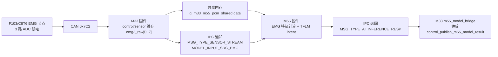

# EMG M33/M55 TensorFlow Lite Micro 部署记录

日期：2026-07-02

这份文档记录当前固件集成状态。结论先写清楚：这次已经把方向从旧的 IMU/陀螺仪 demo 改成 EMG 肌电链路，并接入当前 M33/M55 工程的 shared memory + IPC 通信；目前完成的是代码集成和本地构建验证，还没有实际烧录到板子上跑串口验证。

## 1. 目标链路



核心原则：

- M33 负责采集、缓存、窗口化和安全控制。
- M55 负责 TensorFlow Lite Micro 推理。
- 大块 EMG 窗口通过 shared memory 传输。
- IPC 只做“有新窗口/有新结果”的通知和小结果返回。
- 旧 IMU/gyro demo 不再作为默认构建链路。

## 2. M33 侧已经接入的内容

新增文件：

```text
F:\RT-ThreadStudio\workspace\Edgi_Talk_M33_Blink_LED\applications\m33\m55_emg_stream_bridge.c
F:\RT-ThreadStudio\workspace\Edgi_Talk_M33_Blink_LED\applications\m33\m55_emg_stream_bridge.h
F:\RT-ThreadStudio\workspace\Edgi_Talk_M33_Blink_LED\tools\test_m55_emg_stream_bridge_contract.py
```

M33 数据来源：

```text
control_get_sensor_node_sample()
    -> control_sensor_node_sample_t.emg3_raw[0]
    -> control_sensor_node_sample_t.emg3_raw[1]
    -> control_sensor_node_sample_t.emg3_raw[2]
```

M33 发布给 M55 的格式：

```text
msg.type = MSG_TYPE_SENSOR_STREAM
source   = MODEL_INPUT_SRC_EMG
format   = MODEL_INPUT_FMT_UINT16
channels = 3
sample_rate = 50 Hz
frame_samples = 15
window = 300 ms
step   = 100 ms
```

共享内存使用现有结构：

```text
g_m33_m55_pcm_shared.data
```

虽然名字里还有 `pcm`，但它本来就是 M33/M55 共享大 buffer。现在通过 `source=MODEL_INPUT_SRC_EMG` 区分这是 EMG 窗口，不是音频 PCM。

M33 shell 命令：

```text
m55_emg_stream 1 20
m55_emg_status
m55_emg_once
m55_emg_stream 0
```

推荐启动顺序：

```text
control_init
sensor_rate 1 20
m55_emg_stream 1 20
```

也可以直接执行：

```text
m55_emg_stream 1 20 1
```

最后一个参数 `1` 表示让桥接命令顺手启动 F103 上报。

## 3. M55 侧已经接入的内容

新增文件：

```text
F:\RT-ThreadStudio\workspace\Edgi_Talk_M55_Blink_LED\applications\intent_tflm_runtime.cpp
F:\RT-ThreadStudio\workspace\Edgi_Talk_M55_Blink_LED\applications\intent_tflm_runtime.h
F:\RT-ThreadStudio\workspace\Edgi_Talk_M55_Blink_LED\applications\emg_intent_bridge.cpp
F:\RT-ThreadStudio\workspace\Edgi_Talk_M55_Blink_LED\applications\emg_intent_bridge.h
F:\RT-ThreadStudio\workspace\Edgi_Talk_M55_Blink_LED\tools\test_emg_intent_bridge_contract.py
```

改动文件：

```text
F:\RT-ThreadStudio\workspace\Edgi_Talk_M55_Blink_LED\applications\voice_service.c
F:\RT-ThreadStudio\workspace\Edgi_Talk_M55_Blink_LED\applications\edge_ai_bridge\SConscript
```

M55 接收逻辑：

```text
voice_service_handle_ipc_message()
    -> MSG_TYPE_SENSOR_STREAM
    -> source == MODEL_INPUT_SRC_EMG
    -> emg_intent_bridge_handle_stream()
```

M55 推理逻辑：

```text
读取 g_m33_m55_pcm_shared.data
    -> 解析 3 路 uint16 EMG raw
    -> 计算训练时一致的 21 个特征
    -> 按 preprocess.json 的 mean/std 标准化
    -> 按 int8 input scale/zero point 量化
    -> intent_tflm_runtime_infer_int8()
    -> model_result_publish(MODEL_CODE_EMG_INTENT, ...)
```

类别映射：

```text
0 = elbow_curl
1 = rest
2 = shoulder_flex
```

M55 shell 命令：

```text
intent_tflm_smoke -v
emg_intent
```

其中：

- `intent_tflm_smoke -v` 验证 TFLM 固定 golden sample。
- `emg_intent` 查看实时 EMG intent bridge 的窗口数量、最近序号和错误数。

## 4. 已去掉的 IMU 默认链路

旧文件还保留在：

```text
F:\RT-ThreadStudio\workspace\Edgi_Talk_M55_Blink_LED\applications\edge_ai_bridge
```

但它已经不再默认参与构建：

```text
EDGE_AI_USING_LEGACY_IMU_BRIDGE
```

只有显式打开这个构建宏时，旧 IMU bridge 才会编译。当前 EMG 部署链路不使用 accel/gyro。

## 5. 本地验证结果

M33 合同测试：

```powershell
cd F:\RT-ThreadStudio\workspace\Edgi_Talk_M33_Blink_LED
python -m unittest tools.test_m55_emg_stream_bridge_contract tools.test_collect_f103_sensor_data
```

结果：

```text
Ran 31 tests
OK
```

M55 合同测试：

```powershell
cd F:\RT-ThreadStudio\workspace\Edgi_Talk_M55_Blink_LED
python -m unittest tools.test_emg_intent_bridge_contract tools.test_intent_tflm_smoke_contract tools.test_opus_integration_contract tools.test_sdio_diag_link_contract
```

结果：

```text
Ran 18 tests
OK
```

M33 构建：

```powershell
cd F:\RT-ThreadStudio\workspace\Edgi_Talk_M33_Blink_LED
$env:RTT_EXEC_PATH='F:\RT-ThreadStudio\platform\env_released\env-new\tools\gnu_gcc\arm_gcc\mingw\bin'
F:\RT-ThreadStudio\platform\env_released\env-new\.venv\Scripts\scons.exe -j4
```

结果：

```text
LINK rt-thread.elf
text=464164 data=15556 bss=311664 dec=791384
scons: done building targets.
```

M55 构建：

```powershell
cd F:\RT-ThreadStudio\workspace\Edgi_Talk_M55_Blink_LED
$env:RTT_EXEC_PATH='F:\RT-ThreadStudio\platform\env_released\env-new\tools\gnu_gcc\arm_gcc\mingw\bin'
F:\RT-ThreadStudio\platform\env_released\env-new\.venv\Scripts\scons.exe -j4
```

结果：

```text
LINK rt-thread.elf
text=1703896 data=81528 bss=4531320 dec=6316744
scons: done building targets.
```

## 6. 上板后怎么看

M33 串口重点看：

```text
[m55_emg] publish seq=... samples=15 stale=... len=90
[m55_model_bridge] ai seq=... model=2 result=... conf=... flags=... win=300
```

M55 串口重点看：

```text
[intent_runtime] ready model=22232 arena=65536 used=...
[emg_intent] seq=... label=elbow_flex idx=1 conf=... detected=... win=300 ret=...
```

如果 M33 有发布但 M55 没收到：

```text
m55_emg_status
emg_intent
```

如果 M55 推理失败：

```text
intent_tflm_smoke -v
```

先确认 golden sample 在板端能通过，再查实时 EMG 输入。

## 7. 当前还没有完成的事情

还没有完成：

```text
烧录 M33 固件到板子
烧录 M55 固件到板子
串口执行 intent_tflm_smoke -v
串口执行 m55_emg_stream 1 20
真实 F103 EMG 数据闭环验证
根据真实动作确认 elbow_curl / rest / shoulder_flex 的稳定性
```

所以当前准确状态是：

```text
代码已集成
本地测试已通过
M33/M55 工程已构建通过
还没有实际部署到板子上运行验证
```
