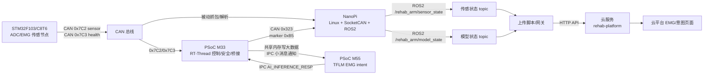

# F103 到 M33 到 M55 到 NanoPi 到云端闭环链路说明

日期：2026-07-07

这份文档把当前肌电推理闭环拆成可以理解、可以测试、可以定位的几段。目标不是只记住一串命令，而是知道每段数据为什么这样走，出了问题应该先看哪里。

本文里的“跑通闭环”指：

```text
F103 采集肌电/ADC
  -> CAN 总线 0x7C2/0x7C3
  -> M33 收数并缓存
  -> M33 打窗口，通过共享内存 + IPC 通知 M55
  -> M55 跑 EMG intent TFLM 推理
  -> M55 通过 IPC 把结果回给 M33
  -> M33 发 CAN 0x323 模型状态
  -> NanoPi 解析成 ROS topic
  -> NanoPi 上传到云端接口
  -> 云平台 EMG/意图页面读取最新数据
```

严格说这里有两条并行链路：

1. 传感数据链：`F103 -> CAN 0x7C2/0x7C3 -> M33/NanoPi -> /rehab_arm/sensor_state -> 云端 EMG 数据`
2. 推理结果链：`F103 -> M33 -> M55 -> M33 -> CAN 0x323 -> NanoPi -> /rehab_arm/model_state -> 云端意图数据`

它们共享 F103 的肌电输入，但不是同一条“管子”。NanoPi 在 CAN 总线上能被动看到 F103 的 `0x7C2`，同时 M33 也会把同一批传感数据喂给 M55。调试时必须分段证明，不然很容易出现“云端没更新”，但其实问题可能在 F103、M33 窗口、M55 校验、0x323、ROS 解析或上传脚本任意一段。

## 1. 整体结构



### 每个板子的职责

| 模块 | 主要职责 | 关键证据 |
|---|---|---|
| F103/C8T6 | 采集 ADC/肌电，按固定频率上报 CAN | NanoPi/M33 能看到 `0x7C2` 和 `0x7C3` |
| M33 | 控制与安全主核，解析 F103，给 M55 打窗口，发布模型结果到 CAN | `cmd_sensor_show`、`cmd_m55_emg_status`、`0x323` |
| M55 | AI/推理核，接收 M33 的窗口，跑 TFLM intent，回传结果 | `emg_intent` 日志、OpenOCD 读窗口/错误计数 |
| NanoPi | Linux 侧 CAN/ROS 桥，解析状态，上传云端 | `candump`、`ros2 topic echo/hz`、上传进程日志 |
| 云服务 | 接收设备上传，提供 app/页面读取接口 | `/legacy-spp/inbound`、`/emg/latest` |

## 2. CAN 协议先记住这几帧

当前工程里的 ID 定义在：

- `applications/control/control_layer_cfg.h`
- `applications/control/sensor.c`
- `applications/control/control_layer.c`
- `docs/PROTOCOL_AND_SAFETY_BOUNDARIES.md`

### F103 相关帧

| CAN ID | 方向 | 用途 | 当前判断标准 |
|---|---|---|---|
| `0x7C0` | M33/NanoPi -> F103 | 控制 F103，例如设置频率、开始/停止上报、GET_STATUS | 发送后应看到 `0x7C1` ACK |
| `0x7C1` | F103 -> 总线 | F103 ACK | `data[0]=cmd`，`data[1]=seq`，`data[2]=status` |
| `0x7C2` | F103 -> 总线 | 传感数据 | 8 字节，四路 ADC，小端 `u16` |
| `0x7C3` | F103 -> 总线 | F103 health | `data[0]=state`，`data[1..2]=err_cnt`，`data[3]=queue_fill` |

`0x7C2` 当前 payload：

```text
data[0..1] = adc0, little-endian uint16
data[2..3] = adc1, little-endian uint16
data[4..5] = adc2, little-endian uint16
data[6..7] = adc3, little-endian uint16
```

注意：当前 M55 模型使用 3 路 EMG 模型输入，M33 物理采样窗口里会带 4 路 ADC，其中 `adc3` 不是模型输入。代码里通过 `reserved0 = 3` 告诉 M55 模型实际使用 3 路。

### M33 到 NanoPi 的模型结果帧

| CAN ID | 方向 | 用途 | 安全边界 |
|---|---|---|---|
| `0x323` | M33 -> NanoPi | M55/model status | 只是模型建议/状态，不是运动许可 |

M33 在 `control_publish_m55_model_result()` 里构造 `0x323`：

```text
payload[0] = 0xB5          // marker
payload[1] = seq           // M33 CAN 发送序号
payload[2] = model_code    // 模型编号，例如 EMG intent
payload[3] = result_code   // 推理类别/结果
payload[4] = confidence/10 // 0..100，对应 0..1000 permille
payload[5] = flags | suggestion_only
payload[6] = window_ms/10
payload[7] = 0
```

这里最重要的是：`0x323` 不是电机控制命令。真正运动链路仍然必须走：

```text
JointTrajectory -> NanoPi ROS2 bridge -> M33 safety/control -> motor
```

模型、云端、页面都只能给建议或显示状态，不能绕过 M33 安全门控。

## 3. 第一段：F103 到 CAN 总线

### 原理

F103 负责采集 ADC/EMG，然后通过 CAN 持续发 `0x7C2`。如果配置了 health，它还会周期性发 `0x7C3`。M33 和 NanoPi 都接在同一条 CAN 总线上，所以它们都能看到这些帧。

这一段只证明 F103 是否活着、CAN 物理层是否通、F103 是否真的在发数据。

### NanoPi 上测

优先在 NanoPi 被动抓包，因为它不会影响 M33/M55 的运行状态：

```bash
ssh pi@192.168.3.36 "ip -details -statistics link show can0"
ssh pi@192.168.3.36 "timeout 5s candump -L can0,7C0:7FC || true"
```

期望看到：

```text
can0  7C2   [8]  xx xx xx xx xx xx xx xx
can0  7C2   [8]  xx xx xx xx xx xx xx xx
can0  7C3   [8]  xx xx xx xx xx xx xx xx
```

判断：

- `0x7C2` 大约 20 ms 一帧，约 50 Hz，说明 F103 传感数据在发。
- `0x7C3` 大约 1 s 一帧，说明 F103 health 在发。
- `ip -details -statistics link show can0` 里应是 `ERROR-ACTIVE`，bus error 不应持续增长。

### M33 shell 上测

M33 shell 里：

```text
cmd_control_init
cmd_sensor_rate 1 20
cmd_sensor_show
cmd_control_debug
```

期望：

- `cmd_sensor_show` 能看到 ADC4 或 EMG3 的值变化。
- `cmd_control_debug` 里 F103 的 `ack/sensor/health` 计数增长。
- `CTRL_DBG_LAST` 的 `id` 能出现 `0x7C2` 或 `0x7C3`。

如果 NanoPi 能看到 `0x7C2`，但 M33 `cmd_sensor_show` 没变化，问题在 M33 CAN 接收、ID 过滤、`control_layer.c` 分发或 `sensor.c` 解析，而不是 F103 本体。

源码入口：

```text
applications/control/control_layer.c
  -> 收到 CONTROL_CAN_ID_F103_SENSOR 0x7C2
  -> control_sensor_update_f103_sensor_report()

applications/control/sensor.c
  -> 解析 4 路 little-endian uint16 ADC
  -> 更新 control_sensor_node_sample_t / EMG 兼容缓存
  -> cmd_sensor_show 显示最近样本
```

## 4. 第二段：M33 把 F103 数据打窗口给 M55

### 原理

M33 不会把每一帧 CAN 数据都单独丢给 M55 推理，而是把连续样本收进一个窗口。当前参数：

```text
M55_EMG_PHYSICAL_CHANNELS = 4
M55_EMG_MODEL_CHANNELS    = 3
M55_EMG_WINDOW_SAMPLES    = 15
M55_EMG_SAMPLE_RATE_HZ    = 50
```

所以一个 M55 EMG 窗口大约是：

```text
15 samples * 4 channels * 2 bytes = 120 bytes
window_ms = 15 / 50 * 1000 = 300 ms
```

M33 做两件事：

1. 把 120 字节窗口写入共享内存 `g_m33_m55_pcm_shared.data`。
2. 通过 IPC queue 给 M55 发一个小消息 `MSG_TYPE_SENSOR_STREAM`，里面带元数据：source、format、channels、sample_rate、frame_samples、len、seq。

为什么要这样设计：

- IPC 小消息适合传控制信息，不适合频繁塞大块数据。
- 共享内存适合放大数据，但双方必须约定同一个地址、同一个结构体布局。
- `seq` 用来证明“小消息”和“大数据”是同一批窗口。
- M33 写完共享内存要 flush cache；M55 读之前要 invalidate cache，否则会读到旧数据。

源码入口：

```text
applications/common/m33_m55_comm.c
  -> g_m33_m55_pcm_shared 放在 .cy_shared_socmem
  -> mtb_ipc queue 初始化

applications/m33/m55_emg_stream_bridge.c
  -> m55_emg_stream_bridge_publish_once()
  -> 写 g_m33_m55_pcm_shared
  -> rt_hw_cpu_dcache_ops(RT_HW_CACHE_FLUSH, ...)
  -> m33_m55_comm_publish(MSG_TYPE_SENSOR_STREAM)
```

### M33 shell 上测

启动 M33 到 M55 的 EMG 窗口流：

```text
cmd_m55_emg_status
cmd_m55_emg_stream 1 20 1
cmd_m55_emg_status
```

`cmd_m55_emg_stream 1 20 1` 的含义：

```text
1  = enable
20 = 期望 F103 上报周期 20 ms
1  = manage_f103，让 M33 顺手配置/启动 F103 流
```

期望：

```text
m55_emg_stream ret=0 running=1
[m55_emg] running=1 samples=15 ... windows=持续增长 errors=不持续增长
[m55_emg] publish seq=... samples=15 stale=... len=120
```

如果 `samples` 不到 15，说明 M33 没攒够窗口，先回去看 F103 `0x7C2` 和 `cmd_sensor_show`。

如果 `windows` 不涨，说明 M33 的 EMG stream 线程没正常跑，查 `cmd_m55_emg_stream` 返回值和 `publish_errors`。

如果 `windows` 涨但 M55 没结果，进入下一段查 M55 校验。

## 5. 第三段：M55 接收窗口并跑推理

### 原理

M55 的 `voice_service.c` 收到 `MSG_TYPE_SENSOR_STREAM` 后，如果 `source == MODEL_INPUT_SRC_EMG`，就调用：

```text
emg_intent_bridge_handle_stream()
```

M55 先做严格校验，再读共享内存：

```text
source       必须是 MODEL_INPUT_SRC_EMG，也就是 3
format       必须是 MODEL_INPUT_FMT_UINT16，也就是 3
channels     必须在 3..4
reserved0    必须表示模型通道数 3
frame_samples 不能为 0
total_len/chunk_len 必须 >= frame_samples * channels * 2
chunk_index  必须等于 g_m33_m55_pcm_shared.seq
```

如果这些不匹配，M55 会拒绝窗口，`g_emg_intent_error_count` 增长。之前定位到的典型问题就是：M33 的 `g_m33_m55_pcm_shared` 在 `0x261C0000`，M55 却把同名符号链接到 `0x2000xxxx`，导致 IPC 小消息到了，但 M55 读的是自己的本地 RAM，不是共享内存。结果就是 `seq mismatch` 或持续 reject。

源码入口：

```text
F:/RT-ThreadStudio/workspace/Edgi_Talk_M55_Blink_LED/applications/voice_service.c
  -> MSG_TYPE_SENSOR_STREAM
  -> emg_intent_bridge_handle_stream()

F:/RT-ThreadStudio/workspace/Edgi_Talk_M55_Blink_LED/applications/emg_intent_bridge.cpp
  -> emg_stream_is_valid()
  -> 检查 stream 元数据
  -> 检查 chunk_index == g_m33_m55_pcm_shared.seq
  -> invalidate cache
  -> intent_tflm_runtime_infer_int8()
  -> model_result_publish()
```

### M55 shell 上测

如果你连的是 M55 shell，可以直接试：

```text
emg_intent
intent_tflm_smoke -v
```

如果这些命令在 M33 shell 上显示 `command not found`，不代表功能没编译，而是你连错核了。M33 shell 只能看到 M33 的 FinSH/MSH 命令；M55 命令只在 M55 shell 里。

### OpenOCD 读 M55 运行时计数

这个方法适合“不要复位、不要打断主流程，只想看 M55 到底有没有收到窗口”。

先从 M55 map 查符号地址，不要死记地址：

```powershell
Select-String -Path F:\RT-ThreadStudio\workspace\Edgi_Talk_M55_Blink_LED\rtthread.map `
  -Pattern "g_emg_intent_init_ret|g_emg_intent_last_seq|g_emg_intent_error_count|g_emg_intent_window_count|g_m33_m55_pcm_shared"
```

再用 OpenOCD attach 到 M55 读内存。示例：

```powershell
$openocd = "F:\RT-ThreadStudio\repo\Extract\Debugger_Support_Packages\Infineon\OpenOCD-Infineon\2.0.0\bin\openocd.exe"
$scripts = "F:\RT-ThreadStudio\repo\Extract\Debugger_Support_Packages\Infineon\OpenOCD-Infineon\2.0.0\scripts"

& $openocd -s $scripts `
  -f interface/kitprog3.cfg `
  -c "adapter serial 17040F11022F2400" `
  -c "transport select swd" `
  -f target/infineon/pse84xgxs2.cfg `
  -c "init" `
  -c "targets cat1d.cm55" `
  -c "mdw <g_emg_intent_error_count地址> 1" `
  -c "mdw <g_emg_intent_last_seq地址> 1" `
  -c "mdw <g_emg_intent_window_count地址> 1" `
  -c "shutdown"
```

判断：

- `g_emg_intent_window_count` 增长：M55 已经接受窗口并跑完推理。
- `g_emg_intent_error_count` 持续增长但 `window_count` 不涨：M55 收到了窗口通知，但拒绝了窗口，优先查 metadata 和共享内存地址。
- `last_seq` 不动：M55 没接受新窗口，可能 IPC 没到、source 不对、或 seq 校验失败。
- `g_emg_intent_init_ret = 0`：TFLM runtime 初始化成功；如果不是 0，要先修模型运行时。

最常见的 M33/M55 共享内存问题：

```text
M33 map: g_m33_m55_pcm_shared = 0x261C0000
M55 map: g_m33_m55_pcm_shared = 0x2000xxxx   错
M55 map: g_m33_m55_pcm_shared = 0x261C0000   对
```

只要双方同名共享变量不在同一个物理共享 RAM 地址，IPC 小消息可以到，但 M55 读不到 M33 写的大数据。

## 6. 第四段：M55 推理结果回到 M33

### 原理

M55 跑完推理后调用：

```text
model_result_publish(MODEL_CODE_EMG_INTENT, result_code, confidence, detected, fresh, window_ms)
```

这个函数构造 `MSG_TYPE_AI_INFERENCE_RESP`，通过 IPC 发回 M33。

M33 的 `m55_model_bridge.c` 收到 AI result 后：

1. 更新 `g_m55_model_state`。
2. 打印日志：

```text
[m55_model_bridge] ai seq=... model=... result=... conf=... flags=... win=... can_ret=...
```

3. 调用 `control_publish_m55_model_result()`。
4. 通过 CAN 发出 `0x323`。

### M33 上判断

如果 M33 shell 有模型状态命令，优先看：

```text
m55qa_status
```

期望类似：

```text
has_model=1 code=2 result=... conf=...
```

如果没有这个命令，就抓串口日志，找：

```text
[m55_model_bridge] ai seq=...
```

判断：

- M55 `window_count` 涨，但 M33 没有 `[m55_model_bridge] ai`：M55 -> M33 的 IPC 回程有问题。
- M33 有 `[m55_model_bridge] ai`，但 `can_ret != 0`：M33 CAN 发送 `0x323` 有问题。
- M33 有 `[m55_model_bridge] ai` 且 `can_ret=0`，但 NanoPi 看不到 `0x323`：查 CAN 总线、过滤、NanoPi can0。

## 7. 第五段：M33 的 0x323 到 NanoPi

### NanoPi 抓 CAN

```bash
ssh pi@192.168.3.36 "timeout 10s candump -L can0,323:7FF || true"
```

期望看到：

```text
can0  323   [8]  B5 xx xx xx xx xx xx 00
```

判断：

- `payload[0] == B5`：这是 M33 模型状态帧。
- `payload[2]`：模型编号。
- `payload[3]`：结果编号。
- `payload[4]`：置信度百分比。
- `payload[5]`：flags，包含 suggestion-only。
- `payload[6]`：窗口长度，单位约 10 ms。

### ROS topic

NanoPi 的 ROS2 bridge 应该把 `0x323` 解析成模型状态 topic：

```bash
ssh pi@192.168.3.36 "export ROS_DOMAIN_ID=42; source /opt/ros/jazzy/setup.bash; source /home/pi/rehab_arm_ros2_ws/install/setup.bash; ros2 topic echo --once --full-length /rehab_arm/model_state"
```

如果只验证 F103 传感数据：

```bash
ssh pi@192.168.3.36 "export ROS_DOMAIN_ID=42; source /opt/ros/jazzy/setup.bash; source /home/pi/rehab_arm_ros2_ws/install/setup.bash; ros2 topic echo --once --full-length /rehab_arm/sensor_state"

ssh pi@192.168.3.36 "export ROS_DOMAIN_ID=42; source /opt/ros/jazzy/setup.bash; source /home/pi/rehab_arm_ros2_ws/install/setup.bash; ros2 topic hz /rehab_arm/sensor_state"
```

期望：

- `/rehab_arm/sensor_state` 里能看到 `id_hex=0x7C2` 或 source 类似 `f103_sensor`。
- `/rehab_arm/sensor_state` 频率约 50 Hz。
- `/rehab_arm/model_state` 在 M55 有推理结果时更新。

对应 NanoPi 工程入口在外部 ROS2 工作区：

```text
rehab_arm_ros2_ws/src/rehab_arm_psoc_bridge/rehab_arm_psoc_bridge/psoc_can_bridge_node.py
rehab_arm_ros2_ws/src/rehab_arm_psoc_bridge/rehab_arm_psoc_bridge/m33_model_status.py
rehab_arm_ros2_ws/src/rehab_arm_psoc_bridge/rehab_arm_psoc_bridge/m33_ros_contract.py
```

## 8. 第六段：NanoPi 上传到云端

### 当前云端接口形态

本地云服务工程在：

```text
cloud/rehab-platform
```

与 EMG 最新数据相关的接口：

```text
POST /api/rehab-arm/app/v1/devices/{device_id}/legacy-spp/inbound
GET  /api/rehab-arm/app/v1/emg/latest
```

`legacy-spp/inbound` 的逻辑：

1. 设备必须属于当前登录用户。
2. 接收 `raw_text`。
3. 尝试把 `raw_text` 解析成 JSON。
4. 存入 `LegacySppInbound`。

`emg/latest` 的逻辑：

1. 查询当前用户最近 20 条 `LegacySppInbound`。
2. 找到 `parsed_json` 里带 `"emg"` 或 `type == "sensor"` 的记录。
3. 返回这条记录作为最新 EMG 样本。

测试用例里已有样例：

```json
{"type":"sensor","emg":0.51,"battery":87}
```

所以云平台 EMG 页如果读的是 `/emg/latest`，最低限度需要 NanoPi 上传类似的 sensor JSON。要显示 M55 intent，则上传 JSON 里也应带模型字段，例如：

```json
{
  "type": "sensor",
  "emg": 0.51,
  "battery": 87,
  "intent": "elbow_flex",
  "model_code": 2,
  "result_code": 1,
  "confidence": 0.82
}
```

这里要确认 NanoPi 上传脚本是否已经把 `/rehab_arm/model_state` 合并进上传内容。如果只上传 `/rehab_arm/sensor_state`，云端 EMG 页会有肌电数值，但不一定有 M55 意图结果。

### NanoPi 上查上传进程

```bash
ssh pi@192.168.3.36 "ps aux | grep -E 'sensor_state_uploader|rehab|uploader' | grep -v grep || true"
```

如果是 systemd 服务，按实际服务名查日志：

```bash
ssh pi@192.168.3.36 "systemctl --type=service | grep -E 'rehab|uploader|sensor' || true"
ssh pi@192.168.3.36 "journalctl -u <实际服务名> -n 100 --no-pager"
```

如果是手动启动脚本，直接看脚本输出或重定向日志。判断重点：

- 是否订阅到了 `/rehab_arm/sensor_state`。
- 是否订阅到了 `/rehab_arm/model_state`。
- HTTP POST 返回码是否是 200/201。
- 失败时是鉴权失败、网络失败、JSON 格式失败，还是设备未绑定。

### 云端只读检查

这个不写数据库，只看服务是否活着：

```powershell
Invoke-RestMethod -Method Get "http://106.55.62.122:8011/health"
```

期望返回 `status=ok` 一类结果。

### 云端写入 smoke 测试

注意：下面命令会写入云端数据库。只有在你确认要做云端 smoke 时再执行。

```powershell
$base = "http://106.55.62.122:8011"

$login = Invoke-RestMethod `
  -Method Post `
  "$base/api/auth/session" `
  -ContentType "application/json" `
  -Body '{"email":"3245056131@qq.com","password":"1234"}'

$h = @{ Authorization = "Bearer $($login.data.access_token)" }

$dev = Invoke-RestMethod `
  -Method Post `
  "$base/api/rehab-arm/app/v1/devices/bind" `
  -Headers $h `
  -ContentType "application/json" `
  -Body '{"m33_device_id":"OpenClaw-NUS","ble_name":"OpenClaw-NUS"}'

$raw = '{"type":"sensor","emg":0.51,"battery":87,"intent":"elbow_flex","model_code":2,"result_code":1,"confidence":0.82}'
$payload = @{ raw_text = $raw } | ConvertTo-Json -Compress

Invoke-RestMethod `
  -Method Post `
  "$base/api/rehab-arm/app/v1/devices/$($dev.data.id)/legacy-spp/inbound" `
  -Headers $h `
  -ContentType "application/json" `
  -Body $payload

Invoke-RestMethod `
  -Method Get `
  "$base/api/rehab-arm/app/v1/emg/latest" `
  -Headers $h
```

如果这一步成功，但 NanoPi 自动上传不成功，问题在 NanoPi 上传脚本或网络/鉴权配置，不在云服务 API。

如果这一步失败，先看 HTTP 状态码：

- `401/403`：登录 token 或权限问题。
- `404 DEVICE_NOT_FOUND`：设备绑定或 device_id 不对。
- `422`：请求 JSON 格式不对，常见于 Windows -> SSH -> curl 多层引号转义错误。
- `404 EMG_NOT_FOUND`：写入的 `raw_text` 没被解析成带 `emg` 或 `type=sensor` 的 JSON。

## 9. 一套从底到顶的闭环测试顺序

不要一上来就盯云平台页面。按下面顺序，每一段只证明一个事实。

### 第 1 步：证明 F103 在总线上发数据

NanoPi：

```bash
ssh pi@192.168.3.36 "timeout 5s candump -L can0,7C0:7FC || true"
```

通过标准：

```text
看到 0x7C2 连续输出
看到 0x7C3 周期输出
```

### 第 2 步：证明 M33 收到 F103

M33 shell：

```text
cmd_control_init
cmd_sensor_rate 1 20
cmd_sensor_show
cmd_control_debug
```

通过标准：

```text
cmd_sensor_show 有 ADC/EMG 值变化
cmd_control_debug 的 F103 sensor/health 计数增长
```

### 第 3 步：证明 M33 在给 M55 发窗口

M33 shell：

```text
cmd_m55_emg_status
cmd_m55_emg_stream 1 20 1
cmd_m55_emg_status
```

通过标准：

```text
running=1
samples=15
windows/published_windows 增长
publish seq=... len=120
```

### 第 4 步：证明 M55 接受窗口并跑推理

OpenOCD 读 M55：

```powershell
Select-String -Path F:\RT-ThreadStudio\workspace\Edgi_Talk_M55_Blink_LED\rtthread.map `
  -Pattern "g_emg_intent_error_count|g_emg_intent_last_seq|g_emg_intent_window_count"
```

然后 `mdw` 对应地址。

通过标准：

```text
g_emg_intent_window_count 增长
g_emg_intent_error_count 不持续增长
g_emg_intent_last_seq 跟 M33 publish seq 靠近或一致
```

### 第 5 步：证明 M55 结果回到 M33

M33 shell 或串口日志：

```text
m55qa_status
```

或者找：

```text
[m55_model_bridge] ai seq=...
```

通过标准：

```text
has_model=1
或看到 m55_model_bridge ai 日志
can_ret=0
```

### 第 6 步：证明 M33 发出 0x323

NanoPi：

```bash
ssh pi@192.168.3.36 "timeout 10s candump -L can0,323:7FF || true"
```

通过标准：

```text
看到 323#B5...
```

### 第 7 步：证明 NanoPi ROS 解析

NanoPi：

```bash
ssh pi@192.168.3.36 "export ROS_DOMAIN_ID=42; source /opt/ros/jazzy/setup.bash; source /home/pi/rehab_arm_ros2_ws/install/setup.bash; ros2 topic echo --once --full-length /rehab_arm/model_state"

ssh pi@192.168.3.36 "export ROS_DOMAIN_ID=42; source /opt/ros/jazzy/setup.bash; source /home/pi/rehab_arm_ros2_ws/install/setup.bash; ros2 topic echo --once --full-length /rehab_arm/sensor_state"
```

通过标准：

```text
/rehab_arm/sensor_state 有 F103 传感数据
/rehab_arm/model_state 有 M55/M33 模型状态
```

### 第 8 步：证明 NanoPi 上传

NanoPi：

```bash
ssh pi@192.168.3.36 "ps aux | grep -E 'sensor_state_uploader|rehab|uploader' | grep -v grep || true"
```

看上传日志，确认 HTTP 返回成功。

### 第 9 步：证明云端能读到

云端 API：

```powershell
Invoke-RestMethod -Method Get "http://106.55.62.122:8011/health"
```

登录后读：

```powershell
Invoke-RestMethod -Method Get "$base/api/rehab-arm/app/v1/emg/latest" -Headers $h
```

通过标准：

```text
data.source = legacy_spp_inbound
data.sample.emg 存在
如果上传脚本合并了模型，data.sample.intent/model_code/result_code/confidence 也应存在
```

## 10. 常见故障树

### 10.1 NanoPi 看不到 0x7C2/0x7C3

说明 F103 到 CAN 总线这一段就不成立。

排查：

```bash
ssh pi@192.168.3.36 "ip -details -statistics link show can0"
ssh pi@192.168.3.36 "timeout 5s candump -L can0 || true"
```

重点看：

- can0 是否 up。
- bitrate 是否 1 Mbps。
- CANH/CANL/终端电阻是否正常。
- F103 是否烧了正确固件。
- F103 是否需要 `0x7C0` 控制命令才开始发流。

### 10.2 NanoPi 能看到 0x7C2，但 M33 看不到

说明 F103 和 CAN 物理层基本没问题，问题偏 M33 接收。

排查：

```text
cmd_control_debug
cmd_sensor_show
```

源码看：

```text
applications/control/control_layer.c
applications/control/sensor.c
```

重点看：

- M33 CAN 是否初始化。
- M33 过滤器是否接收 `0x7C2/0x7C3/0x7C1`。
- `control_sensor_update_f103_sensor_report()` 是否被调用。
- `cmd_control_debug` 的 parsed/enq/applied 是否增长。

### 10.3 M33 有 ADC，但 M55 没窗口

说明 F103 -> M33 OK，但 M33 -> M55 stream 没启动或没攒够样本。

排查：

```text
cmd_m55_emg_status
cmd_m55_emg_stream 1 20 1
cmd_m55_emg_status
```

重点看：

- `running=1`。
- `samples=15`。
- `windows` 是否增长。
- `errors/publish_errors` 是否增长。
- F103 样本是否 stale。

### 10.4 M33 windows 增长，但 M55 error_count 增长

这是最典型的 M33/M55 IPC 或共享内存问题。

排查：

```powershell
Select-String -Path F:\RT-ThreadStudio\workspace\Edgi_Talk_M33_Blink_LED\rtthread.map `
  -Pattern "g_m33_m55_pcm_shared"

Select-String -Path F:\RT-ThreadStudio\workspace\Edgi_Talk_M55_Blink_LED\rtthread.map `
  -Pattern "g_m33_m55_pcm_shared"
```

两个地址必须一致，应该都在共享 RAM 区，例如 `0x261C0000` 一类地址。

再查 M55 日志或 OpenOCD 计数：

```text
reject stream src=...
shared seq mismatch msg=... shared=...
infer failed ret=...
```

判断：

- `reject stream`：metadata 不满足 M55 校验，查 source/format/channels/reserved0/len。
- `shared seq mismatch`：小消息到了，但共享内存不是同一个地址，或 cache/写入顺序有问题。
- `infer failed`：窗口接受了，但 TFLM 推理失败，查模型 runtime 和输入维度。

### 10.5 M55 有窗口，但 M33 没模型结果

说明 M55 推理可能成功，但 IPC 回程或 M33 model bridge 有问题。

排查：

```text
m55qa_status
```

找 M33 日志：

```text
[m55_model_bridge] ai seq=...
```

重点看：

- M55 是否调用 `model_result_publish()`。
- M33 是否消费 `MSG_TYPE_AI_INFERENCE_RESP`。
- `m55_model_bridge_handle_ai_result()` 是否更新状态。

### 10.6 M33 有模型结果，但 NanoPi 没 0x323

说明 M33 到 CAN 发送或 NanoPi 接收有问题。

排查：

```bash
ssh pi@192.168.3.36 "timeout 10s candump -L can0,323:7FF || true"
```

M33 日志看：

```text
[m55_model_bridge] ai ... can_ret=...
```

判断：

- `can_ret=0` 但 NanoPi 没看到：查 CAN 总线、NanoPi 过滤、M33 CAN TX。
- `can_ret!=0`：M33 `ctrl_can_send()` 失败，查 CAN device、bus-off、队列满。

### 10.7 NanoPi 有 0x323，但 ROS 没 model_state

说明 SocketCAN 抓包 OK，但 ROS bridge 解析或 topic 发布有问题。

排查：

```bash
ssh pi@192.168.3.36 "export ROS_DOMAIN_ID=42; source /opt/ros/jazzy/setup.bash; source /home/pi/rehab_arm_ros2_ws/install/setup.bash; ros2 topic list | grep rehab_arm"
ssh pi@192.168.3.36 "export ROS_DOMAIN_ID=42; source /opt/ros/jazzy/setup.bash; source /home/pi/rehab_arm_ros2_ws/install/setup.bash; ros2 topic echo --once --full-length /rehab_arm/model_state"
```

源码看：

```text
m33_model_status.py
psoc_can_bridge_node.py
m33_ros_contract.py
```

重点看：

- `0x323` parser 是否启用。
- `payload[0] == 0xB5` 校验是否一致。
- ROS_DOMAIN_ID 是否是 42。
- bridge 节点是否在跑。

### 10.8 ROS 有数据，但云端没有

说明硬件到 NanoPi 已经通，问题在上传脚本或云端接口。

排查：

```bash
ssh pi@192.168.3.36 "ps aux | grep -E 'sensor_state_uploader|rehab|uploader' | grep -v grep || true"
```

看上传日志：

```text
HTTP 200/201 -> 上传成功
401/403     -> token/登录问题
404         -> 设备未绑定或接口路径不对
422         -> JSON 格式不对
timeout     -> 网络/DNS/防火墙
```

云端确认：

```text
POST /api/rehab-arm/app/v1/devices/{device_id}/legacy-spp/inbound
GET  /api/rehab-arm/app/v1/emg/latest
```

如果 `/emg/latest` 返回 404，但上传 POST 成功，检查上传内容是否真的包含 `"emg"` 或 `"type":"sensor"`。

## 11. 读源码时的路线

### M33 工程

当前目录：

```text
F:/RT-ThreadStudio/workspace/Edgi_Talk_M33_Blink_LED
```

建议按这个顺序读：

```text
applications/control/control_layer_cfg.h
  -> CAN ID 和 marker 定义

applications/control/control_layer.c
  -> CAN 收发、F103 分发、0x323 发布

applications/control/sensor.c
  -> F103 0x7C1/0x7C2/0x7C3 解析
  -> cmd_sensor_show / cmd_sensor_rate / f103_ping

applications/common/m33_m55_comm.h
applications/common/m33_m55_comm.c
  -> M33/M55 IPC 消息结构、共享内存、队列

applications/m33/m55_emg_stream_bridge.c
  -> F103 样本转 M55 EMG window
  -> cmd_m55_emg_stream / cmd_m55_emg_status

applications/m33/m55_model_bridge.c
  -> M55 AI result 回 M33
  -> control_publish_m55_model_result()
```

### M55 工程

当前目录：

```text
F:/RT-ThreadStudio/workspace/Edgi_Talk_M55_Blink_LED
```

建议按这个顺序读：

```text
applications/m33_m55_comm.h
applications/m33_m55_comm.c
  -> 必须和 M33 的结构体/共享内存布局一致

applications/voice_service.c
  -> MSG_TYPE_SENSOR_STREAM 分发到 EMG intent

applications/emg_intent_bridge.cpp
  -> M55 校验窗口、读共享内存、跑 TFLM

applications/model_result_publisher.c
  -> M55 把推理结果发回 M33
```

### NanoPi / ROS2

主线在 NanoPi 上：

```text
/home/pi/rehab_arm_ros2_ws
```

关键文件在：

```text
rehab_arm_ros2_ws/src/rehab_arm_psoc_bridge/rehab_arm_psoc_bridge/psoc_can_bridge_node.py
rehab_arm_ros2_ws/src/rehab_arm_psoc_bridge/rehab_arm_psoc_bridge/m33_model_status.py
rehab_arm_ros2_ws/src/rehab_arm_psoc_bridge/rehab_arm_psoc_bridge/m33_ros_contract.py
```

### 云端

本地云端 MVP：

```text
cloud/rehab-platform
```

关键文件：

```text
cloud/rehab-platform/app/api/routes/rehab_app.py
cloud/rehab-platform/tests/test_app_compat.py
```

## 12. 最小闭环验收清单

下面这张表最适合调试现场逐项打勾。

| 层级 | 命令/观察点 | 通过标准 |
|---|---|---|
| F103 -> CAN | `candump can0,7C0:7FC` | 有连续 `0x7C2` 和周期 `0x7C3` |
| CAN -> M33 | `cmd_sensor_show` | ADC/EMG 值实时变化 |
| M33 F103 debug | `cmd_control_debug` | `sensor/health/parsed` 计数增长 |
| M33 -> M55 | `cmd_m55_emg_stream 1 20 1` | `ret=0 running=1` |
| M33 窗口 | `cmd_m55_emg_status` | `samples=15`，`windows` 增长 |
| M55 校验 | OpenOCD 读计数 | `window_count` 增长，`error_count` 不持续涨 |
| M55 -> M33 | M33 日志或 `m55qa_status` | `has_model=1` 或 `[m55_model_bridge] ai` |
| M33 -> NanoPi | `candump can0,323:7FF` | 有 `323#B5...` |
| NanoPi ROS | `ros2 topic echo /rehab_arm/model_state` | 模型状态更新 |
| NanoPi 上传 | 上传脚本日志 | HTTP 200/201 |
| 云端读取 | `GET /api/rehab-arm/app/v1/emg/latest` | 返回最新 sample |

## 13. 调试心法

1. 不要先看页面。页面是最后一层，页面不动不代表模型没跑。
2. 不要把 `0x7C2` 和 `0x323` 混为一谈。前者是 F103 传感数据，后者是 M33 转发的模型结果。
3. 不要把 IPC 和共享内存混为一谈。IPC 只是通知，真正窗口数据在共享内存。
4. 不要只看函数名相同。M33 和 M55 都有 `g_m33_m55_pcm_shared`，关键是 map 里的地址必须相同。
5. 不要看到 `command not found` 就认为功能不存在。先确认你连的是 M33 shell 还是 M55 shell。
6. M55 reject 不是坏事，reject 说明它至少收到了通知，下一步查 metadata、seq、共享内存地址和 cache。
7. `0x323` 是 suggestion-only。任何未来自动辅助动作仍必须经过 M33 安全/模式仲裁。

## 14. 一句话定位法

如果你只想快速判断卡在哪一层，按这个问：

```text
NanoPi 能看到 0x7C2/0x7C3 吗？
  否 -> F103/CAN 物理层/启动流
  是 -> M33 cmd_sensor_show 有值吗？
    否 -> M33 CAN 接收/过滤/解析
    是 -> cmd_m55_emg_status windows 涨吗？
      否 -> M33 打窗口/stream 线程
      是 -> M55 window_count 涨吗？
        否 -> M55 校验/共享内存/IPC/cache
        是 -> M33 有 m55_model_bridge ai 吗？
          否 -> M55 回程 IPC
          是 -> NanoPi 能看到 0x323#B5 吗？
            否 -> M33 CAN TX/NanoPi CAN
            是 -> ROS /rehab_arm/model_state 有吗？
              否 -> NanoPi ROS bridge parser/topic
              是 -> 云端 /emg/latest 有吗？
                否 -> 上传脚本/鉴权/API/JSON
                是 -> 闭环已经跑通，剩下看页面路由和展示字段
```

这就是这条链路的核心：先证明 F103 原始数据活着，再证明 M33 窗口活着，再证明 M55 接受窗口，再证明 0x323 结果出去，再证明 NanoPi/云端消费它。
