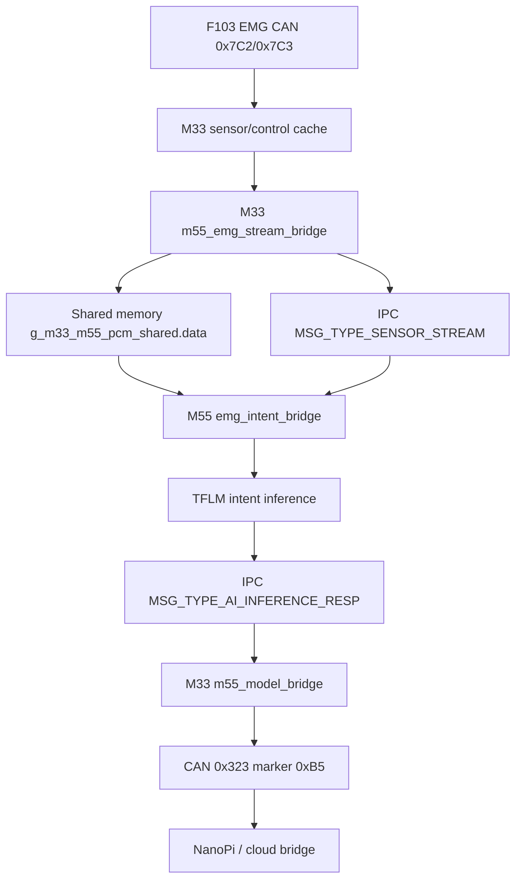

# M33/M55 双核 IPC 与共享内存调试手册

日期：2026-07-07

适用工程：

- M33：`F:\RT-ThreadStudio\workspace\Edgi_Talk_M33_Blink_LED`
- M55：`F:\RT-ThreadStudio\workspace\Edgi_Talk_M55_Blink_LED`
- 目标链路：`F103 EMG -> M33 -> M55 TFLM intent -> M33 -> CAN 0x323 -> NanoPi/云端`

这份文档按“老师傅带现场”的方式写：先讲双核通信原理，再讲这套工程的源码路径，最后给一套可重复的 shell/OpenOCD/GDB 排查流程。以后链路不通时，不要先猜模型、猜 CAN、猜云端，要先用计数和地址把故障段切出来。

## 1. 先记住一句话

M33/M55 这条链路不是单纯发一包数据。

它是：

```text
小消息走 IPC 队列，大数据走 shared memory。
```

具体到 EMG 推理：

```text
M33 把 EMG 窗口数据写进共享内存 g_m33_m55_pcm_shared.data
M33 flush cache
M33 通过 IPC 队列发一个 MSG_TYPE_SENSOR_STREAM 小消息给 M55
M55 从 IPC 小消息里读 source/format/channels/len/seq
M55 检查小消息里的 chunk_index 是否等于共享内存里的 seq
M55 invalidate cache
M55 从共享内存读 EMG 窗口
M55 做特征和 TFLM 推理
M55 通过 IPC 队列把 MSG_TYPE_AI_INFERENCE_RESP 发回 M33
M33 把结果转成 CAN 0x323
```

所以链路出问题时，要分清：

```text
IPC 小消息有没有到？
shared memory 大数据有没有对上？
cache 有没有同步？
M55 校验窗口有没有通过？
TFLM 推理有没有成功？
M33 有没有收到结果？
M33 有没有发出 0x323？
```

## 2. 双核通信的基本原理

### 2.1 双核不是两个线程

M33 和 M55 是两个独立 CPU core。它们各自有：

- 自己的启动流程
- 自己的 RT-Thread
- 自己的 ELF/map
- 自己的符号地址
- 自己的 cache 视角
- 自己的 shell 命令集合

所以在 M33 shell 里敲 M55 命令会报 `command not found`，这不是模型没编进去，而是你连的是 M33 的 FinSH/MSH。

本项目里常见情况：

```text
M33 shell 有：
cmd_control_debug
cmd_sensor_show
cmd_sensor_rate
cmd_m55_emg_stream
cmd_m55_emg_status
m55qa_status

M55 shell 有：
intent_tflm_smoke
emg_intent
m55_model_selftest / mdl_pub
```

### 2.2 IPC 队列是什么

IPC 队列适合传“小而结构化”的消息。这里的小消息是 `m33_m55_message_t`，里面有一个 union，可以承载：

- `MSG_TYPE_SENSOR_STREAM`
- `MSG_TYPE_AI_INFERENCE_RESP`
- `MSG_TYPE_VOICE_CONTROL`
- `MSG_TYPE_VOICE_STATUS`

M33 和 M55 共用同样的结构定义：

- M33：`applications\common\m33_m55_comm.h`
- M55：`F:\RT-ThreadStudio\workspace\Edgi_Talk_M55_Blink_LED\applications\m33_m55_comm.h`

关键结构：

```c
typedef struct
{
    m33_m55_msg_type_t type;
    rt_uint32_t seq;
    union
    {
        sensor_snapshot_msg_t sensor_snapshot;
        sensor_stream_msg_t sensor_stream;
        ai_inference_msg_t ai_inference;
        audio_data_msg_t audio_data;
        text_msg_t text;
        voice_control_msg_t voice_control;
        voice_status_msg_t voice_status;
        voice_config_msg_t voice_config;
    } payload;
} m33_m55_message_t;
```

IPC 队列本身只负责把这个小消息从一个 core 送到另一个 core。EMG 的真实窗口数据不放在这个 union 里。

### 2.3 shared memory 是什么

shared memory 是两边都能访问的一块 RAM。M33 写，M55 读。它的结构是：

```c
typedef struct
{
    volatile rt_uint32_t seq;
    volatile rt_uint32_t total_len;
    volatile rt_uint32_t sample_rate;
    volatile rt_uint32_t channels;
    volatile rt_uint32_t bits_per_sample;
    volatile rt_uint32_t timestamp;
    volatile rt_uint32_t reserved;
    volatile rt_uint32_t crc32;
    rt_uint8_t data[M33_M55_PCM_SHARED_CAPACITY];
} m33_m55_pcm_shared_t;
```

变量名：

```c
volatile m33_m55_pcm_shared_t g_m33_m55_pcm_shared;
```

注意：名字里还有 `pcm`，历史上用于音频，但现在也复用来传 EMG 窗口。靠 `MSG_TYPE_SENSOR_STREAM` 里的 `source=MODEL_INPUT_SRC_EMG` 区分。

### 2.4 linker section 为什么重要

同名变量不代表同一块物理 RAM。M33 和 M55 是两个 ELF，必须通过 linker script 把 `g_m33_m55_pcm_shared` 放到同一个地址。

当前正确状态：

```text
M33 rtthread.map:
g_m33_m55_pcm_shared = 0x261c0000

M55 rtthread.map:
g_m33_m55_pcm_shared = 0x261c0000
```

这次故障的根因就是这里：

```text
修复前：
M33 g_m33_m55_pcm_shared = 0x261c0000
M55 g_m33_m55_pcm_shared = 0x200012c0

结果：
IPC 小消息到了 M55
M55 却去本地 RAM 0x200012c0 读 seq/data
读不到 M33 写的窗口
chunk_index 和 shared seq 对不上
M55 一直 reject
windows=0，errors 暴涨
```

当前源码里的 section：

M33：

```c
__attribute__((section(".cy_shared_socmem"), aligned(32)))
volatile m33_m55_pcm_shared_t g_m33_m55_pcm_shared;
```

M55：

```c
__attribute__((section(".ipc_stream_shared"), aligned(32)))
volatile m33_m55_pcm_shared_t g_m33_m55_pcm_shared;
```

section 名可以不同，但最终地址必须相同。

### 2.5 cache 为什么重要

双核共享内存不是“写了另一个核马上看到”。如果 D-cache 开着，会出现：

```text
M33 写在自己的 cache 里，M55 从 RAM 读不到最新数据
M55 自己 cache 里还有旧数据，看不到 M33 刚写的窗口
```

所以本项目里有两个动作：

M33 写完共享内存后：

```c
rt_hw_cpu_dcache_ops(RT_HW_CACHE_FLUSH, dst, (int)len);
```

M55 读共享内存前：

```c
rt_hw_cpu_dcache_ops(RT_HW_CACHE_INVALIDATE, (void *)raw, (int)expected_len);
```

口诀：

```text
写方 flush，读方 invalidate。
```

### 2.6 seq 是干什么的

`seq` 是防止读错窗口的同步号。

M33 写窗口时：

```c
seq = g_m33_m55_pcm_shared.seq + 1U;
g_m33_m55_pcm_shared.seq = seq;
msg.payload.sensor_stream.chunk_index = seq;
```

M55 收窗口时：

```c
if (stream->chunk_index != g_m33_m55_pcm_shared.seq)
{
    reject;
}
```

如果这两个值不同，说明 M55 小消息和共享内存大数据没有对上。常见原因：

- M33/M55 shared memory 地址不一致
- cache 没 flush/invalidate
- M33 写到一半 M55 就读
- 烧录的 M33 和 M55 固件不是同一套协议

## 3. 本项目 EMG 闭环源码地图

### 3.1 M33 侧入口

F103 数据进 M33：

```text
applications\control\sensor.c
cmd_sensor_show
cmd_sensor_rate
```

M33 控制层调试：

```text
applications\control\control_layer.c
cmd_control_debug
```

M33 拼 EMG 窗口并发给 M55：

```text
applications\m33\m55_emg_stream_bridge.c
```

关键函数：

```text
m55_emg_stream_bridge_start()
m55_emg_stream_bridge_publish_once()
cmd_m55_emg_stream()
cmd_m55_emg_status()
```

M33 收 M55 结果：

```text
applications\m33\m55_model_bridge.c
```

关键逻辑：

```text
MSG_TYPE_AI_INFERENCE_RESP
-> m55_model_bridge_handle_ai_result()
-> control_publish_m55_model_result()
```

M33 把模型结果发成 CAN：

```text
applications\control\control_layer.c
control_publish_m55_model_result()
CAN ID = 0x323
payload[0] = 0xB5
```

M33 shell 看 M55 状态：

```text
applications\m33\m55_qa_bridge.c
m55qa_status
```

### 3.2 M55 侧入口

M55 attach IPC 队列：

```text
F:\RT-ThreadStudio\workspace\Edgi_Talk_M55_Blink_LED\applications\m33_m55_comm.c
```

关键日志：

```text
[m33_m55_comm] ready on CM55
[m33_m55_comm] attached queues on CM55
[m33_m55_comm] initial attach waiting for CM33 shared IPC
[m33_m55_comm] ignore stale shared ptr on CM55: 0x...
```

M55 分发 IPC 消息：

```text
F:\RT-ThreadStudio\workspace\Edgi_Talk_M55_Blink_LED\applications\voice_service.c
voice_service_handle_ipc_message()
```

关键分支：

```c
case MSG_TYPE_SENSOR_STREAM:
    if (msg->payload.sensor_stream.source == MODEL_INPUT_SRC_EMG)
    {
        (void)emg_intent_bridge_handle_stream(&msg->payload.sensor_stream);
        break;
    }
```

M55 校验 EMG 窗口并推理：

```text
F:\RT-ThreadStudio\workspace\Edgi_Talk_M55_Blink_LED\applications\emg_intent_bridge.cpp
```

关键函数：

```text
emg_stream_is_valid()
emg_intent_bridge_handle_stream()
intent_tflm_runtime_infer_int8()
model_result_publish()
```

M55 发推理结果：

```text
F:\RT-ThreadStudio\workspace\Edgi_Talk_M55_Blink_LED\applications\model_result_publisher.c
model_result_publish()
```

## 4. 正常闭环长什么样

### 4.1 正常数据流



### 4.2 M33 发给 M55 的 EMG 元数据

当前 M33 代码会发：

```text
source        = MODEL_INPUT_SRC_EMG = 3
format        = MODEL_INPUT_FMT_UINT16 = 3
channels      = M55_EMG_PHYSICAL_CHANNELS = 4
reserved0     = M55_EMG_MODEL_CHANNELS = 3
sample_rate   = 50
frame_samples = 15
total_len     = 15 * 4 * 2 = 120
chunk_len     = 120
chunk_index   = shared seq
reserved1     = stale_count
```

注意：有旧文档写过 3 通道、`len=90`。判断当前板子时必须看当前烧录固件和 map/source，不要机械套旧文档。

### 4.3 M55 校验条件

M55 的 `emg_stream_is_valid()` 会检查：

```text
stream != NULL
source == MODEL_INPUT_SRC_EMG
format == MODEL_INPUT_FMT_UINT16
channels >= 3
channels <= 4
frame_samples != 0
reserved0 == 3
total_len >= frame_samples * channels * 2
chunk_len >= frame_samples * channels * 2
expected_len <= M33_M55_PCM_SHARED_CAPACITY
```

然后 `emg_intent_bridge_handle_stream()` 再检查：

```text
stream->chunk_index == g_m33_m55_pcm_shared.seq
```

前面元数据不对，会打印：

```text
[emg_intent] reject stream src=... fmt=... ch=... samples=... len=...
```

seq 不对，会打印：

```text
[emg_intent] shared seq mismatch msg=... shared=...
```

推理成功，会打印：

```text
[emg_intent] seq=... label=... idx=... conf=... detected=... win=... ret=...
```

M33 收到结果，会打印：

```text
[m55_model_bridge] ai seq=... model=2 result=... conf=... flags=... win=... can_ret=0
```

## 5. Shell 手把手验证

以下命令默认你连的是 M33 shell。M33 shell 提示符通常是：

```text
msh />
```

### 5.1 第一步：确认 F103 到 M33 有数据

```text
cmd_control_init
cmd_sensor_rate 1 20
cmd_control_debug
cmd_sensor_show
```

重点看：

```text
CTRL_DBG_F103: ack=... sensor=... health=...
ADC4: ch0=... ch1=... ch2=... ch3=...
F103: ... sensor_tick=...
F103_HEALTH: ... health_tick=... ack_tick=...
```

判断：

```text
sensor=0 且 health=0
    M33 没收到 F103，先查 CAN/F103/接线/控制层初始化。

health 在涨但 sensor=0
    F103 health 到了，但没有启动 sensor stream 或 sensor 帧没到。

sensor 在涨，ADC4 有值
    F103 -> M33 数据段通过。
```

### 5.2 第二步：启动 M33 -> M55 EMG 窗口

```text
cmd_m55_emg_status
cmd_m55_emg_stream 1 20 1
```

等 3 到 5 秒：

```text
cmd_m55_emg_status
```

重点看：

```text
[m55_emg] running=1 samples=15 windows=... errors=0 dup=...
```

判断：

```text
running=0
    M33 的 m55_emg 线程没启动，查 cmd_m55_emg_stream 返回值。

samples 一直不到 15
    M33 没拿到足够新的 F103 样本，回去看 cmd_sensor_show。

windows 在涨
    M33 已经周期性向 M55 发 SENSOR_STREAM 小消息，同时写 shared memory。

errors 在涨
    M33 发布 IPC 可能失败，查 m33_m55_comm 是否 ready、队列是否满。
```

### 5.3 第三步：确认 M55 推理结果回到 M33

```text
m55qa_status
```

重点看：

```text
[m55qa] ipc_ready=1 ... has_model=1
[m55qa] model seq=... code=2 result=... conf=... flags=... window_ms=...
```

判断：

```text
ipc_ready=0
    M33 IPC 侧没 ready。

has_model=0
    M33 还没收到 M55 的 AI_INFERENCE_RESP。

has_model=1 code=2
    EMG intent 模型结果已经从 M55 回到 M33。
```

`code=2` 是 EMG intent 模型。`result` 是分类结果：

```text
0 = elbow_curl
1 = rest
2 = shoulder_flex
```

### 5.4 第四步：确认 M33 发出 CAN 0x323

M33 日志里看到：

```text
[m55_model_bridge] ai seq=... model=2 result=... conf=... flags=... win=... can_ret=0
```

说明 M33 已调用 `control_publish_m55_model_result()`，并且 CAN 发送返回成功。

如果 NanoPi 在总线上，可以抓：

```bash
timeout 5s candump -L can0,323:7FF
```

期望：

```text
can0  323  [8]  B5 ...
```

`0x323` 是模型状态帧，`0xB5` 是 marker。它只是建议/状态，不是运动许可。

### 5.5 复发时先做四字段分流

以后网页仍然 `WAIT`、NanoPi 没看到模型结果、或者怀疑 M55 又坏了时，不要直接回到 F103/CAN/云端全链路重摸。先在 M33 shell 里看：

```text
m55qa_status
cmd_m55_emg_status
```

核心看这四个字段：

```text
ipc_ready
tx_pending
rx_pending
has_model
```

现场快速判据：

```text
ipc_ready=0
    M33/M55 IPC 还没 ready。先查 CM55 是否启动、IPC init 是否跑、M33 是否真的烧进新固件。

ipc_ready=1, tx_pending 持续增长
    M33 正在发给 M55，但消息压在 TX 队列里。优先查 M55 是否 attach IPC、M55 是否在消费 SENSOR_STREAM。

ipc_ready=1, tx_pending=0, rx_pending=0, has_model=0
    M33 发出去了，但 M55 没回模型结果。优先查 M55 输入窗口、共享内存地址、cache、TFLM init_ret/window_count/error_count。

ipc_ready=1, tx_pending=0, rx_pending>0, has_model=0
    M55 已经回包到 M33 RX 队列，但 M33 没消费。优先查 M33 的 IPC pump 是否启动：
    [m33] ipc pump thread started
    以及 m33_handle_ipc_command() 是否调用 m55_model_bridge_handle_message()。
    这不是旧的 shared memory 放错位置问题，也不是 CAN HardFault。

ipc_ready=1, has_model=1, 但 candump 没有 0x323
    M33 已经得到模型结果，但没有转成 CAN。优先查 control_publish_m55_model_result()、ctrl_can_send() 和 CAN 发送返回值。

ipc_ready=1, has_model=1, candump 有 0x323，但网页 WAIT
    M33/M55 已闭环，问题转到 NanoPi ROS bridge、/rehab_arm/model_state 或云端上传/前端显示。
```

这四字段能把三类很像的症状切开：

```text
共享内存/输入错位：
    rx_pending=0，M55 window_count 不涨或 error_count 涨，map 里 shared buffer 不在 0x261c0000 一类共享 RAM。

M55 回包未被 M33 消费：
    rx_pending>0，has_model=0。M55 已经回了，M33 pump/dispatch 没跑。

CAN 或云端桥接问题：
    has_model=1，再看 0x323 和 /rehab_arm/model_state。
```

这次现场的关键例子：

```text
[m55qa] ipc_ready=1 tx_pending=0 rx_pending=5 has_model=0
```

解释：

```text
M55 不是没跑。
共享内存输入大概率也不是第一嫌疑。
回包已经堆在 M33 RX 队列里。
最短路径是启动/修复 M33 IPC pump，让它消费 RX 队列并发布 CAN 0x323。
```

对应 M33 侧要确认的启动日志：

```text
[m33] async M55 IPC ready
[m33] ipc pump thread started
[m33] auto EMG->M55 stream ret=0
```

如果源码里 `M33_ENABLE_M55_IPC_AUTO_INIT` 已经改成 1，但板子上仍然没有这些日志，要先怀疑新固件没有烧进去，而不是重新怀疑 M55 模型。

### 5.6 这次问题是怎么一步步回溯到 M33 消费优先级的

这类问题最容易误判，因为网页都是 `WAIT`，表面看起来像 F103 没数据、M55 没推理、CAN 没发、NanoPi 没上传，任何一层坏了都会长得很像。实际定位不能从结论倒推，要按证据一步一步切层。

第一步，先确认前端 `WAIT` 代表的不是一个根因，而是一个终态：

```text
网页 WAIT
    只能说明云端/前端没有拿到有效模型状态。
    它不能直接证明 F103 没数据，也不能直接证明 M55 HardFault。
```

所以第一优先级不是改网页，也不是重刷所有固件，而是从最近硬件入口开始看 M33 shell 计数。

第二步，看 M33 是否还在收到 F103/EMG 数据：

```text
cmd_sensor_show
cmd_m55_emg_status
```

如果 EMG sample/window 完全不涨，才回头查 F103、7C0 激活、CAN RX、中断和滤波。如果 EMG sample/window 在涨，说明 F103 -> M33 这段不是第一嫌疑，问题应该继续往 M33 -> M55 或 M55 -> M33 后半段查。

第三步，看 M55 是否真的没有跑模型。这里不能只看网页，也不能只看 `has_model=0`，因为 `has_model=0` 只表示 M33 应用层还没拿到模型结果，不等价于 M55 没算。

当时关键现象是：

```text
[m55qa] ipc_ready=1 tx_pending=0 rx_pending=5 has_model=0
```

逐项解释：

```text
ipc_ready=1
    M33/M55 IPC 基本建立，不能优先按 IPC 未初始化处理。

tx_pending=0
    M33 发往 M55 的队列没有堆积，说明 M33 发送侧不是卡死在 TX 队列。

rx_pending=5
    M55 已经有回包进入 M33 RX 队列。这个字段直接把嫌疑从“F103 没数据/M55 没跑”推到“M33 没消费回包”。

has_model=0
    M33 的模型桥还没把 RX 队列里的 AI_INFERENCE_RESP 应用成 last model result。
```

这一步是分水岭：如果 `rx_pending=0`，才继续优先查 M55 侧 shared memory、TFLM、模型 arena、cache、`model_result_publish()`；但 `rx_pending>0` 时，说明 M55 至少已经回过消息，继续死盯 M55 内存位置就会跑偏。

第四步，为什么怀疑 M33 消费线程/优先级，而不是消息格式错：

```text
rx_pending 持续大于 0
    RX 队列里有东西，但应用层状态没有变化。

has_model 一直为 0
    m55_model_bridge_handle_message() 没有成功处理 AI_INFERENCE_RESP。

M33 shell 仍能响应
    系统不是完全死机，不像典型 HardFault 后全停。
```

这三个证据合起来，优先级最高的是：

```text
M33 IPC pump 没启动
M33 IPC pump 优先级太低，被其它线程长期压住
M33 IPC dispatch 没有把 AI_INFERENCE_RESP 分发到 m55_model_bridge
```

只有在确认 pump 已经跑、dispatch 已经进入、但解析出来的 type/len/model_id 不对时，才把优先级降到结构体版本不一致或消息格式错。

第五步，怎么把它和之前的 M55 内存放错区分开：

```text
之前 M55 内存放错：
    M55 读不到正确 EMG window，window_count 不涨、error_count 涨，或者 shared buffer map 不在共享 RAM。
    现象集中在 M55 输入侧。

这次 M33 没消费回包：
    rx_pending>0，说明 M55 -> M33 已经有消息。
    现象集中在 M33 RX 消费/调度/dispatch。
```

所以“之前有成功经验”确实应该加速定位，但加速的方式不是直接套旧结论，而是先拿同一组计数把旧问题和新问题切开：

```text
rx_pending=0 + M55 window/error 异常
    优先复用旧经验：查 M55 shared memory / cache / model input。

rx_pending>0 + has_model=0
    优先查新链路：M33 IPC pump / 线程优先级 / dispatch。
```

第六步，最后才看 CAN 和云端：

```text
has_model=1 之后
    再查 0x323 是否发出。

0x323 已经发出之后
    再查 NanoPi ROS bridge、云端接口、前端页面。
```

这就是本次的完整回溯路径：不是一下子知道根因，而是通过 `rx_pending` 把问题从“模型没跑”改判为“模型回了但 M33 没消费”，再把排查重点收敛到 M33 IPC pump 的启动、优先级和分发路径。

## 6. M55 运行时计数怎么读

### 6.1 为什么要读 M55 计数

当 shell 和日志不够清楚时，直接读 M55 内存是最硬的证据。

M55 EMG bridge 有几个静态计数：

```c
static rt_uint32_t g_emg_intent_window_count;
static rt_uint32_t g_emg_intent_last_seq;
static rt_uint32_t g_emg_intent_error_count;
static rt_err_t g_emg_intent_init_ret;
```

组合判断：

```text
init_ret=0, windows 增长, errors 不猛涨
    M55 runtime 正常，窗口推理成功。

init_ret=0, windows=0, errors 持续增长
    M55 模型初始化成功，但窗口全被 reject 或推理失败。

init_ret 非 0
    TFLM runtime 初始化失败，先查模型/arena/operator。

windows 增长，但 M33 has_model=0
    M55 推理成功，但 M55 -> M33 返回 IPC 有问题。
```

### 6.2 地址必须从当前 map 查

不要背地址。每次重新编译，静态变量地址可能变。

查 M55 map：

```powershell
Select-String -LiteralPath `
  'F:\RT-ThreadStudio\workspace\Edgi_Talk_M55_Blink_LED\rtthread.map' `
  -Pattern 'g_emg_intent_window_count|g_emg_intent_error_count|g_emg_intent_last_seq|g_emg_intent_init_ret|g_m33_m55_pcm_shared|emg_intent_bridge_handle_stream|model_result_publish' `
  -Context 1,2
```

当前这版 map 查到：

```text
g_emg_intent_init_ret      = 0x20000000
g_emg_intent_error_count   = 0x20001430
g_emg_intent_last_seq      = 0x20001434
g_emg_intent_window_count  = 0x20001438
g_m33_m55_pcm_shared       = 0x261c0000
emg_intent_bridge_handle_stream = 0x605f0050
model_result_publish       = 0x605f423c
```

旧故障现场曾经读到过：

```text
g_m33_m55_pcm_shared on M55 = 0x200012c0
```

那就是错误状态，说明 M55 没把 shared buffer 链到共享 RAM。

### 6.3 OpenOCD 只读 M55 内存

示例命令：

```powershell
$openocd='F:\RT-ThreadStudio\repo\Extract\Debugger_Support_Packages\Infineon\OpenOCD-Infineon\2.0.0\bin\openocd.exe'
$scripts='F:\RT-ThreadStudio\repo\Extract\Debugger_Support_Packages\Infineon\OpenOCD-Infineon\2.0.0\scripts'

& $openocd `
  -s $scripts `
  -f interface/kitprog3.cfg `
  -c "adapter serial 17040F11022F2400" `
  -c "transport select swd" `
  -f target/infineon/pse84xgxs2.cfg `
  -c "init" `
  -c "targets cat1d.cm55" `
  -c "mdw 0x20000000 1" `
  -c "mdw 0x20001430 3" `
  -c "mdw 0x261c0000 8" `
  -c "shutdown"
```

解释：

```text
mdw 0x20000000 1
    读 init_ret。

mdw 0x20001430 3
    读 error_count、last_seq、window_count。

mdw 0x261c0000 8
    读 shared header：seq、total_len、sample_rate、channels、bits、timestamp、reserved、crc32。
```

如果 shared header 正常，可能看到类似：

```text
seq         非 0 且增长
total_len   120
sample_rate 50
channels    4
bits         16
reserved    stale_count
```

如果 `seq=0` 或字段全乱，M55 读到的不是 M33 写的共享内存，或者 M33 根本没有写窗口。

## 7. GDB/OpenOCD 断点排查

OpenOCD 是调试服务器，GDB 才是符号级调试前端。你可以用 GDB 连 OpenOCD：

```gdb
target extended-remote :3333
```

推荐断点：

```gdb
break emg_intent_bridge_handle_stream
break F:/RT-ThreadStudio/workspace/Edgi_Talk_M55_Blink_LED/applications/emg_intent_bridge.cpp:259
break F:/RT-ThreadStudio/workspace/Edgi_Talk_M55_Blink_LED/applications/emg_intent_bridge.cpp:271
break model_result_publish
continue
```

含义：

```text
emg_intent_bridge_handle_stream
    M55 收到 EMG SENSOR_STREAM 入口。

emg_intent_bridge.cpp:259
    元数据校验失败，reject stream。

emg_intent_bridge.cpp:271
    shared seq mismatch。

model_result_publish
    M55 推理成功，准备把结果发回 M33。
```

断在入口后读参数：

```gdb
p/x stream
p ((sensor_stream_msg_t*)stream)->source
p ((sensor_stream_msg_t*)stream)->format
p ((sensor_stream_msg_t*)stream)->channels
p ((sensor_stream_msg_t*)stream)->reserved0
p ((sensor_stream_msg_t*)stream)->sample_rate
p ((sensor_stream_msg_t*)stream)->frame_samples
p ((sensor_stream_msg_t*)stream)->total_len
p ((sensor_stream_msg_t*)stream)->chunk_index
p ((sensor_stream_msg_t*)stream)->chunk_len
p g_m33_m55_pcm_shared.seq
```

不用结构体时，按内存看：

```gdb
x/9wx stream
x/8wx &g_m33_m55_pcm_shared
x/16uh &g_m33_m55_pcm_shared.data
```

判断：

```text
入口断点不命中
    M55 没收到 MSG_TYPE_SENSOR_STREAM，查 IPC 队列或 M33 publish。

入口命中，但 reject 行命中
    source/format/channels/reserved0/frame_samples/len 有一项不匹配。

入口命中，seq mismatch 行命中
    小消息到了，大共享内存 seq 对不上。优先查 shared address 和 cache。

model_result_publish 命中
    M55 推理成功，问题往 M55->M33 返回 IPC 或 M33 处理结果方向查。
```

## 8. map/ELF 地址一致性检查

### 8.1 检查 M33

```powershell
Select-String -LiteralPath `
  'F:\RT-ThreadStudio\workspace\Edgi_Talk_M33_Blink_LED\rtthread.map' `
  -Pattern 'g_m33_m55_pcm_shared|cy_shared_socmem|ipc_stream_shared' `
  -Context 1,2
```

正确应看到：

```text
.cy_shared_socmem
0x261c0000 ... g_m33_m55_pcm_shared
```

### 8.2 检查 M55

```powershell
Select-String -LiteralPath `
  'F:\RT-ThreadStudio\workspace\Edgi_Talk_M55_Blink_LED\rtthread.map' `
  -Pattern 'g_m33_m55_pcm_shared|cy_shared_socmem|ipc_stream_shared' `
  -Context 1,2
```

正确应看到：

```text
.ipc_stream_shared
0x261c0000 ... g_m33_m55_pcm_shared
```

### 8.3 用 nm 查符号

```powershell
$nm='F:\STM32CubeCLT\STM32CubeCLT_1.18.0\GNU-tools-for-STM32\bin\arm-none-eabi-nm.exe'

& $nm -n 'F:\RT-ThreadStudio\workspace\Edgi_Talk_M55_Blink_LED\rt-thread.elf' |
  Select-String 'g_m33_m55_pcm_shared|g_emg_intent'
```

如果 M55 的 `g_m33_m55_pcm_shared` 不在 `0x261c0000`，就先别看模型，先修 linker/section。

## 9. 这次故障是怎么一步步定位的

### 9.1 现象

M33 侧能启动 `cmd_m55_emg_stream`，M33 有窗口发布迹象，但 M33 看不到 M55 有效模型结果。

如果只靠 shell，会陷入猜测：

```text
是 F103 没数据？
是 M33 没发？
是 M55 模型没初始化？
是 M55 没收到？
是云端没接？
```

### 9.2 第一刀：读 M55 计数

用 OpenOCD 直接读 M55：

```text
init_ret = 0
window_count = 0
error_count = 0x38e
```

这个组合说明：

```text
TFLM runtime 初始化成功
但没有任何窗口推理成功
M55 收到了很多处理请求或多次进入错误路径
```

所以先排除“模型没初始化”。问题缩小到：

```text
M55 收到窗口后 reject/fail
```

### 9.3 第二刀：看 M55 reject 逻辑

M55 reject 只有几类：

```text
元数据不匹配：
source/format/channels/reserved0/frame_samples/len

共享内存 seq 不匹配：
stream->chunk_index != g_m33_m55_pcm_shared.seq

推理失败：
intent_tflm_runtime_infer_int8() 返回非 0
```

### 9.4 第三刀：比较 M33/M55 shared buffer 地址

查 map 后发现：

```text
M33 g_m33_m55_pcm_shared = 0x261c0000
M55 g_m33_m55_pcm_shared = 0x200012c0
```

这是决定性证据。

解释：

```text
M33 把窗口数据写到 0x261c0000
M33 通过 IPC 小消息告诉 M55：chunk_index=N
M55 收到小消息
M55 去 0x200012c0 读 g_m33_m55_pcm_shared.seq
0x200012c0 不是 M33 写的共享 RAM
所以 seq/data 错
M55 reject
```

### 9.5 修复后判断

当前 map：

```text
M33 g_m33_m55_pcm_shared = 0x261c0000
M55 g_m33_m55_pcm_shared = 0x261c0000
```

这说明大共享内存地址已经对齐。

再用 shell 看：

```text
cmd_m55_emg_status -> windows 增长
m55qa_status -> has_model=1 code=2
```

再用 CAN 看：

```text
0x323 payload[0] = 0xB5
```

这才算端侧闭环通。

## 10. 故障树：以后照这个排

### 10.1 F103 到 M33 不通

现象：

```text
cmd_control_debug:
CTRL_DBG_F103: sensor=0 health=0
```

优先查：

```text
F103 是否上电
CANH/CANL 是否接反
终端电阻
M33 CAN 是否初始化
F103 是否发 0x7C2/0x7C3
cmd_sensor_rate 1 20 是否执行
```

辅助：

```text
cmd_f103_ping 3 100
cmd_control_debug
cmd_sensor_show
```

### 10.2 M33 收到 F103，但不发 M55 窗口

现象：

```text
cmd_sensor_show 有 ADC4
cmd_m55_emg_status samples 不涨或 windows 不涨
```

优先查：

```text
cmd_m55_emg_stream 1 20 1 返回值
control_get_sensor_node_sample() 是否有 sensor_timestamp
node.emg3_seq 是否变化
是否一直被判 duplicate
是否 sample_count 未到 15
```

### 10.3 M33 windows 涨，M55 window_count 不涨

现象：

```text
cmd_m55_emg_status windows 涨
OpenOCD 读 M55 window_count=0
M55 error_count 涨
```

优先查：

```text
M55 是否收到 MSG_TYPE_SENSOR_STREAM
emg_stream_is_valid() 哪一项 reject
chunk_index 和 shared seq 是否一致
M33/M55 g_m33_m55_pcm_shared 地址是否都是 0x261c0000
cache flush/invalidate 是否存在
M33/M55 的 m33_m55_comm.h 是否结构一致
```

### 10.4 M55 window_count 涨，但 M33 has_model=0

现象：

```text
M55 [emg_intent] seq=... ret=0
M33 m55qa_status has_model=0
```

先不要把它直接归类成 M55 内存问题。继续看 `m55qa_status` 里的 `rx_pending`：

```text
rx_pending=0
    M55 可能没有成功回包。查 model_result_publish()、M55 -> M33 IPC attach、结构体一致性、cache。

rx_pending>0
    M55 已经回包，M33 没消费。查 M33 IPC pump/dispatch，不要回头重查 F103 或共享内存。
```

优先查：

```text
model_result_publish() 是否返回 RT_EOK
M55 -> M33 IPC 队列是否 attach
M33 consume/pump 线程是否在跑，启动日志是否有 [m33] ipc pump thread started
M33 m55_model_bridge_handle_message() 是否收到 MSG_TYPE_AI_INFERENCE_RESP
```

### 10.5 M33 has_model=1，但 CAN 没 0x323

现象：

```text
m55qa_status has_model=1 code=2
但 candump 没看到 0x323
```

优先查：

```text
[m55_model_bridge] ai ... can_ret=?
control_publish_m55_model_result()
ctrl_can_send()
CAN 驱动状态
NanoPi 是否接在同一总线
过滤器是否只看了错误 ID
```

### 10.6 CAN 有 0x323，但云端没有

现象：

```text
candump can0,323:7FF 能看到 B5
云端 /emg/latest 或页面没更新
```

优先查：

```text
NanoPi 是否解析 0x323
/rehab_arm/model_state 是否发布
上传网关是否把 model_state/emg 转成云端 API
云端当前实际入口是否是 /legacy-spp/inbound 或其他设备接口
前端页面路径是否存在
```

注意：云端页面 404 不等于端侧链路坏。要先用 API 和后端日志确认。

## 11. 最小验收清单

现场验证不要写长报告，按下面打勾：

```text
[ ] cmd_control_debug: F103 sensor/health 在涨
[ ] cmd_sensor_show: ADC4 有真实值，sensor_tick 更新
[ ] cmd_m55_emg_stream 1 20 1 返回 ret=0/running=1
[ ] cmd_m55_emg_status: samples=15，windows 在涨，errors=0 或不持续涨
[ ] OpenOCD M55: init_ret=0
[ ] OpenOCD M55: g_emg_intent_window_count 在涨
[ ] OpenOCD M55: g_emg_intent_error_count 不持续暴涨
[ ] M33/M55 map: g_m33_m55_pcm_shared 都是 0x261c0000
[ ] m55qa_status: has_model=1 code=2
[ ] M33 log: [m55_model_bridge] ai ... model=2 ... can_ret=0
[ ] NanoPi candump: 0x323 payload[0]=0xB5
```

## 12. 常用命令速查

### M33 shell

```text
cmd_control_init
cmd_sensor_rate 1 20
cmd_control_debug
cmd_sensor_show
cmd_m55_emg_status
cmd_m55_emg_stream 1 20 1
cmd_m55_emg_once
m55qa_status
```

### M55 shell

```text
intent_tflm_smoke -v
emg_intent
m55_model_selftest
mdl_pub
```

### M33 map 检查

```powershell
Select-String -LiteralPath `
  'F:\RT-ThreadStudio\workspace\Edgi_Talk_M33_Blink_LED\rtthread.map' `
  -Pattern 'g_m33_m55_pcm_shared|cy_shared_socmem|ipc_stream_shared' `
  -Context 1,2
```

### M55 map 检查

```powershell
Select-String -LiteralPath `
  'F:\RT-ThreadStudio\workspace\Edgi_Talk_M55_Blink_LED\rtthread.map' `
  -Pattern 'g_m33_m55_pcm_shared|g_emg_intent_window_count|g_emg_intent_error_count|g_emg_intent_last_seq|g_emg_intent_init_ret|ipc_stream_shared' `
  -Context 1,2
```

### OpenOCD 读 M55 当前计数

地址要按当前 map 改：

```powershell
$openocd='F:\RT-ThreadStudio\repo\Extract\Debugger_Support_Packages\Infineon\OpenOCD-Infineon\2.0.0\bin\openocd.exe'
$scripts='F:\RT-ThreadStudio\repo\Extract\Debugger_Support_Packages\Infineon\OpenOCD-Infineon\2.0.0\scripts'

& $openocd `
  -s $scripts `
  -f interface/kitprog3.cfg `
  -c "adapter serial 17040F11022F2400" `
  -c "transport select swd" `
  -f target/infineon/pse84xgxs2.cfg `
  -c "init" `
  -c "targets cat1d.cm55" `
  -c "mdw 0x20000000 1" `
  -c "mdw 0x20001430 3" `
  -c "mdw 0x261c0000 8" `
  -c "shutdown"
```

### NanoPi 抓模型状态

```bash
timeout 5s candump -L can0,323:7FF
```

### 云端健康检查

```powershell
Invoke-RestMethod http://106.55.62.122:8011/health
```

## 13. 排查纪律

不要一开始就猜“模型坏了”或“云端坏了”。按层切：

```text
F103 是否到 M33？
M33 是否生成 EMG 窗口？
M33 是否发 IPC 小消息？
M55 是否收到入口？
M55 是否通过窗口校验？
M55 是否读到正确 shared seq/data？
M55 是否推理成功？
M55 是否回包给 M33？
M33 是否发 CAN 0x323？
NanoPi/云端是否消费？
```

每一层都要有一个证据：

```text
计数器
日志
map 地址
OpenOCD 内存读数
GDB 断点
CAN 抓包
API 返回
```

当你能说出“哪一层没过”和“哪个计数没涨”，问题就已经解决了一半。
