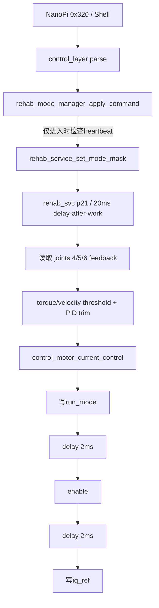
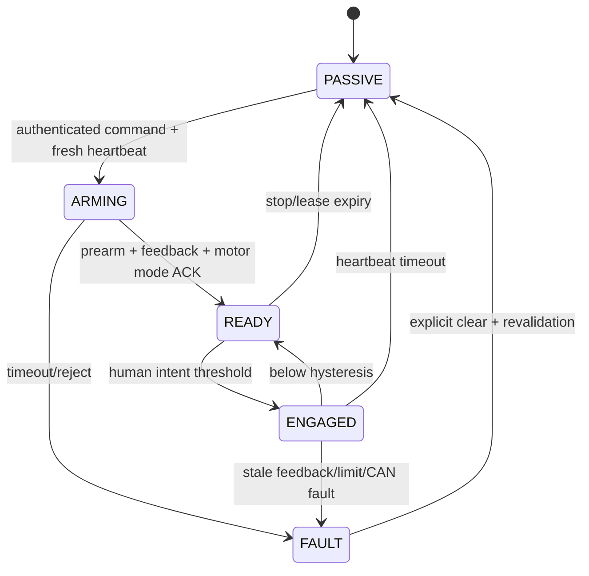
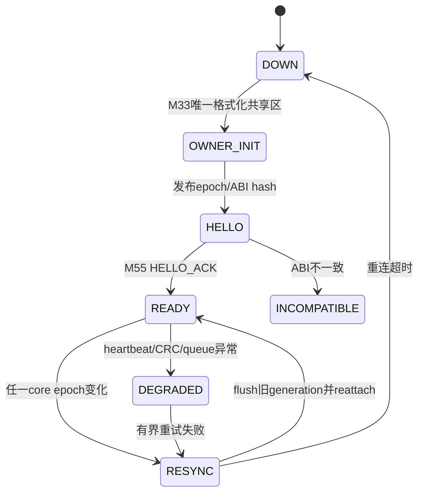
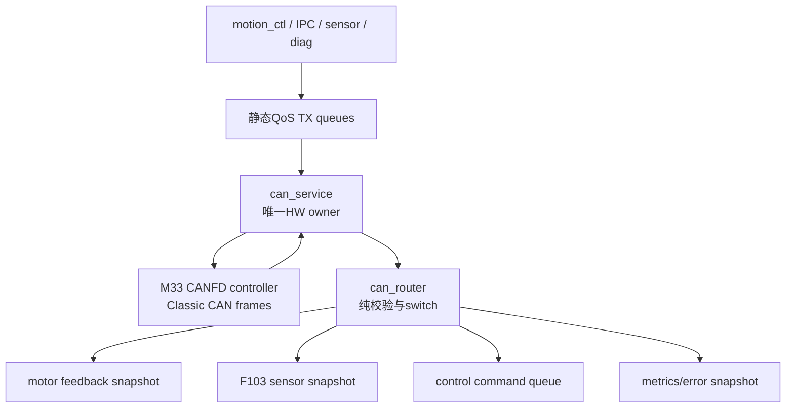
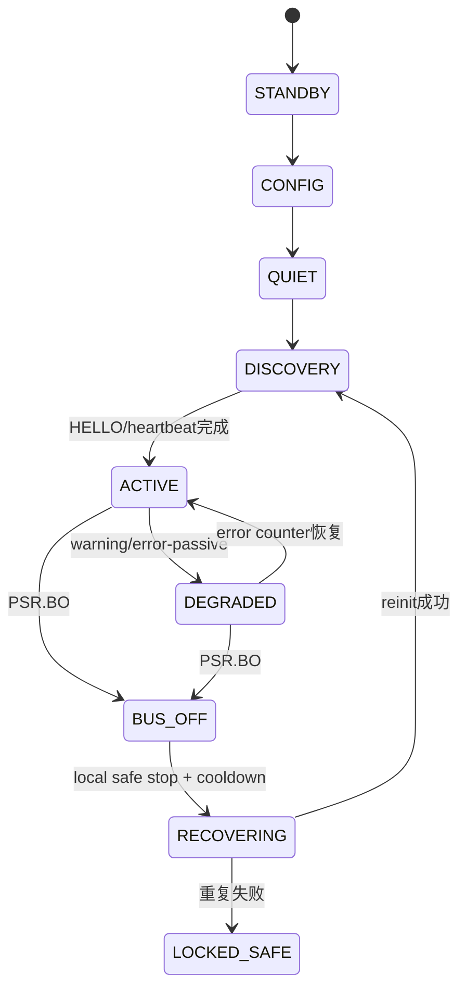

# M33/M55 康复机械臂系统架构审计与优化总纲

> 审计日期：2026-07-10
> 文档性质：代码与已有文档的只读架构审计，不代表所有结论均已上板验证
> 当前重点：助力模式、RT-Thread 调度、双核 IPC、CAN、F103、NanoPi、云端、HardFault、BLE/App 配对
> 安全边界：M33 是唯一运动安全与执行权威；M55、语音、App、NanoPi、云端只能提交建议或命令请求

## 1. 文档目的

本文件把此前分散在 CAN、HardFault、IPC、EMG、NanoPi 和云平台文档中的结论合并为一份系统级基线，回答以下问题：

1. 为什么助力模式进入后可能没有力量，当前代码还缺哪些运行条件。
2. 多线程和事件驱动应该如何分工，怎样证明任务可调度。
3. M33/M55 共享内存是否需要锁，怎样处理 cache、复位、积压和 ABI 漂移。
4. 怎样保证 `M55 推理 -> M33 -> CAN -> NanoPi -> 云端` 可追踪、可恢复、可解释丢包。
5. 怎样把当前 CAN 改造成更接近工业现场要求的通信系统。
6. 小智语音切模式为什么曾触发 HardFault，怎样避免再次出现。
7. 新增 BLE 配对代码当前有哪些正确性、安全性和实时性不足。
8. 工程是否已经臃肿，应该怎样拆分而不引入新的过度设计。
9. 参加嵌入式设计竞赛前，哪些能力必须形成可重复的验收证据。

本文不是立即实施的代码计划。所有优先级、周期和时延目标都是第一版工程门槛，必须由真实硬件 WCET、总线负载和故障注入结果校正。

## 2. 审计基线与证据规则

### 2.1 本次读取的版本

| 子系统 | 本地基线 | 提交 | 状态说明 |
|---|---|---|---|
| M33 当前基线 | `Edgi_Talk_M33_Blink_LED` | `99721d1dde8e` | 当前工作区有用户未提交内容，本次不修改 |
| M55 | `Edgi_Talk_M55_Blink_LED` | `af6e81c18ec8` | 当前 M55 审计基线 |
| M33 BLE 候选 | `F:/wt/m33-ble-pairing-20260710` | `c695548b305a` | 默认关闭、尚未形成硬件验收证据 |
| STM32F103/C8T6 | `F:/wt/c8t6-origin-latest` | `28b79a09dd48` | 经典 CAN 传感节点 |
| NanoPi 正式线本地快照 | `F:/wt/nanopi-origin-latest` | `fc8cac0da9a3` | 与特性线能力不同 |
| NanoPi ROS2 特性线 | `F:/wt/nanopi-ros2-architecture-emg` | `5d06ba387510` | 含 `0x323` 解析和 `model_state` |
| Android App | `F:/wt/app-sync-20260710` | `ff6764650af1` | `ChillAmnesiac/Medical-Rehabilitation-Manipulator`，branch `codex/app-sync-20260710`；同时存在 BLE、SPP 等多套通信实现 |
| 平台仓库/API | `F:/wt/platform-ai-latest` | `eaa08a40cdd3` | `wenjunyong666/ai-`，branch `app/rehab-arm-mobile-stitch`；已复核当前 `rehab_arm` API |
| 云端 MVP | `cloud/rehab-platform` | 随 M33 基线 | FastAPI + SQLite MVP |

当前同时存在独立 Android 仓库和平台仓库中的 mobile stitch 线，本次代码事实不足以判断哪一套是比赛/发布 App 权威源。发布前必须在 `release-manifest`中指定唯一 App repository + branch + commit + package/version；另一套只能作为历史或集成测试源，不能双向继续打补丁。

M33 审计对象不是纯提交 `99721d1dde8e`，而是该提交加 2026-07-10 本机 dirty worktree snapshot。正式引用本审计前，必须保存 `git status`、dirty file list、`git diff --binary`及其 SHA-256；否则涉及未提交文件的行号和结论只能代表本机快照，无法由 commit 单独复现。

比赛或发布时必须生成一份 `release-manifest`，固定以上各组件提交、模型 hash、CAN 协议版本、IPC ABI 版本、编译开关和固件 hash。不能再用“某个分支曾经验证过”替代当前发布镜像的可重复证据。

### 2.2 结论可信度

- **代码已确认**：从当前源码、配置或提交差异可直接证明。
- **高置信推断**：代码结构足以产生风险，但还缺示波器、错误帧、fault 寄存器或运行时 trace 证明本次现场故障就是它。
- **待上板验证**：必须通过真实硬件测量，不能仅凭静态代码下结论。

### 2.3 本次验证边界

- M33 `tools/test_rehab_mode_static.py`通过；它只验证静态契约，不证明线程实际获得 CPU、控制周期或电机输出正确。
- BLE 候选 `tools.test_ble_pairing_resource_static`共 4 项通过；它只证明默认关闭和资源边界等静态条件，不证明配对、加密、断电恢复或射频稳定性。
- 本次没有改动固件功能代码，因此没有重新 build/flash；也没有把 M33、M55、F103、NanoPi、App 和云端部署为同一 release 做硬件闭环。
- 现场测量结论只引用已有、能对应到明确日期和配置的报告；其余运行时结论均保留“待上板验证”标签。

## 3. 执行摘要

项目的优势是真实硬件链路长、边缘 AI 与康复控制结合紧密、已有大量调试记录，且总体安全理念正确：M33 保留最终运动权限。

当前首要矛盾不是功能不够，而是运行时所有权和交付语义不清晰：

1. M33 `main` 以优先级 10 长期忙轮询且没有无条件 yield/block，康复线程优先级 21；main 不因 CAN 等路径进入阻塞时，助力服务没有调度保证并会出现确定性饥饿窗口。
2. M33 CAN RX/TX 均有多个潜在调用者，底层又共享 scratch 和固定 TX mailbox 0。
3. 助力循环每个周期、每个关节重复切模式、使能和写电流，包含固定延时和同步 CAN 等待，无法形成确定的 20 ms 周期。
4. `rehab_mode_manager_tick()` 是空函数且没有调用者，NanoPi 心跳只在进入模式时检查，进入后掉线不会主动退出助力。
5. M33/M55 当前是“单个可变共享槽 + 深度 5 通知队列”，数据缓冲能力实际上仍为 1。
6. M55 IPC 消费、语音分发和 TFLM 推理处于同一执行链，存在 50 ms 轮询延迟和队头阻塞。
7. 模型序号在 M55 publisher、IPC 层和 M33 CAN 层连续重写，云端无法反查原始 EMG 窗口。
8. F103、M33、NanoPi、云端各跳缺少统一 ACK、重试、去重、outbox 和复位 generation。
9. 新 BLE 候选只实现 RAM bond，未强制加密写权限，设备地址固定，App 命令又没有可靠执行/确认语义。
10. NanoPi uploader 默认明文 HTTP、空 token 和通用设备 ID，当前平台 sensor-state 路由又无认证 dependency，线上网关/TLS/部署 SHA 未知。
11. 正式分支、特性分支、文档和现场镜像能力不一致，当前缺少一个真正可复现的系统 release。

因此推荐采用**渐进式单所有者架构**，不做一次性大重写，也不引入通用事件总线：

- 每个硬件资源只有一个 owner task。
- 每个控制状态只有一个写者。
- ISR/callback 只通知和复制固定描述符。
- 按业务定义 latest-wins、at-least-once 或本地 fail-safe，不追求虚假的全链路 exactly-once。
- 先建立指标和验收，再拆文件和调算法。

## 4. 当前系统链路

```mermaid
flowchart LR
    F103["F103/C8T6<br/>CAN 0x7C2/0x7C3"] --> M33CAN["M33 main p10<br/>忙轮询 CAN"]
    M33CAN --> FB["电机/传感反馈缓存"]
    FB -. "main持续ready时，rehab_svc p21无调度保证" .-> ASSIST["助力策略与电流输出"]
    M33CAN --> EMG["m55_emg p10<br/>默认不启动"]
    PCM["M33 PCM writer"] --> SLOT["单个 64 KiB 共享槽"]
    EMG --> SLOT
    SLOT --> Q1["M33->M55 IPC queue depth=5"]
    Q1 --> XZ["M55 xz_bridge p17<br/>50 ms轮询"]
    XZ --> ML["同步 TFLM 推理"]
    ML --> Q2["M55->M33 IPC queue depth=5"]
    Q2 -. "M33 IPC默认不启动" .-> PUMP["M33 IPC pump p9"]
    PUMP --> CAN323["同步 CAN 0x323<br/>单次发送"]
    CAN323 --> MODEL["NanoPi特性线<br/>/rehab_arm/model_state"]
    SENSOR["NanoPi /rehab_arm/sensor_state"] --> UP["sensor_state_uploader"]
    MODEL -. "当前未订阅model_state" .-> UP
    UP --> EXT["外部 /api/rehab-arm/v1<br/>线上部署SHA未知"]
    MODEL -. "仅显式data_collection启动" .-> REC["可选JSONL recorder"]
    SENSOR -. "仅显式data_collection启动" .-> REC
    MVP["仓内 cloud/rehab-platform"] -. "未证明连接到当前uploader" .-> UP
    APP["Android App"] --> BLE["BLE NUS候选<br/>RAM bond/命令单槽"]
    BLE -. "当前无命令消费者" .-> M33CAN
```



这张图中最危险的并不是某一处丢包，而是多个模块都认为自己可以直接消费 FIFO、发送 CAN、切换模式或初始化服务。

## 5. P0/P1 问题总表

| 等级 | 问题 | 直接后果 | 主要证据 |
|---|---|---|---|
| P0 | M33 `main` p10 忙循环没有无条件 yield/block，`rehab_svc` p21 | main 持续 ready 时 p21 无调度保证，只在 p10 因具体路径阻塞时获得机会 | `applications/main.c:1037`，`control_layer_cfg.h:1183` |
| P0 | CAN RX/TX 多所有者，TX 固定 mailbox 0 且发送前 cancel | 具备覆盖 scratch、取消其他发送者 buffer 的充分条件，可解释掉线但尚无单次现场 trace 闭环 | `drv_can.c:847-903`，`m55_emg_stream_bridge.c:195` |
| P0 | 助力每周期重复 mode/enable/delay/write | 周期严重超时，多关节不同步 | `control_layer.c:3957-3991`，`rehab_service.c:721-740` |
| P0 | 心跳只做进入门禁，`tick()` 为空 | NanoPi 掉线后仍可能保持助力模式 | `rehab_mode_manager.c:129-155,229-231` |
| P0 | assist 准入未强制执行 pre-arm，现有 pre-arm 又缺标定检查，worker 不检查 `fault_summary` | 未标定或新鲜但带故障的反馈仍可能进入电流输出 | `control_layer.c:2355-2457`，`rehab_mode_manager.c:129-188` |
| P0 | 共享内存单槽被 PCM/EMG 两个生产者写 | 两个 producer 同时启用或并发发布时会覆盖、撕裂、seq mismatch；当前 EMG inference auto-start 默认关闭 | `main.c:264`，`m55_emg_stream_bridge.c:120` |
| P0 | 两核 MTB IPC 使用相同 IRQ 配置 | 违反库契约，attach/中断不稳定 | 两侧 `m33_m55_comm.c:16-17`，`mtb_ipc.h:395` |
| P0 | 历史小智回调在未初始化控制锁上直接切模式 | 可触发 RT-Thread mutex assert/fault | 提交 `05b515b9` 与回退 `bccc4b47` |
| P0 | F103 ABOM 关闭，M33 无完整 bus-off 恢复状态机 | 上电无 ACK 后可能长期不可用 | F103 `Core/Src/can.c:47`，M33 `drv_can.c` |
| P0-before-enable | BLE 控制特征未强制加密且身份固定 | 未授权写、设备冲突、错误绑定风险；候选固件默认关闭，启用前必须清零 | BLE 候选 `cycfg_gap.h:27`、`bt_app_gatt_db.c:23-26` |
| P1 | IPC/模型/CAN 序号逐跳重写 | 无法定位哪一跳丢失 | M55 publisher、comm publish、M33 `control_layer.c:1704` |
| P1 | 一个 IPC 队列混合模型、语音、TTS、ACK | 队头阻塞和 QoS 反转 | 两侧 queue depth 5 与 dispatch 代码 |
| P1 | M55 voice 初始化失败后重试会 memset 已注册 RT object，partial start 无 join | 对象链表损坏、重复 worker、随机 fault | M55 `voice_service.c:4380-4576` |
| P1 | M33 CAN 过滤器近似全收，FIFO0 仅 16 且覆盖 | 低价值帧覆盖关键帧 | `libraries/HAL_Drivers/CAN_config.h:126-151` |
| P1 | NanoPi SocketCAN RX 出错直接退出 | `can0` down/up 后永久失联 | 特性线 `psoc_can_bridge_node.py:378-386` |
| P1 | NanoPi subscriber 回调内同步 HTTP | 最长数秒阻塞 ROS 回调 | `sensor_state_uploader_node.py:201-237` |
| P1 | NanoPi uploader 默认 HTTP、空 token、通用 device ID，平台 sensor-state route 无 auth dependency | 可被窃听/伪装/串设备；外围网关是否补救未验证 | uploader、systemd unit、平台 `router.py:1129-1133` |
| P1 | 云端无事件幂等键、设备硬件身份无密码学证明 | 重复入库、绑定抢占或竞态 | `rehab_app.py:447-477,480-515`，`models.py:29-52` |
| P1 | BLE App 宣称 connected/accepted 早于真实完成 | UI 和设备真实状态漂移 | `BleConnectionManager.kt:51-75,117-136` |

`P0-before-enable`表示该功能当前默认关闭，不是现有运动主链的在线 P0；但任何比赛或产品 profile 一旦启用 BLE，必须先修复并完成验收，不能用“默认关闭”掩盖上线门槛。

## 6. M33 任务调度与事件驱动

### 6.1 当前调度为什么不成立

RT-Thread 优先级数字越小越高。当前关键事实：

- soft timer：优先级 4。
- FinSH：优先级 8，可直接运行 CAN、模式和电机 Shell 命令。
- M33 main：优先级 10，并在 minimal 路径永久执行 `while (1) + control_layer_poll_once()`。
- `rehab_svc`：优先级 21。
- 可选 CAN/ROS/motor status 线程：18/19/20，但当前编译关闭。
- IPC pump：优先级 9，默认不启动。
- EMG bridge：优先级 10，默认不启动。

main 不阻塞时，所有数值大于 10 的普通线程都无法获得运行机会。这个缺陷不是“偶发负载过高”，而是确定性饥饿。

### 6.2 推荐 M33 任务表

| 任务 | 初始优先级 | 触发/周期 | 初始预算 | 唯一职责 |
|---|---:|---|---:|---|
| `motion_ctl` | 5 | 5 ms safety，10 ms motion，绝对周期 | 1.0 ms | 模式、安全、助力策略、setpoint 决策 |
| `can_io` | 6 | CAN event；第一阶段可 1 ms 兜底轮询 | 0.8 ms/激活 | 唯一 CAN RX/TX/error/recovery owner |
| `ipc_io` | 8 | IPC callback/event + recovery timer | 0.5 ms/激活 | 唯一 IPC queue owner，只校验、复制、路由 |
| `sensor_pipe` | 10 | 新 F103 sample 或 20 ms | 0.7 ms | 拼接 EMG 窗口，提交 descriptor |
| `health_diag` | 18 | 100/1000 ms | 2 ms | 心跳、指标、低频 telemetry、日志 |
| `main` / Shell | 27/28 | 永久阻塞等待 | 非实时 | 组合启动和诊断命令 |

上述数字不是最终答案。必须先测 `C_i`、阻塞时间 `B_i` 和周期 `T_i`，再用响应时间分析：

```text
R_i = C_i + B_i + sum(ceil(R_i / T_h) * C_h)
要求 R_i <= D_i
```

### 6.3 推荐 M55 任务表

| 任务 | 初始优先级 | 触发方式 | 职责 |
|---|---:|---|---|
| `ipc_io` | 6 | IPC IRQ/event | 唯一 MTB queue owner，分流到本地有界队列 |
| `ml_exec` | 8 | 模型 descriptor | 唯一 TFLM/model owner，EMG latest-wins |
| `audio_io` | 10 | DMA/PDM event | 音频 ring，不轮询 |
| `voice_actor` | 14 | command/event | 唯一 voice 状态所有者 |
| `tts_io` | 16 | slot semaphore | TTS 有界 ring，不阻塞 ML |
| `wifi_actor` | 19 | link/command/retry timer | 合并 auto/scan/join/status/reconnect |
| LVGL / main / Shell | 21/29/30 | 33 ms/阻塞 | UI 只读 snapshot，Shell 只投递命令 |

### 6.4 事件、队列和锁选择

| 场景 | 推荐机制 | 规则 |
|---|---|---|
| 急停、bus-off、link up/down | `rt_event` bit | 状态可以合并；急停必须锁存 |
| ISR 通知有数据 | `rt_sem` + ring | semaphore 负责唤醒，不承载 payload |
| 模式/配置/ACK | 固定深度 `rt_mq` | 值拷贝、带 source/seq/TTL，禁止裸指针 |
| 高频 setpoint | latest mailbox 或 seqlock | 旧 setpoint 不排队，过期立即丢弃 |
| 不可跳过命令 | 有界 FIFO | 满时返回 BUSY 并进入可诊断降级 |
| 状态/遥测 | immutable snapshot | 允许覆盖，累计 overwrite/drop |
| EMG/PCM bulk | 共享 SPSC ring | IPC 小消息只传 slot descriptor |
| 同核服务状态 | actor 单写者 | 读者只取快照，尽量无锁 |
| 跨核初始化 | hardware semaphore | 只保护短元数据，有限超时 |

硬规则：

1. ISR、timer callback、control task 禁止 heap、printf、文件和阻塞 I/O。
2. 持 mutex 时禁止 CAN TX、IPC put、socket、HTTP、文件和 `rt_kprintf`。
3. 不同时持有两个模块锁；确需嵌套时建立全局 lock rank。
4. CAN/IPC 每次 drain 限制帧数或执行时间，禁止无界 `while (consume == OK)`。
5. 周期任务使用绝对 `next_release`，不能执行后再 `mdelay(period)`。
6. Shell 只能向 owner task 投递命令，不能重初始化外设或直接改控制状态。

### 6.5 怎样证明调度可靠

每个关键任务至少维护：

```text
release_count, finish_count, deadline_miss_count
max_exec_cycles, max_response_cycles, max_start_jitter
queue_high_water, drop_by_reason, alive_seq
stack_min_free, lock_max_hold_cycles
```

使用 DWT CYCCNT 采样，scheduler hook 只写固定长度 RAM trace。hardware watchdog 只能由 supervisor 喂，并按 release profile 检查当前声明为 required 且处于 READY/ACTIVE 的 actor。本地 `motion_ctl/can_io/safety`失活应触发强制复位；M55/IPC/云端若在该 profile 可选，缺失应进入 DEGRADED/PASSIVE，而不是让 M33 陷入 watchdog reset loop。

## 7. 助力模式专项审计

### 7.1 当前助力调用链



### 7.2 “进入助力但没有力”的已确认原因候选

1. **服务线程没有可调度性保证。** `rehab_svc` p21 低于忙循环的 main p10；main 持续 ready 时 p21 会饥饿，只有当上层路径因 CAN 等操作阻塞时才可能得到短暂运行。当前没有 runtime trace 证明其实际执行比例。
2. **助力没有满足触发门槛。** 默认 torque enter 为 0.5 Nm、exit 为 0.3 Nm；速度 fallback enter 为 0.01 rad/s。反馈偏置、量纲或噪声未标定时，策略可能一直输出 STOP。
3. **反馈过期会整组停机。** joints 4/5/6 任意一个反馈超过 100 ms，整组进入 stopped-for-fault。
4. **控制周期不可控。** 每关节最少固定延时 4 ms，三个关节仅固定延时就达到 12 ms；再叠加多次同步 CAN，已接近或超过 20 ms 设计周期。把 9 次单次最多 20 ms 的发送等待、12 ms 固定 delay 和末尾 20 ms delay-after-work 相加，正常无旧 pending 时的显式挂起预算可达约 212 ms；若每次发送前还等待取消旧 pending，粗算可达约 392 ms。这不是 CPU WCET 或系统响应时间上界：发送失败会提前返回，而高优先级 main 还可能让 p21 无限期等待。它只说明当前 20 ms 周期假设不成立，真实 inter-release/response 必须上板打点。
5. **每周期重复 arm。** run mode 和 enable 应在模式进入时完成一次，循环中只刷新 setpoint。
6. **方向配置未真正接入。** `assist_direction_mask` 和 `CONTROL_REHAB_ASSIST_JOINT*_TORQUE_SIGN` 没有调用点；worker 给所有关节固定传 `torque_sign=1.0f`。
7. **模式命令参数被忽略。** `max_velocity_rad_s`、`assist_torque_enter_nm`、`assist_direction_mask` 只存在于结构声明，当前 manager/service 没有消费。
8. **心跳超时没有持续执行。** `rehab_mode_manager_tick()` 为空且无调用者。
9. **没有明确的 source lease/arbitration。** Shell、NanoPi、未来 BLE/语音可以覆盖模式，缺少“谁拥有当前会话”的租约。
10. **算法使用固定 `dt=20 ms`，执行周期却是 delay-after-work。** CAN 阻塞会直接改变真实积分/微分时间；STOP 又在每周期下发 disable，门槛附近可能在 enable/disable 间抖动。
11. **现有 static test 只检查符号存在。** `tools/test_rehab_mode_static.py` 能通过，但没有测试 heartbeat expiry、周期、重复命令、方向、setpoint 更新或 CAN 失败恢复。

### 7.3 安全缺口

`rehab_mode_manager_apply_command()`目前主要检查非被动模式 heartbeat、支持的模式和 joint mask；`rehab_service_set_mode_mask()`没有显式调用 pre-arm/estop/power gate。`control_motor_current_control()`只检查初始化、限流和协议类型。也就是说，当前远程 assist 路径缺少一个统一、持续运行的 safety supervisor 门禁。

更具体的缺口是：

- 现有 `ctrl_prearm_check_build()`能检查 logging-only、heartbeat、急停、电源、限位、feedback freshness 和 motor fault，但不检查关节标定。当前 `CONTROL_DEVELOPMENT_BENCH_MOTION_ENABLE=1`、`CONTROL_CLINICAL_MOTION_ENABLE=0`构建下，`0x322`直接报告 bench 状态，pre-arm 实际只用于 Shell 诊断；clinical 分支才会在 `0x322`中调用它。正式 assist 准入必须先补标定检查，再强制调用统一 gate。
- Shell 的 `rehab assist`直接进入 `rehab_service_set_mode_on_m33()`，绕过 mode manager 的 heartbeat 和未来的远程命令准入；它只能保留为显式 bench 权限，不能与产品控制路径共用。
- 电机反馈已经解析并保存 `fault_summary`，但助力 worker 只判断 timestamp freshness，没有拒绝“反馈新鲜但电机正在报故障”的情况。
- 进入模式后的 heartbeat 没有周期性复核；即使首次准入成功，NanoPi 随后断线也不会触发自动降级。

建议模式状态机：



状态转换必须由唯一 `motion_ctl` 执行。语音、BLE、App、NanoPi 只提交带 `source + txn_seq + TTL` 的请求。

### 7.4 控制方法建议

短期不要直接上 ADRC 或复杂自适应算法。先建立可解释的单关节基线：

1. 进入 `ARMING` 时一次性切电流/速度模式并确认 ACK。
2. 估计静止 torque bias，做低通滤波、deadband 和可信范围检查。
3. 控制循环只生成最新 setpoint，CAN task 异步发送。
4. 每关节独立配置 torque sign、gear ratio、current limit、velocity limit、joint range。
5. 增加 slew、功率/能量窗口、最大连续助力时间和反向检测。
6. 从一个关节、低电流、悬空机构开始；单关节验收后才开放 0x38 三关节组。

对于人机交互，优先推荐**导纳控制**而不是直接“扭矩乘增益得到电流”：

```text
tau_proxy = filtered_motor_torque - gravity_est - friction_est - bias
M_a * d(v_ref)/dt + B_a * v_ref = deadzone(tau_proxy)
v_ref = clamp(v_ref, -v_max, v_max)
```

这里的 `tau_proxy`只是交互力矩代理量；电机估算 torque 同时含重力、摩擦和惯性。在没有关节力矩传感器或经验证的动力学补偿前，不得宣称测得真实人体输出力矩。让电机内部速度/电流环完成更快的执行，M33 外环负责方向、限速、边界和安全。只有在量纲、方向、带宽和电流环都实测可靠后，再评估阻抗控制、adaptive PID 或 ADRC。

### 7.5 助力专项验收

- 单关节 1000 次 `PASSIVE -> ARMING -> READY -> PASSIVE` 无残留电流。
- 心跳停止后在规定 TTL 内进入 PASSIVE，且 heartbeat 恢复不自动重进 assist。
- feedback stale、CAN bus-off、motor fault、超速、越界均锁存 FAULT。
- 10 ms 控制任务 P99 jitter 和 WCET 达标，不包含任何 CAN/IPC 阻塞。
- 三关节 setpoint 时间戳差有明确上限，并由同一控制周期生成。
- 方向测试覆盖正/负外力；任何关节助力反向都禁止进入多关节测试。
- 记录 torque、velocity、bias、current command、actual current、engaged reason、saturation reason。

## 8. M33/M55 IPC 与共享内存

### 8.1 是否需要跨核锁

结论：**需要同步协议，但数据面不要使用跨核阻塞大锁。**

- `rt_mutex`只能协调同一 RT-Thread 内核中的线程，不能成为 M33/M55 跨核锁。
- hardware semaphore 可用于 INIT、format、epoch 切换等极短控制事务。
- 不能持硬件锁跨越 payload copy、推理、CAN 或日志；单核复位会造成长阻塞甚至死锁。
- 数据面应通过单生产者/单消费者所有权、原子槽状态和 release/acquire barrier 保证一致性。
- `volatile`只解决编译器访问可见性，不提供原子性、互斥、内存顺序或 cache 一致性；跨核字段应使用自然对齐的 32-bit metadata、明确单写者和 DMB/cache maintenance。

### 8.2 当前已确认问题

1. PCM 与 EMG 写同一个 `g_m33_m55_pcm_shared`，是本核多生产者。
2. PCM 先发布 seq/header 再 memcpy；EMG 的顺序不同，存在半写数据可见窗口。
3. queue depth 5 只保存 5 个 descriptor，payload 仍只有一份；积压后旧 descriptor 指向已被覆盖的数据。
4. `crc32`当前写 0 且 M55 不校验。
5. 两边各自维护 `m33_m55_comm.h`，结构包含 enum、`rt_tick_t`、float 和大 union，没有统一 ABI hash/static_assert。
6. M33/M55 都把 semaphore/queue IRQ 配成 `MTB_IPC_IRQ_USER+4/+5`；MTB IPC contract 明确要求每个 core 使用不同 IRQ，这是当前实现的直接违规。
7. MTB queue 已启用 IRQ，但应用层 M33 5 ms、M55 50 ms 轮询。
8. queue put 的 timeout 变量以 `_ms`命名，却直接传给要求 `timeout_us`的 MTB API：标称 1000/5000 ms 实际只等待约 1/5 ms，M55 TTS 标称 1000 ms 也实际约 1 ms。`mtb_ipc_get_handle`的 timeout 又确实按 ms，不能全局机械乘 1000；必须拆成 `attach_timeout_ms`和`queue_timeout_us`并逐调用点校准。
9. 任一核复位后没有 `boot_epoch/HELLO/resync`；M33 可能重置共享对象，M55 仍认为自己 initialized。
10. 当前 M55 shared 区是 non-cacheable，因此 cache 不是第一嫌疑，但 compiler/CPU 写序和未来 MPU 变化仍要求 barrier 协议。

### 8.3 推荐数据通道

- EMG：8 槽 SPSC ring，每槽约 192 B。
- Audio：独立 4 槽 ring，每槽按 2/4 KiB 分块。
- M55 result：几十字节，走独立小队列或 result ring。
- HELLO/ACK/config：独立 control queue。
- TTS/audio bulk 不得与 inference result 共用 QoS 队列。
- M33 本地多生产者先进入 `ipc_tx_broker`，broker 成为唯一跨核 producer。

Audio 不能只把当前约 64 KB 单槽机械切成 2/4 KiB：chunk protocol 必须包含 stream/message seq、chunk index/count 或 LAST、total length、每块与整包 CRC、重组超时、缺块策略和 backpressure；否则新 ring 不具备与当前整段 PCM 等价的交付语义。

推荐槽头：

```c
struct ipc_slot_v2 {
    uint32_t magic;
    uint16_t abi_version;
    uint16_t stream_type;
    uint32_t producer_boot_epoch;
    uint32_t source_seq;
    uint32_t correlation_id;
    uint32_t payload_len;
    uint32_t timestamp_us;
    uint32_t deadline_us;
    uint32_t payload_crc32;
    uint32_t state;
    uint32_t commit_seq;
    uint8_t payload[];
};
```

若 `timestamp_us/deadline_us`保留 32-bit，它们约 71.6 分钟回绕，所有期限判断必须使用无符号模差；跨更长会话或云端追踪应改 64-bit monotonic time。不能直接用普通大小比较。

优先使用严格 SPSC：producer 只写 `head`，consumer 只写 `tail`，每槽带 generation；不要先假设 C `_Atomic` CAS 在 CM33/CM55 的共享 SRAM/alias 上一定有跨核 global exclusive monitor。若确需 RMW，必须核对芯片互连、MPU 属性、编译产物和 lock-free 行为，或把极短控制事务交给 HSEM。

`head/tail/state/commit`必须是自然对齐的 32-bit 字段并有 compile-time offset/size assert。所有权 metadata 最好独占 cache line 或固定在 non-cacheable 区。对未来可能 cacheable 的 shared region，发布顺序应为：

```text
producer依据本核head和对端tail选择FREE generation，不做跨核CAS
写 payload
写除READY外的metadata和commit_seq
clean payload/header并等待cache maintenance完成（若cacheable）
DMB + 对齐store-release写READY
clean READY/ownership cache line并等待完成（若cacheable）
发送 slot_id/epoch/seq descriptor
```

消费者必须先 invalidate ownership cache line并等待完成，再 load-acquire 读取 READY；随后 invalidate header/payload、校验 magic/version/epoch/len/CRC 并复制。处理后再次 invalidate 并复读 commit/generation，确认未变化；最后 release 写本核 tail/FREE，clean ownership cache line并等待完成，再通知 producer。cache clean/invalidate 后只写 DMB 不一定保证维护操作完成；应使用已验证内部包含 DSB 的 CMSIS/平台 cache API，或显式 DSB，DMB负责普通内存访问顺序。当前 non-cacheable 映射可省略 clean/invalidate，但不能省略单写者协议、编译器原子语义和 barrier。

MTB queue descriptor/IRQ 只作为 doorbell，不是事实源；ring 的 head/tail/generation 才是事实源。queue full 或 IRQ 丢失时 READY slot 必须保留，producer 有界重试通知，consumer 还要低频兜底检查 ring，避免“数据已提交但通知丢失”造成永久卡槽。

### 8.4 IPC 生命周期



M55 只能 attach，不能重新格式化 owner 的共享区。检测 M33 epoch 改变后必须丢弃旧 handle/slot；M33 检测 M55 epoch 改变后必须回收旧 generation 的 READING 槽。

实现时增加独立、non-cacheable control page：`m33_epoch/m55_epoch/abi_hash/link_state/heartbeat/head/tail`。M33 重新格式化前先发布 FORMATTING 并使旧 handle 失效，完成 ring/control page 初始化后发布新 epoch/READY，M55 观察到新 epoch 后重新 get-handle/attach/HELLO。M33 不能只因 heartbeat timeout 就回收旧 READING 槽；只有观察到新的 M55 `HELLO + m55_epoch`或可证明的对端 reset event 后，才能回收旧 generation，避免慢消费者仍在读时被覆盖。

## 9. M55、语音和 HardFault

### 9.1 已确认 MRAM 根因与语音高置信候选

必须区分两类历史 fault，证据强度不同：

1. **CAN RX 固定 MRAM 地址访问是已上板确认根因。** 既有复盘记录了 Secure HardFault 入口、Non-secure 异常栈和 `drv_can.c`现场：Non-secure M33 直接读取固定 `0x42850000`触发 BusFault/HardFault。改为 CANFD FIFO TOP 寄存器窗口后，`0x321 -> 0x322`恢复并完成回归。这个问题已经修复，但“业务代码不得直接读 MRAM”必须成为永久架构规则。
2. **小智 ASR 未初始化 mutex 是提交级高置信候选。** 代码足以触发断言，但缺少与那次语音故障一一对应的 PC/CFSR，不能等同于已闭环的 MRAM 根因。

历史提交 `05b515b9`把 ASR_TEXT 的 M33 IPC 消费/dispatch 路径直接连接到：

```text
m55_voice_mode_bridge_handle_text()
  -> control_set_mode()
  -> rt_mutex_take(&g_control_lock)
```

同一版本 `M33_XIAOZHI_MINIMAL_FRAMEWORK=1` 又在 IPC 启动后提前 return，跳过 `control_manager_init()`。因此 ASR 到达时会对零初始化、未注册为 mutex 的 `g_control_lock` 调 `rt_mutex_take()`；该代码足以触发 RT-Thread 对象类型断言，是当时频繁 assert/fault 的高置信代码级根因候选。由于缺少对应现场 stacked PC/断言记录，不能把它写成已经闭环证明的唯一根因。该功能随后在 `bccc4b47` 被回退。

这条历史结论不能被简单理解为“小智不能切模式”，而应转化为架构规则：

- IPC ISR、消息 callback 或 dispatch 线程都不能直接切模式或操作电机。
- 所有服务有明确 `UNINIT/STARTING/READY/FAULT` 状态。
- command broker 在模块 READY 之前拒绝或延迟请求。
- 模式切换只能投递给唯一 control owner。
- 回调不得持有外部模块锁或调用可能阻塞的业务。

### 9.2 当前 M55 风险

1. `voice_bt`、`xz_auto`、UI 和 IPC 控制都可能调用 `voice_service_init/start()`，初始化只检查普通 bool 后就 memset 全局对象、初始化 mutex/sem 和分配内存。
2. `voice_service_init()`先注册静态 mutex/sem，再逐个申请大缓冲；任一后续申请失败时没有 detach 已注册的 RT object。下一次重试再次 memset/re-init 同一对象，可能破坏 RT-Thread 对象链表，而不仅是普通内存泄漏。
3. `voice_service_start()`先创建三个动态线程对象，全部创建成功后才统一 startup；中途创建失败没有 `rt_thread_delete()`已经创建但尚未启动的线程对象和动态栈。这里需要 failure rollback，不是 join。
4. `voice_service_stop()`只设置 `running=false`并断开 WebSocket，没有 release 等待中的 semaphore，也没有 join/退出确认；快速 stop/start 可能与尚未退出的旧 worker 重叠。`m55_mic`和 WebSocket/reconnect 也存在多个生命周期 owner。
5. `voice_det`持 voice lock 拷贝大型缓冲，临界区过长；TTS pending buffer、Opus decoder reset/consume 的读写缺少一个清晰的单 owner，存在 reset 与 decode 并发风险。
6. voice status 持 voice lock 时读取 WiFi snapshot，形成跨模块锁顺序。
7. `xz_bridge`既是 IPC owner，又同步执行模型与语音分发。
8. IPC runtime prepare 没有串行化保护，并在 handle/READY 完整建立前打开 IRQ；复位残留 pending IRQ 或并发 prepare 可能观察到半初始化状态。
9. 动态 reconnect/stop helper thread 会增加 heap 碎片和生命周期竞态。
10. `M55_WIFI_LVGL_ONLY=1` 的日志与实际仍启动 voice 相关线程不一致。

### 9.3 堆栈与内存管理

当前本地 ELF 仅作为容量参考，并不保证和最新源码完全同步：

| 核 | `.bss` | 链接 heap 区 | shared 区 | 说明 |
|---|---:|---:|---:|---|
| M33 | 约 48 KB | 约 193 KB | 约 64 KB | 运行时线程栈仍从 heap 消耗 |
| M55 | 约 184 KB | 约 1.43 MB | 约 64 KB | 另有较大 GPU/图形缓冲 |

“heap 看起来很大”不能证明安全。`voice_service`初始化时仅两个 PCM buffer 就是 2 x 320000 B，再加 98304 B TTS pending buffer，合计 738304 B（约 721 KiB）；intent arena 约 64 KiB、wake arena 约 32 KiB，尚未包含 decoder、网络、LVGL 和动态线程栈。voice/TTS/detect 线程单个栈可达 24/32/64 KB，峰值和最大连续空闲块比总 free 更重要。

M55 `rtconfig.h`同时启用 `RT_USING_MEMHEAP_AS_HEAP`和 `RT_USING_MEMHEAP_AUTO_BINDING`。这意味着默认 heap 不足时，分配可能进入已注册的外部 memheap；但常用 `rt_memory_info()`未必覆盖所有 memheap，也不能反映最大连续块。因此“系统 heap 仍有余量”不能证明 HyperRAM/各内存域都健康，必须逐 heap 输出 total/used/max-used/largest-free/fail-count。

建议：

- CAN、control、IPC、ML、audio 等关键线程使用静态线程对象和静态栈。
- TFLM arena、音频 ring、共享 ring 分区静态分配，运行期禁止 resize。
- 关键控制栈、IPC metadata 和 DMA descriptor 固定放内部 SRAM；大音频/模型缓存才使用显式 external-memory pool。不要让 auto-binding 在内存压力下把实时对象不可见地迁移到不同延迟/缓存属性的内存域。
- reconnect 使用常驻 actor + timer，不创建一次性线程。
- 禁止在 ISR、控制周期、IPC broker 中 malloc/free。
- 持续记录 heap total/free/min-free/max-block/alloc-fail。
- 线程栈按实测最大使用量加至少 30% 余量，并包含异常嵌套与库调用峰值。
- 移除 callback 中 512 B 以上局部数组和大对象拷贝，改用 owner task 的有界 buffer。

### 9.4 崩溃取证

每核在 retained/noinit RAM 保存：

```text
magic, crash_seq, boot_epoch, core_id
HFSR, CFSR, MMFAR, BFAR, SFSR, SFAR
MSP, PSP, LR, stacked_pc, stacked_xpsr
current_thread, stack_base, stack_size, stack_min_free
last_can_event, last_ipc_seq, last_mode_txn, last_lock_rank
```

重启后先上报 crash record 再清除。TrustZone 下 Non-secure dump 为 0 不能直接判定没有 HardFault，还要检查 Secure handler 与异常栈。

## 10. 工业级 CAN 总线方案

### 10.1 当前 M33 问题

- `ifx_can_direct_send()`复用同一 scratch，固定 mailbox 0，每次发送前 cancel，最多同步等待 20 ms，无唯一 owner。
- main、EMG、旧 heartbeat、可选 RX thread 和 Shell 都可能消费同一 FIFO。
- standard/extended filter 数量近似为 0，非匹配帧进入 16 槽 overwrite FIFO0，FIFO1 未使用。
- direct PDL 路径关闭 NVIC，RT-device 路径又没有完整 error mask。
- 没有 warning/passive/bus-off/recovering 状态机。
- `0x320`当前协议没有可靠事务 seq：现行代码和 NanoPi 协议把 Byte1 定义为 `joint_id`，历史 HardFault 文档曾把它描述为 seq。没有独立 command sequence 就无法可靠地做去重、重放防护和 command-to-ACK 关联，必须在协议升级时显式增加，而不能继续复用 Byte1。

### 10.2 F103 已有能力与缺口

已有优点：精确 `0x7C0`过滤、16 槽优先 TX 队列、部分 command seq/duplicate ACK 缓存。

主要缺口：

- `AutoBusOff=DISABLE`，冷启动无 ACK 时可能无法自动恢复。
- error callback 主要入队/打印，没有完整 supervisor。
- 队列满时高优先级 ACK 没有保留槽。
- 1 ms tick 持续进入事件队列，队列满时可能静默丢弃。
- `HAL_CAN_AddTxMessage()`成功后就增加发送计数并释放软件槽，没有以 TX-complete/abort callback 确认真正上总线，也没有失败重入队；当前“tx success”只代表进入 bxCAN mailbox。
- UART/CAN 逐帧日志可能阻塞实时路径。

F103 是 bxCAN 节点，整条兼容总线应继续使用 Classic CAN 8-byte frame；不能因为 M33 控制器支持 CAN FD 就直接发 FD 数据帧。

已有硬件测量能进一步缩小问题范围：在 `f103_ping 100 10`中，M33 发出 100 个请求只匹配 16 个 ACK，收到的 ACK 延迟约 1089-1137 ms；同时 TEC/REC/CEL、测量到的 FIFO overflow 和 TX timeout 都为 0。这降低了物理层/总线带宽是主因的可能性，并支持“应用层服务率或调度受限”的判断，但不能单独证明瓶颈一定在 F103：M33 自身还有 16 槽 overwrite FIFO、轮询和多消费者风险，也可能覆盖 ACK。该报告记录的是 `build Jun 17 2026 16:06:13`镜像，没有当前 M33/F103 release SHA，只能作为历史基线。冷启动时 M33 又会连续发送 SET_RATE、START_STREAM 和兼容 enable 命令，只检查“发送成功”，不等待对应 ACK；因此上电阶段很容易把“控制器已接受发送”误判为“F103 已配置成功”。

### 10.3 唯一 CAN owner



第一阶段可保留 1 ms 有界轮询，避免再次触发未验证的 TrustZone IRQ 问题；确认中断路由后再改为 RX/TX_DONE/ERROR event。无论哪种方式，其他模块都禁止直接调用 `ifx_can_direct_send/recv/reinit`。

### 10.4 CAN QoS

| 类别 | 语义 | 拥塞策略 |
|---|---|---|
| P0 STOP/故障/急停 | 本地安全动作优先 | 保留槽；重复直到观察到安全状态 |
| P1 模式/配置/ACK | at-least-once | `boot_epoch + txn_seq`、去重、ACK/NACK、有限重试 |
| P2 关节 setpoint | latest-wins | 每关节合并，带 TTL，禁止补发旧轨迹 |
| P3 模型/训练事件 | 到 NanoPi 持久层 at-least-once | M33 运行期有界 RAM queue，NanoPi commit 后 ACK；跨 M33 复位需 M55 replay 或本地 NVM |
| P4 motor/F103 telemetry | latest state | 高水位淘汰旧帧并计数 |
| P5 debug log | best effort | 永远不能影响 P0-P4 |

CAN 仲裁优先级由 ID 决定，软件队列不能弥补 ID 设计。STOP 应使用独立且更低数值 ID，不应与普通模式命令共用 `0x320`。

### 10.5 CAN 状态机



bus-off 时 STOP 帧也发不出去，因此每个执行节点必须有本地 command watchdog：setpoint 超时后自动归零/失能，不能依赖 M33 再发送 STOP。

### 10.6 冷启动和物理层

1. 初始化期间收发器保持 standby。
2. 初始化 controller、filter、FIFO、software queue。
3. 将收发器切到接收可用，并把 controller 置为 listen-only/bus-monitoring；静默监听 200-500 ms，采集 bus state，不能在 standby 状态下假设能监听总线。
4. 切 normal mode，进入 discovery，发送 HELLO + boot epoch + capability。
5. 收到必要节点 ACK 后进入 ACTIVE。
6. M33 在 F103 ACK 前不启动高频 stream；SET_RATE/START 必须有限重试。

listen-only 只适合总线上另有节点能给现有发送者 ACK 的拓扑；若台架只有两个节点，监听者不 ACK 可能让对端累计错误。冷启动策略必须按实际拓扑验证，双节点可改为收发器接收可用后的短随机退避 + 低频 discovery，而不是机械固定 500 ms 静默。

硬件必须检查：两端各 120 ohm、断电约 60 ohm、stub 长度、CANH/CANL 波形、收发器 STB/EN 上电状态、供电跌落、地电位或隔离、ESD/TVS。没有错误帧和 TEC/REC 证据时，不能把上电问题完全归因于软件。

## 11. M55 推理到云端的可靠闭环

### 11.1 当前链路缺口

1. F103 传感流在当前 minimal 冷启动路径会通过 `control_sensor_report_enable(TRUE, 20 ms)`开启；真正默认关闭的是 `M33_AUTO_START_EMG_M55_INFERENCE`和 `M33_ENABLE_M55_IPC_AUTO_INIT`，因此“采到 EMG”不等于 M33 -> M55 推理闭环会自动建立。
2. M55 result publish 失败后不保留 latest result，也不 retry。
3. result seq 被 comm publish 覆盖，M33 转 CAN 时又生成无关全局 8-bit seq。
4. `ai_inference_msg_t`用 `fatigue_score/pain_risk`临时承载 freshness/window 等非对应语义。
5. M33 在 IPC RX 调用栈里同步发 CAN，失败即丢。
6. NanoPi 正式线与 ROS2 特性线的 `0x323`支持不一致。
7. ROS2 特性线 parser 能发布 `/rehab_arm/model_state`，但该线已提交的 `sensor_state_uploader_node.py`只订阅 `/rehab_arm/sensor_state`，没有 `model_state` subscription；因此 `0x323`到达 ROS topic 仍不等于模型结果已经上传。
8. SocketCAN socket 没有配置 CAN_RAW_FILTER 或 error-frame filter；`OSError`后 RX thread 直接 return，不 reopen socket、不改变进程退出码。主 ROS 进程仍存活时，`systemd Restart=on-failure`也不会自动修复这条“线程死、进程活”的半失效状态。
9. HTTP 在 ROS callback 中同步执行，且在请求成功前就更新 throttle 时间戳；网络阻塞会拖住消息处理，失败样本也会被限流窗口吞掉。当前没有 retry queue、SQLite spool 或交付 ACK。
10. 云端 `legacy_spp_inbound`没有 event id 唯一约束或幂等键，`emg/latest`只扫描最近记录。
11. 特性线上传器默认 URL 是明文 `http://106.55.62.122:8011`，`relay_token`默认空且 service unit 未注入；当前平台 sensor-state 路由本身又没有认证 dependency。外围 TLS/网关是否补救尚未验证，不能宣称有传输机密性、服务端身份校验或设备认证。
12. 上传器默认 `device_id=nanopi-m5`、`robot_id=rehab-arm-alpha`并带固定 project ID；镜像复制到多台 NanoPi 时若未单机 provision，会发生设备串号、latest 覆盖和幂等键碰撞。

### 11.2 端到端相关 ID

当前消息实际只有 comm 层生成/覆盖的 message seq、共享槽 seq 映射的 `chunk_index`和 RT tick timestamp；`sensor.c`的本地 F103 接收计数也不是源端序号。对 M33/M55/F103 applications 的静态搜索没有发现 `boot_epoch/m33_rx_seq/emg_window_seq/correlation_id`实现，M33 消息中也没有持久 `device_id`。这些字段属于 V2 目标，不是现有能力。

协议 V2 第一阶段应由 M33 新增并可本地生成：

```text
device_id
m33_boot_epoch + m33_rx_seq + emg_window_seq
correlation_id
```

`m33_boot_epoch`必须定义每次复位生成/持久化规则，`device_id`必须来自制造身份或受保护 provision，不能使用板型名。`f103_boot_epoch + f103_source_seq`目前也不存在：`0x7C2`的 8 字节全部用于四路 ADC，`0x7C3`没有 boot epoch。M33 新增的 `m33_rx_seq`只能标识“已经被 M33 收到的帧”，不能证明 F103 -> M33 之前是否丢帧。F103 协议 V2 应由 HELLO/health 提供 boot nonce/epoch 和 source seq，或明确把 M33 生成的值命名为 `f103_link_epoch`，禁止伪装成源端序号。

后续 M55、M33 CAN、NanoPi、云端都保留已存在的 source/link ID，只增加本跳状态，禁止覆盖 source seq。

推荐模型结果 V2：

```text
producer_epoch, source_window_seq, inference_seq
model_id, model_version, model_hash32
class_id, confidence_permille, flags
window_ms, inference_time_us, capture_timestamp_us
input_crc32, result_crc32, status
```

### 11.3 区分实时状态与审计事件

- **模型当前意图/状态**：latest-wins，变化立即发 + 5-10 Hz 周期刷新，带 age/TTL，允许丢旧帧但必须统计 gap。
- **训练、疼痛、模式切换、安全事件**：at-least-once，应用 ACK、幂等 event ID、NanoPi 持久 outbox。
- **原始高频 telemetry**：采样或批量，best-effort，记录缺口。
- **安全动作**：本地 fail-safe，不依赖 NanoPi 或云端 ACK。

纯 M33 RAM queue 只保证运行期重试。latest model state 不承诺跨 M33 复位无损，恢复后重发最新状态即可；训练、模式、安全等审计事件若要求在 NanoPi ACK 前即使 M33 复位也不丢，必须由 M55 保留未确认事件并跨新 epoch 重放，或写入 M33 retained/非易失 journal，不能把 RAM queue 称为持久 outbox。

Classic CAN 8 字节无法承载完整 metadata。兼容方案：

- `0x323`若升级为紧凑 latest model state，必须增加可判别的 version/marker 或分配新 ID。现有 NanoPi parser 固定解释 byte2=model、byte3=result、byte4=confidence、byte5=flags、byte6=window、byte7=source_detail，不能静默改成 source seq/age/CRC 布局。
- 低频 boot epoch/model version/seq 高位/drop/error counter 必须由统一 CAN-ID registry 重新分配 ID；不能占用 `0x324/0x325`，因为现有协议已将它们分配给 NanoPi -> M33 rehab mode command 和 M33 -> NanoPi mode status。多个字段也不能硬塞一个 8-byte frame，应使用带 version 的 subtype/page。
- 重要模型训练事件使用分段 event frame 或独立 ACK frame；NanoPi 落盘成功后才 ACK。
- 硬件 CAN ACK 不能当作 NanoPi 应用已接收。

### 11.4 NanoPi outbox

ROS callback 只做校验并投递到有界内存队列；唯一 DB writer 线程负责写 SQLite WAL。只有满足明确 durability contract 的事务 commit 成功后，才允许向 CAN 侧返回“已持久化”应用 ACK：

```text
event_id = device_id:producer_id:producer_epoch:stream_id:event_type:source_seq
```

独立 upload worker 批量发送，指数退避 + jitter；云端 2xx 且返回同一 event ID 后标记 ACK。限制 outbox 的时间和容量；超限时可以淘汰旧实时快照，但不能静默淘汰安全/审计事件。

SQLite 至少固定 `journal_mode=WAL`、`busy_timeout`、单 writer transaction、checkpoint 策略和启动时 integrity/recovery；若承诺掉电后仍在，应使用 `synchronous=FULL`，若选择 NORMAL 必须明确只能承受哪些故障。磁盘满、I/O error、corrupt 或 commit timeout 时必须 NACK/不 ACK 并上报 degraded，不能静默把内存接收当成持久化。

WebSocket 用于实时展示，REST/outbox 作为交付事实来源。

### 11.5 云端改造

本次实际看到两套云端实现，不能混为一个“已经打通”的系统：

1. M33 仓库内的 `cloud/rehab-platform`是 FastAPI + SQLite MVP，已有账户、设备、BLE message、legacy inbound 和 `/emg/latest`。
2. `wenjunyong666/ai-`的历史对象 `43bfa9ce`包含 `/api/rehab-arm/v1/devices/{device_id}/sensor-state`；本次又直接复核当前基线 `eaa08a40cdd3`，相同缺口仍存在。路由函数自身没有项目或设备认证 dependency；事件普通 append 到 JSONL，latest 用 `write_text`直接覆盖，没有 event id 幂等、跨进程互斥、fsync + temporary-file + atomic rename。多 Uvicorn worker 下可能 JSONL 交错、latest 丢更新。线上 `106.55.62.122:8011`是否部署自这两个提交之一、是否由外围网关补 TLS/鉴权都尚未证明。

两套实现都应收敛到同一个可版本化的 telemetry contract，并补齐：

- `telemetry_events`表：`event_id`唯一，或对 `(device_id, producer_id, producer_epoch, stream_id, event_type, source_seq)`建立唯一约束，并返回稳定 `event_id/receipt`。
- `device_latest_state`表：每设备/stream 最新快照，与事件流水分离。
- `Idempotency-Key`支持和重复请求返回同一 receipt。
- payload/schema/version/size 上限，拒绝无限 `raw_text`。
- 服务端记录 duplicate、seq_gap、late、invalid、auth_fail。
- device binding 使用数据库唯一约束，不能只靠先查再插。
- `trust_status`不能接受客户端随意声明为 trusted。
- 设备绑定必须证明硬件身份，而不是只信 BLE 名称或客户端提交的字符串。
- 生产链路使用 mTLS，或至少 TLS + 设备级短期凭据、轮换和撤销；禁用默认明文 HTTP/空 token。
- 设备启动时校验 provisioned `device_id`唯一且不等于通用板型名，云端拒绝默认占位 ID。

## 12. BLE 配对与 App 专项审查

### 12.1 正确的部分

- BLE 候选分支默认 `M33_ENABLE_APP_BLE_RUNTIME=0`、`M33_APP_BLE_AUTO_START=0`，不会直接污染 known-good 启动链。
- 有手动 start/status/clear-bonds 命令，便于分阶段 bring-up。
- bond slot 数量固定为 4，基本长度检查存在。
- static test 验证 BLE 默认关闭且没有直接调用 M55 IPC 或运动控制；本次运行 4 项 static test 通过。
- pairing 请求设置为 Secure Connections + bonding，key size 为 16。

### 12.2 已确认不足

| 等级 | 不足 | 影响 |
|---|---|---|
| P0-before-enable | bond、identity key、CCCD 只存 RAM，`app_kv_store_init()`没有真正 KV/flash | 复位后全部丢失，不能称为持久配对 |
| P0-before-enable | NUS RX 只有普通 write permission，系统 security 是 `BTM_SEC_BEST_EFFORT` | 未证明加密的连接也可能写控制特征 |
| P0-before-enable | 固定 public BDA `00:A0:50:11:44:77` 和固定名 `OpenClaw-NUS` | 多台设备地址冲突，云端身份可伪造 |
| P0-before-enable | App 侧没有硬件身份 challenge，云端按客户端提交 `m33_device_id`绑定 | 绑定不是设备所有权证明 |
| P1 | Just Works、无 IO、security request 自动 grant | 无 MITM 证明，不适合作为运动授权 |
| P1 | firmware 回复 `OK` 只表示 parse + 写入单槽；`peek_command()`全工程无调用者 | UI 显示成功但设备没有执行 |
| P1 | command mailbox 只有一个，后来的命令覆盖前一个 | stop/mode/move 可能互相覆盖 |
| P1 | parser 用前缀 `strncmp/sscanf`，无 joint range、finite、TTL、seq、完整帧校验 | 非法或重放命令无法可靠拒绝 |
| P1 | GATT callback 本地分配约 513 B frame，并对每个 event/write 打印 | 增加 BT stack 栈峰值和实时阻塞 |
| P1 | write handler 未明确拒绝非零 offset/prepare write，且在完整长度校验前处理 CCCD 数据 | 分片/长写可能被误当成完整命令，异常 ATT 请求的边界不稳 |
| P1 | telemetry update/send 没有产品调用者 | `stream:on`只改 flag，不会产生持续遥测 |
| P1 | notification 不按 negotiated MTU 分片且不检查 send result | 默认 MTU 下长 JSON 很可能发送失败 |
| P1 | App 未 request MTU，也没有 BLE operation queue | descriptor/write 并发顺序不可靠 |
| P1 | App `connect()`在 GATT 完成前返回 true，service discovery 后立即标 CONNECTED | UI 产生假连接状态 |
| P1 | App 使用 `Thread.sleep()`等待 BLE 操作 | 阻塞线程且不能替代 callback 完成语义 |
| P1 | App 把字符串命令直接 `writeCharacteristic`，连续命令靠 sleep 排序，固件把每次 write 当完整 frame | 当前短命令可能碰巧小于 20 B，未来长命令或并发写会截断、错序或合并失败 |
| P1 | app init 在 advertising/GATT 全部成功前设置 initialized；异步 enable 返回 pending 就先标 RUNNING | 后续异步失败或半初始化失败无法可靠 retry/rollback，runtime 状态可能是假成功 |
| P1 | HCI RX/TX 线程优先级约为 RT p12，动态栈合计约 9 KiB；M33 main p10 永久忙循环 | main 持续 ready 时存在确定性饥饿窗口，且新增 pool/栈没有 high-water 或 runtime trace 证据 |
| P1 | address-resolution DB 容量配置为 0，但恢复 bond 时仍尝试 add 并忽略结果 | 重启后的解析/重连路径即使补了 flash，也可能仍然失效 |
| P1 | `clear_bonds`清 peer bond/CCCD 时没有逐项移除 live address-resolution DB entry | 普通 unpair 后旧 peer 解析项可能仍留在 stack runtime |
| P2 | `get_runtime/get_last_payload`返回无锁内部指针 | 读者可能得到撕裂 snapshot |
| P2 | bond lock lazy init 不是线程安全 once，初始化失败后调用继续无保护 | 并发路径仍可能破坏状态 |

蓝牙绑定还有一个必须单独强调的信任边界：云端 schema/接口允许客户端提交 `trust_status`，而当前绑定只依据 App 上传的 `m33_device_id`，没有由设备私钥或 provisioned secret 完成 challenge-response。BLE bonding 解决的是链路密钥与重连，不自动证明“这个云账号拥有这块硬件”，更不应自动授予运动权限。

### 12.3 BLE 推荐边界

比赛前 BLE 不应直接控制电机。建议按三阶段开放：

1. **Telemetry-only**：唯一设备 ID、加密连接、分片遥测、连接/重连稳定性。
2. **Authenticated command request**：固定二进制 frame、session nonce、单调 seq 和 TTL；CRC只用于随机传输错误检测，运动请求必须另有 keyed MAC 或 AEAD，再进入 M33 command arbiter。仅有 CRC、BLE bonding 或 GATT encryption 都不构成应用层运动授权。
3. **Restricted motion request**：仅在 cloud binding、bond、M33 prearm、source lease、heartbeat 全部满足后开放模式请求；绝不开放裸电流/力矩写。

STOP 可以作为幂等安全请求优先处理，但其他命令必须经过认证。ACK 必须区分：

```text
RECEIVED -> AUTHENTICATED -> ACCEPTED -> APPLIED
                              \-> REJECTED(reason)
                              \-> EXPIRED
```

### 12.4 持久 bond 设计

- 使用两槽 A/B journal，记录 magic/version/generation/length/CRC。
- 先写新槽并校验，再原子切 active generation。
- key material 不打印。普通 unpair 只清 peer link key、peer CCCD、live address-resolution entry 和本地 session credential。
- local identity key 是设备长期身份，只在经过授权的 factory reset/identity rotation 中更换；云端 ownership/unbind 是另一条需认证、可审计的业务流程，不能与 BLE `clear_bonds`隐式绑定。
- 读取失败时进入 unpaired，不自动信任旧 RAM。
- 每台设备使用 silicon unique ID 派生设备 ID；硬件私钥或 provisioned secret 不通过 BLE 明文导出。

### 12.5 BLE/App 验收

- 断电重启 100 次，bond 和 identity 一致恢复。
- 未加密/未绑定连接写 NUS command 必须被 GATT 层拒绝。
- 两台设备同时存在时地址、设备 ID、云端 ownership 不冲突。
- App BLE 所有 descriptor/write/MTU 操作串行化并由 callback 完成。
- 20/185/247 字节 MTU 下分别验证 framing、分片、重组和超时。
- 10000 条 malformed frame/fuzz 无 crash、越界、heap 泄漏或命令误执行。
- 断连时 M33 source lease 过期，非被动模式安全退出。
- BLE、CAN、IPC、M55 voice 同时运行 8-24 h，不增加 control deadline miss。

## 13. 代码架构与臃肿问题

### 13.1 量化现状

- M33 `control_layer.c`约 5858 行。
- M33 `control_layer_cfg.h`约 1426 行。
- M33 `main.c`约 1080 行，BLE 候选进一步增长。
- M55 `voice_service.c`约 4734 行。
- M55 `main.c`约 2264 行。

问题不是文件行数本身，而是一个资源有多个入口、一个模块同时承担 transport/protocol/state/control/Shell，以及旧路径被宏隐藏而没有删除。

已确认的重复或无效骨架包括：

- M33 main、EMG、heartbeat、可选 RX thread 多套 CAN 消费路径。
- direct PDL 与 RT-device 两套 CAN 路径。
- `s_ros_cmd_mq`被初始化且 worker 等待，但静态搜索没有任何 sender。
- 旧 `control_manager`与新 rehab/control layer 形成两个模式世界。
- M55 `xz_bridge`名义是语音桥，实际拥有全部 IPC 与 EMG 推理。
- M55 WiFi/voice/reconnect 存在多个 auto/start helper。
- NanoPi 正式线与 feature line 协议能力不同。
- App 同时保留 BLE NUS、Bluetooth SPP 和其他通信 manager。

### 13.2 推荐模块边界

M33：

```text
main.c                 只做依赖顺序和supervisor启动
can_service.c          唯一CAN HW owner、QoS、bus state
can_router.c           纯decode/validate/switch
motor_protocol.c       private/CANSimple纯编解码
motion_supervisor.c    唯一模式、安全、source lease、setpoint权威
rehab_algorithm.c      纯算法，不创建线程、不发CAN
sensor_store.c         coherent snapshot与freshness
ipc_service.c          唯一跨核broker和epoch状态机
telemetry_service.c    序列化与低优先级上报
system_diag.c          metrics/crash/Shell QA
```

M55：

```text
ipc_service.c
ml_executor.cpp
audio_service.c
voice_actor.c
tts_service.c
wifi_actor.c
ui_adapter.c
```

NanoPi：

```text
can_gateway
state_aggregator
telemetry_outbox
cloud_uploader
```

模块数量不等于线程数量。算法、router、codec 都不应各自创建线程。

### 13.3 保守瘦身顺序

1. 先添加 contract/static test 和运行指标，不改行为。
2. 把 Shell/QA 从巨型文件移动到 diag-only 文件。
3. 建立唯一 CAN/IPC/control owner，改写所有调用点。
4. 删除旧 direct caller、死 MQ、旧 control manager 和冲突协议路径。
5. 最后再减少宏和拆纯算法文件。

不要引入 generic event bus、registry、factory、service locator 或“保留新旧两套以便回退”。回退应该依赖 Git tag/known-good image，而不是永久维护两条运行路径。

## 14. 分阶段优化路线

### Gate 0：冻结和观测

交付：release manifest、当前镜像 hash、统一日志字段、任务/CAN/IPC/heap/stack 指标。

退出标准：任何掉线都能定位为 producer、queue、consumer、driver、bus 或 cloud 中的一段，而不是只看到页面 WAIT。

### Gate 1：M33 可调度和单所有者

交付：main 阻塞；`motion_ctl/can_io/ipc_io`；Shell 命令改为 enqueue；CAN TX/RX 单 owner。

退出标准：24 h 无 deadline miss；控制 task 不调用阻塞 I/O；CAN caller 静态搜索只有 `can_service`。

### Gate 2：助力与 CAN 安全闭环

交付：assist 状态机、持续 heartbeat lease、prearm、一次性 motor arm、异步 setpoint、CAN recovery/QoS/filter。

退出标准：单关节助力方向/限流/超时/掉线/故障注入全部通过，再开放多关节。

### Gate 3：双核 IPC V2

交付：独立 ring、ABI hash、CRC、epoch、HELLO/resync、callback wakeup、QoS 队列。

退出标准：两核任意启动顺序和单核复位各 100 次自动回 READY；100 万窗口数量守恒。

### Gate 4：推理到云端

交付：source seq、M33 有界 RAM result queue/latest snapshot、NanoPi SQLite WAL、SocketCAN reopen、云端幂等 event API。

退出标准：断网 24 h 后恢复，无审计事件丢失，云端唯一 event ID 无重复业务记录。

### Gate 5：BLE telemetry 与绑定

交付：唯一设备身份、持久 bond、encrypted GATT、App operation queue、framing、cloud challenge binding。

退出标准：安全和稳定测试通过后，才允许 BLE 提交受限模式请求。

### Gate 6：结构瘦身与发布

交付：删除双路径、生产/bench/QA 三种明确 profile、统一文档和比赛 release。

退出标准：一条命令可从干净 checkout 构建全部组件，manifest 与现场镜像一致。

## 15. 系统验收矩阵

| 类别 | 测试 | 第一版门槛 |
|---|---|---|
| 启动 | M33/M55/F103/NanoPi 随机上电顺序 | 100 次均进入明确 READY/DEGRADED，不静默失败 |
| 双核 | M33/M55 单核复位 | 各 100 次自动 resync |
| IPC | 连续 EMG 窗口 | `produced = inferred + policy_drop + invalid`，至少 100 万窗口 |
| IPC | payload bit flip | CRC 检出且不进入模型 |
| 调度 | 最坏 WiFi/LVGL/voice/CAN 负载 | 关键 task 无 deadline miss，记录 P50/P95/P99/max |
| CAN | 固定注入矩阵：明确发送节点、ID、DLC、周期、持续时间，覆盖 30/60/80% 负载 | P0/P1 deadline 与 ACK 满足，P4按策略丢旧；记录每 ID latency/gap |
| CAN | 拔线、无 ACK、bus-off | 1-2 s 初始恢复目标，绝不恢复旧运动 |
| CAN | `can0` down/up | 100 次 NanoPi 自动 reopen |
| F103 | 晚启动 0/1/5/10 s | M33 重试 HELLO/START，无永久 mailbox 卡死 |
| 助力 | heartbeat/feedback/limit/fault | 每种异常均进入 PASSIVE/FAULT |
| BLE | 断电、未加密写、fuzz、双设备 | bond 恢复、拒绝未授权、无 crash、身份不冲突 |
| 云端 | 断网 24 h | outbox 恢复，审计事件不丢、幂等去重 |
| 长稳 | 全功能运行 | 8-24 h，无不可解释 reset/drop/heap下降 |

建议初始端到端目标：

- EMG window 到 M55 result：P99 < 150 ms。
- M33 接收 result 到 NanoPi 持久化：P99 < 50 ms。
- 在线 cloud ACK：P99 < 5 s。
- 控制周期：根据最终 5/10 ms 设计给出 P99 jitter/WCET，禁止用平均值替代 worst-case。
- 每个线程保留至少 30% 实测栈余量。

这些目标必须根据实际 TFLM WCET、CAN bitrate、节点数和机械臂动力学重新计算。

“80%负载”本身不可复现：若注入者持续发送更低数值 ID，较高 ID 理论上可长期仲裁饥饿。测试报告必须固定 ID 优先级分布、帧长、发送节点、突发模型和持续时间，并单独验证最坏低优先级业务；不能只给一个总线利用率百分比。

## 16. 竞赛工程就绪度判断

代码审计不能计算国奖概率，且本次没有采用赛事官方评分表或做竞品横向评审，因此不使用伪精确百分制。以下是内部定性就绪度：

| 维度 | 当前成熟度 | 说明 |
|---|---|---|
| 创新性 | 高 | 双核 Edge AI、康复控制、App/云联动有辨识度 |
| 功能完整度 | 中 | 多条链路曾分段打通，但默认配置、分支和 release authority 未统一 |
| 实时与控制严谨性 | 低 | 有算法框架，调度、assist 周期和交互力矩定义尚未成立 |
| 可靠性 | 低 | CAN、IPC、复位、上云缺少系统恢复与长稳证据 |
| 安全性 | 中低 | M33 权威理念正确，但持续 heartbeat、pre-arm、标定和 BLE 授权仍有缺口 |
| 工程与证据 | 中低 | 文档丰富，缺统一 manifest、故障注入报告和同版全链路验收 |

如果以当前默认构建和现有证据立即参赛，国奖风险较高：创新点足够，但核心助力和端到端闭环存在现场不可重复的可能。完成 Gate 0-4 后，竞争力提升主要来自可靠演示和量化证据，而不是继续增加功能。

国奖竞争力的提升不应继续依赖增加功能，而应依赖下面四个可演示证据：

1. 助力模式有可解释的人机力矩曲线、限幅、掉线安全退出和重复性。
2. 拔掉 CAN、复位 M55、关闭网络后，系统可自动降级并恢复。
3. 任意 EMG 窗口都能通过 correlation ID 追踪到 M55、CAN、NanoPi 和云端。
4. release manifest 能证明现场固件、App、NanoPi、模型和云端完全匹配。

完成 Gate 0-4 并形成 8-24 h 报告后，项目才具备较强国奖竞争基础。BLE 是加分项，不应在核心闭环未稳定前成为主线风险源。

## 17. 当前不应宣称的能力

在对应验收完成前，不应对评委、用户或文档宣称：

- 助力模式已经形成稳定的人机协作控制。
- CAN 已达到工业级或永不掉线。
- 双核 IPC 已实现 exactly-once。
- M55 模型结果已经稳定自动上传云端。
- BLE 已完成安全持久配对和设备所有权绑定。
- 云平台数据不会重复或丢失。
- 模型输出可以直接作为运动许可。
- 系统已经通过医疗或临床安全验证。

更准确的表达是：数据路径已经分段验证，正在补齐调度、恢复、追踪、安全和长稳证据。

## 18. 建议立即执行的前十项

1. 阻塞 M33 main，先证明 `rehab_svc`真实运行。
2. 禁止所有非 `can_service`的 direct CAN send/recv。
3. 把 current-mode/enable 从助力周期移到 ARMING，周期只更新 iq/setpoint。
4. 实现 heartbeat lease expiry 和统一 prearm/estop gate。
5. 修复 `rehab_mode_manager_tick()`并加入行为测试，而不是只做 token static test。
6. 修正 MTB IPC IRQ，拆 EMG/audio shared ring，加入 epoch/CRC/ABI hash。
7. 保留端到端 source seq，M33 result 先入有界 RAM queue 再由 CAN owner 异步发送。
8. 实现 CAN bus supervisor、F103 ABOM/软件恢复和冷启动 HELLO。
9. NanoPi 增加 SocketCAN reopen + SQLite outbox，HTTP 移出 ROS callback。
10. BLE 保持默认关闭，先修唯一身份、持久 bond、encrypted GATT、MTU/framing 和真实 ACK。

## 19. 主要证据索引

M33：

- `applications/main.c`
- `applications/control/control_layer.c`
- `applications/control/control_layer_cfg.h`
- `applications/control/rehab_mode_manager.c`
- `applications/control/rehab_service.c`
- `applications/control/rehab_assist_strategy.c`
- `applications/m33/m55_emg_stream_bridge.c`
- `applications/common/m33_m55_comm.c/.h`
- `libraries/HAL_Drivers/drv_can.c`
- `libraries/HAL_Drivers/CAN_config.h`

M55：

- `F:/RT-ThreadStudio/workspace/Edgi_Talk_M55_Blink_LED/applications/main.c`
- `F:/RT-ThreadStudio/workspace/Edgi_Talk_M55_Blink_LED/applications/voice_service.c`
- `F:/RT-ThreadStudio/workspace/Edgi_Talk_M55_Blink_LED/applications/emg_intent_bridge.cpp`
- `F:/RT-ThreadStudio/workspace/Edgi_Talk_M55_Blink_LED/applications/model_result_publisher.c`
- `F:/RT-ThreadStudio/workspace/Edgi_Talk_M55_Blink_LED/applications/m33_m55_comm.c/.h`
- `F:/RT-ThreadStudio/workspace/Edgi_Talk_M55_Blink_LED/rtconfig.h`
- `F:/RT-ThreadStudio/workspace/Edgi_Talk_M55_Blink_LED/rt-thread/src/kservice.c`
- `F:/RT-ThreadStudio/workspace/Edgi_Talk_M55_Blink_LED/rt-thread/src/memheap.c`

BLE/App/云：

- `F:/wt/m33-ble-pairing-20260710/applications/m33/app_bt_bonding.c`
- `F:/wt/m33-ble-pairing-20260710/applications/m33/app_bt_event_handler.c`
- `F:/wt/m33-ble-pairing-20260710/applications/m33/bt_app_gatt_handler.c`
- `F:/wt/m33-ble-pairing-20260710/applications/m33/bt_app_gatt_db.c`
- `F:/wt/m33-ble-pairing-20260710/applications/m33/bt_hci_transport.c`
- `F:/wt/m33-ble-pairing-20260710/applications/m33/bt_hci_uart_platform_port.c`
- `F:/wt/app-sync-20260710/app/src/main/java/com/rehab/robotarm/data/communication/BleConnectionManager.kt`
- `cloud/rehab-platform/app/api/routes/rehab_app.py`
- `cloud/rehab-platform/app/models.py`
- `cloud/rehab-platform/app/schemas.py`
- `F:/wt/platform-ai-latest/apps/api/app/modules/rehab_arm/router.py` (`eaa08a40cdd3`)
- `F:/wt/platform-ai-latest/apps/api/app/modules/rehab_arm/schemas.py` (`eaa08a40cdd3`)
- `F:/wt/platform-ai-latest/apps/api/app/modules/rehab_arm/service.py` (`eaa08a40cdd3`)

F103/NanoPi：

- `docs/CAN_BUS_MEASUREMENT_REPORT_20260705.md`
- `F:/wt/c8t6-origin-latest/app/src/can_transport.c`
- `F:/wt/c8t6-origin-latest/app/src/can_proto.c`
- `F:/wt/nanopi-ros2-architecture-emg/rehab_arm_ros2_ws/src/rehab_arm_psoc_bridge/rehab_arm_psoc_bridge/psoc_can_bridge_node.py`
- `F:/wt/nanopi-ros2-architecture-emg/rehab_arm_ros2_ws/src/rehab_arm_psoc_bridge/rehab_arm_psoc_bridge/sensor_state_uploader_node.py`
- `F:/wt/nanopi-ros2-architecture-emg/deploy/systemd/rehab-arm-sensor-state-uploader.service`

已有专题文档：

- `docs/PROJECT_LONG_TERM_BRIEFING.md`
- `docs/PROTOCOL_AND_SAFETY_BOUNDARIES.md`
- `docs/康复智能跟随算法.md`
- `docs/M33_CAN通信鲁棒性完善路线_20260708.md`
- `docs/M33_CAN_HardFault四十分钟系统化调试复盘_20260708.md`
- `docs/M33_M55双核IPC与共享内存调试手册_20260707.md`
- `docs/F103到M33到M55到NanoPi到云端闭环链路说明_20260707.md`
- `docs/M33_M55_XiaoZhi_BLE_HardFault避坑清单_20260709.md`
- `docs/Cortex-M33_TrustZone_HardFault进阶后端调试手册_20260708.md`

## 20. 维护规则

1. 本文每条“已确认”结论被新证据推翻时，必须附提交、镜像 hash 和测试记录后修改。
2. 历史成功测试保留，但必须注明当时 commit、编译开关和接线条件。
3. 任何新增语音、BLE、模型或云端路径，不得绕过 M33 command arbiter 和 safety supervisor。
4. 所有协议变更先升级 version/ABI/schema，再更新两端 static_assert/contract test。
5. 所有 release 都必须能回答：谁生产、谁拥有、队列满怎么办、超时怎么办、复位怎么办、怎样观测。
