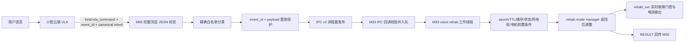

# 助力抗阻四档与语音调档整改及验收记录

日期：2026-07-17

## 1. 本轮整改范围

本轮只围绕关节 5 的助力、抗阻强度和小智高层请求链路做增量整改，没有改动 MuJoCo 轨迹规划协议、NanoPi 0x320 轨迹下发语义、蓝牙配对代码、LCD/LVGL 或 NPU 推理算法。

已完成：

1. 助力和抗阻统一为 4 挡：0.5 A、1.0 A、1.5 A、2.0 A。
2. 助力和抗阻最终电流都受 2.0 A 上限、斜坡、反馈新鲜度和电机故障门控保护。
3. Shell 可查询、升降或指定助力/抗阻挡位。
4. M55 只把可信的小智 VLA 规范化命令转换为 IPC v2 请求。
5. M33 IPC 回调只做校验和固定深度入队，独立工作线程执行安全门、所有权检查和控制调用。
6. M33 将应用结果非阻塞回传 M55，M55 关联 boot epoch、request ID、模式和关节 mask。
7. 双端增加只读 Shell 诊断，便于区分“未识别、未发布、未入队、被安全门拒绝、已应用、结果丢失”。

尚未完成：

1. 新 IPC v2 固件尚未烧录到双核真机。
2. 2.0 A 挡的人工施力、关节输出力和温升验收尚未执行。
3. 云端尚需确认能输出本文定义的 canonical VLA 字符串和 event_id。
4. App BLE NUS、LVGL 字库和 NPU 优化不属于本轮提交。

## 2. 2 A 的准确含义

2.0 A 是第 4 挡允许的最大电流，不是上电后强制输出 2.0 A，也不是助力模式的固定最小电流。

| 挡位 | 电流上限 |
|---|---:|
| 1 | 0.5 A |
| 2 | 1.0 A |
| 3 | 1.5 A |
| 4 | 2.0 A |

实际电流仍由助力/抗阻策略、力矩或速度反馈、增益、斜坡和安全门共同决定。这样可以在肌无力场景逐挡提高能力，同时避免模式刚进入就突加 2 A。

如果第 4 挡仍然“有电流但没有有效助力”，下一步应根据实测数据调整助力触发阈值和增益，而不是继续无条件抬高恒流。至少要同步记录：反馈力矩、速度、输出电流、母线电压、关节角度、电机温度和人体主观感受。

## 3. 运行链路



原始 STT 文本不会进入控制分类。M33 收到的 `MSG_TYPE_ASR_TEXT` 只用于日志，不调用模式或电机接口。

## 4. 语音命令语义

M55 只接受云端规范化后的精确字符串：

```text
rehab.set_mode joint=5 mode=assist
rehab.set_mode joint=5 mode=resist
rehab.set_mode joint=5 mode=passive
rehab.adjust_level mode=assist delta=1
rehab.adjust_level mode=assist delta=-1
rehab.adjust_level mode=resist delta=1
rehab.adjust_level mode=resist delta=-1
```

不接受不带模式的通用“提高挡位”。M55 不是关节状态权威源，必须明确提高助力挡位或提高抗阻挡位；M33 再确认当前模式相同且所有者为 VOICE。

推荐云端自然语言映射：

| 用户说法 | canonical intent |
|---|---|
| 切换到助力模式 | `rehab.set_mode joint=5 mode=assist` |
| 切换到抗阻模式 | `rehab.set_mode joint=5 mode=resist` |
| 回到被动模式/停止训练 | `rehab.set_mode joint=5 mode=passive` |
| 提高助力挡位 | `rehab.adjust_level mode=assist delta=1` |
| 降低助力挡位 | `rehab.adjust_level mode=assist delta=-1` |
| 提高抗阻挡位 | `rehab.adjust_level mode=resist delta=1` |
| 降低抗阻挡位 | `rehab.adjust_level mode=resist delta=-1` |

## 5. IPC v2 和鲁棒性规则

请求固定包含：protocol version、M55 boot epoch、单调 request ID、VOICE source、目标模式、`joint_mask=0x10`、`ttl_ms<=500` 和 action。

action 定义：

| 值 | 含义 |
|---:|---|
| 0 | 设置模式 |
| 1 | 提高一挡 |
| 2 | 降低一挡 |

主要保护：

1. M55 boot epoch 必须来自 `urandom` 且非零；随机源失败时关闭语音控制，不使用固定值兜底。
2. 同 event_id、同 payload 只处理一次；同 event_id、不同 payload 视为冲突并拒绝。
3. request ID 严格递增，溢出后拒绝继续发布。
4. 发布失败、RESULT 丢失或超时均不自动重发，避免非幂等升挡重复执行。
5. 服务器 JSON 超过 383 字节整包丢弃，不再静默截断。
6. 控制元数据只从完整 JSON 的顶层读取；嵌套 echo、重复键、超长 event_id 和残缺 JSON 不能进入控制。
7. M33 队列深度固定为 4，队列满返回 `QUEUE_FULL`，IPC 回调不调用电机或 rehab 服务。
8. M33 使用本地接收 tick 计算 TTL，不比较双核绝对 tick。
9. 新 epoch 只能在 PASSIVE 且无活动所有者时重新武装。
10. 助力和抗阻互切必须先回 PASSIVE；语音不能抢占 Shell 或 CAN 所有权。
11. 进入活动模式前检查关节 5 的反馈存在、反馈新鲜、协议、ID、标定、fault 和 mode state。
12. 活动模式仍由 NanoPi heartbeat lease 监督；心跳超时会触发受控停止。

`rt_mq_recv()` 在当前 RT-Thread 中成功返回实际消息长度，不是固定返回 `RT_EOK`。M33 新工作线程明确使用：

```c
recv_size == sizeof(item)
```

此前 ROS 队列静默丢弃问题的详细根因见 `M33_ROS命令队列静默丢弃问题根因与修复记录_20260717.md`。

## 6. Shell 诊断

M33：

```text
cmd_voice_rehab_ipc_debug
```

重点字段：

- `total/enq/invalid/qfull`：收到、入队、非法和队列满。
- `processed/applied/rejected`：工作线程消费、应用和拒绝。
- `recv_fail`：MQ 返回长度异常。
- `tx_fail`：RESULT 非阻塞回传失败。
- `last result/detail`：最近判定；调档成功时 detail 为实际挡位 1 到 4。

M55：

```text
cmd_voice_rehab_ipc_debug
```

重点字段：

- `epoch` 必须非零，否则语音控制没有启用。
- `published/tx_fail`：请求发布成功或失败。
- `duplicate/conflict/invalid`：重放、冲突和白名单拒绝。
- `received/foreign/unknown/timeout`：RESULT 关联状态。
- `last status/detail/mode/generation/rtt_ms`：最近 M33 应用结果。

## 7. 已完成的软件验证

M33：

- 语音 rehab 队列、guard、活动前置检查、挡位服务和 IPC ABI 相关测试通过。
- 完整 SCons 构建通过。
- 链接结果约为：text 477476 B、data 15532 B、bss 311944 B。

M55：

- 白名单、JSON 控制门、超长帧拒绝、重放安全发送器、voice_service 接线和 IPC ABI 相关测试通过。
- 完整 SCons 构建通过。
- 链接结果约为：text 2074452 B、data 17560 B、bss 4537176 B。

现有编译警告主要为工程原有未使用函数和 `strncpy` 截断提示，本轮没有把这些无关警告混入整改提交。

## 8. 已完成的旧固件无动作验证

四挡 Shell 路径已在 PASSIVE 下验证：助力和抗阻可在 1 到 4 挡间升降并在上下限饱和；最终状态保持 PASSIVE、输出电流 0、电机 mode 0、fault 0。

这次验证使用的是加入语音 IPC v2 运行链路之前的固件，只证明挡位服务本身可用，不证明新语音端到端链路已在真机通过。

## 9. 双核烧录顺序

IPC 协议已从 v1 升到 v2，M33 和 M55 必须成对升级。禁止只烧录一核后直接做语音动作测试。

建议顺序：

1. 机械臂置于安全位置，确认 PASSIVE、急停可用、人体离开危险方向。
2. 停止小智语音控制和 NanoPi 动作下发。
3. 先烧录 M33 v2，重启并确认 Shell、CAN、LCD 和电机反馈正常。
4. 再烧录 M55 v2，重启双核。
5. M33 自动 IPC 初始化当前关闭时，执行 `cmd_m55_ipc_start`。
6. 两边执行 `cmd_voice_rehab_ipc_debug`，确认 M55 epoch 非零且计数初值合理。
7. 先测试 PASSIVE canonical 命令，不测试助力/抗阻动作。

## 10. 端到端无动作验收

云端先输出：

```json
{"kind":"vla_command","event_id":"qa-passive-1","language_context":"rehab.set_mode joint=5 mode=passive"}
```

预期：

1. M55 `published` 增长 1。
2. M33 `total/enq/processed/applied` 各增长 1，`qfull/recv_fail` 不增长。
3. M55 `received` 增长 1，最近 status 为 `APPLIED`。
4. `rehab status` 仍为 PASSIVE，电流为 0。
5. 重放相同 event_id 和 payload 时，M55 `duplicate` 增长，但 `published` 不增长。
6. 相同 event_id 改成其他 payload 时，M55 `conflict` 增长，不能发布。
7. 只发送 STT 文本或只提供 transcript 时，不能发布 rehab 请求。

## 11. 2 A 人工施力验收

只有无动作验收全部通过后再做：

1. 确认 NanoPi heartbeat 正常，关节 5 反馈年龄小于 100 ms，协议和 ID 正确，已标定，fault 为 0。
2. 一人操作急停，一人扶持机械臂；先空载或低风险姿态，从第 1 挡开始。
3. 切换助力后确认模式所有者为 VOICE，再明确说“提高助力挡位”，每次只升一挡。
4. 每挡至少观察输出电流、关节速度、位置、反馈力矩和温度，不得连续快速升挡。
5. 第 4 挡只代表允许上限 2.0 A；应通过人工施力观察策略是否逐渐输出到需要的电流。
6. CAN 丢帧、心跳超时、反馈变旧、编码器异常、fault 非零或急停时，必须立刻回到 0 电流或 PASSIVE。
7. 抗阻模式按同样顺序验收，重点确认电流方向和人体运动方向相反，且没有突变。

通过标准：动作方向正确、每次语音只变化一挡、电流不超过当前挡位、无 HardFault、无 Shell 卡死、无 CAN bus-off，安全事件能阻断输出。

## 12. 回滚点

M33 关键提交：

- `9bc2ed2c9`：受保护电流上限提高到 2 A。
- `ba469c78f`：四挡映射。
- `673e79a41`：抗阻电流斜坡。
- `5360662cb`：助力/抗阻挡位所有权和 Shell。
- `27751cc84`：IPC v2 action 协议。
- `cc0aba93c`：固定深度语音请求队列。
- `2dce6a4dd`：安全消费线程。
- `0c6955908`：IPC 泵接线。
- `7859869c9`：M33 诊断。

M55 关键提交：

- `2972d42a`：同步 IPC v2。
- `425479e4`：精确调档白名单。
- `9b588a61`、`f06ffd64`、`44e4859f`：VLA 元数据和 JSON 截断保护。
- `e6313b18`：重放安全发送器。
- `66204710`：voice_service 运行接线。
- `5e251e04`：RESULT 超时和诊断。

出现异常时按上述小提交逐步回退，不要一次回滚四挡服务、CAN 控制和 MuJoCo 已有路径。
